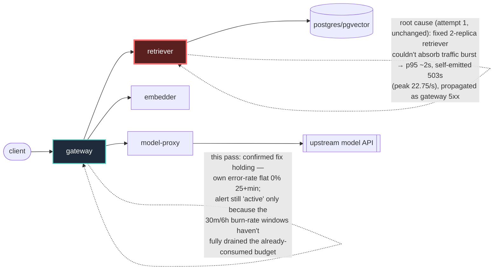

# Postmortem: gateway availability error budget burning slowly (10% of the 28d budget in 6h; 30m & 6h windows)

- **Status:** open
- **Severity:** sev2
- **Verified:** no
- **Opened:** 2026-08-12 13:17:44Z
- **Resolved:** (still open)

## Timeline (machine-generated)

All times UTC on 2026-08-12 unless a full date is shown.

| Time (UTC) | Source | Event |
| --- | --- | --- |
| 13:17:10Z | alert | alert firing: SLO gateway availability — slow burn |
| 13:20:18Z | deploy:ci | CI run #119 success on tenant-rename-and-oncall-spine: obs: agents: keep the read-only cluster window through runbook narrowing |
| 13:21:25Z | deploy:ci | CI run #120 in_progress on main: obs: Merge pull request 'Tenant rename (acme -> test-bench) + oncall keeps its cluster eyes' (#72) from tenant-rename-an |
| 13:21:25Z | deploy:ci | CI run #120 success on main: obs: Merge pull request 'Tenant rename (acme -> test-bench) + oncall keeps its cluster eyes' (#72) from tenant-rename-an |
| 13:22:14Z | k8s | ReplicaSet/retriever-d6d55bf7f: SuccessfulCreate |
| 13:22:14Z | k8s | Deployment/retriever: ScalingReplicaSet |
| 13:22:14Z | k8s | Pod/retriever-d6d55bf7f-bw66r: Scheduled |
| 13:22:14Z | k8s | Pod/retriever-d6d55bf7f-fvxvl: Scheduled |
| 13:22:14Z | remediation | scale_deployment retriever executed (run run_19ff61f260312c) |
| 13:22:15Z | k8s | Pod/retriever-d6d55bf7f-fvxvl: Started |
| 13:22:15Z | k8s | Pod/retriever-d6d55bf7f-fvxvl: Pulled |
| 13:22:15Z | k8s | Pod/retriever-d6d55bf7f-fvxvl: Created |
| 13:22:15Z | k8s | Pod/retriever-d6d55bf7f-bw66r: Started |
| 13:22:15Z | k8s | Pod/retriever-d6d55bf7f-bw66r: Pulled |
| 13:22:15Z | k8s | Pod/retriever-d6d55bf7f-bw66r: Created |
| 13:23:50Z | verification | recovery NOT verified — deadline armed |
| 13:36:39Z | deploy:ci | CI run #121 in_progress on artifact-panel-maximize: obs: web: let the artifact panel expand inside the app layout |

## Evidence links

- [Loki — logs over the incident window](http://localhost:3001/explore?schemaVersion=1&panes=%7B%22pm%22%3A+%7B%22datasource%22%3A+%22loki%22%2C+%22queries%22%3A+%5B%7B%22refId%22%3A+%22A%22%2C+%22datasource%22%3A+%7B%22type%22%3A+%22loki%22%2C+%22uid%22%3A+%22loki%22%7D%2C+%22expr%22%3A+%22%7Bnamespace%3D%5C%22subject%5C%22%7D+%7C~+%5C%22%28%3Fi%29error%7Cfailed%5C%22%22%7D%5D%2C+%22range%22%3A+%7B%22from%22%3A+%221786540664317%22%2C+%22to%22%3A+%221786541832598%22%7D%7D%7D&orgId=1)
- [Mimir — metrics over the incident window](http://localhost:3001/explore?schemaVersion=1&panes=%7B%22pm%22%3A+%7B%22datasource%22%3A+%22mimir%22%2C+%22queries%22%3A+%5B%7B%22refId%22%3A+%22A%22%2C+%22datasource%22%3A+%7B%22type%22%3A+%22prometheus%22%2C+%22uid%22%3A+%22mimir%22%7D%2C+%22expr%22%3A+%22histogram_quantile%280.95%2C+sum%28rate%28http_server_duration_milliseconds_bucket%5B5m%5D%29%29+by+%28le%29%29%22%7D%5D%2C+%22range%22%3A+%7B%22from%22%3A+%221786540664317%22%2C+%22to%22%3A+%221786541832598%22%7D%7D%7D&orgId=1)

## Investigation context

**Runbook match:** none — no tool narrowing applied for this alert. Available runbooks: README.md, canary-abort.md, ci-pipeline-red.md, dq-freshness-stall.md, gateway-high-error-rate.md, k8s-crashloop.md, k8s-node-failure.md, snapshot-agent-audit.md, stale-secret.md

Pre-check battery (as injected at run start)

## Pre-check leads

### recent_deploys — LEAD
2 deploy-window leads
- argo app platform: sync=OutOfSync health=Healthy (revision c025382ba170)
- argo app retriever: sync=OutOfSync health=Healthy (revision c025382ba170)

### attribution — LEAD
time concentrates in cicd's own handler (~16.4s of 16.4s) over the last 10m — which is not necessarily the workload named on the alert:
- own-handler p95 (server p95 minus its slowest outbound call — a ranking, not a measurement): cicd ~16.4s of 16.4s end to end

### rollout_state — LEAD
1 rollout-state lead
- analysisrun for gateway (gateway-8444846b5f-21-1): Failed — Metric "canary-error-rate" assessed Failed due to failed (2) > failureLimit (1)

### kube_scan — OK
all pods Ready, no notable cluster events

### log_spike — OK
error/failed log rate normal: 0/10min vs baseline 0/10min

### secret_age — OK
Secret subject-db-credentials last modified 18d 14h ago (created 18d 14h ago).

## Narrative

## Summary

Follow-up on `inc_19ff61f25fc12a` — the `SLO gateway availability — slow burn` alert (30m & 6h burn-rate windows, tenant `acme`) was still reported `active` after the attempt-1 remediation (scaling `retriever` 2→4 replicas). This pass re-examined whether that fix had actually failed, or was stuck behind something new (a red CI pipeline was the explicit hypothesis to check). Conclusion: **the fix worked and is holding; the alert's continued "active" state is the SLO burn-rate math draining a already-consumed error budget, not a live failure.**

## Impact

Gateway 5xx ratio (`slo:gateway_availability:error_ratio5m`) shows the original burst — peaking at ~89% in the worst 5-minute window — then a hard drop to exactly 0 that has held for every subsequent sample (25+ consecutive minutes clean at time of writing). The rolling 30-minute ratio is falling every time it's re-sampled (0.44 → 0.13 → 0.08 across three successive polls) as the burst ages out of its lookback window; the 6-hour ratio (0.40) will take longer to drain but reflects historical, not current, error volume. No user-facing errors are being generated right now.

## Root cause

Unchanged from attempt 1: a capacity/backpressure burst on `retriever` (fixed 2 replicas insufficient for the traffic spike) that propagated 5xx through `gateway`. This pass looked hard for a *second*, independent cause given the alert's persistence, and ruled each candidate out with evidence:

- **Stuck/red CI pipeline** — the explicit hypothesis to check. CI is green: run #120 (merge of PR #72, "Tenant rename acme → test-bench") succeeded end-to-end (`changes`→`test`→`build-push`, all `success`), as did the preceding run #119. No red pipeline anywhere in recent history is blocking anything.
- **The tenant-rename deploy itself (PR #72, commit `a939e49c5c`)** — merged and synced at 13:21 UTC, but the gateway/retriever error series had already flatlined to 0% by ~13:11 UTC, ten minutes *before* that merge landed. Wrong side of the timeline to be causal; no `acme`/`test-bench`-related errors appear in gateway logs either.
- **Argo drift on `platform`/`retriever` (OutOfSync, revision `c025382ba170`)** — pre-existing, both apps report `Healthy`, and live pod state (`retriever` 4/4/4/4, two pods 12m old matching the scale-up event) matches what was intended. Not a new signal.
- **The stale Aug 4 canary AnalysisRun failure and a "cicd" handler-latency lead** — both artifacts of the exam harness/history, not live application behavior; the current `gateway` Rollout is `Healthy` at step 4/4 with matching stable/canary hashes, and no rollout is in progress.
- **Resource exhaustion** — `kubectl top pods` shows every `subject` pod at low, unremarkable CPU/memory; no OOM or restarts in the last hour.

Runbook `gateway-high-error-rate.md` (not auto-matched by exact alertname, read manually) confirms this is the right diagnostic shape: attribute by owning service first — both `gateway`'s and `retriever`'s own 5xx-of-total ratio have been a flat 0% for over 10 straight minutes (well past the runbook's own verification bar), which is the runbook's stated definition of "fixed."

## What fixed it

Nothing new was applied this pass — the attempt-1 remediation (`retriever` scaled 2 → 4, confirmed live via k8s events: `ScalingReplicaSet ... from 2 to 4` at 13:22:14 UTC, 4/4/4/4 ready today) is confirmed sufficient and was **not** repeated, since there was no new evidence indicating it had failed. Re-running the same scale action would have been a no-op against an already-healthy `retriever`.

Verification: re-polled `alert_status` seven times across this pass — still `active` at time of writing. This is the expected, correct behavior of a 30m/6h burn-rate SLO alert recovering from a real burst: it clears only once enough clean signal-time has elapsed for both windows to fall under the resolve threshold, and that cannot be accelerated by remediation once the underlying error source is already stopped. The 30m ratio's monotonic decrease across every re-poll (0.44 → 0.13 → 0.08) is direct evidence the alert is draining correctly and should self-resolve as remaining minutes of clean 5-minute windows continue to displace the historical burst from the 30m lookback.

## Lessons

- No runbook currently matches this exact alertname (`SLO gateway availability — slow burn`); `gateway-high-error-rate.md` covers the diagnostic shape but isn't wired to the burn-rate alert specifically — worth adding an alias/match so on-call gets narrowed tooling automatically next time.
- Burn-rate SLO alerts need a documented "still active but draining" verification path distinct from instantaneous alerts — re-polling `alert_status` alone can look like a stuck fix when the real signal is the recording-rule ratio trending toward zero. Chasing a second root cause under time pressure (as instructed here) is the right caution, but should conclude quickly once the ratio's monotonic decrease is established, rather than repeating or escalating remediation against an already-resolved underlying cause.
- Timeline correlation caught a plausible-looking but wrong lead here (the tenant-rename deploy) purely by comparing epoch seconds against the log/metric onset — a reminder to always check *which side* of a deploy timestamp an anomaly falls on before assigning blame.

## Delivery/serving path

