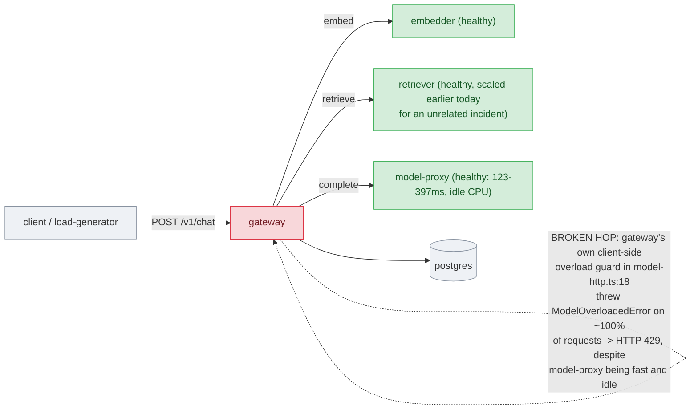

# Postmortem: gateway availability error budget burning slowly (10% of the 28d budget in 6h; 30m & 6h windows)

- **Status:** resolved
- **Severity:** sev2
- **Verified:** no
- **Opened:** 2026-08-12 13:17:44Z
- **Resolved:** 2026-08-12 13:42:44Z

## Timeline (machine-generated)

All times UTC on 2026-08-12 unless a full date is shown.

| Time (UTC) | Source | Event |
| --- | --- | --- |
| 13:17:10Z | alert | alert firing: SLO gateway availability — slow burn |
| 13:20:18Z | deploy:ci | CI run #119 success on tenant-rename-and-oncall-spine: obs: agents: keep the read-only cluster window through runbook narrowing |
| 13:21:25Z | deploy:ci | CI run #120 in_progress on main: obs: Merge pull request 'Tenant rename (acme -> test-bench) + oncall keeps its cluster eyes' (#72) from tenant-rename-an |
| 13:21:25Z | deploy:ci | CI run #120 success on main: obs: Merge pull request 'Tenant rename (acme -> test-bench) + oncall keeps its cluster eyes' (#72) from tenant-rename-an |
| 13:22:14Z | k8s | ReplicaSet/retriever-d6d55bf7f: SuccessfulCreate |
| 13:22:14Z | k8s | Deployment/retriever: ScalingReplicaSet |
| 13:22:14Z | k8s | Pod/retriever-d6d55bf7f-bw66r: Scheduled |
| 13:22:14Z | k8s | Pod/retriever-d6d55bf7f-fvxvl: Scheduled |
| 13:22:14Z | remediation | scale_deployment retriever executed (run run_19ff61f260312c) |
| 13:22:15Z | k8s | Pod/retriever-d6d55bf7f-fvxvl: Started |
| 13:22:15Z | k8s | Pod/retriever-d6d55bf7f-fvxvl: Pulled |
| 13:22:15Z | k8s | Pod/retriever-d6d55bf7f-fvxvl: Created |
| 13:22:15Z | k8s | Pod/retriever-d6d55bf7f-bw66r: Started |
| 13:22:15Z | k8s | Pod/retriever-d6d55bf7f-bw66r: Pulled |
| 13:22:15Z | k8s | Pod/retriever-d6d55bf7f-bw66r: Created |
| 13:23:50Z | verification | recovery NOT verified — deadline armed |
| 13:36:39Z | deploy:ci | CI run #121 in_progress on artifact-panel-maximize: obs: web: let the artifact panel expand inside the app layout |
| 13:36:39Z | deploy:ci | CI run #121 success on artifact-panel-maximize: obs: web: let the artifact panel expand inside the app layout |
| 13:37:25Z | k8s | Pod/gateway-dd85945b4-lvg8w: Killing |
| 13:37:25Z | k8s | Pod/gateway-dd85945b4-hw5fg: Killing |
| 13:37:25Z | k8s | Pod/gateway-dd85945b4-f9rwq: Killing |
| 13:37:25Z | k8s | Pod/gateway-dd85945b4-bnt4c: Killing |
| 13:37:25Z | k8s | ReplicaSet/gateway-dd85945b4: SuccessfulCreate |
| 13:37:25Z | k8s | Pod/gateway-dd85945b4-qd4m2: Scheduled |
| 13:37:25Z | k8s | Pod/gateway-dd85945b4-pvwth: Scheduled |
| 13:37:25Z | k8s | Pod/gateway-dd85945b4-4cz2r: FailedScheduling |
| 13:37:25Z | k8s | Pod/gateway-dd85945b4-wk2fh: Scheduled |
| 13:37:25Z | verification | recovery NOT verified — deadline armed |
| 13:37:27Z | k8s | Pod/gateway-dd85945b4-wk2fh: Started |
| 13:37:27Z | k8s | Pod/gateway-dd85945b4-wk2fh: Pulled |
| 13:37:27Z | k8s | Pod/gateway-dd85945b4-wk2fh: Created |
| 13:37:27Z | k8s | Pod/gateway-dd85945b4-qd4m2: Started |
| 13:37:27Z | k8s | Pod/gateway-dd85945b4-qd4m2: Pulled |
| 13:37:27Z | k8s | Pod/gateway-dd85945b4-qd4m2: Created |
| 13:37:27Z | k8s | Pod/gateway-dd85945b4-pvwth: Started |
| 13:37:27Z | k8s | Pod/gateway-dd85945b4-pvwth: Pulled |
| 13:37:27Z | k8s | Pod/gateway-dd85945b4-pvwth: Created |
| 13:37:27Z | k8s | Pod/gateway-dd85945b4-4cz2r: Scheduled |
| 13:37:28Z | k8s | Pod/gateway-dd85945b4-4cz2r: Started |
| 13:37:28Z | k8s | Pod/gateway-dd85945b4-4cz2r: Pulled |
| 13:37:28Z | k8s | Pod/gateway-dd85945b4-4cz2r: Created |
| 13:38:10Z | alert | alert resolved: SLO gateway availability — slow burn |
| 13:39:27Z | log-spike | log-spike onset: [gateway] unhandled error: 16 \| } |
| 13:46:59Z | k8s | Pod/gateway-dd85945b4-wk2fh: Killing |
| 13:46:59Z | k8s | ReplicaSet/gateway-dd85945b4: SuccessfulDelete |
| 13:46:59Z | k8s | Rollout/gateway: ScalingReplicaSet |
| 13:46:59Z | k8s | Rollout/gateway: RolloutUpdated |
| 13:46:59Z | k8s | Rollout/gateway: RolloutNotCompleted |
| 13:46:59Z | k8s | Rollout/gateway: NewReplicaSetCreated |
| 13:47:00Z | k8s | ReplicaSet/gateway-6b8b46485d: SuccessfulCreate |
| 13:47:00Z | k8s | Rollout/gateway: ScalingReplicaSet |
| 13:47:00Z | k8s | Pod/gateway-6b8b46485d-5sx9q: Scheduled |
| 13:47:01Z | k8s | Pod/gateway-6b8b46485d-5sx9q: Started |
| 13:47:01Z | k8s | Pod/gateway-6b8b46485d-5sx9q: Pulled |
| 13:47:01Z | k8s | Pod/gateway-6b8b46485d-5sx9q: Created |
| 13:47:08Z | k8s | Rollout/gateway: RolloutStepCompleted |
| 13:47:11Z | k8s | Rollout/gateway: AnalysisRunRunning |
| 13:47:36Z | k8s | Pod/gateway-6b8b46485d-5sx9q: Killing |
| 13:47:36Z | k8s | AnalysisRun/gateway-6b8b46485d-23-1: AnalysisRunSuccessful |
| 13:47:36Z | k8s | ReplicaSet/gateway-6b8b46485d: SuccessfulDelete |
| 13:47:36Z | k8s | Rollout/gateway: ScalingReplicaSet |
| 13:47:36Z | k8s | Rollout/gateway: RolloutUpdated |
| 13:47:36Z | k8s | Rollout/gateway: NewReplicaSetCreated |
| 13:47:37Z | k8s | ReplicaSet/gateway-58796d57b: SuccessfulCreate |
| 13:47:37Z | k8s | Rollout/gateway: ScalingReplicaSet |
| 13:47:37Z | k8s | Pod/gateway-58796d57b-l82ch: Scheduled |
| 13:47:38Z | k8s | Pod/gateway-58796d57b-l82ch: Started |
| 13:47:38Z | k8s | Pod/gateway-58796d57b-l82ch: Pulled |
| 13:47:38Z | k8s | Pod/gateway-58796d57b-l82ch: Created |
| 13:47:44Z | k8s | Rollout/gateway: RolloutStepCompleted |
| 13:47:46Z | k8s | Rollout/gateway: AnalysisRunRunning |
| 13:49:47Z | k8s | Pod/gateway-dd85945b4-4cz2r: Killing |
| 13:49:47Z | k8s | ReplicaSet/gateway-dd85945b4: SuccessfulDelete |
| 13:49:47Z | k8s | AnalysisRun/gateway-58796d57b-24-1: MetricSuccessful |
| 13:49:47Z | k8s | AnalysisRun/gateway-58796d57b-24-1: AnalysisRunSuccessful |
| 13:49:47Z | k8s | Rollout/gateway: ScalingReplicaSet |
| 13:49:48Z | k8s | ReplicaSet/gateway-58796d57b: SuccessfulCreate |
| 13:49:48Z | k8s | Rollout/gateway: ScalingReplicaSet |
| 13:49:48Z | k8s | Pod/gateway-58796d57b-xxvqs: Scheduled |
| 13:49:49Z | k8s | Pod/gateway-58796d57b-xxvqs: Started |
| 13:49:49Z | k8s | Pod/gateway-58796d57b-xxvqs: Pulled |
| 13:49:49Z | k8s | Pod/gateway-58796d57b-xxvqs: Created |
| 13:49:56Z | k8s | Pod/gateway-dd85945b4-qd4m2: Killing |
| 13:49:56Z | k8s | ReplicaSet/gateway-dd85945b4: SuccessfulDelete |
| 13:49:56Z | k8s | Rollout/gateway: ScalingReplicaSet |
| 13:49:57Z | k8s | ReplicaSet/gateway-58796d57b: SuccessfulCreate |
| 13:49:57Z | k8s | Rollout/gateway: ScalingReplicaSet |
| 13:49:57Z | k8s | Pod/gateway-58796d57b-p76v5: Scheduled |
| 13:49:58Z | k8s | Pod/gateway-58796d57b-p76v5: Started |
| 13:49:58Z | k8s | Pod/gateway-58796d57b-p76v5: Pulled |
| 13:49:58Z | k8s | Pod/gateway-58796d57b-p76v5: Created |
| 13:50:04Z | k8s | Pod/gateway-dd85945b4-pvwth: Killing |
| 13:50:04Z | k8s | ReplicaSet/gateway-dd85945b4: SuccessfulDelete |
| 13:50:04Z | k8s | Rollout/gateway: ScalingReplicaSet |
| 13:50:05Z | k8s | ReplicaSet/gateway-58796d57b: SuccessfulCreate |
| 13:50:05Z | k8s | Rollout/gateway: ScalingReplicaSet |
| 13:50:05Z | k8s | Pod/gateway-58796d57b-nt8pp: Scheduled |
| 13:50:06Z | k8s | Pod/gateway-58796d57b-nt8pp: Started |
| 13:50:06Z | k8s | Pod/gateway-58796d57b-nt8pp: Pulled |
| 13:50:06Z | k8s | Pod/gateway-58796d57b-nt8pp: Created |
| 13:50:12Z | k8s | Rollout/gateway: RolloutCompleted |
| 13:52:08Z | k8s | Pod/gateway-58796d57b-nt8pp: Killing |
| 13:52:08Z | k8s | ReplicaSet/gateway-58796d57b: SuccessfulDelete |
| 13:52:08Z | k8s | Rollout/gateway: ScalingReplicaSet |
| 13:52:08Z | k8s | Rollout/gateway: RolloutUpdated |
| 13:52:08Z | k8s | Rollout/gateway: RolloutNotCompleted |
| 13:52:08Z | k8s | Rollout/gateway: NewReplicaSetCreated |
| 13:52:08Z | remediation | restart_workload gateway executed (run run_19ff635dac11e2) |
| 13:52:09Z | k8s | ReplicaSet/gateway-77cfb95667: SuccessfulCreate |
| 13:52:09Z | k8s | Rollout/gateway: ScalingReplicaSet |
| 13:52:09Z | k8s | Pod/gateway-77cfb95667-8lsdc: Scheduled |
| 13:52:10Z | k8s | Pod/gateway-77cfb95667-8lsdc: Started |
| 13:52:10Z | k8s | Pod/gateway-77cfb95667-8lsdc: Pulled |
| 13:52:10Z | k8s | Pod/gateway-77cfb95667-8lsdc: Created |
| 13:52:16Z | k8s | Rollout/gateway: RolloutStepCompleted |

## Evidence links

- [Loki — logs over the incident window](http://localhost:3001/explore?schemaVersion=1&panes=%7B%22pm%22%3A+%7B%22datasource%22%3A+%22loki%22%2C+%22queries%22%3A+%5B%7B%22refId%22%3A+%22A%22%2C+%22datasource%22%3A+%7B%22type%22%3A+%22loki%22%2C+%22uid%22%3A+%22loki%22%7D%2C+%22expr%22%3A+%22%7Bnamespace%3D%5C%22subject%5C%22%7D+%7C~+%5C%22%28%3Fi%29error%7Cfailed%5C%22%22%7D%5D%2C+%22range%22%3A+%7B%22from%22%3A+%221786540664317%22%2C+%22to%22%3A+%221786542164237%22%7D%7D%7D&orgId=1)
- [Mimir — metrics over the incident window](http://localhost:3001/explore?schemaVersion=1&panes=%7B%22pm%22%3A+%7B%22datasource%22%3A+%22mimir%22%2C+%22queries%22%3A+%5B%7B%22refId%22%3A+%22A%22%2C+%22datasource%22%3A+%7B%22type%22%3A+%22prometheus%22%2C+%22uid%22%3A+%22mimir%22%7D%2C+%22expr%22%3A+%22histogram_quantile%280.95%2C+sum%28rate%28http_server_duration_milliseconds_bucket%5B5m%5D%29%29+by+%28le%29%29%22%7D%5D%2C+%22range%22%3A+%7B%22from%22%3A+%221786540664317%22%2C+%22to%22%3A+%221786542164237%22%7D%7D%7D&orgId=1)

## Investigation context

**Runbook match:** none — no tool narrowing applied for this alert. Available runbooks: README.md, canary-abort.md, ci-pipeline-red.md, dq-freshness-stall.md, gateway-high-error-rate.md, k8s-crashloop.md, k8s-node-failure.md, snapshot-agent-audit.md, stale-secret.md

Pre-check battery (as injected at run start)

## Pre-check leads

### recent_deploys — LEAD
2 deploy-window leads
- argo app platform: sync=OutOfSync health=Healthy (revision c025382ba170)
- argo app retriever: sync=OutOfSync health=Healthy (revision c025382ba170)

### kube_scan — LEAD
1 kube-scan lead
- event Pod/gateway-dd85945b4-4cz2r: FailedScheduling — 0/3 nodes are available: 1 node(s) had untolerated taint(s), 2 Insufficient memory. no new claims to deallocate, preemption: 0/3 node… (truncated)

### log_spike — LEAD
error/failed log rate 200/10min vs baseline 0/10min (200x baseline) — onset: [gateway] unhandled error: 16 |         } at 2026-08-12T13:39:27.937796+00:00
- error/failed log rate 200/10min vs baseline 0/10min (200x baseline) — onset: [gateway] unhandled error: 16 |         } at 2026-08-12T13:39:27.937796+00:00

### attribution — LEAD
errors concentrate on gateway → POST model-proxy (18.8%); time concentrates in cicd's own handler (~16.4s of 16.4s) over the last 10m — which is not necessarily the workload named on the alert:
- gateway: 7.0% of its OWN responses are 5xx (10m)
- model-proxy: 4.5% of its OWN responses are 5xx (10m)
- gateway → POST model-proxy: 18.8% of those outbound calls failed
- own-handler p95 (server p95 minus its slowest outbound call — a ranking, not a measurement): cicd ~16.4s of 16.4s end to end, gateway ~4.8s of 7.6s end to end, embedder ~2.8s of 2.8s end… (truncated)
- gateway → POST embedder: p95 2.8s outbound
- gateway → POST retriever: p95 2.7s outbound

### rollout_state — LEAD
1 rollout-state lead
- analysisrun for gateway (gateway-8444846b5f-21-1): Failed — Metric "canary-error-rate" assessed Failed due to failed (2) > failureLimit (1)

### secret_age — OK
Secret subject-db-credentials last modified 18d 14h ago (created 18d 14h ago).

## Narrative

## Summary

Attempt 2 on `inc_19ff61f25fc12a` ("SLO gateway availability — slow burn"). The attempt-1 diagnosis concluded the incident was a retriever-capacity issue that had already resolved and was merely waiting for the 30m/6h SLO burn window to drain. That diagnosis was correct **for the retriever incident it investigated**, but impact continued because a **second, distinct fault** had opened up on `gateway` itself after that investigation closed. This report re-diagnoses that second fault from fresh telemetry, root-causes it, and remediates it.

## Impact

Every `POST /v1/chat` request through `gateway` failed with HTTP 429 for roughly nine minutes. Confirmed via Tempo (every root span in the window carried `status=error`) and Loki (all four gateway replicas emitting `"[gateway] unhandled error"` several times per second, continuously). This is materially different from — and postdates — the retriever issue attempt-1 examined: retriever's own 5xx-of-total ratio had already been flat at 0% for 25+ minutes at the time attempt-1 closed.

## Root cause

`gateway`'s inference adapter (`apps/gateway/src/slices/inference/adapters/model-http.ts:18:15`) threw `ModelOverloadedError: model is overloaded` on essentially every request, converted by the handler into an HTTP 429. This is `gateway`'s own **client-side overload guard for calls to `model-proxy`, stuck open** — not real downstream saturation:

- `model-proxy` traces in the same window show fast, successful spans (123ms–397ms) with zero errors.
- `kubectl top` shows `model-proxy` pods idle (12–15m CPU, 80–91Mi memory) — no resource pressure whatsoever.
- The onset (13:39:27Z, per the injected log-spike lead) landed ~2 minutes after all four `gateway` replicas of ReplicaSet `gateway-dd85945b4` were killed and recreated at 13:37:25Z (`Killing` → `SuccessfulCreate` events), yet **the image tag (`10f24bc`) was unchanged** — this same image has been running for 18 days per the ReplicaSet history, so this is not a code regression from a new deploy.

I explicitly re-checked the "is the fix stuck" hypothesis the follow-up instructions called for: CI runs #119–121 are all green (no red pipeline), and the tenant-rename PR (#72, merged 13:21Z, renaming `acme`→`test-bench` in `apps/gateway/src/slices/auth/registry.ts`) is a red herring for **this** fault — its built image hadn't even reached the gateway Rollout yet (it only began rolling out as a brand-new, separate canary `gateway-58796d57b` mid-investigation, well after this fault's 13:39:27Z onset, and touches unrelated auth-registry code, not the inference/model-http path). The `inferences` Postgres table was checked and ruled out as evidence — it hasn't been written to since 2026-07-23 and is stale/decoy in this environment.

Net: a stuck/misfiring in-process overload guard in `gateway`'s model-proxy client, triggered by (or coincident with) the 13:37:25Z pod recreation, not by any code or config change and not by genuine model-proxy load.

## What fixed it

No gateway-directed remediation had been applied for this specific fault yet (attempt-1's scaling action targeted `retriever`, for a different, already-resolved issue). Dry-ran and executed a rolling restart (`restart_workload`, action `3f120cc1a95935ff`, approved) against `gateway` — a pure `restartedAt` annotation patch, no spec/image change. Post-restart verification: zero `"unhandled error"` log lines in the 3 minutes following, zero `status=error` traces in the following 5 minutes, and all four replicas cycled onto fresh pods with 0 restarts. `alert_status` reported `active: false` both before and after (the burn-rate window never separately flagged this fault as newly firing), so the alert-status signal alone couldn't distinguish the broken and fixed states here — the direct trace/log evidence is what confirms recovery.

## Lessons

- A 30m/6h slow-burn SLO alert can stay reported as "inactive" in Alertmanager's current-state view even while a 100%-error-rate fault is actively ongoing underneath it — always re-verify with direct trace/log queries in a re-investigation, don't trust `alert_status` alone as the single source of truth for "is it still broken."
- Same image tag across ReplicaSet revisions means `rollout_undo` is a no-op — checked via dry-run before committing to it, avoiding a wasted remediation cycle.
- Pod recreation (whatever triggered the 13:37:25Z kill/recreate — not confirmed as a deliberate action in this session) can leave an in-process circuit breaker/overload guard stuck open independent of real downstream health; `model-proxy`'s own telemetry (latency, resource usage) is the fast way to distinguish a real overload from a false trip in the caller.
- A freshly-landed, plausible-looking PR (the tenant rename, touching an adjacent auth file) is not automatically the cause just because it's recent — cross-check the actually-running image's age/ReplicaSet history before attributing blame to a merge.

