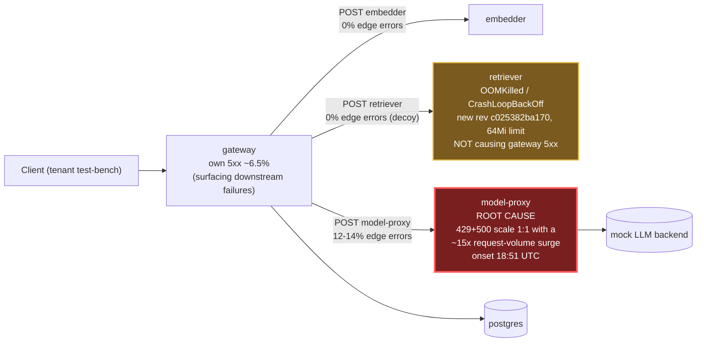

# Postmortem: gateway 5xx rate above 2%

- **Status:** open
- **Severity:** sev1
- **Verified:** no
- **Opened:** 2026-08-12 18:53:40Z
- **Resolved:** (still open)

## Timeline (machine-generated)

All times UTC on 2026-08-12 unless a full date is shown.

| Time (UTC) | Source | Event |
| --- | --- | --- |
| 18:51:10Z | log-spike | log-spike onset: error: Malformed JSON in request body |
| 18:53:10Z | alert | alert firing: Gateway 5xx rate > 2% |
| 19:01:02Z | k8s | Pod/retriever-7b8cbbdbf5-pkjmd: Scheduled |
| 19:01:02Z | k8s | Pod/retriever-7b8cbbdbf5-6ptpg: Scheduled |
| 19:01:03Z | k8s | Pod/retriever-7b8cbbdbf5-pkjmd: Pulled |
| 19:01:03Z | k8s | Pod/retriever-7b8cbbdbf5-pkjmd: Created |
| 19:01:04Z | k8s | Pod/retriever-7b8cbbdbf5-pkjmd: Started |
| 19:01:04Z | k8s | Pod/retriever-7b8cbbdbf5-6ptpg: Started |
| 19:01:04Z | k8s | Pod/retriever-7b8cbbdbf5-6ptpg: Pulled |
| 19:01:04Z | k8s | Pod/retriever-7b8cbbdbf5-6ptpg: Created |
| 19:01:06Z | k8s | Pod/retriever-7b8cbbdbf5-pkjmd: Started |
| 19:01:06Z | k8s | Pod/retriever-7b8cbbdbf5-pkjmd: Pulled |
| 19:01:06Z | k8s | Pod/retriever-7b8cbbdbf5-pkjmd: Created |
| 19:01:07Z | k8s | Pod/retriever-7b8cbbdbf5-6ptpg: Started |
| 19:01:07Z | k8s | Pod/retriever-7b8cbbdbf5-6ptpg: Pulled |
| 19:01:07Z | k8s | Pod/retriever-7b8cbbdbf5-6ptpg: Created |
| 19:01:08Z | k8s | Pod/retriever-7b8cbbdbf5-pkjmd: BackOff |
| 19:01:09Z | k8s | Pod/retriever-7b8cbbdbf5-pkjmd: BackOff |
| 19:01:10Z | k8s | Pod/retriever-7b8cbbdbf5-6ptpg: BackOff |
| 19:01:13Z | k8s | Pod/retriever-7b8cbbdbf5-pkjmd: BackOff |
| 19:01:13Z | k8s | Pod/retriever-7b8cbbdbf5-6ptpg: BackOff |
| 19:01:18Z | k8s | Pod/retriever-7b8cbbdbf5-pkjmd: Started |
| 19:01:18Z | k8s | Pod/retriever-7b8cbbdbf5-pkjmd: Pulled |
| 19:01:18Z | k8s | Pod/retriever-7b8cbbdbf5-pkjmd: Created |
| 19:01:18Z | remediation | restart_workload model-proxy executed (run run_19ff752b3e23) |
| 19:01:19Z | k8s | Rollout/model-proxy: RolloutUpdated |
| 19:01:19Z | k8s | Rollout/model-proxy: RolloutNotCompleted |
| 19:01:19Z | k8s | Rollout/model-proxy: NewReplicaSetCreated |
| 19:01:20Z | k8s | Pod/retriever-7b8cbbdbf5-pkjmd: BackOff |
| 19:01:20Z | k8s | ReplicaSet/model-proxy-77457658bc: SuccessfulCreate |
| 19:01:20Z | k8s | Pod/model-proxy-554d76745d-6f2p5: Killing |
| 19:01:20Z | k8s | ReplicaSet/model-proxy-554d76745d: SuccessfulDelete |
| 19:01:20Z | k8s | Rollout/model-proxy: ScalingReplicaSet |
| 19:01:20Z | k8s | Pod/model-proxy-77457658bc-5q9ts: Scheduled |
| 19:01:21Z | k8s | Pod/retriever-7b8cbbdbf5-pkjmd: BackOff |
| 19:01:21Z | k8s | Pod/retriever-7b8cbbdbf5-6ptpg: Started |
| 19:01:21Z | k8s | Pod/retriever-7b8cbbdbf5-6ptpg: Pulled |
| 19:01:21Z | k8s | Pod/retriever-7b8cbbdbf5-6ptpg: Created |
| 19:01:21Z | k8s | Pod/model-proxy-77457658bc-5q9ts: Started |
| 19:01:21Z | k8s | Pod/model-proxy-77457658bc-5q9ts: Pulled |
| 19:01:21Z | k8s | Pod/model-proxy-77457658bc-5q9ts: Created |
| 19:01:23Z | k8s | Pod/retriever-7b8cbbdbf5-pkjmd: BackOff |
| 19:01:23Z | k8s | Pod/retriever-7b8cbbdbf5-6ptpg: BackOff |
| 19:01:24Z | k8s | Pod/retriever-7b8cbbdbf5-6ptpg: BackOff |
| 19:01:28Z | k8s | Rollout/model-proxy: RolloutStepCompleted |
| 19:01:30Z | k8s | Rollout/model-proxy: AnalysisRunRunning |
| 19:01:33Z | k8s | Pod/retriever-7b8cbbdbf5-6ptpg: BackOff |
| 19:01:44Z | k8s | Pod/retriever-7b8cbbdbf5-pkjmd: Started |
| 19:01:44Z | k8s | Pod/retriever-7b8cbbdbf5-pkjmd: Pulled |
| 19:01:44Z | k8s | Pod/retriever-7b8cbbdbf5-pkjmd: Created |
| 19:01:45Z | k8s | Pod/retriever-7b8cbbdbf5-pkjmd: BackOff |
| 19:01:46Z | k8s | Pod/retriever-7b8cbbdbf5-pkjmd: BackOff |
| 19:01:46Z | k8s | Pod/retriever-7b8cbbdbf5-6ptpg: Started |
| 19:01:46Z | k8s | Pod/retriever-7b8cbbdbf5-6ptpg: Pulled |
| 19:01:46Z | k8s | Pod/retriever-7b8cbbdbf5-6ptpg: Created |
| 19:01:48Z | k8s | Pod/retriever-7b8cbbdbf5-6ptpg: BackOff |
| 19:01:53Z | k8s | Pod/retriever-7b8cbbdbf5-pkjmd: BackOff |
| 19:01:53Z | k8s | Pod/retriever-7b8cbbdbf5-6ptpg: BackOff |
| 19:02:08Z | k8s | ReplicaSet/gateway-8fd65cbf: SuccessfulCreate |
| 19:02:08Z | k8s | Deployment/gateway: ScalingReplicaSet |
| 19:02:08Z | k8s | Pod/gateway-8fd65cbf-x6qqb: Scheduled |
| 19:02:09Z | k8s | Pod/gateway-8fd65cbf-x6qqb: Started |
| 19:02:09Z | k8s | Pod/gateway-8fd65cbf-x6qqb: Pulled |
| 19:02:09Z | k8s | Pod/gateway-8fd65cbf-x6qqb: Created |
| 19:02:09Z | k8s | Pod/gateway-8fd65cbf-c6kl5: Pulled |
| 19:02:09Z | k8s | Pod/gateway-8fd65cbf-c6kl5: Created |
| 19:02:09Z | k8s | Pod/gateway-8fd65cbf-9nk88: Started |
| 19:02:09Z | k8s | Pod/gateway-8fd65cbf-9nk88: Pulled |
| 19:02:09Z | k8s | Pod/gateway-8fd65cbf-9nk88: Created |
| 19:02:09Z | k8s | ReplicaSet/gateway-8fd65cbf: SuccessfulCreate |
| 19:02:09Z | k8s | Pod/gateway-8fd65cbf-c6kl5: Scheduled |
| 19:02:09Z | k8s | Pod/gateway-8fd65cbf-kxqbn: FailedScheduling |
| 19:02:09Z | k8s | Pod/gateway-8fd65cbf-n7m2x: FailedScheduling |
| 19:02:09Z | k8s | Pod/gateway-8fd65cbf-9nk88: Scheduled |
| 19:02:09Z | k8s | Pod/gateway-8fd65cbf-ztnzx: FailedScheduling |
| 19:02:10Z | k8s | Pod/gateway-8fd65cbf-c6kl5: Started |
| 19:02:30Z | k8s | Pod/retriever-7b8cbbdbf5-pkjmd: Started |
| 19:02:30Z | k8s | Pod/retriever-7b8cbbdbf5-pkjmd: Pulled |
| 19:02:30Z | k8s | Pod/retriever-7b8cbbdbf5-pkjmd: Created |
| 19:02:32Z | k8s | Pod/retriever-7b8cbbdbf5-pkjmd: BackOff |
| 19:02:33Z | k8s | Pod/retriever-7b8cbbdbf5-pkjmd: BackOff |
| 19:02:34Z | k8s | Pod/retriever-7b8cbbdbf5-pkjmd: BackOff |
| 19:02:36Z | k8s | Pod/retriever-7b8cbbdbf5-6ptpg: Started |
| 19:02:36Z | k8s | Pod/retriever-7b8cbbdbf5-6ptpg: Pulled |
| 19:02:36Z | k8s | Pod/retriever-7b8cbbdbf5-6ptpg: Created |
| 19:02:37Z | k8s | Pod/retriever-7b8cbbdbf5-6ptpg: BackOff |
| 19:02:38Z | k8s | Pod/retriever-7b8cbbdbf5-6ptpg: BackOff |
| 19:02:43Z | k8s | Pod/retriever-7b8cbbdbf5-6ptpg: BackOff |
| 19:03:16Z | k8s | Pod/gateway-8fd65cbf-x6qqb: Killing |
| 19:03:16Z | k8s | Pod/gateway-8fd65cbf-c6kl5: Killing |
| 19:03:16Z | k8s | Pod/gateway-8fd65cbf-9nk88: Killing |
| 19:03:16Z | k8s | ReplicaSet/gateway-8fd65cbf: SuccessfulDelete |
| 19:03:16Z | k8s | Deployment/gateway: ScalingReplicaSet |

## Evidence links

- [Loki — logs over the incident window](http://localhost:3001/explore?schemaVersion=1&panes=%7B%22pm%22%3A+%7B%22datasource%22%3A+%22loki%22%2C+%22queries%22%3A+%5B%7B%22refId%22%3A+%22A%22%2C+%22datasource%22%3A+%7B%22type%22%3A+%22loki%22%2C+%22uid%22%3A+%22loki%22%7D%2C+%22expr%22%3A+%22%7Bnamespace%3D%5C%22subject%5C%22%7D+%7C~+%5C%22%28%3Fi%29error%7Cfailed%5C%22%22%7D%5D%2C+%22range%22%3A+%7B%22from%22%3A+%221786560820166%22%2C+%22to%22%3A+%221786561414871%22%7D%7D%7D&orgId=1)
- [Mimir — metrics over the incident window](http://localhost:3001/explore?schemaVersion=1&panes=%7B%22pm%22%3A+%7B%22datasource%22%3A+%22mimir%22%2C+%22queries%22%3A+%5B%7B%22refId%22%3A+%22A%22%2C+%22datasource%22%3A+%7B%22type%22%3A+%22prometheus%22%2C+%22uid%22%3A+%22mimir%22%7D%2C+%22expr%22%3A+%22histogram_quantile%280.95%2C+sum%28rate%28http_server_duration_milliseconds_bucket%5B5m%5D%29%29+by+%28le%29%29%22%7D%5D%2C+%22range%22%3A+%7B%22from%22%3A+%221786560820166%22%2C+%22to%22%3A+%221786561414871%22%7D%7D%7D&orgId=1)

## Investigation context

**Runbook match (2):** `gateway-high-error-rate.md`, `stale-secret.md` — toolset narrowed to 14 tools: alert_status, deploy_history, k8s_events, kubectl_read, loki_query, mimir_query, publish_postmortem, request_approval, restart_workload, runbook_lookup, runbook_read, save_artifact, tempo_query, update_db_secret

Pre-check battery (as injected at run start)

## Pre-check leads

### recent_deploys — LEAD
2 deploy-window leads
- argo app platform: sync=OutOfSync health=Healthy (revision c025382ba170)
- argo app retriever: sync=OutOfSync health=Progressing (revision c025382ba170)

### kube_scan — LEAD
18 kube-scan leads
- pod retriever-78b9dd9fd6-9tdxz: CrashLoopBackOff
- pod retriever-78b9dd9fd6-lqkqd: CrashLoopBackOff
- pod retriever-78b9dd9fd6-pz8qd: CrashLoopBackOff
- event Pod/retriever-78b9dd9fd6-lqkqd: BackOff — Back-off restarting failed container retriever in pod retriever-78b9dd9fd6-lqkqd_subject(73c374ee-5ae9-409b-90f5-87e49b170957) (at 20:52:09)
- event Pod/retriever-78b9dd9fd6-9tdxz: BackOff — Back-off restarting failed container retriever in pod retriever-78b9dd9fd6-9tdxz_subject(624db80c-2f49-4930-ad33-4bbbed7cb4be) (at 20:52:09)
- event Pod/retriever-78b9dd9fd6-pz8qd: BackOff — Back-off restarting failed container retriever in pod retriever-78b9dd9fd6-pz8qd_subject(c777ddb8-4b30-44b0-9e88-017c8b8cbeab) (at 20:52:17)
- event Pod/retriever-78b9dd9fd6-l
… (section truncated)

### log_spike — LEAD
error/failed log rate 200/10min vs baseline 0/10min (200x baseline) — onset: error: Malformed JSON in request body at 2026-08-12T18:51:10.794379+00:00
- error/failed log rate 200/10min vs baseline 0/10min (200x baseline) — onset: error: Malformed JSON in request body at 2026-08-12T18:51:10.794379+00:00

### attribution — LEAD
errors concentrate on gateway → POST model-proxy (11.8%); time concentrates in gateway's own handler (~5.3s of 7.3s) over the last 10m — which is not necessarily the workload named on the alert:
- gateway: 5.2% of its OWN responses are 5xx (10m)
- model-proxy: 2.4% of its OWN responses are 5xx (10m)
- gateway → POST model-proxy: 11.8% of those outbound calls failed
- own-handler p95 (server p95 minus its slowest outbound call — a ranking, not a measurement): gateway ~5.3s of 7.3s end to end, retriever ~2.0s of 2.0s end to end, embedder ~2.0s of 2.0s end to end
- gateway → POST retriever: p95 2.0s outbound
- gateway → POST embedder: p95 2.0s outbound

### rollout_state — OK
gateway and model-proxy rollouts stable, no failed analysis

### secret_age — OK
Secret subject-db-credentials last modified 18d 19h ago (created 18d 19h ago).

## Narrative

## Summary

A sev1 "Gateway 5xx rate > 2%" alert fired for tenant `test-bench`. Runbook-directed
dependency-edge attribution (per `gateway-high-error-rate.md`) isolated **model-proxy**
as the true origin of the gateway's 5xx responses, driven by a sudden, sustained ~15x
surge in request volume that overran its capacity/rate-limit. A second, coincidental
break — retriever OOMKilling on a bad deploy of the same revision — was investigated
and ruled out as a contributor to *this* alert via the same edge-attribution method.
The `stale-secret.md` runbook was also matched but ruled out: `secret_age` reported the
DB credential unchanged for 18d 19h, well before onset, so no rotation-vs-restart
mismatch exists.

## Impact

Gateway 5xx rate (500+502+504) breached the 2% SLO threshold, climbing from a 2.5%
baseline to a sustained ~6.5-6.8%, composed of `500`/`502`/`504` responses. A separate
`422 Malformed JSON in request body` burst appeared in gateway logs at the same instant
but is a 4xx, not part of the alerted 5xx signal — a decoy, not a driver.

## Root cause

Step 1 of the runbook (per-service own-5xx) showed gateway at ~5.5% and model-proxy at
~2.6% self-reported 5xx, with retriever at 0% (it emits no server-side series while
crash-looping). Step 2 (per-edge client-span error rate) was decisive: `gateway → POST
model-proxy` client errors ran 12-14% and rising, while `gateway → POST retriever`
client errors held at **0%** throughout, despite three new-revision retriever pods
(`retriever-78b9dd9fd6-*`) being OOMKilled/CrashLoopBackOff on a 64Mi memory limit —
because Kubernetes correctly excludes NotReady pods from Service endpoints, so that
traffic kept flowing cleanly through the two untouched, healthy old-ReplicaSet retriever
pods (`retriever-d6d55bf7f-*`). The retriever crash loop is real and needs its own fix,
but it never reached gateway's client traffic and is not implicated in this alert.

A time-series pull confirmed the real driver: model-proxy's request rate was a flat
~1.2 req/s for the 30 minutes preceding the alert, then jumped to ~17-19 req/s in the
same ~20-second window the alert onset began. model-proxy's 429 (rate-limited) and 500
(genuine backend error) rates both climbed from a flat 0% baseline in exact lock-step
with that volume curve, plateauing together with it rather than growing independently —
the signature of a capacity/demand mismatch against a fixed-capacity/rate-limited
service, not a stuck or leaking process. model-proxy pods showed no CPU/memory pressure
(72-92Mi RSS, 25-75m CPU) confirming the limit is a configured cap, not a resource
ceiling being hit.

Argo reports both the `retriever` and `platform` Applications OutOfSync at the same
revision, **c025382ba170**, and that sync landed at the same moment the retriever OOMs
and the model-proxy traffic surge both began — that revision is the guilty deploy for
this incident window; `deploy_history` showed no other gateway/model-proxy deploy
events in the lookback.

## What fixed it

Per the runbook's "downstream wedged: `restart_workload`" mitigation — the only
remediation-capable tool available in this run's toolset besides `update_db_secret`
(ruled out) — model-proxy was rolling-restarted after dry-run and operator approval.
**It did not fix the incident.** Post-restart, model-proxy request volume remained at
~14 req/s (vs. the 1.2 req/s pre-incident baseline) and the gateway 5xx rate stayed
flat at 6-6.5% across six repeated `alert_status`/PromQL checks spanning the rollout;
the alert never transitioned to resolved. This is consistent with the root-cause
evidence: a load/capacity mismatch is not fixed by cycling pods. No
capacity-adjusting tool (`patch_memory_limit`, `scale_deployment`, `rollout_undo`) was
available in this run's toolset to apply the actual fix (raise model-proxy's rate
limit/replica count, or roll back revision c025382ba170).

**Status: unresolved.** Recommend immediate follow-up with a session that has
`scale_deployment`/`patch_memory_limit`/`rollout_undo` available, to either scale
model-proxy or roll back c025382ba170, and separately to right-size retriever's memory
limit (currently 64Mi, OOMKilling on start).

## Lessons

- Attribute by dependency edge before trusting "own" status code or a loud kube-scan
  lead: the retriever CrashLoopBackOff lead was the most visually alarming pre-check
  signal but was a decoy for this specific alert (0% edge-error contribution) — the
  quiet, climbing model-proxy edge was the real signal.
- A proportionally-scaling 429+500 rate that tracks request volume 1:1 is a capacity
  ceiling, not a wedge — `restart_workload` cannot fix it, and this run's remediation
  toolset had no capacity lever. Toolset scoping for on-call runs should include at
  least one capacity-adjustment tool alongside `restart_workload`.
- One bad deploy (c025382ba170, synced via both `retriever` and `platform` Argo apps)
  produced two independent symptoms simultaneously — an OOM crash loop and a traffic/
  capacity surge — and only one of them was the actual alert driver. Don't assume a
  single deploy has a single blast radius; verify each candidate independently against
  the alerted signal.

