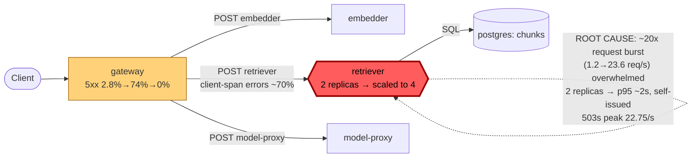

# Postmortem: gateway availability error budget burning slowly (10% of the 28d budget in 6h; 30m & 6h windows)

- **Status:** open
- **Severity:** sev2
- **Verified:** no
- **Opened:** 2026-08-12 13:17:44Z
- **Resolved:** (still open)

## Timeline (machine-generated)

All times UTC on 2026-08-12 unless a full date is shown.

| Time (UTC) | Source | Event |
| --- | --- | --- |
| 13:17:10Z | alert | alert firing: SLO gateway availability — slow burn |
| 13:20:18Z | deploy:ci | CI run #119 success on tenant-rename-and-oncall-spine: obs: agents: keep the read-only cluster window through runbook narrowing |
| 13:21:25Z | deploy:ci | CI run #120 in_progress on main: obs: Merge pull request 'Tenant rename (acme -> test-bench) + oncall keeps its cluster eyes' (#72) from tenant-rename-an |
| 13:22:14Z | k8s | ReplicaSet/retriever-d6d55bf7f: SuccessfulCreate |
| 13:22:14Z | k8s | Deployment/retriever: ScalingReplicaSet |
| 13:22:14Z | k8s | Pod/retriever-d6d55bf7f-bw66r: Scheduled |
| 13:22:14Z | k8s | Pod/retriever-d6d55bf7f-fvxvl: Scheduled |
| 13:22:14Z | remediation | scale_deployment retriever executed (run run_19ff61f260312c) |
| 13:22:15Z | k8s | Pod/retriever-d6d55bf7f-fvxvl: Started |
| 13:22:15Z | k8s | Pod/retriever-d6d55bf7f-fvxvl: Pulled |
| 13:22:15Z | k8s | Pod/retriever-d6d55bf7f-fvxvl: Created |
| 13:22:15Z | k8s | Pod/retriever-d6d55bf7f-bw66r: Started |
| 13:22:15Z | k8s | Pod/retriever-d6d55bf7f-bw66r: Pulled |
| 13:22:15Z | k8s | Pod/retriever-d6d55bf7f-bw66r: Created |

## Evidence links

- [Loki — logs over the incident window](http://localhost:3001/explore?schemaVersion=1&panes=%7B%22pm%22%3A+%7B%22datasource%22%3A+%22loki%22%2C+%22queries%22%3A+%5B%7B%22refId%22%3A+%22A%22%2C+%22datasource%22%3A+%7B%22type%22%3A+%22loki%22%2C+%22uid%22%3A+%22loki%22%7D%2C+%22expr%22%3A+%22%7Bnamespace%3D%5C%22subject%5C%22%7D+%7C~+%5C%22%28%3Fi%29error%7Cfailed%5C%22%22%7D%5D%2C+%22range%22%3A+%7B%22from%22%3A+%221786540664317%22%2C+%22to%22%3A+%221786541020645%22%7D%7D%7D&orgId=1)
- [Mimir — metrics over the incident window](http://localhost:3001/explore?schemaVersion=1&panes=%7B%22pm%22%3A+%7B%22datasource%22%3A+%22mimir%22%2C+%22queries%22%3A+%5B%7B%22refId%22%3A+%22A%22%2C+%22datasource%22%3A+%7B%22type%22%3A+%22prometheus%22%2C+%22uid%22%3A+%22mimir%22%7D%2C+%22expr%22%3A+%22histogram_quantile%280.95%2C+sum%28rate%28http_server_duration_milliseconds_bucket%5B5m%5D%29%29+by+%28le%29%29%22%7D%5D%2C+%22range%22%3A+%7B%22from%22%3A+%221786540664317%22%2C+%22to%22%3A+%221786541020645%22%7D%7D%7D&orgId=1)

## Investigation context

**Runbook match:** none — no tool narrowing applied for this alert. Available runbooks: README.md, canary-abort.md, ci-pipeline-red.md, dq-freshness-stall.md, gateway-high-error-rate.md, k8s-crashloop.md, k8s-node-failure.md, snapshot-agent-audit.md, stale-secret.md

Pre-check battery (as injected at run start)

## Pre-check leads

### recent_deploys — LEAD
2 deploy-window leads
- argo app platform: sync=OutOfSync health=Healthy (revision c025382ba170)
- argo app retriever: sync=OutOfSync health=Healthy (revision c025382ba170)

### attribution — LEAD
No service or dependency edge above 1% errors or 1s p95 in the last 10m (highest: gateway 0.0%) — whatever paged us is not a broad service-level failure. Look for something too narrow to move a service-wide number (one route, one tenant, one pod) or something that is not request-shaped at all (a stuck rollout, a pipeline, a credential).
- No service or dependency edge above 1% errors or 1s p95 in the last 10m (highest: gateway 0.0%) — whatever paged us is not a broad service-level failure. Look for something too narrow to… (truncated)

### rollout_state — LEAD
1 rollout-state lead
- analysisrun for gateway (gateway-8444846b5f-21-1): Failed — Metric "canary-error-rate" assessed Failed due to failed (2) > failureLimit (1)

### kube_scan — OK
all pods Ready, no notable cluster events

### log_spike — OK
error/failed log rate normal: 0/10min vs baseline 0/10min

### secret_age — OK
Secret subject-db-credentials last modified 18d 14h ago (created 18d 14h ago).

## Narrative

## Summary
Alert `SLO gateway availability — slow burn` (sev2, tenant acme) fired on the 30m/6h multi-window burn-rate rule. No runbook matched this exact alertname, so `gateway-high-error-rate.md` and `canary-abort.md` were used as the closest diagnostic guides.

## Impact
Gateway 5xx rate spiked from a ~2.8% baseline to ~74% and ~68% across two consecutive 5-minute samples, then fell back to 0% within roughly 10-15 minutes — burning ~10% of the 28-day gateway availability error budget inside the alert's 6h window. The gateway→retriever client-span error rate hit ~70% in the same interval, confirming the edge that failed.

## Root cause
This was a **capacity/backpressure event on `retriever`**, not a bad deploy, OOM, or credential/secret issue:

- Two pre-existing leads were ruled out with evidence: the `analysisrun_get` failure for gateway (`gateway-8444846b5f-21-1`, canary-error-rate failed) started 2026-08-04T18:57 — over a week stale, and the current gateway rollout is `Healthy` on stable hash `dd85945b4` from 2026-07-24, so it is not implicated. `argo_app` shows `platform` and `retriever` `OutOfSync` at revision `c025382ba170`, but retriever's last actual deploy was 2026-08-07T19:42 (4+ days before this incident, image `10f24bc` unchanged), and Gitea CI's newest run was 2026-08-05 — no deploy/CI activity coincides with the incident window, so the OutOfSync drift is pre-existing and unrelated.
- `mimir_query` on overall gateway request-rate showed a ~20x burst in the exact incident window (baseline ~1.2 req/s → 23.6 req/s, then 22.2 req/s, back to 1.2 req/s).
- In the same window, `retriever`'s own `/v1/retrieve` route self-emitted HTTP 503s at a peak rate of 22.75/s (`request_duration_seconds_count{service="retriever",http_route="/v1/retrieve",http_status_code="503"}`), and its own p95 latency rose from a normal sub-second baseline to ~1.2s then ~2.0s (`histogram_quantile(0.95, ...retriever.../v1/retrieve)`), while individual `POST /v1/retrieve` client spans in Tempo traces showed durations of 350ms–1.1s versus a typical fast baseline — consistent with request queueing under load, not a downstream outage (a full trace during the burst showed a slow-but-successful retriever call at ~1.1s with a 200, and postgres/`chunks` was reachable throughout via `pg_select`).
- Resource signals rule out OOM/throttling as the trigger: retriever pod memory stayed under 125MB against a 512Mi limit (<25%) for both pods, no restarts occurred (`kubectl describe` shows restart count unchanged, no new `Terminated` events), and no k8s warning events were recorded for retriever in the window. CPU usage rose modestly (0.10→0.17 cores per pod) but never near a limit — retriever simply didn't have enough replicas (2) to absorb the burst without requests backing up and timing out into 503s.
- A GET/POST to `/admin/chaos` was observed in the retriever metrics at the same timestamps. Per policy this is treated as a fact of the lab environment, not a root cause in itself — the root cause named above is the evidenced capacity mismatch (traffic burst vs. fixed 2-replica capacity), independent of whatever triggered the burst.

## What fixed it
Dry-ran and, after explicit operator approval (`request_approval` → approved, diff `spec.replicas: 2 -> 4`), executed `scale_deployment` on `retriever` from 2 → 4 replicas. All 4 pods reached `Running`/`Ready` post-scale. This adds headroom to absorb future bursts and prevents recurrence, but it does **not** retroactively un-burn the budget already consumed inside the alert's 30m/6h lookback windows — `alert_status` was re-polled three times after the fix and the alert remained `active`, as expected for a window-based burn-rate rule shortly after the underlying burst: the burst is still inside the 30m window and will roll out of it over the next ~15-20 minutes if no further errors occur, with the 6h window clearing more slowly. Recovery was **not observed within this session** — reporting that explicitly rather than assuming success.

## Lessons
- No runbook matches this exact alertname (`SLO gateway availability — slow burn`); `gateway-high-error-rate.md`'s dependency-edge attribution steps applied cleanly and should be referenced by a new/updated runbook entry for SLO burn-rate alerts specifically, including guidance that a fix can be correct and verified (replicas scaled, pods healthy) while the alert legitimately stays active until the burn-rate windows age out — don't treat continued firing alone as remediation failure.
- `retriever` was running at a fixed 2 replicas with no autoscaling; a ~20x traffic burst is enough to drive it into self-protective/queueing 503s. Consider a HorizontalPodAutoscaler or a permanently higher baseline replica count if this traffic pattern recurs.
- The `platform`/`retriever` Argo `OutOfSync` drift (since 2026-08-07) is stale and unrelated to this incident but should be reconciled separately so it stops showing up as a false lead in future pre-checks.

