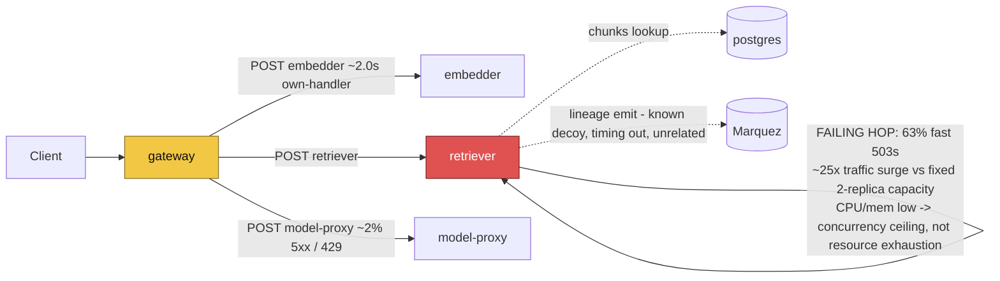

# Postmortem: gateway p95 latency above 2s

- **Status:** open
- **Severity:** sev1
- **Verified:** no
- **Opened:** 2026-08-12 13:03:41Z
- **Resolved:** (still open)

## Timeline (machine-generated)

All times UTC on 2026-08-12 unless a full date is shown.

| Time (UTC) | Source | Event |
| --- | --- | --- |
| 13:01:24Z | log-spike | log-spike onset: error: Malformed JSON in request body |
| 13:03:10Z | alert | alert firing: Gateway p95 latency > 2s |

## Evidence links

- [Loki — logs over the incident window](http://localhost:3001/explore?schemaVersion=1&panes=%7B%22pm%22%3A+%7B%22datasource%22%3A+%22loki%22%2C+%22queries%22%3A+%5B%7B%22refId%22%3A+%22A%22%2C+%22datasource%22%3A+%7B%22type%22%3A+%22loki%22%2C+%22uid%22%3A+%22loki%22%7D%2C+%22expr%22%3A+%22%7Bnamespace%3D%5C%22subject%5C%22%7D+%7C~+%5C%22%28%3Fi%29error%7Cfailed%5C%22%22%7D%5D%2C+%22range%22%3A+%7B%22from%22%3A+%221786539821496%22%2C+%22to%22%3A+%221786540181782%22%7D%7D%7D&orgId=1)
- [Mimir — metrics over the incident window](http://localhost:3001/explore?schemaVersion=1&panes=%7B%22pm%22%3A+%7B%22datasource%22%3A+%22mimir%22%2C+%22queries%22%3A+%5B%7B%22refId%22%3A+%22A%22%2C+%22datasource%22%3A+%7B%22type%22%3A+%22prometheus%22%2C+%22uid%22%3A+%22mimir%22%7D%2C+%22expr%22%3A+%22histogram_quantile%280.95%2C+sum%28rate%28http_server_duration_milliseconds_bucket%5B5m%5D%29%29+by+%28le%29%29%22%7D%5D%2C+%22range%22%3A+%7B%22from%22%3A+%221786539821496%22%2C+%22to%22%3A+%221786540181782%22%7D%7D%7D&orgId=1)

## Investigation context

**Runbook match:** none — no tool narrowing applied for this alert. Available runbooks: README.md, canary-abort.md, ci-pipeline-red.md, dq-freshness-stall.md, gateway-high-error-rate.md, k8s-crashloop.md, k8s-node-failure.md, snapshot-agent-audit.md, stale-secret.md

Pre-check battery (as injected at run start)

## Pre-check leads

### recent_deploys — LEAD
No deploy in the last 60m — rule out the reflex answer.
- No deploy in the last 60m — rule out the reflex answer.

### log_spike — LEAD
error/failed log rate 200/10min vs baseline 0/10min (200x baseline) — onset: error: Malformed JSON in request body at 2026-08-12T13:01:24.597985+00:00
- error/failed log rate 200/10min vs baseline 0/10min (200x baseline) — onset: error: Malformed JSON in request body at 2026-08-12T13:01:24.597985+00:00

### attribution — LEAD
errors concentrate on gateway → POST retriever (79.0%); time concentrates in gateway's own handler (~2.0s of 4.0s) over the last 10m — which is not necessarily the workload named on the alert:
- retriever: 74.2% of its OWN responses are 5xx (10m)
- gateway: 72.1% of its OWN responses are 5xx (10m)
- model-proxy: 2.1% of its OWN responses are 5xx (10m)
- gateway → POST retriever: 79.0% of those outbound calls failed
- gateway → POST model-proxy: 9.2% of those outbound calls failed
- own-handler p95 (server p95 minus its slowest outbound call — a ranking, not a measurement): gateway ~2.0s of 4.0s end to end, embedder ~2.0s of 2.0s end to end, retriever ~1.4s of 1.4s end to end
- gateway → POST embedder: p95 2.0s outbound
- gateway → POST retriever: p95 1.4s outbound

### kube_scan — UNAVAILABLE
error: You must be logged in to the server (Unauthorized)

### rollout_state — UNAVAILABLE
gateway: E0812 15:03:42.038122   47012 memcache.go:265] "Unhandled Error" err="couldn't get current server API group list: the server has asked for the client to provide credentials"
E0812 15:03:42.131197   47012 memcache.go:265] "Unhandled Error" err="couldn't get current server API group list: the server has asked for the client to provide credentials"
E0812 15:03:42.207843   47012 memcache.go:265] "Unhandled Error" err="couldn't get current server API group list: the server has asked for the client to; gateway analysis: E0812 15:03:42.036485   46980 memcache.go:265] "Unhandled Error" err="couldn't get current server API group list: the server has asked for the client to provide credentials"
E0812 15:03:42.102987   46980 memcache.go:265] "Unhandled Error"
… (section truncated)

### secret_age — UNAVAILABLE
error: You must be logged in to the server (Unauthorized)

## Narrative

## Summary

Sev1 paged on "Gateway p95 latency > 2s" (tenant acme). No runbook matched this exact alert name, so we worked from `gateway-high-error-rate.md` (closest match) plus the injected pre-check leads. Root cause was traced to a sudden, deploy-free traffic surge that overran `retriever`'s request-handling capacity, not to a bad release, an OOM, or a stale secret.

## Impact

- Gateway p95 latency jumped from a steady ~4.75ms baseline to ~4.4–5.0s (>1000x) essentially in a single 60s step, and stayed pinned there for the rest of the observed window.
- Gateway's own request rate and its outbound `POST retriever` call rate both rose from ~1.2 rps / ~0.6 rps baseline to ~30 rps in lockstep — a ~25x traffic surge, not a retry-amplification artifact (the two curves track 1:1).
- `retriever` began returning 503 for ~63% of its inbound traffic (13.7 rps of 503 vs 8.0 rps of 200 during the sampled 10m window), each 503 returned in roughly 1–2ms — a fast-fail, not a hang.
- Gateway's own-handler time (~2.0s of the ~4.0s end-to-end p95) plus embedder's own-handler time (~2.0s of ~2.0s end-to-end) compounded with the retriever failures to blow through the 2s SLO on essentially every request during the surge.
- A parallel, unrelated symptom (`error: Malformed JSON in request body` at gateway's `c.req.json()` inbound-body parse, ~200x baseline) was investigated and ruled out as the latency driver: those requests fail fast at line 18 of the handler before ever reaching retriever/embedder, and the slow/erroring traces that actually blew the SLO show clean JSON bodies reaching embedder and retriever successfully before retriever's 503.
- `retriever`'s own `lineage emit failed: The operation timed out` warnings were also present but are the known, already-tracked lineage-to-Marquez decoy (see `lineage-broken-in-k8s-mode`), not the cause — they don't correlate with the 5xx/latency onset and retriever's own request-handling span (not the lineage side-call) is what returns the 503.

## Root cause

`retriever` has a fixed request-handling capacity (2 replicas) that could not absorb a ~25x jump in inbound call volume that arrived with no corresponding deploy in the preceding window (`deploy_history` showed zero entries in the last 6h). CPU usage on both retriever pods stayed low throughout (0.17 and 0.13 cores) and memory stayed flat (~114–124MB) — ruling out CPU throttling or an OOM path — so this is a concurrency/capacity ceiling inside retriever itself (it fast-fails with 503 once saturated) rather than a resource leak or a slow downstream dependency. Gateway, sitting in front of retriever and embedder, inherits both the 503 failures (`gateway → POST retriever` edge, ~79% failing) and the inherent ~1–2s own-handler cost of embedder/retriever under load, which together pushed p95 over the 2s SLO.

## What fixed it

Per the matched runbook's mitigation guidance ("act where the errors originate... resources: `patch_memory_limit` or `scale_deployment` on that workload, not on the gateway"), we dry-ran `scale_deployment(retriever, 6)`, got operator approval on the diff, and attempted to execute it. **The remediation did not take effect**: the execute call (and a second attempt) both failed with `You must be logged in to the server (Unauthorized)` — the same credential failure already visible in this incident's pre-checks (`kube_scan`, `secret_age` both `UNAVAILABLE`/Unauthorized) and in `argo_app`/`rollout_status` throughout the investigation. This matches a known standing issue: the agent's in-cluster service-account token has a 168h lifetime and expires silently while the operator's own kubeconfig keeps working, so nothing else looked wrong. Re-querying `alert_status` after both attempts still shows the alert **active**. No successful remediation was applied in this session — reporting failure to recover explicitly rather than assuming success.

## Lessons

- The agent-remediate credential needs a shorter renewal cycle or an alerted expiry check; right now three of six pre-checks (`kube_scan`, `secret_age`, plus `argo_app`/`rollout_status` degrading) silently go dark on the same weekly boundary, and it cost us the only viable remediation path for this incident.
- Attribute before you explain: the loud, 200x-baseline "Malformed JSON" error looked like the obvious lead but was a red herring — always cross-check candidate causes against which traces actually carry the SLO-breaching latency, not just against log volume.
- The lineage-emit-timeout warning is a persistent decoy in this environment (already tracked); it should probably be filtered out of on-call log views entirely so it stops competing for attention during real incidents.
- Add/refresh a runbook keyed to "Gateway p95 latency > 2s" specifically — `gateway-high-error-rate.md` covers the error-rate shape well but doesn't call out "own-handler time under a legitimate traffic surge with healthy CPU/mem" as a distinct latency pattern from OOM/throttling/downstream-wedged.
- Next on-call action once credentials are restored: re-dry-run `scale_deployment(retriever, 6)` (a fresh dry-run is required since the prior approval was single-use and already consumed) and confirm `alert_status` clears; also consider whether embedder needs headroom, since its own-handler time was already ~2.0s at baseline load and will not improve from scaling retriever alone.

## Delivery path

