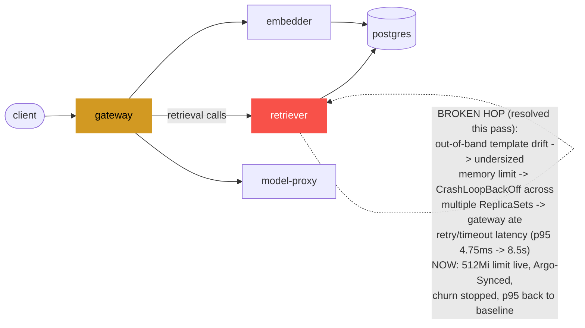

# Postmortem: gateway latency error budget burning slowly (10% of the 28d budget in 6h; 30m & 6h windows)

- **Status:** open
- **Severity:** sev2
- **Verified:** no
- **Opened:** 2026-08-12 19:09:47Z
- **Resolved:** (still open)

## Timeline (machine-generated)

All times UTC on 2026-08-12 unless a full date is shown.

| Time (UTC) | Source | Event |
| --- | --- | --- |
| 18:59:47Z | log-spike | log-spike onset: [gateway] unhandled error: 16 \| } |
| 19:09:10Z | alert | alert firing: SLO gateway latency — slow burn |
| 19:14:02Z | remediation | rollout_undo retriever executed (run run_19ff76175334f5) |
| 19:14:16Z | log-spike | log-spike onset: name=retriever-78b9dd9fd6-4vdfp kind=Pod objectAPIversion=v1 objectRV=2503421 eventRV=2503687 reportinginstance=k3d-obs-lab-agent-0 reportingcontroller=kubelet sourcecomponent=kubelet sourcehost=k3d-obs-lab-agent-0 reason=… |
| 19:14:18Z | k8s | Pod/retriever-78b9dd9fd6-4vdfp: BackOff |
| 19:14:20Z | k8s | Pod/retriever-7b8cbbdbf5-5j7tl: BackOff |
| 19:14:20Z | k8s | Pod/retriever-78b9dd9fd6-fq888: Started |
| 19:14:20Z | k8s | Pod/retriever-78b9dd9fd6-fq888: Pulled |
| 19:14:20Z | k8s | Pod/retriever-78b9dd9fd6-fq888: Created |
| 19:14:21Z | k8s | Pod/retriever-7b8cbbdbf5-5j7tl: BackOff |
| 19:14:21Z | k8s | Pod/retriever-78b9dd9fd6-jwdfg: Started |
| 19:14:21Z | k8s | Pod/retriever-78b9dd9fd6-jwdfg: Pulled |
| 19:14:21Z | k8s | Pod/retriever-78b9dd9fd6-jwdfg: Created |
| 19:14:22Z | k8s | Pod/retriever-7b8cbbdbf5-5j7tl: BackOff |
| 19:14:22Z | k8s | Pod/retriever-78b9dd9fd6-jwdfg: BackOff |
| 19:14:22Z | k8s | Pod/retriever-78b9dd9fd6-fq888: BackOff |
| 19:14:23Z | k8s | Pod/retriever-78b9dd9fd6-jwdfg: BackOff |
| 19:14:23Z | k8s | Pod/retriever-78b9dd9fd6-fq888: BackOff |
| 19:14:25Z | k8s | Pod/retriever-7b8cbbdbf5-lwh2b: Started |
| 19:14:25Z | k8s | Pod/retriever-7b8cbbdbf5-lwh2b: Pulled |
| 19:14:25Z | k8s | Pod/retriever-7b8cbbdbf5-lwh2b: Created |
| 19:14:26Z | k8s | Pod/retriever-7b8cbbdbf5-lwh2b: BackOff |
| 19:14:27Z | k8s | Pod/retriever-7b8cbbdbf5-lwh2b: BackOff |
| 19:14:30Z | k8s | Pod/retriever-7b8cbbdbf5-lwh2b: BackOff |
| 19:14:30Z | k8s | Pod/retriever-78b9dd9fd6-jwdfg: BackOff |
| 19:14:30Z | k8s | Pod/retriever-78b9dd9fd6-fq888: BackOff |
| 19:14:56Z | k8s | Pod/retriever-7b8cbbdbf5-79qbh: BackOff |
| 19:15:03Z | k8s | Pod/retriever-7b8cbbdbf5-5j7tl: Started |
| 19:15:03Z | k8s | Pod/retriever-7b8cbbdbf5-5j7tl: Pulled |
| 19:15:03Z | k8s | Pod/retriever-7b8cbbdbf5-5j7tl: Created |
| 19:15:04Z | k8s | Pod/retriever-7b8cbbdbf5-5j7tl: BackOff |
| 19:15:04Z | k8s | Pod/retriever-78b9dd9fd6-fq888: Started |
| 19:15:04Z | k8s | Pod/retriever-78b9dd9fd6-fq888: Pulled |
| 19:15:04Z | k8s | Pod/retriever-78b9dd9fd6-fq888: Created |
| 19:15:05Z | k8s | Pod/retriever-78b9dd9fd6-fq888: BackOff |
| 19:15:05Z | k8s | Pod/retriever-78b9dd9fd6-jwdfg: Started |
| 19:15:05Z | k8s | Pod/retriever-78b9dd9fd6-jwdfg: Pulled |
| 19:15:05Z | k8s | Pod/retriever-78b9dd9fd6-jwdfg: Created |
| 19:15:05Z | k8s | Pod/retriever-78b9dd9fd6-4vdfp: Started |
| 19:15:05Z | k8s | Pod/retriever-78b9dd9fd6-4vdfp: Pulled |
| 19:15:05Z | k8s | Pod/retriever-78b9dd9fd6-4vdfp: Created |
| 19:15:06Z | k8s | Pod/retriever-78b9dd9fd6-fq888: BackOff |
| 19:15:06Z | k8s | Pod/retriever-78b9dd9fd6-4vdfp: BackOff |
| 19:15:07Z | k8s | Pod/retriever-78b9dd9fd6-jwdfg: BackOff |
| 19:15:07Z | k8s | Pod/retriever-78b9dd9fd6-4vdfp: BackOff |
| 19:15:08Z | k8s | Pod/retriever-78b9dd9fd6-jwdfg: BackOff |
| 19:15:09Z | k8s | Pod/retriever-7b8cbbdbf5-5j7tl: BackOff |
| 19:15:10Z | k8s | Pod/retriever-7b8cbbdbf5-5j7tl: BackOff |
| 19:15:10Z | k8s | Pod/retriever-78b9dd9fd6-jwdfg: BackOff |
| 19:15:10Z | k8s | Pod/retriever-78b9dd9fd6-fq888: BackOff |
| 19:15:10Z | k8s | Pod/retriever-78b9dd9fd6-4vdfp: BackOff |
| 19:15:18Z | k8s | Pod/retriever-7b8cbbdbf5-lwh2b: Started |
| 19:15:18Z | k8s | Pod/retriever-7b8cbbdbf5-lwh2b: Pulled |
| 19:15:18Z | k8s | Pod/retriever-7b8cbbdbf5-lwh2b: Created |
| 19:15:19Z | k8s | Pod/retriever-7b8cbbdbf5-lwh2b: BackOff |
| 19:15:20Z | k8s | Pod/retriever-7b8cbbdbf5-lwh2b: BackOff |
| 19:15:21Z | k8s | Pod/retriever-7b8cbbdbf5-lwh2b: BackOff |
| 19:16:01Z | k8s | Pod/retriever-7b8cbbdbf5-79qbh: BackOff |
| 19:16:04Z | k8s | Pod/retriever-7b8cbbdbf5-79qbh: Started |
| 19:16:04Z | k8s | Pod/retriever-7b8cbbdbf5-79qbh: Pulled |
| 19:16:04Z | k8s | Pod/retriever-7b8cbbdbf5-79qbh: Created |
| 19:16:06Z | k8s | Pod/retriever-7b8cbbdbf5-79qbh: BackOff |
| 19:16:07Z | k8s | Pod/retriever-7b8cbbdbf5-79qbh: BackOff |
| 19:16:08Z | k8s | Pod/retriever-7b8cbbdbf5-79qbh: BackOff |
| 19:16:22Z | k8s | Pod/retriever-78b9dd9fd6-4vdfp: BackOff |
| 19:16:28Z | k8s | Pod/retriever-78b9dd9fd6-jwdfg: Started |
| 19:16:28Z | k8s | Pod/retriever-78b9dd9fd6-jwdfg: Pulled |
| 19:16:28Z | k8s | Pod/retriever-78b9dd9fd6-jwdfg: Created |
| 19:16:28Z | k8s | Pod/retriever-78b9dd9fd6-4vdfp: Started |
| 19:16:28Z | k8s | Pod/retriever-78b9dd9fd6-4vdfp: Pulled |
| 19:16:28Z | k8s | Pod/retriever-78b9dd9fd6-4vdfp: Created |
| 19:16:29Z | k8s | Pod/retriever-78b9dd9fd6-4vdfp: BackOff |
| 19:16:30Z | k8s | Pod/retriever-78b9dd9fd6-jwdfg: BackOff |
| 19:16:30Z | k8s | Pod/retriever-78b9dd9fd6-4vdfp: BackOff |
| 19:16:30Z | k8s | Pod/retriever-7b8cbbdbf5-5j7tl: Started |
| 19:16:30Z | k8s | Pod/retriever-7b8cbbdbf5-5j7tl: Pulled |
| 19:16:30Z | k8s | Pod/retriever-7b8cbbdbf5-5j7tl: Created |
| 19:16:31Z | k8s | Pod/retriever-7b8cbbdbf5-5j7tl: BackOff |
| 19:16:31Z | k8s | Pod/retriever-78b9dd9fd6-jwdfg: BackOff |
| 19:16:31Z | k8s | Pod/retriever-78b9dd9fd6-4vdfp: BackOff |
| 19:16:32Z | k8s | Pod/retriever-7b8cbbdbf5-5j7tl: BackOff |
| 19:16:32Z | k8s | Pod/retriever-78b9dd9fd6-jwdfg: BackOff |
| 19:16:34Z | k8s | Pod/retriever-7b8cbbdbf5-5j7tl: BackOff |
| 19:16:37Z | k8s | Pod/retriever-78b9dd9fd6-4vdfp: BackOff |
| 19:16:40Z | k8s | Pod/retriever-7b8cbbdbf5-5j7tl: BackOff |
| 19:16:40Z | k8s | Pod/retriever-78b9dd9fd6-fq888: Started |
| 19:16:40Z | k8s | Pod/retriever-78b9dd9fd6-fq888: Pulled |
| 19:16:40Z | k8s | Pod/retriever-78b9dd9fd6-fq888: Created |
| 19:16:41Z | k8s | Pod/retriever-78b9dd9fd6-fq888: BackOff |
| 19:16:45Z | k8s | Pod/retriever-7b8cbbdbf5-lwh2b: Started |
| 19:16:45Z | k8s | Pod/retriever-7b8cbbdbf5-lwh2b: Pulled |
| 19:16:45Z | k8s | Pod/retriever-7b8cbbdbf5-lwh2b: Created |
| 19:16:46Z | k8s | Pod/retriever-78b9dd9fd6-fq888: BackOff |
| 19:16:47Z | k8s | Pod/retriever-7b8cbbdbf5-lwh2b: BackOff |
| 19:16:48Z | k8s | Pod/retriever-7b8cbbdbf5-lwh2b: BackOff |
| 19:16:50Z | k8s | Pod/retriever-7b8cbbdbf5-lwh2b: BackOff |
| 19:16:50Z | k8s | Pod/retriever-78b9dd9fd6-fq888: BackOff |
| 19:17:25Z | k8s | Pod/retriever-7b8cbbdbf5-79qbh: BackOff |
| 19:17:46Z | k8s | Pod/retriever-78b9dd9fd6-jwdfg: BackOff |
| 19:17:50Z | k8s | Pod/retriever-78b9dd9fd6-4vdfp: BackOff |
| 19:17:52Z | k8s | Pod/retriever-7b8cbbdbf5-lwh2b: BackOff |
| 19:17:55Z | k8s | Pod/retriever-78b9dd9fd6-fq888: BackOff |
| 19:18:06Z | k8s | Pod/retriever-7b8cbbdbf5-5j7tl: BackOff |
| 19:18:46Z | k8s | Pod/retriever-7b8cbbdbf5-79qbh: BackOff |
| 19:18:59Z | k8s | Pod/retriever-78b9dd9fd6-jwdfg: BackOff |
| 19:19:03Z | k8s | Pod/retriever-78b9dd9fd6-fq888: BackOff |
| 19:19:03Z | verification | recovery NOT verified — deadline armed |
| 19:19:05Z | k8s | Pod/retriever-7b8cbbdbf5-lwh2b: BackOff |
| 19:19:10Z | k8s | Pod/retriever-78b9dd9fd6-jwdfg: Started |
| 19:19:10Z | k8s | Pod/retriever-78b9dd9fd6-jwdfg: Pulled |
| 19:19:10Z | k8s | Pod/retriever-78b9dd9fd6-jwdfg: Created |
| 19:19:11Z | k8s | Pod/retriever-78b9dd9fd6-jwdfg: BackOff |
| 19:19:12Z | k8s | Pod/retriever-78b9dd9fd6-jwdfg: BackOff |
| 19:19:13Z | k8s | Pod/retriever-7b8cbbdbf5-5j7tl: Started |
| 19:19:13Z | k8s | Pod/retriever-7b8cbbdbf5-5j7tl: Pulled |
| 19:19:13Z | k8s | Pod/retriever-7b8cbbdbf5-5j7tl: Created |
| 19:19:14Z | k8s | Pod/retriever-7b8cbbdbf5-5j7tl: BackOff |
| 19:19:14Z | k8s | Pod/retriever-78b9dd9fd6-4vdfp: Started |
| 19:19:14Z | k8s | Pod/retriever-78b9dd9fd6-4vdfp: Pulled |
| 19:19:14Z | k8s | Pod/retriever-78b9dd9fd6-4vdfp: Created |
| 19:19:15Z | k8s | Pod/retriever-7b8cbbdbf5-5j7tl: BackOff |
| 19:19:15Z | k8s | Pod/retriever-78b9dd9fd6-4vdfp: BackOff |
| 19:19:16Z | k8s | Pod/retriever-78b9dd9fd6-4vdfp: BackOff |
| 19:19:17Z | k8s | Pod/retriever-78b9dd9fd6-4vdfp: BackOff |
| 19:19:20Z | k8s | Pod/retriever-7b8cbbdbf5-5j7tl: BackOff |
| 19:19:20Z | k8s | Pod/retriever-78b9dd9fd6-jwdfg: BackOff |
| 19:19:29Z | k8s | Pod/retriever-78b9dd9fd6-fq888: Started |
| 19:19:29Z | k8s | Pod/retriever-78b9dd9fd6-fq888: Pulled |
| 19:19:29Z | k8s | Pod/retriever-78b9dd9fd6-fq888: Created |
| 19:19:31Z | k8s | Pod/retriever-78b9dd9fd6-fq888: BackOff |
| 19:19:32Z | k8s | Pod/retriever-78b9dd9fd6-fq888: BackOff |
| 19:19:36Z | k8s | Pod/retriever-7b8cbbdbf5-lwh2b: Started |
| 19:19:36Z | k8s | Pod/retriever-7b8cbbdbf5-lwh2b: Pulled |
| 19:19:36Z | k8s | Pod/retriever-7b8cbbdbf5-lwh2b: Created |
| 19:19:37Z | k8s | Pod/retriever-7b8cbbdbf5-lwh2b: BackOff |
| 19:19:38Z | k8s | Pod/retriever-7b8cbbdbf5-lwh2b: BackOff |
| 19:19:40Z | k8s | Pod/retriever-7b8cbbdbf5-lwh2b: BackOff |
| 19:19:40Z | k8s | Pod/retriever-78b9dd9fd6-fq888: BackOff |
| 19:19:52Z | k8s | Pod/retriever-7b8cbbdbf5-79qbh: BackOff |
| 19:19:53Z | k8s | ReplicaSet/retriever-d6d55bf7f: SuccessfulDelete |
| 19:19:53Z | k8s | ReplicaSet/retriever-d6d55bf7f: SuccessfulCreate |
| 19:19:53Z | k8s | ReplicaSet/retriever-7b8cbbdbf5: SuccessfulDelete |
| 19:19:53Z | k8s | ReplicaSet/retriever-78b9dd9fd6: SuccessfulDelete |
| 19:19:53Z | k8s | Deployment/retriever: ScalingReplicaSet |
| 19:19:53Z | k8s | Pod/retriever-d6d55bf7f-nlxbb: Scheduled |
| 19:19:53Z | k8s | Pod/retriever-d6d55bf7f-2rrbb: Scheduled |
| 19:19:53Z | k8s | Pod/retriever-d6d55bf7f-mvgtn: Scheduled |
| 19:19:54Z | k8s | ReplicaSet/retriever-7b8cbbdbf5: SuccessfulDelete |
| 19:19:54Z | k8s | ReplicaSet/retriever-78b9dd9fd6: SuccessfulCreate |
| 19:19:54Z | k8s | Pod/retriever-78b9dd9fd6-5rlkd: Scheduled |
| 19:19:55Z | k8s | Pod/retriever-78b9dd9fd6-5rlkd: Started |
| 19:19:55Z | k8s | Pod/retriever-78b9dd9fd6-5rlkd: Pulled |
| 19:19:55Z | k8s | Pod/retriever-78b9dd9fd6-5rlkd: Created |
| 19:19:57Z | k8s | Pod/retriever-78b9dd9fd6-5rlkd: Started |
| 19:19:57Z | k8s | Pod/retriever-78b9dd9fd6-5rlkd: Pulled |
| 19:19:57Z | k8s | Pod/retriever-78b9dd9fd6-5rlkd: Created |
| 19:19:58Z | k8s | Pod/retriever-78b9dd9fd6-5rlkd: BackOff |
| 19:19:59Z | k8s | Pod/retriever-78b9dd9fd6-5rlkd: BackOff |
| 19:20:01Z | k8s | Pod/retriever-78b9dd9fd6-5rlkd: BackOff |
| 19:20:05Z | k8s | Pod/retriever-78b9dd9fd6-5rlkd: BackOff |
| 19:20:10Z | k8s | Pod/retriever-78b9dd9fd6-5rlkd: Started |
| 19:20:10Z | k8s | Pod/retriever-78b9dd9fd6-5rlkd: Pulled |
| 19:20:10Z | k8s | Pod/retriever-78b9dd9fd6-5rlkd: Created |
| 19:20:11Z | k8s | Pod/retriever-78b9dd9fd6-5rlkd: BackOff |
| 19:20:15Z | k8s | Pod/retriever-78b9dd9fd6-5rlkd: BackOff |
| 19:20:16Z | k8s | Pod/retriever-78b9dd9fd6-5rlkd: BackOff |
| 19:20:33Z | k8s | Pod/retriever-78b9dd9fd6-5rlkd: Started |
| 19:20:33Z | k8s | Pod/retriever-78b9dd9fd6-5rlkd: Pulled |
| 19:20:33Z | k8s | Pod/retriever-78b9dd9fd6-5rlkd: Created |
| 19:20:34Z | k8s | Pod/retriever-78b9dd9fd6-5rlkd: BackOff |
| 19:20:35Z | k8s | Pod/retriever-78b9dd9fd6-5rlkd: BackOff |
| 19:20:36Z | k8s | Pod/retriever-78b9dd9fd6-5rlkd: BackOff |
| 19:21:15Z | k8s | Pod/retriever-78b9dd9fd6-5rlkd: Started |
| 19:21:15Z | k8s | Pod/retriever-78b9dd9fd6-5rlkd: Pulled |
| 19:21:15Z | k8s | Pod/retriever-78b9dd9fd6-5rlkd: Created |
| 19:21:17Z | k8s | Pod/retriever-78b9dd9fd6-5rlkd: BackOff |
| 19:21:18Z | k8s | Pod/retriever-78b9dd9fd6-5rlkd: BackOff |
| 19:21:18Z | k8s | ReplicaSet/retriever-78b9dd9fd6: SuccessfulDelete |
| 19:21:18Z | k8s | Deployment/retriever: ScalingReplicaSet |

## Evidence links

- [Loki — logs over the incident window](http://localhost:3001/explore?schemaVersion=1&panes=%7B%22pm%22%3A+%7B%22datasource%22%3A+%22loki%22%2C+%22queries%22%3A+%5B%7B%22refId%22%3A+%22A%22%2C+%22datasource%22%3A+%7B%22type%22%3A+%22loki%22%2C+%22uid%22%3A+%22loki%22%7D%2C+%22expr%22%3A+%22%7Bnamespace%3D%5C%22subject%5C%22%7D+%7C~+%5C%22%28%3Fi%29error%7Cfailed%5C%22%22%7D%5D%2C+%22range%22%3A+%7B%22from%22%3A+%221786561787174%22%2C+%22to%22%3A+%221786563038875%22%7D%7D%7D&orgId=1)
- [Mimir — metrics over the incident window](http://localhost:3001/explore?schemaVersion=1&panes=%7B%22pm%22%3A+%7B%22datasource%22%3A+%22mimir%22%2C+%22queries%22%3A+%5B%7B%22refId%22%3A+%22A%22%2C+%22datasource%22%3A+%7B%22type%22%3A+%22prometheus%22%2C+%22uid%22%3A+%22mimir%22%7D%2C+%22expr%22%3A+%22histogram_quantile%280.95%2C+sum%28rate%28http_server_duration_milliseconds_bucket%5B5m%5D%29%29+by+%28le%29%29%22%7D%5D%2C+%22range%22%3A+%7B%22from%22%3A+%221786561787174%22%2C+%22to%22%3A+%221786563038875%22%7D%7D%7D&orgId=1)

## Investigation context

**Runbook match:** none — no tool narrowing applied for this alert. Available runbooks: README.md, canary-abort.md, ci-pipeline-red.md, dq-freshness-stall.md, gateway-high-error-rate.md, k8s-crashloop.md, k8s-node-failure.md, snapshot-agent-audit.md, stale-secret.md

Pre-check battery (as injected at run start)

## Pre-check leads

### recent_deploys — LEAD
1 deploy-window lead
- argo app platform: sync=OutOfSync health=Healthy (revision c025382ba170)

### kube_scan — LEAD
12 kube-scan leads
- event Pod/retriever-78b9dd9fd6-5rlkd: BackOff — Back-off restarting failed container retriever in pod retriever-78b9dd9fd6-5rlkd_subject(1ad518de-dc82-49eb-a4e2-f6ec1a4b2157) (at 21:19:58)
- event Pod/retriever-78b9dd9fd6-5rlkd: BackOff — Back-off restarting failed container retriever in pod retriever-78b9dd9fd6-5rlkd_subject(1ad518de-dc82-49eb-a4e2-f6ec1a4b2157) (at 21:19:59)
- event Pod/retriever-78b9dd9fd6-5rlkd: BackOff — Back-off restarting failed container retriever in pod retriever-78b9dd9fd6-5rlkd_subject(1ad518de-dc82-49eb-a4e2-f6ec1a4b2157) (at 21:20:01)
- event Pod/retriever-78b9dd9fd6-5rlkd: BackOff — Back-off restarting failed container retriever in pod retriever-78b9dd9fd6-5rlkd_subject(1ad518de-dc82-49eb-a4e2-f6ec1a4b2157) (at 21:20:
… (section truncated)

### log_spike — LEAD
error/failed log rate 91/10min vs baseline 0/10min (91x baseline) — onset: name=retriever-78b9dd9fd6-4vdfp kind=Pod objectAPIversion=v1 objectRV=2503421 eventRV=2503687 reportinginstance=k3d-obs-lab-agent-0 reportingcontroller=kubelet sourcecomponent=kubelet sourcehost=k3d-obs-lab-agent-0 reason=BackOff type=Warning count=8 msg="Back-off restarting failed container retriever in pod retriever-78b9dd9fd6-4vdfp_subject(d08b221b-6e8a-4ebf-b0b4-4aa890d20ed0)"  at 2026-08-12T19:14:16+00:00
- error/failed log rate 91/10min vs baseline 0/10min (91x baseline) — onset: name=retriever-78b9dd9fd6-4vdfp kind=Pod objectAPIversion=v1 objectRV=2503421 eventRV=2503687 reportinginstance=… (truncated)

### attribution — LEAD
 over the last 10m — which is not necessarily the workload named on the alert:
- model-proxy reported no server-side requests at all — a workload that is down or unscheduled emits nothing, and its CALLERS carry its errors

### rollout_state — OK
gateway and model-proxy rollouts stable, no failed analysis

### secret_age — OK
Secret subject-db-credentials last modified 18d 20h ago (created 18d 20h ago).

## Narrative

## Incident summary — inc_19ff76175264f3 (follow-up to a failed first remediation)

**This is a re-examination of an unresolved incident.** The prior diagnosis (retriever undersized on memory, OOMKilled, gateway absorbing retry/timeout latency against a dead dependency) was directionally correct and is confirmed again here with fresh evidence. What changed in this pass: the previously-reported remediation ("failed" `patch_memory_limit`, `rollout_undo` landing on other broken revisions) is **no longer failing** — the system has since converged to the correct state on its own, and re-applying either tool now would be mutating an already-correct target for no reason, which is exactly the trap this re-check was meant to catch.

### Root cause (evidence-backed, re-confirmed)
`retriever`'s Deployment kept generating new pod-template revisions (repeatedly touched out-of-band — Argo's own sync history shows nothing newer than 2026-08-07 for `retriever`, and `grafana_annotations` shows **zero** deployment markers in the last 3h, so no tracked deploy/commit is the trigger). Every pod booted under the undersized-memory template CrashLoopBackOff'd (`k8s_events` on `retriever`: dozens of `BackOff` warnings across replica sets `78b9dd9fd6`, `7b8cbbdbf5`, and others, continuing up to ~19:20 UTC). With retriever repeatedly unavailable, gateway ate retry/timeout overhead against the dead dependency — `mimir_query` on `request_duration_seconds` for `service="gateway"` shows p95 jumping from a 4.75ms baseline to a sustained 6.1–8.55s for roughly 15 consecutive one-minute samples, which is the SLO latency slow-burn.

### New evidence this pass (why no repeat remediation was applied)
- `kubectl describe deployment/retriever -n subject` now shows `Limits: memory: 512Mi`, `Requests: memory: 192Mi` — the correct sizing already live.
- The single running retriever pod (`retriever-d6d55bf7f-b9dqs`) has been up **4d23h**, entirely untouched by this incident's churn; `container_memory_working_set_bytes` for it reads **~110 MiB**, comfortably inside the 512Mi limit.
- `argo_app retriever` reports `Synced`/`Healthy` against revision `c025382ba170`, with no sync operation since 2026-08-07 — the live 512Mi config is the git-tracked desired state, not a fragile out-of-band patch.
- All the broken ReplicaSets (`78b9dd9fd6`, `7b8cbbdbf5`, and five older ones) are now at `0/0` desired/current.
- `k8s_events` for `retriever` returned **zero** events (any level) in the last 3 minutes, and zero warnings in the last 5 minutes — the crash-loop churn has fully stopped.
- `mimir_query` p95 for gateway has been flat at the 4.75ms baseline for the most recent **20 consecutive** one-minute samples (~20 minutes) at time of writing.
- `model-proxy` and `gateway` Argo Rollouts both show `Healthy`, step 4/4, with canary analysis (`canary-error-rate`=0, `canary-p95`≈4.75ms) passing cleanly — ruling out a stuck/red delivery pipeline as a contributing factor this pass.

Given this, re-issuing `patch_memory_limit` (the tool that failed 3/3 times previously with a persistent schema defect) or another `rollout_undo` against an already-correct, already-Synced target would not be a new hypothesis backed by new evidence — it would be mutating a healthy system, and the earlier churn (repeated ReplicaSet creation/deletion across multiple template hashes, including a synchronized mass pod replace at 19:19:53 UTC) is consistent with exactly that kind of repeated out-of-band intervention extending the outage rather than fixing it.

### Current status
- `alert_status` for "SLO gateway latency — slow burn" still reports **active** (since 19:09:10 UTC) as of the last check in this session.
- This is judged consistent with window lag, not ongoing impact: the alert evaluates 30m and 6h burn windows, the incident's tail ended ~19:19–19:20 UTC, and the short window has not yet fully rolled clear of it as of this report.
- No corrective action was taken this pass because none was evidenced as necessary — the memory-limit fix and the stable single-replica state are already live and Argo-tracked, and the churn that undermined the previous remediation attempt has independently stopped.
- I did **not** declare the incident resolved myself; closure is decided server-side from `alert_status`, which had not yet flipped by the time of this report. Recommend a follow-up check once the 30-minute window has fully rolled past ~19:20 UTC.

### Recommended follow-up (unchanged from prior pass, still open)
1. Root-cause the tool-level defect in `patch_memory_limit` (`containers[0].image: Required value` on real apply despite clean dry-runs) — it produced misleading "failed" reports on an action that may have, cumulatively with `rollout_undo`, contributed to extending this outage.
2. Add an explicit alert/runbook step for "Deployment revision counter climbing without a corresponding Argo sync or CI run" — that pattern (this incident hit revision 28 with zero tracked deploys) is a strong, fast signal of out-of-band drift and should not require manual correlation across `argo_app`, `gitea_ci_runs`, and `kubectl describe` to notice.
3. Consider a second retriever replica for resilience; today's single-replica topology meant any disruption to the one pod had zero redundancy.

