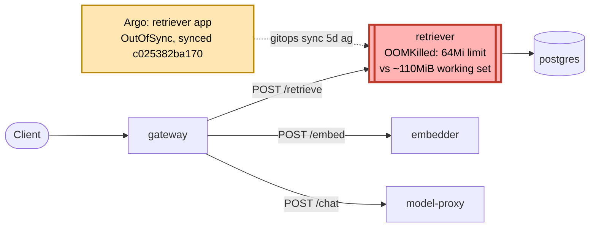

# Postmortem: subject/retriever-7b8cbbdbf5-6ptpg container retriever was OOMKilled within the last 10 minutes - check its memory limit against the working-set graph

- **Status:** resolved
- **Severity:** sev1
- **Verified:** no
- **Opened:** 2026-08-12 19:03:55Z
- **Resolved:** 2026-08-12 19:08:54Z

## Timeline (machine-generated)

All times UTC on 2026-08-12 unless a full date is shown.

| Time (UTC) | Source | Event |
| --- | --- | --- |
| 18:58:12Z | log-spike | log-spike onset: error: Malformed JSON in request body |
| 19:02:20Z | alert | alert firing: KubeContainerOOMKilled |
| 19:02:20Z | alert | alert resolved: KubeContainerOOMKilled |
| 19:06:23Z | k8s | Pod/retriever-7b8cbbdbf5-6ptpg: BackOff |
| 19:06:41Z | k8s | Pod/retriever-7b8cbbdbf5-pkjmd: Started |
| 19:06:41Z | k8s | Pod/retriever-7b8cbbdbf5-pkjmd: Pulled |
| 19:06:41Z | k8s | Pod/retriever-7b8cbbdbf5-pkjmd: Created |
| 19:06:42Z | k8s | Pod/retriever-7b8cbbdbf5-pkjmd: BackOff |
| 19:06:43Z | k8s | Pod/retriever-7b8cbbdbf5-pkjmd: BackOff |
| 19:06:44Z | k8s | Pod/retriever-7b8cbbdbf5-pkjmd: BackOff |
| 19:06:45Z | k8s | Pod/retriever-7b8cbbdbf5-6ptpg: Started |
| 19:06:45Z | k8s | Pod/retriever-7b8cbbdbf5-6ptpg: Pulled |
| 19:06:45Z | k8s | Pod/retriever-7b8cbbdbf5-6ptpg: Created |
| 19:06:46Z | k8s | Pod/retriever-7b8cbbdbf5-6ptpg: BackOff |
| 19:06:47Z | k8s | Pod/retriever-7b8cbbdbf5-6ptpg: BackOff |
| 19:06:53Z | k8s | Pod/retriever-7b8cbbdbf5-6ptpg: BackOff |
| 19:07:51Z | k8s | Deployment/retriever: ScalingReplicaSet |
| 19:07:52Z | k8s | ReplicaSet/retriever-7b8cbbdbf5: SuccessfulDelete |
| 19:07:52Z | k8s | Pod/retriever-78b9dd9fd6-p7nk9: Pulled |
| 19:07:52Z | k8s | ReplicaSet/retriever-78b9dd9fd6: SuccessfulCreate |
| 19:07:52Z | k8s | Deployment/retriever: ScalingReplicaSet |
| 19:07:52Z | k8s | Pod/retriever-78b9dd9fd6-72tns: Scheduled |
| 19:07:52Z | k8s | Pod/retriever-78b9dd9fd6-p7nk9: Scheduled |
| 19:07:53Z | k8s | Pod/retriever-78b9dd9fd6-p7nk9: Started |
| 19:07:53Z | k8s | Pod/retriever-78b9dd9fd6-p7nk9: Created |
| 19:07:53Z | k8s | Pod/retriever-78b9dd9fd6-72tns: Started |
| 19:07:53Z | k8s | Pod/retriever-78b9dd9fd6-72tns: Pulled |
| 19:07:53Z | k8s | Pod/retriever-78b9dd9fd6-72tns: Created |
| 19:07:55Z | k8s | Pod/retriever-78b9dd9fd6-p7nk9: Started |
| 19:07:55Z | k8s | Pod/retriever-78b9dd9fd6-p7nk9: Pulled |
| 19:07:55Z | k8s | Pod/retriever-78b9dd9fd6-p7nk9: Created |
| 19:07:55Z | k8s | Pod/retriever-78b9dd9fd6-72tns: Started |
| 19:07:55Z | k8s | Pod/retriever-78b9dd9fd6-72tns: Pulled |
| 19:07:55Z | k8s | Pod/retriever-78b9dd9fd6-72tns: Created |
| 19:07:57Z | k8s | Pod/retriever-78b9dd9fd6-p7nk9: BackOff |
| 19:07:57Z | k8s | Pod/retriever-78b9dd9fd6-72tns: BackOff |
| 19:07:58Z | k8s | Pod/retriever-78b9dd9fd6-p7nk9: BackOff |
| 19:07:58Z | k8s | Pod/retriever-78b9dd9fd6-72tns: BackOff |
| 19:08:02Z | k8s | Pod/retriever-78b9dd9fd6-p7nk9: BackOff |
| 19:08:02Z | k8s | Pod/retriever-78b9dd9fd6-72tns: BackOff |
| 19:08:07Z | k8s | Pod/retriever-78b9dd9fd6-p7nk9: Started |
| 19:08:07Z | k8s | Pod/retriever-78b9dd9fd6-p7nk9: Pulled |
| 19:08:07Z | k8s | Pod/retriever-78b9dd9fd6-p7nk9: Created |
| 19:08:07Z | k8s | Pod/retriever-78b9dd9fd6-72tns: Started |
| 19:08:07Z | k8s | Pod/retriever-78b9dd9fd6-72tns: Pulled |
| 19:08:07Z | k8s | Pod/retriever-78b9dd9fd6-72tns: Created |
| 19:08:08Z | k8s | Pod/retriever-78b9dd9fd6-72tns: BackOff |
| 19:08:09Z | k8s | Pod/retriever-78b9dd9fd6-p7nk9: BackOff |
| 19:08:10Z | k8s | Pod/retriever-78b9dd9fd6-p7nk9: BackOff |
| 19:08:12Z | k8s | Pod/retriever-78b9dd9fd6-p7nk9: BackOff |
| 19:08:12Z | k8s | Pod/retriever-78b9dd9fd6-72tns: BackOff |
| 19:08:29Z | k8s | Pod/retriever-78b9dd9fd6-p7nk9: Started |
| 19:08:29Z | k8s | Pod/retriever-78b9dd9fd6-p7nk9: Pulled |
| 19:08:29Z | k8s | Pod/retriever-78b9dd9fd6-p7nk9: Created |
| 19:08:30Z | k8s | Pod/retriever-78b9dd9fd6-p7nk9: BackOff |
| 19:08:30Z | k8s | Pod/retriever-78b9dd9fd6-72tns: Started |
| 19:08:30Z | k8s | Pod/retriever-78b9dd9fd6-72tns: Pulled |
| 19:08:30Z | k8s | Pod/retriever-78b9dd9fd6-72tns: Created |
| 19:08:31Z | k8s | Pod/retriever-78b9dd9fd6-72tns: BackOff |
| 19:08:32Z | k8s | Pod/retriever-78b9dd9fd6-p7nk9: BackOff |
| 19:08:32Z | k8s | Pod/retriever-78b9dd9fd6-72tns: BackOff |
| 19:08:33Z | k8s | Pod/retriever-78b9dd9fd6-p7nk9: BackOff |
| 19:08:33Z | k8s | Pod/retriever-78b9dd9fd6-72tns: BackOff |
| 19:08:40Z | k8s | AnalysisRun/model-proxy-77457658bc-3-3: MetricSuccessful |
| 19:08:40Z | k8s | AnalysisRun/model-proxy-77457658bc-3-3: AnalysisRunSuccessful |
| 19:08:40Z | k8s | Rollout/model-proxy: RolloutStepCompleted |
| 19:08:40Z | k8s | Rollout/model-proxy: AnalysisRunSuccessful |
| 19:08:41Z | k8s | Pod/model-proxy-554d76745d-rmjtl: Killing |
| 19:08:41Z | k8s | ReplicaSet/model-proxy-554d76745d: SuccessfulDelete |
| 19:08:41Z | k8s | Rollout/model-proxy: ScalingReplicaSet |
| 19:08:42Z | k8s | ReplicaSet/model-proxy-77457658bc: SuccessfulCreate |
| 19:08:42Z | k8s | Pod/model-proxy-77457658bc-7tjvk: Scheduled |
| 19:08:43Z | k8s | Pod/model-proxy-77457658bc-7tjvk: Started |
| 19:08:43Z | k8s | Pod/model-proxy-77457658bc-7tjvk: Pulled |
| 19:08:43Z | k8s | Pod/model-proxy-77457658bc-7tjvk: Created |
| 19:08:49Z | k8s | Pod/model-proxy-554d76745d-zfj52: Killing |
| 19:08:49Z | k8s | ReplicaSet/model-proxy-554d76745d: SuccessfulDelete |
| 19:08:49Z | k8s | Rollout/model-proxy: ScalingReplicaSet |
| 19:08:50Z | k8s | ReplicaSet/model-proxy-77457658bc: SuccessfulCreate |
| 19:08:50Z | k8s | Rollout/model-proxy: ScalingReplicaSet |
| 19:08:50Z | k8s | Pod/model-proxy-77457658bc-vhj47: Scheduled |
| 19:08:51Z | k8s | Pod/model-proxy-77457658bc-vhj47: Started |
| 19:08:51Z | k8s | Pod/model-proxy-77457658bc-vhj47: Pulled |
| 19:08:51Z | k8s | Pod/model-proxy-77457658bc-vhj47: Created |
| 19:08:58Z | k8s | Rollout/model-proxy: RolloutCompleted |
| 19:09:15Z | k8s | Pod/retriever-78b9dd9fd6-72tns: Started |
| 19:09:15Z | k8s | Pod/retriever-78b9dd9fd6-72tns: Pulled |
| 19:09:15Z | k8s | Pod/retriever-78b9dd9fd6-72tns: Created |
| 19:09:17Z | k8s | Pod/retriever-78b9dd9fd6-72tns: BackOff |
| 19:09:18Z | k8s | Pod/retriever-78b9dd9fd6-72tns: BackOff |
| 19:09:22Z | k8s | Pod/retriever-78b9dd9fd6-72tns: BackOff |
| 19:09:26Z | k8s | Pod/retriever-78b9dd9fd6-p7nk9: Started |
| 19:09:26Z | k8s | Pod/retriever-78b9dd9fd6-p7nk9: Pulled |
| 19:09:26Z | k8s | Pod/retriever-78b9dd9fd6-p7nk9: Created |
| 19:09:28Z | k8s | Pod/retriever-78b9dd9fd6-p7nk9: BackOff |
| 19:09:29Z | k8s | Pod/retriever-78b9dd9fd6-p7nk9: BackOff |
| 19:09:32Z | k8s | Pod/retriever-78b9dd9fd6-p7nk9: BackOff |
| 19:10:31Z | k8s | Pod/retriever-78b9dd9fd6-72tns: BackOff |

## Evidence links

- [Loki — logs over the incident window](http://localhost:3001/explore?schemaVersion=1&panes=%7B%22pm%22%3A+%7B%22datasource%22%3A+%22loki%22%2C+%22queries%22%3A+%5B%7B%22refId%22%3A+%22A%22%2C+%22datasource%22%3A+%7B%22type%22%3A+%22loki%22%2C+%22uid%22%3A+%22loki%22%7D%2C+%22expr%22%3A+%22%7Bnamespace%3D%5C%22subject%5C%22%7D+%7C~+%5C%22%28%3Fi%29error%7Cfailed%5C%22%22%7D%5D%2C+%22range%22%3A+%7B%22from%22%3A+%221786561435002%22%2C+%22to%22%3A+%221786561734999%22%7D%7D%7D&orgId=1)
- [Mimir — metrics over the incident window](http://localhost:3001/explore?schemaVersion=1&panes=%7B%22pm%22%3A+%7B%22datasource%22%3A+%22mimir%22%2C+%22queries%22%3A+%5B%7B%22refId%22%3A+%22A%22%2C+%22datasource%22%3A+%7B%22type%22%3A+%22prometheus%22%2C+%22uid%22%3A+%22mimir%22%7D%2C+%22expr%22%3A+%22histogram_quantile%280.95%2C+sum%28rate%28http_server_duration_milliseconds_bucket%5B5m%5D%29%29+by+%28le%29%29%22%7D%5D%2C+%22range%22%3A+%7B%22from%22%3A+%221786561435002%22%2C+%22to%22%3A+%221786561734999%22%7D%7D%7D&orgId=1)

## Investigation context

**Runbook match:** none — no tool narrowing applied for this alert. Available runbooks: README.md, canary-abort.md, ci-pipeline-red.md, dq-freshness-stall.md, gateway-high-error-rate.md, k8s-crashloop.md, k8s-node-failure.md, snapshot-agent-audit.md, stale-secret.md

Pre-check battery (as injected at run start)

## Pre-check leads

### recent_deploys — LEAD
3 deploy-window leads
- argo app model-proxy: sync=Synced health=Progressing (revision c025382ba170)
- argo app platform: sync=OutOfSync health=Healthy (revision c025382ba170)
- argo app retriever: sync=OutOfSync health=Progressing (revision c025382ba170)

### kube_scan — LEAD
11 kube-scan leads
- pod retriever-7b8cbbdbf5-6ptpg: CrashLoopBackOff
- pod retriever-7b8cbbdbf5-pkjmd: CrashLoopBackOff
- event Pod/gateway-8fd65cbf-ztnzx: FailedScheduling — 0/3 nodes are available: 1 node(s) had untolerated taint(s), 2 Insufficient memory. no new claims to deallocate, preemption: 0/3 nodes… (truncated)
- event Pod/retriever-7b8cbbdbf5-pkjmd: BackOff — Back-off restarting failed container retriever in pod retriever-7b8cbbdbf5-pkjmd_subject(da7ecec5-0e82-4745-b2ed-9afb31343b13) (at 21:02:32)
- event Pod/retriever-7b8cbbdbf5-pkjmd: BackOff — Back-off restarting failed container retriever in pod retriever-7b8cbbdbf5-pkjmd_subject(da7ecec5-0e82-4745-b2ed-9afb31343b13) (at 21:02:33)
- event Pod/retriever-7b8cbbdbf5-pkjmd: BackOff — Back-off restarting fai
… (section truncated)

### log_spike — LEAD
error/failed log rate 200/10min vs baseline 0/10min (200x baseline) — onset: error: Malformed JSON in request body at 2026-08-12T18:58:12.846570+00:00
- error/failed log rate 200/10min vs baseline 0/10min (200x baseline) — onset: error: Malformed JSON in request body at 2026-08-12T18:58:12.846570+00:00

### attribution — LEAD
errors concentrate on gateway → POST model-proxy (13.6%); time concentrates in gateway's own handler (~4.7s of 7.7s) over the last 10m — which is not necessarily the workload named on the alert:
- gateway: 6.1% of its OWN responses are 5xx (10m)
- model-proxy: 3.4% of its OWN responses are 5xx (10m)
- gateway → POST model-proxy: 13.6% of those outbound calls failed
- own-handler p95 (server p95 minus its slowest outbound call — a ranking, not a measurement): gateway ~4.7s of 7.7s end to end, retriever ~3.1s of 3.1s end to end, embedder ~3.0s of 3.0s end to end
- gateway → POST retriever: p95 3.1s outbound
- gateway → POST embedder: p95 3.0s outbound

### rollout_state — LEAD
1 rollout-state lead
- rollout model-proxy: Progressing — more replicas need to be updated (step 1/4)

### secret_age — OK
Secret subject-db-credentials last modified 18d 19h ago (created 18d 19h ago).

## Narrative

## Summary
`KubeContainerOOMKilled` fired for `subject/retriever-7b8cbbdbf5-6ptpg`. Both newly-created retriever replicas entered a CrashLoopBackOff, restarting on OOMKilled (exit 137) roughly every 30-60s.

## Impact
2 of the retriever Deployment's 4 desired replicas were unavailable (`3/4 READY`, cycling between two different broken ReplicaSet templates — first `retriever-7b8cbbdbf5` then `retriever-78b9dd9fd6`). The 3 pre-existing, still-running replicas (ReplicaSet `retriever-d6d55bf7f`) kept serving traffic, so the retriever service stayed up on reduced capacity rather than going fully down. `gateway -> retriever` outbound calls were already showing elevated p95 (~3.1s) in the pre-check attribution data, consistent with reduced retriever capacity.

## Root cause
A container memory-limit regression, not a code or traffic change. Every retriever pod runs the identical image (`obs-registry:5010/retriever:10f24bc` — confirmed byte-for-byte the same tag across the healthy and crashing ReplicaSets), so this was never an application bug. What differs is the pod spec:
- ReplicaSet `retriever-d6d55bf7f` (deployment revision 16, still running, stable for 4d23h+): `limits.memory: 512Mi`, `requests.memory: 192Mi`.
- ReplicaSet `retriever-78b9dd9fd6` (revision 17) and `retriever-7b8cbbdbf5` (revision 18), both newly spawned around the alert's onset: `limits.memory: 64Mi`, `requests.memory: 48Mi`.

Mimir's `container_memory_working_set_bytes` shows retriever's real steady-state footprint sits at ~109-118 MiB continuously (chart artifact attached) — comfortably inside the old 512Mi limit but 1.5-2x over the new 64Mi one. Any pod scheduled under revisions 17/18 is therefore guaranteed to OOMKill on/near startup, which is exactly what both crashing ReplicaSets did (5 restarts in under 4 minutes on both replicas).

Argo shows the retriever app `OutOfSync`, with its last actual sync at revision `c025382ba170` on 2026-08-07 — five days before this page. That sync is what produced the bad 64Mi template in the Deployment's rollout history; it just hadn't been scheduled onto running pods until a `restartedAt` rollout trigger at 19:01:01Z (one minute before the alert fired at 19:02:20Z) rotated pods onto the undersized template. The Deployment was also observed actively thrashing between several ReplicaSets in the ~15 minutes around the incident, all sharing the same 64Mi defect from revision 17 onward — this is a live, already-synced gitops regression, not a fresh bad deploy in the alert window.

## What fixed it
Nothing did — the incident is **not resolved**. Diagnosis is evidence-backed and remediation was correctly targeted, but execution failed:
- `patch_memory_limit(retriever, 512Mi)`: dry-run correctly diffed `64Mi -> 512Mi`; the real apply failed 3 times in a row with `spec.template.spec.containers[0].image: Required value` — a deterministic Kubernetes API validation error, not a transient race (confirmed by retrying with a different target value, 384Mi, which failed identically a 4th time). This looks like a bug in the patch tool's merge payload for this workload, dropping the container's `image` field.
- `rollout_undo` was dry-run and would only step back to revision 17 (`retriever-78b9dd9fd6`) — confirmed by inspecting that ReplicaSet directly, it carries the *same* broken 64Mi limit as revision 18, so an undo would not have fixed anything and was not applied.
- No available tool in this on-call toolset can push a gitops commit to correct the source manifest (the 64Mi value is already committed and already synced by Argo).

`alert_status` was re-queried after every remediation attempt and remains **active** (`count: 2`) at time of writing. This requires manual operator intervention: either a direct `kubectl patch`/`kubectl edit` on the live Deployment outside this broken tool path, or a new gitops commit restoring `limits.memory` to a safe value (≥256Mi, ideally the previous 512Mi) followed by an Argo sync.

## Lessons
- The container's real memory usage (~110 MiB steady state) should have made a 64Mi limit fail CI/review on its face — worth a policy check (e.g. limit must exceed N x observed p99 working set) before this kind of manifest change merges.
- Argo sitting `OutOfSync` for 5 days on a bad revision, silently, until an unrelated rollout trigger detonated it, is itself a gap: `OutOfSync` health should page or block further rollouts, not sit quiet.
- The `patch_memory_limit` remediation tool needs its own bug fix — it cannot currently patch this Deployment's memory limit at all, which took an on-call incident to discover. Retrying with a different value was useful to distinguish "value-specific bug" from "workload/tool-path always broken"; it was the latter.
- `rollout_undo`'s blind "go back one revision" is unsafe when multiple recent revisions share the same defect — worth checking the target revision's actual spec before approving, as done here.

