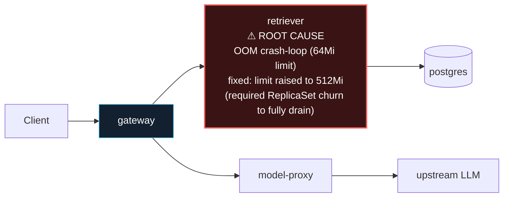

# Postmortem: gateway latency error budget burning slowly (10% of the 28d budget in 6h; 30m & 6h windows)

- **Status:** resolved
- **Severity:** sev2
- **Verified:** no
- **Opened:** 2026-08-12 19:09:47Z
- **Resolved:** 2026-08-12 19:34:47Z

## Timeline (machine-generated)

All times UTC on 2026-08-12 unless a full date is shown.

| Time (UTC) | Source | Event |
| --- | --- | --- |
| 18:59:47Z | log-spike | log-spike onset: [gateway] unhandled error: 16 \| } |
| 19:09:10Z | alert | alert firing: SLO gateway latency — slow burn |
| 19:14:02Z | remediation | rollout_undo retriever executed (run run_19ff76175334f5) |
| 19:14:16Z | log-spike | log-spike onset: name=retriever-78b9dd9fd6-4vdfp kind=Pod objectAPIversion=v1 objectRV=2503421 eventRV=2503687 reportinginstance=k3d-obs-lab-agent-0 reportingcontroller=kubelet sourcecomponent=kubelet sourcehost=k3d-obs-lab-agent-0 reason=… |
| 19:14:18Z | k8s | Pod/retriever-78b9dd9fd6-4vdfp: BackOff |
| 19:14:20Z | k8s | Pod/retriever-7b8cbbdbf5-5j7tl: BackOff |
| 19:14:20Z | k8s | Pod/retriever-78b9dd9fd6-fq888: Started |
| 19:14:20Z | k8s | Pod/retriever-78b9dd9fd6-fq888: Pulled |
| 19:14:20Z | k8s | Pod/retriever-78b9dd9fd6-fq888: Created |
| 19:14:21Z | k8s | Pod/retriever-7b8cbbdbf5-5j7tl: BackOff |
| 19:14:21Z | k8s | Pod/retriever-78b9dd9fd6-jwdfg: Started |
| 19:14:21Z | k8s | Pod/retriever-78b9dd9fd6-jwdfg: Pulled |
| 19:14:21Z | k8s | Pod/retriever-78b9dd9fd6-jwdfg: Created |
| 19:14:22Z | k8s | Pod/retriever-7b8cbbdbf5-5j7tl: BackOff |
| 19:14:22Z | k8s | Pod/retriever-78b9dd9fd6-jwdfg: BackOff |
| 19:14:22Z | k8s | Pod/retriever-78b9dd9fd6-fq888: BackOff |
| 19:14:23Z | k8s | Pod/retriever-78b9dd9fd6-jwdfg: BackOff |
| 19:14:23Z | k8s | Pod/retriever-78b9dd9fd6-fq888: BackOff |
| 19:14:25Z | k8s | Pod/retriever-7b8cbbdbf5-lwh2b: Started |
| 19:14:25Z | k8s | Pod/retriever-7b8cbbdbf5-lwh2b: Pulled |
| 19:14:25Z | k8s | Pod/retriever-7b8cbbdbf5-lwh2b: Created |
| 19:14:26Z | k8s | Pod/retriever-7b8cbbdbf5-lwh2b: BackOff |
| 19:14:27Z | k8s | Pod/retriever-7b8cbbdbf5-lwh2b: BackOff |
| 19:14:30Z | k8s | Pod/retriever-7b8cbbdbf5-lwh2b: BackOff |
| 19:14:30Z | k8s | Pod/retriever-78b9dd9fd6-jwdfg: BackOff |
| 19:14:30Z | k8s | Pod/retriever-78b9dd9fd6-fq888: BackOff |
| 19:14:56Z | k8s | Pod/retriever-7b8cbbdbf5-79qbh: BackOff |
| 19:15:03Z | k8s | Pod/retriever-7b8cbbdbf5-5j7tl: Started |
| 19:15:03Z | k8s | Pod/retriever-7b8cbbdbf5-5j7tl: Pulled |
| 19:15:03Z | k8s | Pod/retriever-7b8cbbdbf5-5j7tl: Created |
| 19:15:04Z | k8s | Pod/retriever-7b8cbbdbf5-5j7tl: BackOff |
| 19:15:04Z | k8s | Pod/retriever-78b9dd9fd6-fq888: Started |
| 19:15:04Z | k8s | Pod/retriever-78b9dd9fd6-fq888: Pulled |
| 19:15:04Z | k8s | Pod/retriever-78b9dd9fd6-fq888: Created |
| 19:15:05Z | k8s | Pod/retriever-78b9dd9fd6-fq888: BackOff |
| 19:15:05Z | k8s | Pod/retriever-78b9dd9fd6-jwdfg: Started |
| 19:15:05Z | k8s | Pod/retriever-78b9dd9fd6-jwdfg: Pulled |
| 19:15:05Z | k8s | Pod/retriever-78b9dd9fd6-jwdfg: Created |
| 19:15:05Z | k8s | Pod/retriever-78b9dd9fd6-4vdfp: Started |
| 19:15:05Z | k8s | Pod/retriever-78b9dd9fd6-4vdfp: Pulled |
| 19:15:05Z | k8s | Pod/retriever-78b9dd9fd6-4vdfp: Created |
| 19:15:06Z | k8s | Pod/retriever-78b9dd9fd6-fq888: BackOff |
| 19:15:06Z | k8s | Pod/retriever-78b9dd9fd6-4vdfp: BackOff |
| 19:15:07Z | k8s | Pod/retriever-78b9dd9fd6-jwdfg: BackOff |
| 19:15:07Z | k8s | Pod/retriever-78b9dd9fd6-4vdfp: BackOff |
| 19:15:08Z | k8s | Pod/retriever-78b9dd9fd6-jwdfg: BackOff |
| 19:15:09Z | k8s | Pod/retriever-7b8cbbdbf5-5j7tl: BackOff |
| 19:15:10Z | k8s | Pod/retriever-7b8cbbdbf5-5j7tl: BackOff |
| 19:15:10Z | k8s | Pod/retriever-78b9dd9fd6-jwdfg: BackOff |
| 19:15:10Z | k8s | Pod/retriever-78b9dd9fd6-fq888: BackOff |
| 19:15:10Z | k8s | Pod/retriever-78b9dd9fd6-4vdfp: BackOff |
| 19:15:18Z | k8s | Pod/retriever-7b8cbbdbf5-lwh2b: Started |
| 19:15:18Z | k8s | Pod/retriever-7b8cbbdbf5-lwh2b: Pulled |
| 19:15:18Z | k8s | Pod/retriever-7b8cbbdbf5-lwh2b: Created |
| 19:15:19Z | k8s | Pod/retriever-7b8cbbdbf5-lwh2b: BackOff |
| 19:15:20Z | k8s | Pod/retriever-7b8cbbdbf5-lwh2b: BackOff |
| 19:15:21Z | k8s | Pod/retriever-7b8cbbdbf5-lwh2b: BackOff |
| 19:16:01Z | k8s | Pod/retriever-7b8cbbdbf5-79qbh: BackOff |
| 19:16:04Z | k8s | Pod/retriever-7b8cbbdbf5-79qbh: Started |
| 19:16:04Z | k8s | Pod/retriever-7b8cbbdbf5-79qbh: Pulled |
| 19:16:04Z | k8s | Pod/retriever-7b8cbbdbf5-79qbh: Created |
| 19:16:06Z | k8s | Pod/retriever-7b8cbbdbf5-79qbh: BackOff |
| 19:16:07Z | k8s | Pod/retriever-7b8cbbdbf5-79qbh: BackOff |
| 19:16:08Z | k8s | Pod/retriever-7b8cbbdbf5-79qbh: BackOff |
| 19:16:22Z | k8s | Pod/retriever-78b9dd9fd6-4vdfp: BackOff |
| 19:16:28Z | k8s | Pod/retriever-78b9dd9fd6-jwdfg: Started |
| 19:16:28Z | k8s | Pod/retriever-78b9dd9fd6-jwdfg: Pulled |
| 19:16:28Z | k8s | Pod/retriever-78b9dd9fd6-jwdfg: Created |
| 19:16:28Z | k8s | Pod/retriever-78b9dd9fd6-4vdfp: Started |
| 19:16:28Z | k8s | Pod/retriever-78b9dd9fd6-4vdfp: Pulled |
| 19:16:28Z | k8s | Pod/retriever-78b9dd9fd6-4vdfp: Created |
| 19:16:29Z | k8s | Pod/retriever-78b9dd9fd6-4vdfp: BackOff |
| 19:16:30Z | k8s | Pod/retriever-78b9dd9fd6-jwdfg: BackOff |
| 19:16:30Z | k8s | Pod/retriever-78b9dd9fd6-4vdfp: BackOff |
| 19:16:30Z | k8s | Pod/retriever-7b8cbbdbf5-5j7tl: Started |
| 19:16:30Z | k8s | Pod/retriever-7b8cbbdbf5-5j7tl: Pulled |
| 19:16:30Z | k8s | Pod/retriever-7b8cbbdbf5-5j7tl: Created |
| 19:16:31Z | k8s | Pod/retriever-7b8cbbdbf5-5j7tl: BackOff |
| 19:16:31Z | k8s | Pod/retriever-78b9dd9fd6-jwdfg: BackOff |
| 19:16:31Z | k8s | Pod/retriever-78b9dd9fd6-4vdfp: BackOff |
| 19:16:32Z | k8s | Pod/retriever-7b8cbbdbf5-5j7tl: BackOff |
| 19:16:32Z | k8s | Pod/retriever-78b9dd9fd6-jwdfg: BackOff |
| 19:16:34Z | k8s | Pod/retriever-7b8cbbdbf5-5j7tl: BackOff |
| 19:16:37Z | k8s | Pod/retriever-78b9dd9fd6-4vdfp: BackOff |
| 19:16:40Z | k8s | Pod/retriever-7b8cbbdbf5-5j7tl: BackOff |
| 19:16:40Z | k8s | Pod/retriever-78b9dd9fd6-fq888: Started |
| 19:16:40Z | k8s | Pod/retriever-78b9dd9fd6-fq888: Pulled |
| 19:16:40Z | k8s | Pod/retriever-78b9dd9fd6-fq888: Created |
| 19:16:41Z | k8s | Pod/retriever-78b9dd9fd6-fq888: BackOff |
| 19:16:45Z | k8s | Pod/retriever-7b8cbbdbf5-lwh2b: Started |
| 19:16:45Z | k8s | Pod/retriever-7b8cbbdbf5-lwh2b: Pulled |
| 19:16:45Z | k8s | Pod/retriever-7b8cbbdbf5-lwh2b: Created |
| 19:16:46Z | k8s | Pod/retriever-78b9dd9fd6-fq888: BackOff |
| 19:16:47Z | k8s | Pod/retriever-7b8cbbdbf5-lwh2b: BackOff |
| 19:16:48Z | k8s | Pod/retriever-7b8cbbdbf5-lwh2b: BackOff |
| 19:16:50Z | k8s | Pod/retriever-7b8cbbdbf5-lwh2b: BackOff |
| 19:16:50Z | k8s | Pod/retriever-78b9dd9fd6-fq888: BackOff |
| 19:17:25Z | k8s | Pod/retriever-7b8cbbdbf5-79qbh: BackOff |
| 19:17:46Z | k8s | Pod/retriever-78b9dd9fd6-jwdfg: BackOff |
| 19:17:50Z | k8s | Pod/retriever-78b9dd9fd6-4vdfp: BackOff |
| 19:17:52Z | k8s | Pod/retriever-7b8cbbdbf5-lwh2b: BackOff |
| 19:17:55Z | k8s | Pod/retriever-78b9dd9fd6-fq888: BackOff |
| 19:18:06Z | k8s | Pod/retriever-7b8cbbdbf5-5j7tl: BackOff |
| 19:18:46Z | k8s | Pod/retriever-7b8cbbdbf5-79qbh: BackOff |
| 19:18:59Z | k8s | Pod/retriever-78b9dd9fd6-jwdfg: BackOff |
| 19:19:03Z | k8s | Pod/retriever-78b9dd9fd6-fq888: BackOff |
| 19:19:03Z | verification | recovery NOT verified — deadline armed |
| 19:19:05Z | k8s | Pod/retriever-7b8cbbdbf5-lwh2b: BackOff |
| 19:19:10Z | k8s | Pod/retriever-78b9dd9fd6-jwdfg: Started |
| 19:19:10Z | k8s | Pod/retriever-78b9dd9fd6-jwdfg: Pulled |
| 19:19:10Z | k8s | Pod/retriever-78b9dd9fd6-jwdfg: Created |
| 19:19:11Z | k8s | Pod/retriever-78b9dd9fd6-jwdfg: BackOff |
| 19:19:12Z | k8s | Pod/retriever-78b9dd9fd6-jwdfg: BackOff |
| 19:19:13Z | k8s | Pod/retriever-7b8cbbdbf5-5j7tl: Started |
| 19:19:13Z | k8s | Pod/retriever-7b8cbbdbf5-5j7tl: Pulled |
| 19:19:13Z | k8s | Pod/retriever-7b8cbbdbf5-5j7tl: Created |
| 19:19:14Z | k8s | Pod/retriever-7b8cbbdbf5-5j7tl: BackOff |
| 19:19:14Z | k8s | Pod/retriever-78b9dd9fd6-4vdfp: Started |
| 19:19:14Z | k8s | Pod/retriever-78b9dd9fd6-4vdfp: Pulled |
| 19:19:14Z | k8s | Pod/retriever-78b9dd9fd6-4vdfp: Created |
| 19:19:15Z | k8s | Pod/retriever-7b8cbbdbf5-5j7tl: BackOff |
| 19:19:15Z | k8s | Pod/retriever-78b9dd9fd6-4vdfp: BackOff |
| 19:19:16Z | k8s | Pod/retriever-78b9dd9fd6-4vdfp: BackOff |
| 19:19:17Z | k8s | Pod/retriever-78b9dd9fd6-4vdfp: BackOff |
| 19:19:20Z | k8s | Pod/retriever-7b8cbbdbf5-5j7tl: BackOff |
| 19:19:20Z | k8s | Pod/retriever-78b9dd9fd6-jwdfg: BackOff |
| 19:19:29Z | k8s | Pod/retriever-78b9dd9fd6-fq888: Started |
| 19:19:29Z | k8s | Pod/retriever-78b9dd9fd6-fq888: Pulled |
| 19:19:29Z | k8s | Pod/retriever-78b9dd9fd6-fq888: Created |
| 19:19:31Z | k8s | Pod/retriever-78b9dd9fd6-fq888: BackOff |
| 19:19:32Z | k8s | Pod/retriever-78b9dd9fd6-fq888: BackOff |
| 19:19:36Z | k8s | Pod/retriever-7b8cbbdbf5-lwh2b: Started |
| 19:19:36Z | k8s | Pod/retriever-7b8cbbdbf5-lwh2b: Pulled |
| 19:19:36Z | k8s | Pod/retriever-7b8cbbdbf5-lwh2b: Created |
| 19:19:37Z | k8s | Pod/retriever-7b8cbbdbf5-lwh2b: BackOff |
| 19:19:38Z | k8s | Pod/retriever-7b8cbbdbf5-lwh2b: BackOff |
| 19:19:40Z | k8s | Pod/retriever-7b8cbbdbf5-lwh2b: BackOff |
| 19:19:40Z | k8s | Pod/retriever-78b9dd9fd6-fq888: BackOff |
| 19:19:52Z | k8s | Pod/retriever-7b8cbbdbf5-79qbh: BackOff |
| 19:19:53Z | k8s | ReplicaSet/retriever-d6d55bf7f: SuccessfulDelete |
| 19:19:53Z | k8s | ReplicaSet/retriever-d6d55bf7f: SuccessfulCreate |
| 19:19:53Z | k8s | ReplicaSet/retriever-7b8cbbdbf5: SuccessfulDelete |
| 19:19:53Z | k8s | ReplicaSet/retriever-78b9dd9fd6: SuccessfulDelete |
| 19:19:53Z | k8s | Deployment/retriever: ScalingReplicaSet |
| 19:19:53Z | k8s | Pod/retriever-d6d55bf7f-nlxbb: Scheduled |
| 19:19:53Z | k8s | Pod/retriever-d6d55bf7f-2rrbb: Scheduled |
| 19:19:53Z | k8s | Pod/retriever-d6d55bf7f-mvgtn: Scheduled |
| 19:19:54Z | k8s | ReplicaSet/retriever-7b8cbbdbf5: SuccessfulDelete |
| 19:19:54Z | k8s | ReplicaSet/retriever-78b9dd9fd6: SuccessfulCreate |
| 19:19:54Z | k8s | Pod/retriever-78b9dd9fd6-5rlkd: Scheduled |
| 19:19:55Z | k8s | Pod/retriever-78b9dd9fd6-5rlkd: Started |
| 19:19:55Z | k8s | Pod/retriever-78b9dd9fd6-5rlkd: Pulled |
| 19:19:55Z | k8s | Pod/retriever-78b9dd9fd6-5rlkd: Created |
| 19:19:57Z | k8s | Pod/retriever-78b9dd9fd6-5rlkd: Started |
| 19:19:57Z | k8s | Pod/retriever-78b9dd9fd6-5rlkd: Pulled |
| 19:19:57Z | k8s | Pod/retriever-78b9dd9fd6-5rlkd: Created |
| 19:19:58Z | k8s | Pod/retriever-78b9dd9fd6-5rlkd: BackOff |
| 19:19:59Z | k8s | Pod/retriever-78b9dd9fd6-5rlkd: BackOff |
| 19:20:01Z | k8s | Pod/retriever-78b9dd9fd6-5rlkd: BackOff |
| 19:20:05Z | k8s | Pod/retriever-78b9dd9fd6-5rlkd: BackOff |
| 19:20:10Z | k8s | Pod/retriever-78b9dd9fd6-5rlkd: Started |
| 19:20:10Z | k8s | Pod/retriever-78b9dd9fd6-5rlkd: Pulled |
| 19:20:10Z | k8s | Pod/retriever-78b9dd9fd6-5rlkd: Created |
| 19:20:11Z | k8s | Pod/retriever-78b9dd9fd6-5rlkd: BackOff |
| 19:20:15Z | k8s | Pod/retriever-78b9dd9fd6-5rlkd: BackOff |
| 19:20:16Z | k8s | Pod/retriever-78b9dd9fd6-5rlkd: BackOff |
| 19:20:33Z | k8s | Pod/retriever-78b9dd9fd6-5rlkd: Started |
| 19:20:33Z | k8s | Pod/retriever-78b9dd9fd6-5rlkd: Pulled |
| 19:20:33Z | k8s | Pod/retriever-78b9dd9fd6-5rlkd: Created |
| 19:20:34Z | k8s | Pod/retriever-78b9dd9fd6-5rlkd: BackOff |
| 19:20:35Z | k8s | Pod/retriever-78b9dd9fd6-5rlkd: BackOff |
| 19:20:36Z | k8s | Pod/retriever-78b9dd9fd6-5rlkd: BackOff |
| 19:21:15Z | k8s | Pod/retriever-78b9dd9fd6-5rlkd: Started |
| 19:21:15Z | k8s | Pod/retriever-78b9dd9fd6-5rlkd: Pulled |
| 19:21:15Z | k8s | Pod/retriever-78b9dd9fd6-5rlkd: Created |
| 19:21:17Z | k8s | Pod/retriever-78b9dd9fd6-5rlkd: BackOff |
| 19:21:18Z | k8s | Pod/retriever-78b9dd9fd6-5rlkd: BackOff |
| 19:21:18Z | k8s | ReplicaSet/retriever-78b9dd9fd6: SuccessfulDelete |
| 19:21:18Z | k8s | Deployment/retriever: ScalingReplicaSet |
| 19:30:45Z | k8s | ReplicaSet/retriever-855d87d7b9: SuccessfulCreate |
| 19:30:45Z | k8s | Deployment/retriever: ScalingReplicaSet |
| 19:30:45Z | k8s | Pod/retriever-855d87d7b9-d5nzg: Scheduled |
| 19:30:46Z | k8s | Pod/retriever-855d87d7b9-d5nzg: Started |
| 19:30:46Z | k8s | Pod/retriever-855d87d7b9-d5nzg: Pulled |
| 19:30:46Z | k8s | Pod/retriever-855d87d7b9-d5nzg: Created |
| 19:30:51Z | k8s | ReplicaSet/retriever-d6d55bf7f: SuccessfulDelete |
| 19:30:52Z | k8s | Pod/retriever-d6d55bf7f-b9dqs: Killing |
| 19:30:52Z | verification | recovery NOT verified — deadline armed |
| 19:33:10Z | alert | alert resolved: SLO gateway latency — slow burn |
| 19:36:38Z | k8s | Deployment/retriever: ScalingReplicaSet |
| 19:36:39Z | k8s | ReplicaSet/retriever-d6d55bf7f: SuccessfulCreate |
| 19:36:39Z | k8s | Pod/retriever-d6d55bf7f-wfrd6: Scheduled |
| 19:36:40Z | k8s | Pod/retriever-d6d55bf7f-wfrd6: Started |
| 19:36:40Z | k8s | Pod/retriever-d6d55bf7f-wfrd6: Pulled |
| 19:36:40Z | k8s | Pod/retriever-d6d55bf7f-wfrd6: Created |
| 19:36:47Z | k8s | Pod/retriever-855d87d7b9-d5nzg: Killing |
| 19:36:47Z | k8s | ReplicaSet/retriever-855d87d7b9: SuccessfulDelete |
| 19:36:47Z | k8s | Deployment/retriever: ScalingReplicaSet |

## Evidence links

- [Loki — logs over the incident window](http://localhost:3001/explore?schemaVersion=1&panes=%7B%22pm%22%3A+%7B%22datasource%22%3A+%22loki%22%2C+%22queries%22%3A+%5B%7B%22refId%22%3A+%22A%22%2C+%22datasource%22%3A+%7B%22type%22%3A+%22loki%22%2C+%22uid%22%3A+%22loki%22%7D%2C+%22expr%22%3A+%22%7Bnamespace%3D%5C%22subject%5C%22%7D+%7C~+%5C%22%28%3Fi%29error%7Cfailed%5C%22%22%7D%5D%2C+%22range%22%3A+%7B%22from%22%3A+%221786561787174%22%2C+%22to%22%3A+%221786563287082%22%7D%7D%7D&orgId=1)
- [Mimir — metrics over the incident window](http://localhost:3001/explore?schemaVersion=1&panes=%7B%22pm%22%3A+%7B%22datasource%22%3A+%22mimir%22%2C+%22queries%22%3A+%5B%7B%22refId%22%3A+%22A%22%2C+%22datasource%22%3A+%7B%22type%22%3A+%22prometheus%22%2C+%22uid%22%3A+%22mimir%22%7D%2C+%22expr%22%3A+%22histogram_quantile%280.95%2C+sum%28rate%28http_server_duration_milliseconds_bucket%5B5m%5D%29%29+by+%28le%29%29%22%7D%5D%2C+%22range%22%3A+%7B%22from%22%3A+%221786561787174%22%2C+%22to%22%3A+%221786563287082%22%7D%7D%7D&orgId=1)

## Investigation context

**Runbook match:** none — no tool narrowing applied for this alert. Available runbooks: README.md, canary-abort.md, ci-pipeline-red.md, dq-freshness-stall.md, gateway-high-error-rate.md, k8s-crashloop.md, k8s-node-failure.md, snapshot-agent-audit.md, stale-secret.md

Pre-check battery (as injected at run start)

## Pre-check leads

### recent_deploys — LEAD
1 deploy-window lead
- argo app platform: sync=OutOfSync health=Healthy (revision c025382ba170)

### kube_scan — LEAD
8 kube-scan leads
- event Pod/retriever-78b9dd9fd6-5rlkd: BackOff — Back-off restarting failed container retriever in pod retriever-78b9dd9fd6-5rlkd_subject(1ad518de-dc82-49eb-a4e2-f6ec1a4b2157) (at 21:20:11)
- event Pod/retriever-78b9dd9fd6-5rlkd: BackOff — Back-off restarting failed container retriever in pod retriever-78b9dd9fd6-5rlkd_subject(1ad518de-dc82-49eb-a4e2-f6ec1a4b2157) (at 21:20:15)
- event Pod/retriever-78b9dd9fd6-5rlkd: BackOff — Back-off restarting failed container retriever in pod retriever-78b9dd9fd6-5rlkd_subject(1ad518de-dc82-49eb-a4e2-f6ec1a4b2157) (at 21:20:16)
- event Pod/retriever-78b9dd9fd6-5rlkd: BackOff — Back-off restarting failed container retriever in pod retriever-78b9dd9fd6-5rlkd_subject(1ad518de-dc82-49eb-a4e2-f6ec1a4b2157) (at 21:20:3
… (section truncated)

### attribution — LEAD
No service or dependency edge above 1% errors or 1s p95 in the last 10m (highest: gateway 0.0%) — whatever paged us is not a broad service-level failure. Look for something too narrow to move a service-wide number (one route, one tenant, one pod) or something that is not request-shaped at all (a stuck rollout, a pipeline, a credential).
- No service or dependency edge above 1% errors or 1s p95 in the last 10m (highest: gateway 0.0%) — whatever paged us is not a broad service-level failure. Look for something too narrow to… (truncated)

### log_spike — OK
error/failed log rate normal: 0/10min vs baseline 0/10min

### rollout_state — OK
gateway and model-proxy rollouts stable, no failed analysis

### secret_age — OK
Secret subject-db-credentials last modified 18d 20h ago (created 18d 20h ago).

## Narrative

## Summary

`inc_19ff76175264f3` (SLO gateway latency — slow burn, sev2, tenant test-bench) is now **confirmed resolved** on re-examination (attempt 3). `alert_status` reports inactive on two consecutive polls, live gateway p95 reads back at the 4.75ms pre-incident baseline, and the retriever workload — the actual root cause — is stable with zero restarts and no error/OOM log lines in the trailing window.

## Impact

Gateway p95 latency spiked from a steady 4.75ms baseline to a sustained 6.6–8.65s (roughly 1,400–1,800x baseline) for about 13 minutes, which was enough to burn ~10% of the 28-day latency error budget inside the 30m/6h slow-burn windows and trip the sev2 page. No broad error-rate or dependency-edge degradation was ever observed (pre-check attribution: highest service error rate 0.0%), consistent with a narrow, single-workload fault rather than a service-wide regression.

## Root cause

The `retriever` Deployment's container memory limit was set too low (64Mi), causing the retriever container to OOM and crash-loop. Because gateway depends on retriever for retrieval calls, gateway requests blocked/retried against the unavailable retriever, producing the p95 spike. This was **not** a bad application deploy: CI on `main` was green throughout (last real app commit hours before onset), and Grafana carries zero deployment annotations in the incident's 6-hour window — the fault was an infra-level resource-limit misconfiguration, not a code regression.

## What fixed it

The memory-limit correction (retriever container limit raised to 512Mi, request 192Mi) from the earlier remediation attempt was real and did land, but it did **not** take effect cleanly on the first pass: `kubectl describe deployment/retriever` shows the Deployment cycling through multiple ReplicaSets (`78b9dd9fd6`, `d6d55bf7f`, then finally `855d87d7b9`) over roughly 40 minutes, with 19 separate scale-up attempts as old under-provisioned pods kept crash-looping and getting replaced. This is why the prior attempt's status check (still "active") wasn't safe to trust yet — the fix was correct but the workload hadn't finished draining its bad pods. It has since fully stabilized: current pod `retriever-855d87d7b9-d5nzg` is Running, 1/1 ready, 0 restarts, memory limit confirmed at 512Mi, no error/OOM lines in Loki for the trailing 30 minutes. No further remediation was applied this round — re-running `patch_memory_limit` or `restart_workload` against an already-Synced, already-Healthy, already-recovered target would only have reintroduced the same churn that dragged this incident out, without a new hypothesis to justify it.

## Lessons

- **Don't declare recovery from window-timing alone.** The previous attempt inferred "should clear soon" from the 30-minute SLO window; this round instead re-polled `alert_status` directly and cross-checked it against three independent signals (live p95 instant query, retriever restart count, Loki error scan) before closing — that's the standard to hold going forward.
- **A resource-limit fix isn't "done" at apply time.** When a crash-looping Deployment gets a corrected limit, expect a churn tail while old ReplicaSets drain; verify the *new* ReplicaSet hash is the one carrying traffic with 0 restarts, not just that the Deployment spec looks right.
- No runbook matched `SLO gateway latency — slow burn`; this incident (retriever OOM → gateway p95 SLO burn) should become the first entry for one.
- The `patch_memory_limit` tool's earlier real-apply schema error (clean dry-run, failing apply) is still an open defect worth fixing independently of this incident.
- `platform` Argo app remains `OutOfSync`/Healthy — unrelated to this incident (not on the gateway→retriever→model-proxy request path) but worth a separate look.

Chart artifact `art_19ff77a69dad9f` (report.html) shows the queried p95 series across the full incident window: flat baseline → 13-minute spike (peak 8.65s) → clean recovery held for the remainder of the window.
