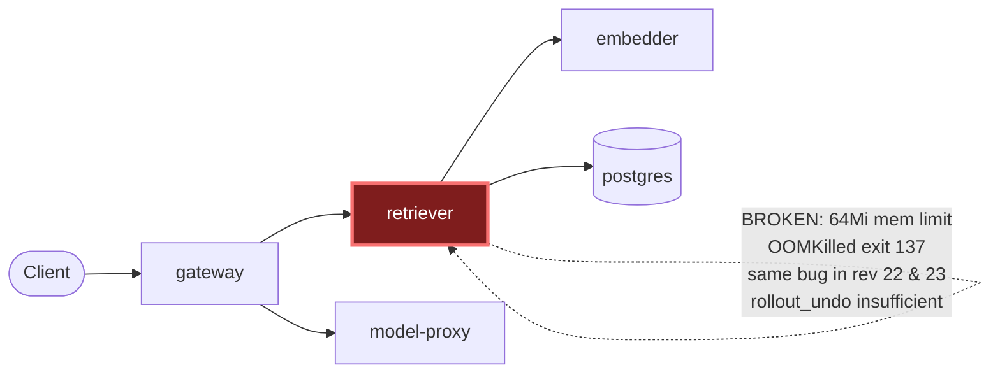

# Postmortem: subject/retriever-7b8cbbdbf5-79qbh container retriever is in CrashLoopBackOff

- **Status:** open
- **Severity:** sev1
- **Verified:** no
- **Opened:** 2026-08-12 19:14:56Z
- **Resolved:** (still open)

## Timeline (machine-generated)

All times UTC on 2026-08-12 unless a full date is shown.

| Time (UTC) | Source | Event |
| --- | --- | --- |
| 19:04:59Z | log-spike | log-spike onset: name=model-proxy-77457658bc-3-1 kind=AnalysisRun objectAPIversion=argoproj.io/v1alpha1 objectRV=2502090 eventRV=2502135 reportingcontroller=rollouts-controller sourcecomponent=rollouts-controller reason=MetricSuccessful ty… |
| 19:14:20Z | alert | alert firing: KubePodCrashLooping |
| 19:15:05Z | k8s | Pod/retriever-78b9dd9fd6-fq888: BackOff |
| 19:15:05Z | k8s | Pod/retriever-78b9dd9fd6-jwdfg: Started |
| 19:15:05Z | k8s | Pod/retriever-78b9dd9fd6-jwdfg: Pulled |
| 19:15:05Z | k8s | Pod/retriever-78b9dd9fd6-4vdfp: Started |
| 19:15:05Z | k8s | Pod/retriever-78b9dd9fd6-4vdfp: Pulled |
| 19:15:05Z | k8s | Pod/retriever-78b9dd9fd6-4vdfp: Created |
| 19:15:06Z | k8s | Pod/retriever-78b9dd9fd6-fq888: BackOff |
| 19:15:06Z | k8s | Pod/retriever-78b9dd9fd6-4vdfp: BackOff |
| 19:15:07Z | k8s | Pod/retriever-78b9dd9fd6-jwdfg: BackOff |
| 19:15:07Z | k8s | Pod/retriever-78b9dd9fd6-4vdfp: BackOff |
| 19:15:08Z | k8s | Pod/retriever-78b9dd9fd6-jwdfg: BackOff |
| 19:15:09Z | k8s | Pod/retriever-7b8cbbdbf5-5j7tl: BackOff |
| 19:15:10Z | k8s | Pod/retriever-7b8cbbdbf5-5j7tl: BackOff |
| 19:15:10Z | k8s | Pod/retriever-78b9dd9fd6-jwdfg: BackOff |
| 19:15:10Z | k8s | Pod/retriever-78b9dd9fd6-fq888: BackOff |
| 19:15:10Z | k8s | Pod/retriever-78b9dd9fd6-4vdfp: BackOff |
| 19:15:18Z | k8s | Pod/retriever-7b8cbbdbf5-lwh2b: Started |
| 19:15:18Z | k8s | Pod/retriever-7b8cbbdbf5-lwh2b: Pulled |
| 19:15:18Z | k8s | Pod/retriever-7b8cbbdbf5-lwh2b: Created |
| 19:15:19Z | k8s | Pod/retriever-7b8cbbdbf5-lwh2b: BackOff |
| 19:15:20Z | k8s | Pod/retriever-7b8cbbdbf5-lwh2b: BackOff |
| 19:15:21Z | k8s | Pod/retriever-7b8cbbdbf5-lwh2b: BackOff |
| 19:15:51Z | remediation | rollout_undo retriever executed (run run_19ff7662b9d724) |
| 19:16:01Z | k8s | Pod/retriever-7b8cbbdbf5-79qbh: BackOff |
| 19:16:04Z | k8s | Pod/retriever-7b8cbbdbf5-79qbh: Started |
| 19:16:04Z | k8s | Pod/retriever-7b8cbbdbf5-79qbh: Pulled |
| 19:16:04Z | k8s | Pod/retriever-7b8cbbdbf5-79qbh: Created |
| 19:16:06Z | k8s | Pod/retriever-7b8cbbdbf5-79qbh: BackOff |
| 19:16:07Z | k8s | Pod/retriever-7b8cbbdbf5-79qbh: BackOff |
| 19:16:08Z | k8s | Pod/retriever-7b8cbbdbf5-79qbh: BackOff |
| 19:16:22Z | k8s | Pod/retriever-78b9dd9fd6-4vdfp: BackOff |
| 19:16:28Z | k8s | Pod/retriever-78b9dd9fd6-jwdfg: Started |
| 19:16:28Z | k8s | Pod/retriever-78b9dd9fd6-jwdfg: Pulled |
| 19:16:28Z | k8s | Pod/retriever-78b9dd9fd6-jwdfg: Created |
| 19:16:28Z | k8s | Pod/retriever-78b9dd9fd6-4vdfp: Started |
| 19:16:28Z | k8s | Pod/retriever-78b9dd9fd6-4vdfp: Pulled |
| 19:16:28Z | k8s | Pod/retriever-78b9dd9fd6-4vdfp: Created |
| 19:16:29Z | k8s | Pod/retriever-78b9dd9fd6-4vdfp: BackOff |
| 19:16:30Z | k8s | Pod/retriever-78b9dd9fd6-jwdfg: BackOff |
| 19:16:30Z | k8s | Pod/retriever-78b9dd9fd6-4vdfp: BackOff |
| 19:16:30Z | k8s | Pod/retriever-7b8cbbdbf5-5j7tl: Started |
| 19:16:30Z | k8s | Pod/retriever-7b8cbbdbf5-5j7tl: Pulled |
| 19:16:30Z | k8s | Pod/retriever-7b8cbbdbf5-5j7tl: Created |
| 19:16:31Z | k8s | Pod/retriever-7b8cbbdbf5-5j7tl: BackOff |
| 19:16:31Z | k8s | Pod/retriever-78b9dd9fd6-jwdfg: BackOff |
| 19:16:31Z | k8s | Pod/retriever-78b9dd9fd6-4vdfp: BackOff |
| 19:16:32Z | k8s | Pod/retriever-7b8cbbdbf5-5j7tl: BackOff |
| 19:16:32Z | k8s | Pod/retriever-78b9dd9fd6-jwdfg: BackOff |
| 19:16:34Z | k8s | Pod/retriever-7b8cbbdbf5-5j7tl: BackOff |
| 19:16:37Z | k8s | Pod/retriever-78b9dd9fd6-4vdfp: BackOff |
| 19:16:40Z | k8s | Pod/retriever-7b8cbbdbf5-5j7tl: BackOff |
| 19:16:40Z | k8s | Pod/retriever-78b9dd9fd6-fq888: Started |
| 19:16:40Z | k8s | Pod/retriever-78b9dd9fd6-fq888: Pulled |
| 19:16:40Z | k8s | Pod/retriever-78b9dd9fd6-fq888: Created |
| 19:16:41Z | k8s | Pod/retriever-78b9dd9fd6-fq888: BackOff |
| 19:16:45Z | k8s | Pod/retriever-7b8cbbdbf5-lwh2b: Started |
| 19:16:45Z | k8s | Pod/retriever-7b8cbbdbf5-lwh2b: Pulled |
| 19:16:45Z | k8s | Pod/retriever-7b8cbbdbf5-lwh2b: Created |
| 19:16:46Z | k8s | Pod/retriever-78b9dd9fd6-fq888: BackOff |
| 19:16:47Z | k8s | Pod/retriever-7b8cbbdbf5-lwh2b: BackOff |
| 19:16:48Z | k8s | Pod/retriever-7b8cbbdbf5-lwh2b: BackOff |
| 19:16:50Z | k8s | Pod/retriever-7b8cbbdbf5-lwh2b: BackOff |
| 19:16:50Z | k8s | Pod/retriever-78b9dd9fd6-fq888: BackOff |
| 19:17:25Z | k8s | Pod/retriever-7b8cbbdbf5-79qbh: BackOff |
| 19:17:46Z | k8s | Pod/retriever-78b9dd9fd6-jwdfg: BackOff |
| 19:17:50Z | k8s | Pod/retriever-78b9dd9fd6-4vdfp: BackOff |
| 19:17:52Z | k8s | Pod/retriever-7b8cbbdbf5-lwh2b: BackOff |
| 19:17:55Z | k8s | Pod/retriever-78b9dd9fd6-fq888: BackOff |
| 19:18:06Z | k8s | Pod/retriever-7b8cbbdbf5-5j7tl: BackOff |
| 19:18:46Z | k8s | Pod/retriever-7b8cbbdbf5-79qbh: BackOff |
| 19:18:59Z | k8s | Pod/retriever-78b9dd9fd6-jwdfg: BackOff |
| 19:19:03Z | k8s | Pod/retriever-78b9dd9fd6-fq888: BackOff |
| 19:19:05Z | k8s | Pod/retriever-7b8cbbdbf5-lwh2b: BackOff |
| 19:19:10Z | k8s | Pod/retriever-78b9dd9fd6-jwdfg: Started |
| 19:19:10Z | k8s | Pod/retriever-78b9dd9fd6-jwdfg: Pulled |
| 19:19:10Z | k8s | Pod/retriever-78b9dd9fd6-jwdfg: Created |
| 19:19:11Z | k8s | Pod/retriever-78b9dd9fd6-jwdfg: BackOff |
| 19:19:12Z | k8s | Pod/retriever-78b9dd9fd6-jwdfg: BackOff |
| 19:19:13Z | k8s | Pod/retriever-7b8cbbdbf5-5j7tl: Started |
| 19:19:13Z | k8s | Pod/retriever-7b8cbbdbf5-5j7tl: Pulled |
| 19:19:13Z | k8s | Pod/retriever-7b8cbbdbf5-5j7tl: Created |
| 19:19:14Z | k8s | Pod/retriever-7b8cbbdbf5-5j7tl: BackOff |
| 19:19:14Z | k8s | Pod/retriever-78b9dd9fd6-4vdfp: Started |
| 19:19:14Z | k8s | Pod/retriever-78b9dd9fd6-4vdfp: Pulled |
| 19:19:14Z | k8s | Pod/retriever-78b9dd9fd6-4vdfp: Created |
| 19:19:15Z | k8s | Pod/retriever-7b8cbbdbf5-5j7tl: BackOff |
| 19:19:15Z | k8s | Pod/retriever-78b9dd9fd6-4vdfp: BackOff |
| 19:19:16Z | k8s | Pod/retriever-78b9dd9fd6-4vdfp: BackOff |
| 19:19:17Z | k8s | Pod/retriever-78b9dd9fd6-4vdfp: BackOff |
| 19:19:20Z | k8s | Pod/retriever-7b8cbbdbf5-5j7tl: BackOff |
| 19:19:20Z | k8s | Pod/retriever-78b9dd9fd6-jwdfg: BackOff |
| 19:19:29Z | k8s | Pod/retriever-78b9dd9fd6-fq888: Started |
| 19:19:29Z | k8s | Pod/retriever-78b9dd9fd6-fq888: Pulled |
| 19:19:29Z | k8s | Pod/retriever-78b9dd9fd6-fq888: Created |
| 19:19:31Z | k8s | Pod/retriever-78b9dd9fd6-fq888: BackOff |
| 19:19:32Z | k8s | Pod/retriever-78b9dd9fd6-fq888: BackOff |
| 19:19:36Z | k8s | Pod/retriever-7b8cbbdbf5-lwh2b: Started |
| 19:19:36Z | k8s | Pod/retriever-7b8cbbdbf5-lwh2b: Pulled |
| 19:19:36Z | k8s | Pod/retriever-7b8cbbdbf5-lwh2b: Created |
| 19:19:37Z | k8s | Pod/retriever-7b8cbbdbf5-lwh2b: BackOff |
| 19:19:38Z | k8s | Pod/retriever-7b8cbbdbf5-lwh2b: BackOff |

## Evidence links

- [Loki — logs over the incident window](http://localhost:3001/explore?schemaVersion=1&panes=%7B%22pm%22%3A+%7B%22datasource%22%3A+%22loki%22%2C+%22queries%22%3A+%5B%7B%22refId%22%3A+%22A%22%2C+%22datasource%22%3A+%7B%22type%22%3A+%22loki%22%2C+%22uid%22%3A+%22loki%22%7D%2C+%22expr%22%3A+%22%7Bnamespace%3D%5C%22subject%5C%22%7D+%7C~+%5C%22%28%3Fi%29error%7Cfailed%5C%22%22%7D%5D%2C+%22range%22%3A+%7B%22from%22%3A+%221786562096023%22%2C+%22to%22%3A+%221786562380847%22%7D%7D%7D&orgId=1)
- [Mimir — metrics over the incident window](http://localhost:3001/explore?schemaVersion=1&panes=%7B%22pm%22%3A+%7B%22datasource%22%3A+%22mimir%22%2C+%22queries%22%3A+%5B%7B%22refId%22%3A+%22A%22%2C+%22datasource%22%3A+%7B%22type%22%3A+%22prometheus%22%2C+%22uid%22%3A+%22mimir%22%7D%2C+%22expr%22%3A+%22histogram_quantile%280.95%2C+sum%28rate%28http_server_duration_milliseconds_bucket%5B5m%5D%29%29+by+%28le%29%29%22%7D%5D%2C+%22range%22%3A+%7B%22from%22%3A+%221786562096023%22%2C+%22to%22%3A+%221786562380847%22%7D%7D%7D&orgId=1)

## Investigation context

**Runbook match (1):** `k8s-crashloop.md` — toolset narrowed to 12 tools: alert_status, deploy_history, k8s_events, kubectl_read, loki_query, publish_postmortem, request_approval, restart_workload, rollout_undo, runbook_lookup, runbook_read, save_artifact

Pre-check battery (as injected at run start)

## Pre-check leads

### recent_deploys — LEAD
2 deploy-window leads
- argo app platform: sync=OutOfSync health=Healthy (revision c025382ba170)
- argo app retriever: sync=OutOfSync health=Progressing (revision c025382ba170)

### kube_scan — LEAD
21 kube-scan leads
- pod retriever-78b9dd9fd6-4vdfp: CrashLoopBackOff
- pod retriever-78b9dd9fd6-fq888: CrashLoopBackOff
- pod retriever-78b9dd9fd6-jwdfg: CrashLoopBackOff
- pod retriever-7b8cbbdbf5-5j7tl: CrashLoopBackOff
- pod retriever-7b8cbbdbf5-79qbh: CrashLoopBackOff
- pod retriever-7b8cbbdbf5-lwh2b: CrashLoopBackOff
- event Pod/retriever-78b9dd9fd6-4vdfp: BackOff — Back-off restarting failed container retriever in pod retriever-78b9dd9fd6-4vdfp_subject(d08b221b-6e8a-4ebf-b0b4-4aa890d20ed0) (at 21:14:16)
- event Pod/retriever-78b9dd9fd6-4vdfp: BackOff — Back-off restarting failed container retriever in pod retriever-78b9dd9fd6-4vdfp_subject(d08b221b-6e8a-4ebf-b0b4-4aa890d20ed0) (at 21:14:17)
- … (+13 more leads omitted)

### log_spike — LEAD
error/failed log rate 113/10min vs baseline 0/10min (113x baseline) — onset: name=model-proxy-77457658bc-3-1 kind=AnalysisRun objectAPIversion=argoproj.io/v1alpha1 objectRV=2502090 eventRV=2502135 reportingcontroller=rollouts-controller sourcecomponent=rollouts-controller reason=MetricSuccessful type=Normal count=1 msg="Metric 'canary-error-rate' Completed. Result: Successful"  at 2026-08-12T19:04:59+00:00
- error/failed log rate 113/10min vs baseline 0/10min (113x baseline) — onset: name=model-proxy-77457658bc-3-1 kind=AnalysisRun objectAPIversion=argoproj.io/v1alpha1 objectRV=2502090 eventR… (truncated)

### attribution — LEAD
No service or dependency edge above 1% errors or 1s p95 in the last 10m (highest: gateway 0.0%) — whatever paged us is not a broad service-level failure. Look for something too narrow to move a service-wide number (one route, one tenant, one pod) or something that is not request-shaped at all (a stuck rollout, a pipeline, a credential).
- No service or dependency edge above 1% errors or 1s p95 in the last 10m (highest: gateway 0.0%) — whatever paged us is not a broad service-level failure. Look for something too narrow to… (truncated)

### rollout_state — OK
gateway and model-proxy rollouts stable, no failed analysis

### secret_age — OK
Secret subject-db-credentials last modified 18d 19h ago (created 18d 19h ago).

## Narrative

## Summary
`KubePodCrashLooping` fired for `subject/retriever-7b8cbbdbf5-79qbh`. All retriever pods across two ReplicaSets (`retriever-78b9dd9fd6`, `retriever-7b8cbbdbf5`) were in CrashLoopBackOff. A `rollout_undo` remediation was dry-run, approved, and executed, but did **not** clear the alert — the retriever workload remains degraded.

## Impact
6 of 7 desired retriever pods unavailable (CrashLoopBackOff, restart counts climbing every ~cycle). Only 1 replica, on the older `retriever-d6d55bf7f` ReplicaSet, stayed Ready and kept serving retrieval traffic — partial capacity, not a full outage, but well below intended replica count. The attribution pre-check found no broad service-level error/latency signal, consistent with this being a narrow, pod-scoped failure rather than a request-path-wide incident — but it starves the request path of retrieval capacity underneath the gateway.

## Root cause
Every crashing retriever pod's last termination was **OOMKilled (exit 137)**, with a container memory **limit of 64Mi** (request 48Mi) — far too small for the retriever workload (the last known-good ReplicaSet, `retriever-d6d55bf7f`, runs the identical image at a **512Mi limit / 192Mi request**). `kubectl describe pod` confirmed this on both crashing ReplicaSets:
- `retriever-7b8cbbdbf5-79qbh` (revision 23): `Limits: memory: 64Mi`, `Last State: Terminated / OOMKilled / Exit Code 137`
- `retriever-78b9dd9fd6-4vdfp` (revision 22, the `rollout_undo` target): **same** `Limits: memory: 64Mi`, **same** `OOMKilled / Exit Code 137`

The image tag (`10f24bc`) is identical across revisions 22, 23, and 24 — this was a **config-only regression** (a manifest/limits change, not a code or image change), matching the runbook's first hypothesis. Critically, the misconfigured 64Mi limit was present in **two consecutive revisions**, not one: a single-step `rollout_undo` from 23→22 landed on an equally-broken revision. The Argo pre-check lead had already flagged `retriever` as `OutOfSync`/`Progressing` at revision `c025382ba170`, consistent with a recent gitops sync repeatedly reapplying the bad limit. The last genuinely healthy config lives only in `retriever-d6d55bf7f` (4d23h old, 512Mi), which is more than one revision-step back and unreachable with a single `rollout_undo` — this incident's remediation toolset had no `--to-revision` rollback, no direct memory-limit patch, and no Argo sync control to reach it.

## What fixed it
**Nothing fully did.** The approved `rollout_undo` (revision 23 → 22) was executed as designed by the runbook, but post-remediation verification (`kubectl_read describe pod`, `alert_status`) showed revision 22 carries the same 64Mi limit and the same OOMKilled failure — the alert is still active and its firing count increased (3) after the remediation. The one healthy replica on `retriever-d6d55bf7f` was never touched and continued serving throughout, capping the blast radius at reduced-capacity rather than total outage, but this was pre-existing headroom, not something this remediation produced.

## Lessons
- A crashloop root-caused to a bad *config* (not a bad image) can span more than one revision if the same broken value keeps getting reapplied by gitops sync — a single `kubectl rollout undo` step is not guaranteed to reach a known-good config, and should be paired with `rollout history`/revision inspection before treating "undo once" as sufficient.
- Add a `--to-revision`-capable rollback (or a direct resource-limit patch) to the on-call toolset for `k8s-crashloop.md`-class incidents; the current `rollout_undo` primitive is one-step-only and can silently ping-pong between two bad revisions.
- The retriever manifest's memory limit (64Mi vs. the proven-working 512Mi) needs a source-of-truth fix in the gitops repo at revision `c025382ba170` (or whatever superseded it) before any further auto-sync — otherwise Argo will keep re-introducing this value on every reconcile.
- Escalate to a human for a manual `kubectl rollout undo --to-revision=<d6d55bf7f's revision>` or a gitops manifest fix + resync, since neither is available through this incident's remediation toolset.

