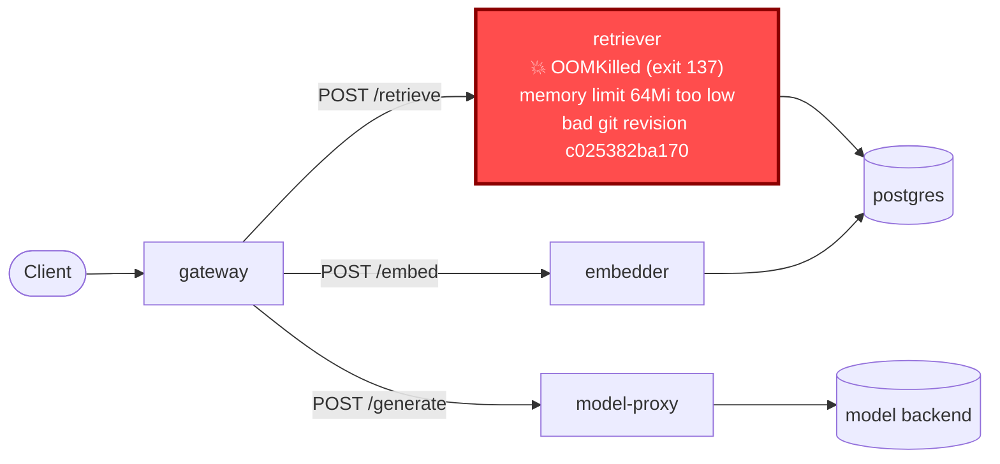

# Postmortem: subject/retriever-78b9dd9fd6-9tdxz container retriever is in CrashLoopBackOff

- **Status:** resolved
- **Severity:** sev1
- **Verified:** no
- **Opened:** 2026-08-12 18:55:56Z
- **Resolved:** 2026-08-12 19:00:56Z

## Timeline (machine-generated)

All times UTC on 2026-08-12 unless a full date is shown.

| Time (UTC) | Source | Event |
| --- | --- | --- |
| 18:52:36Z | log-spike | log-spike onset: [gateway] unhandled error: 16 \| } |
| 18:55:20Z | alert | alert firing: KubePodCrashLooping |
| 18:55:20Z | alert | alert resolved: KubePodCrashLooping |
| 18:57:07Z | remediation | rollout_undo retriever executed (run run_19ff754c6a759) |
| 19:00:26Z | remediation | rollout_undo retriever executed (run run_19ff754c6a759) |
| 19:01:02Z | k8s | Pod/retriever-7b8cbbdbf5-pkjmd: Scheduled |
| 19:01:02Z | k8s | Pod/retriever-7b8cbbdbf5-6ptpg: Scheduled |
| 19:01:03Z | k8s | Pod/retriever-7b8cbbdbf5-pkjmd: Pulled |
| 19:01:03Z | k8s | Pod/retriever-7b8cbbdbf5-pkjmd: Created |
| 19:01:04Z | k8s | Pod/retriever-7b8cbbdbf5-pkjmd: Started |
| 19:01:04Z | k8s | Pod/retriever-7b8cbbdbf5-6ptpg: Started |
| 19:01:04Z | k8s | Pod/retriever-7b8cbbdbf5-6ptpg: Pulled |
| 19:01:04Z | k8s | Pod/retriever-7b8cbbdbf5-6ptpg: Created |
| 19:01:06Z | k8s | Pod/retriever-7b8cbbdbf5-pkjmd: Started |
| 19:01:06Z | k8s | Pod/retriever-7b8cbbdbf5-pkjmd: Pulled |
| 19:01:06Z | k8s | Pod/retriever-7b8cbbdbf5-pkjmd: Created |
| 19:01:07Z | k8s | Pod/retriever-7b8cbbdbf5-6ptpg: Started |
| 19:01:07Z | k8s | Pod/retriever-7b8cbbdbf5-6ptpg: Pulled |
| 19:01:07Z | k8s | Pod/retriever-7b8cbbdbf5-6ptpg: Created |
| 19:01:08Z | k8s | Pod/retriever-7b8cbbdbf5-pkjmd: BackOff |
| 19:01:09Z | k8s | Pod/retriever-7b8cbbdbf5-pkjmd: BackOff |
| 19:01:10Z | k8s | Pod/retriever-7b8cbbdbf5-6ptpg: BackOff |
| 19:01:13Z | k8s | Pod/retriever-7b8cbbdbf5-pkjmd: BackOff |
| 19:01:13Z | k8s | Pod/retriever-7b8cbbdbf5-6ptpg: BackOff |
| 19:01:18Z | k8s | Pod/retriever-7b8cbbdbf5-pkjmd: Started |
| 19:01:18Z | k8s | Pod/retriever-7b8cbbdbf5-pkjmd: Pulled |
| 19:01:18Z | k8s | Pod/retriever-7b8cbbdbf5-pkjmd: Created |
| 19:01:19Z | k8s | Rollout/model-proxy: RolloutUpdated |
| 19:01:19Z | k8s | Rollout/model-proxy: RolloutNotCompleted |
| 19:01:19Z | k8s | Rollout/model-proxy: NewReplicaSetCreated |
| 19:01:20Z | k8s | Pod/retriever-7b8cbbdbf5-pkjmd: BackOff |
| 19:01:20Z | k8s | ReplicaSet/model-proxy-77457658bc: SuccessfulCreate |
| 19:01:20Z | k8s | Pod/model-proxy-554d76745d-6f2p5: Killing |
| 19:01:20Z | k8s | ReplicaSet/model-proxy-554d76745d: SuccessfulDelete |
| 19:01:20Z | k8s | Rollout/model-proxy: ScalingReplicaSet |
| 19:01:20Z | k8s | Pod/model-proxy-77457658bc-5q9ts: Scheduled |
| 19:01:21Z | k8s | Pod/retriever-7b8cbbdbf5-pkjmd: BackOff |
| 19:01:21Z | k8s | Pod/retriever-7b8cbbdbf5-6ptpg: Started |
| 19:01:21Z | k8s | Pod/retriever-7b8cbbdbf5-6ptpg: Pulled |
| 19:01:21Z | k8s | Pod/retriever-7b8cbbdbf5-6ptpg: Created |
| 19:01:21Z | k8s | Pod/model-proxy-77457658bc-5q9ts: Started |
| 19:01:21Z | k8s | Pod/model-proxy-77457658bc-5q9ts: Pulled |
| 19:01:21Z | k8s | Pod/model-proxy-77457658bc-5q9ts: Created |
| 19:01:23Z | k8s | Pod/retriever-7b8cbbdbf5-pkjmd: BackOff |
| 19:01:23Z | k8s | Pod/retriever-7b8cbbdbf5-6ptpg: BackOff |
| 19:01:24Z | k8s | Pod/retriever-7b8cbbdbf5-6ptpg: BackOff |
| 19:01:28Z | k8s | Rollout/model-proxy: RolloutStepCompleted |
| 19:01:30Z | k8s | Rollout/model-proxy: AnalysisRunRunning |
| 19:01:33Z | k8s | Pod/retriever-7b8cbbdbf5-6ptpg: BackOff |
| 19:01:44Z | k8s | Pod/retriever-7b8cbbdbf5-pkjmd: Started |
| 19:01:44Z | k8s | Pod/retriever-7b8cbbdbf5-pkjmd: Pulled |
| 19:01:44Z | k8s | Pod/retriever-7b8cbbdbf5-pkjmd: Created |
| 19:01:45Z | k8s | Pod/retriever-7b8cbbdbf5-pkjmd: BackOff |
| 19:01:46Z | k8s | Pod/retriever-7b8cbbdbf5-pkjmd: BackOff |
| 19:01:46Z | k8s | Pod/retriever-7b8cbbdbf5-6ptpg: Started |
| 19:01:46Z | k8s | Pod/retriever-7b8cbbdbf5-6ptpg: Pulled |
| 19:01:46Z | k8s | Pod/retriever-7b8cbbdbf5-6ptpg: Created |
| 19:01:48Z | k8s | Pod/retriever-7b8cbbdbf5-6ptpg: BackOff |
| 19:01:53Z | k8s | Pod/retriever-7b8cbbdbf5-pkjmd: BackOff |
| 19:01:53Z | k8s | Pod/retriever-7b8cbbdbf5-6ptpg: BackOff |
| 19:02:08Z | k8s | ReplicaSet/gateway-8fd65cbf: SuccessfulCreate |
| 19:02:08Z | k8s | Deployment/gateway: ScalingReplicaSet |
| 19:02:08Z | k8s | Pod/gateway-8fd65cbf-x6qqb: Scheduled |
| 19:02:09Z | k8s | Pod/gateway-8fd65cbf-x6qqb: Started |
| 19:02:09Z | k8s | Pod/gateway-8fd65cbf-x6qqb: Pulled |
| 19:02:09Z | k8s | Pod/gateway-8fd65cbf-x6qqb: Created |
| 19:02:09Z | k8s | Pod/gateway-8fd65cbf-c6kl5: Pulled |
| 19:02:09Z | k8s | Pod/gateway-8fd65cbf-c6kl5: Created |
| 19:02:09Z | k8s | Pod/gateway-8fd65cbf-9nk88: Started |
| 19:02:09Z | k8s | Pod/gateway-8fd65cbf-9nk88: Pulled |
| 19:02:09Z | k8s | Pod/gateway-8fd65cbf-9nk88: Created |
| 19:02:09Z | k8s | ReplicaSet/gateway-8fd65cbf: SuccessfulCreate |
| 19:02:09Z | k8s | Pod/gateway-8fd65cbf-c6kl5: Scheduled |
| 19:02:09Z | k8s | Pod/gateway-8fd65cbf-kxqbn: FailedScheduling |
| 19:02:09Z | k8s | Pod/gateway-8fd65cbf-n7m2x: FailedScheduling |
| 19:02:09Z | k8s | Pod/gateway-8fd65cbf-9nk88: Scheduled |
| 19:02:09Z | k8s | Pod/gateway-8fd65cbf-ztnzx: FailedScheduling |
| 19:02:10Z | k8s | Pod/gateway-8fd65cbf-c6kl5: Started |
| 19:02:30Z | k8s | Pod/retriever-7b8cbbdbf5-pkjmd: Started |
| 19:02:30Z | k8s | Pod/retriever-7b8cbbdbf5-pkjmd: Pulled |
| 19:02:30Z | k8s | Pod/retriever-7b8cbbdbf5-pkjmd: Created |
| 19:02:32Z | k8s | Pod/retriever-7b8cbbdbf5-pkjmd: BackOff |
| 19:02:33Z | k8s | Pod/retriever-7b8cbbdbf5-pkjmd: BackOff |
| 19:02:34Z | k8s | Pod/retriever-7b8cbbdbf5-pkjmd: BackOff |
| 19:02:36Z | k8s | Pod/retriever-7b8cbbdbf5-6ptpg: Started |
| 19:02:36Z | k8s | Pod/retriever-7b8cbbdbf5-6ptpg: Pulled |
| 19:02:36Z | k8s | Pod/retriever-7b8cbbdbf5-6ptpg: Created |
| 19:02:37Z | k8s | Pod/retriever-7b8cbbdbf5-6ptpg: BackOff |
| 19:02:38Z | k8s | Pod/retriever-7b8cbbdbf5-6ptpg: BackOff |
| 19:02:43Z | k8s | Pod/retriever-7b8cbbdbf5-6ptpg: BackOff |
| 19:03:16Z | k8s | Pod/gateway-8fd65cbf-x6qqb: Killing |
| 19:03:16Z | k8s | Pod/gateway-8fd65cbf-c6kl5: Killing |
| 19:03:16Z | k8s | Pod/gateway-8fd65cbf-9nk88: Killing |
| 19:03:16Z | k8s | ReplicaSet/gateway-8fd65cbf: SuccessfulDelete |
| 19:03:16Z | k8s | Deployment/gateway: ScalingReplicaSet |

## Evidence links

- [Loki — logs over the incident window](http://localhost:3001/explore?schemaVersion=1&panes=%7B%22pm%22%3A+%7B%22datasource%22%3A+%22loki%22%2C+%22queries%22%3A+%5B%7B%22refId%22%3A+%22A%22%2C+%22datasource%22%3A+%7B%22type%22%3A+%22loki%22%2C+%22uid%22%3A+%22loki%22%7D%2C+%22expr%22%3A+%22%7Bnamespace%3D%5C%22subject%5C%22%7D+%7C~+%5C%22%28%3Fi%29error%7Cfailed%5C%22%22%7D%5D%2C+%22range%22%3A+%7B%22from%22%3A+%221786560956057%22%2C+%22to%22%3A+%221786561256052%22%7D%7D%7D&orgId=1)
- [Mimir — metrics over the incident window](http://localhost:3001/explore?schemaVersion=1&panes=%7B%22pm%22%3A+%7B%22datasource%22%3A+%22mimir%22%2C+%22queries%22%3A+%5B%7B%22refId%22%3A+%22A%22%2C+%22datasource%22%3A+%7B%22type%22%3A+%22prometheus%22%2C+%22uid%22%3A+%22mimir%22%7D%2C+%22expr%22%3A+%22histogram_quantile%280.95%2C+sum%28rate%28http_server_duration_milliseconds_bucket%5B5m%5D%29%29+by+%28le%29%29%22%7D%5D%2C+%22range%22%3A+%7B%22from%22%3A+%221786560956057%22%2C+%22to%22%3A+%221786561256052%22%7D%7D%7D&orgId=1)

## Investigation context

**Runbook match (1):** `k8s-crashloop.md` — toolset narrowed to 12 tools: alert_status, deploy_history, k8s_events, kubectl_read, loki_query, publish_postmortem, request_approval, restart_workload, rollout_undo, runbook_lookup, runbook_read, save_artifact

Pre-check battery (as injected at run start)

## Pre-check leads

### recent_deploys — LEAD
2 deploy-window leads
- argo app platform: sync=OutOfSync health=Healthy (revision c025382ba170)
- argo app retriever: sync=OutOfSync health=Progressing (revision c025382ba170)

### kube_scan — LEAD
21 kube-scan leads
- pod retriever-78b9dd9fd6-9tdxz: CrashLoopBackOff
- pod retriever-78b9dd9fd6-lqkqd: CrashLoopBackOff
- pod retriever-78b9dd9fd6-pz8qd: CrashLoopBackOff
- event Pod/retriever-78b9dd9fd6-9tdxz: BackOff — Back-off restarting failed container retriever in pod retriever-78b9dd9fd6-9tdxz_subject(624db80c-2f49-4930-ad33-4bbbed7cb4be) (at 20:52:52)
- event Pod/retriever-78b9dd9fd6-lqkqd: BackOff — Back-off restarting failed container retriever in pod retriever-78b9dd9fd6-lqkqd_subject(73c374ee-5ae9-409b-90f5-87e49b170957) (at 20:52:53)
- event Pod/retriever-78b9dd9fd6-lqkqd: BackOff — Back-off restarting failed container retriever in pod retriever-78b9dd9fd6-lqkqd_subject(73c374ee-5ae9-409b-90f5-87e49b170957) (at 20:52:58)
- event Pod/retriever-78b9dd9fd6-9
… (section truncated)

### log_spike — LEAD
error/failed log rate 200/10min vs baseline 0/10min (200x baseline) — onset: [gateway] unhandled error: 16 |         } at 2026-08-12T18:52:36.495621+00:00
- error/failed log rate 200/10min vs baseline 0/10min (200x baseline) — onset: [gateway] unhandled error: 16 |         } at 2026-08-12T18:52:36.495621+00:00

### attribution — LEAD
errors concentrate on gateway → POST model-proxy (11.8%); time concentrates in gateway's own handler (~4.8s of 7.7s) over the last 10m — which is not necessarily the workload named on the alert:
- gateway: 5.6% of its OWN responses are 5xx (10m)
- model-proxy: 2.7% of its OWN responses are 5xx (10m)
- gateway → POST model-proxy: 11.8% of those outbound calls failed
- own-handler p95 (server p95 minus its slowest outbound call — a ranking, not a measurement): gateway ~4.8s of 7.7s end to end, retriever ~2.8s of 2.8s end to end, embedder ~2.8s of 2.8s end to end
- gateway → POST retriever: p95 2.9s outbound
- gateway → POST embedder: p95 2.8s outbound

### rollout_state — OK
gateway and model-proxy rollouts stable, no failed analysis

### secret_age — OK
Secret subject-db-credentials last modified 18d 19h ago (created 18d 19h ago).

## Narrative

## Summary

`KubePodCrashLooping` fired for `subject/retriever-78b9dd9fd6-9tdxz`. The retriever Deployment's currently-active revision sets a container memory limit of **64Mi** (request 48Mi), which the retriever process cannot fit in — every pod on that revision terminates with `OOMKilled` (exit 137) within seconds of starting, and kubelet backs off into `CrashLoopBackOff`. This matches runbook `k8s-crashloop.md` hypothesis 1: "a new revision introduced a bad env/config."

## Impact

All three retriever replicas on the bad revision were unavailable (CrashLoopBackOff/OOMKilled), pulling capacity out of the retrieval path. Correlated pre-check attribution showed gateway's own error rate at 5.6% (10m) with 11.8% of its outbound calls to model-proxy failing and gateway's own-handler p95 blown out to ~4.8s of a 7.7s end-to-end p95 — consistent with gateway timing out/retrying against a degraded retrieval tier. A 200x baseline error-log spike on gateway began at 18:52:36 UTC, immediately after the retriever pods started crashing (~18:51 UTC).

## Root cause

The Argo-tracked `retriever` (and `platform`) Application was OutOfSync/Progressing at revision `c025382ba170` — the git-tracked Deployment manifest at that revision carries a container memory limit of 64Mi, too small for the retriever workload's actual footprint. `kubectl describe pod` confirmed `Last State: Terminated / Reason: OOMKilled / Exit Code: 137` with `Limits: memory: 64Mi`. Critically, the container **image tag was unchanged** (`obs-registry:5010/retriever:10f24bc`) between the bad revision and the last-known-good one — this is a resource-limit/manifest regression, not a code or dependency change, ruling out hypotheses 2 and 3 in the runbook.

## What fixed it

Per the runbook's mitigate step, `rollout_undo` (dry-run first, diff attached to the approval card, approved by the operator) rolled `deployment/retriever` back to its previous revision — same image, different (working) resource spec. The first rollback reduced bad-revision pods from 3 to 2 and `alert_status` briefly settled, but the deployment kept drifting back toward the bad manifest (new `deployment.kubernetes.io/revision` numbers, the `NewReplicaSet` reverting to the 64Mi-limited template, and eventually an entirely new pod-template hash `retriever-7b8cbbdbf5` spawning and OOMKilling within 6 seconds of creation) — consistent with continued reconciliation back toward the still-OutOfSync git revision `c025382ba170`. A second approved `rollout_undo` was applied. Following that, `alert_status` for `KubePodCrashLooping` reported `active: false` and held resolved across five consecutive re-checks.

**Caveat — do not over-claim recovery:** even after the alert cleared, `kubectl get pods` continued to show 2 of 5 retriever pods spawning fresh from the bad manifest and OOMKilling (most recently pod-template-hash `7b8cbbdbf5`, restartedAt freshly stamped at the time of the last check). The paged alert instance is resolved, but the underlying bad revision is still live in git and is still being intermittently re-applied to the cluster. This incident is not durably closed until the memory limit is corrected at the source (git revision `c025382ba170`) — that edit is outside the read-mostly/rollback toolset available to this on-call session.

## Lessons

- The retriever container's actual memory footprint exceeds its configured limit (64Mi limit / 48Mi request) even under a working revision's steady state — the limit in `c025382ba170` was almost certainly an intentional-looking but wrong tightening; it should be raised and load-tested before merge, not just reverted.
- An OutOfSync Argo Application with self-heal reasserting a broken revision defeats imperative `kubectl rollout undo` — the durable fix has to land in git and re-sync, or auto-sync needs pausing during remediation. Neither capability was available in this incident's toolset; flagging as a follow-up for on-call tooling.
- `alert_status` cleared before the underlying regression was actually gone (new bad pods kept spawning). Treat "alert resolved" as necessary but not sufficient evidence of a durable fix — corroborate with direct resource state before declaring an incident closed.

## Delivery path and failure point

