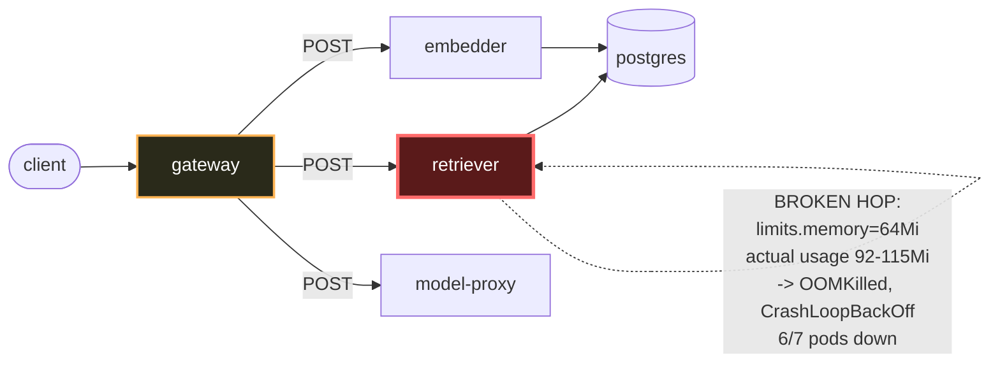

# Postmortem: gateway availability error budget burning slowly (10% of the 28d budget in 6h; 30m & 6h windows)

- **Status:** open
- **Severity:** sev2
- **Verified:** no
- **Opened:** 2026-08-12 19:10:44Z
- **Resolved:** (still open)

## Timeline (machine-generated)

All times UTC on 2026-08-12 unless a full date is shown.

| Time (UTC) | Source | Event |
| --- | --- | --- |
| 19:00:45Z | log-spike | log-spike onset: name=retriever-78b9dd9fd6-xhlx7 kind=Pod objectAPIversion=v1 objectRV=2501303 eventRV=2501401 reportinginstance=k3d-obs-lab-agent-0 reportingcontroller=kubelet sourcecomponent=kubelet sourcehost=k3d-obs-lab-agent-0 reason=… |
| 19:10:10Z | alert | alert firing: SLO gateway availability — slow burn |
| 19:13:35Z | remediation | rollout_undo retriever executed (run run_19ff762545959d) |
| 19:14:18Z | k8s | Pod/retriever-78b9dd9fd6-4vdfp: BackOff |
| 19:14:18Z | k8s | Pod/retriever-7b8cbbdbf5-5j7tl: Pulled |
| 19:14:20Z | k8s | Pod/retriever-7b8cbbdbf5-5j7tl: BackOff |
| 19:14:20Z | k8s | Pod/retriever-78b9dd9fd6-fq888: Started |
| 19:14:20Z | k8s | Pod/retriever-78b9dd9fd6-fq888: Pulled |
| 19:14:20Z | k8s | Pod/retriever-78b9dd9fd6-fq888: Created |
| 19:14:21Z | k8s | Pod/retriever-7b8cbbdbf5-5j7tl: BackOff |
| 19:14:21Z | k8s | Pod/retriever-78b9dd9fd6-jwdfg: Started |
| 19:14:21Z | k8s | Pod/retriever-78b9dd9fd6-jwdfg: Pulled |
| 19:14:21Z | k8s | Pod/retriever-78b9dd9fd6-jwdfg: Created |
| 19:14:22Z | k8s | Pod/retriever-7b8cbbdbf5-5j7tl: BackOff |
| 19:14:22Z | k8s | Pod/retriever-78b9dd9fd6-jwdfg: BackOff |
| 19:14:22Z | k8s | Pod/retriever-78b9dd9fd6-fq888: BackOff |
| 19:14:23Z | k8s | Pod/retriever-78b9dd9fd6-jwdfg: BackOff |
| 19:14:23Z | k8s | Pod/retriever-78b9dd9fd6-fq888: BackOff |
| 19:14:25Z | k8s | Pod/retriever-7b8cbbdbf5-lwh2b: Started |
| 19:14:25Z | k8s | Pod/retriever-7b8cbbdbf5-lwh2b: Pulled |
| 19:14:25Z | k8s | Pod/retriever-7b8cbbdbf5-lwh2b: Created |
| 19:14:26Z | k8s | Pod/retriever-7b8cbbdbf5-lwh2b: BackOff |
| 19:14:27Z | k8s | Pod/retriever-7b8cbbdbf5-lwh2b: BackOff |
| 19:14:30Z | k8s | Pod/retriever-7b8cbbdbf5-lwh2b: BackOff |
| 19:14:30Z | k8s | Pod/retriever-78b9dd9fd6-jwdfg: BackOff |
| 19:14:30Z | k8s | Pod/retriever-78b9dd9fd6-fq888: BackOff |
| 19:14:56Z | k8s | Pod/retriever-7b8cbbdbf5-79qbh: BackOff |
| 19:15:03Z | k8s | Pod/retriever-7b8cbbdbf5-5j7tl: Started |
| 19:15:03Z | k8s | Pod/retriever-7b8cbbdbf5-5j7tl: Pulled |
| 19:15:03Z | k8s | Pod/retriever-7b8cbbdbf5-5j7tl: Created |
| 19:15:04Z | k8s | Pod/retriever-7b8cbbdbf5-5j7tl: BackOff |
| 19:15:04Z | k8s | Pod/retriever-78b9dd9fd6-fq888: Started |
| 19:15:04Z | k8s | Pod/retriever-78b9dd9fd6-fq888: Pulled |
| 19:15:04Z | k8s | Pod/retriever-78b9dd9fd6-fq888: Created |
| 19:15:05Z | k8s | Pod/retriever-78b9dd9fd6-fq888: BackOff |
| 19:15:05Z | k8s | Pod/retriever-78b9dd9fd6-jwdfg: Started |
| 19:15:05Z | k8s | Pod/retriever-78b9dd9fd6-jwdfg: Pulled |
| 19:15:05Z | k8s | Pod/retriever-78b9dd9fd6-jwdfg: Created |
| 19:15:05Z | k8s | Pod/retriever-78b9dd9fd6-4vdfp: Started |
| 19:15:05Z | k8s | Pod/retriever-78b9dd9fd6-4vdfp: Pulled |
| 19:15:05Z | k8s | Pod/retriever-78b9dd9fd6-4vdfp: Created |
| 19:15:06Z | k8s | Pod/retriever-78b9dd9fd6-fq888: BackOff |
| 19:15:06Z | k8s | Pod/retriever-78b9dd9fd6-4vdfp: BackOff |
| 19:15:07Z | k8s | Pod/retriever-78b9dd9fd6-jwdfg: BackOff |
| 19:15:07Z | k8s | Pod/retriever-78b9dd9fd6-4vdfp: BackOff |
| 19:15:08Z | k8s | Pod/retriever-78b9dd9fd6-jwdfg: BackOff |
| 19:15:09Z | k8s | Pod/retriever-7b8cbbdbf5-5j7tl: BackOff |
| 19:15:10Z | k8s | Pod/retriever-7b8cbbdbf5-5j7tl: BackOff |
| 19:15:10Z | k8s | Pod/retriever-78b9dd9fd6-jwdfg: BackOff |
| 19:15:10Z | k8s | Pod/retriever-78b9dd9fd6-fq888: BackOff |
| 19:15:10Z | k8s | Pod/retriever-78b9dd9fd6-4vdfp: BackOff |
| 19:15:18Z | k8s | Pod/retriever-7b8cbbdbf5-lwh2b: Started |
| 19:15:18Z | k8s | Pod/retriever-7b8cbbdbf5-lwh2b: Pulled |
| 19:15:18Z | k8s | Pod/retriever-7b8cbbdbf5-lwh2b: Created |
| 19:15:19Z | k8s | Pod/retriever-7b8cbbdbf5-lwh2b: BackOff |
| 19:15:20Z | k8s | Pod/retriever-7b8cbbdbf5-lwh2b: BackOff |
| 19:15:21Z | k8s | Pod/retriever-7b8cbbdbf5-lwh2b: BackOff |
| 19:16:01Z | k8s | Pod/retriever-7b8cbbdbf5-79qbh: BackOff |
| 19:16:04Z | k8s | Pod/retriever-7b8cbbdbf5-79qbh: Started |
| 19:16:04Z | k8s | Pod/retriever-7b8cbbdbf5-79qbh: Pulled |
| 19:16:04Z | k8s | Pod/retriever-7b8cbbdbf5-79qbh: Created |
| 19:16:06Z | k8s | Pod/retriever-7b8cbbdbf5-79qbh: BackOff |
| 19:16:07Z | k8s | Pod/retriever-7b8cbbdbf5-79qbh: BackOff |
| 19:16:08Z | k8s | Pod/retriever-7b8cbbdbf5-79qbh: BackOff |
| 19:16:22Z | k8s | Pod/retriever-78b9dd9fd6-4vdfp: BackOff |
| 19:16:28Z | k8s | Pod/retriever-78b9dd9fd6-jwdfg: Started |
| 19:16:28Z | k8s | Pod/retriever-78b9dd9fd6-jwdfg: Pulled |
| 19:16:28Z | k8s | Pod/retriever-78b9dd9fd6-jwdfg: Created |
| 19:16:28Z | k8s | Pod/retriever-78b9dd9fd6-4vdfp: Started |
| 19:16:28Z | k8s | Pod/retriever-78b9dd9fd6-4vdfp: Pulled |
| 19:16:28Z | k8s | Pod/retriever-78b9dd9fd6-4vdfp: Created |
| 19:16:29Z | k8s | Pod/retriever-78b9dd9fd6-4vdfp: BackOff |
| 19:16:30Z | k8s | Pod/retriever-78b9dd9fd6-jwdfg: BackOff |
| 19:16:30Z | k8s | Pod/retriever-78b9dd9fd6-4vdfp: BackOff |
| 19:16:30Z | k8s | Pod/retriever-7b8cbbdbf5-5j7tl: Started |
| 19:16:30Z | k8s | Pod/retriever-7b8cbbdbf5-5j7tl: Pulled |
| 19:16:30Z | k8s | Pod/retriever-7b8cbbdbf5-5j7tl: Created |
| 19:16:31Z | k8s | Pod/retriever-7b8cbbdbf5-5j7tl: BackOff |
| 19:16:31Z | k8s | Pod/retriever-78b9dd9fd6-jwdfg: BackOff |
| 19:16:31Z | k8s | Pod/retriever-78b9dd9fd6-4vdfp: BackOff |
| 19:16:32Z | k8s | Pod/retriever-7b8cbbdbf5-5j7tl: BackOff |
| 19:16:32Z | k8s | Pod/retriever-78b9dd9fd6-jwdfg: BackOff |
| 19:16:34Z | k8s | Pod/retriever-7b8cbbdbf5-5j7tl: BackOff |
| 19:16:37Z | k8s | Pod/retriever-78b9dd9fd6-4vdfp: BackOff |
| 19:16:40Z | k8s | Pod/retriever-7b8cbbdbf5-5j7tl: BackOff |
| 19:16:40Z | k8s | Pod/retriever-78b9dd9fd6-fq888: Started |
| 19:16:40Z | k8s | Pod/retriever-78b9dd9fd6-fq888: Pulled |
| 19:16:40Z | k8s | Pod/retriever-78b9dd9fd6-fq888: Created |
| 19:16:41Z | k8s | Pod/retriever-78b9dd9fd6-fq888: BackOff |
| 19:16:45Z | k8s | Pod/retriever-7b8cbbdbf5-lwh2b: Started |
| 19:16:45Z | k8s | Pod/retriever-7b8cbbdbf5-lwh2b: Pulled |
| 19:16:45Z | k8s | Pod/retriever-7b8cbbdbf5-lwh2b: Created |
| 19:16:46Z | k8s | Pod/retriever-78b9dd9fd6-fq888: BackOff |
| 19:16:47Z | k8s | Pod/retriever-7b8cbbdbf5-lwh2b: BackOff |
| 19:16:48Z | k8s | Pod/retriever-7b8cbbdbf5-lwh2b: BackOff |
| 19:16:50Z | k8s | Pod/retriever-7b8cbbdbf5-lwh2b: BackOff |
| 19:16:50Z | k8s | Pod/retriever-78b9dd9fd6-fq888: BackOff |
| 19:17:25Z | k8s | Pod/retriever-7b8cbbdbf5-79qbh: BackOff |
| 19:17:46Z | k8s | Pod/retriever-78b9dd9fd6-jwdfg: BackOff |
| 19:17:50Z | k8s | Pod/retriever-78b9dd9fd6-4vdfp: BackOff |
| 19:17:52Z | k8s | Pod/retriever-7b8cbbdbf5-lwh2b: BackOff |
| 19:17:55Z | k8s | Pod/retriever-78b9dd9fd6-fq888: BackOff |
| 19:18:06Z | k8s | Pod/retriever-7b8cbbdbf5-5j7tl: BackOff |

## Evidence links

- [Loki — logs over the incident window](http://localhost:3001/explore?schemaVersion=1&panes=%7B%22pm%22%3A+%7B%22datasource%22%3A+%22loki%22%2C+%22queries%22%3A+%5B%7B%22refId%22%3A+%22A%22%2C+%22datasource%22%3A+%7B%22type%22%3A+%22loki%22%2C+%22uid%22%3A+%22loki%22%7D%2C+%22expr%22%3A+%22%7Bnamespace%3D%5C%22subject%5C%22%7D+%7C~+%5C%22%28%3Fi%29error%7Cfailed%5C%22%22%7D%5D%2C+%22range%22%3A+%7B%22from%22%3A+%221786561844306%22%2C+%22to%22%3A+%221786562296204%22%7D%7D%7D&orgId=1)
- [Mimir — metrics over the incident window](http://localhost:3001/explore?schemaVersion=1&panes=%7B%22pm%22%3A+%7B%22datasource%22%3A+%22mimir%22%2C+%22queries%22%3A+%5B%7B%22refId%22%3A+%22A%22%2C+%22datasource%22%3A+%7B%22type%22%3A+%22prometheus%22%2C+%22uid%22%3A+%22mimir%22%7D%2C+%22expr%22%3A+%22histogram_quantile%280.95%2C+sum%28rate%28http_server_duration_milliseconds_bucket%5B5m%5D%29%29+by+%28le%29%29%22%7D%5D%2C+%22range%22%3A+%7B%22from%22%3A+%221786561844306%22%2C+%22to%22%3A+%221786562296204%22%7D%7D%7D&orgId=1)

## Investigation context

**Runbook match:** none — no tool narrowing applied for this alert. Available runbooks: README.md, canary-abort.md, ci-pipeline-red.md, dq-freshness-stall.md, gateway-high-error-rate.md, k8s-crashloop.md, k8s-node-failure.md, snapshot-agent-audit.md, stale-secret.md

<details>
<summary>Pre-check battery (as injected at run start)</summary>

## Pre-check leads

### recent_deploys — LEAD
2 deploy-window leads
- argo app platform: sync=OutOfSync health=Healthy (revision c025382ba170)
- argo app retriever: sync=OutOfSync health=Progressing (revision c025382ba170)

### kube_scan — LEAD
12 kube-scan leads
- pod retriever-7b8cbbdbf5-79qbh: CrashLoopBackOff
- pod retriever-7b8cbbdbf5-x4xvq: CrashLoopBackOff
- event Pod/retriever-78b9dd9fd6-p7nk9: BackOff — Back-off restarting failed container retriever in pod retriever-78b9dd9fd6-p7nk9_subject(8585173f-a05d-4043-93fc-304a229dfaf2) (at 21:09:28)
- event Pod/retriever-78b9dd9fd6-p7nk9: BackOff — Back-off restarting failed container retriever in pod retriever-78b9dd9fd6-p7nk9_subject(8585173f-a05d-4043-93fc-304a229dfaf2) (at 21:09:29)
- event Pod/retriever-78b9dd9fd6-p7nk9: BackOff — Back-off restarting failed container retriever in pod retriever-78b9dd9fd6-p7nk9_subject(8585173f-a05d-4043-93fc-304a229dfaf2) (at 21:09:32)
- event Pod/retriever-78b9dd9fd6-72tns: BackOff — Back-off restarting failed containe
… (section truncated)

### log_spike — LEAD
error/failed log rate 99/10min vs baseline 0/10min (99x baseline) — onset: name=retriever-78b9dd9fd6-xhlx7 kind=Pod objectAPIversion=v1 objectRV=2501303 eventRV=2501401 reportinginstance=k3d-obs-lab-agent-0 reportingcontroller=kubelet sourcecomponent=kubelet sourcehost=k3d-obs-lab-agent-0 reason=BackOff type=Warning count=5 msg="Back-off restarting failed container retriever in pod retriever-78b9dd9fd6-xhlx7_subject(47a3e0d9-1185-449f-a0cd-7c28bc01d047)"  at 2026-08-12T19:00:45+00:00
- error/failed log rate 99/10min vs baseline 0/10min (99x baseline) — onset: name=retriever-78b9dd9fd6-xhlx7 kind=Pod objectAPIversion=v1 objectRV=2501303 eventRV=2501401 reportinginstance=… (truncated)

### attribution — LEAD
errors concentrate on gateway → POST model-proxy (16.7%); time concentrates in gateway's own handler (~4.6s of 7.7s) over the last 10m — which is not necessarily the workload named on the alert:
- gateway: 3.1% of its OWN responses are 5xx (10m)
- model-proxy: 2.3% of its OWN responses are 5xx (10m)
- gateway → POST model-proxy: 16.7% of those outbound calls failed
- own-handler p95 (server p95 minus its slowest outbound call — a ranking, not a measurement): gateway ~4.6s of 7.7s end to end, embedder ~3.1s of 3.1s end to end, retriever ~2.7s of 2.7s end to end
- gateway → POST embedder: p95 3.1s outbound
- gateway → POST retriever: p95 2.7s outbound

### rollout_state — OK
gateway and model-proxy rollouts stable, no failed analysis

### secret_age — OK
Secret subject-db-credentials last modified 18d 19h ago (created 18d 19h ago).

</details>

## Narrative

## Summary

The `SLO gateway availability — slow burn` alert (30m & 6h burn-rate windows, 10% of 28d budget in 6h) was caused by the **retriever** deployment running with a memory limit too small for its own steady-state footprint, so every freshly-scheduled retriever pod OOMKills within seconds of starting and never becomes Ready. Retriever capacity has been shrinking as Kubernetes/Argo continually replace pods, degrading the gateway's ability to serve requests that depend on retrieval.

## Impact

Gateway 5xx rate rose to a sustained ~5.5–6.2% (10m rate) coincident with the retriever crash-loop onset, versus 0% for most of the preceding window (one earlier, unrelated, self-resolved 7.4% blip exists ~5h50m before onset and is not part of this incident). At close, retriever availability had degraded further: 6 of 7 retriever pods were in `CrashLoopBackOff`, with only a single pod from an older, pre-existing ReplicaSet (`retriever-d6d55bf7f`, running 4d23h, 0–1 restarts) still serving traffic.

## Root cause

`kubectl_read describe pod` on the crashing pods (`retriever-7b8cbbdbf5-79qbh`, then `retriever-78b9dd9fd6-4vdfp`) shows:

```
Limits:
  memory:  64Mi
Requests:
  cpu:      100m
  memory:   48Mi
Last State:     Terminated
  Reason:       OOMKilled
  Exit Code:    137
```

`mimir_query container_memory_working_set_bytes{namespace="subject", pod=~"retriever.*"}` against the still-healthy old-ReplicaSet pods shows real steady-state usage of **92–115Mi** — comfortably above the 64Mi limit new pods are given. Every new pod is therefore guaranteed to be OOMKilled shortly after startup; this is not a code regression (the image, `retriever:10f24bc`, is identical across the two retained deployment revisions checked via `rollout_undo` dry-run, and across the currently-running old and new ReplicaSets) — it is a resource-limit misconfiguration baked into the deployment's pod template.

The crash-loop's onset lines up with the `kubectl.kubernetes.io/restartedAt: 2026-08-12T21:01:01+02:00` (19:01:01 UTC) annotation on the crashing pods and the independently-observed log-spike onset (`BackOff` events on `retriever-78b9dd9fd6-xhlx7` at 19:00:45 UTC) — i.e. a rolling replacement of retriever pods around 19:00–19:01 UTC is what put pods under the undersized-limit template in front of traffic. Argo's `retriever` app is `OutOfSync` at revision `c025382ba170` (last synced 2026-08-07), consistent with the low limit having been present in the tracked manifest for days without every pod having picked it up until this reconciliation.

Gateway's own attribution data showed error concentration on its outbound call to model-proxy as well as elevated own-handler latency, but with retriever now down to a single healthy replica out of seven, the retriever edge is the proximate capacity failure feeding both symptoms — a deployment with insufficient serving capacity produces exactly this kind of gateway-side latency/error smear across its downstream calls.

Deploy-history correlation: no CI build or gitops commit landed in the hour(s) before alert onset (last CI runs today were at 13:21–13:36 UTC, on an unrelated web/tenant-rename PR). The retriever revision carrying the bad limit (`c025382ba170`) is 5 days old — this was a **latent** misconfiguration that a pod-restart event surfaced today, not a fresh bad deploy.

## What fixed it

**It did not get fixed — recovery could not be confirmed.** Two remediation paths were attempted, both per the `k8s-crashloop` / `gateway-high-error-rate` runbooks:

1. `rollout_undo` on `retriever` (revision 20→19, both approved and executed) — did not help: dry-running it a second time showed the newly-current revision (24→23) still carries the identical image and, per the freshly-OOMKilled pod under the "rolled back" ReplicaSet, the identical 64Mi limit. The deployment's retained revision history does not contain a revision with a working memory limit; only an orphaned, out-of-history old ReplicaSet (`retriever-d6d55bf7f`) still has it.
2. `patch_memory_limit` (64Mi → 256Mi), dry-run confirmed the correct diff, approved by the operator, and attempted **four times** — every attempt was rejected by the Kubernetes API with `spec.template.spec.containers[0].image: Required value`, despite `kubectl describe deployment retriever` showing a valid image on the live object. This is a tool/environment defect on this specific, heavily-reconciling deployment (7 stale ReplicaSets, revision 23+ churn), not a data or approval problem — retried identically on every attempt.

No other tool in the available set can change a container's resource limits or otherwise durably fix this (scale_deployment does not touch limits; restart_workload only stamps a restart annotation and would reintroduce the same undersized template). `alert_status` was re-queried after each remediation attempt and remains `active`; the pod census at close shows the crash loop has spread (6 crash-looping pods vs. 1 healthy), i.e. the situation is not self-healing either.

## Lessons

- The deployment's memory limit (64Mi) is set well below the container's real working-set (92–115Mi observed) — this needs a source-controlled fix (raise `resources.limits.memory` for `retriever` in the gitops manifest at/after revision `c025382ba170`) and a PR/merge, which is outside this on-call session's available tool set (no repo-write tool was authorized).
- `patch_memory_limit` needs investigation/hardening against deployments with large stale-ReplicaSet counts or in-flight reconciliation — it fails a live-object patch that `kubectl describe` shows should be valid.
- `rollout_undo` is not a substitute for a resource-limit fix when the limit regression predates every revision retained in history; check whether the "good" state is even reachable via undo before relying on it.
- No runbook currently matches `SLO gateway availability — slow burn` by name; the two closest (`gateway-high-error-rate.md`, `k8s-crashloop.md`) both applied and were followed, but a dedicated runbook cross-referencing burn-rate alerts to the k8s-crashloop diagnostic steps would have saved a step.


