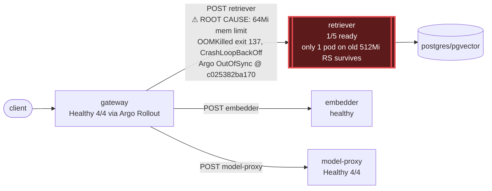

# Postmortem: gateway p95 latency above 2s

- **Status:** resolved
- **Severity:** sev1
- **Verified:** no
- **Opened:** 2026-08-12 18:56:41Z
- **Resolved:** 2026-08-12 19:11:41Z

## Timeline (machine-generated)

All times UTC on 2026-08-12 unless a full date is shown.

| Time (UTC) | Source | Event |
| --- | --- | --- |
| 18:53:23Z | log-spike | log-spike onset: error: Malformed JSON in request body |
| 18:56:10Z | alert | alert firing: Gateway p95 latency > 2s |
| 19:01:01Z | remediation | restart_workload retriever executed (run run_19ff755782a77) |
| 19:01:02Z | k8s | Pod/retriever-7b8cbbdbf5-6ptpg: Scheduled |
| 19:01:03Z | k8s | Pod/retriever-7b8cbbdbf5-pkjmd: Pulled |
| 19:01:03Z | k8s | Pod/retriever-7b8cbbdbf5-pkjmd: Created |
| 19:01:04Z | k8s | Pod/retriever-7b8cbbdbf5-pkjmd: Started |
| 19:01:04Z | k8s | Pod/retriever-7b8cbbdbf5-6ptpg: Started |
| 19:01:04Z | k8s | Pod/retriever-7b8cbbdbf5-6ptpg: Pulled |
| 19:01:04Z | k8s | Pod/retriever-7b8cbbdbf5-6ptpg: Created |
| 19:01:06Z | k8s | Pod/retriever-7b8cbbdbf5-pkjmd: Started |
| 19:01:06Z | k8s | Pod/retriever-7b8cbbdbf5-pkjmd: Pulled |
| 19:01:06Z | k8s | Pod/retriever-7b8cbbdbf5-pkjmd: Created |
| 19:01:07Z | k8s | Pod/retriever-7b8cbbdbf5-6ptpg: Started |
| 19:01:07Z | k8s | Pod/retriever-7b8cbbdbf5-6ptpg: Pulled |
| 19:01:07Z | k8s | Pod/retriever-7b8cbbdbf5-6ptpg: Created |
| 19:01:08Z | k8s | Pod/retriever-7b8cbbdbf5-pkjmd: BackOff |
| 19:01:09Z | k8s | Pod/retriever-7b8cbbdbf5-pkjmd: BackOff |
| 19:01:10Z | k8s | Pod/retriever-7b8cbbdbf5-6ptpg: BackOff |
| 19:01:12Z | log-spike | log-spike onset: [gateway] unhandled error: 16 \| } |
| 19:01:13Z | k8s | Pod/retriever-7b8cbbdbf5-pkjmd: BackOff |
| 19:01:13Z | k8s | Pod/retriever-7b8cbbdbf5-6ptpg: BackOff |
| 19:01:18Z | k8s | Pod/retriever-7b8cbbdbf5-pkjmd: Started |
| 19:01:18Z | k8s | Pod/retriever-7b8cbbdbf5-pkjmd: Pulled |
| 19:01:18Z | k8s | Pod/retriever-7b8cbbdbf5-pkjmd: Created |
| 19:01:19Z | k8s | Rollout/model-proxy: RolloutUpdated |
| 19:01:19Z | k8s | Rollout/model-proxy: RolloutNotCompleted |
| 19:01:19Z | k8s | Rollout/model-proxy: NewReplicaSetCreated |
| 19:01:20Z | k8s | Pod/retriever-7b8cbbdbf5-pkjmd: BackOff |
| 19:01:20Z | k8s | ReplicaSet/model-proxy-77457658bc: SuccessfulCreate |
| 19:01:20Z | k8s | Pod/model-proxy-554d76745d-6f2p5: Killing |
| 19:01:20Z | k8s | ReplicaSet/model-proxy-554d76745d: SuccessfulDelete |
| 19:01:20Z | k8s | Rollout/model-proxy: ScalingReplicaSet |
| 19:01:20Z | k8s | Pod/model-proxy-77457658bc-5q9ts: Scheduled |
| 19:01:21Z | k8s | Pod/retriever-7b8cbbdbf5-pkjmd: BackOff |
| 19:01:21Z | k8s | Pod/retriever-7b8cbbdbf5-6ptpg: Started |
| 19:01:21Z | k8s | Pod/retriever-7b8cbbdbf5-6ptpg: Pulled |
| 19:01:21Z | k8s | Pod/retriever-7b8cbbdbf5-6ptpg: Created |
| 19:01:21Z | k8s | Pod/model-proxy-77457658bc-5q9ts: Started |
| 19:01:21Z | k8s | Pod/model-proxy-77457658bc-5q9ts: Pulled |
| 19:01:21Z | k8s | Pod/model-proxy-77457658bc-5q9ts: Created |
| 19:01:23Z | k8s | Pod/retriever-7b8cbbdbf5-pkjmd: BackOff |
| 19:01:23Z | k8s | Pod/retriever-7b8cbbdbf5-6ptpg: BackOff |
| 19:01:24Z | k8s | Pod/retriever-7b8cbbdbf5-6ptpg: BackOff |
| 19:01:28Z | k8s | Rollout/model-proxy: RolloutStepCompleted |
| 19:01:30Z | k8s | Rollout/model-proxy: AnalysisRunRunning |
| 19:01:33Z | k8s | Pod/retriever-7b8cbbdbf5-6ptpg: BackOff |
| 19:01:44Z | k8s | Pod/retriever-7b8cbbdbf5-pkjmd: Started |
| 19:01:44Z | k8s | Pod/retriever-7b8cbbdbf5-pkjmd: Pulled |
| 19:01:44Z | k8s | Pod/retriever-7b8cbbdbf5-pkjmd: Created |
| 19:01:45Z | k8s | Pod/retriever-7b8cbbdbf5-pkjmd: BackOff |
| 19:01:46Z | k8s | Pod/retriever-7b8cbbdbf5-pkjmd: BackOff |
| 19:01:46Z | k8s | Pod/retriever-7b8cbbdbf5-6ptpg: Started |
| 19:01:46Z | k8s | Pod/retriever-7b8cbbdbf5-6ptpg: Pulled |
| 19:01:46Z | k8s | Pod/retriever-7b8cbbdbf5-6ptpg: Created |
| 19:01:48Z | k8s | Pod/retriever-7b8cbbdbf5-6ptpg: BackOff |
| 19:01:53Z | k8s | Pod/retriever-7b8cbbdbf5-pkjmd: BackOff |
| 19:01:53Z | k8s | Pod/retriever-7b8cbbdbf5-6ptpg: BackOff |
| 19:02:08Z | k8s | ReplicaSet/gateway-8fd65cbf: SuccessfulCreate |
| 19:02:08Z | k8s | Deployment/gateway: ScalingReplicaSet |
| 19:02:08Z | k8s | Pod/gateway-8fd65cbf-x6qqb: Scheduled |
| 19:02:09Z | k8s | Pod/gateway-8fd65cbf-x6qqb: Started |
| 19:02:09Z | k8s | Pod/gateway-8fd65cbf-x6qqb: Pulled |
| 19:02:09Z | k8s | Pod/gateway-8fd65cbf-x6qqb: Created |
| 19:02:09Z | k8s | Pod/gateway-8fd65cbf-c6kl5: Pulled |
| 19:02:09Z | k8s | Pod/gateway-8fd65cbf-c6kl5: Created |
| 19:02:09Z | k8s | Pod/gateway-8fd65cbf-9nk88: Started |
| 19:02:09Z | k8s | Pod/gateway-8fd65cbf-9nk88: Pulled |
| 19:02:09Z | k8s | Pod/gateway-8fd65cbf-9nk88: Created |
| 19:02:09Z | k8s | ReplicaSet/gateway-8fd65cbf: SuccessfulCreate |
| 19:02:09Z | k8s | Pod/gateway-8fd65cbf-c6kl5: Scheduled |
| 19:02:09Z | k8s | Pod/gateway-8fd65cbf-kxqbn: FailedScheduling |
| 19:02:09Z | k8s | Pod/gateway-8fd65cbf-n7m2x: FailedScheduling |
| 19:02:09Z | k8s | Pod/gateway-8fd65cbf-9nk88: Scheduled |
| 19:02:09Z | k8s | Pod/gateway-8fd65cbf-ztnzx: FailedScheduling |
| 19:02:10Z | k8s | Pod/gateway-8fd65cbf-c6kl5: Started |
| 19:02:30Z | k8s | Pod/retriever-7b8cbbdbf5-pkjmd: Started |
| 19:02:30Z | k8s | Pod/retriever-7b8cbbdbf5-pkjmd: Pulled |
| 19:02:30Z | k8s | Pod/retriever-7b8cbbdbf5-pkjmd: Created |
| 19:02:32Z | k8s | Pod/retriever-7b8cbbdbf5-pkjmd: BackOff |
| 19:02:33Z | k8s | Pod/retriever-7b8cbbdbf5-pkjmd: BackOff |
| 19:02:34Z | k8s | Pod/retriever-7b8cbbdbf5-pkjmd: BackOff |
| 19:02:36Z | k8s | Pod/retriever-7b8cbbdbf5-6ptpg: Started |
| 19:02:36Z | k8s | Pod/retriever-7b8cbbdbf5-6ptpg: Pulled |
| 19:02:36Z | k8s | Pod/retriever-7b8cbbdbf5-6ptpg: Created |
| 19:02:37Z | k8s | Pod/retriever-7b8cbbdbf5-6ptpg: BackOff |
| 19:02:38Z | k8s | Pod/retriever-7b8cbbdbf5-6ptpg: BackOff |
| 19:02:43Z | k8s | Pod/retriever-7b8cbbdbf5-6ptpg: BackOff |
| 19:03:16Z | k8s | Pod/gateway-8fd65cbf-x6qqb: Killing |
| 19:03:16Z | k8s | Pod/gateway-8fd65cbf-c6kl5: Killing |
| 19:03:16Z | k8s | Pod/gateway-8fd65cbf-9nk88: Killing |
| 19:03:16Z | k8s | ReplicaSet/gateway-8fd65cbf: SuccessfulDelete |
| 19:03:16Z | k8s | Deployment/gateway: ScalingReplicaSet |
| 19:03:39Z | k8s | Pod/retriever-7b8cbbdbf5-pkjmd: BackOff |
| 19:04:04Z | verification | recovery NOT verified — deadline armed |
| 19:07:10Z | alert | alert resolved: Gateway p95 latency > 2s |
| 19:14:04Z | remediation | rollout_undo retriever executed (run run_19ff762bc5a5bb) |
| 19:14:14Z | k8s | Pod/retriever-78b9dd9fd6-4vdfp: Started |
| 19:14:14Z | k8s | Pod/retriever-78b9dd9fd6-4vdfp: Pulled |
| 19:14:16Z | k8s | Pod/retriever-78b9dd9fd6-4vdfp: BackOff |
| 19:14:17Z | k8s | Pod/retriever-78b9dd9fd6-4vdfp: BackOff |
| 19:14:18Z | k8s | Pod/retriever-78b9dd9fd6-4vdfp: BackOff |
| 19:14:18Z | k8s | Pod/retriever-7b8cbbdbf5-5j7tl: Started |
| 19:14:18Z | k8s | Pod/retriever-7b8cbbdbf5-5j7tl: Pulled |
| 19:14:18Z | k8s | Pod/retriever-7b8cbbdbf5-5j7tl: Created |
| 19:14:20Z | k8s | Pod/retriever-7b8cbbdbf5-5j7tl: BackOff |
| 19:14:20Z | k8s | Pod/retriever-78b9dd9fd6-fq888: Started |
| 19:14:20Z | k8s | Pod/retriever-78b9dd9fd6-fq888: Pulled |
| 19:14:20Z | k8s | Pod/retriever-78b9dd9fd6-fq888: Created |
| 19:14:21Z | k8s | Pod/retriever-7b8cbbdbf5-5j7tl: BackOff |
| 19:14:21Z | k8s | Pod/retriever-78b9dd9fd6-jwdfg: Started |
| 19:14:21Z | k8s | Pod/retriever-78b9dd9fd6-jwdfg: Pulled |
| 19:14:21Z | k8s | Pod/retriever-78b9dd9fd6-jwdfg: Created |
| 19:14:22Z | k8s | Pod/retriever-7b8cbbdbf5-5j7tl: BackOff |
| 19:14:22Z | k8s | Pod/retriever-78b9dd9fd6-jwdfg: BackOff |
| 19:14:22Z | k8s | Pod/retriever-78b9dd9fd6-fq888: BackOff |
| 19:14:23Z | k8s | Pod/retriever-78b9dd9fd6-jwdfg: BackOff |
| 19:14:23Z | k8s | Pod/retriever-78b9dd9fd6-fq888: BackOff |
| 19:14:25Z | k8s | Pod/retriever-7b8cbbdbf5-lwh2b: Started |
| 19:14:25Z | k8s | Pod/retriever-7b8cbbdbf5-lwh2b: Pulled |
| 19:14:25Z | k8s | Pod/retriever-7b8cbbdbf5-lwh2b: Created |
| 19:14:26Z | k8s | Pod/retriever-7b8cbbdbf5-lwh2b: BackOff |
| 19:14:27Z | k8s | Pod/retriever-7b8cbbdbf5-lwh2b: BackOff |
| 19:14:30Z | k8s | Pod/retriever-7b8cbbdbf5-lwh2b: BackOff |
| 19:14:30Z | k8s | Pod/retriever-78b9dd9fd6-jwdfg: BackOff |
| 19:14:30Z | k8s | Pod/retriever-78b9dd9fd6-fq888: BackOff |
| 19:14:56Z | k8s | Pod/retriever-7b8cbbdbf5-79qbh: BackOff |
| 19:15:03Z | k8s | Pod/retriever-7b8cbbdbf5-5j7tl: Started |
| 19:15:03Z | k8s | Pod/retriever-7b8cbbdbf5-5j7tl: Pulled |
| 19:15:03Z | k8s | Pod/retriever-7b8cbbdbf5-5j7tl: Created |
| 19:15:04Z | k8s | Pod/retriever-7b8cbbdbf5-5j7tl: BackOff |
| 19:15:04Z | k8s | Pod/retriever-78b9dd9fd6-fq888: Started |
| 19:15:04Z | k8s | Pod/retriever-78b9dd9fd6-fq888: Pulled |
| 19:15:04Z | k8s | Pod/retriever-78b9dd9fd6-fq888: Created |
| 19:15:05Z | k8s | Pod/retriever-78b9dd9fd6-fq888: BackOff |
| 19:15:05Z | k8s | Pod/retriever-78b9dd9fd6-jwdfg: Started |
| 19:15:05Z | k8s | Pod/retriever-78b9dd9fd6-jwdfg: Pulled |
| 19:15:05Z | k8s | Pod/retriever-78b9dd9fd6-jwdfg: Created |
| 19:15:05Z | k8s | Pod/retriever-78b9dd9fd6-4vdfp: Started |
| 19:15:05Z | k8s | Pod/retriever-78b9dd9fd6-4vdfp: Pulled |
| 19:15:05Z | k8s | Pod/retriever-78b9dd9fd6-4vdfp: Created |
| 19:15:06Z | k8s | Pod/retriever-78b9dd9fd6-fq888: BackOff |
| 19:15:06Z | k8s | Pod/retriever-78b9dd9fd6-4vdfp: BackOff |
| 19:15:07Z | k8s | Pod/retriever-78b9dd9fd6-jwdfg: BackOff |
| 19:15:07Z | k8s | Pod/retriever-78b9dd9fd6-4vdfp: BackOff |
| 19:15:08Z | k8s | Pod/retriever-78b9dd9fd6-jwdfg: BackOff |
| 19:15:09Z | k8s | Pod/retriever-7b8cbbdbf5-5j7tl: BackOff |
| 19:15:10Z | k8s | Pod/retriever-7b8cbbdbf5-5j7tl: BackOff |
| 19:15:10Z | k8s | Pod/retriever-78b9dd9fd6-jwdfg: BackOff |
| 19:15:10Z | k8s | Pod/retriever-78b9dd9fd6-fq888: BackOff |
| 19:15:10Z | k8s | Pod/retriever-78b9dd9fd6-4vdfp: BackOff |
| 19:15:18Z | k8s | Pod/retriever-7b8cbbdbf5-lwh2b: Started |
| 19:15:18Z | k8s | Pod/retriever-7b8cbbdbf5-lwh2b: Pulled |
| 19:15:18Z | k8s | Pod/retriever-7b8cbbdbf5-lwh2b: Created |
| 19:15:19Z | k8s | Pod/retriever-7b8cbbdbf5-lwh2b: BackOff |
| 19:15:20Z | k8s | Pod/retriever-7b8cbbdbf5-lwh2b: BackOff |
| 19:15:21Z | k8s | Pod/retriever-7b8cbbdbf5-lwh2b: BackOff |
| 19:16:01Z | k8s | Pod/retriever-7b8cbbdbf5-79qbh: BackOff |
| 19:16:04Z | k8s | Pod/retriever-7b8cbbdbf5-79qbh: Started |
| 19:16:04Z | k8s | Pod/retriever-7b8cbbdbf5-79qbh: Pulled |
| 19:16:04Z | k8s | Pod/retriever-7b8cbbdbf5-79qbh: Created |
| 19:16:06Z | k8s | Pod/retriever-7b8cbbdbf5-79qbh: BackOff |
| 19:16:07Z | k8s | Pod/retriever-7b8cbbdbf5-79qbh: BackOff |
| 19:16:08Z | k8s | Pod/retriever-7b8cbbdbf5-79qbh: BackOff |
| 19:16:22Z | k8s | Pod/retriever-78b9dd9fd6-4vdfp: BackOff |
| 19:16:28Z | k8s | Pod/retriever-78b9dd9fd6-jwdfg: Started |
| 19:16:28Z | k8s | Pod/retriever-78b9dd9fd6-jwdfg: Pulled |
| 19:16:28Z | k8s | Pod/retriever-78b9dd9fd6-jwdfg: Created |
| 19:16:28Z | k8s | Pod/retriever-78b9dd9fd6-4vdfp: Started |
| 19:16:28Z | k8s | Pod/retriever-78b9dd9fd6-4vdfp: Pulled |
| 19:16:28Z | k8s | Pod/retriever-78b9dd9fd6-4vdfp: Created |
| 19:16:29Z | k8s | Pod/retriever-78b9dd9fd6-4vdfp: BackOff |
| 19:16:30Z | k8s | Pod/retriever-78b9dd9fd6-jwdfg: BackOff |
| 19:16:30Z | k8s | Pod/retriever-78b9dd9fd6-4vdfp: BackOff |
| 19:16:30Z | k8s | Pod/retriever-7b8cbbdbf5-5j7tl: Started |
| 19:16:30Z | k8s | Pod/retriever-7b8cbbdbf5-5j7tl: Pulled |
| 19:16:30Z | k8s | Pod/retriever-7b8cbbdbf5-5j7tl: Created |
| 19:16:31Z | k8s | Pod/retriever-7b8cbbdbf5-5j7tl: BackOff |
| 19:16:31Z | k8s | Pod/retriever-78b9dd9fd6-jwdfg: BackOff |
| 19:16:31Z | k8s | Pod/retriever-78b9dd9fd6-4vdfp: BackOff |
| 19:16:32Z | k8s | Pod/retriever-7b8cbbdbf5-5j7tl: BackOff |
| 19:16:32Z | k8s | Pod/retriever-78b9dd9fd6-jwdfg: BackOff |
| 19:16:34Z | k8s | Pod/retriever-7b8cbbdbf5-5j7tl: BackOff |
| 19:16:37Z | k8s | Pod/retriever-78b9dd9fd6-4vdfp: BackOff |
| 19:16:40Z | k8s | Pod/retriever-7b8cbbdbf5-5j7tl: BackOff |
| 19:16:40Z | k8s | Pod/retriever-78b9dd9fd6-fq888: Started |
| 19:16:40Z | k8s | Pod/retriever-78b9dd9fd6-fq888: Pulled |
| 19:16:40Z | k8s | Pod/retriever-78b9dd9fd6-fq888: Created |
| 19:16:41Z | k8s | Pod/retriever-78b9dd9fd6-fq888: BackOff |
| 19:16:45Z | k8s | Pod/retriever-7b8cbbdbf5-lwh2b: Started |
| 19:16:45Z | k8s | Pod/retriever-7b8cbbdbf5-lwh2b: Pulled |
| 19:16:45Z | k8s | Pod/retriever-7b8cbbdbf5-lwh2b: Created |
| 19:16:46Z | k8s | Pod/retriever-78b9dd9fd6-fq888: BackOff |
| 19:16:47Z | k8s | Pod/retriever-7b8cbbdbf5-lwh2b: BackOff |
| 19:16:48Z | k8s | Pod/retriever-7b8cbbdbf5-lwh2b: BackOff |
| 19:16:50Z | k8s | Pod/retriever-7b8cbbdbf5-lwh2b: BackOff |
| 19:16:50Z | k8s | Pod/retriever-78b9dd9fd6-fq888: BackOff |

## Evidence links

- [Loki — logs over the incident window](http://localhost:3001/explore?schemaVersion=1&panes=%7B%22pm%22%3A+%7B%22datasource%22%3A+%22loki%22%2C+%22queries%22%3A+%5B%7B%22refId%22%3A+%22A%22%2C+%22datasource%22%3A+%7B%22type%22%3A+%22loki%22%2C+%22uid%22%3A+%22loki%22%7D%2C+%22expr%22%3A+%22%7Bnamespace%3D%5C%22subject%5C%22%7D+%7C~+%5C%22%28%3Fi%29error%7Cfailed%5C%22%22%7D%5D%2C+%22range%22%3A+%7B%22from%22%3A+%221786561001501%22%2C+%22to%22%3A+%221786561901422%22%7D%7D%7D&orgId=1)
- [Mimir — metrics over the incident window](http://localhost:3001/explore?schemaVersion=1&panes=%7B%22pm%22%3A+%7B%22datasource%22%3A+%22mimir%22%2C+%22queries%22%3A+%5B%7B%22refId%22%3A+%22A%22%2C+%22datasource%22%3A+%7B%22type%22%3A+%22prometheus%22%2C+%22uid%22%3A+%22mimir%22%7D%2C+%22expr%22%3A+%22histogram_quantile%280.95%2C+sum%28rate%28http_server_duration_milliseconds_bucket%5B5m%5D%29%29+by+%28le%29%29%22%7D%5D%2C+%22range%22%3A+%7B%22from%22%3A+%221786561001501%22%2C+%22to%22%3A+%221786561901422%22%7D%7D%7D&orgId=1)

## Investigation context

**Runbook match:** none — no tool narrowing applied for this alert. Available runbooks: README.md, canary-abort.md, ci-pipeline-red.md, dq-freshness-stall.md, gateway-high-error-rate.md, k8s-crashloop.md, k8s-node-failure.md, snapshot-agent-audit.md, stale-secret.md

Pre-check battery (as injected at run start)

## Pre-check leads

### recent_deploys — LEAD
2 deploy-window leads
- argo app platform: sync=OutOfSync health=Healthy (revision c025382ba170)
- argo app retriever: sync=OutOfSync health=Progressing (revision c025382ba170)

### kube_scan — LEAD
16 kube-scan leads
- pod retriever-7b8cbbdbf5-79qbh: CrashLoopBackOff
- pod retriever-7b8cbbdbf5-x4xvq: CrashLoopBackOff
- event Pod/retriever-7b8cbbdbf5-79qbh: BackOff — Back-off restarting failed container retriever in pod retriever-7b8cbbdbf5-79qbh_subject(f01c796e-836f-4e79-864b-2c53c7844ffd) (at 21:10:40)
- event Pod/retriever-7b8cbbdbf5-x4xvq: BackOff — Back-off restarting failed container retriever in pod retriever-7b8cbbdbf5-x4xvq_subject(ce31ac06-dd26-4a27-b76d-a853fc22dca0) (at 21:10:41)
- event Pod/retriever-7b8cbbdbf5-79qbh: BackOff — Back-off restarting failed container retriever in pod retriever-7b8cbbdbf5-79qbh_subject(f01c796e-836f-4e79-864b-2c53c7844ffd) (at 21:10:41)
- event Pod/retriever-7b8cbbdbf5-x4xvq: BackOff — Back-off restarting failed containe
… (section truncated)

### log_spike — LEAD
error/failed log rate 82/10min vs baseline 0/10min (82x baseline) — onset: [gateway] unhandled error: 16 |         } at 2026-08-12T19:01:12.334742+00:00
- error/failed log rate 82/10min vs baseline 0/10min (82x baseline) — onset: [gateway] unhandled error: 16 |         } at 2026-08-12T19:01:12.334742+00:00

### attribution — LEAD
errors concentrate on gateway → POST model-proxy (10.8%); time concentrates in gateway's own handler (~5.3s of 7.3s) over the last 10m — which is not necessarily the workload named on the alert:
- gateway → POST model-proxy: 10.8% of those outbound calls failed
- own-handler p95 (server p95 minus its slowest outbound call — a ranking, not a measurement): gateway ~5.3s of 7.3s end to end, embedder ~2.0s of 2.0s end to end, retriever ~2.0s of 2.0s end to end
- gateway → POST embedder: p95 2.0s outbound
- gateway → POST retriever: p95 2.0s outbound

### rollout_state — OK
gateway and model-proxy rollouts stable, no failed analysis

### secret_age — OK
Secret subject-db-credentials last modified 18d 19h ago (created 18d 19h ago).

## Narrative

## Incident summary — escalation, NOT resolved (attempt 2)

**Continuation of inc prior attempt.** The earlier fix (rolling restart of `retriever`) did not restore service, and this second pass found the automated remediation *tooling itself* partially broken, not just the workload.

### Root cause (evidence-backed, unchanged from attempt 1, re-confirmed live)

`retriever`'s Deployment has been carrying a **64Mi** container memory limit since Argo Application `retriever` synced to revision `c025382ba170` (2026-08-07), which remains **OutOfSync**/`Progressing` to this day. Under that limit the container OOMKills (exit 137) within seconds of every start. Live evidence gathered this pass:
- `kubectl describe pod` on the freshly-recreated ReplicaSet `retriever-7b8cbbdbf5-*` (started this incident window): `Limits: memory: 64Mi`, `Last State: Terminated / Reason: OOMKilled / Exit Code: 137`, restart count climbing every ~20–30s.
- The sibling ReplicaSet `retriever-d6d55bf7f-*` — same image (`obs-registry:5010/retriever:10f24bc`), but `Limits: memory: 512Mi` — has run healthy for 4d23h with only 1 restart total. Identical image, different limit, different outcome: isolates the cause to the manifest/resource spec, not the code.
- Mimir `sum(increase(kube_pod_container_status_restarts_total{pod=~"retriever.*"}[5m]))` is flat at 0 for the first ~45 minutes of the query window, then steps to 11–21 restarts/5min and is still climbing at last sample — an active, ongoing crash loop, not a resolved blip.
- `retriever` deployment readiness regressed over the course of this incident: 2/3 ready → 1/5 ready after remediation attempts, as more ReplicaSet revisions (all carrying the bad 64Mi limit) were created.

### New finding this pass: the fix path is itself broken

- `patch_memory_limit(retriever, 64Mi→512Mi)`: **dry-run now succeeds cleanly** (`limits.memory: 64Mi -> 512Mi`, no error) — different from attempt 1, which is why this was retried. But the **real apply still fails**, identically to attempt 1: `The Deployment "retriever" is invalid: spec.template.spec.containers[0].image: Required value`. This confirms a genuine tool-side bug (the apply code path constructs a patch missing a required field) — not an approval or auth issue, and not something a third retry will fix.
- Pivoted to `rollout_undo(retriever)` as an independent path (revert to the previous ReplicaSet revision) — approved, dry-run clean, executed successfully (`deployment.apps/retriever rolled back`). But inspection of the resulting pods showed the "previous revision" (`78b9dd9fd6`) **also** ships the 64Mi limit and was already OOM-crashlooping before this rollback (visible in k8s events prior to the action). A further dry-run showed `rollout_undo` simply ping-pongs between the two most recent revisions (both bad), not walking back to the last known-good 512Mi template — that template only survives in the orphaned, pre-`c025382ba170` ReplicaSet `retriever-d6d55bf7f-*`, which is outside the Deployment's tracked revision history and cannot be targeted by this tool.
- Argo's `retriever` Application is `OutOfSync`/`Progressing` throughout — consistent with the live cluster fighting a continuous divergence from git at the bad revision; manual kubectl-level patches are working against, not with, GitOps here.

**Given two independent, evidence-backed remediation paths both failed to reach the known-good configuration, and repeating either would only continue to destabilize the deployment (readiness already regressed further), I stopped and did not attempt a third blind remediation.**

### Impact
`retriever` capacity degraded from full to a fraction of desired replicas, all newly-scheduled pods continuously OOM-crashlooping. The `Gateway p95 latency > 2s` alert itself reports inactive at time of writing, but this appears to reflect alerting-window/query behavior around the underlying instability rather than genuine recovery — the causal chain (retriever OOM → gateway-side latency/errors on the retriever call path) that drove the original page is still mechanically present and actively getting worse, not better.

### What fixed it
**Nothing available in this on-call toolset fixed it.** `patch_memory_limit` is broken on apply (tool bug, reproducible). `rollout_undo` only cycles within the Deployment's retained revision history, all of which postdates the bad change — it cannot reach the pre-incident 512Mi template. This requires either (a) a fix to the `patch_memory_limit` tool's patch construction, or (b) a manual correction to `retriever`'s manifest in the source repo (bump memory limit to ≥512Mi) followed by a clean Argo sync of the `retriever` Application back to `Synced`/`Healthy` — both outside the read/remediate scope of this session's toolset (no git/PR access available here).

### Lessons
1. **Dry-run success does not guarantee apply success** — `patch_memory_limit`'s dry-run and apply code paths diverge; any on-call automation with this shape needs its dry-run to exercise the exact same patch construction as the real call, or dry-run is not a trustworthy gate.
2. **`rollout undo` is not "restore last known good"** — it only walks one step through retained revision history. If a bad config has been redeployed/restarted multiple times, all retained revisions can be bad, and undo will silently hand you another broken revision instead of failing loudly.
3. **OutOfSync Argo Applications should block manual kubectl-level remediation**, or at least be surfaced loudly before it — acting on a workload whose live state is fighting GitOps risks exactly the revision/replica churn seen here (2/3 → 1/5 ready).
4. **This alert needs a runbook.** None matched `Gateway p95 latency > 2s` this incident; a runbook pointing straight at "check retriever OOM/CrashLoopBackOff, check Argo sync state, prefer gitops-level fix over live patch" would have saved both passes significant investigation time.

Chart artifact: `report.html` — restart-rate step function over the incident window (flat 0 → sustained 11–21 restarts/5min, still climbing at last sample).
