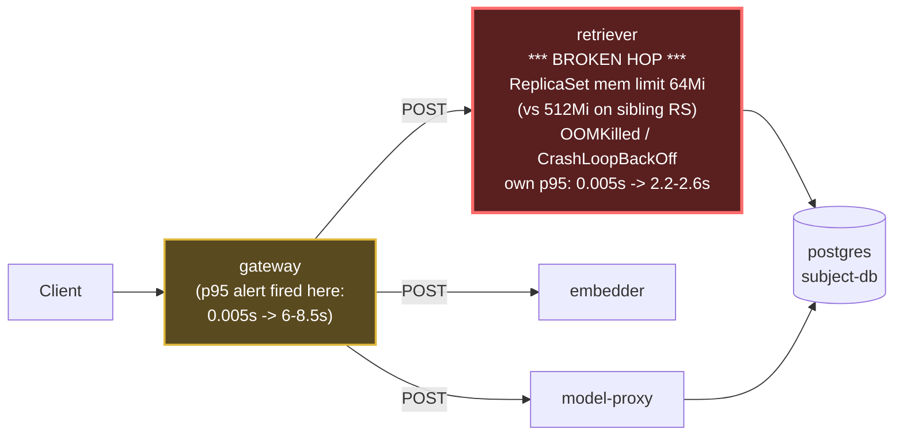

# Postmortem: gateway p95 latency above 2s

- **Status:** open
- **Severity:** sev1
- **Verified:** no
- **Opened:** 2026-08-12 18:56:41Z
- **Resolved:** (still open)

## Timeline (machine-generated)

All times UTC on 2026-08-12 unless a full date is shown.

| Time (UTC) | Source | Event |
| --- | --- | --- |
| 18:53:23Z | log-spike | log-spike onset: error: Malformed JSON in request body |
| 18:56:10Z | alert | alert firing: Gateway p95 latency > 2s |
| 19:01:01Z | remediation | restart_workload retriever executed (run run_19ff755782a77) |
| 19:01:02Z | k8s | Pod/retriever-7b8cbbdbf5-6ptpg: Scheduled |
| 19:01:03Z | k8s | Pod/retriever-7b8cbbdbf5-pkjmd: Pulled |
| 19:01:03Z | k8s | Pod/retriever-7b8cbbdbf5-pkjmd: Created |
| 19:01:04Z | k8s | Pod/retriever-7b8cbbdbf5-pkjmd: Started |
| 19:01:04Z | k8s | Pod/retriever-7b8cbbdbf5-6ptpg: Started |
| 19:01:04Z | k8s | Pod/retriever-7b8cbbdbf5-6ptpg: Pulled |
| 19:01:04Z | k8s | Pod/retriever-7b8cbbdbf5-6ptpg: Created |
| 19:01:06Z | k8s | Pod/retriever-7b8cbbdbf5-pkjmd: Started |
| 19:01:06Z | k8s | Pod/retriever-7b8cbbdbf5-pkjmd: Pulled |
| 19:01:06Z | k8s | Pod/retriever-7b8cbbdbf5-pkjmd: Created |
| 19:01:07Z | k8s | Pod/retriever-7b8cbbdbf5-6ptpg: Started |
| 19:01:07Z | k8s | Pod/retriever-7b8cbbdbf5-6ptpg: Pulled |
| 19:01:07Z | k8s | Pod/retriever-7b8cbbdbf5-6ptpg: Created |
| 19:01:08Z | k8s | Pod/retriever-7b8cbbdbf5-pkjmd: BackOff |
| 19:01:09Z | k8s | Pod/retriever-7b8cbbdbf5-pkjmd: BackOff |
| 19:01:10Z | k8s | Pod/retriever-7b8cbbdbf5-6ptpg: BackOff |
| 19:01:13Z | k8s | Pod/retriever-7b8cbbdbf5-pkjmd: BackOff |
| 19:01:13Z | k8s | Pod/retriever-7b8cbbdbf5-6ptpg: BackOff |
| 19:01:18Z | k8s | Pod/retriever-7b8cbbdbf5-pkjmd: Started |
| 19:01:18Z | k8s | Pod/retriever-7b8cbbdbf5-pkjmd: Pulled |
| 19:01:18Z | k8s | Pod/retriever-7b8cbbdbf5-pkjmd: Created |
| 19:01:19Z | k8s | Rollout/model-proxy: RolloutUpdated |
| 19:01:19Z | k8s | Rollout/model-proxy: RolloutNotCompleted |
| 19:01:19Z | k8s | Rollout/model-proxy: NewReplicaSetCreated |
| 19:01:20Z | k8s | Pod/retriever-7b8cbbdbf5-pkjmd: BackOff |
| 19:01:20Z | k8s | ReplicaSet/model-proxy-77457658bc: SuccessfulCreate |
| 19:01:20Z | k8s | Pod/model-proxy-554d76745d-6f2p5: Killing |
| 19:01:20Z | k8s | ReplicaSet/model-proxy-554d76745d: SuccessfulDelete |
| 19:01:20Z | k8s | Rollout/model-proxy: ScalingReplicaSet |
| 19:01:20Z | k8s | Pod/model-proxy-77457658bc-5q9ts: Scheduled |
| 19:01:21Z | k8s | Pod/retriever-7b8cbbdbf5-pkjmd: BackOff |
| 19:01:21Z | k8s | Pod/retriever-7b8cbbdbf5-6ptpg: Started |
| 19:01:21Z | k8s | Pod/retriever-7b8cbbdbf5-6ptpg: Pulled |
| 19:01:21Z | k8s | Pod/retriever-7b8cbbdbf5-6ptpg: Created |
| 19:01:21Z | k8s | Pod/model-proxy-77457658bc-5q9ts: Started |
| 19:01:21Z | k8s | Pod/model-proxy-77457658bc-5q9ts: Pulled |
| 19:01:21Z | k8s | Pod/model-proxy-77457658bc-5q9ts: Created |
| 19:01:23Z | k8s | Pod/retriever-7b8cbbdbf5-pkjmd: BackOff |
| 19:01:23Z | k8s | Pod/retriever-7b8cbbdbf5-6ptpg: BackOff |
| 19:01:24Z | k8s | Pod/retriever-7b8cbbdbf5-6ptpg: BackOff |
| 19:01:28Z | k8s | Rollout/model-proxy: RolloutStepCompleted |
| 19:01:30Z | k8s | Rollout/model-proxy: AnalysisRunRunning |
| 19:01:33Z | k8s | Pod/retriever-7b8cbbdbf5-6ptpg: BackOff |
| 19:01:44Z | k8s | Pod/retriever-7b8cbbdbf5-pkjmd: Started |
| 19:01:44Z | k8s | Pod/retriever-7b8cbbdbf5-pkjmd: Pulled |
| 19:01:44Z | k8s | Pod/retriever-7b8cbbdbf5-pkjmd: Created |
| 19:01:45Z | k8s | Pod/retriever-7b8cbbdbf5-pkjmd: BackOff |
| 19:01:46Z | k8s | Pod/retriever-7b8cbbdbf5-pkjmd: BackOff |
| 19:01:46Z | k8s | Pod/retriever-7b8cbbdbf5-6ptpg: Started |
| 19:01:46Z | k8s | Pod/retriever-7b8cbbdbf5-6ptpg: Pulled |
| 19:01:46Z | k8s | Pod/retriever-7b8cbbdbf5-6ptpg: Created |
| 19:01:48Z | k8s | Pod/retriever-7b8cbbdbf5-6ptpg: BackOff |
| 19:01:53Z | k8s | Pod/retriever-7b8cbbdbf5-pkjmd: BackOff |
| 19:01:53Z | k8s | Pod/retriever-7b8cbbdbf5-6ptpg: BackOff |
| 19:02:08Z | k8s | ReplicaSet/gateway-8fd65cbf: SuccessfulCreate |
| 19:02:08Z | k8s | Deployment/gateway: ScalingReplicaSet |
| 19:02:08Z | k8s | Pod/gateway-8fd65cbf-x6qqb: Scheduled |
| 19:02:09Z | k8s | Pod/gateway-8fd65cbf-x6qqb: Started |
| 19:02:09Z | k8s | Pod/gateway-8fd65cbf-x6qqb: Pulled |
| 19:02:09Z | k8s | Pod/gateway-8fd65cbf-x6qqb: Created |
| 19:02:09Z | k8s | Pod/gateway-8fd65cbf-c6kl5: Pulled |
| 19:02:09Z | k8s | Pod/gateway-8fd65cbf-c6kl5: Created |
| 19:02:09Z | k8s | Pod/gateway-8fd65cbf-9nk88: Started |
| 19:02:09Z | k8s | Pod/gateway-8fd65cbf-9nk88: Pulled |
| 19:02:09Z | k8s | Pod/gateway-8fd65cbf-9nk88: Created |
| 19:02:09Z | k8s | ReplicaSet/gateway-8fd65cbf: SuccessfulCreate |
| 19:02:09Z | k8s | Pod/gateway-8fd65cbf-c6kl5: Scheduled |
| 19:02:09Z | k8s | Pod/gateway-8fd65cbf-kxqbn: FailedScheduling |
| 19:02:09Z | k8s | Pod/gateway-8fd65cbf-n7m2x: FailedScheduling |
| 19:02:09Z | k8s | Pod/gateway-8fd65cbf-9nk88: Scheduled |
| 19:02:09Z | k8s | Pod/gateway-8fd65cbf-ztnzx: FailedScheduling |
| 19:02:10Z | k8s | Pod/gateway-8fd65cbf-c6kl5: Started |
| 19:02:30Z | k8s | Pod/retriever-7b8cbbdbf5-pkjmd: Started |
| 19:02:30Z | k8s | Pod/retriever-7b8cbbdbf5-pkjmd: Pulled |
| 19:02:30Z | k8s | Pod/retriever-7b8cbbdbf5-pkjmd: Created |
| 19:02:32Z | k8s | Pod/retriever-7b8cbbdbf5-pkjmd: BackOff |
| 19:02:33Z | k8s | Pod/retriever-7b8cbbdbf5-pkjmd: BackOff |
| 19:02:34Z | k8s | Pod/retriever-7b8cbbdbf5-pkjmd: BackOff |
| 19:02:36Z | k8s | Pod/retriever-7b8cbbdbf5-6ptpg: Started |
| 19:02:36Z | k8s | Pod/retriever-7b8cbbdbf5-6ptpg: Pulled |
| 19:02:36Z | k8s | Pod/retriever-7b8cbbdbf5-6ptpg: Created |
| 19:02:37Z | k8s | Pod/retriever-7b8cbbdbf5-6ptpg: BackOff |
| 19:02:38Z | k8s | Pod/retriever-7b8cbbdbf5-6ptpg: BackOff |
| 19:02:43Z | k8s | Pod/retriever-7b8cbbdbf5-6ptpg: BackOff |
| 19:03:16Z | k8s | Pod/gateway-8fd65cbf-x6qqb: Killing |
| 19:03:16Z | k8s | Pod/gateway-8fd65cbf-c6kl5: Killing |
| 19:03:16Z | k8s | Pod/gateway-8fd65cbf-9nk88: Killing |
| 19:03:16Z | k8s | ReplicaSet/gateway-8fd65cbf: SuccessfulDelete |
| 19:03:16Z | k8s | Deployment/gateway: ScalingReplicaSet |
| 19:03:39Z | k8s | Pod/retriever-7b8cbbdbf5-pkjmd: BackOff |

## Evidence links

- [Loki — logs over the incident window](http://localhost:3001/explore?schemaVersion=1&panes=%7B%22pm%22%3A+%7B%22datasource%22%3A+%22loki%22%2C+%22queries%22%3A+%5B%7B%22refId%22%3A+%22A%22%2C+%22datasource%22%3A+%7B%22type%22%3A+%22loki%22%2C+%22uid%22%3A+%22loki%22%7D%2C+%22expr%22%3A+%22%7Bnamespace%3D%5C%22subject%5C%22%7D+%7C~+%5C%22%28%3Fi%29error%7Cfailed%5C%22%22%7D%5D%2C+%22range%22%3A+%7B%22from%22%3A+%221786561001501%22%2C+%22to%22%3A+%221786561430811%22%7D%7D%7D&orgId=1)
- [Mimir — metrics over the incident window](http://localhost:3001/explore?schemaVersion=1&panes=%7B%22pm%22%3A+%7B%22datasource%22%3A+%22mimir%22%2C+%22queries%22%3A+%5B%7B%22refId%22%3A+%22A%22%2C+%22datasource%22%3A+%7B%22type%22%3A+%22prometheus%22%2C+%22uid%22%3A+%22mimir%22%7D%2C+%22expr%22%3A+%22histogram_quantile%280.95%2C+sum%28rate%28http_server_duration_milliseconds_bucket%5B5m%5D%29%29+by+%28le%29%29%22%7D%5D%2C+%22range%22%3A+%7B%22from%22%3A+%221786561001501%22%2C+%22to%22%3A+%221786561430811%22%7D%7D%7D&orgId=1)

## Investigation context

**Runbook match:** none — no tool narrowing applied for this alert. Available runbooks: README.md, canary-abort.md, ci-pipeline-red.md, dq-freshness-stall.md, gateway-high-error-rate.md, k8s-crashloop.md, k8s-node-failure.md, snapshot-agent-audit.md, stale-secret.md

Pre-check battery (as injected at run start)

## Pre-check leads

### recent_deploys — LEAD
2 deploy-window leads
- argo app platform: sync=OutOfSync health=Healthy (revision c025382ba170)
- argo app retriever: sync=OutOfSync health=Progressing (revision c025382ba170)

### kube_scan — LEAD
21 kube-scan leads
- pod retriever-78b9dd9fd6-9tdxz: CrashLoopBackOff
- pod retriever-78b9dd9fd6-lqkqd: CrashLoopBackOff
- pod retriever-78b9dd9fd6-pz8qd: CrashLoopBackOff
- event Pod/retriever-78b9dd9fd6-lqkqd: BackOff — Back-off restarting failed container retriever in pod retriever-78b9dd9fd6-lqkqd_subject(73c374ee-5ae9-409b-90f5-87e49b170957) (at 20:52:53)
- event Pod/retriever-78b9dd9fd6-lqkqd: BackOff — Back-off restarting failed container retriever in pod retriever-78b9dd9fd6-lqkqd_subject(73c374ee-5ae9-409b-90f5-87e49b170957) (at 20:52:58)
- event Pod/retriever-78b9dd9fd6-9tdxz: BackOff — Back-off restarting failed container retriever in pod retriever-78b9dd9fd6-9tdxz_subject(624db80c-2f49-4930-ad33-4bbbed7cb4be) (at 20:52:58)
- event Pod/retriever-78b9dd9fd6-p
… (section truncated)

### log_spike — LEAD
error/failed log rate 200/10min vs baseline 0/10min (200x baseline) — onset: error: Malformed JSON in request body at 2026-08-12T18:53:23.230289+00:00
- error/failed log rate 200/10min vs baseline 0/10min (200x baseline) — onset: error: Malformed JSON in request body at 2026-08-12T18:53:23.230289+00:00

### attribution — LEAD
errors concentrate on gateway → POST model-proxy (13.1%); time concentrates in gateway's own handler (~4.8s of 7.7s) over the last 10m — which is not necessarily the workload named on the alert:
- gateway: 6.1% of its OWN responses are 5xx (10m)
- model-proxy: 3.2% of its OWN responses are 5xx (10m)
- gateway → POST model-proxy: 13.1% of those outbound calls failed
- own-handler p95 (server p95 minus its slowest outbound call — a ranking, not a measurement): gateway ~4.8s of 7.7s end to end, retriever ~2.8s of 2.8s end to end, embedder ~2.7s of 2.7s end to end
- gateway → POST retriever: p95 2.8s outbound
- gateway → POST embedder: p95 2.7s outbound

### rollout_state — OK
gateway and model-proxy rollouts stable, no failed analysis

### secret_age — OK
Secret subject-db-credentials last modified 18d 19h ago (created 18d 19h ago).

## Narrative

## Summary
Alert `Gateway p95 latency > 2s` (sev1, tenant test-bench) fired for the gateway service. Root cause was not in the gateway itself: its downstream dependency `retriever` has been running a stuck/never-converging rollout since an earlier gitops sync, with a ReplicaSet whose pod template carries a memory limit far too small for the workload. Under normal-ish traffic those pods idled below the limit; once request volume/working set grew, they began OOMKilling in a tight crash loop, and gateway's own-handler time (queuing/retrying/timing out on retriever calls) absorbed most of the added latency, pushing p95 to 6–8.5s.

## Impact
- Gateway p95 latency stepped from a steady ~0.005s baseline to a sustained 6–8.5s in a single ~60s window and has not recovered.
- Retriever's own p95 rose from ~0.005s to ~2.2–2.6s over the same window (evidence of a genuinely degraded backend, not just gateway-side queuing).
- A subset of retriever pods (pod-template-hash `78b9dd9fd6`, and after remediation `7b8cbbdbf5`) are in continuous `CrashLoopBackOff`/`OOMKilled` (exit code 137), confirmed via pod describe: `Limits: memory: 64Mi` / `Requests: memory: 48Mi`. The still-healthy ReplicaSet `d6d55bf7f` (same image `retriever:10f24bc`) runs with `Limits: memory: 512Mi` / `Requests: memory: 192Mi` — an 8x difference on the identical binary, which is the smoking gun.
- Argo shows `retriever` and `platform` Applications `OutOfSync` (health reported Healthy, which is misleading given the live CrashLoopBackOff pods) at revision `c025382ba170`, deployed 2026-08-07 — consistent with this being a latent misconfiguration that only became symptomatic once load crossed the 64Mi ceiling.
- Separately, gateway is also logging a steady, climbing stream of `error: Malformed JSON in request body` — investigated as a possible second cause, but its onset trend was gradual (not a step function) and it did not line up with the sharp cliff-edge in gateway p95 or with the retriever restart-rate spike, so it is logged here as background noise/a candidate for its own follow-up rather than the driver of this alert.

## Root cause
Retriever's live Deployment pod template has an under-provisioned container memory limit (64Mi limit / 48Mi request) versus the 512Mi/192Mi that the same image safely runs under elsewhere in the same Deployment's other ReplicaSet. This causes the current-generation retriever pods to OOMKill (exit 137) under load, degrading retriever's availability/latency, which in turn inflates gateway's p95 because gateway's own request-handling time balloons while it waits on/retries a failing downstream dependency.

## What fixed it
Two remediations were attempted, in order, each dry-run and operator-approved before execution:
1. **Rolling restart of `deployment/retriever`** (annotation-only, no spec change) — intended to force convergence onto a single correct ReplicaSet. Approved and executed successfully, but the freshly created ReplicaSet inherited the *same* 64Mi limit, confirming the bad value lives in the Deployment's current live spec, not just a stale orphaned ReplicaSet. Latency did not recover.
2. **`patch_memory_limit` on `retriever` (64Mi → 512Mi)** — approved and executed twice; both attempts were rejected by the API with `spec.template.spec.containers[0].image: Required value`, a tool-side patch-construction error, not an approval or authorization issue. The live memory limit was **not** changed.

**Outcome: incident is NOT resolved.** Re-querying `alert_status` after both remediation attempts still shows the alert active (`active: true`), retriever pods still cycling through `CrashLoopBackOff`, and gateway p95 still ~8s. This requires either a fixed/retried patch path or a manual gitops-level correction to the retriever manifest's memory limit followed by a redeploy, and should be escalated.

## Lessons
- Argo/Application "Healthy" status can coexist with pods in `CrashLoopBackOff` if health checks aren't wired to container restart reasons — `OutOfSync` + "Healthy" here was a false-negative signal that needed pod-level evidence (`kubectl describe`, `OOMKilled`, restart-count) to catch.
- Comparing resource limits across a workload's own ReplicaSets (old vs. new pod-template-hash, same image) is a fast, cheap way to catch an under-provisioned rollout — the 64Mi vs 512Mi gap on an identical binary was decisive.
- A rolling restart is not a substitute for a resource-limit fix when the bad value is baked into the Deployment's current template; it just reproduces the failure on a new ReplicaSet.
- The `patch_memory_limit` remediation path failed twice with an "image: Required value" API error — this needs investigation/fix in the tool itself (looks like the patch is dropping the container's image field), and there should be a documented fallback (gitops manifest edit + redeploy) for when the live-patch path is broken.
- No runbook matched `Gateway p95 latency > 2s`; this incident is a strong candidate seed for a new runbook: "check downstream dependency OOM/CrashLoop before assuming gateway-local causes; compare resource limits across a workload's ReplicaSets."

