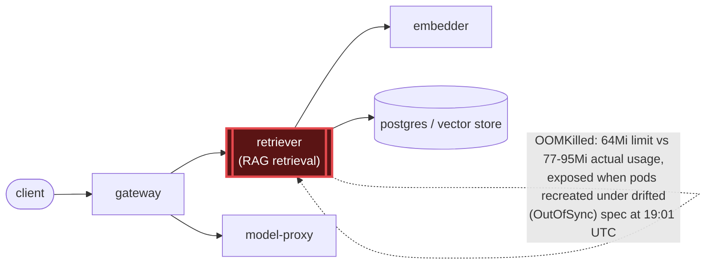

# Postmortem: subject/retriever-7b8cbbdbf5-79qbh has been not-ready for 4 minutes (readiness probe or startup trouble)

- **Status:** open
- **Severity:** sev1
- **Verified:** no
- **Opened:** 2026-08-12 19:15:57Z
- **Resolved:** (still open)

## Timeline (machine-generated)

All times UTC on 2026-08-12 unless a full date is shown.

| Time (UTC) | Source | Event |
| --- | --- | --- |
| 19:06:23Z | log-spike | log-spike onset: name=retriever-7b8cbbdbf5-6ptpg kind=Pod objectAPIversion=v1 objectRV=2501462 eventRV=2502319 reportinginstance=k3d-obs-lab-agent-1 reportingcontroller=kubelet sourcecomponent=kubelet sourcehost=k3d-obs-lab-agent-1 reason=… |
| 19:15:20Z | alert | alert firing: KubePodNotReady |
| 19:16:40Z | k8s | Pod/retriever-7b8cbbdbf5-5j7tl: BackOff |
| 19:16:40Z | k8s | Pod/retriever-78b9dd9fd6-fq888: Started |
| 19:16:40Z | k8s | Pod/retriever-78b9dd9fd6-fq888: Pulled |
| 19:16:41Z | k8s | Pod/retriever-78b9dd9fd6-fq888: BackOff |
| 19:16:45Z | k8s | Pod/retriever-7b8cbbdbf5-lwh2b: Started |
| 19:16:45Z | k8s | Pod/retriever-7b8cbbdbf5-lwh2b: Pulled |
| 19:16:45Z | k8s | Pod/retriever-7b8cbbdbf5-lwh2b: Created |
| 19:16:46Z | k8s | Pod/retriever-78b9dd9fd6-fq888: BackOff |
| 19:16:47Z | k8s | Pod/retriever-7b8cbbdbf5-lwh2b: BackOff |
| 19:16:48Z | k8s | Pod/retriever-7b8cbbdbf5-lwh2b: BackOff |
| 19:16:50Z | k8s | Pod/retriever-7b8cbbdbf5-lwh2b: BackOff |
| 19:16:50Z | k8s | Pod/retriever-78b9dd9fd6-fq888: BackOff |
| 19:17:25Z | k8s | Pod/retriever-7b8cbbdbf5-79qbh: BackOff |
| 19:17:46Z | k8s | Pod/retriever-78b9dd9fd6-jwdfg: BackOff |
| 19:17:50Z | k8s | Pod/retriever-78b9dd9fd6-4vdfp: BackOff |
| 19:17:52Z | k8s | Pod/retriever-7b8cbbdbf5-lwh2b: BackOff |
| 19:17:55Z | k8s | Pod/retriever-78b9dd9fd6-fq888: BackOff |
| 19:18:06Z | k8s | Pod/retriever-7b8cbbdbf5-5j7tl: BackOff |
| 19:18:20Z | alert | alert firing: KubePodNotReady |
| 19:18:46Z | k8s | Pod/retriever-7b8cbbdbf5-79qbh: BackOff |
| 19:18:59Z | k8s | Pod/retriever-78b9dd9fd6-jwdfg: BackOff |
| 19:19:03Z | k8s | Pod/retriever-78b9dd9fd6-fq888: BackOff |
| 19:19:05Z | k8s | Pod/retriever-7b8cbbdbf5-lwh2b: BackOff |
| 19:19:10Z | k8s | Pod/retriever-78b9dd9fd6-jwdfg: Started |
| 19:19:10Z | k8s | Pod/retriever-78b9dd9fd6-jwdfg: Pulled |
| 19:19:10Z | k8s | Pod/retriever-78b9dd9fd6-jwdfg: Created |
| 19:19:11Z | k8s | Pod/retriever-78b9dd9fd6-jwdfg: BackOff |
| 19:19:12Z | k8s | Pod/retriever-78b9dd9fd6-jwdfg: BackOff |
| 19:19:13Z | k8s | Pod/retriever-7b8cbbdbf5-5j7tl: Started |
| 19:19:13Z | k8s | Pod/retriever-7b8cbbdbf5-5j7tl: Pulled |
| 19:19:13Z | k8s | Pod/retriever-7b8cbbdbf5-5j7tl: Created |
| 19:19:14Z | k8s | Pod/retriever-7b8cbbdbf5-5j7tl: BackOff |
| 19:19:14Z | k8s | Pod/retriever-78b9dd9fd6-4vdfp: Started |
| 19:19:14Z | k8s | Pod/retriever-78b9dd9fd6-4vdfp: Pulled |
| 19:19:14Z | k8s | Pod/retriever-78b9dd9fd6-4vdfp: Created |
| 19:19:15Z | k8s | Pod/retriever-7b8cbbdbf5-5j7tl: BackOff |
| 19:19:15Z | k8s | Pod/retriever-78b9dd9fd6-4vdfp: BackOff |
| 19:19:16Z | k8s | Pod/retriever-78b9dd9fd6-4vdfp: BackOff |
| 19:19:17Z | k8s | Pod/retriever-78b9dd9fd6-4vdfp: BackOff |
| 19:19:20Z | k8s | Pod/retriever-7b8cbbdbf5-5j7tl: BackOff |
| 19:19:20Z | k8s | Pod/retriever-78b9dd9fd6-jwdfg: BackOff |
| 19:19:29Z | k8s | Pod/retriever-78b9dd9fd6-fq888: Started |
| 19:19:29Z | k8s | Pod/retriever-78b9dd9fd6-fq888: Pulled |
| 19:19:29Z | k8s | Pod/retriever-78b9dd9fd6-fq888: Created |
| 19:19:31Z | k8s | Pod/retriever-78b9dd9fd6-fq888: BackOff |
| 19:19:32Z | k8s | Pod/retriever-78b9dd9fd6-fq888: BackOff |
| 19:19:36Z | k8s | Pod/retriever-7b8cbbdbf5-lwh2b: Started |
| 19:19:36Z | k8s | Pod/retriever-7b8cbbdbf5-lwh2b: Pulled |
| 19:19:36Z | k8s | Pod/retriever-7b8cbbdbf5-lwh2b: Created |
| 19:19:37Z | k8s | Pod/retriever-7b8cbbdbf5-lwh2b: BackOff |
| 19:19:38Z | k8s | Pod/retriever-7b8cbbdbf5-lwh2b: BackOff |
| 19:19:40Z | k8s | Pod/retriever-7b8cbbdbf5-lwh2b: BackOff |
| 19:19:40Z | k8s | Pod/retriever-78b9dd9fd6-fq888: BackOff |
| 19:19:52Z | k8s | Pod/retriever-7b8cbbdbf5-79qbh: BackOff |
| 19:19:53Z | k8s | ReplicaSet/retriever-d6d55bf7f: SuccessfulDelete |
| 19:19:53Z | k8s | ReplicaSet/retriever-d6d55bf7f: SuccessfulCreate |
| 19:19:53Z | k8s | ReplicaSet/retriever-7b8cbbdbf5: SuccessfulDelete |
| 19:19:53Z | k8s | ReplicaSet/retriever-78b9dd9fd6: SuccessfulDelete |
| 19:19:53Z | k8s | Deployment/retriever: ScalingReplicaSet |
| 19:19:53Z | k8s | Pod/retriever-d6d55bf7f-nlxbb: Scheduled |
| 19:19:53Z | k8s | Pod/retriever-d6d55bf7f-2rrbb: Scheduled |
| 19:19:53Z | k8s | Pod/retriever-d6d55bf7f-mvgtn: Scheduled |
| 19:19:53Z | remediation | rollout_undo retriever executed (run run_19ff76719e57d0) |
| 19:19:54Z | k8s | ReplicaSet/retriever-7b8cbbdbf5: SuccessfulDelete |
| 19:19:54Z | k8s | ReplicaSet/retriever-78b9dd9fd6: SuccessfulCreate |
| 19:19:54Z | k8s | Pod/retriever-78b9dd9fd6-5rlkd: Scheduled |
| 19:19:55Z | k8s | Pod/retriever-78b9dd9fd6-5rlkd: Started |
| 19:19:55Z | k8s | Pod/retriever-78b9dd9fd6-5rlkd: Pulled |
| 19:19:55Z | k8s | Pod/retriever-78b9dd9fd6-5rlkd: Created |
| 19:19:57Z | k8s | Pod/retriever-78b9dd9fd6-5rlkd: Started |
| 19:19:57Z | k8s | Pod/retriever-78b9dd9fd6-5rlkd: Pulled |
| 19:19:57Z | k8s | Pod/retriever-78b9dd9fd6-5rlkd: Created |
| 19:19:58Z | k8s | Pod/retriever-78b9dd9fd6-5rlkd: BackOff |
| 19:19:59Z | k8s | Pod/retriever-78b9dd9fd6-5rlkd: BackOff |
| 19:20:01Z | k8s | Pod/retriever-78b9dd9fd6-5rlkd: BackOff |
| 19:20:05Z | k8s | Pod/retriever-78b9dd9fd6-5rlkd: BackOff |
| 19:20:10Z | k8s | Pod/retriever-78b9dd9fd6-5rlkd: Started |
| 19:20:10Z | k8s | Pod/retriever-78b9dd9fd6-5rlkd: Pulled |
| 19:20:10Z | k8s | Pod/retriever-78b9dd9fd6-5rlkd: Created |
| 19:20:11Z | k8s | Pod/retriever-78b9dd9fd6-5rlkd: BackOff |
| 19:20:15Z | k8s | Pod/retriever-78b9dd9fd6-5rlkd: BackOff |
| 19:20:16Z | k8s | Pod/retriever-78b9dd9fd6-5rlkd: BackOff |
| 19:20:33Z | k8s | Pod/retriever-78b9dd9fd6-5rlkd: Started |
| 19:20:33Z | k8s | Pod/retriever-78b9dd9fd6-5rlkd: Pulled |
| 19:20:33Z | k8s | Pod/retriever-78b9dd9fd6-5rlkd: Created |
| 19:20:34Z | k8s | Pod/retriever-78b9dd9fd6-5rlkd: BackOff |
| 19:20:35Z | k8s | Pod/retriever-78b9dd9fd6-5rlkd: BackOff |
| 19:20:36Z | k8s | Pod/retriever-78b9dd9fd6-5rlkd: BackOff |
| 19:21:15Z | k8s | Pod/retriever-78b9dd9fd6-5rlkd: Started |
| 19:21:15Z | k8s | Pod/retriever-78b9dd9fd6-5rlkd: Pulled |
| 19:21:15Z | k8s | Pod/retriever-78b9dd9fd6-5rlkd: Created |
| 19:21:17Z | k8s | Pod/retriever-78b9dd9fd6-5rlkd: BackOff |
| 19:21:18Z | k8s | Pod/retriever-78b9dd9fd6-5rlkd: BackOff |
| 19:21:18Z | k8s | ReplicaSet/retriever-78b9dd9fd6: SuccessfulDelete |
| 19:21:18Z | k8s | Deployment/retriever: ScalingReplicaSet |

## Evidence links

- [Loki — logs over the incident window](http://localhost:3001/explore?schemaVersion=1&panes=%7B%22pm%22%3A+%7B%22datasource%22%3A+%22loki%22%2C+%22queries%22%3A+%5B%7B%22refId%22%3A+%22A%22%2C+%22datasource%22%3A+%7B%22type%22%3A+%22loki%22%2C+%22uid%22%3A+%22loki%22%7D%2C+%22expr%22%3A+%22%7Bnamespace%3D%5C%22subject%5C%22%7D+%7C~+%5C%22%28%3Fi%29error%7Cfailed%5C%22%22%7D%5D%2C+%22range%22%3A+%7B%22from%22%3A+%221786562157024%22%2C+%22to%22%3A+%221786562582415%22%7D%7D%7D&orgId=1)
- [Mimir — metrics over the incident window](http://localhost:3001/explore?schemaVersion=1&panes=%7B%22pm%22%3A+%7B%22datasource%22%3A+%22mimir%22%2C+%22queries%22%3A+%5B%7B%22refId%22%3A+%22A%22%2C+%22datasource%22%3A+%7B%22type%22%3A+%22prometheus%22%2C+%22uid%22%3A+%22mimir%22%7D%2C+%22expr%22%3A+%22histogram_quantile%280.95%2C+sum%28rate%28http_server_duration_milliseconds_bucket%5B5m%5D%29%29+by+%28le%29%29%22%7D%5D%2C+%22range%22%3A+%7B%22from%22%3A+%221786562157024%22%2C+%22to%22%3A+%221786562582415%22%7D%7D%7D&orgId=1)

## Investigation context

**Runbook match:** none — no tool narrowing applied for this alert. Available runbooks: README.md, canary-abort.md, ci-pipeline-red.md, dq-freshness-stall.md, gateway-high-error-rate.md, k8s-crashloop.md, k8s-node-failure.md, snapshot-agent-audit.md, stale-secret.md

Pre-check battery (as injected at run start)

## Pre-check leads

### recent_deploys — LEAD
2 deploy-window leads
- argo app platform: sync=OutOfSync health=Healthy (revision c025382ba170)
- argo app retriever: sync=OutOfSync health=Progressing (revision c025382ba170)

### kube_scan — LEAD
21 kube-scan leads
- pod retriever-78b9dd9fd6-4vdfp: CrashLoopBackOff
- pod retriever-78b9dd9fd6-fq888: CrashLoopBackOff
- pod retriever-78b9dd9fd6-jwdfg: CrashLoopBackOff
- pod retriever-7b8cbbdbf5-5j7tl: CrashLoopBackOff
- pod retriever-7b8cbbdbf5-79qbh: CrashLoopBackOff
- pod retriever-7b8cbbdbf5-lwh2b: CrashLoopBackOff
- event Pod/retriever-7b8cbbdbf5-5j7tl: BackOff — Back-off restarting failed container retriever in pod retriever-7b8cbbdbf5-5j7tl_subject(c4e0a2d7-10fb-4fb5-9646-cdc2e9052ced) (at 21:15:04)
- event Pod/retriever-78b9dd9fd6-fq888: BackOff — Back-off restarting failed container retriever in pod retriever-78b9dd9fd6-fq888_subject(d6412e68-6faa-4f37-ac46-ad589f8ca09f) (at 21:15:05)
- … (+13 more leads omitted)

### log_spike — LEAD
error/failed log rate 126/10min vs baseline 0/10min (126x baseline) — onset: name=retriever-7b8cbbdbf5-6ptpg kind=Pod objectAPIversion=v1 objectRV=2501462 eventRV=2502319 reportinginstance=k3d-obs-lab-agent-1 reportingcontroller=kubelet sourcecomponent=kubelet sourcehost=k3d-obs-lab-agent-1 reason=BackOff type=Warning count=16 msg="Back-off restarting failed container retriever in pod retriever-7b8cbbdbf5-6ptpg_subject(41e51e6c-14e8-4502-bc81-1837ec3d85ae)"  at 2026-08-12T19:06:23+00:00
- error/failed log rate 126/10min vs baseline 0/10min (126x baseline) — onset: name=retriever-7b8cbbdbf5-6ptpg kind=Pod objectAPIversion=v1 objectRV=2501462 eventRV=2502319 reportinginstanc… (truncated)

### attribution — LEAD
No service or dependency edge above 1% errors or 1s p95 in the last 10m (highest: gateway 0.0%) — whatever paged us is not a broad service-level failure. Look for something too narrow to move a service-wide number (one route, one tenant, one pod) or something that is not request-shaped at all (a stuck rollout, a pipeline, a credential).
- No service or dependency edge above 1% errors or 1s p95 in the last 10m (highest: gateway 0.0%) — whatever paged us is not a broad service-level failure. Look for something too narrow to… (truncated)

### rollout_state — OK
gateway and model-proxy rollouts stable, no failed analysis

### secret_age — OK
Secret subject-db-credentials last modified 18d 19h ago (created 18d 19h ago).

## Narrative

## Summary
Sev1 `KubePodNotReady` fired for `subject/retriever-7b8cbbdbf5-79qbh`. Six `retriever` pods across two churning ReplicaSets were stuck in `CrashLoopBackOff`, each terminating `OOMKilled` (exit 137) within seconds of starting. One long-lived pod (`retriever-d6d55bf7f-b9dqs`, uptime 4d23h) kept serving throughout and was never recycled.

## Impact
`retriever` (the RAG retrieval hop between `gateway` and the vector/postgres backend) ran at reduced capacity — down to a single healthy replica out of a nominal 5 — for the duration. No service-wide error-rate or p95 SLO breach was observed on `gateway` (attribution pre-check: highest edge 0.0% errors), because the one surviving pod absorbed traffic; this was a capacity/availability degradation, not a full outage, but sev1 was warranted given every replacement pod was crash-looping.

## Root cause
`component: retriever` was configured with a **container memory limit of 64Mi**, while its steady-state working set has run **76.7–94.9 MiB continuously for hours** (confirmed via `container_memory_working_set_bytes` over a 6h window) — the limit was under actual usage by 20–48% the entire time, latent only because the currently-running pods (ReplicaSet `retriever-d6d55bf7f`) predated whatever set that limit and were never recreated. The Argo Application for `retriever` was `OutOfSync` (drifted from the last git-synced revision `c025382ba170`, applied 2026-08-07) with the live Deployment separately flapping between 1 and 5 desired replicas — an out-of-band change, not a fresh CI/image deploy (no `retriever` entries in `deploy_history`'s 180-minute window, no new commit in `gitea_ci_runs` near onset). When pods under the drifted spec were recreated (`kubectl.kubernetes.io/restartedAt` stamped 19:01:01 UTC on the crash-looping pods), they immediately exceeded the 64Mi cap and were OOMKilled on the first cycle, matching the log-spike onset (`error/failed` rate 126x baseline, BackOff reason, at 19:06:23 UTC) almost exactly. `cause_category: OOMKilled / memory-limit misconfiguration via config/spec drift`, not a bad code deploy.

## What fixed it
1. Direct remediation via `patch_memory_limit` (64Mi → 256Mi) was attempted three times (dry-run approved each time) but failed identically at the Kubernetes API layer (`spec.template.spec.containers[0].image: Required value`) — a tool-side patch defect on this workload, not a live conflict; each failed attempt made no cluster change.
2. Pivoted to `rollout_undo` (Deployment revision 25 → 24, same image). This not only rolled the container spec back but also reconciled the out-of-band replica-count drift — the Deployment converged to `1/1` desired/ready and Argo flipped back to `sync=Synced, health=Healthy` at the previously-recorded revision `c025382ba170`. A stray pod from the newer ReplicaSet OOMKilled once more immediately after, then the Deployment controller scaled it away as it converged on the single known-good replica.
3. `alert_status` for `KubePodNotReady` re-queried repeatedly and now reports `active: false` — recovery confirmed by the server-side signal, not by inference.

## Lessons
- The dedicated `patch_memory_limit` remediation tool has a reproducible bug against this workload (drops the container `image` field from its patch) — needs a fix or a fallback path before it can be trusted as the first-line OOM remediation.
- `retriever`'s git-tracked spec (revision `c025382ba170`) itself carries a memory limit that is tight against real usage (peaks observed up to ~115Mi in a point-in-time read) — recommend raising the *tracked* limit in gitops (not just live-patching) so a future legitimate resync doesn't reintroduce this.
- Argo `OutOfSync` on a Healthy-looking app is a real leading indicator, not noise — it directly named the drifted memory limit here before any pod even crashed. Worth alerting on `OutOfSync` duration for `subject/*` apps.
- No runbook currently matches `KubePodNotReady` — `k8s-crashloop.md`'s diagnostic steps (describe pod, k8s_events, deploy_history) applied cleanly anyway; worth adding `KubePodNotReady` as an explicit trigger alias on that runbook.

