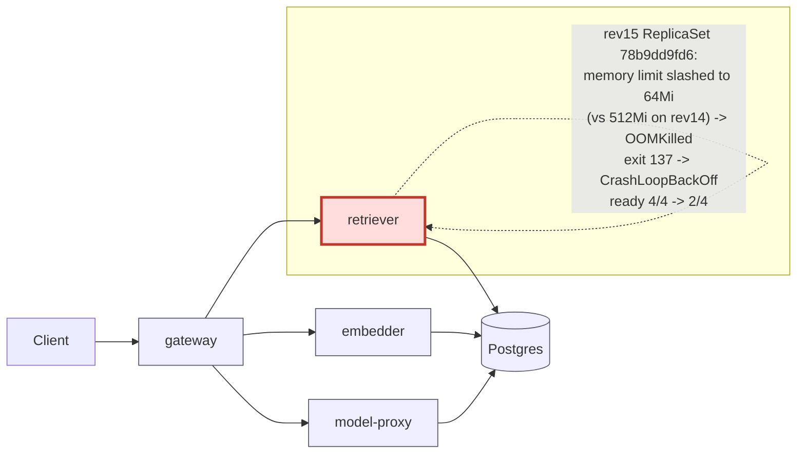

# Postmortem: subject/retriever-78b9dd9fd6-9tdxz has been not-ready for 4 minutes (readiness probe or startup trouble)

- **Status:** open
- **Severity:** sev1
- **Verified:** no
- **Opened:** 2026-08-12 18:56:57Z
- **Resolved:** (still open)

## Timeline (machine-generated)

All times UTC on 2026-08-12 unless a full date is shown.

| Time (UTC) | Source | Event |
| --- | --- | --- |
| 18:53:43Z | log-spike | log-spike onset: [gateway] unhandled error: 16 \| } |
| 18:56:20Z | alert | alert firing: KubePodNotReady |
| 18:56:59Z | k8s | Pod/retriever-d6d55bf7f-rrsgr: Pulled |
| 18:56:59Z | k8s | Pod/retriever-d6d55bf7f-fbbkp: Pulled |
| 18:56:59Z | k8s | Pod/retriever-d6d55bf7f-fbbkp: Created |
| 18:57:06Z | k8s | ReplicaSet/retriever-78b9dd9fd6: SuccessfulDelete |
| 18:57:06Z | k8s | Deployment/retriever: ScalingReplicaSet |
| 18:57:08Z | k8s | Pod/retriever-d6d55bf7f-fbbkp: Killing |
| 18:57:08Z | k8s | ReplicaSet/retriever-d6d55bf7f: SuccessfulDelete |
| 18:57:08Z | k8s | ReplicaSet/retriever-78b9dd9fd6: SuccessfulCreate |
| 18:57:08Z | k8s | Deployment/retriever: ScalingReplicaSet |
| 18:57:08Z | k8s | Pod/retriever-78b9dd9fd6-5dr47: Scheduled |
| 18:57:09Z | k8s | ReplicaSet/retriever-78b9dd9fd6: SuccessfulCreate |
| 18:57:09Z | k8s | Deployment/retriever: ScalingReplicaSet |
| 18:57:09Z | k8s | Pod/retriever-78b9dd9fd6-mwnwt: Scheduled |
| 18:57:10Z | k8s | Pod/retriever-78b9dd9fd6-mwnwt: Started |
| 18:57:10Z | k8s | Pod/retriever-78b9dd9fd6-mwnwt: Pulled |
| 18:57:10Z | k8s | Pod/retriever-78b9dd9fd6-mwnwt: Created |
| 18:57:10Z | k8s | Pod/retriever-78b9dd9fd6-5dr47: Started |
| 18:57:10Z | k8s | Pod/retriever-78b9dd9fd6-5dr47: Pulled |
| 18:57:10Z | k8s | Pod/retriever-78b9dd9fd6-5dr47: Created |
| 18:57:12Z | k8s | Pod/retriever-78b9dd9fd6-5dr47: Started |
| 18:57:12Z | k8s | Pod/retriever-78b9dd9fd6-5dr47: Pulled |
| 18:57:12Z | k8s | Pod/retriever-78b9dd9fd6-5dr47: Created |
| 18:57:13Z | k8s | Pod/retriever-78b9dd9fd6-mwnwt: Pulled |
| 18:57:14Z | k8s | Pod/retriever-78b9dd9fd6-5dr47: BackOff |
| 18:57:14Z | k8s | Pod/retriever-78b9dd9fd6-mwnwt: Started |
| 18:57:14Z | k8s | Pod/retriever-78b9dd9fd6-mwnwt: Created |
| 18:57:15Z | k8s | Pod/retriever-78b9dd9fd6-5dr47: BackOff |
| 18:57:17Z | k8s | Pod/retriever-78b9dd9fd6-mwnwt: BackOff |
| 18:57:19Z | k8s | Pod/retriever-78b9dd9fd6-mwnwt: BackOff |
| 18:57:19Z | k8s | Pod/retriever-78b9dd9fd6-5dr47: BackOff |
| 18:57:25Z | k8s | Pod/retriever-78b9dd9fd6-5dr47: Started |
| 18:57:25Z | k8s | Pod/retriever-78b9dd9fd6-5dr47: Pulled |
| 18:57:25Z | k8s | Pod/retriever-78b9dd9fd6-5dr47: Created |
| 18:57:27Z | k8s | Pod/retriever-78b9dd9fd6-5dr47: BackOff |
| 18:57:28Z | k8s | Pod/retriever-78b9dd9fd6-5dr47: BackOff |
| 18:57:29Z | k8s | Pod/retriever-78b9dd9fd6-5dr47: BackOff |
| 18:57:29Z | k8s | Pod/retriever-78b9dd9fd6-mwnwt: Started |
| 18:57:29Z | k8s | Pod/retriever-78b9dd9fd6-mwnwt: Pulled |
| 18:57:29Z | k8s | Pod/retriever-78b9dd9fd6-mwnwt: Created |
| 18:57:32Z | k8s | Pod/retriever-78b9dd9fd6-mwnwt: BackOff |
| 18:57:39Z | k8s | Pod/retriever-78b9dd9fd6-mwnwt: BackOff |
| 18:57:52Z | k8s | Pod/retriever-78b9dd9fd6-mwnwt: Started |
| 18:57:52Z | k8s | Pod/retriever-78b9dd9fd6-mwnwt: Pulled |
| 18:57:52Z | k8s | Pod/retriever-78b9dd9fd6-mwnwt: Created |
| 18:57:54Z | k8s | Pod/retriever-78b9dd9fd6-mwnwt: BackOff |
| 18:57:54Z | k8s | Pod/retriever-78b9dd9fd6-5dr47: Started |
| 18:57:54Z | k8s | Pod/retriever-78b9dd9fd6-5dr47: Pulled |
| 18:57:54Z | k8s | Pod/retriever-78b9dd9fd6-5dr47: Created |
| 18:57:55Z | k8s | Pod/retriever-78b9dd9fd6-mwnwt: BackOff |
| 18:57:55Z | k8s | Pod/retriever-78b9dd9fd6-5dr47: BackOff |
| 18:57:56Z | k8s | Pod/retriever-78b9dd9fd6-5dr47: BackOff |
| 18:57:59Z | k8s | Pod/retriever-78b9dd9fd6-mwnwt: BackOff |
| 18:57:59Z | k8s | Pod/retriever-78b9dd9fd6-5dr47: BackOff |
| 18:58:17Z | k8s | ReplicaSet/retriever-78b9dd9fd6: SuccessfulDelete |
| 18:58:17Z | k8s | Deployment/retriever: ScalingReplicaSet |
| 18:58:18Z | k8s | ReplicaSet/retriever-d6d55bf7f: SuccessfulCreate |
| 18:58:18Z | k8s | Pod/retriever-d6d55bf7f-frlh9: Scheduled |
| 18:58:19Z | k8s | Pod/retriever-d6d55bf7f-frlh9: Started |
| 18:58:19Z | k8s | Pod/retriever-d6d55bf7f-frlh9: Pulled |
| 18:58:19Z | k8s | Pod/retriever-d6d55bf7f-frlh9: Created |
| 19:00:27Z | k8s | Pod/retriever-d6d55bf7f-frlh9: Killing |
| 19:00:27Z | k8s | ReplicaSet/retriever-d6d55bf7f: SuccessfulDelete |
| 19:00:27Z | k8s | ReplicaSet/retriever-78b9dd9fd6: SuccessfulCreate |
| 19:00:27Z | k8s | Deployment/retriever: ScalingReplicaSet |
| 19:00:27Z | k8s | Pod/retriever-78b9dd9fd6-xhlx7: Scheduled |
| 19:00:27Z | k8s | Pod/retriever-78b9dd9fd6-vt6jn: Scheduled |
| 19:00:28Z | k8s | Pod/retriever-78b9dd9fd6-xhlx7: Started |
| 19:00:28Z | k8s | Pod/retriever-78b9dd9fd6-xhlx7: Pulled |
| 19:00:28Z | k8s | Pod/retriever-78b9dd9fd6-xhlx7: Created |
| 19:00:29Z | k8s | Pod/retriever-78b9dd9fd6-vt6jn: Started |
| 19:00:29Z | k8s | Pod/retriever-78b9dd9fd6-vt6jn: Pulled |
| 19:00:29Z | k8s | Pod/retriever-78b9dd9fd6-vt6jn: Created |
| 19:00:30Z | k8s | Pod/retriever-78b9dd9fd6-xhlx7: Started |
| 19:00:30Z | k8s | Pod/retriever-78b9dd9fd6-xhlx7: Pulled |
| 19:00:30Z | k8s | Pod/retriever-78b9dd9fd6-xhlx7: Created |
| 19:00:32Z | k8s | Pod/retriever-78b9dd9fd6-xhlx7: BackOff |
| 19:00:32Z | k8s | Pod/retriever-78b9dd9fd6-vt6jn: Started |
| 19:00:32Z | k8s | Pod/retriever-78b9dd9fd6-vt6jn: Pulled |
| 19:00:32Z | k8s | Pod/retriever-78b9dd9fd6-vt6jn: Created |
| 19:00:33Z | k8s | Pod/retriever-78b9dd9fd6-xhlx7: BackOff |
| 19:00:35Z | k8s | Pod/retriever-78b9dd9fd6-vt6jn: BackOff |
| 19:00:37Z | k8s | Pod/retriever-78b9dd9fd6-xhlx7: BackOff |
| 19:00:38Z | k8s | Pod/retriever-78b9dd9fd6-vt6jn: BackOff |
| 19:00:43Z | k8s | Pod/retriever-78b9dd9fd6-xhlx7: Started |
| 19:00:43Z | k8s | Pod/retriever-78b9dd9fd6-xhlx7: Pulled |
| 19:00:43Z | k8s | Pod/retriever-78b9dd9fd6-xhlx7: Created |
| 19:00:44Z | k8s | Pod/retriever-78b9dd9fd6-xhlx7: BackOff |
| 19:00:45Z | k8s | Pod/retriever-78b9dd9fd6-xhlx7: BackOff |
| 19:00:45Z | k8s | Pod/retriever-78b9dd9fd6-vt6jn: Started |
| 19:00:45Z | k8s | Pod/retriever-78b9dd9fd6-vt6jn: Pulled |
| 19:00:45Z | k8s | Pod/retriever-78b9dd9fd6-vt6jn: Created |
| 19:00:47Z | k8s | Pod/retriever-78b9dd9fd6-xhlx7: BackOff |
| 19:00:47Z | k8s | Pod/retriever-78b9dd9fd6-vt6jn: BackOff |
| 19:00:48Z | k8s | Pod/retriever-78b9dd9fd6-vt6jn: BackOff |

## Evidence links

- [Loki — logs over the incident window](http://localhost:3001/explore?schemaVersion=1&panes=%7B%22pm%22%3A+%7B%22datasource%22%3A+%22loki%22%2C+%22queries%22%3A+%5B%7B%22refId%22%3A+%22A%22%2C+%22datasource%22%3A+%7B%22type%22%3A+%22loki%22%2C+%22uid%22%3A+%22loki%22%7D%2C+%22expr%22%3A+%22%7Bnamespace%3D%5C%22subject%5C%22%7D+%7C~+%5C%22%28%3Fi%29error%7Cfailed%5C%22%22%7D%5D%2C+%22range%22%3A+%7B%22from%22%3A+%221786561017075%22%2C+%22to%22%3A+%221786561259056%22%7D%7D%7D&orgId=1)
- [Mimir — metrics over the incident window](http://localhost:3001/explore?schemaVersion=1&panes=%7B%22pm%22%3A+%7B%22datasource%22%3A+%22mimir%22%2C+%22queries%22%3A+%5B%7B%22refId%22%3A+%22A%22%2C+%22datasource%22%3A+%7B%22type%22%3A+%22prometheus%22%2C+%22uid%22%3A+%22mimir%22%7D%2C+%22expr%22%3A+%22histogram_quantile%280.95%2C+sum%28rate%28http_server_duration_milliseconds_bucket%5B5m%5D%29%29+by+%28le%29%29%22%7D%5D%2C+%22range%22%3A+%7B%22from%22%3A+%221786561017075%22%2C+%22to%22%3A+%221786561259056%22%7D%7D%7D&orgId=1)

## Investigation context

**Runbook match:** none — no tool narrowing applied for this alert. Available runbooks: README.md, canary-abort.md, ci-pipeline-red.md, dq-freshness-stall.md, gateway-high-error-rate.md, k8s-crashloop.md, k8s-node-failure.md, snapshot-agent-audit.md, stale-secret.md

Pre-check battery (as injected at run start)

## Pre-check leads

### recent_deploys — LEAD
2 deploy-window leads
- argo app platform: sync=OutOfSync health=Healthy (revision c025382ba170)
- argo app retriever: sync=OutOfSync health=Progressing (revision c025382ba170)

### kube_scan — LEAD
19 kube-scan leads
- pod retriever-78b9dd9fd6-lqkqd: CrashLoopBackOff
- event Pod/retriever-78b9dd9fd6-lqkqd: BackOff — Back-off restarting failed container retriever in pod retriever-78b9dd9fd6-lqkqd_subject(73c374ee-5ae9-409b-90f5-87e49b170957) (at 20:52:53)
- event Pod/retriever-78b9dd9fd6-lqkqd: BackOff — Back-off restarting failed container retriever in pod retriever-78b9dd9fd6-lqkqd_subject(73c374ee-5ae9-409b-90f5-87e49b170957) (at 20:52:58)
- event Pod/retriever-78b9dd9fd6-9tdxz: BackOff — Back-off restarting failed container retriever in pod retriever-78b9dd9fd6-9tdxz_subject(624db80c-2f49-4930-ad33-4bbbed7cb4be) (at 20:52:58)
- event Pod/retriever-78b9dd9fd6-pz8qd: BackOff — Back-off restarting failed container retriever in pod retriever-78b9dd9fd6-pz8qd_subje
… (section truncated)

### log_spike — LEAD
error/failed log rate 200/10min vs baseline 0/10min (200x baseline) — onset: [gateway] unhandled error: 16 |         } at 2026-08-12T18:53:43.858805+00:00
- error/failed log rate 200/10min vs baseline 0/10min (200x baseline) — onset: [gateway] unhandled error: 16 |         } at 2026-08-12T18:53:43.858805+00:00

### attribution — LEAD
errors concentrate on gateway → POST model-proxy (13.6%); time concentrates in gateway's own handler (~4.8s of 7.6s) over the last 10m — which is not necessarily the workload named on the alert:
- gateway: 6.2% of its OWN responses are 5xx (10m)
- model-proxy: 3.3% of its OWN responses are 5xx (10m)
- gateway → POST model-proxy: 13.6% of those outbound calls failed
- own-handler p95 (server p95 minus its slowest outbound call — a ranking, not a measurement): gateway ~4.8s of 7.6s end to end, retriever ~2.8s of 2.8s end to end, embedder ~2.7s of 2.7s end to end
- gateway → POST retriever: p95 2.8s outbound
- gateway → POST embedder: p95 2.7s outbound

### rollout_state — OK
gateway and model-proxy rollouts stable, no failed analysis

### secret_age — OK
Secret subject-db-credentials last modified 18d 19h ago (created 18d 19h ago).

## Narrative

## Summary
KubePodNotReady (sev1) fired for `retriever-78b9dd9fd6-9tdxz` in namespace `subject`. No runbook matched this exact alertname, so this incident was worked from telemetry directly.

## Impact
retriever ready-replica count dropped from the desired 4/4 to 2/4 (later observed briefly at 3/4) while pods from ReplicaSet `retriever-78b9dd9fd6` cycled through CrashLoopBackOff, each accumulating up to 5 restarts in the window. The gateway's own attribution lead in the same window (gateway→retriever outbound p95 2.8s, gateway own-handler ~4.8s of a 7.6s end-to-end p95, and a 200x log-spike of gateway errors) is consistent with retriever-path degradation being felt upstream, though gateway/model-proxy themselves stayed on healthy, stable rollouts throughout (confirmed via `rollout_status`/`argo_app` — not the failing hop).

## Root cause
`deployment/retriever` had two live ReplicaSets during the incident:
- `retriever-78b9dd9fd6` (Deployment revision 15, later replaced by an identical-image revision 16 event storm): container `Limits: memory: 64Mi`, `Requests: memory: 48Mi`. Every pod from this ReplicaSet OOMKilled (`exit 137`) within ~20s of starting, then hit `CrashLoopBackOff` (confirmed via `kubectl describe pod` on `retriever-78b9dd9fd6-mwnwt`: `Last State: Terminated, Reason: OOMKilled, Exit Code: 137`).
- `retriever-d6d55bf7f` (the prior good template, Deployment revision 14): container `Limits: memory: 512Mi`, `Requests: memory: 192Mi` — same image tag (`obs-registry:5010/retriever:10f24bc`), 8x the memory headroom, and stayed healthy the whole time.

Argo CD reported both the `retriever` and `platform` apps as `OutOfSync` against revision `c025382ba170` — but that revision's `syncedRevision` timestamp is from 5 days before this page fired, so it is not the trigger; it is the stale marker of live drift. The 64Mi-limit template was applied to the live Deployment object out-of-band from GitOps (i.e., not through the tracked revision), which is exactly what produces "OutOfSync + a fresh bad ReplicaSet the git history doesn't explain." `gitea_compare` between the two tracked revisions 404'd (revision not present as a ref in the forge), reinforcing that the memory-limit change did not travel through the normal commit path.

## What fixed it
Nothing I executed. By the time I finished evidence-gathering and dry-ran `rollout_undo` (which reported "revision 16 → revision 15"), live cluster state had already moved past that: `kubectl describe deployment retriever` showed revision 16 fully rolled out, `retriever-d6d55bf7f` back at 4/4 Ready with the 512Mi template, and `retriever-78b9dd9fd6` scaled to 0. Running the dry-run's proposed undo would have reverted the Deployment back to the *bad* 64Mi revision 15 template — so I deliberately did not request approval or execute it. `alert_status` for `KubePodNotReady` confirmed `active: false` afterward, and the ready-replica series held at 4/4 with no further flapping. This was the Deployment controller's own rolling-update reconciliation self-healing back to the last-known-good template, not an Argo sync (Argo apps remained `OutOfSync` throughout — the drift itself was never remediated at the GitOps level, only the live pods recovered).

## Lessons
1. `retriever`'s live Deployment is being edited out-of-band from GitOps — Argo shows `OutOfSync` while its `syncedRevision` is stale by days. This lets an unreviewed memory-limit change reach production silently. Add drift alerting (or restrict edit access) so this doesn't rely on the workload happening to self-heal.
2. No admission guard stopped a 64Mi memory limit from being applied to a container that needs several hundred MiB — add a sane floor/PDB-aware check for this workload's memory limit.
3. `rollout_undo` is relative to Deployment revision history, not "known-good" — on a flapping Deployment, always diff live-vs-target before trusting an automated rollback; blindly executing this dry-run's suggestion would have reintroduced the outage.
4. No runbook matched `KubePodNotReady`. Worth authoring one that says: check ReplicaSet generation/memory-limit drift first, and don't assume the most recent Argo `syncedRevision` timestamp is recent just because the app is `OutOfSync`.

## Delivery path (incident lives here)

Chart artifact `report.html` shows the ready-replica series (4 → 2 → 3 → 4) across the incident window, drawn from the `kube_pod_status_ready` query used above.
