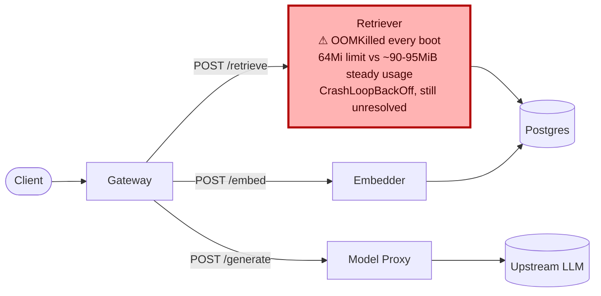

# Postmortem: gateway latency error budget burning slowly (10% of the 28d budget in 6h; 30m & 6h windows)

- **Status:** open
- **Severity:** sev2
- **Verified:** no
- **Opened:** 2026-08-12 19:09:47Z
- **Resolved:** (still open)

## Timeline (machine-generated)

All times UTC on 2026-08-12 unless a full date is shown.

| Time (UTC) | Source | Event |
| --- | --- | --- |
| 18:59:47Z | log-spike | log-spike onset: [gateway] unhandled error: 16 \| } |
| 19:09:10Z | alert | alert firing: SLO gateway latency — slow burn |
| 19:14:02Z | remediation | rollout_undo retriever executed (run run_19ff76175334f5) |
| 19:14:18Z | k8s | Pod/retriever-78b9dd9fd6-4vdfp: BackOff |
| 19:14:20Z | k8s | Pod/retriever-7b8cbbdbf5-5j7tl: BackOff |
| 19:14:20Z | k8s | Pod/retriever-78b9dd9fd6-fq888: Started |
| 19:14:20Z | k8s | Pod/retriever-78b9dd9fd6-fq888: Pulled |
| 19:14:20Z | k8s | Pod/retriever-78b9dd9fd6-fq888: Created |
| 19:14:21Z | k8s | Pod/retriever-7b8cbbdbf5-5j7tl: BackOff |
| 19:14:21Z | k8s | Pod/retriever-78b9dd9fd6-jwdfg: Started |
| 19:14:21Z | k8s | Pod/retriever-78b9dd9fd6-jwdfg: Pulled |
| 19:14:21Z | k8s | Pod/retriever-78b9dd9fd6-jwdfg: Created |
| 19:14:22Z | k8s | Pod/retriever-7b8cbbdbf5-5j7tl: BackOff |
| 19:14:22Z | k8s | Pod/retriever-78b9dd9fd6-jwdfg: BackOff |
| 19:14:22Z | k8s | Pod/retriever-78b9dd9fd6-fq888: BackOff |
| 19:14:23Z | k8s | Pod/retriever-78b9dd9fd6-jwdfg: BackOff |
| 19:14:23Z | k8s | Pod/retriever-78b9dd9fd6-fq888: BackOff |
| 19:14:25Z | k8s | Pod/retriever-7b8cbbdbf5-lwh2b: Started |
| 19:14:25Z | k8s | Pod/retriever-7b8cbbdbf5-lwh2b: Pulled |
| 19:14:25Z | k8s | Pod/retriever-7b8cbbdbf5-lwh2b: Created |
| 19:14:26Z | k8s | Pod/retriever-7b8cbbdbf5-lwh2b: BackOff |
| 19:14:27Z | k8s | Pod/retriever-7b8cbbdbf5-lwh2b: BackOff |
| 19:14:30Z | k8s | Pod/retriever-7b8cbbdbf5-lwh2b: BackOff |
| 19:14:30Z | k8s | Pod/retriever-78b9dd9fd6-jwdfg: BackOff |
| 19:14:30Z | k8s | Pod/retriever-78b9dd9fd6-fq888: BackOff |
| 19:14:56Z | k8s | Pod/retriever-7b8cbbdbf5-79qbh: BackOff |
| 19:15:03Z | k8s | Pod/retriever-7b8cbbdbf5-5j7tl: Started |
| 19:15:03Z | k8s | Pod/retriever-7b8cbbdbf5-5j7tl: Pulled |
| 19:15:03Z | k8s | Pod/retriever-7b8cbbdbf5-5j7tl: Created |
| 19:15:04Z | k8s | Pod/retriever-7b8cbbdbf5-5j7tl: BackOff |
| 19:15:04Z | k8s | Pod/retriever-78b9dd9fd6-fq888: Started |
| 19:15:04Z | k8s | Pod/retriever-78b9dd9fd6-fq888: Pulled |
| 19:15:04Z | k8s | Pod/retriever-78b9dd9fd6-fq888: Created |
| 19:15:05Z | k8s | Pod/retriever-78b9dd9fd6-fq888: BackOff |
| 19:15:05Z | k8s | Pod/retriever-78b9dd9fd6-jwdfg: Started |
| 19:15:05Z | k8s | Pod/retriever-78b9dd9fd6-jwdfg: Pulled |
| 19:15:05Z | k8s | Pod/retriever-78b9dd9fd6-jwdfg: Created |
| 19:15:05Z | k8s | Pod/retriever-78b9dd9fd6-4vdfp: Started |
| 19:15:05Z | k8s | Pod/retriever-78b9dd9fd6-4vdfp: Pulled |
| 19:15:05Z | k8s | Pod/retriever-78b9dd9fd6-4vdfp: Created |
| 19:15:06Z | k8s | Pod/retriever-78b9dd9fd6-fq888: BackOff |
| 19:15:06Z | k8s | Pod/retriever-78b9dd9fd6-4vdfp: BackOff |
| 19:15:07Z | k8s | Pod/retriever-78b9dd9fd6-jwdfg: BackOff |
| 19:15:07Z | k8s | Pod/retriever-78b9dd9fd6-4vdfp: BackOff |
| 19:15:08Z | k8s | Pod/retriever-78b9dd9fd6-jwdfg: BackOff |
| 19:15:09Z | k8s | Pod/retriever-7b8cbbdbf5-5j7tl: BackOff |
| 19:15:10Z | k8s | Pod/retriever-7b8cbbdbf5-5j7tl: BackOff |
| 19:15:10Z | k8s | Pod/retriever-78b9dd9fd6-jwdfg: BackOff |
| 19:15:10Z | k8s | Pod/retriever-78b9dd9fd6-fq888: BackOff |
| 19:15:10Z | k8s | Pod/retriever-78b9dd9fd6-4vdfp: BackOff |
| 19:15:18Z | k8s | Pod/retriever-7b8cbbdbf5-lwh2b: Started |
| 19:15:18Z | k8s | Pod/retriever-7b8cbbdbf5-lwh2b: Pulled |
| 19:15:18Z | k8s | Pod/retriever-7b8cbbdbf5-lwh2b: Created |
| 19:15:19Z | k8s | Pod/retriever-7b8cbbdbf5-lwh2b: BackOff |
| 19:15:20Z | k8s | Pod/retriever-7b8cbbdbf5-lwh2b: BackOff |
| 19:15:21Z | k8s | Pod/retriever-7b8cbbdbf5-lwh2b: BackOff |
| 19:16:01Z | k8s | Pod/retriever-7b8cbbdbf5-79qbh: BackOff |
| 19:16:04Z | k8s | Pod/retriever-7b8cbbdbf5-79qbh: Started |
| 19:16:04Z | k8s | Pod/retriever-7b8cbbdbf5-79qbh: Pulled |
| 19:16:04Z | k8s | Pod/retriever-7b8cbbdbf5-79qbh: Created |
| 19:16:06Z | k8s | Pod/retriever-7b8cbbdbf5-79qbh: BackOff |
| 19:16:07Z | k8s | Pod/retriever-7b8cbbdbf5-79qbh: BackOff |
| 19:16:08Z | k8s | Pod/retriever-7b8cbbdbf5-79qbh: BackOff |
| 19:16:22Z | k8s | Pod/retriever-78b9dd9fd6-4vdfp: BackOff |
| 19:16:28Z | k8s | Pod/retriever-78b9dd9fd6-jwdfg: Started |
| 19:16:28Z | k8s | Pod/retriever-78b9dd9fd6-jwdfg: Pulled |
| 19:16:28Z | k8s | Pod/retriever-78b9dd9fd6-jwdfg: Created |
| 19:16:28Z | k8s | Pod/retriever-78b9dd9fd6-4vdfp: Started |
| 19:16:28Z | k8s | Pod/retriever-78b9dd9fd6-4vdfp: Pulled |
| 19:16:28Z | k8s | Pod/retriever-78b9dd9fd6-4vdfp: Created |
| 19:16:29Z | k8s | Pod/retriever-78b9dd9fd6-4vdfp: BackOff |
| 19:16:30Z | k8s | Pod/retriever-78b9dd9fd6-jwdfg: BackOff |
| 19:16:30Z | k8s | Pod/retriever-78b9dd9fd6-4vdfp: BackOff |
| 19:16:30Z | k8s | Pod/retriever-7b8cbbdbf5-5j7tl: Started |
| 19:16:30Z | k8s | Pod/retriever-7b8cbbdbf5-5j7tl: Pulled |
| 19:16:30Z | k8s | Pod/retriever-7b8cbbdbf5-5j7tl: Created |
| 19:16:31Z | k8s | Pod/retriever-7b8cbbdbf5-5j7tl: BackOff |
| 19:16:31Z | k8s | Pod/retriever-78b9dd9fd6-jwdfg: BackOff |
| 19:16:31Z | k8s | Pod/retriever-78b9dd9fd6-4vdfp: BackOff |
| 19:16:32Z | k8s | Pod/retriever-7b8cbbdbf5-5j7tl: BackOff |
| 19:16:32Z | k8s | Pod/retriever-78b9dd9fd6-jwdfg: BackOff |
| 19:16:34Z | k8s | Pod/retriever-7b8cbbdbf5-5j7tl: BackOff |
| 19:16:37Z | k8s | Pod/retriever-78b9dd9fd6-4vdfp: BackOff |
| 19:16:40Z | k8s | Pod/retriever-7b8cbbdbf5-5j7tl: BackOff |
| 19:16:40Z | k8s | Pod/retriever-78b9dd9fd6-fq888: Started |
| 19:16:40Z | k8s | Pod/retriever-78b9dd9fd6-fq888: Pulled |
| 19:16:40Z | k8s | Pod/retriever-78b9dd9fd6-fq888: Created |
| 19:16:41Z | k8s | Pod/retriever-78b9dd9fd6-fq888: BackOff |
| 19:16:45Z | k8s | Pod/retriever-7b8cbbdbf5-lwh2b: Started |
| 19:16:45Z | k8s | Pod/retriever-7b8cbbdbf5-lwh2b: Pulled |
| 19:16:45Z | k8s | Pod/retriever-7b8cbbdbf5-lwh2b: Created |
| 19:16:46Z | k8s | Pod/retriever-78b9dd9fd6-fq888: BackOff |
| 19:16:47Z | k8s | Pod/retriever-7b8cbbdbf5-lwh2b: BackOff |
| 19:16:48Z | k8s | Pod/retriever-7b8cbbdbf5-lwh2b: BackOff |
| 19:16:50Z | k8s | Pod/retriever-7b8cbbdbf5-lwh2b: BackOff |
| 19:16:50Z | k8s | Pod/retriever-78b9dd9fd6-fq888: BackOff |
| 19:17:25Z | k8s | Pod/retriever-7b8cbbdbf5-79qbh: BackOff |
| 19:17:46Z | k8s | Pod/retriever-78b9dd9fd6-jwdfg: BackOff |
| 19:17:50Z | k8s | Pod/retriever-78b9dd9fd6-4vdfp: BackOff |
| 19:17:52Z | k8s | Pod/retriever-7b8cbbdbf5-lwh2b: BackOff |
| 19:17:55Z | k8s | Pod/retriever-78b9dd9fd6-fq888: BackOff |
| 19:18:06Z | k8s | Pod/retriever-7b8cbbdbf5-5j7tl: BackOff |
| 19:18:46Z | k8s | Pod/retriever-7b8cbbdbf5-79qbh: BackOff |

## Evidence links

- [Loki — logs over the incident window](http://localhost:3001/explore?schemaVersion=1&panes=%7B%22pm%22%3A+%7B%22datasource%22%3A+%22loki%22%2C+%22queries%22%3A+%5B%7B%22refId%22%3A+%22A%22%2C+%22datasource%22%3A+%7B%22type%22%3A+%22loki%22%2C+%22uid%22%3A+%22loki%22%7D%2C+%22expr%22%3A+%22%7Bnamespace%3D%5C%22subject%5C%22%7D+%7C~+%5C%22%28%3Fi%29error%7Cfailed%5C%22%22%7D%5D%2C+%22range%22%3A+%7B%22from%22%3A+%221786561787174%22%2C+%22to%22%3A+%221786562330945%22%7D%7D%7D&orgId=1)
- [Mimir — metrics over the incident window](http://localhost:3001/explore?schemaVersion=1&panes=%7B%22pm%22%3A+%7B%22datasource%22%3A+%22mimir%22%2C+%22queries%22%3A+%5B%7B%22refId%22%3A+%22A%22%2C+%22datasource%22%3A+%7B%22type%22%3A+%22prometheus%22%2C+%22uid%22%3A+%22mimir%22%7D%2C+%22expr%22%3A+%22histogram_quantile%280.95%2C+sum%28rate%28http_server_duration_milliseconds_bucket%5B5m%5D%29%29+by+%28le%29%29%22%7D%5D%2C+%22range%22%3A+%7B%22from%22%3A+%221786561787174%22%2C+%22to%22%3A+%221786562330945%22%7D%7D%7D&orgId=1)

## Investigation context

**Runbook match:** none — no tool narrowing applied for this alert. Available runbooks: README.md, canary-abort.md, ci-pipeline-red.md, dq-freshness-stall.md, gateway-high-error-rate.md, k8s-crashloop.md, k8s-node-failure.md, snapshot-agent-audit.md, stale-secret.md

Pre-check battery (as injected at run start)

## Pre-check leads

### recent_deploys — LEAD
2 deploy-window leads
- argo app platform: sync=OutOfSync health=Healthy (revision c025382ba170)
- argo app retriever: sync=OutOfSync health=Progressing (revision c025382ba170)

### kube_scan — LEAD
8 kube-scan leads
- pod retriever-78b9dd9fd6-72tns: CrashLoopBackOff
- pod retriever-78b9dd9fd6-p7nk9: CrashLoopBackOff
- event Pod/retriever-78b9dd9fd6-72tns: BackOff — Back-off restarting failed container retriever in pod retriever-78b9dd9fd6-72tns_subject(ede4fbfe-713c-478a-84b0-0e0f3ce193d6) (at 21:09:17)
- event Pod/retriever-78b9dd9fd6-72tns: BackOff — Back-off restarting failed container retriever in pod retriever-78b9dd9fd6-72tns_subject(ede4fbfe-713c-478a-84b0-0e0f3ce193d6) (at 21:09:18)
- event Pod/retriever-78b9dd9fd6-72tns: BackOff — Back-off restarting failed container retriever in pod retriever-78b9dd9fd6-72tns_subject(ede4fbfe-713c-478a-84b0-0e0f3ce193d6) (at 21:09:22)
- event Pod/retriever-78b9dd9fd6-p7nk9: BackOff — Back-off restarting failed container
… (section truncated)

### log_spike — LEAD
error/failed log rate 144/10min vs baseline 0/10min (144x baseline) — onset: [gateway] unhandled error: 16 |         } at 2026-08-12T18:59:47.276973+00:00
- error/failed log rate 144/10min vs baseline 0/10min (144x baseline) — onset: [gateway] unhandled error: 16 |         } at 2026-08-12T18:59:47.276973+00:00

### attribution — LEAD
errors concentrate on gateway → POST model-proxy (13.4%); time concentrates in gateway's own handler (~4.9s of 7.5s) over the last 10m — which is not necessarily the workload named on the alert:
- gateway: 4.4% of its OWN responses are 5xx (10m)
- model-proxy: 2.9% of its OWN responses are 5xx (10m)
- gateway → POST model-proxy: 13.4% of those outbound calls failed
- own-handler p95 (server p95 minus its slowest outbound call — a ranking, not a measurement): gateway ~4.9s of 7.5s end to end, embedder ~2.6s of 2.6s end to end, retriever ~2.5s of 2.5s end to end
- gateway → POST embedder: p95 2.6s outbound
- gateway → POST retriever: p95 2.5s outbound

### rollout_state — OK
gateway and model-proxy rollouts stable, no failed analysis

### secret_age — OK
Secret subject-db-credentials last modified 18d 19h ago (created 18d 19h ago).

## Narrative

## Summary

Gateway's latency SLO began a slow burn (10% of the 28d budget consumed in 6h) driven by outbound calls from gateway to the `retriever` service. `retriever` was in CrashLoopBackOff: every pod on the currently-live ReplicaSet template was being OOMKilled within ~1-2s of starting.

## Impact

- Gateway p95 latency inflated: per the attribution pre-check, gateway's own-handler time accounted for ~4.9s of a 7.5s end-to-end p95 (vs. ~2.5s p95 for the retriever call itself when it does succeed), consistent with retry/timeout overhead against an unavailable dependency.
- `retriever` availability: only 1 of 7 pods observed was Ready (`retriever-d6d55bf7f-b9dqs`, an untouched pod running 4d22h); every pod on the newer ReplicaSets (`retriever-78b9dd9fd6`, `retriever-7b8cbbdbf5`) was stuck CrashLoopBackOff with restart counts climbing every ~10-50s.
- Argo reports `retriever` as `OutOfSync`/`Progressing` — the live Deployment has drifted from the GitOps-tracked desired state.

## Root cause

The `retriever` container's memory **limit** is set to **64Mi** on the current Deployment template. Real steady-state usage, measured directly from `container_memory_working_set_bytes` on a healthy, untouched pod (`retriever-d6d55bf7f-fvxvl`) over a ~3h window, sat consistently at **~90-95 MiB** — 40-50% above the 64Mi ceiling, with no load spike involved. Every pod booted under the low-limit template is OOMKilled (`Last State: Terminated / Reason: OOMKilled / Exit Code: 137`) almost immediately, then CrashLoopBackOff's.

`deployment.kubernetes.io/revision` climbed continuously during the investigation (20→21→22→23) purely from repeated template touches (the `kubectl.kubernetes.io/restartedAt` annotation changing) with the **same image** (`retriever:10f24bc`) each time — i.e. something has been repeatedly re-applying/restarting this Deployment out-of-band from the GitOps pipeline (Argo's last actual sync was days earlier, revision `c025382ba170`, and Argo now shows `retriever` OutOfSync), and every one of those out-of-band revisions still carries the too-low 64Mi limit. Only the single pod from the last revision that predates this drift (`d6d55bf7f`, 4d22h old) reflects the previously-correct, higher-memory configuration.

Deploy correlation: no CI/CD run in the recent window (`gitea_ci_runs`, `deploy_history`) touched `retriever`'s resource limits — the drift is a live, in-cluster edit that never went through the pipeline, which is exactly what the `OutOfSync` Argo status is flagging.

Chain: out-of-band memory-limit drop to 64Mi on `retriever` → every new pod OOMKilled on boot → CrashLoopBackOff → gateway's calls to retriever fail/timeout and retry → gateway own-handler latency inflates → gateway latency SLO error-budget slow burn.

## What fixed it

**Recovery was not achieved.** Two remediation paths were attempted, both approved by the operator:

1. `patch_memory_limit(retriever, 256Mi)` — dry-run verified a clean `64Mi → 256Mi` diff each time, but every real apply (tried at 256Mi and again at 512Mi, 3 attempts total, 2 separate approvals) failed identically at the Kubernetes API with `spec.template.spec.containers[0].image: Required value`, a schema-validation error unrelated to the approval mechanism or to the target value. This is a persistent tool-level defect against this specific Deployment, not a transient race.
2. `rollout_undo(retriever)` — executed successfully (`deployment.apps/retriever rolled back`), but the reachable revision history is itself contaminated: the Deployment's revision counter kept incrementing (20→21→22→23) between calls from the same ongoing out-of-band churn, so "undo one step" only ever landed on another already-broken 64Mi revision. It never reached the last genuinely-good config, which appears to be older than what `kubectl rollout undo` retains.

Post-remediation checks (`kubectl_read get pods`, `alert_status`) confirm the alert is **still active** and all recently-templated `retriever` pods are still CrashLoopBackOff.

## Lessons

- **Escalate, don't hammer**: `patch_memory_limit` should not be retried indefinitely against a Deployment that consistently rejects the same class of patch — 3 attempts across 2 values with an identical error is conclusive evidence of a structural block, not bad luck. Recommend fixing the patch tool's strategic-merge payload to always include `image` (and other required container fields) rather than a partial merge.
- **Out-of-band drift is invisible to `rollout_undo`**: because something has been repeatedly touching this Deployment directly in-cluster (bypassing GitOps) faster than remediation can undo it, the standard "roll back one revision" playbook cannot converge. The fix needs to happen at the GitOps layer — correct `retriever`'s memory limit in the tracked manifest and force an Argo resync (`argo app sync` — not available in this on-call toolset) — or the drift source needs to be found and stopped first.
- **A 64Mi limit against a ~90-95MiB steady-state footprint is not a marginal misconfiguration** — it guarantees OOM on every single boot with zero load involved. This should be caught by a pre-deploy resource-limit sanity check (limit must exceed observed p95 usage with headroom) before it ever reaches a live cluster.
- Recommend a follow-up runbook entry for "SLO gateway latency — slow burn" pointing straight at `k8s-crashloop.md` plus a specific step to compare the crashing pod's template against a known-healthy sibling pod's template when multiple ReplicaSet generations coexist — that comparison is what actually found the smoking gun here.

