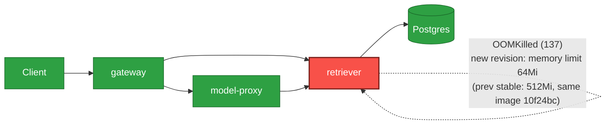

# Postmortem: subject/retriever-7b8cbbdbf5-lwh2b container retriever is in CrashLoopBackOff

- **Status:** open
- **Severity:** sev1
- **Verified:** no
- **Opened:** 2026-08-12 19:19:56Z
- **Resolved:** (still open)

## Timeline (machine-generated)

All times UTC on 2026-08-12 unless a full date is shown.

| Time (UTC) | Source | Event |
| --- | --- | --- |
| 19:10:31Z | log-spike | log-spike onset: name=retriever-78b9dd9fd6-72tns kind=Pod objectAPIversion=v1 objectRV=2502501 eventRV=2502933 reportinginstance=k3d-obs-lab-agent-1 reportingcontroller=kubelet sourcecomponent=kubelet sourcehost=k3d-obs-lab-agent-1 reason=… |
| 19:16:40Z | k8s | Pod/retriever-7b8cbbdbf5-5j7tl: BackOff |
| 19:16:40Z | k8s | Pod/retriever-78b9dd9fd6-fq888: Started |
| 19:16:40Z | k8s | Pod/retriever-78b9dd9fd6-fq888: Pulled |
| 19:16:41Z | k8s | Pod/retriever-78b9dd9fd6-fq888: BackOff |
| 19:16:45Z | k8s | Pod/retriever-7b8cbbdbf5-lwh2b: Started |
| 19:16:45Z | k8s | Pod/retriever-7b8cbbdbf5-lwh2b: Pulled |
| 19:16:45Z | k8s | Pod/retriever-7b8cbbdbf5-lwh2b: Created |
| 19:16:46Z | k8s | Pod/retriever-78b9dd9fd6-fq888: BackOff |
| 19:16:47Z | k8s | Pod/retriever-7b8cbbdbf5-lwh2b: BackOff |
| 19:16:48Z | k8s | Pod/retriever-7b8cbbdbf5-lwh2b: BackOff |
| 19:16:50Z | k8s | Pod/retriever-7b8cbbdbf5-lwh2b: BackOff |
| 19:16:50Z | k8s | Pod/retriever-78b9dd9fd6-fq888: BackOff |
| 19:17:20Z | alert | alert firing: KubePodCrashLooping |
| 19:17:25Z | k8s | Pod/retriever-7b8cbbdbf5-79qbh: BackOff |
| 19:17:46Z | k8s | Pod/retriever-78b9dd9fd6-jwdfg: BackOff |
| 19:17:50Z | k8s | Pod/retriever-78b9dd9fd6-4vdfp: BackOff |
| 19:17:52Z | k8s | Pod/retriever-7b8cbbdbf5-lwh2b: BackOff |
| 19:17:55Z | k8s | Pod/retriever-78b9dd9fd6-fq888: BackOff |
| 19:18:06Z | k8s | Pod/retriever-7b8cbbdbf5-5j7tl: BackOff |
| 19:18:46Z | k8s | Pod/retriever-7b8cbbdbf5-79qbh: BackOff |
| 19:18:59Z | k8s | Pod/retriever-78b9dd9fd6-jwdfg: BackOff |
| 19:19:03Z | k8s | Pod/retriever-78b9dd9fd6-fq888: BackOff |
| 19:19:05Z | k8s | Pod/retriever-7b8cbbdbf5-lwh2b: BackOff |
| 19:19:10Z | k8s | Pod/retriever-78b9dd9fd6-jwdfg: Started |
| 19:19:10Z | k8s | Pod/retriever-78b9dd9fd6-jwdfg: Pulled |
| 19:19:10Z | k8s | Pod/retriever-78b9dd9fd6-jwdfg: Created |
| 19:19:11Z | k8s | Pod/retriever-78b9dd9fd6-jwdfg: BackOff |
| 19:19:12Z | k8s | Pod/retriever-78b9dd9fd6-jwdfg: BackOff |
| 19:19:13Z | k8s | Pod/retriever-7b8cbbdbf5-5j7tl: Started |
| 19:19:13Z | k8s | Pod/retriever-7b8cbbdbf5-5j7tl: Pulled |
| 19:19:13Z | k8s | Pod/retriever-7b8cbbdbf5-5j7tl: Created |
| 19:19:14Z | k8s | Pod/retriever-7b8cbbdbf5-5j7tl: BackOff |
| 19:19:14Z | k8s | Pod/retriever-78b9dd9fd6-4vdfp: Started |
| 19:19:14Z | k8s | Pod/retriever-78b9dd9fd6-4vdfp: Pulled |
| 19:19:14Z | k8s | Pod/retriever-78b9dd9fd6-4vdfp: Created |
| 19:19:15Z | k8s | Pod/retriever-7b8cbbdbf5-5j7tl: BackOff |
| 19:19:15Z | k8s | Pod/retriever-78b9dd9fd6-4vdfp: BackOff |
| 19:19:16Z | k8s | Pod/retriever-78b9dd9fd6-4vdfp: BackOff |
| 19:19:17Z | k8s | Pod/retriever-78b9dd9fd6-4vdfp: BackOff |
| 19:19:20Z | k8s | Pod/retriever-7b8cbbdbf5-5j7tl: BackOff |
| 19:19:20Z | k8s | Pod/retriever-78b9dd9fd6-jwdfg: BackOff |
| 19:19:29Z | k8s | Pod/retriever-78b9dd9fd6-fq888: Started |
| 19:19:29Z | k8s | Pod/retriever-78b9dd9fd6-fq888: Pulled |
| 19:19:29Z | k8s | Pod/retriever-78b9dd9fd6-fq888: Created |
| 19:19:31Z | k8s | Pod/retriever-78b9dd9fd6-fq888: BackOff |
| 19:19:32Z | k8s | Pod/retriever-78b9dd9fd6-fq888: BackOff |
| 19:19:36Z | k8s | Pod/retriever-7b8cbbdbf5-lwh2b: Started |
| 19:19:36Z | k8s | Pod/retriever-7b8cbbdbf5-lwh2b: Pulled |
| 19:19:36Z | k8s | Pod/retriever-7b8cbbdbf5-lwh2b: Created |
| 19:19:37Z | k8s | Pod/retriever-7b8cbbdbf5-lwh2b: BackOff |
| 19:19:38Z | k8s | Pod/retriever-7b8cbbdbf5-lwh2b: BackOff |
| 19:19:40Z | k8s | Pod/retriever-7b8cbbdbf5-lwh2b: BackOff |
| 19:19:40Z | k8s | Pod/retriever-78b9dd9fd6-fq888: BackOff |
| 19:19:52Z | k8s | Pod/retriever-7b8cbbdbf5-79qbh: BackOff |
| 19:19:53Z | k8s | ReplicaSet/retriever-d6d55bf7f: SuccessfulDelete |
| 19:19:53Z | k8s | ReplicaSet/retriever-d6d55bf7f: SuccessfulCreate |
| 19:19:53Z | k8s | ReplicaSet/retriever-7b8cbbdbf5: SuccessfulDelete |
| 19:19:53Z | k8s | ReplicaSet/retriever-78b9dd9fd6: SuccessfulDelete |
| 19:19:53Z | k8s | Deployment/retriever: ScalingReplicaSet |
| 19:19:53Z | k8s | Pod/retriever-d6d55bf7f-nlxbb: Scheduled |
| 19:19:53Z | k8s | Pod/retriever-d6d55bf7f-2rrbb: Scheduled |
| 19:19:53Z | k8s | Pod/retriever-d6d55bf7f-mvgtn: Scheduled |
| 19:19:54Z | k8s | ReplicaSet/retriever-7b8cbbdbf5: SuccessfulDelete |
| 19:19:54Z | k8s | ReplicaSet/retriever-78b9dd9fd6: SuccessfulCreate |
| 19:19:54Z | k8s | Pod/retriever-78b9dd9fd6-5rlkd: Scheduled |
| 19:19:55Z | k8s | Pod/retriever-78b9dd9fd6-5rlkd: Started |
| 19:19:55Z | k8s | Pod/retriever-78b9dd9fd6-5rlkd: Pulled |
| 19:19:55Z | k8s | Pod/retriever-78b9dd9fd6-5rlkd: Created |
| 19:19:57Z | k8s | Pod/retriever-78b9dd9fd6-5rlkd: Started |
| 19:19:57Z | k8s | Pod/retriever-78b9dd9fd6-5rlkd: Pulled |
| 19:19:57Z | k8s | Pod/retriever-78b9dd9fd6-5rlkd: Created |
| 19:19:58Z | k8s | Pod/retriever-78b9dd9fd6-5rlkd: BackOff |
| 19:19:59Z | k8s | Pod/retriever-78b9dd9fd6-5rlkd: BackOff |
| 19:20:01Z | k8s | Pod/retriever-78b9dd9fd6-5rlkd: BackOff |
| 19:20:05Z | k8s | Pod/retriever-78b9dd9fd6-5rlkd: BackOff |
| 19:20:10Z | k8s | Pod/retriever-78b9dd9fd6-5rlkd: Started |
| 19:20:10Z | k8s | Pod/retriever-78b9dd9fd6-5rlkd: Pulled |
| 19:20:10Z | k8s | Pod/retriever-78b9dd9fd6-5rlkd: Created |
| 19:20:11Z | k8s | Pod/retriever-78b9dd9fd6-5rlkd: BackOff |
| 19:20:15Z | k8s | Pod/retriever-78b9dd9fd6-5rlkd: BackOff |
| 19:20:16Z | k8s | Pod/retriever-78b9dd9fd6-5rlkd: BackOff |
| 19:20:33Z | k8s | Pod/retriever-78b9dd9fd6-5rlkd: Started |
| 19:20:33Z | k8s | Pod/retriever-78b9dd9fd6-5rlkd: Pulled |
| 19:20:33Z | k8s | Pod/retriever-78b9dd9fd6-5rlkd: Created |
| 19:20:34Z | k8s | Pod/retriever-78b9dd9fd6-5rlkd: BackOff |
| 19:20:35Z | k8s | Pod/retriever-78b9dd9fd6-5rlkd: BackOff |
| 19:20:36Z | k8s | Pod/retriever-78b9dd9fd6-5rlkd: BackOff |
| 19:21:15Z | k8s | Pod/retriever-78b9dd9fd6-5rlkd: Started |
| 19:21:15Z | k8s | Pod/retriever-78b9dd9fd6-5rlkd: Pulled |
| 19:21:15Z | k8s | Pod/retriever-78b9dd9fd6-5rlkd: Created |
| 19:21:17Z | k8s | Pod/retriever-78b9dd9fd6-5rlkd: BackOff |
| 19:21:17Z | remediation | rollout_undo retriever executed (run run_19ff76abf7ca96) |
| 19:21:18Z | k8s | Pod/retriever-78b9dd9fd6-5rlkd: BackOff |
| 19:21:18Z | k8s | ReplicaSet/retriever-78b9dd9fd6: SuccessfulDelete |
| 19:21:18Z | k8s | Deployment/retriever: ScalingReplicaSet |

## Evidence links

- [Loki — logs over the incident window](http://localhost:3001/explore?schemaVersion=1&panes=%7B%22pm%22%3A+%7B%22datasource%22%3A+%22loki%22%2C+%22queries%22%3A+%5B%7B%22refId%22%3A+%22A%22%2C+%22datasource%22%3A+%7B%22type%22%3A+%22loki%22%2C+%22uid%22%3A+%22loki%22%7D%2C+%22expr%22%3A+%22%7Bnamespace%3D%5C%22subject%5C%22%7D+%7C~+%5C%22%28%3Fi%29error%7Cfailed%5C%22%22%7D%5D%2C+%22range%22%3A+%7B%22from%22%3A+%221786562396024%22%2C+%22to%22%3A+%221786562542080%22%7D%7D%7D&orgId=1)
- [Mimir — metrics over the incident window](http://localhost:3001/explore?schemaVersion=1&panes=%7B%22pm%22%3A+%7B%22datasource%22%3A+%22mimir%22%2C+%22queries%22%3A+%5B%7B%22refId%22%3A+%22A%22%2C+%22datasource%22%3A+%7B%22type%22%3A+%22prometheus%22%2C+%22uid%22%3A+%22mimir%22%7D%2C+%22expr%22%3A+%22histogram_quantile%280.95%2C+sum%28rate%28http_server_duration_milliseconds_bucket%5B5m%5D%29%29+by+%28le%29%29%22%7D%5D%2C+%22range%22%3A+%7B%22from%22%3A+%221786562396024%22%2C+%22to%22%3A+%221786562542080%22%7D%7D%7D&orgId=1)

## Investigation context

**Runbook match (1):** `k8s-crashloop.md` — toolset narrowed to 12 tools: alert_status, deploy_history, k8s_events, kubectl_read, loki_query, publish_postmortem, request_approval, restart_workload, rollout_undo, runbook_lookup, runbook_read, save_artifact

Pre-check battery (as injected at run start)

## Pre-check leads

### recent_deploys — LEAD
2 deploy-window leads
- argo app platform: sync=OutOfSync health=Healthy (revision c025382ba170)
- argo app retriever: sync=OutOfSync health=Progressing (revision c025382ba170)

### kube_scan — LEAD
5 kube-scan leads
- event Pod/retriever-7b8cbbdbf5-lwh2b: BackOff — Back-off restarting failed container retriever in pod retriever-7b8cbbdbf5-lwh2b_subject(448807d5-d272-4ec8-b270-839cf16c2847) (at 21:19:37)
- event Pod/retriever-7b8cbbdbf5-lwh2b: BackOff — Back-off restarting failed container retriever in pod retriever-7b8cbbdbf5-lwh2b_subject(448807d5-d272-4ec8-b270-839cf16c2847) (at 21:19:38)
- event Pod/retriever-7b8cbbdbf5-lwh2b: BackOff — Back-off restarting failed container retriever in pod retriever-7b8cbbdbf5-lwh2b_subject(448807d5-d272-4ec8-b270-839cf16c2847) (at 21:19:40)
- event Pod/retriever-78b9dd9fd6-fq888: BackOff — Back-off restarting failed container retriever in pod retriever-78b9dd9fd6-fq888_subject(d6412e68-6faa-4f37-ac46-ad589f8ca09f) (at 21:19:4
… (section truncated)

### log_spike — LEAD
error/failed log rate 142/10min vs baseline 0/10min (142x baseline) — onset: name=retriever-78b9dd9fd6-72tns kind=Pod objectAPIversion=v1 objectRV=2502501 eventRV=2502933 reportinginstance=k3d-obs-lab-agent-1 reportingcontroller=kubelet sourcecomponent=kubelet sourcehost=k3d-obs-lab-agent-1 reason=BackOff type=Warning count=13 msg="Back-off restarting failed container retriever in pod retriever-78b9dd9fd6-72tns_subject(ede4fbfe-713c-478a-84b0-0e0f3ce193d6)"  at 2026-08-12T19:10:31+00:00
- error/failed log rate 142/10min vs baseline 0/10min (142x baseline) — onset: name=retriever-78b9dd9fd6-72tns kind=Pod objectAPIversion=v1 objectRV=2502501 eventRV=2502933 reportinginstanc… (truncated)

### attribution — LEAD
 over the last 10m — which is not necessarily the workload named on the alert:
- model-proxy reported no server-side requests at all — a workload that is down or unscheduled emits nothing, and its CALLERS carry its errors

### rollout_state — OK
gateway and model-proxy rollouts stable, no failed analysis

### secret_age — OK
Secret subject-db-credentials last modified 18d 20h ago (created 18d 20h ago).

## Narrative

## Summary
`KubePodCrashLooping` fired for `subject/retriever-7b8cbbdbf5-lwh2b` (container `retriever` in CrashLoopBackOff). Every retriever pod on the newest ReplicaSet(s) was OOMKilled seconds after start, driving a sustained CrashLoopBackOff across the deployment.

## Impact
All retriever pods on the rolling-update ReplicaSets (`retriever-78b9dd9fd6`, and an earlier failed attempt `retriever-7b8cbbdbf5`) were unavailable, cycling through Pending → Running → OOMKilled(137) → CrashLoopBackOff in ~15–20s loops. Only one old-revision pod (`retriever-d6d55bf7f-b9dqs`) remained healthy and serving throughout, so the service did not go fully dark, but capacity was reduced to a single replica and every new pod scheduled onto the bad revision failed outright. Downstream, `model-proxy` showed no server-side requests in the last 10m — consistent with reduced retriever capacity/backpressure rather than an independent model-proxy fault; its own rollout was reported Healthy in `deploy_history`, so this was ruled out as a separate root cause and treated as a symptom, not a lead.

## Root cause
A new retriever revision (ReplicaSet `retriever-78b9dd9fd6`, ~29m old at investigation time; Argo Rollout revision 27) shipped the **same image** (`obs-registry:5010/retriever:10f24bc`) as the last-known-good revision but with the container's memory resources slashed:

- Bad revision: `limits.memory: 64Mi`, `requests.memory: 48Mi`
- Previous stable revision (`retriever-d6d55bf7f`, Running 4d23h, revision 26): `limits.memory: 512Mi`, `requests.memory: 192Mi`

`kubectl describe pod` on the crashing pod showed `Last State: Terminated / Reason: OOMKilled / Exit Code: 137` roughly 15–20 seconds after every container start — the bun runtime cannot boot the retriever service inside a 64Mi cgroup limit. This is a config/manifest regression (resource limits), not a code or image bug — the identical image ran cleanly for almost 5 days at the higher limit. This matches the runbook's first hypothesis: "a new revision introduced a bad env/config and dies at startup." The pre-check Argo lead (`retriever: sync=OutOfSync health=Progressing`) was consistent with a rollout stuck mid-canary on this bad revision.

## What fixed it
Dry-ran `rollout_undo` on `retriever` (diff: revision 27 → revision 26, same image, restores the 512Mi/192Mi resource block), got explicit operator approval, then executed for real. `deployment.apps/retriever rolled back` succeeded. Post-remediation: only `retriever-d6d55bf7f-b9dqs` remains, `Running 1/1`, no restarts since; `alert_status` for `KubePodCrashLooping` now reports `active: false`; no further `BackOff`/`OOMKilled` events observed for the retriever pods after rollback.

## Lessons
- Resource-limit changes deserve the same deploy scrutiny as image/code changes — this crashloop had zero code diff, purely a manifest regression that starved the container of memory at boot.
- The Argo `OutOfSync`/`Progressing` state on `retriever` was a useful early signal and should be checked before assuming a code bug.
- The `model-proxy` "no requests" attribution lead was a red herring for this alert — its rollout was independently Healthy; always confirm a caller's own deploy history before chasing it as a root cause.
- Follow-up: add a canary/analysis step or a resource-limit sanity check to the retriever rollout pipeline so a sub-boot-requirement memory limit can't reach 100% of a ReplicaSet before failing pods are observed.

