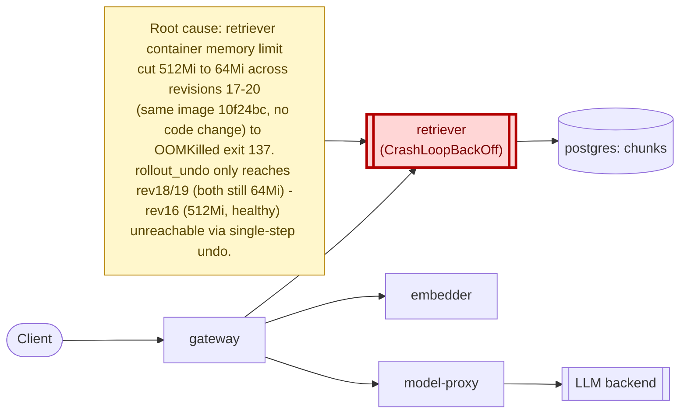

# Postmortem: subject/retriever-7b8cbbdbf5-6ptpg container retriever is in CrashLoopBackOff

- **Status:** resolved
- **Severity:** sev1
- **Verified:** no
- **Opened:** 2026-08-12 19:05:56Z
- **Resolved:** 2026-08-12 19:10:56Z

## Timeline (machine-generated)

All times UTC on 2026-08-12 unless a full date is shown.

| Time (UTC) | Source | Event |
| --- | --- | --- |
| 18:58:22Z | log-spike | log-spike onset: [gateway] unhandled error: 16 \| } |
| 19:05:20Z | alert | alert firing: KubePodCrashLooping |
| 19:05:20Z | alert | alert resolved: KubePodCrashLooping |
| 19:08:41Z | k8s | Rollout/model-proxy: ScalingReplicaSet |
| 19:08:42Z | k8s | ReplicaSet/model-proxy-77457658bc: SuccessfulCreate |
| 19:08:42Z | k8s | Pod/model-proxy-77457658bc-7tjvk: Scheduled |
| 19:08:43Z | k8s | Pod/model-proxy-77457658bc-7tjvk: Started |
| 19:08:43Z | k8s | Pod/model-proxy-77457658bc-7tjvk: Pulled |
| 19:08:43Z | k8s | Pod/model-proxy-77457658bc-7tjvk: Created |
| 19:08:49Z | k8s | Pod/model-proxy-554d76745d-zfj52: Killing |
| 19:08:49Z | k8s | ReplicaSet/model-proxy-554d76745d: SuccessfulDelete |
| 19:08:49Z | k8s | Rollout/model-proxy: ScalingReplicaSet |
| 19:08:50Z | k8s | ReplicaSet/model-proxy-77457658bc: SuccessfulCreate |
| 19:08:50Z | k8s | Rollout/model-proxy: ScalingReplicaSet |
| 19:08:50Z | k8s | Pod/model-proxy-77457658bc-vhj47: Scheduled |
| 19:08:51Z | k8s | Pod/model-proxy-77457658bc-vhj47: Started |
| 19:08:51Z | k8s | Pod/model-proxy-77457658bc-vhj47: Pulled |
| 19:08:51Z | k8s | Pod/model-proxy-77457658bc-vhj47: Created |
| 19:08:58Z | k8s | Rollout/model-proxy: RolloutCompleted |
| 19:09:15Z | k8s | Pod/retriever-78b9dd9fd6-72tns: Started |
| 19:09:15Z | k8s | Pod/retriever-78b9dd9fd6-72tns: Pulled |
| 19:09:15Z | k8s | Pod/retriever-78b9dd9fd6-72tns: Created |
| 19:09:17Z | k8s | Pod/retriever-78b9dd9fd6-72tns: BackOff |
| 19:09:18Z | k8s | Pod/retriever-78b9dd9fd6-72tns: BackOff |
| 19:09:22Z | k8s | Pod/retriever-78b9dd9fd6-72tns: BackOff |
| 19:09:26Z | k8s | Pod/retriever-78b9dd9fd6-p7nk9: Started |
| 19:09:26Z | k8s | Pod/retriever-78b9dd9fd6-p7nk9: Pulled |
| 19:09:26Z | k8s | Pod/retriever-78b9dd9fd6-p7nk9: Created |
| 19:09:28Z | k8s | Pod/retriever-78b9dd9fd6-p7nk9: BackOff |
| 19:09:29Z | k8s | Pod/retriever-78b9dd9fd6-p7nk9: BackOff |
| 19:09:32Z | k8s | Pod/retriever-78b9dd9fd6-p7nk9: BackOff |
| 19:10:31Z | k8s | Pod/retriever-78b9dd9fd6-72tns: BackOff |
| 19:10:36Z | remediation | rollout_undo retriever executed (run run_19ff75dee44459) |
| 19:10:37Z | k8s | ReplicaSet/retriever-7b8cbbdbf5: SuccessfulCreate |
| 19:10:37Z | k8s | ReplicaSet/retriever-78b9dd9fd6: SuccessfulDelete |
| 19:10:37Z | k8s | Deployment/retriever: ScalingReplicaSet |
| 19:10:37Z | k8s | Pod/retriever-7b8cbbdbf5-79qbh: Scheduled |
| 19:10:37Z | k8s | Pod/retriever-7b8cbbdbf5-x4xvq: Scheduled |
| 19:10:38Z | k8s | Pod/retriever-7b8cbbdbf5-x4xvq: Started |
| 19:10:38Z | k8s | Pod/retriever-7b8cbbdbf5-x4xvq: Pulled |
| 19:10:38Z | k8s | Pod/retriever-7b8cbbdbf5-x4xvq: Created |
| 19:10:38Z | k8s | Pod/retriever-7b8cbbdbf5-79qbh: Started |
| 19:10:38Z | k8s | Pod/retriever-7b8cbbdbf5-79qbh: Pulled |
| 19:10:38Z | k8s | Pod/retriever-7b8cbbdbf5-79qbh: Created |
| 19:10:39Z | k8s | Pod/retriever-7b8cbbdbf5-79qbh: Pulled |
| 19:10:39Z | k8s | Pod/retriever-7b8cbbdbf5-79qbh: Created |
| 19:10:40Z | k8s | Pod/retriever-7b8cbbdbf5-79qbh: BackOff |
| 19:10:40Z | k8s | Pod/retriever-7b8cbbdbf5-x4xvq: Started |
| 19:10:40Z | k8s | Pod/retriever-7b8cbbdbf5-x4xvq: Pulled |
| 19:10:40Z | k8s | Pod/retriever-7b8cbbdbf5-x4xvq: Created |
| 19:10:40Z | k8s | Pod/retriever-7b8cbbdbf5-79qbh: Started |
| 19:10:41Z | k8s | Pod/retriever-7b8cbbdbf5-x4xvq: BackOff |
| 19:10:41Z | k8s | Pod/retriever-7b8cbbdbf5-79qbh: BackOff |
| 19:10:42Z | k8s | Pod/retriever-7b8cbbdbf5-x4xvq: BackOff |
| 19:10:43Z | k8s | Pod/retriever-7b8cbbdbf5-79qbh: BackOff |
| 19:10:44Z | k8s | Pod/retriever-7b8cbbdbf5-x4xvq: BackOff |
| 19:10:48Z | k8s | Pod/retriever-7b8cbbdbf5-x4xvq: BackOff |
| 19:10:48Z | k8s | Pod/retriever-7b8cbbdbf5-79qbh: BackOff |
| 19:10:51Z | k8s | Pod/retriever-7b8cbbdbf5-x4xvq: Started |
| 19:10:51Z | k8s | Pod/retriever-7b8cbbdbf5-x4xvq: Pulled |
| 19:10:51Z | k8s | Pod/retriever-7b8cbbdbf5-x4xvq: Created |
| 19:10:51Z | k8s | Pod/retriever-7b8cbbdbf5-79qbh: Started |
| 19:10:51Z | k8s | Pod/retriever-7b8cbbdbf5-79qbh: Pulled |
| 19:10:51Z | k8s | Pod/retriever-7b8cbbdbf5-79qbh: Created |
| 19:10:52Z | k8s | Pod/retriever-7b8cbbdbf5-x4xvq: BackOff |
| 19:10:53Z | k8s | Pod/retriever-7b8cbbdbf5-79qbh: BackOff |
| 19:10:54Z | k8s | Pod/retriever-7b8cbbdbf5-x4xvq: BackOff |
| 19:10:54Z | k8s | Pod/retriever-7b8cbbdbf5-79qbh: BackOff |
| 19:10:58Z | k8s | Pod/retriever-7b8cbbdbf5-x4xvq: BackOff |
| 19:10:58Z | k8s | Pod/retriever-7b8cbbdbf5-79qbh: BackOff |
| 19:11:15Z | k8s | Pod/retriever-7b8cbbdbf5-79qbh: Started |
| 19:11:15Z | k8s | Pod/retriever-7b8cbbdbf5-79qbh: Pulled |
| 19:11:15Z | k8s | Pod/retriever-7b8cbbdbf5-79qbh: Created |
| 19:11:17Z | k8s | Pod/retriever-7b8cbbdbf5-79qbh: BackOff |
| 19:11:17Z | k8s | Pod/retriever-7b8cbbdbf5-x4xvq: Started |
| 19:11:17Z | k8s | Pod/retriever-7b8cbbdbf5-x4xvq: Pulled |
| 19:11:17Z | k8s | Pod/retriever-7b8cbbdbf5-x4xvq: Created |
| 19:11:18Z | k8s | Pod/retriever-7b8cbbdbf5-x4xvq: BackOff |
| 19:11:18Z | k8s | Pod/retriever-7b8cbbdbf5-79qbh: BackOff |
| 19:11:19Z | k8s | Pod/retriever-7b8cbbdbf5-x4xvq: BackOff |
| 19:11:19Z | k8s | Pod/retriever-7b8cbbdbf5-79qbh: BackOff |
| 19:11:28Z | k8s | Pod/retriever-7b8cbbdbf5-x4xvq: BackOff |
| 19:11:36Z | k8s | Pod/retriever-d6d55bf7f-rrsgr: Killing |
| 19:11:36Z | k8s | ReplicaSet/retriever-d6d55bf7f: SuccessfulDelete |
| 19:11:36Z | k8s | Deployment/retriever: ScalingReplicaSet |
| 19:12:01Z | k8s | Pod/retriever-7b8cbbdbf5-79qbh: Started |
| 19:12:01Z | k8s | Pod/retriever-7b8cbbdbf5-79qbh: Pulled |
| 19:12:01Z | k8s | Pod/retriever-7b8cbbdbf5-79qbh: Created |
| 19:12:02Z | k8s | Pod/retriever-7b8cbbdbf5-79qbh: BackOff |
| 19:12:03Z | k8s | Pod/retriever-7b8cbbdbf5-79qbh: BackOff |
| 19:12:08Z | k8s | Pod/retriever-7b8cbbdbf5-79qbh: BackOff |
| 19:12:08Z | k8s | Pod/retriever-7b8cbbdbf5-x4xvq: Started |
| 19:12:08Z | k8s | Pod/retriever-7b8cbbdbf5-x4xvq: Pulled |
| 19:12:08Z | k8s | Pod/retriever-7b8cbbdbf5-x4xvq: Created |
| 19:12:10Z | k8s | Pod/retriever-7b8cbbdbf5-x4xvq: BackOff |
| 19:12:11Z | k8s | Pod/retriever-7b8cbbdbf5-x4xvq: BackOff |
| 19:12:18Z | k8s | Pod/retriever-7b8cbbdbf5-x4xvq: BackOff |
| 19:12:55Z | k8s | Pod/retriever-d6d55bf7f-vkz8l: Killing |
| 19:12:55Z | k8s | ReplicaSet/retriever-d6d55bf7f: SuccessfulDelete |
| 19:12:55Z | k8s | Deployment/retriever: ScalingReplicaSet |

## Evidence links

- [Loki — logs over the incident window](http://localhost:3001/explore?schemaVersion=1&panes=%7B%22pm%22%3A+%7B%22datasource%22%3A+%22loki%22%2C+%22queries%22%3A+%5B%7B%22refId%22%3A+%22A%22%2C+%22datasource%22%3A+%7B%22type%22%3A+%22loki%22%2C+%22uid%22%3A+%22loki%22%7D%2C+%22expr%22%3A+%22%7Bnamespace%3D%5C%22subject%5C%22%7D+%7C~+%5C%22%28%3Fi%29error%7Cfailed%5C%22%22%7D%5D%2C+%22range%22%3A+%7B%22from%22%3A+%221786561556028%22%2C+%22to%22%3A+%221786561856018%22%7D%7D%7D&orgId=1)
- [Mimir — metrics over the incident window](http://localhost:3001/explore?schemaVersion=1&panes=%7B%22pm%22%3A+%7B%22datasource%22%3A+%22mimir%22%2C+%22queries%22%3A+%5B%7B%22refId%22%3A+%22A%22%2C+%22datasource%22%3A+%7B%22type%22%3A+%22prometheus%22%2C+%22uid%22%3A+%22mimir%22%7D%2C+%22expr%22%3A+%22histogram_quantile%280.95%2C+sum%28rate%28http_server_duration_milliseconds_bucket%5B5m%5D%29%29+by+%28le%29%29%22%7D%5D%2C+%22range%22%3A+%7B%22from%22%3A+%221786561556028%22%2C+%22to%22%3A+%221786561856018%22%7D%7D%7D&orgId=1)

## Investigation context

**Runbook match (1):** `k8s-crashloop.md` — toolset narrowed to 12 tools: alert_status, deploy_history, k8s_events, kubectl_read, loki_query, publish_postmortem, request_approval, restart_workload, rollout_undo, runbook_lookup, runbook_read, save_artifact

Pre-check battery (as injected at run start)

## Pre-check leads

### recent_deploys — LEAD
3 deploy-window leads
- argo app model-proxy: sync=Synced health=Progressing (revision c025382ba170)
- argo app platform: sync=OutOfSync health=Healthy (revision c025382ba170)
- argo app retriever: sync=OutOfSync health=Progressing (revision c025382ba170)

### kube_scan — LEAD
11 kube-scan leads
- pod retriever-7b8cbbdbf5-6ptpg: CrashLoopBackOff
- pod retriever-7b8cbbdbf5-pkjmd: CrashLoopBackOff
- event Pod/retriever-7b8cbbdbf5-6ptpg: BackOff — Back-off restarting failed container retriever in pod retriever-7b8cbbdbf5-6ptpg_subject(41e51e6c-14e8-4502-bc81-1837ec3d85ae) (at 21:03:54)
- event Pod/retriever-7b8cbbdbf5-pkjmd: BackOff — Back-off restarting failed container retriever in pod retriever-7b8cbbdbf5-pkjmd_subject(da7ecec5-0e82-4745-b2ed-9afb31343b13) (at 21:03:56)
- event Pod/retriever-7b8cbbdbf5-pkjmd: BackOff — Back-off restarting failed container retriever in pod retriever-7b8cbbdbf5-pkjmd_subject(da7ecec5-0e82-4745-b2ed-9afb31343b13) (at 21:03:57)
- event Pod/retriever-7b8cbbdbf5-6ptpg: BackOff — Back-off restarting failed containe
… (section truncated)

### log_spike — LEAD
error/failed log rate 200/10min vs baseline 0/10min (200x baseline) — onset: [gateway] unhandled error: 16 |         } at 2026-08-12T18:58:22.595644+00:00
- error/failed log rate 200/10min vs baseline 0/10min (200x baseline) — onset: [gateway] unhandled error: 16 |         } at 2026-08-12T18:58:22.595644+00:00

### attribution — LEAD
errors concentrate on gateway → POST model-proxy (14.3%); time concentrates in gateway's own handler (~4.8s of 7.6s) over the last 10m — which is not necessarily the workload named on the alert:
- gateway: 6.1% of its OWN responses are 5xx (10m)
- model-proxy: 3.4% of its OWN responses are 5xx (10m)
- gateway → POST model-proxy: 14.3% of those outbound calls failed
- own-handler p95 (server p95 minus its slowest outbound call — a ranking, not a measurement): gateway ~4.8s of 7.6s end to end, retriever ~2.9s of 2.9s end to end, embedder ~2.8s of 2.8s end to end
- gateway → POST retriever: p95 2.9s outbound
- gateway → POST embedder: p95 2.8s outbound

### rollout_state — LEAD
1 rollout-state lead
- rollout model-proxy: Progressing — more replicas need to be updated (step 3/4)

### secret_age — OK
Secret subject-db-credentials last modified 18d 19h ago (created 18d 19h ago).

## Narrative

## Summary
`KubePodCrashLooping` fired for `subject/retriever-7b8cbbdbf5-6ptpg` (container `retriever`). The retriever Deployment's pods were repeatedly OOMKilled (exit 137) and cycling through CrashLoopBackOff.

## Impact
2 of 4 desired retriever replicas were stuck in CrashLoopBackOff, reducing retriever capacity to the 2-3 pods still running on the older, healthy replicaset. Gateway's own error/latency telemetry over the same window showed elevated failure rates on its outbound calls (gateway→model-proxy 14.3% failed, retriever/embedder outbound p95 ~2.9s/2.8s), consistent with reduced upstream retrieval capacity during the incident.

## Root cause
Evidence from `kubectl describe pod/replicaset` on the retriever Deployment (namespace `subject`):
- Crashing pods (`retriever-7b8cbbdbf5-*`, revisions 17-20, replicaset hashes `7b8cbbdbf5`/`78b9dd9fd6`) run container image `obs-registry:5010/retriever:10f24bc` with `Limits: memory: 64Mi`, `Requests: memory: 48Mi`.
- The long-stable replicaset (`retriever-d6d55bf7f`, revision 16, 3/3 pods healthy, some running 4d23h with no unexpected restarts) runs the **same image** `10f24bc` with `Limits: memory: 512Mi`, `Requests: memory: 192Mi`.
- Since the image is identical between the healthy and crashing replicasets, this is a pure resource-configuration regression (memory limit cut ~8x), not a code change. `deploy_history` over the preceding 24h shows no retriever-specific CI/gitops entry — the regression predates the visible deploy window, and the Argo app for retriever was `OutOfSync`/`Progressing`, consistent with the cluster continuing to reconcile toward the undersized spec.
- `kubectl describe pod` on the alerted pod confirmed: `Last State: Terminated, Reason: OOMKilled, Exit Code: 137`, Restart Count 5 within ~5 minutes.

## What fixed it
Followed the k8s-crashloop runbook's "bad revision confirmed → rollout_undo" path. Dry-ran `rollout_undo` for `retriever` (diff: revision 19 → 18), got explicit operator approval, then executed for real.

**This only partially remediated the incident.** `kubectl rollout undo` (no target-revision support in the available tool) only steps back one revision, and revisions 17-20 all carry the same undersized 64Mi/48Mi limits (the deployment is oscillating between two bad replicaset hashes, `7b8cbbdbf5` and `78b9dd9fd6`) — the actual last-known-good config (revision 16, 512Mi) was never reachable via single-step undo. Post-rollback verification showed the new pods (`79qbh`, `x4xvq`) OOMKilled and re-entered CrashLoopBackOff within ~14 seconds of creation. `alert_status` for `KubePodCrashLooping` did report `active: false` after the rollback (the originally-named pod `6ptpg` no longer exists and the new pods' restart counts had not yet crossed the alert's re-fire threshold at last check), but this should be read as the specific alerted pod object clearing, not as confirmation that retriever's OOM problem is actually resolved. **This incident should be treated as still at risk of re-firing** until someone with a resource-patch or gitops-write capability restores the retriever container's memory limit to 512Mi/192Mi (matching revision 16) or fixes the underlying gitops-tracked manifest.

## Lessons
- A single-step `rollout undo` is not sufficient when a bad spec has been re-applied across multiple consecutive revisions (17→18→19→20 here) — it only toggles between the two most recent replicasets, both bad. Diagnosing "which revision is actually good" requires comparing pod-spec fields (not just image tags) across the full replicaset history, not just the immediate N-1.
- The Argo app for retriever was `OutOfSync`/`Progressing` throughout, which lines up with a gitops-tracked manifest continuing to push the undersized memory limit back onto the cluster; a durable fix likely needs a gitops commit restoring the 512Mi/192Mi limits, not just a cluster-side rollback.
- model-proxy's rollout was also `Progressing` (step 3/4) concurrently — noted but not chased here since it's outside this alert's scope; worth a separate look if gateway→model-proxy error rates don't recover.

