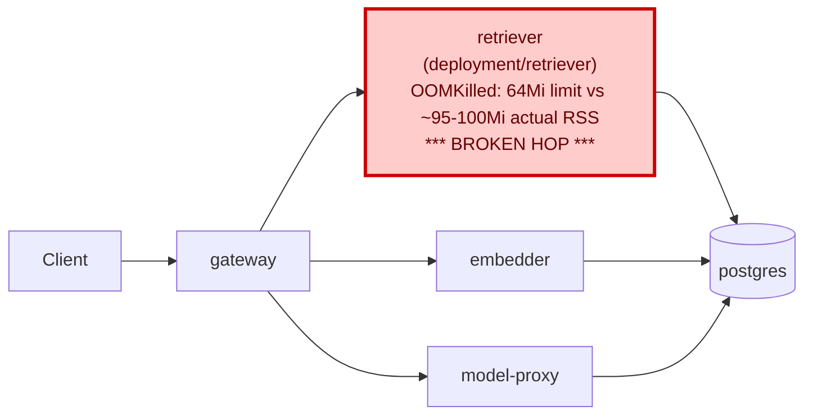

# Postmortem: subject/retriever available replicas != spec for 8 minutes

- **Status:** open
- **Severity:** sev2
- **Verified:** no
- **Opened:** 2026-08-12 19:09:51Z
- **Resolved:** (still open)

## Timeline (machine-generated)

All times UTC on 2026-08-12 unless a full date is shown.

| Time (UTC) | Source | Event |
| --- | --- | --- |
| 18:59:56Z | log-spike | log-spike onset: [gateway] unhandled error: 16 \| } |
| 19:09:20Z | alert | alert firing: KubeDeploymentReplicasMismatch |
| 19:13:46Z | k8s | Pod/retriever-78b9dd9fd6-jwdfg: BackOff |
| 19:13:46Z | k8s | Pod/retriever-78b9dd9fd6-fq888: BackOff |
| 19:13:47Z | k8s | Pod/retriever-7b8cbbdbf5-lwh2b: BackOff |
| 19:13:47Z | k8s | Pod/retriever-78b9dd9fd6-jwdfg: BackOff |
| 19:13:47Z | k8s | Pod/retriever-78b9dd9fd6-4vdfp: BackOff |
| 19:13:50Z | k8s | Pod/retriever-7b8cbbdbf5-lwh2b: BackOff |
| 19:13:50Z | k8s | Pod/retriever-7b8cbbdbf5-5j7tl: BackOff |
| 19:13:50Z | k8s | Pod/retriever-78b9dd9fd6-jwdfg: BackOff |
| 19:13:50Z | k8s | Pod/retriever-78b9dd9fd6-fq888: BackOff |
| 19:13:50Z | k8s | Pod/retriever-78b9dd9fd6-4vdfp: Started |
| 19:13:50Z | k8s | Pod/retriever-78b9dd9fd6-4vdfp: Pulled |
| 19:13:50Z | k8s | Pod/retriever-78b9dd9fd6-4vdfp: Created |
| 19:13:51Z | k8s | Pod/retriever-78b9dd9fd6-4vdfp: BackOff |
| 19:13:52Z | k8s | Pod/retriever-78b9dd9fd6-4vdfp: BackOff |
| 19:13:55Z | k8s | Pod/retriever-78b9dd9fd6-fq888: Started |
| 19:13:55Z | k8s | Pod/retriever-78b9dd9fd6-fq888: Pulled |
| 19:13:55Z | k8s | Pod/retriever-78b9dd9fd6-fq888: Created |
| 19:13:56Z | k8s | Pod/retriever-78b9dd9fd6-fq888: BackOff |
| 19:13:56Z | k8s | Pod/retriever-7b8cbbdbf5-5j7tl: Started |
| 19:13:56Z | k8s | Pod/retriever-7b8cbbdbf5-5j7tl: Pulled |
| 19:13:56Z | k8s | Pod/retriever-7b8cbbdbf5-5j7tl: Created |
| 19:13:57Z | k8s | Pod/retriever-7b8cbbdbf5-5j7tl: BackOff |
| 19:13:57Z | k8s | Pod/retriever-78b9dd9fd6-fq888: BackOff |
| 19:13:57Z | k8s | Pod/retriever-78b9dd9fd6-4vdfp: BackOff |
| 19:13:57Z | k8s | Pod/retriever-7b8cbbdbf5-lwh2b: Started |
| 19:13:57Z | k8s | Pod/retriever-7b8cbbdbf5-lwh2b: Pulled |
| 19:13:57Z | k8s | Pod/retriever-7b8cbbdbf5-lwh2b: Created |
| 19:13:57Z | k8s | Pod/retriever-78b9dd9fd6-jwdfg: Started |
| 19:13:57Z | k8s | Pod/retriever-78b9dd9fd6-jwdfg: Pulled |
| 19:13:57Z | k8s | Pod/retriever-78b9dd9fd6-jwdfg: Created |
| 19:13:58Z | k8s | Pod/retriever-7b8cbbdbf5-5j7tl: BackOff |
| 19:13:59Z | k8s | Pod/retriever-7b8cbbdbf5-lwh2b: BackOff |
| 19:13:59Z | k8s | Pod/retriever-78b9dd9fd6-jwdfg: BackOff |
| 19:14:00Z | k8s | Pod/retriever-7b8cbbdbf5-lwh2b: BackOff |
| 19:14:00Z | k8s | Pod/retriever-7b8cbbdbf5-5j7tl: BackOff |
| 19:14:00Z | k8s | Pod/retriever-78b9dd9fd6-jwdfg: BackOff |
| 19:14:00Z | k8s | Pod/retriever-78b9dd9fd6-fq888: BackOff |
| 19:14:01Z | k8s | Pod/retriever-7b8cbbdbf5-lwh2b: BackOff |
| 19:14:01Z | k8s | Pod/retriever-78b9dd9fd6-jwdfg: BackOff |
| 19:14:14Z | k8s | Pod/retriever-78b9dd9fd6-4vdfp: Started |
| 19:14:14Z | k8s | Pod/retriever-78b9dd9fd6-4vdfp: Pulled |
| 19:14:14Z | k8s | Pod/retriever-78b9dd9fd6-4vdfp: Created |
| 19:14:16Z | k8s | Pod/retriever-78b9dd9fd6-4vdfp: BackOff |
| 19:14:17Z | k8s | Pod/retriever-78b9dd9fd6-4vdfp: BackOff |
| 19:14:18Z | k8s | Pod/retriever-78b9dd9fd6-4vdfp: BackOff |
| 19:14:18Z | k8s | Pod/retriever-7b8cbbdbf5-5j7tl: Started |
| 19:14:18Z | k8s | Pod/retriever-7b8cbbdbf5-5j7tl: Pulled |
| 19:14:18Z | k8s | Pod/retriever-7b8cbbdbf5-5j7tl: Created |
| 19:14:20Z | k8s | Pod/retriever-7b8cbbdbf5-5j7tl: BackOff |
| 19:14:20Z | k8s | Pod/retriever-78b9dd9fd6-fq888: Started |
| 19:14:20Z | k8s | Pod/retriever-78b9dd9fd6-fq888: Pulled |
| 19:14:20Z | k8s | Pod/retriever-78b9dd9fd6-fq888: Created |
| 19:14:21Z | k8s | Pod/retriever-7b8cbbdbf5-5j7tl: BackOff |
| 19:14:21Z | k8s | Pod/retriever-78b9dd9fd6-jwdfg: Started |
| 19:14:21Z | k8s | Pod/retriever-78b9dd9fd6-jwdfg: Pulled |
| 19:14:21Z | k8s | Pod/retriever-78b9dd9fd6-jwdfg: Created |
| 19:14:22Z | k8s | Pod/retriever-7b8cbbdbf5-5j7tl: BackOff |
| 19:14:22Z | k8s | Pod/retriever-78b9dd9fd6-jwdfg: BackOff |
| 19:14:22Z | k8s | Pod/retriever-78b9dd9fd6-fq888: BackOff |
| 19:14:23Z | k8s | Pod/retriever-78b9dd9fd6-jwdfg: BackOff |
| 19:14:23Z | k8s | Pod/retriever-78b9dd9fd6-fq888: BackOff |
| 19:14:25Z | k8s | Pod/retriever-7b8cbbdbf5-lwh2b: Started |
| 19:14:25Z | k8s | Pod/retriever-7b8cbbdbf5-lwh2b: Pulled |
| 19:14:25Z | k8s | Pod/retriever-7b8cbbdbf5-lwh2b: Created |
| 19:14:26Z | k8s | Pod/retriever-7b8cbbdbf5-lwh2b: BackOff |
| 19:14:27Z | k8s | Pod/retriever-7b8cbbdbf5-lwh2b: BackOff |
| 19:14:30Z | k8s | Pod/retriever-7b8cbbdbf5-lwh2b: BackOff |
| 19:14:30Z | k8s | Pod/retriever-78b9dd9fd6-jwdfg: BackOff |
| 19:14:30Z | k8s | Pod/retriever-78b9dd9fd6-fq888: BackOff |
| 19:14:56Z | k8s | Pod/retriever-7b8cbbdbf5-79qbh: BackOff |
| 19:15:03Z | k8s | Pod/retriever-7b8cbbdbf5-5j7tl: Started |
| 19:15:03Z | k8s | Pod/retriever-7b8cbbdbf5-5j7tl: Pulled |
| 19:15:03Z | k8s | Pod/retriever-7b8cbbdbf5-5j7tl: Created |
| 19:15:04Z | k8s | Pod/retriever-7b8cbbdbf5-5j7tl: BackOff |
| 19:15:04Z | k8s | Pod/retriever-78b9dd9fd6-fq888: Started |
| 19:15:04Z | k8s | Pod/retriever-78b9dd9fd6-fq888: Pulled |
| 19:15:04Z | k8s | Pod/retriever-78b9dd9fd6-fq888: Created |
| 19:15:05Z | k8s | Pod/retriever-78b9dd9fd6-fq888: BackOff |
| 19:15:05Z | k8s | Pod/retriever-78b9dd9fd6-jwdfg: Started |
| 19:15:05Z | k8s | Pod/retriever-78b9dd9fd6-jwdfg: Pulled |
| 19:15:05Z | k8s | Pod/retriever-78b9dd9fd6-jwdfg: Created |
| 19:15:05Z | k8s | Pod/retriever-78b9dd9fd6-4vdfp: Started |
| 19:15:05Z | k8s | Pod/retriever-78b9dd9fd6-4vdfp: Pulled |
| 19:15:05Z | k8s | Pod/retriever-78b9dd9fd6-4vdfp: Created |
| 19:15:06Z | k8s | Pod/retriever-78b9dd9fd6-fq888: BackOff |
| 19:15:06Z | k8s | Pod/retriever-78b9dd9fd6-4vdfp: BackOff |
| 19:15:07Z | k8s | Pod/retriever-78b9dd9fd6-jwdfg: BackOff |
| 19:15:07Z | k8s | Pod/retriever-78b9dd9fd6-4vdfp: BackOff |
| 19:15:08Z | k8s | Pod/retriever-78b9dd9fd6-jwdfg: BackOff |
| 19:15:09Z | k8s | Pod/retriever-7b8cbbdbf5-5j7tl: BackOff |
| 19:15:10Z | k8s | Pod/retriever-7b8cbbdbf5-5j7tl: BackOff |
| 19:15:10Z | k8s | Pod/retriever-78b9dd9fd6-jwdfg: BackOff |
| 19:15:10Z | k8s | Pod/retriever-78b9dd9fd6-fq888: BackOff |
| 19:15:10Z | k8s | Pod/retriever-78b9dd9fd6-4vdfp: BackOff |
| 19:15:18Z | k8s | Pod/retriever-7b8cbbdbf5-lwh2b: Started |
| 19:15:18Z | k8s | Pod/retriever-7b8cbbdbf5-lwh2b: Pulled |
| 19:15:18Z | k8s | Pod/retriever-7b8cbbdbf5-lwh2b: Created |
| 19:15:19Z | k8s | Pod/retriever-7b8cbbdbf5-lwh2b: BackOff |
| 19:15:20Z | k8s | Pod/retriever-7b8cbbdbf5-lwh2b: BackOff |
| 19:15:21Z | k8s | Pod/retriever-7b8cbbdbf5-lwh2b: BackOff |

## Evidence links

- [Loki — logs over the incident window](http://localhost:3001/explore?schemaVersion=1&panes=%7B%22pm%22%3A+%7B%22datasource%22%3A+%22loki%22%2C+%22queries%22%3A+%5B%7B%22refId%22%3A+%22A%22%2C+%22datasource%22%3A+%7B%22type%22%3A+%22loki%22%2C+%22uid%22%3A+%22loki%22%7D%2C+%22expr%22%3A+%22%7Bnamespace%3D%5C%22subject%5C%22%7D+%7C~+%5C%22%28%3Fi%29error%7Cfailed%5C%22%22%7D%5D%2C+%22range%22%3A+%7B%22from%22%3A+%221786561791283%22%2C+%22to%22%3A+%221786562155814%22%7D%7D%7D&orgId=1)
- [Mimir — metrics over the incident window](http://localhost:3001/explore?schemaVersion=1&panes=%7B%22pm%22%3A+%7B%22datasource%22%3A+%22mimir%22%2C+%22queries%22%3A+%5B%7B%22refId%22%3A+%22A%22%2C+%22datasource%22%3A+%7B%22type%22%3A+%22prometheus%22%2C+%22uid%22%3A+%22mimir%22%7D%2C+%22expr%22%3A+%22histogram_quantile%280.95%2C+sum%28rate%28http_server_duration_milliseconds_bucket%5B5m%5D%29%29+by+%28le%29%29%22%7D%5D%2C+%22range%22%3A+%7B%22from%22%3A+%221786561791283%22%2C+%22to%22%3A+%221786562155814%22%7D%7D%7D&orgId=1)

## Investigation context

**Runbook match:** none — no tool narrowing applied for this alert. Available runbooks: README.md, canary-abort.md, ci-pipeline-red.md, dq-freshness-stall.md, gateway-high-error-rate.md, k8s-crashloop.md, k8s-node-failure.md, snapshot-agent-audit.md, stale-secret.md

Pre-check battery (as injected at run start)

## Pre-check leads

### recent_deploys — LEAD
2 deploy-window leads
- argo app platform: sync=OutOfSync health=Healthy (revision c025382ba170)
- argo app retriever: sync=OutOfSync health=Progressing (revision c025382ba170)

### kube_scan — LEAD
8 kube-scan leads
- pod retriever-78b9dd9fd6-72tns: CrashLoopBackOff
- pod retriever-78b9dd9fd6-p7nk9: CrashLoopBackOff
- event Pod/retriever-78b9dd9fd6-72tns: BackOff — Back-off restarting failed container retriever in pod retriever-78b9dd9fd6-72tns_subject(ede4fbfe-713c-478a-84b0-0e0f3ce193d6) (at 21:09:17)
- event Pod/retriever-78b9dd9fd6-72tns: BackOff — Back-off restarting failed container retriever in pod retriever-78b9dd9fd6-72tns_subject(ede4fbfe-713c-478a-84b0-0e0f3ce193d6) (at 21:09:18)
- event Pod/retriever-78b9dd9fd6-72tns: BackOff — Back-off restarting failed container retriever in pod retriever-78b9dd9fd6-72tns_subject(ede4fbfe-713c-478a-84b0-0e0f3ce193d6) (at 21:09:22)
- event Pod/retriever-78b9dd9fd6-p7nk9: BackOff — Back-off restarting failed container
… (section truncated)

### log_spike — LEAD
error/failed log rate 138/10min vs baseline 0/10min (138x baseline) — onset: [gateway] unhandled error: 16 |         } at 2026-08-12T18:59:56.851517+00:00
- error/failed log rate 138/10min vs baseline 0/10min (138x baseline) — onset: [gateway] unhandled error: 16 |         } at 2026-08-12T18:59:56.851517+00:00

### attribution — LEAD
errors concentrate on gateway → POST model-proxy (14.7%); time concentrates in gateway's own handler (~4.8s of 7.6s) over the last 10m — which is not necessarily the workload named on the alert:
- gateway: 4.4% of its OWN responses are 5xx (10m)
- model-proxy: 2.9% of its OWN responses are 5xx (10m)
- gateway → POST model-proxy: 14.7% of those outbound calls failed
- own-handler p95 (server p95 minus its slowest outbound call — a ranking, not a measurement): gateway ~4.8s of 7.6s end to end, embedder ~2.8s of 2.8s end to end, retriever ~2.7s of 2.7s end to end
- gateway → POST embedder: p95 2.8s outbound
- gateway → POST retriever: p95 2.7s outbound

### rollout_state — OK
gateway and model-proxy rollouts stable, no failed analysis

### secret_age — OK
Secret subject-db-credentials last modified 18d 19h ago (created 18d 19h ago).

## Narrative

## Summary
`KubeDeploymentReplicasMismatch` fired for `subject/retriever`. The Deployment's pod template carries a container memory limit (`64Mi`) well below the retriever process's real steady-state footprint, so every pod created under that template OOMKills within seconds of starting. A rolling restart forced fresh pods onto this undersized template, and the Deployment has been unable to converge on its desired replica count since.

## Impact
`deployment/retriever` degraded from a healthy `3/4` ready to a worsening `1/5` ready over the course of the incident, as the rollout kept cycling replacement pods that immediately crash-looped while still-healthy older-template pods were scaled down to make room for them. Retriever capacity was reduced/unstable for the tenant (`test-bench`) for the duration.

## Root cause
Evidence chain:
- `kubectl describe pod retriever-78b9dd9fd6-72tns`: `State: Waiting — CrashLoopBackOff`, `Last State: Terminated — Reason: OOMKilled, Exit Code: 137`, `Limits: memory: 64Mi`, `Requests: memory: 48Mi`, restart count climbing, repeated `BackOff` events.
- `kubectl describe deployment retriever`: pod template annotation `kubectl.kubernetes.io/restartedAt: 2026-08-12T21:01:01+02:00` (a rolling restart), current live template `Limits: memory: 64Mi`, condition `Available: False (MinimumReplicasUnavailable)`, and an events log showing the controller repeatedly scaling the new replicaset up/down against the old one, never converging.
- Mimir `container_memory_working_set_bytes{pod=~"retriever-.*"}`: the still-running, pre-restart replicaset `retriever-d6d55bf7f` — same image `obs-registry:5010/retriever:10f24bc` — held a steady ~94–100Mi working set per pod over the same window. That's ~1.5–1.6x the 64Mi limit assigned to freshly-scheduled pods, so any new pod is guaranteed to be OOMKilled almost immediately.
- Mimir `kube_deployment_status_replicas_available`: flat at 4 for the first ~41 minutes of the observed window, then dropping to 2 exactly at the restart/onset point and flapping 2→3→4→3 afterward as the controller keeps retrying and failing to converge.
- `argo_app`: every other application in the cluster (embedder, gateway, load-generator, model-proxy) is `Synced` at revision `c025382ba170`; `retriever` (and `platform`) are `OutOfSync` at the same revision — the live retriever spec has drifted from the tracked desired state, and the drifted value is the undersized memory limit.
- `rollout_undo` dry-run showed the one-step-back revision (19, replicaset `retriever-78b9dd9fd6`) carries the *same* `64Mi` limit (confirmed directly via that replicaset's own pod describe above), ruling out a simple one-revision rollback as a fix — the last known-good memory configuration is further back than a single undo step.

## What fixed it
Nothing did — the incident is **unresolved**. Remediation plan: raise the container memory limit above observed usage (64Mi → 256Mi, comfortable headroom over the ~100Mi steady state).
- `patch_memory_limit(retriever, 256Mi)` was dry-run (diff `limits.memory: 64Mi -> 256Mi`), approved by the operator, and executed for real — it failed with `The Deployment "retriever" is invalid: spec.template.spec.containers[0].image: Required value`.
- Suspecting a transient issue, the dry-run/approval/execute cycle was repeated end-to-end a second time — identical failure, identical error text, unrelated to the requested memory value. This points to a bug in the remediation tool's own patch payload (likely omitting the container name/image on a strategic-merge patch) rather than an approval, permission, or input problem.
- `rollout_undo` was evaluated as an alternative and dry-run, but rejected before execution once evidence showed the target revision carries the same broken memory limit (see Root cause above) — executing it would not have helped and was not applied.
- No remediation tool call in this incident successfully mutated cluster state. `alert_status` was re-queried after each attempt and remained `active` throughout; `deployment/retriever` readiness continued to degrade (3/4 → 1/5) independent of, and despite, the remediation attempts.

## Lessons
- The retriever memory limit needs to be corrected at the source of truth (the gitops-tracked manifest), not just live-patched, or Argo will keep drifting it back given the app is already `OutOfSync` — a real fix should also resolve the sync drift.
- `patch_memory_limit` is currently broken against this Deployment (confirmed twice, same schema-validation error) and should not be trusted for on-call remediation until its patch construction is fixed.
- A one-step `rollout_undo` is not sufficient when a bad configuration has persisted across more than one revision — worth checking the target revision's actual resource spec before relying on undo as a fix, exactly as done here.
- No runbook matched `KubeDeploymentReplicasMismatch` at alert time. This incident's diagnostic path — pod describe for `OOMKilled`/exit 137, then compare the crashing template's resource limits against a still-healthy sibling replicaset's live `container_memory_working_set_bytes` — should be written up as that runbook.
