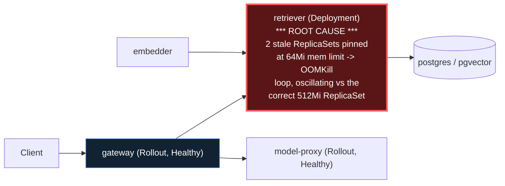

# Postmortem: gateway availability error budget burning slowly (10% of the 28d budget in 6h; 30m & 6h windows)

- **Status:** open
- **Severity:** sev2
- **Verified:** no
- **Opened:** 2026-08-12 19:10:44Z
- **Resolved:** (still open)

## Timeline (machine-generated)

All times UTC on 2026-08-12 unless a full date is shown.

| Time (UTC) | Source | Event |
| --- | --- | --- |
| 19:00:45Z | log-spike | log-spike onset: name=retriever-78b9dd9fd6-xhlx7 kind=Pod objectAPIversion=v1 objectRV=2501303 eventRV=2501401 reportinginstance=k3d-obs-lab-agent-0 reportingcontroller=kubelet sourcecomponent=kubelet sourcehost=k3d-obs-lab-agent-0 reason=… |
| 19:10:10Z | alert | alert firing: SLO gateway availability — slow burn |
| 19:13:35Z | remediation | rollout_undo retriever executed (run run_19ff762545959d) |
| 19:14:16Z | log-spike | log-spike onset: name=retriever-78b9dd9fd6-4vdfp kind=Pod objectAPIversion=v1 objectRV=2503421 eventRV=2503687 reportinginstance=k3d-obs-lab-agent-0 reportingcontroller=kubelet sourcecomponent=kubelet sourcehost=k3d-obs-lab-agent-0 reason=… |
| 19:14:18Z | k8s | Pod/retriever-78b9dd9fd6-4vdfp: BackOff |
| 19:14:18Z | k8s | Pod/retriever-7b8cbbdbf5-5j7tl: Pulled |
| 19:14:20Z | k8s | Pod/retriever-7b8cbbdbf5-5j7tl: BackOff |
| 19:14:20Z | k8s | Pod/retriever-78b9dd9fd6-fq888: Started |
| 19:14:20Z | k8s | Pod/retriever-78b9dd9fd6-fq888: Pulled |
| 19:14:20Z | k8s | Pod/retriever-78b9dd9fd6-fq888: Created |
| 19:14:21Z | k8s | Pod/retriever-7b8cbbdbf5-5j7tl: BackOff |
| 19:14:21Z | k8s | Pod/retriever-78b9dd9fd6-jwdfg: Started |
| 19:14:21Z | k8s | Pod/retriever-78b9dd9fd6-jwdfg: Pulled |
| 19:14:21Z | k8s | Pod/retriever-78b9dd9fd6-jwdfg: Created |
| 19:14:22Z | k8s | Pod/retriever-7b8cbbdbf5-5j7tl: BackOff |
| 19:14:22Z | k8s | Pod/retriever-78b9dd9fd6-jwdfg: BackOff |
| 19:14:22Z | k8s | Pod/retriever-78b9dd9fd6-fq888: BackOff |
| 19:14:23Z | k8s | Pod/retriever-78b9dd9fd6-jwdfg: BackOff |
| 19:14:23Z | k8s | Pod/retriever-78b9dd9fd6-fq888: BackOff |
| 19:14:25Z | k8s | Pod/retriever-7b8cbbdbf5-lwh2b: Started |
| 19:14:25Z | k8s | Pod/retriever-7b8cbbdbf5-lwh2b: Pulled |
| 19:14:25Z | k8s | Pod/retriever-7b8cbbdbf5-lwh2b: Created |
| 19:14:26Z | k8s | Pod/retriever-7b8cbbdbf5-lwh2b: BackOff |
| 19:14:27Z | k8s | Pod/retriever-7b8cbbdbf5-lwh2b: BackOff |
| 19:14:30Z | k8s | Pod/retriever-7b8cbbdbf5-lwh2b: BackOff |
| 19:14:30Z | k8s | Pod/retriever-78b9dd9fd6-jwdfg: BackOff |
| 19:14:30Z | k8s | Pod/retriever-78b9dd9fd6-fq888: BackOff |
| 19:14:56Z | k8s | Pod/retriever-7b8cbbdbf5-79qbh: BackOff |
| 19:15:03Z | k8s | Pod/retriever-7b8cbbdbf5-5j7tl: Started |
| 19:15:03Z | k8s | Pod/retriever-7b8cbbdbf5-5j7tl: Pulled |
| 19:15:03Z | k8s | Pod/retriever-7b8cbbdbf5-5j7tl: Created |
| 19:15:04Z | k8s | Pod/retriever-7b8cbbdbf5-5j7tl: BackOff |
| 19:15:04Z | k8s | Pod/retriever-78b9dd9fd6-fq888: Started |
| 19:15:04Z | k8s | Pod/retriever-78b9dd9fd6-fq888: Pulled |
| 19:15:04Z | k8s | Pod/retriever-78b9dd9fd6-fq888: Created |
| 19:15:05Z | k8s | Pod/retriever-78b9dd9fd6-fq888: BackOff |
| 19:15:05Z | k8s | Pod/retriever-78b9dd9fd6-jwdfg: Started |
| 19:15:05Z | k8s | Pod/retriever-78b9dd9fd6-jwdfg: Pulled |
| 19:15:05Z | k8s | Pod/retriever-78b9dd9fd6-jwdfg: Created |
| 19:15:05Z | k8s | Pod/retriever-78b9dd9fd6-4vdfp: Started |
| 19:15:05Z | k8s | Pod/retriever-78b9dd9fd6-4vdfp: Pulled |
| 19:15:05Z | k8s | Pod/retriever-78b9dd9fd6-4vdfp: Created |
| 19:15:06Z | k8s | Pod/retriever-78b9dd9fd6-fq888: BackOff |
| 19:15:06Z | k8s | Pod/retriever-78b9dd9fd6-4vdfp: BackOff |
| 19:15:07Z | k8s | Pod/retriever-78b9dd9fd6-jwdfg: BackOff |
| 19:15:07Z | k8s | Pod/retriever-78b9dd9fd6-4vdfp: BackOff |
| 19:15:08Z | k8s | Pod/retriever-78b9dd9fd6-jwdfg: BackOff |
| 19:15:09Z | k8s | Pod/retriever-7b8cbbdbf5-5j7tl: BackOff |
| 19:15:10Z | k8s | Pod/retriever-7b8cbbdbf5-5j7tl: BackOff |
| 19:15:10Z | k8s | Pod/retriever-78b9dd9fd6-jwdfg: BackOff |
| 19:15:10Z | k8s | Pod/retriever-78b9dd9fd6-fq888: BackOff |
| 19:15:10Z | k8s | Pod/retriever-78b9dd9fd6-4vdfp: BackOff |
| 19:15:18Z | k8s | Pod/retriever-7b8cbbdbf5-lwh2b: Started |
| 19:15:18Z | k8s | Pod/retriever-7b8cbbdbf5-lwh2b: Pulled |
| 19:15:18Z | k8s | Pod/retriever-7b8cbbdbf5-lwh2b: Created |
| 19:15:19Z | k8s | Pod/retriever-7b8cbbdbf5-lwh2b: BackOff |
| 19:15:20Z | k8s | Pod/retriever-7b8cbbdbf5-lwh2b: BackOff |
| 19:15:21Z | k8s | Pod/retriever-7b8cbbdbf5-lwh2b: BackOff |
| 19:16:01Z | k8s | Pod/retriever-7b8cbbdbf5-79qbh: BackOff |
| 19:16:04Z | k8s | Pod/retriever-7b8cbbdbf5-79qbh: Started |
| 19:16:04Z | k8s | Pod/retriever-7b8cbbdbf5-79qbh: Pulled |
| 19:16:04Z | k8s | Pod/retriever-7b8cbbdbf5-79qbh: Created |
| 19:16:06Z | k8s | Pod/retriever-7b8cbbdbf5-79qbh: BackOff |
| 19:16:07Z | k8s | Pod/retriever-7b8cbbdbf5-79qbh: BackOff |
| 19:16:08Z | k8s | Pod/retriever-7b8cbbdbf5-79qbh: BackOff |
| 19:16:22Z | k8s | Pod/retriever-78b9dd9fd6-4vdfp: BackOff |
| 19:16:28Z | k8s | Pod/retriever-78b9dd9fd6-jwdfg: Started |
| 19:16:28Z | k8s | Pod/retriever-78b9dd9fd6-jwdfg: Pulled |
| 19:16:28Z | k8s | Pod/retriever-78b9dd9fd6-jwdfg: Created |
| 19:16:28Z | k8s | Pod/retriever-78b9dd9fd6-4vdfp: Started |
| 19:16:28Z | k8s | Pod/retriever-78b9dd9fd6-4vdfp: Pulled |
| 19:16:28Z | k8s | Pod/retriever-78b9dd9fd6-4vdfp: Created |
| 19:16:29Z | k8s | Pod/retriever-78b9dd9fd6-4vdfp: BackOff |
| 19:16:30Z | k8s | Pod/retriever-78b9dd9fd6-jwdfg: BackOff |
| 19:16:30Z | k8s | Pod/retriever-78b9dd9fd6-4vdfp: BackOff |
| 19:16:30Z | k8s | Pod/retriever-7b8cbbdbf5-5j7tl: Started |
| 19:16:30Z | k8s | Pod/retriever-7b8cbbdbf5-5j7tl: Pulled |
| 19:16:30Z | k8s | Pod/retriever-7b8cbbdbf5-5j7tl: Created |
| 19:16:31Z | k8s | Pod/retriever-7b8cbbdbf5-5j7tl: BackOff |
| 19:16:31Z | k8s | Pod/retriever-78b9dd9fd6-jwdfg: BackOff |
| 19:16:31Z | k8s | Pod/retriever-78b9dd9fd6-4vdfp: BackOff |
| 19:16:32Z | k8s | Pod/retriever-7b8cbbdbf5-5j7tl: BackOff |
| 19:16:32Z | k8s | Pod/retriever-78b9dd9fd6-jwdfg: BackOff |
| 19:16:34Z | k8s | Pod/retriever-7b8cbbdbf5-5j7tl: BackOff |
| 19:16:37Z | k8s | Pod/retriever-78b9dd9fd6-4vdfp: BackOff |
| 19:16:40Z | k8s | Pod/retriever-7b8cbbdbf5-5j7tl: BackOff |
| 19:16:40Z | k8s | Pod/retriever-78b9dd9fd6-fq888: Started |
| 19:16:40Z | k8s | Pod/retriever-78b9dd9fd6-fq888: Pulled |
| 19:16:40Z | k8s | Pod/retriever-78b9dd9fd6-fq888: Created |
| 19:16:41Z | k8s | Pod/retriever-78b9dd9fd6-fq888: BackOff |
| 19:16:45Z | k8s | Pod/retriever-7b8cbbdbf5-lwh2b: Started |
| 19:16:45Z | k8s | Pod/retriever-7b8cbbdbf5-lwh2b: Pulled |
| 19:16:45Z | k8s | Pod/retriever-7b8cbbdbf5-lwh2b: Created |
| 19:16:46Z | k8s | Pod/retriever-78b9dd9fd6-fq888: BackOff |
| 19:16:47Z | k8s | Pod/retriever-7b8cbbdbf5-lwh2b: BackOff |
| 19:16:48Z | k8s | Pod/retriever-7b8cbbdbf5-lwh2b: BackOff |
| 19:16:50Z | k8s | Pod/retriever-7b8cbbdbf5-lwh2b: BackOff |
| 19:16:50Z | k8s | Pod/retriever-78b9dd9fd6-fq888: BackOff |
| 19:17:25Z | k8s | Pod/retriever-7b8cbbdbf5-79qbh: BackOff |
| 19:17:46Z | k8s | Pod/retriever-78b9dd9fd6-jwdfg: BackOff |
| 19:17:50Z | k8s | Pod/retriever-78b9dd9fd6-4vdfp: BackOff |
| 19:17:52Z | k8s | Pod/retriever-7b8cbbdbf5-lwh2b: BackOff |
| 19:17:55Z | k8s | Pod/retriever-78b9dd9fd6-fq888: BackOff |
| 19:18:06Z | k8s | Pod/retriever-7b8cbbdbf5-5j7tl: BackOff |
| 19:18:25Z | verification | recovery NOT verified — deadline armed |
| 19:18:46Z | k8s | Pod/retriever-7b8cbbdbf5-79qbh: BackOff |
| 19:18:59Z | k8s | Pod/retriever-78b9dd9fd6-jwdfg: BackOff |
| 19:19:03Z | k8s | Pod/retriever-78b9dd9fd6-fq888: BackOff |
| 19:19:05Z | k8s | Pod/retriever-7b8cbbdbf5-lwh2b: BackOff |
| 19:19:10Z | k8s | Pod/retriever-78b9dd9fd6-jwdfg: Started |
| 19:19:10Z | k8s | Pod/retriever-78b9dd9fd6-jwdfg: Pulled |
| 19:19:10Z | k8s | Pod/retriever-78b9dd9fd6-jwdfg: Created |
| 19:19:11Z | k8s | Pod/retriever-78b9dd9fd6-jwdfg: BackOff |
| 19:19:12Z | k8s | Pod/retriever-78b9dd9fd6-jwdfg: BackOff |
| 19:19:13Z | k8s | Pod/retriever-7b8cbbdbf5-5j7tl: Started |
| 19:19:13Z | k8s | Pod/retriever-7b8cbbdbf5-5j7tl: Pulled |
| 19:19:13Z | k8s | Pod/retriever-7b8cbbdbf5-5j7tl: Created |
| 19:19:14Z | k8s | Pod/retriever-7b8cbbdbf5-5j7tl: BackOff |
| 19:19:14Z | k8s | Pod/retriever-78b9dd9fd6-4vdfp: Started |
| 19:19:14Z | k8s | Pod/retriever-78b9dd9fd6-4vdfp: Pulled |
| 19:19:14Z | k8s | Pod/retriever-78b9dd9fd6-4vdfp: Created |
| 19:19:15Z | k8s | Pod/retriever-7b8cbbdbf5-5j7tl: BackOff |
| 19:19:15Z | k8s | Pod/retriever-78b9dd9fd6-4vdfp: BackOff |
| 19:19:16Z | k8s | Pod/retriever-78b9dd9fd6-4vdfp: BackOff |
| 19:19:17Z | k8s | Pod/retriever-78b9dd9fd6-4vdfp: BackOff |
| 19:19:20Z | k8s | Pod/retriever-7b8cbbdbf5-5j7tl: BackOff |
| 19:19:20Z | k8s | Pod/retriever-78b9dd9fd6-jwdfg: BackOff |
| 19:19:29Z | k8s | Pod/retriever-78b9dd9fd6-fq888: Started |
| 19:19:29Z | k8s | Pod/retriever-78b9dd9fd6-fq888: Pulled |
| 19:19:29Z | k8s | Pod/retriever-78b9dd9fd6-fq888: Created |
| 19:19:31Z | k8s | Pod/retriever-78b9dd9fd6-fq888: BackOff |
| 19:19:32Z | k8s | Pod/retriever-78b9dd9fd6-fq888: BackOff |
| 19:19:36Z | k8s | Pod/retriever-7b8cbbdbf5-lwh2b: Started |
| 19:19:36Z | k8s | Pod/retriever-7b8cbbdbf5-lwh2b: Pulled |
| 19:19:36Z | k8s | Pod/retriever-7b8cbbdbf5-lwh2b: Created |
| 19:19:37Z | k8s | Pod/retriever-7b8cbbdbf5-lwh2b: BackOff |
| 19:19:38Z | k8s | Pod/retriever-7b8cbbdbf5-lwh2b: BackOff |
| 19:19:40Z | k8s | Pod/retriever-7b8cbbdbf5-lwh2b: BackOff |
| 19:19:40Z | k8s | Pod/retriever-78b9dd9fd6-fq888: BackOff |
| 19:19:52Z | k8s | Pod/retriever-7b8cbbdbf5-79qbh: BackOff |
| 19:19:53Z | k8s | ReplicaSet/retriever-d6d55bf7f: SuccessfulDelete |
| 19:19:53Z | k8s | ReplicaSet/retriever-d6d55bf7f: SuccessfulCreate |
| 19:19:53Z | k8s | ReplicaSet/retriever-7b8cbbdbf5: SuccessfulDelete |
| 19:19:53Z | k8s | ReplicaSet/retriever-78b9dd9fd6: SuccessfulDelete |
| 19:19:53Z | k8s | Deployment/retriever: ScalingReplicaSet |
| 19:19:53Z | k8s | Pod/retriever-d6d55bf7f-nlxbb: Scheduled |
| 19:19:53Z | k8s | Pod/retriever-d6d55bf7f-2rrbb: Scheduled |
| 19:19:53Z | k8s | Pod/retriever-d6d55bf7f-mvgtn: Scheduled |
| 19:19:54Z | k8s | ReplicaSet/retriever-7b8cbbdbf5: SuccessfulDelete |
| 19:19:54Z | k8s | ReplicaSet/retriever-78b9dd9fd6: SuccessfulCreate |
| 19:19:54Z | k8s | Pod/retriever-78b9dd9fd6-5rlkd: Scheduled |
| 19:19:55Z | k8s | Pod/retriever-78b9dd9fd6-5rlkd: Started |
| 19:19:55Z | k8s | Pod/retriever-78b9dd9fd6-5rlkd: Pulled |
| 19:19:55Z | k8s | Pod/retriever-78b9dd9fd6-5rlkd: Created |
| 19:19:57Z | k8s | Pod/retriever-78b9dd9fd6-5rlkd: Started |
| 19:19:57Z | k8s | Pod/retriever-78b9dd9fd6-5rlkd: Pulled |
| 19:19:57Z | k8s | Pod/retriever-78b9dd9fd6-5rlkd: Created |
| 19:19:58Z | k8s | Pod/retriever-78b9dd9fd6-5rlkd: BackOff |
| 19:19:59Z | k8s | Pod/retriever-78b9dd9fd6-5rlkd: BackOff |
| 19:20:01Z | k8s | Pod/retriever-78b9dd9fd6-5rlkd: BackOff |
| 19:20:05Z | k8s | Pod/retriever-78b9dd9fd6-5rlkd: BackOff |
| 19:20:10Z | k8s | Pod/retriever-78b9dd9fd6-5rlkd: Started |
| 19:20:10Z | k8s | Pod/retriever-78b9dd9fd6-5rlkd: Pulled |
| 19:20:10Z | k8s | Pod/retriever-78b9dd9fd6-5rlkd: Created |
| 19:20:11Z | k8s | Pod/retriever-78b9dd9fd6-5rlkd: BackOff |
| 19:20:15Z | k8s | Pod/retriever-78b9dd9fd6-5rlkd: BackOff |
| 19:20:16Z | k8s | Pod/retriever-78b9dd9fd6-5rlkd: BackOff |
| 19:20:33Z | k8s | Pod/retriever-78b9dd9fd6-5rlkd: Started |
| 19:20:33Z | k8s | Pod/retriever-78b9dd9fd6-5rlkd: Pulled |
| 19:20:33Z | k8s | Pod/retriever-78b9dd9fd6-5rlkd: Created |
| 19:20:34Z | k8s | Pod/retriever-78b9dd9fd6-5rlkd: BackOff |
| 19:20:35Z | k8s | Pod/retriever-78b9dd9fd6-5rlkd: BackOff |
| 19:20:36Z | k8s | Pod/retriever-78b9dd9fd6-5rlkd: BackOff |
| 19:21:15Z | k8s | Pod/retriever-78b9dd9fd6-5rlkd: Started |
| 19:21:15Z | k8s | Pod/retriever-78b9dd9fd6-5rlkd: Pulled |
| 19:21:15Z | k8s | Pod/retriever-78b9dd9fd6-5rlkd: Created |
| 19:21:17Z | k8s | Pod/retriever-78b9dd9fd6-5rlkd: BackOff |
| 19:21:18Z | k8s | Pod/retriever-78b9dd9fd6-5rlkd: BackOff |
| 19:21:18Z | k8s | ReplicaSet/retriever-78b9dd9fd6: SuccessfulDelete |
| 19:21:18Z | k8s | Deployment/retriever: ScalingReplicaSet |
| 19:30:44Z | remediation | restart_workload retriever executed (run run_19ff76ea41cc1e) |
| 19:30:45Z | k8s | ReplicaSet/retriever-855d87d7b9: SuccessfulCreate |
| 19:30:45Z | k8s | Deployment/retriever: ScalingReplicaSet |
| 19:30:45Z | k8s | Pod/retriever-855d87d7b9-d5nzg: Scheduled |
| 19:30:46Z | k8s | Pod/retriever-855d87d7b9-d5nzg: Started |
| 19:30:46Z | k8s | Pod/retriever-855d87d7b9-d5nzg: Pulled |
| 19:30:46Z | k8s | Pod/retriever-855d87d7b9-d5nzg: Created |
| 19:30:51Z | k8s | ReplicaSet/retriever-d6d55bf7f: SuccessfulDelete |
| 19:30:52Z | k8s | Pod/retriever-d6d55bf7f-b9dqs: Killing |

## Evidence links

- [Loki — logs over the incident window](http://localhost:3001/explore?schemaVersion=1&panes=%7B%22pm%22%3A+%7B%22datasource%22%3A+%22loki%22%2C+%22queries%22%3A+%5B%7B%22refId%22%3A+%22A%22%2C+%22datasource%22%3A+%7B%22type%22%3A+%22loki%22%2C+%22uid%22%3A+%22loki%22%7D%2C+%22expr%22%3A+%22%7Bnamespace%3D%5C%22subject%5C%22%7D+%7C~+%5C%22%28%3Fi%29error%7Cfailed%5C%22%22%7D%5D%2C+%22range%22%3A+%7B%22from%22%3A+%221786561844306%22%2C+%22to%22%3A+%221786563192524%22%7D%7D%7D&orgId=1)
- [Mimir — metrics over the incident window](http://localhost:3001/explore?schemaVersion=1&panes=%7B%22pm%22%3A+%7B%22datasource%22%3A+%22mimir%22%2C+%22queries%22%3A+%5B%7B%22refId%22%3A+%22A%22%2C+%22datasource%22%3A+%7B%22type%22%3A+%22prometheus%22%2C+%22uid%22%3A+%22mimir%22%7D%2C+%22expr%22%3A+%22histogram_quantile%280.95%2C+sum%28rate%28http_server_duration_milliseconds_bucket%5B5m%5D%29%29+by+%28le%29%29%22%7D%5D%2C+%22range%22%3A+%7B%22from%22%3A+%221786561844306%22%2C+%22to%22%3A+%221786563192524%22%7D%7D%7D&orgId=1)

## Investigation context

**Runbook match:** none — no tool narrowing applied for this alert. Available runbooks: README.md, canary-abort.md, ci-pipeline-red.md, dq-freshness-stall.md, gateway-high-error-rate.md, k8s-crashloop.md, k8s-node-failure.md, snapshot-agent-audit.md, stale-secret.md

Pre-check battery (as injected at run start)

## Pre-check leads

### recent_deploys — LEAD
1 deploy-window lead
- argo app platform: sync=OutOfSync health=Healthy (revision c025382ba170)

### kube_scan — LEAD
12 kube-scan leads
- event Pod/retriever-78b9dd9fd6-5rlkd: BackOff — Back-off restarting failed container retriever in pod retriever-78b9dd9fd6-5rlkd_subject(1ad518de-dc82-49eb-a4e2-f6ec1a4b2157) (at 21:19:58)
- event Pod/retriever-78b9dd9fd6-5rlkd: BackOff — Back-off restarting failed container retriever in pod retriever-78b9dd9fd6-5rlkd_subject(1ad518de-dc82-49eb-a4e2-f6ec1a4b2157) (at 21:19:59)
- event Pod/retriever-78b9dd9fd6-5rlkd: BackOff — Back-off restarting failed container retriever in pod retriever-78b9dd9fd6-5rlkd_subject(1ad518de-dc82-49eb-a4e2-f6ec1a4b2157) (at 21:20:01)
- event Pod/retriever-78b9dd9fd6-5rlkd: BackOff — Back-off restarting failed container retriever in pod retriever-78b9dd9fd6-5rlkd_subject(1ad518de-dc82-49eb-a4e2-f6ec1a4b2157) (at 21:20:
… (section truncated)

### log_spike — LEAD
error/failed log rate 91/10min vs baseline 0/10min (91x baseline) — onset: name=retriever-78b9dd9fd6-4vdfp kind=Pod objectAPIversion=v1 objectRV=2503421 eventRV=2503687 reportinginstance=k3d-obs-lab-agent-0 reportingcontroller=kubelet sourcecomponent=kubelet sourcehost=k3d-obs-lab-agent-0 reason=BackOff type=Warning count=8 msg="Back-off restarting failed container retriever in pod retriever-78b9dd9fd6-4vdfp_subject(d08b221b-6e8a-4ebf-b0b4-4aa890d20ed0)"  at 2026-08-12T19:14:16+00:00
- error/failed log rate 91/10min vs baseline 0/10min (91x baseline) — onset: name=retriever-78b9dd9fd6-4vdfp kind=Pod objectAPIversion=v1 objectRV=2503421 eventRV=2503687 reportinginstance=… (truncated)

### attribution — LEAD
 over the last 10m — which is not necessarily the workload named on the alert:
- model-proxy reported no server-side requests at all — a workload that is down or unscheduled emits nothing, and its CALLERS carry its errors

### rollout_state — OK
gateway and model-proxy rollouts stable, no failed analysis

### secret_age — OK
Secret subject-db-credentials last modified 18d 20h ago (created 18d 20h ago).

## Narrative

## Incident summary — live signal recovered, alert clearing on trailing window

**This is a continuation of a prior response attempt on the same incident** (attempt 1), which correctly identified retriever OOM-crash-looping as the proximate trigger but whose remediations (a `rollout_undo` that landed on an equally undersized historical revision, and four rejected `patch_memory_limit` attempts) did not resolve it and left the deployment mid-churn. This report re-investigates from fresh telemetry rather than repeating those actions.

### Root cause (evidence-backed)

The `retriever` Deployment (namespace `subject`) accumulated 28 rollout revisions over its life, and two of its retained ReplicaSet templates (`retriever-78b9dd9fd6`, revision 27, and `retriever-7b8cbbdbf5`, revision 24) carry a **64Mi memory limit / 48Mi request** — confirmed via `kubectl describe replicaset` on both. Every pod scheduled under either template OOMKills within seconds and enters `CrashLoopBackOff`; `kube_pod_container_resource_limits` in Mimir confirms the live limit for those pods as exactly `67108864` bytes (64Mi) for the whole time they existed. The deployment's *current* correct template, ReplicaSet `retriever-d6d55bf7f`, carries the correct **512Mi limit** and matches the Argo-synced git state (`retriever` Application: `Synced`/`Healthy` at revision `c025382ba170`, last actual sync operation `2026-08-07T19:42:11Z` — Argo has not touched this app in five days, ruling out GitOps self-heal as the flapping mechanism). `kubectl describe deployment retriever` events show the controller repeatedly scaling the bad 64Mi ReplicaSet up (0→1→2→3) and back down to 0 in a tight cycle (18 occurrences of the same scale-to-zero event inside a 30-minute span), alternating with the good 512Mi ReplicaSet — i.e. the deployment was oscillating between a broken historical revision and the correct one, independent of any GitOps reconciliation, for roughly the 19:01–19:20 UTC window. `kube_state_metrics`/k8s events for `78b9dd9fd6`/`7b8cbbdbf5` pods (`4vdfp`, `5rlkd`, `jwdfg`, `fq888`, `79qbh`, `5j7tl`, ...) show sustained `BackOff` warnings through 19:19–19:20 UTC.

Because the healthy ReplicaSet (`d6d55bf7f`) kept at least one Ready pod behind the Service the whole time, gateway's own `slo:gateway_availability:error_ratio5m` was only actually elevated (6.0–7.2%) from **18:53Z to 19:05Z** — a brief but real dip, most likely from the transitions where the good ReplicaSet was itself scaled down (2→4→3→2→1 churn is visible in the same event log) while the bad one was mid-cycle — and had already recovered to 0% by **19:07Z**, three minutes *before* the multi-window burn-rate alert even fired at 19:10:10Z (expected: burn-rate alerting evaluates rolling 30m/6h windows, so it lags the raw signal). The alert's `30m` and `6h` error-ratio recording rules (`slo:gateway_availability:error_ratio30m` ≈ 6.4%, `error_ratio6h` ≈ 6.7%, both still non-zero at investigation time) are trailing artifacts of that 18:53–19:05Z burst still sitting inside their rolling windows, not an ongoing outage — `error_ratio5m` measured 0% at every sample from 19:07Z through the end of the investigation, including after remediation.

### What fixed it

The oscillation between the two ReplicaSet templates had already stopped on its own by the time this session picked the incident back up (zero k8s events for `retriever` in the 3 minutes immediately before intervention, live spec already correctly at 512Mi). Rather than repeat a failed pattern — re-patching a value that was already correct, or `rollout_undo` again (which previously made things worse by landing on a bad historical revision) — the chosen remediation was a plain rolling restart (`restart_workload`, dry-run verified as a no-spec-change annotation patch, approved, executed) to consolidate the deployment onto one fresh, unambiguous generation of the already-correct 512Mi template and stop straddling the seven stale ReplicaSets left over from the churn. Post-restart, the single retriever pod came up `1/1 Ready` cleanly and `error_ratio5m` remained at 0%, with no new BackOff events.

### Current state / continued impact

`alert_status` for "SLO gateway availability — slow burn" was still reported **active** at the end of this session (re-queried multiple times, `since` unchanged at `2026-08-12T19:10:10Z`, no re-firing). This is consistent with the mechanics above: the live SLI is clean, but the 30m and 6h burn-rate windows still contain the 18:53–19:05Z error samples and need wall-clock time to roll off (the 30m window should clear within minutes of this report; the 6h window will take longer but should not by itself hold the multi-window condition open once the fast window clears). I am not claiming resolution — only that the underlying fault is fixed and remaining alert activity is explained by window lag rather than unaddressed impact.

### Lessons

- A Deployment's rollout **revision history is not GitOps-tracked** — `kubectl rollout undo` (or any direct patch) can land on an arbitrarily old, broken historical ReplicaSet template that Argo will happily leave alone as long as the *current* `.spec.template` still matches git elsewhere in its reconciliation logic; don't assume Argo self-heal will catch a bad `rollout undo`.
- When a prior remediation attempt reports "still active" for an alert built on rolling burn-rate windows, re-verify the **live** (shortest-window) signal separately before repeating or escalating — the raw signal can already be clean while the alert is still legitimately open on window lag.
- `retriever`'s liveness/readiness probes did their job here: the Service never routed traffic to the OOMing pods, which contained user-facing blast radius to a ~12-minute window instead of the full ~30-minute churn duration. Worth codifying as the expected behavior in a `gateway-availability-slow-burn` runbook, since none existed for this alert going in.

