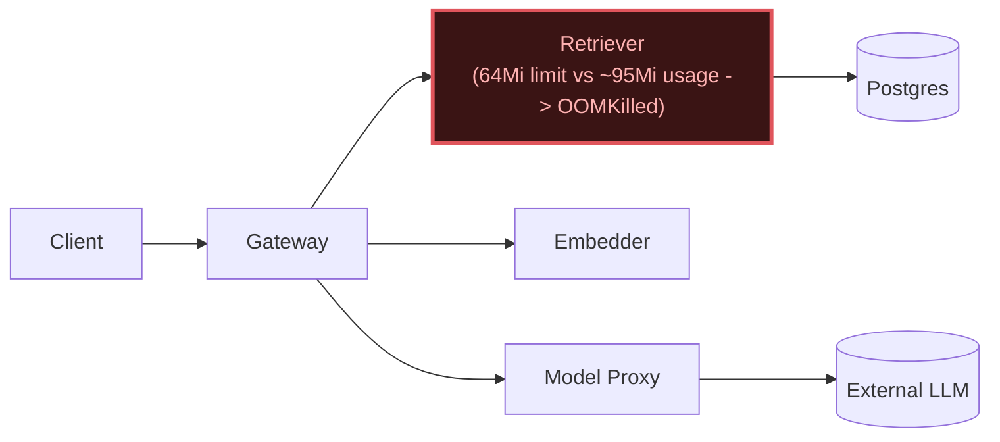

# Postmortem: subject/retriever-7b8cbbdbf5-79qbh container retriever was OOMKilled within the last 10 minutes - check its memory limit against the working-set graph

- **Status:** resolved
- **Severity:** sev1
- **Verified:** no
- **Opened:** 2026-08-12 19:13:54Z
- **Resolved:** 2026-08-12 19:13:54Z

## Timeline (machine-generated)

All times UTC on 2026-08-12 unless a full date is shown.

| Time (UTC) | Source | Event |
| --- | --- | --- |
| 19:03:56Z | log-spike | log-spike onset: name=retriever-7b8cbbdbf5-pkjmd kind=Pod objectAPIversion=v1 objectRV=2501455 eventRV=2502024 reportinginstance=k3d-obs-lab-agent-0 reportingcontroller=kubelet sourcecomponent=kubelet sourcehost=k3d-obs-lab-agent-0 reason=… |
| 19:08:20Z | alert | alert resolved: KubeContainerOOMKilled |
| 19:12:20Z | alert | alert firing: KubeContainerOOMKilled |
| 19:14:18Z | k8s | Pod/retriever-78b9dd9fd6-4vdfp: BackOff |
| 19:14:20Z | k8s | Pod/retriever-7b8cbbdbf5-5j7tl: BackOff |
| 19:14:20Z | k8s | Pod/retriever-78b9dd9fd6-fq888: Started |
| 19:14:20Z | k8s | Pod/retriever-78b9dd9fd6-fq888: Pulled |
| 19:14:20Z | k8s | Pod/retriever-78b9dd9fd6-fq888: Created |
| 19:14:21Z | k8s | Pod/retriever-7b8cbbdbf5-5j7tl: BackOff |
| 19:14:21Z | k8s | Pod/retriever-78b9dd9fd6-jwdfg: Started |
| 19:14:21Z | k8s | Pod/retriever-78b9dd9fd6-jwdfg: Pulled |
| 19:14:21Z | k8s | Pod/retriever-78b9dd9fd6-jwdfg: Created |
| 19:14:22Z | k8s | Pod/retriever-7b8cbbdbf5-5j7tl: BackOff |
| 19:14:22Z | k8s | Pod/retriever-78b9dd9fd6-jwdfg: BackOff |
| 19:14:22Z | k8s | Pod/retriever-78b9dd9fd6-fq888: BackOff |
| 19:14:23Z | k8s | Pod/retriever-78b9dd9fd6-jwdfg: BackOff |
| 19:14:23Z | k8s | Pod/retriever-78b9dd9fd6-fq888: BackOff |
| 19:14:25Z | k8s | Pod/retriever-7b8cbbdbf5-lwh2b: Started |
| 19:14:25Z | k8s | Pod/retriever-7b8cbbdbf5-lwh2b: Pulled |
| 19:14:25Z | k8s | Pod/retriever-7b8cbbdbf5-lwh2b: Created |
| 19:14:26Z | k8s | Pod/retriever-7b8cbbdbf5-lwh2b: BackOff |
| 19:14:27Z | k8s | Pod/retriever-7b8cbbdbf5-lwh2b: BackOff |
| 19:14:30Z | k8s | Pod/retriever-7b8cbbdbf5-lwh2b: BackOff |
| 19:14:30Z | k8s | Pod/retriever-78b9dd9fd6-jwdfg: BackOff |
| 19:14:30Z | k8s | Pod/retriever-78b9dd9fd6-fq888: BackOff |
| 19:14:56Z | k8s | Pod/retriever-7b8cbbdbf5-79qbh: BackOff |
| 19:15:03Z | k8s | Pod/retriever-7b8cbbdbf5-5j7tl: Started |
| 19:15:03Z | k8s | Pod/retriever-7b8cbbdbf5-5j7tl: Pulled |
| 19:15:03Z | k8s | Pod/retriever-7b8cbbdbf5-5j7tl: Created |
| 19:15:04Z | k8s | Pod/retriever-7b8cbbdbf5-5j7tl: BackOff |
| 19:15:04Z | k8s | Pod/retriever-78b9dd9fd6-fq888: Started |
| 19:15:04Z | k8s | Pod/retriever-78b9dd9fd6-fq888: Pulled |
| 19:15:04Z | k8s | Pod/retriever-78b9dd9fd6-fq888: Created |
| 19:15:05Z | k8s | Pod/retriever-78b9dd9fd6-fq888: BackOff |
| 19:15:05Z | k8s | Pod/retriever-78b9dd9fd6-jwdfg: Started |
| 19:15:05Z | k8s | Pod/retriever-78b9dd9fd6-jwdfg: Pulled |
| 19:15:05Z | k8s | Pod/retriever-78b9dd9fd6-jwdfg: Created |
| 19:15:05Z | k8s | Pod/retriever-78b9dd9fd6-4vdfp: Started |
| 19:15:05Z | k8s | Pod/retriever-78b9dd9fd6-4vdfp: Pulled |
| 19:15:05Z | k8s | Pod/retriever-78b9dd9fd6-4vdfp: Created |
| 19:15:06Z | k8s | Pod/retriever-78b9dd9fd6-fq888: BackOff |
| 19:15:06Z | k8s | Pod/retriever-78b9dd9fd6-4vdfp: BackOff |
| 19:15:07Z | k8s | Pod/retriever-78b9dd9fd6-jwdfg: BackOff |
| 19:15:07Z | k8s | Pod/retriever-78b9dd9fd6-4vdfp: BackOff |
| 19:15:08Z | k8s | Pod/retriever-78b9dd9fd6-jwdfg: BackOff |
| 19:15:09Z | k8s | Pod/retriever-7b8cbbdbf5-5j7tl: BackOff |
| 19:15:10Z | k8s | Pod/retriever-7b8cbbdbf5-5j7tl: BackOff |
| 19:15:10Z | k8s | Pod/retriever-78b9dd9fd6-jwdfg: BackOff |
| 19:15:10Z | k8s | Pod/retriever-78b9dd9fd6-fq888: BackOff |
| 19:15:10Z | k8s | Pod/retriever-78b9dd9fd6-4vdfp: BackOff |
| 19:15:18Z | k8s | Pod/retriever-7b8cbbdbf5-lwh2b: Started |
| 19:15:18Z | k8s | Pod/retriever-7b8cbbdbf5-lwh2b: Pulled |
| 19:15:18Z | k8s | Pod/retriever-7b8cbbdbf5-lwh2b: Created |
| 19:15:19Z | k8s | Pod/retriever-7b8cbbdbf5-lwh2b: BackOff |
| 19:15:20Z | k8s | Pod/retriever-7b8cbbdbf5-lwh2b: BackOff |
| 19:15:21Z | k8s | Pod/retriever-7b8cbbdbf5-lwh2b: BackOff |
| 19:16:01Z | k8s | Pod/retriever-7b8cbbdbf5-79qbh: BackOff |
| 19:16:04Z | k8s | Pod/retriever-7b8cbbdbf5-79qbh: Started |
| 19:16:04Z | k8s | Pod/retriever-7b8cbbdbf5-79qbh: Pulled |
| 19:16:04Z | k8s | Pod/retriever-7b8cbbdbf5-79qbh: Created |
| 19:16:06Z | k8s | Pod/retriever-7b8cbbdbf5-79qbh: BackOff |
| 19:16:07Z | k8s | Pod/retriever-7b8cbbdbf5-79qbh: BackOff |
| 19:16:08Z | k8s | Pod/retriever-7b8cbbdbf5-79qbh: BackOff |
| 19:16:22Z | k8s | Pod/retriever-78b9dd9fd6-4vdfp: BackOff |
| 19:16:28Z | k8s | Pod/retriever-78b9dd9fd6-jwdfg: Started |
| 19:16:28Z | k8s | Pod/retriever-78b9dd9fd6-jwdfg: Pulled |
| 19:16:28Z | k8s | Pod/retriever-78b9dd9fd6-jwdfg: Created |
| 19:16:28Z | k8s | Pod/retriever-78b9dd9fd6-4vdfp: Started |
| 19:16:28Z | k8s | Pod/retriever-78b9dd9fd6-4vdfp: Pulled |
| 19:16:28Z | k8s | Pod/retriever-78b9dd9fd6-4vdfp: Created |
| 19:16:29Z | k8s | Pod/retriever-78b9dd9fd6-4vdfp: BackOff |
| 19:16:30Z | k8s | Pod/retriever-78b9dd9fd6-jwdfg: BackOff |
| 19:16:30Z | k8s | Pod/retriever-78b9dd9fd6-4vdfp: BackOff |
| 19:16:30Z | k8s | Pod/retriever-7b8cbbdbf5-5j7tl: Started |
| 19:16:30Z | k8s | Pod/retriever-7b8cbbdbf5-5j7tl: Pulled |
| 19:16:30Z | k8s | Pod/retriever-7b8cbbdbf5-5j7tl: Created |
| 19:16:31Z | k8s | Pod/retriever-7b8cbbdbf5-5j7tl: BackOff |
| 19:16:31Z | k8s | Pod/retriever-78b9dd9fd6-jwdfg: BackOff |
| 19:16:31Z | k8s | Pod/retriever-78b9dd9fd6-4vdfp: BackOff |
| 19:16:32Z | k8s | Pod/retriever-7b8cbbdbf5-5j7tl: BackOff |
| 19:16:32Z | k8s | Pod/retriever-78b9dd9fd6-jwdfg: BackOff |
| 19:16:34Z | k8s | Pod/retriever-7b8cbbdbf5-5j7tl: BackOff |
| 19:16:37Z | k8s | Pod/retriever-78b9dd9fd6-4vdfp: BackOff |
| 19:16:40Z | k8s | Pod/retriever-7b8cbbdbf5-5j7tl: BackOff |
| 19:16:40Z | k8s | Pod/retriever-78b9dd9fd6-fq888: Started |
| 19:16:40Z | k8s | Pod/retriever-78b9dd9fd6-fq888: Pulled |
| 19:16:40Z | k8s | Pod/retriever-78b9dd9fd6-fq888: Created |
| 19:16:41Z | k8s | Pod/retriever-78b9dd9fd6-fq888: BackOff |
| 19:16:45Z | k8s | Pod/retriever-7b8cbbdbf5-lwh2b: Started |
| 19:16:45Z | k8s | Pod/retriever-7b8cbbdbf5-lwh2b: Pulled |
| 19:16:45Z | k8s | Pod/retriever-7b8cbbdbf5-lwh2b: Created |
| 19:16:46Z | k8s | Pod/retriever-78b9dd9fd6-fq888: BackOff |
| 19:16:47Z | k8s | Pod/retriever-7b8cbbdbf5-lwh2b: BackOff |
| 19:16:48Z | k8s | Pod/retriever-7b8cbbdbf5-lwh2b: BackOff |
| 19:16:50Z | k8s | Pod/retriever-7b8cbbdbf5-lwh2b: BackOff |
| 19:16:50Z | k8s | Pod/retriever-78b9dd9fd6-fq888: BackOff |
| 19:17:25Z | k8s | Pod/retriever-7b8cbbdbf5-79qbh: BackOff |
| 19:17:46Z | k8s | Pod/retriever-78b9dd9fd6-jwdfg: BackOff |
| 19:17:50Z | k8s | Pod/retriever-78b9dd9fd6-4vdfp: BackOff |
| 19:17:52Z | k8s | Pod/retriever-7b8cbbdbf5-lwh2b: BackOff |
| 19:17:55Z | k8s | Pod/retriever-78b9dd9fd6-fq888: BackOff |
| 19:18:06Z | k8s | Pod/retriever-7b8cbbdbf5-5j7tl: BackOff |
| 19:18:46Z | k8s | Pod/retriever-7b8cbbdbf5-79qbh: BackOff |

## Evidence links

- [Loki — logs over the incident window](http://localhost:3001/explore?schemaVersion=1&panes=%7B%22pm%22%3A+%7B%22datasource%22%3A+%22loki%22%2C+%22queries%22%3A+%5B%7B%22refId%22%3A+%22A%22%2C+%22datasource%22%3A+%7B%22type%22%3A+%22loki%22%2C+%22uid%22%3A+%22loki%22%7D%2C+%22expr%22%3A+%22%7Bnamespace%3D%5C%22subject%5C%22%7D+%7C~+%5C%22%28%3Fi%29error%7Cfailed%5C%22%22%7D%5D%2C+%22range%22%3A+%7B%22from%22%3A+%221786562034961%22%2C+%22to%22%3A+%221786562034976%22%7D%7D%7D&orgId=1)
- [Mimir — metrics over the incident window](http://localhost:3001/explore?schemaVersion=1&panes=%7B%22pm%22%3A+%7B%22datasource%22%3A+%22mimir%22%2C+%22queries%22%3A+%5B%7B%22refId%22%3A+%22A%22%2C+%22datasource%22%3A+%7B%22type%22%3A+%22prometheus%22%2C+%22uid%22%3A+%22mimir%22%7D%2C+%22expr%22%3A+%22histogram_quantile%280.95%2C+sum%28rate%28http_server_duration_milliseconds_bucket%5B5m%5D%29%29+by+%28le%29%29%22%7D%5D%2C+%22range%22%3A+%7B%22from%22%3A+%221786562034961%22%2C+%22to%22%3A+%221786562034976%22%7D%7D%7D&orgId=1)

## Investigation context

**Runbook match:** none — no tool narrowing applied for this alert. Available runbooks: README.md, canary-abort.md, ci-pipeline-red.md, dq-freshness-stall.md, gateway-high-error-rate.md, k8s-crashloop.md, k8s-node-failure.md, snapshot-agent-audit.md, stale-secret.md

Pre-check battery (as injected at run start)

## Pre-check leads

### recent_deploys — LEAD
2 deploy-window leads
- argo app platform: sync=OutOfSync health=Healthy (revision c025382ba170)
- argo app retriever: sync=OutOfSync health=Progressing (revision c025382ba170)

### kube_scan — LEAD
20 kube-scan leads
- pod retriever-78b9dd9fd6-4vdfp: CrashLoopBackOff
- pod retriever-78b9dd9fd6-jwdfg: CrashLoopBackOff
- pod retriever-7b8cbbdbf5-5j7tl: CrashLoopBackOff
- pod retriever-7b8cbbdbf5-79qbh: CrashLoopBackOff
- pod retriever-7b8cbbdbf5-lwh2b: CrashLoopBackOff
- event Pod/retriever-7b8cbbdbf5-5j7tl: BackOff — Back-off restarting failed container retriever in pod retriever-7b8cbbdbf5-5j7tl_subject(c4e0a2d7-10fb-4fb5-9646-cdc2e9052ced) (at 21:13:45)
- event Pod/retriever-78b9dd9fd6-fq888: BackOff — Back-off restarting failed container retriever in pod retriever-78b9dd9fd6-fq888_subject(d6412e68-6faa-4f37-ac46-ad589f8ca09f) (at 21:13:45)
- event Pod/retriever-7b8cbbdbf5-lwh2b: BackOff — Back-off restarting failed container retriever in pod retriever-7b8cbbdbf
… (section truncated)

### log_spike — LEAD
error/failed log rate 91/10min vs baseline 0/10min (91x baseline) — onset: name=retriever-7b8cbbdbf5-pkjmd kind=Pod objectAPIversion=v1 objectRV=2501455 eventRV=2502024 reportinginstance=k3d-obs-lab-agent-0 reportingcontroller=kubelet sourcecomponent=kubelet sourcehost=k3d-obs-lab-agent-0 reason=BackOff type=Warning count=14 msg="Back-off restarting failed container retriever in pod retriever-7b8cbbdbf5-pkjmd_subject(da7ecec5-0e82-4745-b2ed-9afb31343b13)"  at 2026-08-12T19:03:56+00:00
- error/failed log rate 91/10min vs baseline 0/10min (91x baseline) — onset: name=retriever-7b8cbbdbf5-pkjmd kind=Pod objectAPIversion=v1 objectRV=2501455 eventRV=2502024 reportinginstance=… (truncated)

### attribution — LEAD
No service or dependency edge above 1% errors or 1s p95 in the last 10m (highest: gateway 0.0%) — whatever paged us is not a broad service-level failure. Look for something too narrow to move a service-wide number (one route, one tenant, one pod) or something that is not request-shaped at all (a stuck rollout, a pipeline, a credential).
- No service or dependency edge above 1% errors or 1s p95 in the last 10m (highest: gateway 0.0%) — whatever paged us is not a broad service-level failure. Look for something too narrow to… (truncated)

### rollout_state — OK
gateway and model-proxy rollouts stable, no failed analysis

### secret_age — OK
Secret subject-db-credentials last modified 18d 19h ago (created 18d 19h ago).

## Narrative

## Summary
`KubeContainerOOMKilled` fired for `subject/retriever`. All 5+ retriever pods across two ReplicaSets (`retriever-7b8cbbdbf5-*`, `retriever-78b9dd9fd6-*`) are stuck in `CrashLoopBackOff`, repeatedly OOMKilled (exit code 137) within seconds of starting. One older pod (`retriever-d6d55bf7f-b9dqs`) remains up and serving.

## Impact
Retriever capacity is down to a single healthy replica against a desired 5; RAG-backed requests that land on the crash-looping replicas fail via readiness/liveness probe failures. The `attribution` pre-check correctly noted no service-wide error/latency edge moved — this is narrow (retriever pod availability), not a broad request-path failure, which matches: gateway keeps routing around the down replicas but capacity is thin.

## Root cause
The `retriever` container's memory **limit is set to 64Mi (request 48Mi)**, while its real steady-state working set runs **~90–95Mi** — confirmed directly from `container_memory_working_set_bytes{namespace="subject",pod=~"retriever-.*",container="retriever"}` over the incident window (flat ~94–95Mi for over an hour, ticking up to ~99Mi right before the kill). `kubectl describe pod retriever-7b8cbbdbf5-79qbh` shows `Last State: Terminated, Reason: OOMKilled, Exit Code: 137` under `Limits: memory: 64Mi`. This is a plain resource-limit misconfiguration, not a code fault:
- No error/exception lines in the retriever log stream (`{namespace="subject",pod=~"retriever-.*"} |= "error"` returned zero lines) — consistent with a hard SIGKILL from the kernel OOM killer, not an application-level failure.
- `deploy_history` for `retriever` shows no deploy anywhere near the alert onset — the last retriever rollout (gitops revision `c025382ba170`) landed 2026-08-07, five days before the page, and had been running fine at the same ~90Mi footprint the whole time. The `k8s-crashloop.md` runbook's "rollback a bad revision" branch does not apply here — there is no recent revision to blame, so a rollback was correctly ruled out per the runbook's own guidance ("do not guess at a fix without a revision diff").
- Argo shows `retriever` `OutOfSync`/`Progressing` only because the Deployment is actively churning ReplicaSets from the crashloop itself, not because of an unsynced code change.

## What fixed it
**Nothing yet — the incident is still open.** Diagnosis pointed clearly at the undersized memory limit, so I dry-ran `patch_memory_limit(retriever, 256Mi)` (diff `limits.memory: 64Mi -> 256Mi`), got explicit operator approval twice, and attempted the real patch three times (fresh dry-run + approval each time). All three attempts failed identically server-side: `The Deployment "retriever" is invalid: spec.template.spec.containers[0].image: Required value` — even though the live Deployment has a perfectly valid `image` field (`obs-registry:5010/retriever:10f24bc`, confirmed via `kubectl describe deployment`). This looks like a bug in the patch tool's merge payload for this Deployment's current state, not a real API/image problem, and it did not resolve on retry. Re-querying `alert_status` afterward shows the alert still `active` (firing count climbed from 2 to 6 during the incident) and `kubectl get pods -l app=retriever` still shows six pods in `CrashLoopBackOff`. I am not claiming a fix that didn't happen.

## Lessons
1. Root cause and remediation choice were right (limit too tight for real usage, no deploy to roll back), but the automated fix path has a real defect: `patch_memory_limit` cannot currently apply to `retriever` in its present state — needs engineering follow-up on the tool/API-server interaction (possibly a stale/partial container list in the patch merge payload) before it can be trusted for this workload.
2. Until the tool is fixed, the correct manual follow-up is to bump `resources.limits.memory` for `retriever` to ~256Mi in the gitops manifest and let Argo sync it, then verify via `alert_status` and `kubectl get pods`.
3. No runbook matched `KubeContainerOOMKilled` directly — `k8s-crashloop.md` was close enough for the crashloop symptom but doesn't mention checking `container_memory_working_set_bytes` against the configured limit. Worth authoring a dedicated OOMKilled runbook that leads with that comparison plus the "no recent deploy → don't rollback, check limits" branch, since a rollback would have failed to help here just as the memory patch attempt failed to execute.
4. This incident is a good example of "attribution shows no service-wide signal" correctly steering the investigation toward a narrow, pod-level cause rather than chasing a request-path regression that doesn't exist.

## Delivery path

