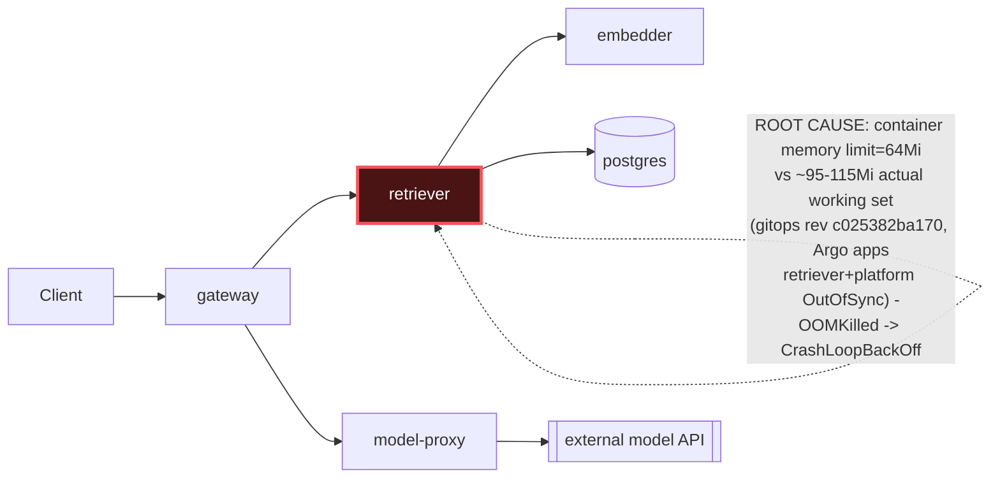

# Postmortem: subject/retriever-7b8cbbdbf5-x4xvq container retriever was OOMKilled within the last 10 minutes - check its memory limit against the working-set graph

- **Status:** resolved
- **Severity:** sev1
- **Verified:** no
- **Opened:** 2026-08-12 19:13:54Z
- **Resolved:** 2026-08-12 19:18:54Z

## Timeline (machine-generated)

All times UTC on 2026-08-12 unless a full date is shown.

| Time (UTC) | Source | Event |
| --- | --- | --- |
| 19:03:56Z | log-spike | log-spike onset: name=retriever-7b8cbbdbf5-pkjmd kind=Pod objectAPIversion=v1 objectRV=2501455 eventRV=2502024 reportinginstance=k3d-obs-lab-agent-0 reportingcontroller=kubelet sourcecomponent=kubelet sourcehost=k3d-obs-lab-agent-0 reason=… |
| 19:12:20Z | alert | alert firing: KubeContainerOOMKilled |
| 19:12:20Z | alert | alert resolved: KubeContainerOOMKilled |
| 19:15:20Z | alert | alert firing: KubeContainerOOMKilled |
| 19:16:31Z | k8s | Pod/retriever-78b9dd9fd6-jwdfg: BackOff |
| 19:16:31Z | k8s | Pod/retriever-78b9dd9fd6-4vdfp: BackOff |
| 19:16:32Z | k8s | Pod/retriever-7b8cbbdbf5-5j7tl: BackOff |
| 19:16:32Z | k8s | Pod/retriever-78b9dd9fd6-jwdfg: BackOff |
| 19:16:34Z | k8s | Pod/retriever-7b8cbbdbf5-5j7tl: BackOff |
| 19:16:37Z | k8s | Pod/retriever-78b9dd9fd6-4vdfp: BackOff |
| 19:16:40Z | k8s | Pod/retriever-7b8cbbdbf5-5j7tl: BackOff |
| 19:16:40Z | k8s | Pod/retriever-78b9dd9fd6-fq888: Started |
| 19:16:40Z | k8s | Pod/retriever-78b9dd9fd6-fq888: Pulled |
| 19:16:40Z | k8s | Pod/retriever-78b9dd9fd6-fq888: Created |
| 19:16:41Z | k8s | Pod/retriever-78b9dd9fd6-fq888: BackOff |
| 19:16:45Z | k8s | Pod/retriever-7b8cbbdbf5-lwh2b: Started |
| 19:16:45Z | k8s | Pod/retriever-7b8cbbdbf5-lwh2b: Pulled |
| 19:16:45Z | k8s | Pod/retriever-7b8cbbdbf5-lwh2b: Created |
| 19:16:46Z | k8s | Pod/retriever-78b9dd9fd6-fq888: BackOff |
| 19:16:47Z | k8s | Pod/retriever-7b8cbbdbf5-lwh2b: BackOff |
| 19:16:48Z | k8s | Pod/retriever-7b8cbbdbf5-lwh2b: BackOff |
| 19:16:50Z | k8s | Pod/retriever-7b8cbbdbf5-lwh2b: BackOff |
| 19:16:50Z | k8s | Pod/retriever-78b9dd9fd6-fq888: BackOff |
| 19:17:25Z | k8s | Pod/retriever-7b8cbbdbf5-79qbh: BackOff |
| 19:17:46Z | k8s | Pod/retriever-78b9dd9fd6-jwdfg: BackOff |
| 19:17:50Z | k8s | Pod/retriever-78b9dd9fd6-4vdfp: BackOff |
| 19:17:52Z | k8s | Pod/retriever-7b8cbbdbf5-lwh2b: BackOff |
| 19:17:55Z | k8s | Pod/retriever-78b9dd9fd6-fq888: BackOff |
| 19:17:56Z | remediation | rollout_undo retriever executed (run run_19ff7653d476d8) |
| 19:18:06Z | k8s | Pod/retriever-7b8cbbdbf5-5j7tl: BackOff |
| 19:18:46Z | k8s | Pod/retriever-7b8cbbdbf5-79qbh: BackOff |
| 19:18:59Z | k8s | Pod/retriever-78b9dd9fd6-jwdfg: BackOff |
| 19:19:03Z | k8s | Pod/retriever-78b9dd9fd6-fq888: BackOff |
| 19:19:05Z | k8s | Pod/retriever-7b8cbbdbf5-lwh2b: BackOff |
| 19:19:10Z | k8s | Pod/retriever-78b9dd9fd6-jwdfg: Started |
| 19:19:10Z | k8s | Pod/retriever-78b9dd9fd6-jwdfg: Pulled |
| 19:19:10Z | k8s | Pod/retriever-78b9dd9fd6-jwdfg: Created |
| 19:19:11Z | k8s | Pod/retriever-78b9dd9fd6-jwdfg: BackOff |
| 19:19:12Z | k8s | Pod/retriever-78b9dd9fd6-jwdfg: BackOff |
| 19:19:13Z | k8s | Pod/retriever-7b8cbbdbf5-5j7tl: Started |
| 19:19:13Z | k8s | Pod/retriever-7b8cbbdbf5-5j7tl: Pulled |
| 19:19:13Z | k8s | Pod/retriever-7b8cbbdbf5-5j7tl: Created |
| 19:19:14Z | k8s | Pod/retriever-7b8cbbdbf5-5j7tl: BackOff |
| 19:19:14Z | k8s | Pod/retriever-78b9dd9fd6-4vdfp: Started |
| 19:19:14Z | k8s | Pod/retriever-78b9dd9fd6-4vdfp: Pulled |
| 19:19:14Z | k8s | Pod/retriever-78b9dd9fd6-4vdfp: Created |
| 19:19:15Z | k8s | Pod/retriever-7b8cbbdbf5-5j7tl: BackOff |
| 19:19:15Z | k8s | Pod/retriever-78b9dd9fd6-4vdfp: BackOff |
| 19:19:16Z | k8s | Pod/retriever-78b9dd9fd6-4vdfp: BackOff |
| 19:19:17Z | k8s | Pod/retriever-78b9dd9fd6-4vdfp: BackOff |
| 19:19:20Z | k8s | Pod/retriever-7b8cbbdbf5-5j7tl: BackOff |
| 19:19:20Z | k8s | Pod/retriever-78b9dd9fd6-jwdfg: BackOff |
| 19:19:29Z | k8s | Pod/retriever-78b9dd9fd6-fq888: Started |
| 19:19:29Z | k8s | Pod/retriever-78b9dd9fd6-fq888: Pulled |
| 19:19:29Z | k8s | Pod/retriever-78b9dd9fd6-fq888: Created |
| 19:19:31Z | k8s | Pod/retriever-78b9dd9fd6-fq888: BackOff |
| 19:19:32Z | k8s | Pod/retriever-78b9dd9fd6-fq888: BackOff |
| 19:19:36Z | k8s | Pod/retriever-7b8cbbdbf5-lwh2b: Started |
| 19:19:36Z | k8s | Pod/retriever-7b8cbbdbf5-lwh2b: Pulled |
| 19:19:36Z | k8s | Pod/retriever-7b8cbbdbf5-lwh2b: Created |
| 19:19:37Z | k8s | Pod/retriever-7b8cbbdbf5-lwh2b: BackOff |
| 19:19:38Z | k8s | Pod/retriever-7b8cbbdbf5-lwh2b: BackOff |
| 19:19:40Z | k8s | Pod/retriever-7b8cbbdbf5-lwh2b: BackOff |
| 19:19:40Z | k8s | Pod/retriever-78b9dd9fd6-fq888: BackOff |
| 19:19:52Z | k8s | Pod/retriever-7b8cbbdbf5-79qbh: BackOff |
| 19:19:53Z | k8s | ReplicaSet/retriever-d6d55bf7f: SuccessfulDelete |
| 19:19:53Z | k8s | ReplicaSet/retriever-d6d55bf7f: SuccessfulCreate |
| 19:19:53Z | k8s | ReplicaSet/retriever-7b8cbbdbf5: SuccessfulDelete |
| 19:19:53Z | k8s | ReplicaSet/retriever-78b9dd9fd6: SuccessfulDelete |
| 19:19:53Z | k8s | Deployment/retriever: ScalingReplicaSet |
| 19:19:53Z | k8s | Pod/retriever-d6d55bf7f-nlxbb: Scheduled |
| 19:19:53Z | k8s | Pod/retriever-d6d55bf7f-2rrbb: Scheduled |
| 19:19:53Z | k8s | Pod/retriever-d6d55bf7f-mvgtn: Scheduled |
| 19:19:54Z | k8s | ReplicaSet/retriever-7b8cbbdbf5: SuccessfulDelete |
| 19:19:54Z | k8s | ReplicaSet/retriever-78b9dd9fd6: SuccessfulCreate |
| 19:19:54Z | k8s | Pod/retriever-78b9dd9fd6-5rlkd: Scheduled |
| 19:19:55Z | k8s | Pod/retriever-78b9dd9fd6-5rlkd: Started |
| 19:19:55Z | k8s | Pod/retriever-78b9dd9fd6-5rlkd: Pulled |
| 19:19:55Z | k8s | Pod/retriever-78b9dd9fd6-5rlkd: Created |
| 19:19:57Z | k8s | Pod/retriever-78b9dd9fd6-5rlkd: Started |
| 19:19:57Z | k8s | Pod/retriever-78b9dd9fd6-5rlkd: Pulled |
| 19:19:57Z | k8s | Pod/retriever-78b9dd9fd6-5rlkd: Created |
| 19:19:58Z | k8s | Pod/retriever-78b9dd9fd6-5rlkd: BackOff |
| 19:19:59Z | k8s | Pod/retriever-78b9dd9fd6-5rlkd: BackOff |
| 19:20:01Z | k8s | Pod/retriever-78b9dd9fd6-5rlkd: BackOff |
| 19:20:05Z | k8s | Pod/retriever-78b9dd9fd6-5rlkd: BackOff |
| 19:20:10Z | k8s | Pod/retriever-78b9dd9fd6-5rlkd: Started |
| 19:20:10Z | k8s | Pod/retriever-78b9dd9fd6-5rlkd: Pulled |
| 19:20:10Z | k8s | Pod/retriever-78b9dd9fd6-5rlkd: Created |
| 19:20:11Z | k8s | Pod/retriever-78b9dd9fd6-5rlkd: BackOff |
| 19:20:15Z | k8s | Pod/retriever-78b9dd9fd6-5rlkd: BackOff |
| 19:20:16Z | k8s | Pod/retriever-78b9dd9fd6-5rlkd: BackOff |
| 19:20:33Z | k8s | Pod/retriever-78b9dd9fd6-5rlkd: Started |
| 19:20:33Z | k8s | Pod/retriever-78b9dd9fd6-5rlkd: Pulled |
| 19:20:33Z | k8s | Pod/retriever-78b9dd9fd6-5rlkd: Created |
| 19:20:34Z | k8s | Pod/retriever-78b9dd9fd6-5rlkd: BackOff |
| 19:20:35Z | k8s | Pod/retriever-78b9dd9fd6-5rlkd: BackOff |
| 19:20:36Z | k8s | Pod/retriever-78b9dd9fd6-5rlkd: BackOff |

## Evidence links

- [Loki — logs over the incident window](http://localhost:3001/explore?schemaVersion=1&panes=%7B%22pm%22%3A+%7B%22datasource%22%3A+%22loki%22%2C+%22queries%22%3A+%5B%7B%22refId%22%3A+%22A%22%2C+%22datasource%22%3A+%7B%22type%22%3A+%22loki%22%2C+%22uid%22%3A+%22loki%22%7D%2C+%22expr%22%3A+%22%7Bnamespace%3D%5C%22subject%5C%22%7D+%7C~+%5C%22%28%3Fi%29error%7Cfailed%5C%22%22%7D%5D%2C+%22range%22%3A+%7B%22from%22%3A+%221786562034982%22%2C+%22to%22%3A+%221786562334971%22%7D%7D%7D&orgId=1)
- [Mimir — metrics over the incident window](http://localhost:3001/explore?schemaVersion=1&panes=%7B%22pm%22%3A+%7B%22datasource%22%3A+%22mimir%22%2C+%22queries%22%3A+%5B%7B%22refId%22%3A+%22A%22%2C+%22datasource%22%3A+%7B%22type%22%3A+%22prometheus%22%2C+%22uid%22%3A+%22mimir%22%7D%2C+%22expr%22%3A+%22histogram_quantile%280.95%2C+sum%28rate%28http_server_duration_milliseconds_bucket%5B5m%5D%29%29+by+%28le%29%29%22%7D%5D%2C+%22range%22%3A+%7B%22from%22%3A+%221786562034982%22%2C+%22to%22%3A+%221786562334971%22%7D%7D%7D&orgId=1)

## Investigation context

**Runbook match:** none — no tool narrowing applied for this alert. Available runbooks: README.md, canary-abort.md, ci-pipeline-red.md, dq-freshness-stall.md, gateway-high-error-rate.md, k8s-crashloop.md, k8s-node-failure.md, snapshot-agent-audit.md, stale-secret.md

Pre-check battery (as injected at run start)

## Pre-check leads

### recent_deploys — LEAD
2 deploy-window leads
- argo app platform: sync=OutOfSync health=Healthy (revision c025382ba170)
- argo app retriever: sync=OutOfSync health=Progressing (revision c025382ba170)

### kube_scan — LEAD
20 kube-scan leads
- pod retriever-78b9dd9fd6-4vdfp: CrashLoopBackOff
- pod retriever-78b9dd9fd6-jwdfg: CrashLoopBackOff
- pod retriever-7b8cbbdbf5-5j7tl: CrashLoopBackOff
- pod retriever-7b8cbbdbf5-79qbh: CrashLoopBackOff
- pod retriever-7b8cbbdbf5-lwh2b: CrashLoopBackOff
- event Pod/retriever-7b8cbbdbf5-5j7tl: BackOff — Back-off restarting failed container retriever in pod retriever-7b8cbbdbf5-5j7tl_subject(c4e0a2d7-10fb-4fb5-9646-cdc2e9052ced) (at 21:13:45)
- event Pod/retriever-78b9dd9fd6-fq888: BackOff — Back-off restarting failed container retriever in pod retriever-78b9dd9fd6-fq888_subject(d6412e68-6faa-4f37-ac46-ad589f8ca09f) (at 21:13:45)
- event Pod/retriever-7b8cbbdbf5-lwh2b: BackOff — Back-off restarting failed container retriever in pod retriever-7b8cbbdbf
… (section truncated)

### log_spike — LEAD
error/failed log rate 91/10min vs baseline 0/10min (91x baseline) — onset: name=retriever-7b8cbbdbf5-pkjmd kind=Pod objectAPIversion=v1 objectRV=2501455 eventRV=2502024 reportinginstance=k3d-obs-lab-agent-0 reportingcontroller=kubelet sourcecomponent=kubelet sourcehost=k3d-obs-lab-agent-0 reason=BackOff type=Warning count=14 msg="Back-off restarting failed container retriever in pod retriever-7b8cbbdbf5-pkjmd_subject(da7ecec5-0e82-4745-b2ed-9afb31343b13)"  at 2026-08-12T19:03:56+00:00
- error/failed log rate 91/10min vs baseline 0/10min (91x baseline) — onset: name=retriever-7b8cbbdbf5-pkjmd kind=Pod objectAPIversion=v1 objectRV=2501455 eventRV=2502024 reportinginstance=… (truncated)

### attribution — LEAD
No service or dependency edge above 1% errors or 1s p95 in the last 10m (highest: gateway 0.0%) — whatever paged us is not a broad service-level failure. Look for something too narrow to move a service-wide number (one route, one tenant, one pod) or something that is not request-shaped at all (a stuck rollout, a pipeline, a credential).
- No service or dependency edge above 1% errors or 1s p95 in the last 10m (highest: gateway 0.0%) — whatever paged us is not a broad service-level failure. Look for something too narrow to… (truncated)

### rollout_state — OK
gateway and model-proxy rollouts stable, no failed analysis

### secret_age — OK
Secret subject-db-credentials last modified 18d 19h ago (created 18d 19h ago).

## Narrative

## Summary

`KubeContainerOOMKilled` (sev1) fired for `subject/retriever`. Every retriever pod spun up under the currently-live Deployment spec OOMKills within seconds of starting, driving the pods into `CrashLoopBackOff` and leaving the retriever deployment at 1/5 available.

## Impact

Retriever capacity is reduced to a single surviving pod (`retriever-d6d55bf7f-b9dqs`, an old ReplicaSet that predates the bad spec and hasn't been fully scaled down yet). Six pods across two newer ReplicaSets (`retriever-78b9dd9fd6`, `retriever-7b8cbbdbf5`) are stuck in `CrashLoopBackOff`/OOMKilled (exit 137). Gateway/model-proxy service-level error-rate and p95 stayed under 1% at the time of the page (per the attribution lead), confirming this is capacity/availability degradation on one dependency, not a broad request-path failure — but it is a live reduction in retriever redundancy and a risk of full outage if the last old pod is reaped.

## Root cause

The retriever container's memory **limit** is set to **64Mi** (request 48Mi) in the currently-live Deployment spec — traced to Argo CD app `retriever` (and `platform`), both `OutOfSync` at gitops revision `c025382ba170`, synced 2026-08-07T19:42:11Z. That revision under-provisioned the retriever container by roughly 8x versus its real footprint.

Evidence:
- `kubectl describe pod` on the crash-looping pods shows `Limits: memory: 64Mi`, `Last State: Terminated, Reason: OOMKilled, Exit Code: 137`.
- The one surviving old-generation pod (`retriever-d6d55bf7f-b9dqs`, started 2026-08-07, i.e. from just before/around the same sync) is still running fine with `Limits: memory: 512Mi`, `Requests: memory: 192Mi`, and a live working set of **~115Mi** (`container_memory_working_set_bytes`).
- Multiple other now-terminated retriever pods sampled from Mimir in the hour before the page showed steady-state working sets of **~94-100Mi** — comfortably under 512Mi, but 1.5-2x over 64Mi.
- The image tag (`obs-registry:5010/retriever:10f24bc`) is identical across the healthy 512Mi pod and the crashing 64Mi pods — this is a resource-spec regression, not a code/image regression.
- `k8s_events`/log-spike lead: crash onset traces to a `BackOff` storm starting 19:03:56Z, following a `kubectl.kubernetes.io/restartedAt` rolling restart at 19:01:01Z that recreated pods under the undersized live spec for the first time since the 08-07 sync (the old, correctly-sized pods had simply never been recycled until then).
- No CI/app-repo commit correlates with revision `c025382ba170` (`gitea_compare` 404s against the app repo; `gitea_ci_runs` shows no matching sha) — this is a gitops-manifest-level change, not a code change caught by the app repo's CI/deploy_history.

## What fixed it

**Not fixed — remediation did not converge.** Two remediation paths were dry-run, approved, and executed, neither restored a healthy spec:

1. `patch_memory_limit(retriever, 512Mi)` — dry-run showed the correct diff (`64Mi -> 512Mi`) and was approved, but every real-apply attempt (3 tries, including a control try at 256Mi to rule out a value-specific bug) failed identically with a Kubernetes API validation error: `spec.template.spec.containers[0].image: Required value`. The live Deployment object itself still shows a valid image throughout, so this looks like a defect in the patch's merge payload rather than cluster corruption.
2. `rollout_undo(retriever)` — dry-run reported `revision 24 -> revision 23` (same image tag, implying only a resource change between them), was approved, and executed successfully at the Kubernetes API level (`deployment.apps/retriever rolled back`). But the "previous" revision it landed on was itself another 64Mi-limited revision — created earlier the same day by a prior restart — not the true last-known-good 512Mi spec, which has aged out of the Deployment's revision history. Effect: this **added a second crash-looping ReplicaSet** (`count(CrashLoopBackOff)` rose from ~2 to 6 within a couple minutes of the undo), i.e. it made blast radius worse without fixing anything.

`alert_status` was re-queried after both attempts and remains **active** (firing count climbed from 2 to 6 over the remediation window).

## Lessons

- The real fix has to happen at the gitops source: whatever commit landed in the manifest behind revision `c025382ba170` needs its `resources.limits.memory` corrected back to (at least) 512Mi for the retriever container, then re-synced. Both Argo apps `retriever` and `platform` are already flagged `OutOfSync` at that same revision, which should have been the tip-off to check the manifest diff first — but the app-repo `gitea_compare`/`gitea_ci_runs` tools only cover the source repo, not the gitops repo that actually carries this regression, so the diff itself could not be pulled through available tooling.
- `rollout_undo` is not a safe rollback for a workload that has been restarted multiple times same-day under a bad spec — every revision in its short history can be equally bad, and undo can silently multiply crash-looping ReplicaSets instead of reducing them. Prefer/expect a `--to-revision` style targeted rollback, or fix at the manifest source, over a blind "one step back."
- `patch_memory_limit` needs investigation independent of this incident: it failed identically across two different target values with the same "image: Required value" API error, suggesting its patch payload construction (not the target value) is the defect.
- Add a runbook entry for `KubeContainerOOMKilled` — none matched this alert, and this incident is a good template (compare live vs. historical resource limits by ReplicaSet age, correlate with `argo_app` OutOfSync + revision, treat rollback history as untrustworthy after repeated same-day restarts).
- The last healthy pod (`retriever-d6d55bf7f-b9dqs`) is being organically scaled down by the Deployment controller as it reconciles toward the (still-bad) desired template. Left alone, retriever capacity trends toward zero. This needs human/gitops-level intervention before that pod is reaped.

