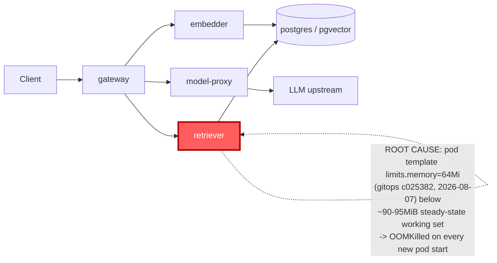

# Postmortem: subject/retriever-78b9dd9fd6-9tdxz container retriever was OOMKilled within the last 10 minutes - check its memory limit against the working-set graph

- **Status:** resolved
- **Severity:** sev1
- **Verified:** no
- **Opened:** 2026-08-12 18:53:55Z
- **Resolved:** 2026-08-12 18:58:55Z

## Timeline (machine-generated)

All times UTC on 2026-08-12 unless a full date is shown.

| Time (UTC) | Source | Event |
| --- | --- | --- |
| 18:51:24Z | log-spike | log-spike onset: error: Malformed JSON in request body |
| 18:53:14Z | k8s | Pod/retriever-78b9dd9fd6-pz8qd: Started |
| 18:53:14Z | k8s | Pod/retriever-78b9dd9fd6-pz8qd: Pulled |
| 18:53:16Z | k8s | Pod/retriever-78b9dd9fd6-pz8qd: BackOff |
| 18:53:17Z | k8s | Pod/retriever-78b9dd9fd6-pz8qd: BackOff |
| 18:53:20Z | alert | alert firing: KubeContainerOOMKilled |
| 18:53:20Z | alert | alert resolved: KubeContainerOOMKilled |
| 18:53:20Z | k8s | Pod/retriever-78b9dd9fd6-pz8qd: BackOff |
| 18:54:21Z | k8s | Pod/retriever-78b9dd9fd6-pz8qd: BackOff |
| 18:54:23Z | k8s | Pod/retriever-78b9dd9fd6-lqkqd: Started |
| 18:54:23Z | k8s | Pod/retriever-78b9dd9fd6-lqkqd: Pulled |
| 18:54:23Z | k8s | Pod/retriever-78b9dd9fd6-lqkqd: Created |
| 18:54:23Z | k8s | Pod/retriever-78b9dd9fd6-9tdxz: Started |
| 18:54:23Z | k8s | Pod/retriever-78b9dd9fd6-9tdxz: Pulled |
| 18:54:23Z | k8s | Pod/retriever-78b9dd9fd6-9tdxz: Created |
| 18:54:25Z | k8s | Pod/retriever-78b9dd9fd6-lqkqd: BackOff |
| 18:54:25Z | k8s | Pod/retriever-78b9dd9fd6-9tdxz: BackOff |
| 18:54:26Z | k8s | Pod/retriever-78b9dd9fd6-9tdxz: BackOff |
| 18:54:28Z | k8s | Pod/retriever-78b9dd9fd6-lqkqd: BackOff |
| 18:54:28Z | k8s | Pod/retriever-78b9dd9fd6-9tdxz: BackOff |
| 18:54:41Z | k8s | Pod/retriever-78b9dd9fd6-pz8qd: Started |
| 18:54:41Z | k8s | Pod/retriever-78b9dd9fd6-pz8qd: Pulled |
| 18:54:41Z | k8s | Pod/retriever-78b9dd9fd6-pz8qd: Created |
| 18:54:43Z | k8s | Pod/retriever-78b9dd9fd6-pz8qd: BackOff |
| 18:54:44Z | k8s | Pod/retriever-78b9dd9fd6-pz8qd: BackOff |
| 18:54:50Z | k8s | Pod/retriever-78b9dd9fd6-pz8qd: BackOff |
| 18:55:33Z | k8s | Pod/retriever-78b9dd9fd6-9tdxz: BackOff |
| 18:55:53Z | k8s | Pod/retriever-78b9dd9fd6-lqkqd: BackOff |
| 18:56:13Z | k8s | Pod/retriever-78b9dd9fd6-pz8qd: BackOff |
| 18:56:57Z | k8s | ReplicaSet/retriever-78b9dd9fd6: SuccessfulDelete |
| 18:56:57Z | k8s | Deployment/retriever: ScalingReplicaSet |
| 18:56:57Z | remediation | rollout_undo retriever executed (run run_19ff752ee549) |
| 18:56:58Z | k8s | ReplicaSet/retriever-d6d55bf7f: SuccessfulCreate |
| 18:56:58Z | k8s | Deployment/retriever: ScalingReplicaSet |
| 18:56:58Z | k8s | Pod/retriever-d6d55bf7f-fbbkp: Scheduled |
| 18:56:58Z | k8s | Pod/retriever-d6d55bf7f-rrsgr: Scheduled |
| 18:56:59Z | k8s | Pod/retriever-d6d55bf7f-rrsgr: Started |
| 18:56:59Z | k8s | Pod/retriever-d6d55bf7f-rrsgr: Pulled |
| 18:56:59Z | k8s | Pod/retriever-d6d55bf7f-rrsgr: Created |
| 18:56:59Z | k8s | Pod/retriever-d6d55bf7f-fbbkp: Started |
| 18:56:59Z | k8s | Pod/retriever-d6d55bf7f-fbbkp: Pulled |
| 18:56:59Z | k8s | Pod/retriever-d6d55bf7f-fbbkp: Created |
| 18:57:06Z | k8s | ReplicaSet/retriever-78b9dd9fd6: SuccessfulDelete |
| 18:57:06Z | k8s | Deployment/retriever: ScalingReplicaSet |
| 18:57:08Z | k8s | Pod/retriever-d6d55bf7f-fbbkp: Killing |
| 18:57:08Z | k8s | ReplicaSet/retriever-d6d55bf7f: SuccessfulDelete |
| 18:57:08Z | k8s | ReplicaSet/retriever-78b9dd9fd6: SuccessfulCreate |
| 18:57:08Z | k8s | Deployment/retriever: ScalingReplicaSet |
| 18:57:08Z | k8s | Pod/retriever-78b9dd9fd6-5dr47: Scheduled |
| 18:57:09Z | k8s | ReplicaSet/retriever-78b9dd9fd6: SuccessfulCreate |
| 18:57:09Z | k8s | Deployment/retriever: ScalingReplicaSet |
| 18:57:09Z | k8s | Pod/retriever-78b9dd9fd6-mwnwt: Scheduled |
| 18:57:10Z | k8s | Pod/retriever-78b9dd9fd6-mwnwt: Started |
| 18:57:10Z | k8s | Pod/retriever-78b9dd9fd6-mwnwt: Pulled |
| 18:57:10Z | k8s | Pod/retriever-78b9dd9fd6-mwnwt: Created |
| 18:57:10Z | k8s | Pod/retriever-78b9dd9fd6-5dr47: Started |
| 18:57:10Z | k8s | Pod/retriever-78b9dd9fd6-5dr47: Pulled |
| 18:57:10Z | k8s | Pod/retriever-78b9dd9fd6-5dr47: Created |
| 18:57:12Z | k8s | Pod/retriever-78b9dd9fd6-5dr47: Started |
| 18:57:12Z | k8s | Pod/retriever-78b9dd9fd6-5dr47: Pulled |
| 18:57:12Z | k8s | Pod/retriever-78b9dd9fd6-5dr47: Created |
| 18:57:13Z | k8s | Pod/retriever-78b9dd9fd6-mwnwt: Pulled |
| 18:57:14Z | k8s | Pod/retriever-78b9dd9fd6-5dr47: BackOff |
| 18:57:14Z | k8s | Pod/retriever-78b9dd9fd6-mwnwt: Started |
| 18:57:14Z | k8s | Pod/retriever-78b9dd9fd6-mwnwt: Created |
| 18:57:15Z | k8s | Pod/retriever-78b9dd9fd6-5dr47: BackOff |
| 18:57:17Z | k8s | Pod/retriever-78b9dd9fd6-mwnwt: BackOff |
| 18:57:19Z | k8s | Pod/retriever-78b9dd9fd6-mwnwt: BackOff |
| 18:57:19Z | k8s | Pod/retriever-78b9dd9fd6-5dr47: BackOff |
| 18:57:25Z | k8s | Pod/retriever-78b9dd9fd6-5dr47: Started |
| 18:57:25Z | k8s | Pod/retriever-78b9dd9fd6-5dr47: Pulled |
| 18:57:25Z | k8s | Pod/retriever-78b9dd9fd6-5dr47: Created |
| 18:57:27Z | k8s | Pod/retriever-78b9dd9fd6-5dr47: BackOff |
| 18:57:28Z | k8s | Pod/retriever-78b9dd9fd6-5dr47: BackOff |
| 18:57:29Z | k8s | Pod/retriever-78b9dd9fd6-5dr47: BackOff |
| 18:57:29Z | k8s | Pod/retriever-78b9dd9fd6-mwnwt: Started |
| 18:57:29Z | k8s | Pod/retriever-78b9dd9fd6-mwnwt: Pulled |
| 18:57:29Z | k8s | Pod/retriever-78b9dd9fd6-mwnwt: Created |
| 18:57:32Z | k8s | Pod/retriever-78b9dd9fd6-mwnwt: BackOff |
| 18:57:39Z | k8s | Pod/retriever-78b9dd9fd6-mwnwt: BackOff |
| 18:57:52Z | k8s | Pod/retriever-78b9dd9fd6-mwnwt: Started |
| 18:57:52Z | k8s | Pod/retriever-78b9dd9fd6-mwnwt: Pulled |
| 18:57:52Z | k8s | Pod/retriever-78b9dd9fd6-mwnwt: Created |
| 18:57:54Z | k8s | Pod/retriever-78b9dd9fd6-mwnwt: BackOff |
| 18:57:54Z | k8s | Pod/retriever-78b9dd9fd6-5dr47: Started |
| 18:57:54Z | k8s | Pod/retriever-78b9dd9fd6-5dr47: Pulled |
| 18:57:54Z | k8s | Pod/retriever-78b9dd9fd6-5dr47: Created |
| 18:57:55Z | k8s | Pod/retriever-78b9dd9fd6-mwnwt: BackOff |
| 18:57:55Z | k8s | Pod/retriever-78b9dd9fd6-5dr47: BackOff |
| 18:57:56Z | k8s | Pod/retriever-78b9dd9fd6-5dr47: BackOff |
| 18:57:59Z | k8s | Pod/retriever-78b9dd9fd6-mwnwt: BackOff |
| 18:57:59Z | k8s | Pod/retriever-78b9dd9fd6-5dr47: BackOff |
| 18:58:17Z | k8s | ReplicaSet/retriever-78b9dd9fd6: SuccessfulDelete |
| 18:58:17Z | k8s | Deployment/retriever: ScalingReplicaSet |
| 18:58:18Z | k8s | ReplicaSet/retriever-d6d55bf7f: SuccessfulCreate |
| 18:58:18Z | k8s | Pod/retriever-d6d55bf7f-frlh9: Scheduled |
| 18:58:19Z | k8s | Pod/retriever-d6d55bf7f-frlh9: Started |
| 18:58:19Z | k8s | Pod/retriever-d6d55bf7f-frlh9: Pulled |
| 18:58:19Z | k8s | Pod/retriever-d6d55bf7f-frlh9: Created |

## Evidence links

- [Loki — logs over the incident window](http://localhost:3001/explore?schemaVersion=1&panes=%7B%22pm%22%3A+%7B%22datasource%22%3A+%22loki%22%2C+%22queries%22%3A+%5B%7B%22refId%22%3A+%22A%22%2C+%22datasource%22%3A+%7B%22type%22%3A+%22loki%22%2C+%22uid%22%3A+%22loki%22%7D%2C+%22expr%22%3A+%22%7Bnamespace%3D%5C%22subject%5C%22%7D+%7C~+%5C%22%28%3Fi%29error%7Cfailed%5C%22%22%7D%5D%2C+%22range%22%3A+%7B%22from%22%3A+%221786560835074%22%2C+%22to%22%3A+%221786561135050%22%7D%7D%7D&orgId=1)
- [Mimir — metrics over the incident window](http://localhost:3001/explore?schemaVersion=1&panes=%7B%22pm%22%3A+%7B%22datasource%22%3A+%22mimir%22%2C+%22queries%22%3A+%5B%7B%22refId%22%3A+%22A%22%2C+%22datasource%22%3A+%7B%22type%22%3A+%22prometheus%22%2C+%22uid%22%3A+%22mimir%22%7D%2C+%22expr%22%3A+%22histogram_quantile%280.95%2C+sum%28rate%28http_server_duration_milliseconds_bucket%5B5m%5D%29%29+by+%28le%29%29%22%7D%5D%2C+%22range%22%3A+%7B%22from%22%3A+%221786560835074%22%2C+%22to%22%3A+%221786561135050%22%7D%7D%7D&orgId=1)

## Investigation context

**Runbook match:** none — no tool narrowing applied for this alert. Available runbooks: README.md, canary-abort.md, ci-pipeline-red.md, dq-freshness-stall.md, gateway-high-error-rate.md, k8s-crashloop.md, k8s-node-failure.md, snapshot-agent-audit.md, stale-secret.md

Pre-check battery (as injected at run start)

## Pre-check leads

### recent_deploys — LEAD
2 deploy-window leads
- argo app platform: sync=OutOfSync health=Healthy (revision c025382ba170)
- argo app retriever: sync=OutOfSync health=Progressing (revision c025382ba170)

### kube_scan — LEAD
18 kube-scan leads
- pod retriever-78b9dd9fd6-9tdxz: CrashLoopBackOff
- pod retriever-78b9dd9fd6-lqkqd: CrashLoopBackOff
- pod retriever-78b9dd9fd6-pz8qd: CrashLoopBackOff
- event Pod/retriever-78b9dd9fd6-lqkqd: BackOff — Back-off restarting failed container retriever in pod retriever-78b9dd9fd6-lqkqd_subject(73c374ee-5ae9-409b-90f5-87e49b170957) (at 20:52:09)
- event Pod/retriever-78b9dd9fd6-9tdxz: BackOff — Back-off restarting failed container retriever in pod retriever-78b9dd9fd6-9tdxz_subject(624db80c-2f49-4930-ad33-4bbbed7cb4be) (at 20:52:09)
- event Pod/retriever-78b9dd9fd6-pz8qd: BackOff — Back-off restarting failed container retriever in pod retriever-78b9dd9fd6-pz8qd_subject(c777ddb8-4b30-44b0-9e88-017c8b8cbeab) (at 20:52:17)
- event Pod/retriever-78b9dd9fd6-l
… (section truncated)

### log_spike — LEAD
error/failed log rate 200/10min vs baseline 0/10min (200x baseline) — onset: error: Malformed JSON in request body at 2026-08-12T18:51:24.885283+00:00
- error/failed log rate 200/10min vs baseline 0/10min (200x baseline) — onset: error: Malformed JSON in request body at 2026-08-12T18:51:24.885283+00:00

### attribution — LEAD
errors concentrate on gateway → POST model-proxy (11.9%); time concentrates in gateway's own handler (~5.3s of 7.4s) over the last 10m — which is not necessarily the workload named on the alert:
- gateway: 5.5% of its OWN responses are 5xx (10m)
- model-proxy: 2.5% of its OWN responses are 5xx (10m)
- gateway → POST model-proxy: 11.9% of those outbound calls failed
- own-handler p95 (server p95 minus its slowest outbound call — a ranking, not a measurement): gateway ~5.3s of 7.4s end to end, embedder ~2.1s of 2.1s end to end, retriever ~2.0s of 2.0s end to end
- gateway → POST embedder: p95 2.1s outbound
- gateway → POST retriever: p95 2.0s outbound

### rollout_state — OK
gateway and model-proxy rollouts stable, no failed analysis

### secret_age — OK
Secret subject-db-credentials last modified 18d 19h ago (created 18d 19h ago).

## Narrative

## Summary
`KubeContainerOOMKilled` fired (sev1) for `subject/retriever-78b9dd9fd6-9tdxz`. The retriever container was being OOMKilled (exit 137) on every start, crash-looping across all three replicas of a newly-created ReplicaSet.

## Impact
All retriever pods on the new ReplicaSet (`retriever-78b9dd9fd6`) were stuck in CrashLoopBackOff/OOMKilled, unable to serve traffic. The Deployment stayed available only because older, still-running pods from the previous ReplicaSet (`retriever-d6d55bf7f`) had not yet been recycled and continued to absorb load.

## Root cause
The retriever container's pod template on the newest ReplicaSet (`retriever-78b9dd9fd6`, image `retriever:10f24bc`) shipped with `limits.memory: 64Mi` / `requests.memory: 48Mi`. Querying `container_memory_working_set_bytes` for the still-running, older ReplicaSet's pods over the 2h window before the alert showed a steady footprint of ~90–95 MiB — already ~40% above the 64Mi ceiling before any load spike. That older ReplicaSet's pod template carried `limits.memory: 512Mi` / `requests.memory: 192Mi`, comfortably above that baseline, which is why it had run stably for days. The mismatch traces to `deploy retriever via gitops c025382 (argo sync)`, applied 2026-08-07 — the same commit that also touched gateway on 2026-08-04 — which is when the low-limit template entered the Deployment's revision history. It stayed latent because the older, higher-limit pods simply hadn't been recycled yet; the moment fresh pods were scheduled from the current (low-limit) template, they hit the ceiling and were OOMKilled within seconds of starting, then crash-looped.

Two things were ruled out as decoys during investigation: (1) a concurrent `error/failed` log spike ("Malformed JSON in request body") and (2) gateway→model-proxy 5xx/latency attribution — both are gateway/model-proxy-side signals unrelated to the retriever container's memory ceiling, and neither correlates with the OOMKilled events or the working-set/limit mismatch.

## What fixed it
Attempted a direct `patch_memory_limit` (dry-run showed `limits.memory: 64Mi -> 256Mi`) first; the live apply failed deterministically with a Kubernetes API validation error (`containers[0].image: Required value`) — a bug in that patch path, not a permissions or approval issue. Pivoted to `rollout_undo` on `deployment/retriever` (approved, then executed). The Deployment's own RollingUpdate controller took a couple of reconciliation cycles (surge/unavailable-percentage churn visible in its scaling events) before fully draining the bad `78b9dd9fd6` ReplicaSet down to 0/0 and converging all 4 replicas onto the healthy `d6d55bf7f` ReplicaSet, whose template carries `limits.memory: 512Mi` / `requests.memory: 192Mi`. `alert_status` for `KubeContainerOOMKilled` confirmed `active: false` after convergence.

## Lessons
- A memory-limit regression can sit invisible for days if no pod happens to restart under the new template — the Deployment showed `OutOfSync`/mixed-revision state the whole time and nothing alerted until pods actually churned.
- `rollout_undo` is a single-step-back operation; when several bad revisions stack in history it can land on another bad revision (as happened here transiently) before eventually reaching a good one — verify the *live* pod template's resource values after undo, don't just trust the "rolled back" message.
- `patch_memory_limit`'s direct-apply path has a live bug (drops `image` from its merge patch) — needs a fix; rollback was the working fallback here but isn't guaranteed to reach a good revision in general.
- Add a runbook for `KubeContainerOOMKilled` that says: compare the crashing pod's `limits.memory` against `container_memory_working_set_bytes` of any older/still-healthy sibling ReplicaSet before assuming a genuine leak — cross-revision limit drift is a distinct failure mode from an actual memory leak.

