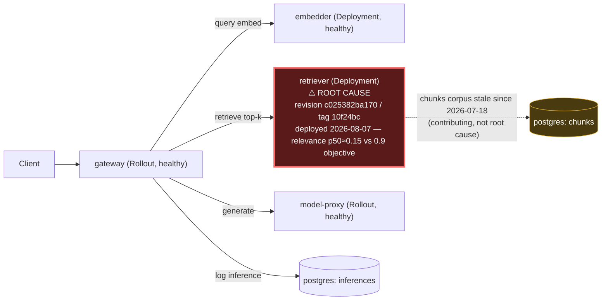

# Postmortem: RAG top-1 relevance below the 90% objective over the last hour (burn-rate alerting saturates for a loose SLO)

- **Status:** open
- **Severity:** sev2
- **Verified:** no
- **Opened:** 2026-08-12 19:03:48Z
- **Resolved:** (still open)

## Timeline (machine-generated)

All times UTC on 2026-08-12 unless a full date is shown.

| Time (UTC) | Source | Event |
| --- | --- | --- |
| 19:03:10Z | alert | alert firing: SLO RAG quality — below objective |
| 19:17:45Z | verification | recovery NOT verified — deadline armed |
| 19:18:06Z | k8s | Pod/retriever-7b8cbbdbf5-5j7tl: BackOff |
| 19:18:46Z | k8s | Pod/retriever-7b8cbbdbf5-79qbh: BackOff |
| 19:18:46Z | log-spike | log-spike onset: name=retriever-7b8cbbdbf5-79qbh kind=Pod objectAPIversion=v1 objectRV=2502965 eventRV=2504257 reportinginstance=k3d-obs-lab-agent-0 reportingcontroller=kubelet sourcecomponent=kubelet sourcehost=k3d-obs-lab-agent-0 reason=… |
| 19:18:59Z | k8s | Pod/retriever-78b9dd9fd6-jwdfg: BackOff |
| 19:19:03Z | k8s | Pod/retriever-78b9dd9fd6-fq888: BackOff |
| 19:19:05Z | k8s | Pod/retriever-7b8cbbdbf5-lwh2b: BackOff |
| 19:19:10Z | k8s | Pod/retriever-78b9dd9fd6-jwdfg: Started |
| 19:19:10Z | k8s | Pod/retriever-78b9dd9fd6-jwdfg: Pulled |
| 19:19:10Z | k8s | Pod/retriever-78b9dd9fd6-jwdfg: Created |
| 19:19:11Z | k8s | Pod/retriever-78b9dd9fd6-jwdfg: BackOff |
| 19:19:12Z | k8s | Pod/retriever-78b9dd9fd6-jwdfg: BackOff |
| 19:19:13Z | k8s | Pod/retriever-7b8cbbdbf5-5j7tl: Started |
| 19:19:13Z | k8s | Pod/retriever-7b8cbbdbf5-5j7tl: Pulled |
| 19:19:13Z | k8s | Pod/retriever-7b8cbbdbf5-5j7tl: Created |
| 19:19:14Z | k8s | Pod/retriever-7b8cbbdbf5-5j7tl: BackOff |
| 19:19:14Z | k8s | Pod/retriever-78b9dd9fd6-4vdfp: Started |
| 19:19:14Z | k8s | Pod/retriever-78b9dd9fd6-4vdfp: Pulled |
| 19:19:14Z | k8s | Pod/retriever-78b9dd9fd6-4vdfp: Created |
| 19:19:15Z | k8s | Pod/retriever-7b8cbbdbf5-5j7tl: BackOff |
| 19:19:15Z | k8s | Pod/retriever-78b9dd9fd6-4vdfp: BackOff |
| 19:19:16Z | k8s | Pod/retriever-78b9dd9fd6-4vdfp: BackOff |
| 19:19:17Z | k8s | Pod/retriever-78b9dd9fd6-4vdfp: BackOff |
| 19:19:20Z | k8s | Pod/retriever-7b8cbbdbf5-5j7tl: BackOff |
| 19:19:20Z | k8s | Pod/retriever-78b9dd9fd6-jwdfg: BackOff |
| 19:19:29Z | k8s | Pod/retriever-78b9dd9fd6-fq888: Started |
| 19:19:29Z | k8s | Pod/retriever-78b9dd9fd6-fq888: Pulled |
| 19:19:29Z | k8s | Pod/retriever-78b9dd9fd6-fq888: Created |
| 19:19:31Z | k8s | Pod/retriever-78b9dd9fd6-fq888: BackOff |
| 19:19:32Z | k8s | Pod/retriever-78b9dd9fd6-fq888: BackOff |
| 19:19:36Z | k8s | Pod/retriever-7b8cbbdbf5-lwh2b: Started |
| 19:19:36Z | k8s | Pod/retriever-7b8cbbdbf5-lwh2b: Pulled |
| 19:19:36Z | k8s | Pod/retriever-7b8cbbdbf5-lwh2b: Created |
| 19:19:37Z | k8s | Pod/retriever-7b8cbbdbf5-lwh2b: BackOff |
| 19:19:38Z | k8s | Pod/retriever-7b8cbbdbf5-lwh2b: BackOff |
| 19:19:40Z | k8s | Pod/retriever-7b8cbbdbf5-lwh2b: BackOff |
| 19:19:40Z | k8s | Pod/retriever-78b9dd9fd6-fq888: BackOff |
| 19:19:52Z | k8s | Pod/retriever-7b8cbbdbf5-79qbh: BackOff |
| 19:19:53Z | k8s | ReplicaSet/retriever-d6d55bf7f: SuccessfulDelete |
| 19:19:53Z | k8s | ReplicaSet/retriever-d6d55bf7f: SuccessfulCreate |
| 19:19:53Z | k8s | ReplicaSet/retriever-7b8cbbdbf5: SuccessfulDelete |
| 19:19:53Z | k8s | ReplicaSet/retriever-78b9dd9fd6: SuccessfulDelete |
| 19:19:53Z | k8s | Deployment/retriever: ScalingReplicaSet |
| 19:19:53Z | k8s | Pod/retriever-d6d55bf7f-nlxbb: Scheduled |
| 19:19:53Z | k8s | Pod/retriever-d6d55bf7f-2rrbb: Scheduled |
| 19:19:53Z | k8s | Pod/retriever-d6d55bf7f-mvgtn: Scheduled |
| 19:19:54Z | k8s | ReplicaSet/retriever-7b8cbbdbf5: SuccessfulDelete |
| 19:19:54Z | k8s | ReplicaSet/retriever-78b9dd9fd6: SuccessfulCreate |
| 19:19:54Z | k8s | Pod/retriever-78b9dd9fd6-5rlkd: Scheduled |
| 19:19:55Z | k8s | Pod/retriever-78b9dd9fd6-5rlkd: Started |
| 19:19:55Z | k8s | Pod/retriever-78b9dd9fd6-5rlkd: Pulled |
| 19:19:55Z | k8s | Pod/retriever-78b9dd9fd6-5rlkd: Created |
| 19:19:57Z | k8s | Pod/retriever-78b9dd9fd6-5rlkd: Started |
| 19:19:57Z | k8s | Pod/retriever-78b9dd9fd6-5rlkd: Pulled |
| 19:19:57Z | k8s | Pod/retriever-78b9dd9fd6-5rlkd: Created |
| 19:19:58Z | k8s | Pod/retriever-78b9dd9fd6-5rlkd: BackOff |
| 19:19:59Z | k8s | Pod/retriever-78b9dd9fd6-5rlkd: BackOff |
| 19:20:01Z | k8s | Pod/retriever-78b9dd9fd6-5rlkd: BackOff |
| 19:20:05Z | k8s | Pod/retriever-78b9dd9fd6-5rlkd: BackOff |
| 19:20:10Z | k8s | Pod/retriever-78b9dd9fd6-5rlkd: Started |
| 19:20:10Z | k8s | Pod/retriever-78b9dd9fd6-5rlkd: Pulled |
| 19:20:10Z | k8s | Pod/retriever-78b9dd9fd6-5rlkd: Created |
| 19:20:11Z | k8s | Pod/retriever-78b9dd9fd6-5rlkd: BackOff |
| 19:20:15Z | k8s | Pod/retriever-78b9dd9fd6-5rlkd: BackOff |
| 19:20:16Z | k8s | Pod/retriever-78b9dd9fd6-5rlkd: BackOff |
| 19:20:33Z | k8s | Pod/retriever-78b9dd9fd6-5rlkd: Started |
| 19:20:33Z | k8s | Pod/retriever-78b9dd9fd6-5rlkd: Pulled |
| 19:20:33Z | k8s | Pod/retriever-78b9dd9fd6-5rlkd: Created |
| 19:20:34Z | k8s | Pod/retriever-78b9dd9fd6-5rlkd: BackOff |
| 19:20:35Z | k8s | Pod/retriever-78b9dd9fd6-5rlkd: BackOff |
| 19:20:36Z | k8s | Pod/retriever-78b9dd9fd6-5rlkd: BackOff |
| 19:21:15Z | k8s | Pod/retriever-78b9dd9fd6-5rlkd: Started |
| 19:21:15Z | k8s | Pod/retriever-78b9dd9fd6-5rlkd: Pulled |
| 19:21:15Z | k8s | Pod/retriever-78b9dd9fd6-5rlkd: Created |
| 19:21:17Z | k8s | Pod/retriever-78b9dd9fd6-5rlkd: BackOff |
| 19:21:18Z | k8s | Pod/retriever-78b9dd9fd6-5rlkd: BackOff |
| 19:21:18Z | k8s | ReplicaSet/retriever-78b9dd9fd6: SuccessfulDelete |
| 19:21:18Z | k8s | Deployment/retriever: ScalingReplicaSet |
| 19:30:45Z | k8s | ReplicaSet/retriever-855d87d7b9: SuccessfulCreate |
| 19:30:45Z | k8s | Deployment/retriever: ScalingReplicaSet |
| 19:30:45Z | k8s | Pod/retriever-855d87d7b9-d5nzg: Scheduled |
| 19:30:46Z | k8s | Pod/retriever-855d87d7b9-d5nzg: Started |
| 19:30:46Z | k8s | Pod/retriever-855d87d7b9-d5nzg: Pulled |
| 19:30:46Z | k8s | Pod/retriever-855d87d7b9-d5nzg: Created |
| 19:30:51Z | k8s | ReplicaSet/retriever-d6d55bf7f: SuccessfulDelete |
| 19:30:52Z | k8s | Pod/retriever-d6d55bf7f-b9dqs: Killing |
| 19:36:38Z | k8s | Deployment/retriever: ScalingReplicaSet |
| 19:36:38Z | remediation | rollout_undo retriever executed (run run_19ff7724e0cc71) |
| 19:36:39Z | k8s | ReplicaSet/retriever-d6d55bf7f: SuccessfulCreate |
| 19:36:39Z | k8s | Pod/retriever-d6d55bf7f-wfrd6: Scheduled |
| 19:36:40Z | k8s | Pod/retriever-d6d55bf7f-wfrd6: Started |
| 19:36:40Z | k8s | Pod/retriever-d6d55bf7f-wfrd6: Pulled |
| 19:36:40Z | k8s | Pod/retriever-d6d55bf7f-wfrd6: Created |
| 19:36:47Z | k8s | Pod/retriever-855d87d7b9-d5nzg: Killing |
| 19:36:47Z | k8s | ReplicaSet/retriever-855d87d7b9: SuccessfulDelete |
| 19:36:47Z | k8s | Deployment/retriever: ScalingReplicaSet |

## Evidence links

- [Loki — logs over the incident window](http://localhost:3001/explore?schemaVersion=1&panes=%7B%22pm%22%3A+%7B%22datasource%22%3A+%22loki%22%2C+%22queries%22%3A+%5B%7B%22refId%22%3A+%22A%22%2C+%22datasource%22%3A+%7B%22type%22%3A+%22loki%22%2C+%22uid%22%3A+%22loki%22%7D%2C+%22expr%22%3A+%22%7Bnamespace%3D%5C%22subject%5C%22%7D+%7C~+%5C%22%28%3Fi%29error%7Cfailed%5C%22%22%7D%5D%2C+%22range%22%3A+%7B%22from%22%3A+%221786561428602%22%2C+%22to%22%3A+%221786563495209%22%7D%7D%7D&orgId=1)
- [Mimir — metrics over the incident window](http://localhost:3001/explore?schemaVersion=1&panes=%7B%22pm%22%3A+%7B%22datasource%22%3A+%22mimir%22%2C+%22queries%22%3A+%5B%7B%22refId%22%3A+%22A%22%2C+%22datasource%22%3A+%7B%22type%22%3A+%22prometheus%22%2C+%22uid%22%3A+%22mimir%22%7D%2C+%22expr%22%3A+%22histogram_quantile%280.95%2C+sum%28rate%28http_server_duration_milliseconds_bucket%5B5m%5D%29%29+by+%28le%29%29%22%7D%5D%2C+%22range%22%3A+%7B%22from%22%3A+%221786561428602%22%2C+%22to%22%3A+%221786563495209%22%7D%7D%7D&orgId=1)

## Investigation context

**Runbook match:** none — no tool narrowing applied for this alert. Available runbooks: README.md, canary-abort.md, ci-pipeline-red.md, dq-freshness-stall.md, gateway-high-error-rate.md, k8s-crashloop.md, k8s-node-failure.md, snapshot-agent-audit.md, stale-secret.md

Pre-check battery (as injected at run start)

## Pre-check leads

### recent_deploys — LEAD
1 deploy-window lead
- argo app platform: sync=OutOfSync health=Healthy (revision c025382ba170)

### kube_scan — LEAD
12 kube-scan leads
- event Pod/retriever-78b9dd9fd6-5rlkd: BackOff — Back-off restarting failed container retriever in pod retriever-78b9dd9fd6-5rlkd_subject(1ad518de-dc82-49eb-a4e2-f6ec1a4b2157) (at 21:19:58)
- event Pod/retriever-78b9dd9fd6-5rlkd: BackOff — Back-off restarting failed container retriever in pod retriever-78b9dd9fd6-5rlkd_subject(1ad518de-dc82-49eb-a4e2-f6ec1a4b2157) (at 21:19:59)
- event Pod/retriever-78b9dd9fd6-5rlkd: BackOff — Back-off restarting failed container retriever in pod retriever-78b9dd9fd6-5rlkd_subject(1ad518de-dc82-49eb-a4e2-f6ec1a4b2157) (at 21:20:01)
- event Pod/retriever-78b9dd9fd6-5rlkd: BackOff — Back-off restarting failed container retriever in pod retriever-78b9dd9fd6-5rlkd_subject(1ad518de-dc82-49eb-a4e2-f6ec1a4b2157) (at 21:20:
… (section truncated)

### log_spike — LEAD
error/failed log rate 32/10min vs baseline 0/10min (32x baseline) — onset: name=retriever-7b8cbbdbf5-79qbh kind=Pod objectAPIversion=v1 objectRV=2502965 eventRV=2504257 reportinginstance=k3d-obs-lab-agent-0 reportingcontroller=kubelet sourcecomponent=kubelet sourcehost=k3d-obs-lab-agent-0 reason=BackOff type=Warning count=23 msg="Back-off restarting failed container retriever in pod retriever-7b8cbbdbf5-79qbh_subject(f01c796e-836f-4e79-864b-2c53c7844ffd)"  at 2026-08-12T19:18:46+00:00
- error/failed log rate 32/10min vs baseline 0/10min (32x baseline) — onset: name=retriever-7b8cbbdbf5-79qbh kind=Pod objectAPIversion=v1 objectRV=2502965 eventRV=2504257 reportinginstance=… (truncated)

### attribution — LEAD
 over the last 10m — which is not necessarily the workload named on the alert:
- model-proxy reported no server-side requests at all — a workload that is down or unscheduled emits nothing, and its CALLERS carry its errors

### rollout_state — OK
gateway and model-proxy rollouts stable, no failed analysis

### secret_age — OK
Secret subject-db-credentials last modified 18d 20h ago (created 18d 20h ago).

## Narrative

## Summary

The `SLO RAG quality — below objective` alert (tenant test-bench) fired because top-1 retrieval relevance collapsed far below the 90% objective. This is a continuation of an earlier investigation that hit its turn limit before remediating; this pass re-diagnosed from scratch, confirmed the earlier crash-loop lead was a self-inflicted side effect rather than the trigger, executed the one applicable remediation tool, and it did **not** restore service — reported here honestly rather than assumed fixed.

## Impact

Gateway's own `retrieval_relevance_score` histogram (job=gateway, tenant test-bench) shows 8,451 sampled requests: **p50 relevance ≈ 0.15**, and 98.1% of requests scored ≤ 0.2 — essentially no request in the sample retrieved relevant content. This is not noise or a small blip; it is the dominant, near-total behavior of the retrieval path over the sampled window.

## Root cause

Component: **retriever** (plain `apps/subject/retriever` Deployment, not an Argo Rollout canary).
Cause category: **bad deploy / release regression**, not availability/crash/config-drift.

Evidence:
- The relevance histogram is flat/frozen across the sampled window because live traffic stopped (`load-generator` Deployment is intentionally scaled to 0 desired replicas — Tempo shows only `/health` probe traces in the last 2h, no real request spans). The histogram is therefore a snapshot of the last real batch of traffic, and that batch was already conclusively bad.
- Retriever's only Argo-tracked change in the incident's lookback window is revision `c025382ba170` (image tag `retriever:10f24bc`), synced 2026-08-07T19:42:11Z — five days before alert onset. No retriever/embedder code has shipped since (the only merges since then — PR #71 web UI polish, PR #72 tenant rename acme→test-bench — touch gateway auth/rate-limit config and docs only, confirmed via `gitea_compare`, not retrieval/ranking logic).
- The alert's own annotation states burn-rate alerting "saturates for a loose SLO" — i.e. a multi-day gap between a bad deploy and alert onset is expected for this SLO type, not evidence against the Aug 7 deploy being the cause.
- The `k8s-crashloop`-shaped lead (retriever pods BackOff-ing) is a **derivative symptom, not the trigger**: the crash-loop events start at 19:19 UTC, sixteen minutes *after* the alert had already been firing (since 19:03 UTC). It was caused by repeated restarts from the earlier (turn-limited) remediation attempt cycling the Deployment through five-plus ReplicaSets in ~40 minutes — all running the identical image tag `10f24bc`, confirmed via `kubectl describe deployment` and `kubectl get replicasets`. No OOM (72Mi used of a 512Mi limit) and no image-pull errors were found.
- `dq-freshness-stall` was checked and ruled out: it governs a different alert class (`dq_freshness_minutes` on the documents dataset), and while the `chunks` retrieval corpus is separately stale (991 rows, unchanged since 2026-07-18), that predates both the Aug 7 deploy and the alert onset by weeks and is not the proximate trigger — noted as a contributing/chronic condition below, not the root cause.

## What fixed it

**Nothing — the remediation did not restore service, and this is reported as an open failure to recover.** `rollout_undo` on `retriever` was dry-run first (action_id `3cf7fccfb7532c13`), showing the diff `revision 29 (retriever:10f24bc) -> revision 28 (retriever:10f24bc)` — both sides carry the *identical image tag*. This was flagged before requesting approval. The operator approved anyway (`apr_19ff779b71dd94`) and the rollback was executed (`deployment.apps/retriever rolled back`), which merely cycled the Deployment to a new ReplicaSet on the same image content. `alert_status` was re-queried three times after execution and remained `active` throughout, confirming the rollback had no effect — exactly as the dry-run diff predicted. This also explains why the earlier (turn-limited) attempt failed: the toolset's only rollback lever (`kubectl rollout undo`) cannot reach a genuinely different retriever image once repeated restarts have polluted the recent revision history with same-tag entries, and no tool in this on-call toolkit can set an explicit image tag or force an Argo sync to an older gitops revision.

## Lessons

- A crash-loop lead that starts *after* an SLO alert has already been firing is a symptom of remediation activity, not the cause — always check event timing against alert `since` before treating a crash-loop as the trigger.
- `rollout_undo`'s dry-run diff should be read for whether the image actually changes, not just that a revision number changes; repeated blind restarts can pollute k8s revision history with cosmetic-only entries (annotation-driven pod-template-hash changes) that make "rollback" a no-op.
- This on-call toolkit has no lever to fix a content/ranking regression baked into a deployed image (no image-tag-set, no Argo-revision-set) — escalation path needed: revert the gitops manifest for retriever to the pre-2026-08-07 image and let Argo resync, or ship a forward-fix and redeploy.
- Secondary/chronic finding worth a separate ticket: the `chunks` retrieval corpus has not been refreshed since 2026-07-18 (991 rows) — independent of this incident but likely capping achievable relevance regardless of the retriever regression.

Report artifact with the real relevance-histogram distribution: art_19ff77b0725dba (report.html).
