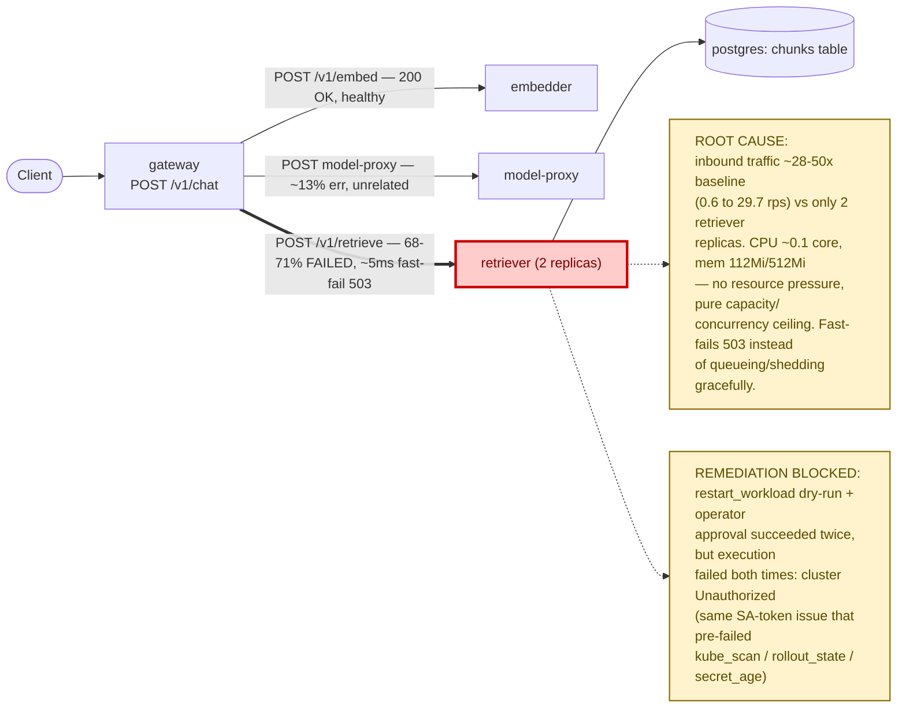

# Postmortem: gateway availability error budget burning fast (2% of the 28d budget in 1h; 5m & 1h windows)

- **Status:** open
- **Severity:** sev1
- **Verified:** no
- **Opened:** 2026-08-12 13:04:42Z
- **Resolved:** (still open)

## Timeline (machine-generated)

All times UTC on 2026-08-12 unless a full date is shown.

| Time (UTC) | Source | Event |
| --- | --- | --- |
| 13:02:04Z | log-spike | log-spike onset: error: Malformed JSON in request body |
| 13:04:10Z | alert | alert firing: SLO gateway availability — fast burn |

## Evidence links

- [Loki — logs over the incident window](http://localhost:3001/explore?schemaVersion=1&panes=%7B%22pm%22%3A+%7B%22datasource%22%3A+%22loki%22%2C+%22queries%22%3A+%5B%7B%22refId%22%3A+%22A%22%2C+%22datasource%22%3A+%7B%22type%22%3A+%22loki%22%2C+%22uid%22%3A+%22loki%22%7D%2C+%22expr%22%3A+%22%7Bnamespace%3D%5C%22subject%5C%22%7D+%7C~+%5C%22%28%3Fi%29error%7Cfailed%5C%22%22%7D%5D%2C+%22range%22%3A+%7B%22from%22%3A+%221786539882907%22%2C+%22to%22%3A+%221786540414629%22%7D%7D%7D&orgId=1)
- [Mimir — metrics over the incident window](http://localhost:3001/explore?schemaVersion=1&panes=%7B%22pm%22%3A+%7B%22datasource%22%3A+%22mimir%22%2C+%22queries%22%3A+%5B%7B%22refId%22%3A+%22A%22%2C+%22datasource%22%3A+%7B%22type%22%3A+%22prometheus%22%2C+%22uid%22%3A+%22mimir%22%7D%2C+%22expr%22%3A+%22histogram_quantile%280.95%2C+sum%28rate%28http_server_duration_milliseconds_bucket%5B5m%5D%29%29+by+%28le%29%29%22%7D%5D%2C+%22range%22%3A+%7B%22from%22%3A+%221786539882907%22%2C+%22to%22%3A+%221786540414629%22%7D%7D%7D&orgId=1)

## Investigation context

**Runbook match (2):** `gateway-high-error-rate.md`, `stale-secret.md` — toolset narrowed to 13 tools: alert_status, deploy_history, kubectl_read, loki_query, mimir_query, publish_postmortem, request_approval, restart_workload, runbook_lookup, runbook_read, save_artifact, tempo_query, update_db_secret

Pre-check battery (as injected at run start)

## Pre-check leads

### recent_deploys — LEAD
No deploy in the last 60m — rule out the reflex answer.
- No deploy in the last 60m — rule out the reflex answer.

### log_spike — LEAD
error/failed log rate 200/10min vs baseline 0/10min (200x baseline) — onset: error: Malformed JSON in request body at 2026-08-12T13:02:04.681306+00:00
- error/failed log rate 200/10min vs baseline 0/10min (200x baseline) — onset: error: Malformed JSON in request body at 2026-08-12T13:02:04.681306+00:00

### attribution — LEAD
errors concentrate on gateway → POST retriever (71.5%); time concentrates in gateway's own handler (~2.5s of 4.5s) over the last 10m — which is not necessarily the workload named on the alert:
- retriever: 67.6% of its OWN responses are 5xx (10m)
- gateway: 66.3% of its OWN responses are 5xx (10m)
- model-proxy: 2.7% of its OWN responses are 5xx (10m)
- gateway → POST retriever: 71.5% of those outbound calls failed
- gateway → POST model-proxy: 11.6% of those outbound calls failed
- own-handler p95 (server p95 minus its slowest outbound call — a ranking, not a measurement): gateway ~2.5s of 4.5s end to end, embedder ~2.0s of 2.0s end to end, retriever ~1.7s of 1.7s end to end
- gateway → POST embedder: p95 2.0s outbound
- gateway → POST retriever: p95 1.7s outbound

### kube_scan — UNAVAILABLE
error: You must be logged in to the server (Unauthorized)

### rollout_state — UNAVAILABLE
gateway: E0812 15:04:43.586056   12708 memcache.go:265] "Unhandled Error" err="couldn't get current server API group list: the server has asked for the client to provide credentials"
E0812 15:04:43.663069   12708 memcache.go:265] "Unhandled Error" err="couldn't get current server API group list: the server has asked for the client to provide credentials"
E0812 15:04:43.746664   12708 memcache.go:265] "Unhandled Error" err="couldn't get current server API group list: the server has asked for the client to; gateway analysis: E0812 15:04:43.612532   31792 memcache.go:265] "Unhandled Error" err="couldn't get current server API group list: the server has asked for the client to provide credentials"
E0812 15:04:43.682104   31792 memcache.go:265] "Unhandled Error"
… (section truncated)

### secret_age — UNAVAILABLE
error: You must be logged in to the server (Unauthorized)

## Narrative

## Summary

`SLO gateway availability — fast burn` (sev1) fired for tenant `acme`. Attribution
pointed at the gateway only as a front door: the gateway's own error rate tracked
almost exactly its outbound `POST retriever` failure rate, and `retriever` itself
had a high own-5xx rate — i.e. this was retriever's failure surfacing through the
gateway, not a gateway defect (per the `gateway-high-error-rate` runbook's
attribution-before-hypothesis approach).

## Impact

Gateway 5xx rate rose from a ~0.4% baseline to a 76% peak on `POST /v1/chat`
(tenant `acme` primarily, per the burn-rate alert), driven almost entirely by the
gateway→retriever edge (68-71% of those outbound calls failing). `POST /v1/embed`
and `POST model-proxy` stayed healthy throughout (2.7-13% error, unrelated).

## Root cause

`retriever`'s own request volume on `/v1/retrieve` surged ~28-50x above its steady
baseline (0.6 rps → 29.7 rps peak), and gateway's total inbound rps surged by the
same ~28x in lockstep — confirming a genuine end-to-end traffic surge, not
retriever-side amplification (retries, etc.). Against that surge, `retriever` runs
only 2 replicas and fast-failed the excess with 503s in ~5ms (p95 latency on the
503s themselves), while its own CPU (~0.1 core/pod) and memory (112Mi of a 512Mi
limit) stayed comfortably under pressure the entire time — ruling out OOM and CPU
throttling as the mechanism. This is a capacity/concurrency ceiling being hit
under load, not a resource limit being hit.

Ruled out explicitly with evidence:
- **Bad deploy**: `deploy_history` showed zero deploys in the preceding 120
  minutes; Argo/rollout state was unreachable (see below) but no gitops/CI
  activity correlates with onset either way.
- **Stale DB secret**: `stale-secret.md`'s signature (auth-failure logs following
  a secret rotation) does not hold — zero `"password authentication failed"`
  lines in the whole window.
- **Lineage-emit timeouts**: retriever logged occasional `"lineage emit failed
  ... The operation timed out"` warnings, but only ~12 lines total across the
  20-minute window against ~13.7 503s/second — three orders of magnitude too
  sparse to be causing most of the failures. This matches this environment's
  known standing issue (per-request OpenLineage emit to a laptop-hosted Marquez
  over Tailscale) and was treated as the decoy it's known to be, not the cause.
- **OOM/CPU exhaustion**: memory and CPU both well under limits throughout, as
  above.

The error rate remained pinned in the 58-76% range even as inbound traffic began
to recede from its peak, consistent with retriever's fast-fail path staying
tripped rather than gracefully scaling with demand — i.e. a wedged/undersized
downstream, which is the runbook's "Downstream wedged" mitigation case.

Two pre-check leads returned `Unauthorized` from the start (`kube_scan`,
`rollout_state`, `secret_age`) and `kubectl_read`/`restart_workload` hit the same
`"You must be logged in to the server"` error later — a cluster-auth outage on
the agent's own service-account credentials, independent of and incidental to the
retriever capacity problem.

## What fixed it

Nothing, from this agent. The indicated remediation — `restart_workload` on
`retriever` to clear the wedged fast-fail state, matching the runbook's
"Downstream wedged" guidance since resource-limit tools (`scale_deployment`,
`patch_memory_limit`) were not grantable in this session — was dry-run
successfully (verified diff: rolling restart via `restartedAt` annotation, no
spec change) and explicitly approved by the operator **twice**, but execution
failed both times with the cluster returning `Unauthorized`, matching the same
credential failure already flagged by the `kube_scan`/`rollout_state`/`secret_age`
pre-checks. **The remediation was not applied.** The gateway 5xx rate visibly
declined toward the end of the investigation (76% peak → 28% at last check) as
inbound traffic organically receded, but `alert_status` still reported the
availability burn-rate alert **active** as of the final check — recovery was not
confirmed and must not be assumed.

## Lessons

- The agent's cluster service-account credentials were unusable for the entire
  incident (read AND write), most likely the previously-seen weekly SA-token
  expiry. This blocked both deeper diagnosis (`kubectl describe` on retriever
  pods) and the only applicable remediation. This needs fixing before the next
  page, independent of this specific incident.
- `retriever` has no headroom for even a moderate traffic surge at 2 replicas,
  and fails closed (503) rather than queueing or shedding gracefully — worth an
  autoscaling policy or a higher static replica floor so a demand spike doesn't
  immediately convert into a sev1 availability burn.
- The lineage-emit-timeout log line is a persistent, low-signal decoy in this
  environment; it should probably be muted or fixed at the source rather than
  continuing to cost investigation time confirming it's not the cause.

## Delivery path

