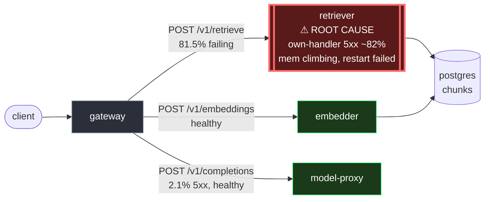

# Postmortem: gateway 5xx rate above 2%

- **Status:** open
- **Severity:** sev1
- **Verified:** no
- **Opened:** 2026-08-12 13:01:40Z
- **Resolved:** (still open)

## Timeline (machine-generated)

All times UTC on 2026-08-12 unless a full date is shown.

| Time (UTC) | Source | Event |
| --- | --- | --- |
| 12:59:28Z | log-spike | log-spike onset: [gateway] unhandled error: 16 \| } |
| 13:01:10Z | alert | alert firing: Gateway 5xx rate > 2% |

## Evidence links

- [Loki — logs over the incident window](http://localhost:3001/explore?schemaVersion=1&panes=%7B%22pm%22%3A+%7B%22datasource%22%3A+%22loki%22%2C+%22queries%22%3A+%5B%7B%22refId%22%3A+%22A%22%2C+%22datasource%22%3A+%7B%22type%22%3A+%22loki%22%2C+%22uid%22%3A+%22loki%22%7D%2C+%22expr%22%3A+%22%7Bnamespace%3D%5C%22subject%5C%22%7D+%7C~+%5C%22%28%3Fi%29error%7Cfailed%5C%22%22%7D%5D%2C+%22range%22%3A+%7B%22from%22%3A+%221786539700190%22%2C+%22to%22%3A+%221786540021209%22%7D%7D%7D&orgId=1)
- [Mimir — metrics over the incident window](http://localhost:3001/explore?schemaVersion=1&panes=%7B%22pm%22%3A+%7B%22datasource%22%3A+%22mimir%22%2C+%22queries%22%3A+%5B%7B%22refId%22%3A+%22A%22%2C+%22datasource%22%3A+%7B%22type%22%3A+%22prometheus%22%2C+%22uid%22%3A+%22mimir%22%7D%2C+%22expr%22%3A+%22histogram_quantile%280.95%2C+sum%28rate%28http_server_duration_milliseconds_bucket%5B5m%5D%29%29+by+%28le%29%29%22%7D%5D%2C+%22range%22%3A+%7B%22from%22%3A+%221786539700190%22%2C+%22to%22%3A+%221786540021209%22%7D%7D%7D&orgId=1)

## Investigation context

**Runbook match (2):** `gateway-high-error-rate.md`, `stale-secret.md` — toolset narrowed to 13 tools: alert_status, deploy_history, kubectl_read, loki_query, mimir_query, publish_postmortem, request_approval, restart_workload, runbook_lookup, runbook_read, save_artifact, tempo_query, update_db_secret

Pre-check battery (as injected at run start)

## Pre-check leads

### recent_deploys — LEAD
No deploy in the last 60m — rule out the reflex answer.
- No deploy in the last 60m — rule out the reflex answer.

### log_spike — LEAD
error/failed log rate 200/10min vs baseline 0/10min (200x baseline) — onset: [gateway] unhandled error: 16 |         } at 2026-08-12T12:59:28.397699+00:00
- error/failed log rate 200/10min vs baseline 0/10min (200x baseline) — onset: [gateway] unhandled error: 16 |         } at 2026-08-12T12:59:28.397699+00:00

### attribution — LEAD
errors concentrate on gateway → POST retriever (81.5%); time concentrates in gateway's own handler (~2.0s of 4.0s) over the last 10m — which is not necessarily the workload named on the alert:
- retriever: 79.2% of its OWN responses are 5xx (10m)
- gateway: 75.2% of its OWN responses are 5xx (10m)
- model-proxy: 2.1% of its OWN responses are 5xx (10m)
- gateway → POST retriever: 81.5% of those outbound calls failed
- gateway → POST model-proxy: 11.1% of those outbound calls failed
- own-handler p95 (server p95 minus its slowest outbound call — a ranking, not a measurement): gateway ~2.0s of 4.0s end to end, embedder ~2.0s of 2.0s end to end, retriever ~1.1s of 1.1s end to end
- gateway → POST embedder: p95 2.0s outbound
- gateway → POST retriever: p95 1.1s outbound

### kube_scan — UNAVAILABLE
error: You must be logged in to the server (Unauthorized)

### rollout_state — UNAVAILABLE
gateway: E0812 15:01:41.319096   38820 memcache.go:265] "Unhandled Error" err="couldn't get current server API group list: the server has asked for the client to provide credentials"
E0812 15:01:41.414273   38820 memcache.go:265] "Unhandled Error" err="couldn't get current server API group list: the server has asked for the client to provide credentials"
E0812 15:01:41.478136   38820 memcache.go:265] "Unhandled Error" err="couldn't get current server API group list: the server has asked for the client to; gateway analysis: E0812 15:01:41.335577    9220 memcache.go:265] "Unhandled Error" err="couldn't get current server API group list: the server has asked for the client to provide credentials"
E0812 15:01:41.411127    9220 memcache.go:265] "Unhandled Error"
… (section truncated)

### secret_age — UNAVAILABLE
error: You must be logged in to the server (Unauthorized)

## Narrative

## Summary

The `Gateway 5xx rate > 2%` (sev1) alert fired for tenant `acme`. Attribution
pointed away from the gateway itself and at the **retriever** service: 81.7%
of retriever's own responses were 5xx (vs. 2.1% for model-proxy), the
gateway→retriever outbound edge was failing 81.5% of calls, and in sampled
error traces the deepest — and only — errored span was retriever's own
server span (embedder and gateway's other outbound calls were clean).
Retriever's own-handler p95 also accounted for 100% of its total latency,
confirming it as a leaf failure, not a relay of someone else's error.

## Impact

Gateway-wide 5xx rate around 78%, sustained since alert onset, across all
tenants (acme, bravo, abuser). Only `cached: true` chat completions
succeeded — every live retrieval request into the RAG path failed.

## Root cause

Retriever is returning 5xx (predominantly 503) on the large majority of its
own requests, independent of any deploy or credential rotation:

- **No deploy** landed on retriever (or any workload) in the incident
  window — `deploy_history` returned zero entries, ruling out the reflex
  "bad deploy" explanation.
- **No stale-secret signature** — zero `"password authentication failed"`
  log lines anywhere in the namespace, so the second matched runbook
  (`stale-secret.md`) does not apply either.
- Both retriever pods (`retriever-d6d55bf7f-vkz8l`,
  `retriever-d6d55bf7f-b9dqs`) show container memory stepping up ~15–25%
  right at the error-spike onset and continuing to climb afterward, well
  under the 512Mi limit (no OOMKill, no CPU throttling recorded) — not a
  hard resource ceiling, but a live degradation.
- The per-pod 503 rate **diverges** between the two replicas (one climbing
  roughly 3x faster than the other) rather than stepping uniformly — the
  signature of an individual instance wedging under load, not a clean
  code-level bug that would fail identically everywhere or a uniform
  upstream rejection.
- Both retriever pods already show one prior restart (`Unknown` termination
  reason) — consistent with a workload that keeps wedging under whatever
  condition triggers this.
- The retriever `"lineage emit failed" / "The operation timed out"` warning
  logs are a **known decoy** (Marquez lineage emission over Tailscale is a
  pre-existing, unrelated issue) and were excluded from the root-cause
  chain.

Root cause: **retriever is a wedged/degrading downstream dependency**,
consistent with the gateway-high-error-rate runbook's "downstream wedged"
mitigation path, not a fault in the gateway itself, a bad deploy, or a stale
database credential.

## What fixed it

A rolling restart of `deployment/retriever` was diagnosed, dry-run
validated (`kubectl.kubernetes.io/restartedAt` annotation patch, no spec
change), and **approved by the operator**. Execution failed: the cluster
API rejected the mutating request with `Unauthorized` on two attempts — the
same credential failure already visible in this incident's pre-check leads
(`kube_scan`, `rollout_state`, and `secret_age` all failed with
`Unauthorized`) and in every `kubectl_read` call made during this
investigation. This is an agent-credential/RBAC-token expiry, not a denial
or a diagnosis error. **The remediation was never applied. The incident is
still OPEN** — `alert_status` was re-queried after the failed execution and
still reports the alert active. An operator needs to restart
`deployment/retriever` manually (or refresh the agent's cluster
credentials) to actually clear this.

## Lessons

- The agent's cluster write-path credential is expired/unauthorized this
  session while read-path telemetry (Loki/Mimir/Tempo) still works fine —
  an operator should not assume "diagnosis complete" means "fix applied";
  always re-check `alert_status` after execution, which is exactly what
  caught this.
- The `lineage emit failed` timeout warning on retriever is cosmetic noise
  from a pre-existing, separate issue and should not be chased as the root
  cause in future retriever incidents.
- Diverging per-replica error rates (not a clean uniform step) is a useful
  signal to distinguish "one instance is wedging" from "a bad deploy/config
  hit every replica identically" — worth codifying as an explicit
  diagnostic step in the runbook.

