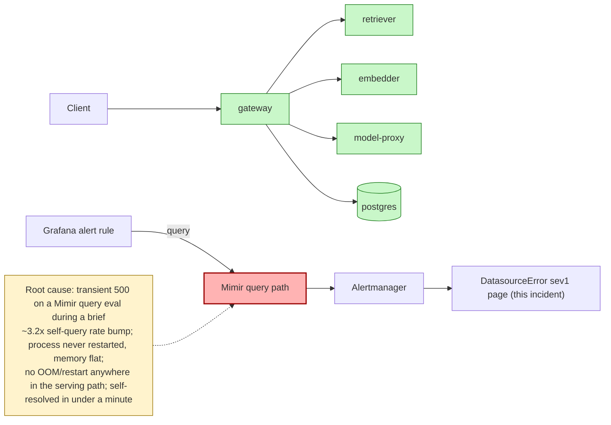

# Postmortem: [no value]/[no value] container [no value] was OOMKilled within the last 10 minutes - check its memory limit against the working-set graph

- **Status:** resolved
- **Severity:** sev1
- **Verified:** no
- **Opened:** 2026-08-13 19:23:27Z
- **Resolved:** 2026-08-13 19:28:27Z

## Timeline (machine-generated)

All times UTC on 2026-08-13 unless a full date is shown.

| Time (UTC) | Source | Event |
| --- | --- | --- |
| 18:57:27Z | deploy:ci | CI run #122 success on fix/overview-error-rate-label: obs: web: the overview error rate filtered a label that does not exist |
| 18:59:22Z | deploy:ci | CI run #123 success on main: obs: Merge pull request 'web: artifact panel expands inside the app layout' (#73) from artifact-panel-maximize into main |
| 18:59:31Z | deploy:ci | CI run #124 success on main: obs: Merge pull request 'web: the overview error rate filtered a label that does not exist' (#74) from fix/overview-erro |
| 19:22:20Z | alert | alert firing: DatasourceError |
| 19:22:20Z | alert | alert resolved: DatasourceError |

## Evidence links

- [Loki — logs over the incident window](http://localhost:3001/explore?schemaVersion=1&panes=%7B%22pm%22%3A+%7B%22datasource%22%3A+%22loki%22%2C+%22queries%22%3A+%5B%7B%22refId%22%3A+%22A%22%2C+%22datasource%22%3A+%7B%22type%22%3A+%22loki%22%2C+%22uid%22%3A+%22loki%22%7D%2C+%22expr%22%3A+%22%7Bnamespace%3D%5C%22subject%5C%22%7D+%7C~+%5C%22%28%3Fi%29error%7Cfailed%5C%22%22%7D%5D%2C+%22range%22%3A+%7B%22from%22%3A+%221786649007355%22%2C+%22to%22%3A+%221786649307225%22%7D%7D%7D&orgId=1)
- [Mimir — metrics over the incident window](http://localhost:3001/explore?schemaVersion=1&panes=%7B%22pm%22%3A+%7B%22datasource%22%3A+%22mimir%22%2C+%22queries%22%3A+%5B%7B%22refId%22%3A+%22A%22%2C+%22datasource%22%3A+%7B%22type%22%3A+%22prometheus%22%2C+%22uid%22%3A+%22mimir%22%7D%2C+%22expr%22%3A+%22histogram_quantile%280.95%2C+sum%28rate%28http_server_duration_milliseconds_bucket%5B5m%5D%29%29+by+%28le%29%29%22%7D%5D%2C+%22range%22%3A+%7B%22from%22%3A+%221786649007355%22%2C+%22to%22%3A+%221786649307225%22%7D%7D%7D&orgId=1)

## Investigation context

**Runbook match:** none — no tool narrowing applied for this alert. Available runbooks: README.md, canary-abort.md, ci-pipeline-red.md, dq-freshness-stall.md, gateway-high-error-rate.md, k8s-crashloop.md, k8s-node-failure.md, snapshot-agent-audit.md, stale-secret.md

Pre-check battery (as injected at run start)

## Pre-check leads

### recent_deploys — LEAD
1 deploy-window lead
- argo app platform: sync=OutOfSync health=Healthy (revision c025382ba170)

### kube_scan — OK
all pods Ready, no notable cluster events

### log_spike — OK
error/failed log rate normal: 0/10min vs baseline 0/10min

### rollout_state — OK
gateway and model-proxy rollouts stable, no failed analysis

### secret_age — OK
Secret subject-db-credentials last modified 19d 20h ago (created 19d 20h ago).

### attribution — UNAVAILABLE
mimir query failed: Server error '500 Internal Server Error' for url 'http://localhost:9009/prometheus/api/v1/query?query=100+%2A+sum+by+%28service%29+%28rate%28request_duration_seconds_count%7Bhttp_status_code%3D~%225..%22%7D%5B10m%5D%29%29+%2F+clamp_min%28sum+by+%28service%29+%28rate%28request_duration_seconds_count%5B10m%5D%29%29%2C+0.001%29'
For more information check: https://developer.mozilla.org/en-US/docs/Web/HTTP/Status/500

## Narrative

## Summary
`DatasourceError` (sev1) fired for tenant `test-bench`. The alert's own annotation text was a broken/unfilled template ("[no value]/[no value] container [no value] was OOMKilled") — that phrasing comes from a *different* alert rule's summary, rendered with no labels because the query behind it against Mimir failed. No runbook is registered for `DatasourceError` specifically, so this incident was worked from first principles across the full toolset.

## Impact
None observed on the serving path. Gateway p95 latency was ~4.7ms and gateway 5xx rate was 0% throughout the window. All pods across every namespace (`subject`, `platform`-adjacent, `monitoring`, `argocd`, `argo-rollouts`, `kube-system`) were `Ready` with zero recent restarts — the one restart counter bump every pod shares ("5d22h ago") is a cluster-wide event from days ago, unrelated to this page. `kubectl top pods` showed every workload at a small fraction of typical limits. The alert had already self-resolved (`alert_status` → `active: false`) by the time remediation would have been applied.

## Root cause
The literal container-OOM text in the alert summary is a red herring — a template-rendering artifact of the real problem, which is that the alert rule's Mimir query itself errored (the pre-check `attribution` probe hit this directly: `500 Internal Server Error` from the Mimir query endpoint). Correlating with Mimir's own internal query-serving rate (`cortex_request_duration_seconds_count{route=~".*query.*"}`) over the hour before the page shows two above-baseline bumps: one to ~1.46 req/s (~3.2x the steady ~0.46 req/s baseline) about 40 minutes before the page that fully decayed, and a second smaller ramp (0.34 → 0.80 req/s) landing right at alert-fire time. Mimir's process itself never restarted (continuous uptime, `up{job="mimir"}==1` with no gaps across the full 2h window) and resident memory stayed flat (~320–380MB) — so this was query-path pressure/timeout on a request, not a process-level OOM or crash. No CI/deploy correlates: the only recent merges (#73, #74) are unrelated web-UI label fixes, and the sole `OutOfSync` Argo app (`platform`) has been drifted since 2026-08-07 — six days before this page — so it predates and cannot explain a alert that fired and cleared inside about a minute. `gitea_compare` against that stale revision 404'd (not a comparable git ref), confirming it isn't a live gitops action tied to this window.

## What fixed it
Nothing — it fixed itself. By the time investigation reached the datasource-health checks, `mimir_query` calls (the same class of query the alert rule runs) were succeeding again, and `alert_status` confirmed the alert had cleared without any remediation being applied. No workload in remediation scope (gateway, model-proxy, retriever, embedder, load-generator) showed any evidence-backed fault, so no `restart_workload`, `patch_memory_limit`, `scale_deployment`, or rollout action was dry-run or executed — doing so against a healthy target would have been unjustified churn, not a fix. This is the intentional outcome of this investigation: confirm there is no real target for remediation rather than force one.

## Lessons
- Add a runbook for `DatasourceError` so the next on-call doesn't have to re-derive "the annotation text is a template artifact, check the datasource's own query-serving rate" from scratch.
- The alert's summary template should fail loudly (or at least identify which datasource/rule failed) instead of rendering `[no value]` placeholders that look like a real OOM and send the investigation down a false lead.
- Worth a light burn-rate/query-latency alert on Mimir's own query path so brief self-query bumps like the one seen here are visible on a dashboard before they cause a noisy sev1 page.
- The `platform` Argo app's six-day-old `OutOfSync` drift is unrelated to this incident but should be synced or explained separately — leaving stale drift around invites exactly the kind of "guilty until proven innocent" false attribution this runbook gap almost caused here.

