# Postmortem: gateway p95 latency above 2s

- **Status:** open
- **Severity:** sev1
- **Verified:** no
- **Opened:** 2026-08-13 23:58:41Z
- **Resolved:** (still open)

## Timeline (machine-generated)

All times UTC on 2026-08-13 unless a full date is shown.

| Time (UTC) | Source | Event |
| --- | --- | --- |
| 23:57:58Z | k8s | Pod/retriever-77df6c9cc5-c7f2g: Started |
| 23:57:58Z | k8s | Rollout/gateway: ScalingReplicaSet |
| 23:57:58Z | k8s | Deployment/embedder: ScalingReplicaSet |
| 23:57:58Z | k8s | Pod/embedder-fdff9df4-4l2rw: Scheduled |
| 23:57:59Z | k8s | Pod/gateway-77cfb95667-jvc2z: Killing |
| 23:57:59Z | k8s | ReplicaSet/gateway-77cfb95667: SuccessfulDelete |
| 23:57:59Z | k8s | Pod/embedder-fdff9df4-4l2rw: Pulled |
| 23:57:59Z | k8s | Pod/embedder-fdff9df4-4l2rw: Created |
| 23:58:00Z | k8s | ReplicaSet/gateway-746788f5df: SuccessfulCreate |
| 23:58:00Z | k8s | Rollout/gateway: ScalingReplicaSet |
| 23:58:00Z | k8s | Pod/embedder-fdff9df4-4l2rw: Started |
| 23:58:00Z | k8s | Pod/gateway-746788f5df-jslfm: Scheduled |
| 23:58:01Z | k8s | Pod/gateway-77cfb95667-jvc2z: Unhealthy |
| 23:58:01Z | k8s | Pod/gateway-746788f5df-jslfm: Pulled |
| 23:58:02Z | k8s | Pod/gateway-746788f5df-jslfm: Started |
| 23:58:02Z | k8s | Pod/gateway-746788f5df-jslfm: Created |
| 23:58:04Z | k8s | Pod/retriever-65c474b46b-bqqd9: Killing |
| 23:58:04Z | k8s | ReplicaSet/retriever-65c474b46b: SuccessfulDelete |
| 23:58:04Z | k8s | Deployment/retriever: ScalingReplicaSet |
| 23:58:06Z | k8s | Pod/embedder-596696c46d-s25xc: Killing |
| 23:58:06Z | k8s | ReplicaSet/embedder-596696c46d: SuccessfulDelete |
| 23:58:06Z | k8s | Deployment/embedder: ScalingReplicaSet |
| 23:58:09Z | k8s | Rollout/gateway: RolloutStepCompleted |
| 23:58:10Z | alert | alert firing: Gateway p95 latency > 2s |
| 23:58:11Z | k8s | Rollout/gateway: AnalysisRunRunning |
| 23:58:35Z | log-spike | log-spike onset: {"level":"warn","service":"gateway","message":"lineage emit failed","trace_id":"06e00cfb9545e6251a306e31984d5bff","span_id":"9405fccaf87b4e05","time":"2026-08-13T23:58:35.697Z","reason":"The operation timed out.","job":"ra… |
| 23:59:10Z | k8s | AnalysisRun/gateway-746788f5df-26-1: MetricFailed |
| 23:59:10Z | k8s | AnalysisRun/gateway-746788f5df-26-1: AnalysisRunFailed |
| 23:59:10Z | k8s | Rollout/gateway: AnalysisRunFailed |
| 23:59:10Z | k8s | AnalysisRun/gateway-746788f5df-26-1: MetricSuccessful |
| 23:59:11Z | k8s | Rollout/gateway: RolloutAborted |
| 23:59:11Z | k8s | Pod/gateway-746788f5df-jslfm: Killing |
| 23:59:11Z | k8s | ReplicaSet/gateway-746788f5df: SuccessfulDelete |
| 23:59:11Z | k8s | Rollout/gateway: ScalingReplicaSet |
| 23:59:12Z | k8s | ReplicaSet/gateway-77cfb95667: SuccessfulCreate |
| 23:59:12Z | k8s | Rollout/gateway: ScalingReplicaSet |
| 23:59:12Z | k8s | Pod/gateway-77cfb95667-8tdz6: Scheduled |
| 23:59:13Z | k8s | Pod/gateway-77cfb95667-8tdz6: Pulled |
| 23:59:14Z | k8s | Pod/gateway-77cfb95667-8tdz6: Started |
| 23:59:14Z | k8s | Pod/gateway-77cfb95667-8tdz6: Created |
| 2026-08-14 00:02:18Z | k8s | ReplicaSet/retriever-86699d9d9d: SuccessfulCreate |
| 2026-08-14 00:02:18Z | k8s | Deployment/retriever: ScalingReplicaSet |
| 2026-08-14 00:02:18Z | k8s | Rollout/gateway: ScalingReplicaSet |
| 2026-08-14 00:02:18Z | k8s | Rollout/gateway: RolloutUpdated |
| 2026-08-14 00:02:18Z | k8s | Rollout/gateway: NewReplicaSetCreated |
| 2026-08-14 00:02:18Z | k8s | Pod/retriever-86699d9d9d-hnkl7: Scheduled |
| 2026-08-14 00:02:19Z | k8s | ReplicaSet/gateway-7cf8f79458: SuccessfulCreate |
| 2026-08-14 00:02:19Z | k8s | Pod/gateway-77cfb95667-8tdz6: Killing |
| 2026-08-14 00:02:19Z | k8s | ReplicaSet/gateway-77cfb95667: SuccessfulDelete |
| 2026-08-14 00:02:19Z | k8s | Rollout/gateway: ScalingReplicaSet |
| 2026-08-14 00:02:19Z | k8s | Pod/gateway-7cf8f79458-rffhd: Scheduled |
| 2026-08-14 00:02:20Z | k8s | Pod/retriever-86699d9d9d-hnkl7: Started |
| 2026-08-14 00:02:20Z | k8s | Pod/retriever-86699d9d9d-hnkl7: Pulled |
| 2026-08-14 00:02:20Z | k8s | Pod/retriever-86699d9d9d-hnkl7: Created |
| 2026-08-14 00:02:20Z | k8s | Pod/gateway-7cf8f79458-rffhd: Started |
| 2026-08-14 00:02:20Z | k8s | Pod/gateway-7cf8f79458-rffhd: Pulled |
| 2026-08-14 00:02:20Z | k8s | Pod/gateway-7cf8f79458-rffhd: Created |
| 2026-08-14 00:02:27Z | k8s | Pod/retriever-77df6c9cc5-c7f2g: Killing |
| 2026-08-14 00:02:27Z | k8s | ReplicaSet/retriever-77df6c9cc5: SuccessfulDelete |
| 2026-08-14 00:02:27Z | k8s | Deployment/retriever: ScalingReplicaSet |
| 2026-08-14 00:02:27Z | k8s | Rollout/gateway: RolloutStepCompleted |
| 2026-08-14 00:02:28Z | k8s | Rollout/gateway: AnalysisRunRunning |
| 2026-08-14 00:03:27Z | remediation | rollout_undo gateway executed (run run_19ffd9051987d) |
| 2026-08-14 00:03:28Z | k8s | Pod/gateway-7cf8f79458-rffhd: Killing |
| 2026-08-14 00:03:28Z | k8s | AnalysisRun/gateway-7cf8f79458-27-1: MetricSuccessful |
| 2026-08-14 00:03:28Z | k8s | AnalysisRun/gateway-7cf8f79458-27-1: AnalysisRunSuccessful |
| 2026-08-14 00:03:28Z | k8s | ReplicaSet/gateway-7cf8f79458: SuccessfulDelete |
| 2026-08-14 00:03:28Z | k8s | Rollout/gateway: ScalingReplicaSet |
| 2026-08-14 00:03:28Z | k8s | Rollout/gateway: RolloutUpdated |
| 2026-08-14 00:03:29Z | k8s | ReplicaSet/gateway-746788f5df: SuccessfulCreate |
| 2026-08-14 00:03:29Z | k8s | Rollout/gateway: ScalingReplicaSet |
| 2026-08-14 00:03:29Z | k8s | Pod/gateway-746788f5df-t6bqb: Scheduled |
| 2026-08-14 00:03:30Z | k8s | Pod/gateway-746788f5df-t6bqb: Started |
| 2026-08-14 00:03:30Z | k8s | Pod/gateway-746788f5df-t6bqb: Pulled |
| 2026-08-14 00:03:30Z | k8s | Pod/gateway-746788f5df-t6bqb: Created |
| 2026-08-14 00:03:36Z | k8s | Rollout/gateway: RolloutStepCompleted |
| 2026-08-14 00:03:38Z | k8s | Rollout/gateway: AnalysisRunRunning |
| 2026-08-14 00:04:43Z | k8s | Pod/retriever-55dc5cc955-9vb6l: Pulled |
| 2026-08-14 00:04:43Z | k8s | ReplicaSet/retriever-55dc5cc955: SuccessfulCreate |
| 2026-08-14 00:04:43Z | k8s | Deployment/retriever: ScalingReplicaSet |
| 2026-08-14 00:04:43Z | k8s | Rollout/gateway: RolloutUpdated |
| 2026-08-14 00:04:43Z | k8s | Rollout/gateway: NewReplicaSetCreated |
| 2026-08-14 00:04:43Z | k8s | Pod/retriever-55dc5cc955-9vb6l: Scheduled |
| 2026-08-14 00:04:44Z | k8s | Pod/retriever-55dc5cc955-9vb6l: Started |
| 2026-08-14 00:04:44Z | k8s | Pod/retriever-55dc5cc955-9vb6l: Created |
| 2026-08-14 00:04:44Z | k8s | Pod/gateway-746788f5df-t6bqb: Killing |
| 2026-08-14 00:04:44Z | k8s | AnalysisRun/gateway-746788f5df-28-1: MetricSuccessful |
| 2026-08-14 00:04:44Z | k8s | AnalysisRun/gateway-746788f5df-28-1: AnalysisRunSuccessful |
| 2026-08-14 00:04:44Z | k8s | ReplicaSet/gateway-746788f5df: SuccessfulDelete |
| 2026-08-14 00:04:44Z | k8s | Rollout/gateway: ScalingReplicaSet |
| 2026-08-14 00:04:45Z | k8s | ReplicaSet/gateway-569c859d85: SuccessfulCreate |
| 2026-08-14 00:04:45Z | k8s | Rollout/gateway: ScalingReplicaSet |
| 2026-08-14 00:04:45Z | k8s | Pod/gateway-569c859d85-mlpcq: Scheduled |
| 2026-08-14 00:04:46Z | k8s | Pod/gateway-569c859d85-mlpcq: Started |
| 2026-08-14 00:04:46Z | k8s | Pod/gateway-569c859d85-mlpcq: Pulled |
| 2026-08-14 00:04:46Z | k8s | Pod/gateway-569c859d85-mlpcq: Created |
| 2026-08-14 00:04:50Z | k8s | Pod/retriever-86699d9d9d-hnkl7: Killing |
| 2026-08-14 00:04:50Z | k8s | ReplicaSet/retriever-86699d9d9d: SuccessfulDelete |
| 2026-08-14 00:04:50Z | k8s | Deployment/retriever: ScalingReplicaSet |
| 2026-08-14 00:04:53Z | k8s | Rollout/gateway: RolloutStepCompleted |
| 2026-08-14 00:04:55Z | k8s | Rollout/gateway: AnalysisRunRunning |

## Evidence links

- [Loki — logs over the incident window](http://localhost:3001/explore?schemaVersion=1&panes=%7B%22pm%22%3A+%7B%22datasource%22%3A+%22loki%22%2C+%22queries%22%3A+%5B%7B%22refId%22%3A+%22A%22%2C+%22datasource%22%3A+%7B%22type%22%3A+%22loki%22%2C+%22uid%22%3A+%22loki%22%7D%2C+%22expr%22%3A+%22%7Bnamespace%3D%5C%22subject%5C%22%7D+%7C~+%5C%22%28%3Fi%29error%7Cfailed%5C%22%22%7D%5D%2C+%22range%22%3A+%7B%22from%22%3A+%221786665521531%22%2C+%22to%22%3A+%221786665946400%22%7D%7D%7D&orgId=1)
- [Mimir — metrics over the incident window](http://localhost:3001/explore?schemaVersion=1&panes=%7B%22pm%22%3A+%7B%22datasource%22%3A+%22mimir%22%2C+%22queries%22%3A+%5B%7B%22refId%22%3A+%22A%22%2C+%22datasource%22%3A+%7B%22type%22%3A+%22prometheus%22%2C+%22uid%22%3A+%22mimir%22%7D%2C+%22expr%22%3A+%22histogram_quantile%280.95%2C+sum+by+%28le%2C+service%29+%28rate%28request_duration_seconds_bucket%5B5m%5D%29%29%29%22%7D%5D%2C+%22range%22%3A+%7B%22from%22%3A+%221786665521531%22%2C+%22to%22%3A+%221786665946400%22%7D%7D%7D&orgId=1)

## Investigation context

**Runbook match:** none — no tool narrowing applied for this alert. Available runbooks: README.md, canary-abort.md, ci-pipeline-red.md, dq-freshness-stall.md, gateway-high-error-rate.md, k8s-crashloop.md, k8s-node-failure.md, snapshot-agent-audit.md, stale-secret.md

Pre-check battery (as injected at run start)

## Pre-check leads

### recent_deploys — LEAD
2 deploy-window leads
- argo app gateway: sync=Synced health=Progressing (revision c025382ba170)
- argo app platform: sync=OutOfSync health=Healthy (revision c025382ba170)

### kube_scan — LEAD
1 kube-scan lead
- event Pod/gateway-77cfb95667-jvc2z: Unhealthy — Readiness probe failed: Get \"http://10.42.2.79:8080/health\": context deadline exceeded (Client.Timeout exceeded while awaiting headers) (at 01:58:01)

### log_spike — LEAD
error/failed log rate 200/10min vs baseline 0/10min (200x baseline) — onset: {"level":"warn","service":"gateway","message":"lineage emit failed","trace_id":"06e00cfb9545e6251a306e31984d5bff","span_id":"9405fccaf87b4e05","time":"2026-08-13T23:58:35.697Z","reason":"The operation timed out.","job":"rag.inference","eventType":"START"} at 2026-08-13T23:58:35.699482+00:00
- error/failed log rate 200/10min vs baseline 0/10min (200x baseline) — onset: {"level":"warn","service":"gateway","message":"lineage emit failed","trace_id":"06e00cfb9545e6251a306e31984d5b… (truncated)

### attribution — LEAD
errors concentrate on gateway → POST retriever (76.8%); time concentrates in gateway's own handler (~4.4s of 7.7s) over the last 10m — which is not necessarily the workload named on the alert:
- retriever: 70.2% of its OWN responses are 5xx (10m)
- gateway: 64.9% of its OWN responses are 5xx (10m)
- model-proxy: 1.6% of its OWN responses are 5xx (10m)
- gateway → POST retriever: 76.8% of those outbound calls failed
- gateway → POST model-proxy: 9.2% of those outbound calls failed
- own-handler p95 (server p95 minus its slowest outbound call — a ranking, not a measurement): gateway ~4.4s of 7.7s end to end, retriever ~3.3s of 3.3s end to end, embedder ~3.3s of 3.3s end to end
- gateway → POST retriever: p95 3.3s outbound
- gateway → POST embedder: p95 3.3s outbound
-
… (section truncated)

### rollout_state — LEAD
1 rollout-state lead
- rollout gateway: Progressing — more replicas need to be updated (step 1/4)

### secret_age — OK
Secret subject-db-credentials last modified 20d 0h ago (created 20d 0h ago).

## Narrative

## Summary

Alertmanager paged on "Gateway p95 latency > 2s" (sev1, tenant test-bench). Argo Rollouts' own canary analysis for `gateway` had, independently and correctly, already caught the same regression and auto-aborted the bad canary before this investigation began. We confirmed the regression with real measurements, followed the `canary-abort` runbook, executed an approved `rollout_undo`, and confirmed via the canary's own p95 measurements that the system returned to baseline.

## Impact

`gateway`'s canary slice (25% weight, revision 26, pod-template-hash `746788f5df`) served p95 latency of **9.24s** and **9.18s** (two consecutive measurements) against a healthy baseline of **4.75ms** — a ~1900x regression. `canary-error-rate` stayed low (2.9-5.0%) throughout, so this was a pure latency incident, not an availability one. A stable pod (`gateway-77cfb95667-jvc2z`) also logged a readiness-probe timeout during the same window, coincident with its own termination as part of the rollout. Blast radius was capped at 25% of gateway traffic by the canary weight and by Argo Rollouts' automatic abort (~70s after the canary started).

## Root cause

The canary at revision 26 carried the **exact same image** (`obs-registry:5010/gateway:10f24bc`) and the exact same resource requests/limits, probes, and env as the stable ReplicaSet (revision 25) — confirmed by diffing both ReplicaSets' pod templates directly. The only difference was a `kubectl.kubernetes.io/restartedAt` annotation, i.e. this was a rollout **restart**, not a code or config change, and `gitea_compare` against the Argo-tracked application revision (`c025382ba170`, unchanged since 2026-08-04) confirms no new commit was involved.

Critically, `retriever` was cold-restarted (`retriever-77df6c9cc5-c7f2g` created) in the *same second* as the gateway canary pod. The freshly-started gateway canary pod and the freshly-started retriever pod both had to re-establish connections/warm up concurrently, and the canary-analysis window (23:58:10-23:59:10Z) landed squarely on that cold-start window — producing genuine, measured p95 of ~9.2s, which breached the `canary-p95` AnalysisTemplate's failureLimit of 1 with 2 consecutive failed measurements.

Gateway logs in the same window also carried repeated `"lineage emit failed" / "operation timed out"` warnings (job `rag.inference`). This is a known-broken per-request OpenLineage emit path from prior incident history in this environment and is **not** treated as causal here — the AnalysisRun's own quantitative p95/error-rate measurements are the load-bearing evidence, not the log-volume spike.

## What fixed it

Per the `canary-abort` runbook: the AnalysisRun genuinely failed on a real metric regression (not a flaky-probe/no-traffic case), so the correct path was `rollout_abort` (already done automatically by Argo Rollouts at 23:59:11Z) followed by `rollout_undo` — which requires approval. Dry-ran `rollout_undo` (diff: revision 26 → revision 25, same image), got explicit operator approval with that diff attached, then executed it.

Because revision 25 and 26 were spec-identical, `rollout_undo` re-triggered a fresh canary cycle through the underlying Deployment (revisions 27 then 28) rather than a pure no-op pin — worth flagging back into the runbook. The subsequent canary analyses (`gateway-7cf8f79458-27-1` and `gateway-746788f5df-28-1`) both measured p95 back at the **4.75ms baseline** with **0%** error rate, confirming the cold-start condition had already cleared and the system was healthy. Alertmanager itself was still reporting the alert active as of the last check in this session — expected, since it evaluates on its own cycle independent of the AnalysisRun measurements, and the incident-closing check re-verifies it server-side after this session ends.

## Lessons

1. **Runbook gap**: `rollout_undo` against a Rollout with a `workloadRef` Deployment can re-trigger a fresh canary cycle (not a clean pin-back) when the canary and stable pod specs are identical — verify `rollout_status` shows `phase: Healthy` afterward, not just that the undo command returned success.
2. **Coordinated cold starts look like regressions**: gateway and retriever restarting in the same second turned a benign restart into a false-positive-looking canary failure. Consider staggering dependent-service restarts or adding an analysis start-delay so pools/caches warm before the first measurement.
3. **Known decoy**: the `"lineage emit failed"` warning stream is a pre-existing, unrelated OpenLineage timeout issue in this environment. It fired during this incident too and should be explicitly called out as a non-cause in the runbook to save future on-call time.

## Delivery/serving path — where it broke

```mermaid
flowchart LR
    CI["CI build\nimage 10f24bc (unchanged)"] --> GitOps["Argo CD app: gateway\nSynced @ c025382ba170 (unchanged)"]
    GitOps --> RolloutCtl["Argo Rollout controller"]
    RolloutCtl --> Restart["rollout restart 23:57:57Z\nnew pod-template-hash 746788f5df\n(same image/spec as stable)"]
    Restart --> CanaryPod["canary pod (25% weight)\ncold start"]
    Restart -.same second.-> RetrieverPod["retriever pod\ncold start (retriever-77df6c9cc5-c7f2g)"]
    CanaryPod --> Analysis{{"canary-analysis AnalysisRun\nmetric: canary-p95"}}
    RetrieverPod -.warms up concurrently, amplifying canary latency.-> Analysis
    Analysis -->|"X FAILED: p95 9.24s, 9.18s\n(2 > failureLimit 1) — ROOT CAUSE"| Abort["Argo auto-abort 23:59:11Z\ncanary 1->0, stable 3->4"]
    Abort --> Stable["stable RS 77cfb95667\n4/4 ready, 100% traffic"]
    Stable --> Retriever["retriever (warm)"]
    Stable --> Embedder["embedder"]
    Stable --> ModelProxy["model-proxy"]
    Undo["operator-approved rollout_undo"] --> Rerun["canary re-run rev 27/28\np95 back to 4.75ms baseline"]
    Abort -.-> Undo

    style Analysis fill:#3a1414,stroke:#ff6b6b,stroke-width:2px
    style Abort fill:#142a1a,stroke:#5be08a,stroke-width:2px
    style Rerun fill:#142a1a,stroke:#5be08a,stroke-width:2px
```

