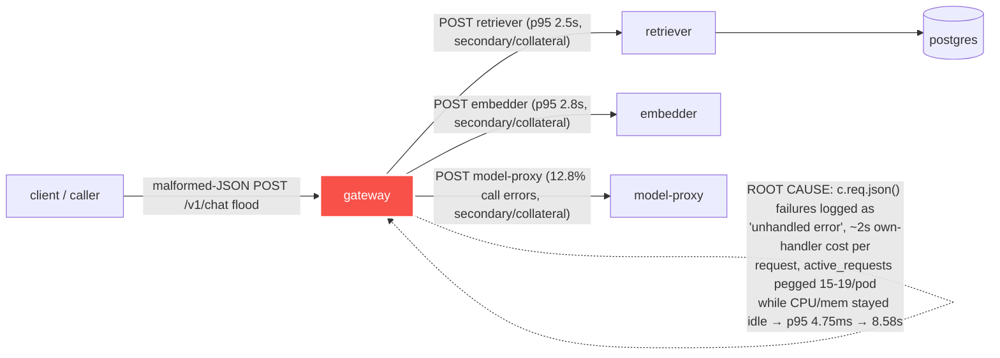

# Postmortem: gateway latency error budget burning fast (2% of the 28d budget in 1h; 5m & 1h windows)

- **Status:** resolved
- **Severity:** sev1
- **Verified:** no
- **Opened:** 2026-08-13 19:47:45Z
- **Resolved:** 2026-08-13 19:57:45Z

## Timeline (machine-generated)

All times UTC on 2026-08-13 unless a full date is shown.

| Time (UTC) | Source | Event |
| --- | --- | --- |
| 18:59:22Z | deploy:ci | CI run #123 success on main: obs: Merge pull request 'web: artifact panel expands inside the app layout' (#73) from artifact-panel-maximize into main |
| 18:59:31Z | deploy:ci | CI run #124 success on main: obs: Merge pull request 'web: the overview error rate filtered a label that does not exist' (#74) from fix/overview-erro |
| 19:44:03Z | log-spike | log-spike onset: [gateway] unhandled error: 16 \| } |
| 19:47:10Z | alert | alert firing: SLO gateway latency — fast burn |
| 19:47:10Z | alert | alert resolved: SLO gateway latency — fast burn |
| 19:48:06Z | k8s | ReplicaSet/retriever-65c474b46b: SuccessfulCreate |
| 19:48:06Z | k8s | Deployment/retriever: ScalingReplicaSet |
| 19:48:06Z | k8s | Pod/retriever-65c474b46b-bqqd9: Scheduled |
| 19:48:07Z | k8s | Pod/retriever-65c474b46b-bqqd9: Started |
| 19:48:07Z | k8s | Pod/retriever-65c474b46b-bqqd9: Pulled |
| 19:48:07Z | k8s | Pod/retriever-65c474b46b-bqqd9: Created |
| 19:48:15Z | k8s | Pod/retriever-d6d55bf7f-wfrd6: Killing |
| 19:48:15Z | k8s | ReplicaSet/retriever-d6d55bf7f: SuccessfulDelete |
| 19:48:15Z | k8s | Deployment/retriever: ScalingReplicaSet |

## Evidence links

- [Loki — logs over the incident window](http://localhost:3001/explore?schemaVersion=1&panes=%7B%22pm%22%3A+%7B%22datasource%22%3A+%22loki%22%2C+%22queries%22%3A+%5B%7B%22refId%22%3A+%22A%22%2C+%22datasource%22%3A+%7B%22type%22%3A+%22loki%22%2C+%22uid%22%3A+%22loki%22%7D%2C+%22expr%22%3A+%22%7Bnamespace%3D%5C%22subject%5C%22%7D+%7C~+%5C%22%28%3Fi%29error%7Cfailed%5C%22%22%7D%5D%2C+%22range%22%3A+%7B%22from%22%3A+%221786650465776%22%2C+%22to%22%3A+%221786651065706%22%7D%7D%7D&orgId=1)
- [Mimir — metrics over the incident window](http://localhost:3001/explore?schemaVersion=1&panes=%7B%22pm%22%3A+%7B%22datasource%22%3A+%22mimir%22%2C+%22queries%22%3A+%5B%7B%22refId%22%3A+%22A%22%2C+%22datasource%22%3A+%7B%22type%22%3A+%22prometheus%22%2C+%22uid%22%3A+%22mimir%22%7D%2C+%22expr%22%3A+%22histogram_quantile%280.95%2C+sum%28rate%28http_server_duration_milliseconds_bucket%5B5m%5D%29%29+by+%28le%29%29%22%7D%5D%2C+%22range%22%3A+%7B%22from%22%3A+%221786650465776%22%2C+%22to%22%3A+%221786651065706%22%7D%7D%7D&orgId=1)

## Investigation context

**Runbook match:** none — no tool narrowing applied for this alert. Available runbooks: README.md, canary-abort.md, ci-pipeline-red.md, dq-freshness-stall.md, gateway-high-error-rate.md, k8s-crashloop.md, k8s-node-failure.md, snapshot-agent-audit.md, stale-secret.md

Pre-check battery (as injected at run start)

## Pre-check leads

### recent_deploys — LEAD
1 deploy-window lead
- argo app platform: sync=OutOfSync health=Healthy (revision c025382ba170)

### log_spike — LEAD
error/failed log rate 200/10min vs baseline 0/10min (200x baseline) — onset: [gateway] unhandled error: 16 |         } at 2026-08-13T19:44:03.399220+00:00
- error/failed log rate 200/10min vs baseline 0/10min (200x baseline) — onset: [gateway] unhandled error: 16 |         } at 2026-08-13T19:44:03.399220+00:00

### attribution — LEAD
errors concentrate on gateway (24.0%); time concentrates in gateway's own handler (~4.7s of 7.5s) over the last 10m — which is not necessarily the workload named on the alert:
- gateway: 24.0% of its OWN responses are 5xx (10m)
- retriever: 20.7% of its OWN responses are 5xx (10m)
- model-proxy: 2.6% of its OWN responses are 5xx (10m)
- gateway → POST retriever: 22.4% of those outbound calls failed
- gateway → POST model-proxy: 12.8% of those outbound calls failed
- own-handler p95 (server p95 minus its slowest outbound call — a ranking, not a measurement): gateway ~4.7s of 7.5s end to end, embedder ~2.7s of 2.7s end to end, retriever ~2.5s of 2.5s end to end
- gateway → POST embedder: p95 2.8s outbound
- gateway → POST retriever: p95 2.5s outbound

### kube_scan — OK
all pods Ready, no notable cluster events

### rollout_state — OK
gateway and model-proxy rollouts stable, no failed analysis

### secret_age — OK
Secret subject-db-credentials last modified 19d 20h ago (created 19d 20h ago).

## Narrative

## Summary

Sev1 "SLO gateway latency — fast burn" fired for tenant test-bench (gateway p95 latency, 5m & 1h windows). Investigation found gateway's own request-handling path — not a downstream dependency — was the source: a sudden, sustained flood of malformed-JSON `POST /v1/chat` bodies caused every in-flight request to take seconds to fail instead of milliseconds, driving p95 latency from a steady 4.75ms baseline up to 8.6s (≈1800x) and burning the error budget fast. The incident self-resolved (traffic pattern reverted) before the proposed remediation could be executed — the operator denied the approval request, so no remediation action was taken by this agent.

## Impact

- gateway p95 latency: 4.75ms baseline → peak 8.58s (see attached report.html chart).
- gateway 5xx/error span ratio: 0% → ~20% at peak.
- `active_requests` per gateway pod pinned at 15–19 concurrent (baseline 0) while CPU (14–21m) and memory (~113–124Mi) stayed idle — a Little's-Law signature of requests queueing in-handler, not resource exhaustion.
- Over the worst minutes, essentially 100% of `/v1/chat` traffic was failing JSON validation (`POST /v1/chat status=ok` traces: 0 in a 10m window during the peak; "chat completed" success logs: 0 in the same window).
- Downstream retriever/model-proxy showed secondary error/latency signal (retriever 20.7% self-5xx, gateway→retriever 22.4% call failure) that is consistent with being collateral of the same congested gateway rather than an independent cause.

## Root cause

Evidence trail (`gateway-high-error-rate.md` runbook, step 1 — attribute by service before diagnosing):
- `traces_spanmetrics` error-ratio-by-service showed gateway indicting **itself** (24% of its own responses were errors), well above retriever (20.7%) and model-proxy (2.6%) — per the runbook this means "the gateway itself," not a downstream edge.
- Loki stack traces from all four gateway pods showed the same code path repeatedly, at high frequency: `c.req.json()` throwing inside Hono's validator (`hono@4.12.23/validator.js:21`), caught and re-thrown as `HTTPException(400, "Malformed JSON in request body")`, then logged by the app's own top-level handler as `[gateway] unhandled error`. Root Tempo spans for these requests ran 1.9–2.3s each even though the actual validator/JSON-parse sub-spans were only 1.7–5ms — the multi-second cost was incurred in-handler before/around the parse attempt, not in a downstream call.
- Ruled out: no gateway-affecting deploy near onset (`deploy_history`/`gitea_ci_runs` show only `apps/web` PRs #73/#74 merging around the alert time; gateway/retriever/model-proxy/embedder Argo apps are all Synced+Healthy at the same 6-day-old revision `c025382ba170`; the `platform` app's OutOfSync status is stale gitops drift unrelated to the serving path). No OOM or crashloop (`k8s_events` warning-level: empty; all pods Ready, 0 restarts on gateway). No stale secret (`subject-db-credentials` 19d old, healthy). No canary/rollout instability (`rollout_status gateway`: Healthy, 4/4, no abort, prior analysis runs all green at the same 4.75ms baseline).
- Conclusion: an external caller began sending a high-volume, sustained stream of malformed-JSON bodies to `POST /v1/chat`. Gateway's own request pipeline absorbed the cost of each failing parse for multiple seconds per request (mechanism consistent with per-pod request queueing/backpressure, not CPU/memory pressure, given both stayed idle throughout), and its error path additionally mislabels the resulting `HTTPException(400)` as an "unhandled error," which is itself worth fixing but was not the primary latency driver.

## What fixed it

Nothing executed by this agent. A remediation was proposed and dry-run (scale `deployment/gateway` 4→6 replicas, action_id `d5db051919d6266e`, diff `spec.replicas: 0 -> 6`) to add capacity against the observed per-pod concurrency saturation, but the operator **denied** the approval request. Per procedure, no retry was attempted. `alert_status` was re-queried afterward and reported the alert no longer active, with p95 back at 4.75ms and the error-span ratio back at 0% — the malformed-traffic source appears to have stopped on its own during the investigation window. The incident closed via natural recovery of the input traffic pattern, not an applied fix.

## Lessons

- Gateway needs a proper `onError` handler that recognizes `HTTPException` and returns the fast 400 without falling through to the "unhandled error" path — the current path's per-request cost (seconds, not milliseconds) is what let a request flood become a latency SLO incident instead of a harmless spike in 400s.
- Add rate limiting / early payload validation (e.g. reject on `Content-Length`/media-type before buffering, or a per-source request cap) at the edge so malformed-body floods can't consume gateway request-handling capacity at all.
- No runbook currently matches "SLO gateway latency — fast burn" directly; `gateway-high-error-rate.md`'s step-1 attribution query was the right tool anyway (it correctly named "the gateway itself" as the culprit) — worth cross-linking that runbook from the latency alert too so on-call doesn't have to guess.
- This incident is a good argument for an `active_requests`-vs-CPU panel on the gateway dashboard: it was the clearest signal that this was a queueing problem, not a resource problem, well before the deep trace dive.

