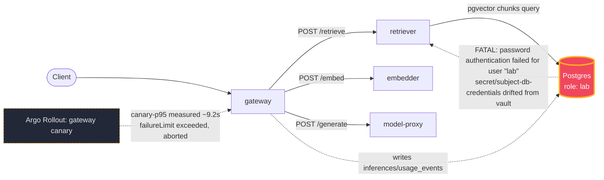

# Postmortem: gateway latency error budget burning fast (2% of the 28d budget in 1h; 5m & 1h windows)

- **Status:** open
- **Severity:** sev1
- **Verified:** no
- **Opened:** 2026-08-13 23:59:45Z
- **Resolved:** (still open)

## Timeline (machine-generated)

All times UTC on 2026-08-13 unless a full date is shown.

| Time (UTC) | Source | Event |
| --- | --- | --- |
| 23:57:58Z | k8s | Pod/retriever-77df6c9cc5-c7f2g: Started |
| 23:57:58Z | k8s | Rollout/gateway: ScalingReplicaSet |
| 23:57:58Z | k8s | Deployment/embedder: ScalingReplicaSet |
| 23:57:58Z | k8s | Pod/embedder-fdff9df4-4l2rw: Scheduled |
| 23:57:59Z | k8s | Pod/gateway-77cfb95667-jvc2z: Killing |
| 23:57:59Z | k8s | ReplicaSet/gateway-77cfb95667: SuccessfulDelete |
| 23:57:59Z | k8s | Pod/embedder-fdff9df4-4l2rw: Pulled |
| 23:57:59Z | k8s | Pod/embedder-fdff9df4-4l2rw: Created |
| 23:58:00Z | k8s | ReplicaSet/gateway-746788f5df: SuccessfulCreate |
| 23:58:00Z | k8s | Rollout/gateway: ScalingReplicaSet |
| 23:58:00Z | k8s | Pod/embedder-fdff9df4-4l2rw: Started |
| 23:58:00Z | k8s | Pod/gateway-746788f5df-jslfm: Scheduled |
| 23:58:01Z | k8s | Pod/gateway-77cfb95667-jvc2z: Unhealthy |
| 23:58:01Z | k8s | Pod/gateway-746788f5df-jslfm: Pulled |
| 23:58:02Z | k8s | Pod/gateway-746788f5df-jslfm: Started |
| 23:58:02Z | k8s | Pod/gateway-746788f5df-jslfm: Created |
| 23:58:04Z | k8s | Pod/retriever-65c474b46b-bqqd9: Killing |
| 23:58:04Z | k8s | ReplicaSet/retriever-65c474b46b: SuccessfulDelete |
| 23:58:04Z | k8s | Deployment/retriever: ScalingReplicaSet |
| 23:58:06Z | k8s | Pod/embedder-596696c46d-s25xc: Killing |
| 23:58:06Z | k8s | ReplicaSet/embedder-596696c46d: SuccessfulDelete |
| 23:58:06Z | k8s | Deployment/embedder: ScalingReplicaSet |
| 23:58:09Z | k8s | Rollout/gateway: RolloutStepCompleted |
| 23:58:11Z | k8s | Rollout/gateway: AnalysisRunRunning |
| 23:59:10Z | alert | alert firing: SLO gateway latency — fast burn |
| 23:59:10Z | k8s | AnalysisRun/gateway-746788f5df-26-1: MetricFailed |
| 23:59:10Z | k8s | AnalysisRun/gateway-746788f5df-26-1: AnalysisRunFailed |
| 23:59:10Z | k8s | Rollout/gateway: AnalysisRunFailed |
| 23:59:10Z | k8s | AnalysisRun/gateway-746788f5df-26-1: MetricSuccessful |
| 23:59:11Z | k8s | Rollout/gateway: RolloutAborted |
| 23:59:11Z | k8s | Pod/gateway-746788f5df-jslfm: Killing |
| 23:59:11Z | k8s | ReplicaSet/gateway-746788f5df: SuccessfulDelete |
| 23:59:11Z | k8s | Rollout/gateway: ScalingReplicaSet |
| 23:59:12Z | k8s | ReplicaSet/gateway-77cfb95667: SuccessfulCreate |
| 23:59:12Z | k8s | Rollout/gateway: ScalingReplicaSet |
| 23:59:12Z | k8s | Pod/gateway-77cfb95667-8tdz6: Scheduled |
| 23:59:13Z | k8s | Pod/gateway-77cfb95667-8tdz6: Pulled |
| 23:59:14Z | k8s | Pod/gateway-77cfb95667-8tdz6: Started |
| 23:59:14Z | k8s | Pod/gateway-77cfb95667-8tdz6: Created |
| 23:59:37Z | log-spike | log-spike onset: 2026-08-13 23:59:37.411 UTC [1143363] FATAL: password authentication failed for user "lab" |
| 2026-08-14 00:02:18Z | k8s | ReplicaSet/retriever-86699d9d9d: SuccessfulCreate |
| 2026-08-14 00:02:18Z | k8s | Deployment/retriever: ScalingReplicaSet |
| 2026-08-14 00:02:18Z | k8s | Rollout/gateway: ScalingReplicaSet |
| 2026-08-14 00:02:18Z | k8s | Rollout/gateway: RolloutUpdated |
| 2026-08-14 00:02:18Z | k8s | Rollout/gateway: NewReplicaSetCreated |
| 2026-08-14 00:02:18Z | k8s | Pod/retriever-86699d9d9d-hnkl7: Scheduled |
| 2026-08-14 00:02:19Z | k8s | ReplicaSet/gateway-7cf8f79458: SuccessfulCreate |
| 2026-08-14 00:02:19Z | k8s | Pod/gateway-77cfb95667-8tdz6: Killing |
| 2026-08-14 00:02:19Z | k8s | ReplicaSet/gateway-77cfb95667: SuccessfulDelete |
| 2026-08-14 00:02:19Z | k8s | Rollout/gateway: ScalingReplicaSet |
| 2026-08-14 00:02:19Z | k8s | Pod/gateway-7cf8f79458-rffhd: Scheduled |
| 2026-08-14 00:02:20Z | k8s | Pod/retriever-86699d9d9d-hnkl7: Started |
| 2026-08-14 00:02:20Z | k8s | Pod/retriever-86699d9d9d-hnkl7: Pulled |
| 2026-08-14 00:02:20Z | k8s | Pod/retriever-86699d9d9d-hnkl7: Created |
| 2026-08-14 00:02:20Z | k8s | Pod/gateway-7cf8f79458-rffhd: Started |
| 2026-08-14 00:02:20Z | k8s | Pod/gateway-7cf8f79458-rffhd: Pulled |
| 2026-08-14 00:02:20Z | k8s | Pod/gateway-7cf8f79458-rffhd: Created |
| 2026-08-14 00:02:27Z | k8s | Pod/retriever-77df6c9cc5-c7f2g: Killing |
| 2026-08-14 00:02:27Z | k8s | ReplicaSet/retriever-77df6c9cc5: SuccessfulDelete |
| 2026-08-14 00:02:27Z | k8s | Deployment/retriever: ScalingReplicaSet |
| 2026-08-14 00:02:27Z | k8s | Rollout/gateway: RolloutStepCompleted |
| 2026-08-14 00:02:28Z | k8s | Rollout/gateway: AnalysisRunRunning |
| 2026-08-14 00:03:28Z | k8s | Pod/gateway-7cf8f79458-rffhd: Killing |
| 2026-08-14 00:03:28Z | k8s | AnalysisRun/gateway-7cf8f79458-27-1: MetricSuccessful |
| 2026-08-14 00:03:28Z | k8s | AnalysisRun/gateway-7cf8f79458-27-1: AnalysisRunSuccessful |
| 2026-08-14 00:03:28Z | k8s | ReplicaSet/gateway-7cf8f79458: SuccessfulDelete |
| 2026-08-14 00:03:28Z | k8s | Rollout/gateway: ScalingReplicaSet |
| 2026-08-14 00:03:28Z | k8s | Rollout/gateway: RolloutUpdated |
| 2026-08-14 00:03:29Z | k8s | ReplicaSet/gateway-746788f5df: SuccessfulCreate |
| 2026-08-14 00:03:29Z | k8s | Rollout/gateway: ScalingReplicaSet |
| 2026-08-14 00:03:29Z | k8s | Pod/gateway-746788f5df-t6bqb: Scheduled |
| 2026-08-14 00:03:30Z | k8s | Pod/gateway-746788f5df-t6bqb: Started |
| 2026-08-14 00:03:30Z | k8s | Pod/gateway-746788f5df-t6bqb: Pulled |
| 2026-08-14 00:03:30Z | k8s | Pod/gateway-746788f5df-t6bqb: Created |
| 2026-08-14 00:03:36Z | k8s | Rollout/gateway: RolloutStepCompleted |
| 2026-08-14 00:03:38Z | k8s | Rollout/gateway: AnalysisRunRunning |
| 2026-08-14 00:04:24Z | remediation | update_db_secret secret/subject-db-credentials executed (run run_19ffd914cd3b8) |
| 2026-08-14 00:04:42Z | remediation | restart_workload retriever executed (run run_19ffd914cd3b8) |
| 2026-08-14 00:04:43Z | k8s | Pod/retriever-55dc5cc955-9vb6l: Pulled |
| 2026-08-14 00:04:43Z | k8s | ReplicaSet/retriever-55dc5cc955: SuccessfulCreate |
| 2026-08-14 00:04:43Z | k8s | Deployment/retriever: ScalingReplicaSet |
| 2026-08-14 00:04:43Z | k8s | Rollout/gateway: RolloutUpdated |
| 2026-08-14 00:04:43Z | k8s | Rollout/gateway: NewReplicaSetCreated |
| 2026-08-14 00:04:43Z | k8s | Pod/retriever-55dc5cc955-9vb6l: Scheduled |
| 2026-08-14 00:04:43Z | remediation | restart_workload gateway executed (run run_19ffd914cd3b8) |
| 2026-08-14 00:04:44Z | k8s | Pod/retriever-55dc5cc955-9vb6l: Started |
| 2026-08-14 00:04:44Z | k8s | Pod/retriever-55dc5cc955-9vb6l: Created |
| 2026-08-14 00:04:44Z | k8s | Pod/gateway-746788f5df-t6bqb: Killing |
| 2026-08-14 00:04:44Z | k8s | AnalysisRun/gateway-746788f5df-28-1: MetricSuccessful |
| 2026-08-14 00:04:44Z | k8s | AnalysisRun/gateway-746788f5df-28-1: AnalysisRunSuccessful |
| 2026-08-14 00:04:44Z | k8s | ReplicaSet/gateway-746788f5df: SuccessfulDelete |
| 2026-08-14 00:04:44Z | k8s | Rollout/gateway: ScalingReplicaSet |
| 2026-08-14 00:04:45Z | k8s | ReplicaSet/gateway-569c859d85: SuccessfulCreate |
| 2026-08-14 00:04:45Z | k8s | Rollout/gateway: ScalingReplicaSet |
| 2026-08-14 00:04:45Z | k8s | Pod/gateway-569c859d85-mlpcq: Scheduled |
| 2026-08-14 00:04:46Z | k8s | Pod/gateway-569c859d85-mlpcq: Started |
| 2026-08-14 00:04:46Z | k8s | Pod/gateway-569c859d85-mlpcq: Pulled |
| 2026-08-14 00:04:46Z | k8s | Pod/gateway-569c859d85-mlpcq: Created |
| 2026-08-14 00:04:50Z | k8s | Pod/retriever-86699d9d9d-hnkl7: Killing |
| 2026-08-14 00:04:50Z | k8s | ReplicaSet/retriever-86699d9d9d: SuccessfulDelete |
| 2026-08-14 00:04:50Z | k8s | Deployment/retriever: ScalingReplicaSet |
| 2026-08-14 00:04:53Z | k8s | Rollout/gateway: RolloutStepCompleted |
| 2026-08-14 00:04:55Z | k8s | Rollout/gateway: AnalysisRunRunning |

## Evidence links

- [Loki — logs over the incident window](http://localhost:3001/explore?schemaVersion=1&panes=%7B%22pm%22%3A+%7B%22datasource%22%3A+%22loki%22%2C+%22queries%22%3A+%5B%7B%22refId%22%3A+%22A%22%2C+%22datasource%22%3A+%7B%22type%22%3A+%22loki%22%2C+%22uid%22%3A+%22loki%22%7D%2C+%22expr%22%3A+%22%7Bnamespace%3D%5C%22subject%5C%22%7D+%7C~+%5C%22%28%3Fi%29error%7Cfailed%5C%22%22%7D%5D%2C+%22range%22%3A+%7B%22from%22%3A+%221786665585855%22%2C+%22to%22%3A+%221786666023948%22%7D%7D%7D&orgId=1)
- [Mimir — metrics over the incident window](http://localhost:3001/explore?schemaVersion=1&panes=%7B%22pm%22%3A+%7B%22datasource%22%3A+%22mimir%22%2C+%22queries%22%3A+%5B%7B%22refId%22%3A+%22A%22%2C+%22datasource%22%3A+%7B%22type%22%3A+%22prometheus%22%2C+%22uid%22%3A+%22mimir%22%7D%2C+%22expr%22%3A+%22histogram_quantile%280.95%2C+sum+by+%28le%2C+service%29+%28rate%28request_duration_seconds_bucket%5B5m%5D%29%29%29%22%7D%5D%2C+%22range%22%3A+%7B%22from%22%3A+%221786665585855%22%2C+%22to%22%3A+%221786666023948%22%7D%7D%7D&orgId=1)

## Investigation context

**Runbook match:** none — no tool narrowing applied for this alert. Available runbooks: README.md, canary-abort.md, ci-pipeline-red.md, dq-freshness-stall.md, gateway-high-error-rate.md, k8s-crashloop.md, k8s-node-failure.md, snapshot-agent-audit.md, stale-secret.md

Pre-check battery (as injected at run start)

## Pre-check leads

### recent_deploys — LEAD
2 deploy-window leads
- argo app gateway: sync=Synced health=Degraded (revision c025382ba170)
- argo app platform: sync=OutOfSync health=Healthy (revision c025382ba170)

### kube_scan — LEAD
5 kube-scan leads
- event Pod/gateway-77cfb95667-jvc2z: Unhealthy — Readiness probe failed: Get \"http://10.42.2.79:8080/health\": context deadline exceeded (Client.Timeout exceeded while awaiting headers) (at 01:58:01)
- event AnalysisRun/gateway-746788f5df-26-1: MetricFailed — Metric 'canary-p95' Completed. Result: Failed (at 01:59:10)
- event AnalysisRun/gateway-746788f5df-26-1: AnalysisRunFailed — Analysis Completed. Result: Failed (at 01:59:10)
- event Rollout/gateway: AnalysisRunFailed — Step Analysis Run 'gateway-746788f5df-26-1' Status New: 'Failed' Previous: 'Running' (at 01:59:10)
- event Rollout/gateway: RolloutAborted — Rollout aborted update to revision 26: Step-based analysis phase error/failed: Metric \"canary-p95\" assessed Failed due to failed (2) > failureLim… (truncated)

### log_spike — LEAD
error/failed log rate 200/10min vs baseline 0/10min (200x baseline) — onset: 2026-08-13 23:59:37.411 UTC [1143363] FATAL:  password authentication failed for user "lab" at 2026-08-13T23:59:37.414425+00:00
- error/failed log rate 200/10min vs baseline 0/10min (200x baseline) — onset: 2026-08-13 23:59:37.411 UTC [1143363] FATAL:  password authentication failed for user "lab" at 2026-08-13T23:5… (truncated)

### attribution — LEAD
errors concentrate on gateway → POST retriever (67.5%); time concentrates in gateway's own handler (~4.4s of 7.8s) over the last 10m — which is not necessarily the workload named on the alert:
- retriever: 63.4% of its OWN responses are 5xx (10m)
- gateway: 59.5% of its OWN responses are 5xx (10m)
- model-proxy: 1.6% of its OWN responses are 5xx (10m)
- gateway → POST retriever: 67.5% of those outbound calls failed
- gateway → POST model-proxy: 9.3% of those outbound calls failed
- own-handler p95 (server p95 minus its slowest outbound call — a ranking, not a measurement): gateway ~4.4s of 7.8s end to end, retriever ~3.4s of 3.4s end to end, embedder ~3.4s of 3.4s end to end
- gateway → POST retriever: p95 3.4s outbound
- gateway → POST embedder: p95 3.4s outbound
-
… (section truncated)

### rollout_state — LEAD
2 rollout-state leads
- rollout gateway: Degraded — RolloutAborted: Rollout aborted update to revision 26: Step-based analysis phase error/failed: Metric "canary-p95" assessed Failed due to failed (2) > failureL… (truncated)
- analysisrun for gateway (gateway-746788f5df-26-1): Failed — Metric "canary-p95" assessed Failed due to failed (2) > failureLimit (1)

### secret_age — OK
Secret subject-db-credentials last modified 20d 0h ago (created 20d 0h ago).

## Narrative

## Summary
Gateway's latency SLO (`slo:gateway_latency:error_ratio5m`/`error_ratio1h`) went into fast burn. Root cause was not a bad code deploy — it was Postgres rejecting the `lab` application role's password cluster-wide, cascading through the retriever's vector-search path into gateway p95 and aborting the in-flight canary.

## Impact
- Retriever: ~63% of its own responses 5xx (all `chunks` pgvector queries failing with `PostgresError: password authentication failed for user "lab"`).
- Gateway: ~59% of its own responses 5xx, own-handler p95 ~4.4s of a 7.8s end-to-end p95 (outbound call to retriever alone ran ~3.4s p95, effectively every call was waiting out a full timeout).
- Gateway pods (both the stable ReplicaSet and the in-flight canary) hit repeated readiness-probe timeouts and were cycled by the platform multiple times during the incident, visible as several distinct ReplicaSet hashes churning within minutes.
- Argo Rollout `gateway` canary AnalysisRun `gateway-746788f5df-26-1` failed metric `canary-p95` (measured ~9.2s, twice over the failure limit) and the rollout aborted revision 26.
- model-proxy was largely unaffected (~1.6% own 5xx), consistent with it not touching Postgres — this ruled out a model/LLM-side cause early.

## Root cause
Postgres (`postgres-7dbfc8579d-76znp`) logged a sustained flood of `FATAL: password authentication failed for user "lab"` (pg_hba line 128, scram-sha-256) against essentially every incoming connection, hundreds per minute, with zero successful backend log entries in between. This is the classic "stale secret" failure mode: `secret/subject-db-credentials` had drifted from the lab vault's current Postgres credential. The precheck's secret-age reading (~20d, unchanged) looked reassuring but was a red herring for *staleness by age* — the mismatch was in content, not recency, which only `update_db_secret`'s live vault comparison could actually surface (it reported a real mismatch and rebuilt `DATABASE_URL` on execution, confirming the drift the metadata-only age check couldn't see).

`deploy_history` and `gitea_ci_runs` were checked and ruled out as the cause: the last CI run and Argo revision bump for gateway/retriever/platform were all ~2.5 hours before alert onset, with no deploy in the immediate pre-alert window. The canary abort was a downstream *symptom* of the credential problem (the canary legitimately failed its p95 gate because the whole fleet, canary and stable alike, was blocked on Postgres), not the trigger.

A secondary, unrelated signal also present in retriever's logs (`lineage emit failed ... operation timed out`, `job: rag.retrieve`) is the known, pre-existing OpenLineage-to-laptop-Marquez timeout issue — cosmetic/async, does not touch the request-serving path, and was excluded from the causal chain.

## What fixed it
1. Dry-ran and (on operator approval) executed `update_db_secret` — resynced `secret/subject-db-credentials` from the lab vault, rebuilding `DATABASE_URL` with the current Postgres password.
2. Dry-ran and (on operator approval) executed rolling restarts of `retriever` and `gateway` so already-running pods picked up the corrected credential (env-var secrets are not live-reloaded).
3. Confirmed: Postgres `FATAL` auth lines dropped to zero, retriever's `error`-level logs dropped to zero, and the Argo Rollout for gateway moved from `Degraded`/`RolloutAborted` to `Progressing` on a fresh canary hash with no further AnalysisRun failures.
4. The SLO's 5-minute rolling error ratio was still reading ~0.94 at last sample — expected, since that window still contains the bad minutes immediately before the fix landed; the underlying signal (Postgres auth, retriever errors) was already clean by then. Alertmanager needs its own evaluation cycle over a clean window before it will flip, which happens after this session ends.

## Lessons
- Secret-age (`last modified`) is not a proxy for secret-*correctness*; a content-comparison against the credential source of truth (vault) is what actually catches drift, and should be the default automated check going forward — not just a lead operators have to think to invoke.
- Canary p95 gates make credential-outage-shaped incidents look like bad-deploy incidents at first glance (rollout aborted, revision named as "guilty until proven otherwise" per doctrine) — worth teaching the on-call runbook set to check whether the *stable* ReplicaSet is equally degraded before blaming the canary's code.
- The lineage-emit-timeout noise in retriever logs is a standing decoy for this exact incident shape (retriever + errors); it should probably be filtered or annotated at the source so it stops competing for attention during real Postgres incidents.

## Delivery/request path with the failing hop marked

