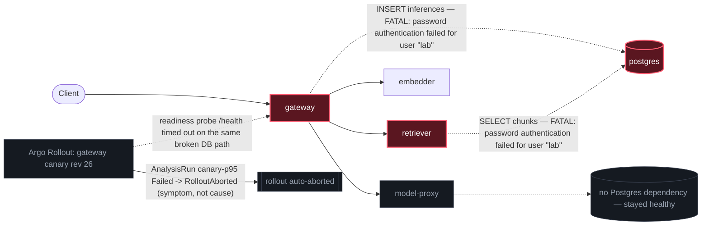

# Postmortem: gateway availability error budget burning fast (2% of the 28d budget in 1h; 5m & 1h windows)

- **Status:** open
- **Severity:** sev1
- **Verified:** no
- **Opened:** 2026-08-13 23:59:43Z
- **Resolved:** (still open)

## Timeline (machine-generated)

All times UTC on 2026-08-13 unless a full date is shown.

| Time (UTC) | Source | Event |
| --- | --- | --- |
| 23:57:56Z | k8s | ReplicaSet/retriever-77df6c9cc5: SuccessfulCreate |
| 23:57:56Z | k8s | Deployment/retriever: ScalingReplicaSet |
| 23:57:56Z | k8s | Pod/retriever-77df6c9cc5-c7f2g: Scheduled |
| 23:57:57Z | k8s | Rollout/gateway: RolloutUpdated |
| 23:57:57Z | k8s | Rollout/gateway: NewReplicaSetCreated |
| 23:57:58Z | k8s | Pod/retriever-77df6c9cc5-c7f2g: Started |
| 23:57:58Z | k8s | Pod/retriever-77df6c9cc5-c7f2g: Pulled |
| 23:57:58Z | k8s | Pod/retriever-77df6c9cc5-c7f2g: Created |
| 23:57:58Z | k8s | Rollout/gateway: ScalingReplicaSet |
| 23:57:58Z | k8s | Rollout/gateway: RolloutNotCompleted |
| 23:57:58Z | k8s | ReplicaSet/embedder-fdff9df4: SuccessfulCreate |
| 23:57:58Z | k8s | Deployment/embedder: ScalingReplicaSet |
| 23:57:58Z | k8s | Pod/embedder-fdff9df4-4l2rw: Scheduled |
| 23:57:59Z | k8s | Pod/gateway-77cfb95667-jvc2z: Killing |
| 23:57:59Z | k8s | ReplicaSet/gateway-77cfb95667: SuccessfulDelete |
| 23:57:59Z | k8s | Pod/embedder-fdff9df4-4l2rw: Pulled |
| 23:57:59Z | k8s | Pod/embedder-fdff9df4-4l2rw: Created |
| 23:58:00Z | k8s | ReplicaSet/gateway-746788f5df: SuccessfulCreate |
| 23:58:00Z | k8s | Rollout/gateway: ScalingReplicaSet |
| 23:58:00Z | k8s | Pod/embedder-fdff9df4-4l2rw: Started |
| 23:58:00Z | k8s | Pod/gateway-746788f5df-jslfm: Scheduled |
| 23:58:01Z | k8s | Pod/gateway-77cfb95667-jvc2z: Unhealthy |
| 23:58:01Z | k8s | Pod/gateway-746788f5df-jslfm: Pulled |
| 23:58:02Z | k8s | Pod/gateway-746788f5df-jslfm: Started |
| 23:58:02Z | k8s | Pod/gateway-746788f5df-jslfm: Created |
| 23:58:04Z | k8s | Pod/retriever-65c474b46b-bqqd9: Killing |
| 23:58:04Z | k8s | ReplicaSet/retriever-65c474b46b: SuccessfulDelete |
| 23:58:04Z | k8s | Deployment/retriever: ScalingReplicaSet |
| 23:58:06Z | k8s | Pod/embedder-596696c46d-s25xc: Killing |
| 23:58:06Z | k8s | ReplicaSet/embedder-596696c46d: SuccessfulDelete |
| 23:58:06Z | k8s | Deployment/embedder: ScalingReplicaSet |
| 23:58:09Z | k8s | Rollout/gateway: RolloutStepCompleted |
| 23:58:11Z | k8s | Rollout/gateway: AnalysisRunRunning |
| 23:59:10Z | alert | alert firing: SLO gateway availability — fast burn |
| 23:59:10Z | k8s | AnalysisRun/gateway-746788f5df-26-1: MetricFailed |
| 23:59:10Z | k8s | AnalysisRun/gateway-746788f5df-26-1: AnalysisRunFailed |
| 23:59:10Z | k8s | Rollout/gateway: AnalysisRunFailed |
| 23:59:10Z | k8s | AnalysisRun/gateway-746788f5df-26-1: MetricSuccessful |
| 23:59:11Z | k8s | Rollout/gateway: RolloutAborted |
| 23:59:11Z | k8s | Pod/gateway-746788f5df-jslfm: Killing |
| 23:59:11Z | k8s | ReplicaSet/gateway-746788f5df: SuccessfulDelete |
| 23:59:11Z | k8s | Rollout/gateway: ScalingReplicaSet |
| 23:59:12Z | k8s | ReplicaSet/gateway-77cfb95667: SuccessfulCreate |
| 23:59:12Z | k8s | Rollout/gateway: ScalingReplicaSet |
| 23:59:12Z | k8s | Pod/gateway-77cfb95667-8tdz6: Scheduled |
| 23:59:13Z | k8s | Pod/gateway-77cfb95667-8tdz6: Pulled |
| 23:59:14Z | k8s | Pod/gateway-77cfb95667-8tdz6: Started |
| 23:59:14Z | k8s | Pod/gateway-77cfb95667-8tdz6: Created |
| 23:59:36Z | log-spike | log-spike onset: [gateway] inference record failed: Failed query: insert into "inferences" ("id", "run_id", "tenant", "model", "prompt_chars", "prompt_tokens", "completion_tokens", "retrieved_count", "retrieval_score_mean", "retrieval_scor… |
| 2026-08-14 00:01:53Z | remediation | update_db_secret secret/subject-db-credentials executed (run run_19ffd914215b3) |
| 2026-08-14 00:02:17Z | remediation | restart_workload gateway executed (run run_19ffd914215b3) |
| 2026-08-14 00:02:18Z | k8s | ReplicaSet/retriever-86699d9d9d: SuccessfulCreate |
| 2026-08-14 00:02:18Z | k8s | Deployment/retriever: ScalingReplicaSet |
| 2026-08-14 00:02:18Z | k8s | Rollout/gateway: ScalingReplicaSet |
| 2026-08-14 00:02:18Z | k8s | Rollout/gateway: RolloutUpdated |
| 2026-08-14 00:02:18Z | k8s | Rollout/gateway: NewReplicaSetCreated |
| 2026-08-14 00:02:18Z | k8s | Pod/retriever-86699d9d9d-hnkl7: Scheduled |
| 2026-08-14 00:02:18Z | remediation | restart_workload retriever executed (run run_19ffd914215b3) |
| 2026-08-14 00:02:19Z | k8s | ReplicaSet/gateway-7cf8f79458: SuccessfulCreate |
| 2026-08-14 00:02:19Z | k8s | Pod/gateway-77cfb95667-8tdz6: Killing |
| 2026-08-14 00:02:19Z | k8s | ReplicaSet/gateway-77cfb95667: SuccessfulDelete |
| 2026-08-14 00:02:19Z | k8s | Rollout/gateway: ScalingReplicaSet |
| 2026-08-14 00:02:19Z | k8s | Pod/gateway-7cf8f79458-rffhd: Scheduled |
| 2026-08-14 00:02:20Z | k8s | Pod/retriever-86699d9d9d-hnkl7: Started |
| 2026-08-14 00:02:20Z | k8s | Pod/retriever-86699d9d9d-hnkl7: Pulled |
| 2026-08-14 00:02:20Z | k8s | Pod/retriever-86699d9d9d-hnkl7: Created |
| 2026-08-14 00:02:20Z | k8s | Pod/gateway-7cf8f79458-rffhd: Started |
| 2026-08-14 00:02:20Z | k8s | Pod/gateway-7cf8f79458-rffhd: Pulled |
| 2026-08-14 00:02:20Z | k8s | Pod/gateway-7cf8f79458-rffhd: Created |
| 2026-08-14 00:02:27Z | k8s | Pod/retriever-77df6c9cc5-c7f2g: Killing |
| 2026-08-14 00:02:27Z | k8s | ReplicaSet/retriever-77df6c9cc5: SuccessfulDelete |
| 2026-08-14 00:02:27Z | k8s | Deployment/retriever: ScalingReplicaSet |
| 2026-08-14 00:02:27Z | k8s | Rollout/gateway: RolloutStepCompleted |
| 2026-08-14 00:02:28Z | k8s | Rollout/gateway: AnalysisRunRunning |
| 2026-08-14 00:03:28Z | k8s | Pod/gateway-7cf8f79458-rffhd: Killing |
| 2026-08-14 00:03:28Z | k8s | AnalysisRun/gateway-7cf8f79458-27-1: MetricSuccessful |
| 2026-08-14 00:03:28Z | k8s | AnalysisRun/gateway-7cf8f79458-27-1: AnalysisRunSuccessful |
| 2026-08-14 00:03:28Z | k8s | ReplicaSet/gateway-7cf8f79458: SuccessfulDelete |
| 2026-08-14 00:03:28Z | k8s | Rollout/gateway: ScalingReplicaSet |
| 2026-08-14 00:03:28Z | k8s | Rollout/gateway: RolloutUpdated |
| 2026-08-14 00:03:29Z | k8s | ReplicaSet/gateway-746788f5df: SuccessfulCreate |
| 2026-08-14 00:03:29Z | k8s | Rollout/gateway: ScalingReplicaSet |
| 2026-08-14 00:03:29Z | k8s | Pod/gateway-746788f5df-t6bqb: Scheduled |
| 2026-08-14 00:03:30Z | k8s | Pod/gateway-746788f5df-t6bqb: Started |
| 2026-08-14 00:03:30Z | k8s | Pod/gateway-746788f5df-t6bqb: Pulled |
| 2026-08-14 00:03:30Z | k8s | Pod/gateway-746788f5df-t6bqb: Created |
| 2026-08-14 00:03:36Z | k8s | Rollout/gateway: RolloutStepCompleted |
| 2026-08-14 00:03:38Z | k8s | Rollout/gateway: AnalysisRunRunning |

## Evidence links

- [Loki — logs over the incident window](http://localhost:3001/explore?schemaVersion=1&panes=%7B%22pm%22%3A+%7B%22datasource%22%3A+%22loki%22%2C+%22queries%22%3A+%5B%7B%22refId%22%3A+%22A%22%2C+%22datasource%22%3A+%7B%22type%22%3A+%22loki%22%2C+%22uid%22%3A+%22loki%22%7D%2C+%22expr%22%3A+%22%7Bnamespace%3D%5C%22subject%5C%22%7D+%7C~+%5C%22%28%3Fi%29error%7Cfailed%5C%22%22%7D%5D%2C+%22range%22%3A+%7B%22from%22%3A+%221786665583082%22%2C+%22to%22%3A+%221786665829187%22%7D%7D%7D&orgId=1)
- [Mimir — metrics over the incident window](http://localhost:3001/explore?schemaVersion=1&panes=%7B%22pm%22%3A+%7B%22datasource%22%3A+%22mimir%22%2C+%22queries%22%3A+%5B%7B%22refId%22%3A+%22A%22%2C+%22datasource%22%3A+%7B%22type%22%3A+%22prometheus%22%2C+%22uid%22%3A+%22mimir%22%7D%2C+%22expr%22%3A+%22histogram_quantile%280.95%2C+sum+by+%28le%2C+service%29+%28rate%28request_duration_seconds_bucket%5B5m%5D%29%29%29%22%7D%5D%2C+%22range%22%3A+%7B%22from%22%3A+%221786665583082%22%2C+%22to%22%3A+%221786665829187%22%7D%7D%7D&orgId=1)

## Investigation context

**Runbook match (2):** `gateway-high-error-rate.md`, `stale-secret.md` — toolset narrowed to 14 tools: alert_status, deploy_history, k8s_events, kubectl_read, loki_query, mimir_query, publish_postmortem, request_approval, restart_workload, runbook_lookup, runbook_read, save_artifact, tempo_query, update_db_secret

Pre-check battery (as injected at run start)

## Pre-check leads

### recent_deploys — LEAD
2 deploy-window leads
- argo app gateway: sync=Synced health=Degraded (revision c025382ba170)
- argo app platform: sync=OutOfSync health=Healthy (revision c025382ba170)

### kube_scan — LEAD
5 kube-scan leads
- event Pod/gateway-77cfb95667-jvc2z: Unhealthy — Readiness probe failed: Get \"http://10.42.2.79:8080/health\": context deadline exceeded (Client.Timeout exceeded while awaiting headers) (at 01:58:01)
- event AnalysisRun/gateway-746788f5df-26-1: MetricFailed — Metric 'canary-p95' Completed. Result: Failed (at 01:59:10)
- event AnalysisRun/gateway-746788f5df-26-1: AnalysisRunFailed — Analysis Completed. Result: Failed (at 01:59:10)
- event Rollout/gateway: AnalysisRunFailed — Step Analysis Run 'gateway-746788f5df-26-1' Status New: 'Failed' Previous: 'Running' (at 01:59:10)
- event Rollout/gateway: RolloutAborted — Rollout aborted update to revision 26: Step-based analysis phase error/failed: Metric \"canary-p95\" assessed Failed due to failed (2) > failureLim… (truncated)

### log_spike — LEAD
error/failed log rate 200/10min vs baseline 0/10min (200x baseline) — onset: [gateway] inference record failed: Failed query: insert into "inferences" ("id", "run_id", "tenant", "model", "prompt_chars", "prompt_tokens", "completion_tokens", "retrieved_count", "retrieval_score_mean", "retrieval_score_max", "cache_hit", "status", "response", "created_at") values (default, $1, $2, $3, $4, $5, $6, $7, $8, $9, $10, $11, $12, default) at 2026-08-13T23:59:36.161403+00:00
- error/failed log rate 200/10min vs baseline 0/10min (200x baseline) — onset: [gateway] inference record failed: Failed query: insert into "inferences" ("id", "run_id", "tenant", "model",… (truncated)

### attribution — LEAD
errors concentrate on gateway → POST retriever (67.6%); time concentrates in gateway's own handler (~4.4s of 7.8s) over the last 10m — which is not necessarily the workload named on the alert:
- retriever: 63.6% of its OWN responses are 5xx (10m)
- gateway: 59.8% of its OWN responses are 5xx (10m)
- model-proxy: 1.6% of its OWN responses are 5xx (10m)
- gateway → POST retriever: 67.6% of those outbound calls failed
- gateway → POST model-proxy: 9.3% of those outbound calls failed
- own-handler p95 (server p95 minus its slowest outbound call — a ranking, not a measurement): gateway ~4.4s of 7.8s end to end, retriever ~3.4s of 3.4s end to end, embedder ~3.4s of 3.4s end to end
- gateway → POST retriever: p95 3.4s outbound
- gateway → POST embedder: p95 3.4s outbound
-
… (section truncated)

### rollout_state — LEAD
2 rollout-state leads
- rollout gateway: Degraded — RolloutAborted: Rollout aborted update to revision 26: Step-based analysis phase error/failed: Metric "canary-p95" assessed Failed due to failed (2) > failureL… (truncated)
- analysisrun for gateway (gateway-746788f5df-26-1): Failed — Metric "canary-p95" assessed Failed due to failed (2) > failureLimit (1)

### secret_age — OK
Secret subject-db-credentials last modified 20d 0h ago (created 20d 0h ago).

## Narrative

## Summary

`SLO gateway availability — fast burn` fired because the gateway's error budget started burning at 5xx rates over 50% (peaking ~82%), driven by Postgres rejecting the shared database credential (`user "lab"`) for every long-running pod still holding the old password.

## Impact

Any request that touched Postgres failed: gateway's `insert into "inferences"` write on every completed request, and retriever's own chunk lookups. Both services independently logged `PostgresError: password authentication failed for user "lab"` at the same moment, and gateway's own service-level 5xx rate and retriever's own service-level 5xx rate spiked together (mimir: gateway ~55-58%, retriever ~58%, model-proxy ~2.6% — model-proxy was unaffected, consistent with it not touching Postgres directly). An in-flight gateway canary rollout (revision 26) was a bystander: its readiness probes started timing out (`/health` hit the same broken DB path) and Argo Rollouts' `canary-p95` analysis failed and auto-aborted the rollout — a downstream symptom, not the trigger.

## Root cause

A Postgres credential rotation happened out-of-band (rotated at the database/vault level) without the Kubernetes `Secret/subject-db-credentials` being updated to match. The pre-incident `secret_age` check showing the Secret object itself unmodified for 20 days is exactly what this failure mode looks like — the Secret object never changes because the rotation happens at the vault/DB, not through the Secret. The affected gateway and retriever pods had been running for well over a day (gateway pod start time predates the incident by ~34h) and were still holding the stale password in their environment, which Kubernetes never refreshes on a live pod when a referenced Secret's backing value changes underneath it.

`deploy_history` showed no gateway/retriever code deploy in the incident window — the most recent CI run landed over two hours earlier and merged cleanly — so this was **not** a bad-deploy regression; it correlates cleanly with the credential rotation, not a code change.

## What fixed it

1. `update_db_secret` (dry-run confirmed a rotated credential was waiting in the vault) — approved and executed to sync `secret/subject-db-credentials` with the current Postgres password.
2. `restart_workload` for `gateway` and `retriever` (both approved, both executed) — rolling restarts so new pods pick up the refreshed credential on start, per the runbook's "secret sync alone does not fix a live pod" guidance.

The gateway service 5xx rate was falling through the rolling restart window (peak ~82% → 48% → 15% as pods cycled) at the time of this report; the alert had not yet flipped to resolved in Alertmanager, which is expected — the rollout was only partway through replacing the fleet (1 of 4 gateway pods on the new template ~15s after the restart was issued) and Alertmanager needs a full evaluation cycle after the fleet is clean. Recovery is trending correctly but not yet confirmed complete from this session; the closing check happens server-side after this session ends.

## Lessons

- `secret_age` on the Secret object is not a reliable "nothing rotated" signal when rotation can happen at the vault/DB layer without touching the Secret — the stale-secret runbook's real tell was the sudden, simultaneous `password authentication failed` fatal across every Postgres-dependent service, not the Secret's own mtime.
- The concurrent canary rollout abort was a plausible-looking distractor (AnalysisRun failed, RolloutAborted, readiness probe timeouts) that pattern-matches "bad deploy" — but `deploy_history` ruled that out cleanly and the same DB auth failure fully explains the readiness-probe timeouts, so no separate rollout remediation (undo/abort) was needed.
- Model-proxy's near-zero error rate throughout was itself useful evidence: it doesn't call Postgres, so its health is what let the blast radius be scoped to "Postgres-dependent services" rather than "everything downstream of gateway."

Root cause lives on the `gateway/retriever → postgres` edge (stale credential), not inside gateway's or retriever's own code, and not in the concurrent canary rollout.
