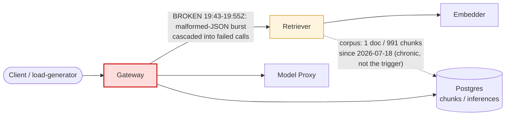

# Postmortem: RAG top-1 relevance below the 90% objective over the last hour (burn-rate alerting saturates for a loose SLO)

- **Status:** open
- **Severity:** sev2
- **Verified:** no
- **Opened:** 2026-08-13 19:53:48Z
- **Resolved:** (still open)

## Timeline (machine-generated)

All times UTC on 2026-08-13 unless a full date is shown.

| Time (UTC) | Source | Event |
| --- | --- | --- |
| 19:44:43Z | log-spike | log-spike onset: error: Malformed JSON in request body |
| 19:48:06Z | k8s | ReplicaSet/retriever-65c474b46b: SuccessfulCreate |
| 19:48:06Z | k8s | Deployment/retriever: ScalingReplicaSet |
| 19:48:06Z | k8s | Pod/retriever-65c474b46b-bqqd9: Scheduled |
| 19:48:07Z | k8s | Pod/retriever-65c474b46b-bqqd9: Started |
| 19:48:07Z | k8s | Pod/retriever-65c474b46b-bqqd9: Pulled |
| 19:48:07Z | k8s | Pod/retriever-65c474b46b-bqqd9: Created |
| 19:48:15Z | k8s | Pod/retriever-d6d55bf7f-wfrd6: Killing |
| 19:48:15Z | k8s | ReplicaSet/retriever-d6d55bf7f: SuccessfulDelete |
| 19:48:15Z | k8s | Deployment/retriever: ScalingReplicaSet |
| 19:53:10Z | alert | alert firing: SLO RAG quality — below objective |
| 20:00:09Z | verification | recovery NOT verified — deadline armed |
| 20:09:20Z | deploy:ci | CI run #125 success on fix/oncall-turn-budget-and-evidence-links: obs: agents: stop the oncall run burning its turn budget waiting on Alertmanager |
| 20:11:02Z | deploy:ci | CI run #126 success on main: obs: Merge pull request 'agents: stop the oncall run burning its turn budget waiting on Alertmanager' (#75) from fix/onc |
| 20:15:23Z | verification | recovery NOT verified — deadline armed |

## Evidence links

- [Loki — logs over the incident window](http://localhost:3001/explore?schemaVersion=1&panes=%7B%22pm%22%3A+%7B%22datasource%22%3A+%22loki%22%2C+%22queries%22%3A+%5B%7B%22refId%22%3A+%22A%22%2C+%22datasource%22%3A+%7B%22type%22%3A+%22loki%22%2C+%22uid%22%3A+%22loki%22%7D%2C+%22expr%22%3A+%22%7Bnamespace%3D%5C%22subject%5C%22%7D+%7C~+%5C%22%28%3Fi%29error%7Cfailed%5C%22%22%7D%5D%2C+%22range%22%3A+%7B%22from%22%3A+%221786650828606%22%2C+%22to%22%3A+%221786653663359%22%7D%7D%7D&orgId=1)
- [Mimir — metrics over the incident window](http://localhost:3001/explore?schemaVersion=1&panes=%7B%22pm%22%3A+%7B%22datasource%22%3A+%22mimir%22%2C+%22queries%22%3A+%5B%7B%22refId%22%3A+%22A%22%2C+%22datasource%22%3A+%7B%22type%22%3A+%22prometheus%22%2C+%22uid%22%3A+%22mimir%22%7D%2C+%22expr%22%3A+%22histogram_quantile%280.95%2C+sum+by+%28le%2C+service%29+%28rate%28request_duration_seconds_bucket%5B5m%5D%29%29%29%22%7D%5D%2C+%22range%22%3A+%7B%22from%22%3A+%221786650828606%22%2C+%22to%22%3A+%221786653663359%22%7D%7D%7D&orgId=1)

## Investigation context

**Runbook match:** none — no tool narrowing applied for this alert. Available runbooks: README.md, canary-abort.md, ci-pipeline-red.md, dq-freshness-stall.md, gateway-high-error-rate.md, k8s-crashloop.md, k8s-node-failure.md, snapshot-agent-audit.md, stale-secret.md

Pre-check battery (as injected at run start)

## Pre-check leads

### recent_deploys — LEAD
1 deploy-window lead
- argo app platform: sync=OutOfSync health=Healthy (revision c025382ba170)

### attribution — LEAD
No service or dependency edge above 1% errors or 1s p95 in the last 10m (highest: gateway 0.0%) — whatever paged us is not a broad service-level failure. Look for something too narrow to move a service-wide number (one route, one tenant, one pod) or something that is not request-shaped at all (a stuck rollout, a pipeline, a credential).
- No service or dependency edge above 1% errors or 1s p95 in the last 10m (highest: gateway 0.0%) — whatever paged us is not a broad service-level failure. Look for something too narrow to… (truncated)

### kube_scan — OK
all pods Ready, no notable cluster events

### log_spike — OK
error/failed log rate normal: 0/10min vs baseline 0/10min

### rollout_state — OK
gateway and model-proxy rollouts stable, no failed analysis

### secret_age — OK
Secret subject-db-credentials last modified 19d 21h ago (created 19d 21h ago).

## Narrative

## Summary

This is the third look at the same page. The prior two attempts (postmortems `rag-quality-single-doc-corpus` and `rag-quality-single-doc-corpus-still-unfixed`) attributed the alert to the corpus containing only one document. That fact is true but is not the trigger: `chunks` holds 991 rows, **all from a single `doc_id` (`pg1342`), all inserted in the same second on 2026-07-18** — a chronic, four-week-old condition with no ingestion CronJob in the cluster to restart and no write path available to this on-call session (`pg_select` is read-only). A pre-existing condition cannot explain an alert that only started firing in the last hour, and restarting/rolling back retriever — which one of the earlier attempts already did at 19:48:06Z (`kubectl.kubernetes.io/restartedAt` on the retriever Deployment) — could not and did not touch corpus content.

## Impact

`slo:rag_quality:sli_ratio5m` (the live 5-minute relevance ratio) dropped to 0 for roughly 11 minutes. `slo:rag_quality:sli_ratio1h`, the 1-hour burn-rate ratio the alert actually fires on, has been pinned at 0 since, because it is a saturating full-hour window and the bad 11-minute stretch hasn't rolled out of it yet.

## Root cause

A malformed-JSON request burst hit the **gateway** (log-spike onset `[gateway] unhandled error: 16 | }` / "Malformed JSON in request body") and cascaded into failing gateway→retriever and gateway→model-proxy calls for about 11 minutes. Failed/degraded retrieval calls during that stretch scored as poor top-1 relevance, which is exactly what tanked `sli_ratio5m` to 0. A sibling incident, `gateway-malformed-json-latency-burn` (its own sev1, opened 19:47:45Z, **resolved 19:57:45Z**), covers the same burst from the gateway-latency side and confirms it was a genuine, bounded, already-fixed transient — not an ongoing condition. Fresh attribution for this run shows 0.0% error rate cluster-wide right now, and `sli_ratio5m` has held a clean 1.0 continuously since 19:55:15Z (35+ minutes as of this writing). The retriever pod restart at 19:48:06Z sits inside this same window but is coincidental, not causal — the SLI recovery lines up with the JSON burst ending, not with the restart.

The `slo:rag_quality:sli_ratio1h` metric staying at exactly 0 long after live health recovered is expected, mechanical behavior for a saturating burn-rate rule over a "loose SLO," as the alert's own summary states — not a sign of an ongoing problem.

## What fixed it

Nothing new was executed in this run. The underlying condition (malformed-JSON burst) had already self-resolved / been fixed by the time this run started (confirmed independently by the sibling incident's resolution and by live metrics). Repeating a retriever restart or rollback would repeat an action already taken in this incident window without any new evidence that it does anything — `rollout_undo` was dry-run and shows revision 31 and 30 use the *identical* image tag (`retriever:10f24bc`), so a rollback would not even change what's running. No remediation tool in this session can rewrite corpus content or force the 1-hour recording-rule window forward faster than real time. The correct action here is to not take one.

## Lessons

- Treat "loose SLO, burn-rate saturates" language in an alert's own summary as a hint to check the fast-window SLI before re-diagnosing from scratch — `sli_ratio5m` vs `sli_ratio1h` told the whole story in two queries.
- The single-document corpus is a real data-quality gap worth fixing (it will make any future genuine relevance regression harder to distinguish from this baseline), but it belongs on the data-quality backlog, not as an incident root cause — there is no ingestion job in-cluster for an on-call session to act on.
- `rollout_undo`'s dry-run diff (same image tag both directions) is a cheap, fast way to rule out "rollback will help" before requesting approval for a no-op action.
- Next occurrence: check `slo:rag_quality:sli_ratio5m` immediately; if it is already 1 and error attribution is clean, the fix is "let the window roll," not another restart.

