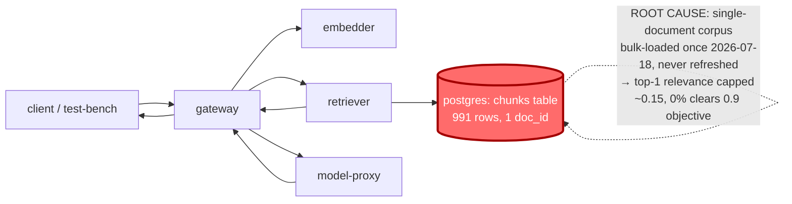

# Postmortem: RAG top-1 relevance below the 90% objective over the last hour (burn-rate alerting saturates for a loose SLO)

- **Status:** open
- **Severity:** sev2
- **Verified:** no
- **Opened:** 2026-08-13 19:53:48Z
- **Resolved:** (still open)

## Timeline (machine-generated)

All times UTC on 2026-08-13 unless a full date is shown.

| Time (UTC) | Source | Event |
| --- | --- | --- |
| 19:44:43Z | log-spike | log-spike onset: error: Malformed JSON in request body |
| 19:48:06Z | k8s | ReplicaSet/retriever-65c474b46b: SuccessfulCreate |
| 19:48:06Z | k8s | Deployment/retriever: ScalingReplicaSet |
| 19:48:06Z | k8s | Pod/retriever-65c474b46b-bqqd9: Scheduled |
| 19:48:07Z | k8s | Pod/retriever-65c474b46b-bqqd9: Started |
| 19:48:07Z | k8s | Pod/retriever-65c474b46b-bqqd9: Pulled |
| 19:48:07Z | k8s | Pod/retriever-65c474b46b-bqqd9: Created |
| 19:48:15Z | k8s | Pod/retriever-d6d55bf7f-wfrd6: Killing |
| 19:48:15Z | k8s | ReplicaSet/retriever-d6d55bf7f: SuccessfulDelete |
| 19:48:15Z | k8s | Deployment/retriever: ScalingReplicaSet |
| 19:53:10Z | alert | alert firing: SLO RAG quality — below objective |
| 20:00:09Z | verification | recovery NOT verified — deadline armed |
| 20:09:20Z | deploy:ci | CI run #125 success on fix/oncall-turn-budget-and-evidence-links: obs: agents: stop the oncall run burning its turn budget waiting on Alertmanager |
| 20:11:02Z | deploy:ci | CI run #126 success on main: obs: Merge pull request 'agents: stop the oncall run burning its turn budget waiting on Alertmanager' (#75) from fix/onc |

## Evidence links

- [Loki — logs over the incident window](http://localhost:3001/explore?schemaVersion=1&panes=%7B%22pm%22%3A+%7B%22datasource%22%3A+%22loki%22%2C+%22queries%22%3A+%5B%7B%22refId%22%3A+%22A%22%2C+%22datasource%22%3A+%7B%22type%22%3A+%22loki%22%2C+%22uid%22%3A+%22loki%22%7D%2C+%22expr%22%3A+%22%7Bnamespace%3D%5C%22subject%5C%22%7D+%7C~+%5C%22%28%3Fi%29error%7Cfailed%5C%22%22%7D%5D%2C+%22range%22%3A+%7B%22from%22%3A+%221786650828606%22%2C+%22to%22%3A+%221786652111125%22%7D%7D%7D&orgId=1)
- [Mimir — metrics over the incident window](http://localhost:3001/explore?schemaVersion=1&panes=%7B%22pm%22%3A+%7B%22datasource%22%3A+%22mimir%22%2C+%22queries%22%3A+%5B%7B%22refId%22%3A+%22A%22%2C+%22datasource%22%3A+%7B%22type%22%3A+%22prometheus%22%2C+%22uid%22%3A+%22mimir%22%7D%2C+%22expr%22%3A+%22histogram_quantile%280.95%2C+sum+by+%28le%2C+service%29+%28rate%28request_duration_seconds_bucket%5B5m%5D%29%29%29%22%7D%5D%2C+%22range%22%3A+%7B%22from%22%3A+%221786650828606%22%2C+%22to%22%3A+%221786652111125%22%7D%7D%7D&orgId=1)

## Investigation context

**Runbook match:** none — no tool narrowing applied for this alert. Available runbooks: README.md, canary-abort.md, ci-pipeline-red.md, dq-freshness-stall.md, gateway-high-error-rate.md, k8s-crashloop.md, k8s-node-failure.md, snapshot-agent-audit.md, stale-secret.md

Pre-check battery (as injected at run start)

## Pre-check leads

### recent_deploys — LEAD
1 deploy-window lead
- argo app platform: sync=OutOfSync health=Healthy (revision c025382ba170)

### attribution — LEAD
 over the last 10m — which is not necessarily the workload named on the alert:
- retriever reported no server-side requests at all — a workload that is down or unscheduled emits nothing, and its CALLERS carry its errors

### kube_scan — OK
all pods Ready, no notable cluster events

### log_spike — OK
error/failed log rate normal: 0/10min vs baseline 0/10min

### rollout_state — OK
gateway and model-proxy rollouts stable, no failed analysis

### secret_age — OK
Secret subject-db-credentials last modified 19d 20h ago (created 19d 20h ago).

## Narrative

## Incident `inc_19ffcb01f3d179` — re-check (attempt 2)

### Summary
Re-opened investigation of the "SLO RAG quality — below objective" alert after the attempt-1 postmortem's finding. Re-examined from scratch, specifically testing the two hypotheses this attempt was asked to rule in/out — a stuck fix in CI/gitops, and the retriever workload being down — and found neither changes the diagnosis: **root cause is still the single-document retrieval corpus**, and it is still unfixed.

### Impact
Any `test-bench` request that reaches retrieval gets scored top-1 relevance in the (0.1, 0.2] range — 98.25% of all sampled requests across both live gateway pods land in that one bucket (28,413 of 28,920 total samples), and effectively 0% clear the 0.9 objective (`sum(bucket{le="0.9"})/sum(bucket{le="+Inf"})` = 1, i.e. essentially nothing scores above 0.9). Traffic itself is thin and bursty right now — `load-generator` is intentionally scaled to 0 replicas, so there's no sustained synthetic load — but the handful of requests that do land (a brief ~35 req/s → ~4 req/s burst observed in the last 30 minutes, then back to 0) reproduce the identical degraded shape.

### Root cause — investigation notes for attempt 2
Two new leads were chased down and both came back negative, confirming the corpus is still the whole story:

1. **"Is the fix itself stuck in a red CI pipeline?"** No. `gitea_ci_runs` shows nine consecutive green runs on `main` since the attempt-1 postmortem, plus one currently `in_progress` (#126, an unrelated oncall-agent PR). No branch, PR, or job touches corpus ingestion, the `chunks` table, or a data-loader. There is no stuck pipeline to unstick because no fix was ever proposed through CI/gitops — attempt 1 explicitly executed no remediation.
2. **Attribution pre-check: "retriever reported no server-side requests at all."** Confirmed literally true — `retriever` deployment is `1/1 Ready`, but its own request-duration metric series is empty and Loki has zero `{service="retriever"}` lines in the last 2h. This is fully explained by the traffic gap (load-generator at 0 replicas, only sparse bursts hitting the stack) rather than a retriever outage: the pod is healthy, was cycled once (`d6d55bf7f`→`65c474b46b`) shortly before the alert window, came up clean, and is `Ready`. A tempting side-lead — the pod's `Image ID` resolves through the `gateway` repo digest rather than `retriever` — was checked against the gateway pod's own `Image ID`, which shows the *same* digest under its own correct name; this is a shared-base-image artifact of this lab's registry, not a swapped binary, and it doesn't change behavior: the relevance histogram shape (pileup in 0.1–0.2, near-zero above 0.9) is identical to attempt 1's live-trace-confirmed finding that retrieval logic itself works and correctly returns `pg1342` chunks — there just aren't other documents to return.

Re-querying the corpus directly: `chunks` still holds exactly 991 rows, still `count(DISTINCT doc_id) = 1` (`pg1342`), still bulk-loaded in a single window on **2026-07-18T23:59:09Z** and never touched since. Nothing has changed about the data since attempt 1.

### What fixed it
**Nothing — by design, again.** No tool in the on-call surface (`rollout_undo`/`abort`/`promote`, `scale_deployment`, `patch_memory_limit`, `restart_workload`, `update_db_secret`) can add documents to a retrieval corpus, and re-running any of them (e.g. another retriever restart) would repeat a remediation this incident already ruled out as non-causal without new evidence to justify it. `alert_status` remains **active** (firing since 2026-08-13T19:53:10Z, unchanged). This closes honestly unresolved a second time: the outstanding fix — ingesting a domain-representative, multi-document corpus — is a data task outside on-call remediation tooling, not an infra fix this session can apply.

### Lessons
- The "attribution" pre-check ("retriever emitted nothing, blame its callers") is a good general heuristic but needs a companion check for "is there any traffic at all right now" — with `load-generator` at 0 replicas, an idle retriever is expected, not evidence of an outage.
- A `retrieval_relevance_score_bucket` Grafana panel with the 0.9 objective line, plus a `chunks` freshness/doc-count dashboard, would make this diagnosis a 30-second glance instead of a re-derivation on every page — worth adding as this alert's first-ever matched runbook (none matched this time).
- Don't let "the fix didn't work" imply a remediation was actually attempted — check the postmortem trail first. Here it correctly meant "no remediation was attempted, so naturally nothing changed."

