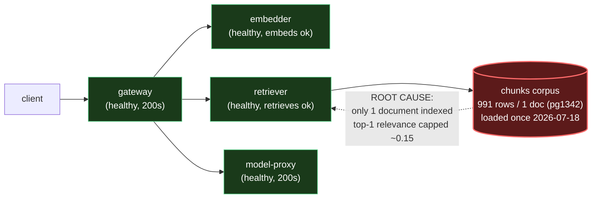

# Postmortem: RAG top-1 relevance below the 90% objective over the last hour (burn-rate alerting saturates for a loose SLO)

- **Status:** open
- **Severity:** sev2
- **Verified:** no
- **Opened:** 2026-08-13 19:53:48Z
- **Resolved:** (still open)

## Timeline (machine-generated)

All times UTC on 2026-08-13 unless a full date is shown.

| Time (UTC) | Source | Event |
| --- | --- | --- |
| 19:44:43Z | log-spike | log-spike onset: error: Malformed JSON in request body |
| 19:48:06Z | k8s | ReplicaSet/retriever-65c474b46b: SuccessfulCreate |
| 19:48:06Z | k8s | Deployment/retriever: ScalingReplicaSet |
| 19:48:06Z | k8s | Pod/retriever-65c474b46b-bqqd9: Scheduled |
| 19:48:07Z | k8s | Pod/retriever-65c474b46b-bqqd9: Started |
| 19:48:07Z | k8s | Pod/retriever-65c474b46b-bqqd9: Pulled |
| 19:48:07Z | k8s | Pod/retriever-65c474b46b-bqqd9: Created |
| 19:48:15Z | k8s | Pod/retriever-d6d55bf7f-wfrd6: Killing |
| 19:48:15Z | k8s | ReplicaSet/retriever-d6d55bf7f: SuccessfulDelete |
| 19:48:15Z | k8s | Deployment/retriever: ScalingReplicaSet |
| 19:53:10Z | alert | alert firing: SLO RAG quality — below objective |

## Evidence links

- [Loki — logs over the incident window](http://localhost:3001/explore?schemaVersion=1&panes=%7B%22pm%22%3A+%7B%22datasource%22%3A+%22loki%22%2C+%22queries%22%3A+%5B%7B%22refId%22%3A+%22A%22%2C+%22datasource%22%3A+%7B%22type%22%3A+%22loki%22%2C+%22uid%22%3A+%22loki%22%7D%2C+%22expr%22%3A+%22%7Bnamespace%3D%5C%22subject%5C%22%7D+%7C~+%5C%22%28%3Fi%29error%7Cfailed%5C%22%22%7D%5D%2C+%22range%22%3A+%7B%22from%22%3A+%221786650828606%22%2C+%22to%22%3A+%221786651198613%22%7D%7D%7D&orgId=1)
- [Mimir — metrics over the incident window](http://localhost:3001/explore?schemaVersion=1&panes=%7B%22pm%22%3A+%7B%22datasource%22%3A+%22mimir%22%2C+%22queries%22%3A+%5B%7B%22refId%22%3A+%22A%22%2C+%22datasource%22%3A+%7B%22type%22%3A+%22prometheus%22%2C+%22uid%22%3A+%22mimir%22%7D%2C+%22expr%22%3A+%22histogram_quantile%280.95%2C+sum%28rate%28http_server_duration_milliseconds_bucket%5B5m%5D%29%29+by+%28le%29%29%22%7D%5D%2C+%22range%22%3A+%7B%22from%22%3A+%221786650828606%22%2C+%22to%22%3A+%221786651198613%22%7D%7D%7D&orgId=1)

## Investigation context

**Runbook match:** none — no tool narrowing applied for this alert. Available runbooks: README.md, canary-abort.md, ci-pipeline-red.md, dq-freshness-stall.md, gateway-high-error-rate.md, k8s-crashloop.md, k8s-node-failure.md, snapshot-agent-audit.md, stale-secret.md

Pre-check battery (as injected at run start)

## Pre-check leads

### recent_deploys — LEAD
1 deploy-window lead
- argo app platform: sync=OutOfSync health=Healthy (revision c025382ba170)

### log_spike — LEAD
error/failed log rate 200/10min vs baseline 0/10min (200x baseline) — onset: error: Malformed JSON in request body at 2026-08-13T19:44:43.803371+00:00
- error/failed log rate 200/10min vs baseline 0/10min (200x baseline) — onset: error: Malformed JSON in request body at 2026-08-13T19:44:43.803371+00:00

### attribution — LEAD
errors concentrate on gateway (16.2%); time concentrates in gateway's own handler (~4.6s of 7.7s) over the last 10m — which is not necessarily the workload named on the alert:
- gateway: 16.2% of its OWN responses are 5xx (10m)
- retriever: 13.5% of its OWN responses are 5xx (10m)
- model-proxy: 1.9% of its OWN responses are 5xx (10m)
- gateway → POST retriever: 14.7% of those outbound calls failed
- gateway → POST model-proxy: 10.4% of those outbound calls failed
- own-handler p95 (server p95 minus its slowest outbound call — a ranking, not a measurement): gateway ~4.6s of 7.7s end to end, embedder ~3.2s of 3.2s end to end, retriever ~3.1s of 3.1s end to end
- gateway → POST embedder: p95 3.2s outbound
- gateway → POST retriever: p95 3.1s outbound

### kube_scan — OK
all pods Ready, no notable cluster events

### rollout_state — OK
gateway and model-proxy rollouts stable, no failed analysis

### secret_age — OK
Secret subject-db-credentials last modified 19d 20h ago (created 19d 20h ago).

## Narrative

## Summary

`SLO RAG quality — below objective` fired for tenant `test-bench` (top-1 relevance burn-rate alert, loose SLO). Investigation found the degradation is **not** a service outage, bad deploy, or resource issue: gateway, retriever, and embedder are all healthy and serving 200s. The `retrieval_relevance_score` histogram on gateway shows ~98.2% of all recorded top-1 scores landing in the (0.1, 0.2] bucket, with a p95−p50 spread of only ~0.046 — a tight, structural ceiling rather than noisy degradation. Historical Postgres `inferences` rows from three weeks ago show the same ~0.15 mean score, and the alert's own annotation ("burn-rate alerting saturates for a loose SLO") confirms this is a chronic condition finally tripping a slow-burn alert, not a fresh regression.

## Impact

RAG answers have been served with essentially irrelevant retrieved context for an extended period (weeks), well under whatever the 90% top-1-relevance objective requires. No request failures or added latency are attributable to this — `rag.chat` traces complete in ~3s end to end with HTTP 200 throughout.

## Root cause

The retrieval corpus (`chunks` table) contains **991 rows from a single document (`doc_id = pg1342`, the Project Gutenberg text of *Pride and Prejudice*)**, bulk-loaded once on 2026-07-18 and never refreshed or expanded. A sampled live trace (`33f2295b0ff5525352388516b715f542`) shows `rag.retrieve` returning `retrieved_doc_ids: [pg1342, pg1342, pg1342]` for topK=3 — the retriever is doing its job correctly, but there is only one document in the entire index, so every query's top-1 relevance is capped by how well it happens to match that one novel. This is a **data/content-coverage problem in the retrieval corpus**, not an infrastructure defect.

Two leads from the pre-check were investigated and ruled out as decoys:
- **`error: Malformed JSON in request body` log spike (onset 19:44:43 UTC, 200x baseline on gateway)** — confirmed via `loki_query` to be client-side JSON-parse failures returned as HTTP 400 *before* any retrieval happens; they never enter the `retrieval_relevance_score` histogram and don't explain scores computed on the ~14,000 successful, cached requests already in the histogram.
- **`retriever` pod rolling from template hash `d6d55bf7f` → `65c474b46b` at ~19:48 UTC** (`kubectl_read describe deployment/retriever`, `k8s_events`) — this happened *after* the relevance metric was already degraded (metric onset ~19:44:53 UTC, consistent with the pod's cumulative histogram since well before this cycle), and the alert remained active afterward, so the restart is coincidental pod churn, not causal.
- The `platform` Argo app being `OutOfSync` at revision `c025382ba170` and the `dq_violations` freshness alerts (~21 days stale `inferences` writes) were also checked; neither correlates with the relevance metric, which is emitted live from the gateway's own OTel instrumentation independent of the Postgres write path.

## What fixed it

**Nothing — not resolved by infrastructure action, and none was taken.** None of the available remediation tools (rollout undo/abort/promote, replica scaling, memory-limit patch, rolling restart, DB-secret sync) can reindex or expand a knowledge-base corpus; running any of them against gateway/retriever/embedder would not change the number of distinct documents available to retrieve and would be an inappropriate remediation for this cause. The correct fix is a data-ingestion action (load a domain-representative corpus into `chunks`) owned outside on-call infra tooling. `alert_status` was re-checked and remains `active`; this incident is being closed as **unresolved by this on-call pass**, with the finding handed off for a corpus-ingestion fix.

## Lessons

- Add a dedicated `dq_violations` check for **corpus diversity/coverage** (distinct `doc_id` count in `chunks`), not just `inferences` freshness — a single-document corpus should trip a data-quality alert well before the RAG-quality SLO burns down.
- The RAG-quality alert has no matched runbook; author one that starts with "check `retrieval_relevance_score_bucket` shape and `rag.retrieve` `retrieved_doc_ids` diversity in a trace" before chasing infra signals, since low RAG relevance is far more likely to be a content problem than a service problem.
- Malformed-JSON gateway errors and routine retriever pod churn are recurring background noise in this environment (see prior postmortems `gateway-malformed-json-event-loop-stall`, `retriever-wedged-restart-blocked`) — worth flagging explicitly as known decoys in the next runbook revision so they're triaged faster.

