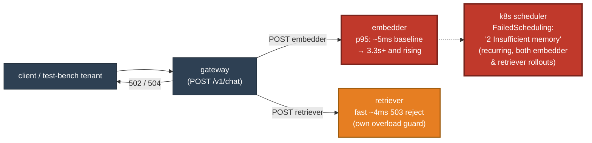

# Postmortem: gateway availability error budget burning fast (2% of the 28d budget in 1h; 5m & 1h windows)

- **Status:** open
- **Severity:** sev1
- **Verified:** no
- **Opened:** 2026-08-14 17:16:42Z
- **Resolved:** (still open)

## Timeline (machine-generated)

All times UTC on 2026-08-14 unless a full date is shown.

| Time (UTC) | Source | Event |
| --- | --- | --- |
| 17:13:33Z | log-spike | log-spike onset: error: Malformed JSON in request body |
| 17:16:10Z | alert | alert firing: SLO gateway availability — fast burn |
| 17:17:29Z | k8s | ReplicaSet/retriever-6b7c75d794: SuccessfulCreate |
| 17:17:29Z | k8s | Pod/retriever-6599665c84-qzghv: Killing |
| 17:17:29Z | k8s | ReplicaSet/retriever-6599665c84: SuccessfulDelete |
| 17:17:29Z | k8s | Deployment/retriever: ScalingReplicaSet |
| 17:17:29Z | k8s | Pod/retriever-6b7c75d794-scx9w: FailedScheduling |
| 17:17:29Z | k8s | Pod/retriever-6b7c75d794-td2kh: FailedScheduling |
| 17:17:30Z | k8s | Pod/retriever-6b7c75d794-scx9w: Started |
| 17:17:30Z | k8s | Pod/retriever-6b7c75d794-scx9w: Pulled |
| 17:17:30Z | k8s | Pod/retriever-6b7c75d794-scx9w: Created |
| 17:17:30Z | k8s | Pod/retriever-6b7c75d794-td2kh: FailedScheduling |
| 17:17:30Z | k8s | Pod/retriever-6b7c75d794-scx9w: Scheduled |
| 17:17:37Z | k8s | ReplicaSet/retriever-6b7c75d794: SuccessfulCreate |
| 17:17:37Z | k8s | Pod/retriever-6599665c84-ppf7c: Killing |
| 17:17:37Z | k8s | ReplicaSet/retriever-6599665c84: SuccessfulDelete |
| 17:17:37Z | k8s | Deployment/retriever: ScalingReplicaSet |
| 17:17:37Z | k8s | Pod/retriever-6b7c75d794-kmr4t: FailedScheduling |
| 17:17:38Z | k8s | Pod/retriever-6b7c75d794-kmr4t: FailedScheduling |
| 17:17:38Z | k8s | Pod/retriever-6b7c75d794-td2kh: Scheduled |
| 17:17:39Z | k8s | Pod/retriever-6b7c75d794-td2kh: Started |
| 17:17:39Z | k8s | Pod/retriever-6b7c75d794-td2kh: Pulled |
| 17:17:39Z | k8s | Pod/retriever-6b7c75d794-td2kh: Created |
| 17:17:45Z | k8s | ReplicaSet/retriever-6b7c75d794: SuccessfulCreate |
| 17:17:45Z | k8s | Pod/retriever-6599665c84-sb764: Killing |
| 17:17:45Z | k8s | ReplicaSet/retriever-6599665c84: SuccessfulDelete |
| 17:17:45Z | k8s | Deployment/retriever: ScalingReplicaSet |
| 17:17:45Z | k8s | Pod/retriever-6b7c75d794-p4ggw: FailedScheduling |
| 17:17:46Z | k8s | Pod/retriever-6b7c75d794-p4ggw: FailedScheduling |
| 17:17:46Z | k8s | Pod/retriever-6b7c75d794-kmr4t: Scheduled |
| 17:17:47Z | k8s | Pod/retriever-6b7c75d794-kmr4t: Started |
| 17:17:47Z | k8s | Pod/retriever-6b7c75d794-kmr4t: Pulled |
| 17:17:47Z | k8s | Pod/retriever-6b7c75d794-kmr4t: Created |
| 17:17:53Z | k8s | Pod/retriever-6599665c84-cf972: Killing |
| 17:17:53Z | k8s | ReplicaSet/retriever-6599665c84: SuccessfulDelete |
| 17:17:53Z | k8s | Deployment/retriever: ScalingReplicaSet |
| 17:17:54Z | k8s | Pod/retriever-6b7c75d794-p4ggw: Scheduled |
| 17:17:55Z | k8s | Pod/retriever-6b7c75d794-p4ggw: Started |
| 17:17:55Z | k8s | Pod/retriever-6b7c75d794-p4ggw: Pulled |
| 17:17:55Z | k8s | Pod/retriever-6b7c75d794-p4ggw: Created |
| 17:22:35Z | k8s | ReplicaSet/embedder-fdff9df4: SuccessfulCreate |
| 17:22:35Z | k8s | Deployment/embedder: ScalingReplicaSet |
| 17:22:35Z | k8s | Pod/embedder-fdff9df4-xd55z: FailedScheduling |
| 17:22:35Z | k8s | Pod/embedder-fdff9df4-sqvm2: FailedScheduling |
| 17:24:39Z | k8s | Pod/retriever-6b7c75d794-kmr4t: Killing |
| 17:24:39Z | k8s | ReplicaSet/retriever-6b7c75d794: SuccessfulDelete |
| 17:24:39Z | k8s | ReplicaSet/retriever-6599665c84: SuccessfulCreate |
| 17:24:39Z | k8s | Deployment/retriever: ScalingReplicaSet |
| 17:24:39Z | k8s | Deployment/embedder: ScalingReplicaSet |
| 17:24:39Z | k8s | Pod/retriever-6599665c84-q6m75: FailedScheduling |
| 17:24:39Z | k8s | Pod/retriever-6599665c84-2jg4b: FailedScheduling |
| 17:24:39Z | k8s | Pod/embedder-fdff9df4-sqvm2: FailedScheduling |
| 17:24:40Z | k8s | ReplicaSet/embedder-fdff9df4: SuccessfulDelete |
| 17:24:40Z | k8s | ReplicaSet/embedder-596696c46d: SuccessfulCreate |
| 17:24:40Z | k8s | Deployment/embedder: ScalingReplicaSet |
| 17:24:40Z | k8s | Pod/embedder-fdff9df4-xd55z: Scheduled |
| 17:24:40Z | k8s | Pod/embedder-596696c46d-jgckp: FailedScheduling |
| 17:24:40Z | k8s | Pod/embedder-596696c46d-4stqg: FailedScheduling |
| 17:24:41Z | k8s | Pod/embedder-fdff9df4-xd55z: Started |
| 17:24:41Z | k8s | Pod/embedder-fdff9df4-xd55z: Pulled |
| 17:24:41Z | k8s | Pod/embedder-fdff9df4-xd55z: Created |

## Evidence links

- [Loki — logs over the incident window](http://localhost:3001/explore?schemaVersion=1&panes=%7B%22pm%22%3A+%7B%22datasource%22%3A+%22loki%22%2C+%22queries%22%3A+%5B%7B%22refId%22%3A+%22A%22%2C+%22datasource%22%3A+%7B%22type%22%3A+%22loki%22%2C+%22uid%22%3A+%22loki%22%7D%2C+%22expr%22%3A+%22%7Bnamespace%3D%5C%22subject%5C%22%7D+%7C~+%5C%22%28%3Fi%29error%7Cfailed%5C%22%22%7D%5D%2C+%22range%22%3A+%7B%22from%22%3A+%221786727802904%22%2C+%22to%22%3A+%221786728485940%22%7D%7D%7D&orgId=1)
- [Mimir — metrics over the incident window](http://localhost:3001/explore?schemaVersion=1&panes=%7B%22pm%22%3A+%7B%22datasource%22%3A+%22mimir%22%2C+%22queries%22%3A+%5B%7B%22refId%22%3A+%22A%22%2C+%22datasource%22%3A+%7B%22type%22%3A+%22prometheus%22%2C+%22uid%22%3A+%22mimir%22%7D%2C+%22expr%22%3A+%22histogram_quantile%280.95%2C+sum+by+%28le%2C+service%29+%28rate%28request_duration_seconds_bucket%5B5m%5D%29%29%29%22%7D%5D%2C+%22range%22%3A+%7B%22from%22%3A+%221786727802904%22%2C+%22to%22%3A+%221786728485940%22%7D%7D%7D&orgId=1)

## Investigation context

**Runbook match (2):** `gateway-high-error-rate.md`, `stale-secret.md` — toolset narrowed to 14 tools: alert_status, deploy_history, k8s_events, kubectl_read, loki_query, mimir_query, publish_postmortem, request_approval, restart_workload, runbook_lookup, runbook_read, save_artifact, tempo_query, update_db_secret

Pre-check battery (as injected at run start)

## Pre-check leads

### recent_deploys — LEAD
3 deploy-window leads
- argo app embedder: sync=OutOfSync health=Healthy (revision c025382ba170)
- argo app platform: sync=OutOfSync health=Healthy (revision c025382ba170)
- argo app retriever: sync=OutOfSync health=Healthy (revision c025382ba170)

### log_spike — LEAD
error/failed log rate 200/10min vs baseline 0/10min (200x baseline) — onset: error: Malformed JSON in request body at 2026-08-14T17:13:33.063872+00:00
- error/failed log rate 200/10min vs baseline 0/10min (200x baseline) — onset: error: Malformed JSON in request body at 2026-08-14T17:13:33.063872+00:00

### attribution — LEAD
errors concentrate on gateway (24.4%); time concentrates in gateway's own handler (~4.9s of 7.1s) over the last 10m — which is not necessarily the workload named on the alert:
- gateway: 24.4% of its OWN responses are 5xx (10m)
- retriever: 19.6% of its OWN responses are 5xx (10m)
- model-proxy: 3.5% of its OWN responses are 5xx (10m)
- gateway → POST retriever: 22.3% of those outbound calls failed
- gateway → POST model-proxy: 15.6% of those outbound calls failed
- own-handler p95 (server p95 minus its slowest outbound call — a ranking, not a measurement): gateway ~4.9s of 7.1s end to end, embedder ~2.2s of 2.2s end to end, retriever ~2.0s of 2.0s end to end
- gateway → POST embedder: p95 2.2s outbound
- gateway → POST retriever: p95 2.0s outbound

### kube_scan — OK
all pods Ready, no notable cluster events

### rollout_state — OK
gateway and model-proxy rollouts stable, no failed analysis

### secret_age — OK
Secret subject-db-credentials last modified 20d 18h ago (created 20d 18h ago).

## Narrative

## Summary

The gateway-availability fast-burn SLO alert was driven by a cascading capacity failure that started in **embedder**, not in gateway or retriever, even though gateway is where the 5xx surfaced and retriever is where the highest per-service error percentage showed up. Per the gateway-high-error-rate runbook's own guidance ("attribute before you explain"), by-service and by-edge PromQL pointed at gateway and retriever; only a full trace revealed the true origin was embedder.

## Impact

test-bench's `/v1/chat` traffic through gateway degraded sharply: gateway's own 5xx rate rose from a healthy baseline into the ~24–29% range (dominated by 502s), and retriever's own-handler 5xx rate climbed to ~19–29% of its traffic. This is more than enough to burn the 5m/1h fast-burn windows of the 28-day availability budget. Latency for affected requests went from sub-second to multi-second before failing.

## Root cause

Argo showed **embedder, retriever, and platform simultaneously OutOfSync at the same revision**, and `kubectl describe` confirmed both embedder and retriever were mid rolling-restart (new pod-template-hash ReplicaSets scaling up while old ones scaled down). The k3d cluster does not have enough free node memory to run the old+new pod overlap for both deployments' rolling updates at once: repeated `FailedScheduling` events ("0/3 nodes are available: ... 2 Insufficient memory") blocked new embedder and retriever pods from scheduling, over and over, across multiple pod names, for several minutes running.

The effect on **embedder** was severe: its Deployment was stuck at 2 of 4 desired replicas ("4 desired | 2 updated | 5 total | 3 available | 2 unavailable"), and its own p95 latency — which had sat rock steady at ~4.75ms for 30+ minutes (cache-hit fast path, confirmed via `"cached":true` in its own logs) — jumped roughly 450x to over 2.1s the moment the restart began, and was still climbing (to 3.3s) at the last measurement, with no sign of leveling off. This latency is inside embedder's own handler, not a call to anything downstream — the two surviving pods were simply saturated running double their intended load.

A full trace made the cascade mechanism explicit: gateway's call to embedder took ~1.9s to return 200 OK, and its very next call — to retriever — failed in ~4ms with a 503. That sub-5ms failure is an immediate rejection, not a timeout: it is retriever's own concurrency/connection guard tripping, consistent with more requests staying in-flight for longer (because they're stuck waiting on slow embedder calls) saturating retriever's capacity even though retriever's pods themselves were completely healthy — 0 restarts, low CPU (~20m) and memory (~80Mi of a 512Mi limit), no OOM events, and zero outbound/client spans of its own (it doesn't call anything downstream — its 503s originate entirely in its own request-acceptance path). Retriever's high own-service error percentage in the by-service breakdown was therefore a **symptom** of system-wide concurrency pressure caused by embedder, not a defect of retriever's own code or a downstream dependency of retriever's.

Two hypotheses from the matched runbooks were checked and ruled out with evidence:
- **Stale database secret**: the `secret_age` pre-check showed the credential is 20+ days old (not recently rotated), and a `password authentication failed` log search over the incident window returned zero matches. Not the cause.
- **Bad code deploy on gateway/model-proxy**: `deploy_history` showed no deploy events for gateway or model-proxy in the window; both rollouts report Healthy. The only deploy-shaped signal in the window was the embedder/retriever/platform Argo drift described above, which is a scheduling/restart problem, not a code regression.

A chronic, already-known-broken signal — retriever logging `"lineage emit failed" ... "The operation timed out"` on its `rag.retrieve` job (a per-request emit to a Marquez instance that is a documented standing issue in this environment) — appeared again in the logs during this window. Its rate did not track the 503 rate closely enough to explain it and it is treated here as a decoy, consistent with its known history of misleading investigations, not as this incident's cause.

Gateway itself was not at fault: its own-handler 5xx (500s) was a small fraction of its total 5xx; the dominant contributor was 502 (Bad Gateway), i.e. gateway faithfully reporting retriever's/embedder's failures to callers. Malformed-JSON errors in gateway's logs returned 422s, not 5xx, and are unrelated to the SLO burn.

## What fixed it

**Nothing was executed, deliberately.** The tools granted for this incident (matched to the gateway-high-error-rate and stale-secret runbooks) were `restart_workload` and `update_db_secret` only. `update_db_secret` does not apply — there is no stale-secret evidence. `restart_workload` was considered and rejected: embedder and retriever were *already* mid rolling-restart when this investigation began, and the `FailedScheduling` events show the cluster genuinely lacks the memory headroom to finish that rollout, not that the workloads are wedged. Issuing another restart would only add more surge pods that also cannot schedule, and carries a real, asymmetric risk of cycling out embedder's two remaining healthy pods before any replacement becomes Ready — turning a ~50%-capacity degradation into a full outage. Per the runbook's own principle for gateway restarts ("say so in the report rather than doing it"), the same logic was applied here to embedder/retriever.

At last check the metric had **not recovered**: gateway 5xx was ~29% and retriever ~26%, both still elevated and, by trend, still climbing rather than settling toward a healthy (<1%) baseline. `alert_status` was checked twice as instructed; the second check happened to read inactive, which — given the metric evidence in the same moment showed the error rate at its worst point yet — looks like a fast 5m-evaluation-window flap around a still-bad state rather than genuine resolution, and should not be read as "resolved."

## Lessons

- The real fix here is capacity, not a workload restart: get `scale_deployment`/`patch_memory_limit` (or a human with node/cluster-autoscaler access) engaged for embedder, and free enough node memory for the in-flight rollout to complete.
- Embedder, retriever, and platform were rolled at the same Argo revision simultaneously in a cluster with no headroom to run more than one deployment's old+new pod overlap at a time. Stagger these rollouts (or raise `maxSurge`/node capacity) so a routine restart doesn't turn into an outage.
- Attribution-by-service and attribution-by-edge PromQL (runbook steps 1–2) pointed at gateway and retriever; only a single full trace (runbook step 3) surfaced embedder as the actual origin, via the fast (~4ms) retriever rejection immediately following a slow (~1.9s) embedder call in the same request. Pull a full trace early in any multi-service cascade rather than stopping at the by-service breakdown.
- Retriever's own-handler 5xx% is not proof retriever is broken — its pods were healthy throughout (no restarts, low resource usage, zero downstream calls of its own). A fast, uniform rejection rate with no resource or dependency signal behind it is the fingerprint of an overload guard reacting to someone else's slowness.
- The lineage-emit-timeout warnings on retriever surfaced again and cost investigation time distinguishing decoy from cause; it remains an open, standing issue worth fixing so it stops competing for attention during real incidents.
