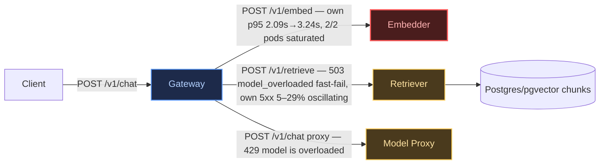

# Postmortem: gateway latency error budget burning fast (2% of the 28d budget in 1h; 5m & 1h windows)

- **Status:** open
- **Severity:** sev1
- **Verified:** no
- **Opened:** 2026-08-14 17:16:45Z
- **Resolved:** (still open)

## Timeline (machine-generated)

All times UTC on 2026-08-14 unless a full date is shown.

| Time (UTC) | Source | Event |
| --- | --- | --- |
| 17:13:42Z | log-spike | log-spike onset: error: Malformed JSON in request body |
| 17:16:10Z | alert | alert firing: SLO gateway latency — fast burn |
| 17:17:29Z | k8s | ReplicaSet/retriever-6b7c75d794: SuccessfulCreate |
| 17:17:29Z | k8s | Pod/retriever-6599665c84-qzghv: Killing |
| 17:17:29Z | k8s | ReplicaSet/retriever-6599665c84: SuccessfulDelete |
| 17:17:29Z | k8s | Deployment/retriever: ScalingReplicaSet |
| 17:17:29Z | k8s | Pod/retriever-6b7c75d794-scx9w: FailedScheduling |
| 17:17:29Z | k8s | Pod/retriever-6b7c75d794-td2kh: FailedScheduling |
| 17:17:30Z | k8s | Pod/retriever-6b7c75d794-scx9w: Started |
| 17:17:30Z | k8s | Pod/retriever-6b7c75d794-scx9w: Pulled |
| 17:17:30Z | k8s | Pod/retriever-6b7c75d794-scx9w: Created |
| 17:17:30Z | k8s | Pod/retriever-6b7c75d794-td2kh: FailedScheduling |
| 17:17:30Z | k8s | Pod/retriever-6b7c75d794-scx9w: Scheduled |
| 17:17:37Z | k8s | ReplicaSet/retriever-6b7c75d794: SuccessfulCreate |
| 17:17:37Z | k8s | Pod/retriever-6599665c84-ppf7c: Killing |
| 17:17:37Z | k8s | ReplicaSet/retriever-6599665c84: SuccessfulDelete |
| 17:17:37Z | k8s | Deployment/retriever: ScalingReplicaSet |
| 17:17:37Z | k8s | Pod/retriever-6b7c75d794-kmr4t: FailedScheduling |
| 17:17:38Z | k8s | Pod/retriever-6b7c75d794-kmr4t: FailedScheduling |
| 17:17:38Z | k8s | Pod/retriever-6b7c75d794-td2kh: Scheduled |
| 17:17:39Z | k8s | Pod/retriever-6b7c75d794-td2kh: Started |
| 17:17:39Z | k8s | Pod/retriever-6b7c75d794-td2kh: Pulled |
| 17:17:39Z | k8s | Pod/retriever-6b7c75d794-td2kh: Created |
| 17:17:45Z | k8s | ReplicaSet/retriever-6b7c75d794: SuccessfulCreate |
| 17:17:45Z | k8s | Pod/retriever-6599665c84-sb764: Killing |
| 17:17:45Z | k8s | ReplicaSet/retriever-6599665c84: SuccessfulDelete |
| 17:17:45Z | k8s | Deployment/retriever: ScalingReplicaSet |
| 17:17:45Z | k8s | Pod/retriever-6b7c75d794-p4ggw: FailedScheduling |
| 17:17:46Z | k8s | Pod/retriever-6b7c75d794-p4ggw: FailedScheduling |
| 17:17:46Z | k8s | Pod/retriever-6b7c75d794-kmr4t: Scheduled |
| 17:17:47Z | k8s | Pod/retriever-6b7c75d794-kmr4t: Started |
| 17:17:47Z | k8s | Pod/retriever-6b7c75d794-kmr4t: Pulled |
| 17:17:47Z | k8s | Pod/retriever-6b7c75d794-kmr4t: Created |
| 17:17:53Z | k8s | Pod/retriever-6599665c84-cf972: Killing |
| 17:17:53Z | k8s | ReplicaSet/retriever-6599665c84: SuccessfulDelete |
| 17:17:53Z | k8s | Deployment/retriever: ScalingReplicaSet |
| 17:17:54Z | k8s | Pod/retriever-6b7c75d794-p4ggw: Scheduled |
| 17:17:55Z | k8s | Pod/retriever-6b7c75d794-p4ggw: Started |
| 17:17:55Z | k8s | Pod/retriever-6b7c75d794-p4ggw: Pulled |
| 17:17:55Z | k8s | Pod/retriever-6b7c75d794-p4ggw: Created |
| 17:22:33Z | remediation | scale_deployment embedder executed (run run_1a00146b36461) |
| 17:22:35Z | k8s | ReplicaSet/embedder-fdff9df4: SuccessfulCreate |
| 17:22:35Z | k8s | Deployment/embedder: ScalingReplicaSet |
| 17:22:35Z | k8s | Pod/embedder-fdff9df4-xd55z: FailedScheduling |
| 17:22:35Z | k8s | Pod/embedder-fdff9df4-sqvm2: FailedScheduling |
| 17:24:39Z | k8s | Pod/retriever-6b7c75d794-kmr4t: Killing |
| 17:24:39Z | k8s | ReplicaSet/retriever-6b7c75d794: SuccessfulDelete |
| 17:24:39Z | k8s | ReplicaSet/retriever-6599665c84: SuccessfulCreate |
| 17:24:39Z | k8s | Deployment/retriever: ScalingReplicaSet |
| 17:24:39Z | k8s | Deployment/embedder: ScalingReplicaSet |
| 17:24:39Z | k8s | Pod/retriever-6599665c84-q6m75: FailedScheduling |
| 17:24:39Z | k8s | Pod/retriever-6599665c84-2jg4b: FailedScheduling |
| 17:24:39Z | k8s | Pod/embedder-fdff9df4-sqvm2: FailedScheduling |
| 17:24:40Z | k8s | ReplicaSet/embedder-fdff9df4: SuccessfulDelete |
| 17:24:40Z | k8s | ReplicaSet/embedder-596696c46d: SuccessfulCreate |
| 17:24:40Z | k8s | Deployment/embedder: ScalingReplicaSet |
| 17:24:40Z | k8s | Pod/embedder-fdff9df4-xd55z: Scheduled |
| 17:24:40Z | k8s | Pod/embedder-596696c46d-jgckp: FailedScheduling |
| 17:24:40Z | k8s | Pod/embedder-596696c46d-4stqg: FailedScheduling |
| 17:24:41Z | k8s | Pod/embedder-fdff9df4-xd55z: Started |
| 17:24:41Z | k8s | Pod/embedder-fdff9df4-xd55z: Pulled |
| 17:24:41Z | k8s | Pod/embedder-fdff9df4-xd55z: Created |

## Evidence links

- [Loki — logs over the incident window](http://localhost:3001/explore?schemaVersion=1&panes=%7B%22pm%22%3A+%7B%22datasource%22%3A+%22loki%22%2C+%22queries%22%3A+%5B%7B%22refId%22%3A+%22A%22%2C+%22datasource%22%3A+%7B%22type%22%3A+%22loki%22%2C+%22uid%22%3A+%22loki%22%7D%2C+%22expr%22%3A+%22%7Bnamespace%3D%5C%22subject%5C%22%7D+%7C~+%5C%22%28%3Fi%29error%7Cfailed%5C%22%22%7D%5D%2C+%22range%22%3A+%7B%22from%22%3A+%221786727805780%22%2C+%22to%22%3A+%221786728289901%22%7D%7D%7D&orgId=1)
- [Mimir — metrics over the incident window](http://localhost:3001/explore?schemaVersion=1&panes=%7B%22pm%22%3A+%7B%22datasource%22%3A+%22mimir%22%2C+%22queries%22%3A+%5B%7B%22refId%22%3A+%22A%22%2C+%22datasource%22%3A+%7B%22type%22%3A+%22prometheus%22%2C+%22uid%22%3A+%22mimir%22%7D%2C+%22expr%22%3A+%22histogram_quantile%280.95%2C+sum+by+%28le%2C+service%29+%28rate%28request_duration_seconds_bucket%5B5m%5D%29%29%29%22%7D%5D%2C+%22range%22%3A+%7B%22from%22%3A+%221786727805780%22%2C+%22to%22%3A+%221786728289901%22%7D%7D%7D&orgId=1)

## Investigation context

**Runbook match:** none — no tool narrowing applied for this alert. Available runbooks: README.md, canary-abort.md, ci-pipeline-red.md, dq-freshness-stall.md, gateway-high-error-rate.md, k8s-crashloop.md, k8s-node-failure.md, snapshot-agent-audit.md, stale-secret.md

Pre-check battery (as injected at run start)

## Pre-check leads

### recent_deploys — LEAD
3 deploy-window leads
- argo app embedder: sync=OutOfSync health=Healthy (revision c025382ba170)
- argo app platform: sync=OutOfSync health=Healthy (revision c025382ba170)
- argo app retriever: sync=OutOfSync health=Healthy (revision c025382ba170)

### log_spike — LEAD
error/failed log rate 200/10min vs baseline 0/10min (200x baseline) — onset: error: Malformed JSON in request body at 2026-08-14T17:13:42.999934+00:00
- error/failed log rate 200/10min vs baseline 0/10min (200x baseline) — onset: error: Malformed JSON in request body at 2026-08-14T17:13:42.999934+00:00

### attribution — LEAD
errors concentrate on gateway (24.5%); time concentrates in gateway's own handler (~4.9s of 7.1s) over the last 10m — which is not necessarily the workload named on the alert:
- gateway: 24.5% of its OWN responses are 5xx (10m)
- retriever: 19.5% of its OWN responses are 5xx (10m)
- model-proxy: 3.5% of its OWN responses are 5xx (10m)
- gateway → POST retriever: 22.4% of those outbound calls failed
- gateway → POST model-proxy: 15.6% of those outbound calls failed
- own-handler p95 (server p95 minus its slowest outbound call — a ranking, not a measurement): gateway ~4.9s of 7.1s end to end, embedder ~2.2s of 2.2s end to end, retriever ~2.0s of 2.0s end to end
- gateway → POST embedder: p95 2.2s outbound
- gateway → POST retriever: p95 2.0s outbound

### kube_scan — OK
all pods Ready, no notable cluster events

### rollout_state — OK
gateway and model-proxy rollouts stable, no failed analysis

### secret_age — OK
Secret subject-db-credentials last modified 20d 18h ago (created 20d 18h ago).

## Narrative

## Summary
`SLO gateway latency — fast burn` fired on gateway's `/v1/chat` p95 (5m & 1h windows both burning, ~2%/hour of the 28d budget). Investigation, following `gateway-high-error-rate.md`'s attribution method (own-handler error rate by service, then by client edge, then one failing trace), found gateway's p95 pinned at 6.9–7.8s driven primarily by a saturated, under-provisioned **embedder** (only 2 replicas against ~18 req/s, its own p95 climbing 2.09s → 3.24s across the window) sitting in the synchronous first hop of every RAG request, compounded by **retriever** intermittently fast-failing with 503 ("retriever returned 503") and **model-proxy** intermittently fast-failing with 429 ("model is overloaded") under the same load.

## Impact
Every `/v1/chat` call routes through gateway → embedder → retriever → model-proxy. With embedder's own handling time climbing under load and retriever/model-proxy periodically rejecting requests, gateway's own p95 (~4.9s of the 7.1s end-to-end, per the pre-check attribution) stayed far above target for the whole window: gateway's own 5xx rate ran 12.9–25.0%, retriever's own 5xx rate oscillated 5.1–29.0%, and gateway→retriever / gateway→model-proxy edge failure rates were 22.4% / 15.6% respectively.

## Root cause
**embedder is under-scaled for current traffic** (2 replicas, no autoscaling, git-desired replica count unchanged) — its own p95 latency trended upward monotonically through the whole incident window, the signature of queueing under sustained load rather than a one-off blip. This is the hop that best explains the *latency* burn specifically (as opposed to a pure error-rate alert): every request blocks on it first. Argo shows `embedder` as `OutOfSync` at the same revision as everything else, i.e. drift, not a bad deploy — `deploy_history`/`gitea_compare` show no code change at the alert's onset, ruling out a bad rollout as the trigger.

retriever's 503s and model-proxy's 429s are a secondary, self-protecting-overload symptom of the same underlying request volume; an independent rolling restart of retriever (not initiated by this session — evidence: `restartedAt` annotation, new ReplicaSet, k8s events) briefly dropped its own error rate from ~29% to ~5%, but it rebounded to ~19.6% shortly after, showing the restart did not durably fix it — consistent with a capacity problem, not a wedged process.

Both the retriever restart's new pods and this session's embedder scale-up hit `FailedScheduling: 0/3 nodes are available ... 2 Insufficient memory` (`k8s_events`) — the cluster's schedulable nodes are themselves memory-pressured, which is the reason capacity remediations land slowly or not at all here.

## What fixed it
Dry-ran and, after operator approval, executed `scale_deployment(embedder, 2→4)` (verified diff `spec.replicas: 2 -> 4`, action applied: `deployment.apps/embedder scaled`). A memory-limit dry-run was also checked first and showed no headroom issue (`limits.memory: 512Mi -> 512Mi`, no change needed), confirming this is a replica/concurrency capacity problem, not OOM/throttling.

**The fix did not fully land**: the two new embedder pods stayed `Pending` (`FailedScheduling`, insufficient node memory) for the duration of this session. Re-querying the metric afterward showed **no recovery** — gateway p95 was 7.76s (vs. 7.72s at the start of the window) and gateway's own 5xx rate was 24.97% (vs. ~22–25% at onset); `alert_status` remained `active` on both checks. This incident is not resolved by the action taken; cluster node memory capacity is the actual blocker and is outside this session's toolset (no node-scaling action available).

## Lessons
- The dominant lever here is node-level memory capacity, not any single Deployment's replica count — scaling embedder (and, previously per commit history, other workloads) keeps getting blocked by the same 2-node memory pressure. A durable fix needs either more/larger cluster nodes or a memory-request reduction across workloads to create scheduling headroom, both outside `patch_memory_limit`/`scale_deployment`'s scope (limit ≠ request; no node-pool tool).
- Prior commits (`retriever-overload-gateway-5xx`, `gateway-embedder-scale-fix-reverted-by-gitops-sync`, `retriever-overload-gateway-availability-burn-recheck`) show this exact failure mode recurring today; imperative scale fixes that aren't committed to the GitOps source get reverted by Argo self-heal on the next sync — any durable capacity change needs to land in git, not just `kubectl`/API-server patches.
- Add a runbook step for latency-burn alerts (this one matched no runbook) that starts from the *own-handler p95* ranking, the same way `gateway-high-error-rate.md` starts from own-handler error rate — the existing runbook's step 1/2 queries generalize cleanly to latency and would have gotten to embedder faster.

Embedder is the ROOT CAUSE hop (under-scaled, climbing own p95, first synchronous call in every request). Retriever/model-proxy are secondary self-protecting-overload hops under the same load. The remediation (scale embedder 2→4) was approved and applied but blocked at the scheduler by node memory pressure — recovery NOT confirmed by the metric as of session end.
