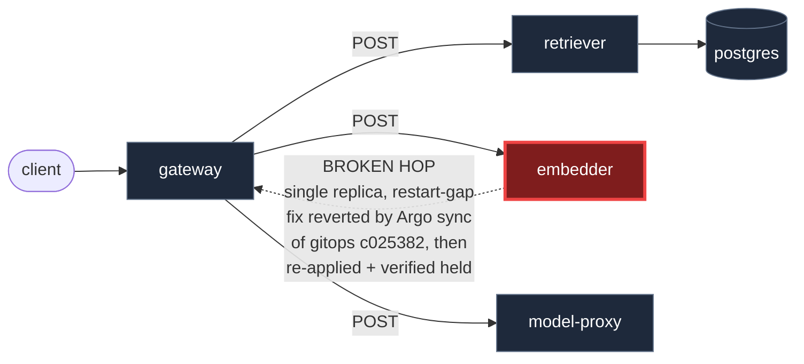

# Postmortem: gateway latency error budget burning slowly (10% of the 28d budget in 6h; 30m & 6h windows)

- **Status:** resolved
- **Severity:** sev2
- **Verified:** no
- **Opened:** 2026-08-14 00:13:47Z
- **Resolved:** 2026-08-14 00:33:47Z

## Timeline (machine-generated)

All times UTC on 2026-08-14 unless a full date is shown.

| Time (UTC) | Source | Event |
| --- | --- | --- |
| 00:04:44Z | k8s | Pod/retriever-55dc5cc955-9vb6l: Started |
| 00:04:44Z | k8s | Pod/retriever-55dc5cc955-9vb6l: Created |
| 00:04:44Z | k8s | Pod/gateway-746788f5df-t6bqb: Killing |
| 00:04:44Z | k8s | AnalysisRun/gateway-746788f5df-28-1: MetricSuccessful |
| 00:04:44Z | k8s | AnalysisRun/gateway-746788f5df-28-1: AnalysisRunSuccessful |
| 00:04:44Z | k8s | ReplicaSet/gateway-746788f5df: SuccessfulDelete |
| 00:04:44Z | k8s | Rollout/gateway: ScalingReplicaSet |
| 00:04:44Z | log-spike | log-spike onset: name=gateway-746788f5df-28-1 kind=AnalysisRun objectAPIversion=argoproj.io/v1alpha1 objectRV=2663885 eventRV=2663886 reportingcontroller=rollouts-controller sourcecomponent=rollouts-controller reason=MetricSuccessful type=… |
| 00:04:45Z | k8s | ReplicaSet/gateway-569c859d85: SuccessfulCreate |
| 00:04:45Z | k8s | Rollout/gateway: ScalingReplicaSet |
| 00:04:45Z | k8s | Pod/gateway-569c859d85-mlpcq: Scheduled |
| 00:04:46Z | k8s | Pod/gateway-569c859d85-mlpcq: Started |
| 00:04:46Z | k8s | Pod/gateway-569c859d85-mlpcq: Pulled |
| 00:04:46Z | k8s | Pod/gateway-569c859d85-mlpcq: Created |
| 00:04:50Z | k8s | Pod/retriever-86699d9d9d-hnkl7: Killing |
| 00:04:50Z | k8s | ReplicaSet/retriever-86699d9d9d: SuccessfulDelete |
| 00:04:50Z | k8s | Deployment/retriever: ScalingReplicaSet |
| 00:04:53Z | k8s | Rollout/gateway: RolloutStepCompleted |
| 00:04:55Z | k8s | Rollout/gateway: AnalysisRunRunning |
| 00:08:24Z | k8s | AnalysisRun/gateway-569c859d85-29-1: MetricSuccessful |
| 00:08:24Z | k8s | AnalysisRun/gateway-569c859d85-29-1: AnalysisRunSuccessful |
| 00:08:24Z | k8s | Rollout/gateway: AnalysisRunSuccessful |
| 00:08:26Z | k8s | Pod/gateway-77cfb95667-c2tjm: Killing |
| 00:08:26Z | k8s | ReplicaSet/gateway-77cfb95667: SuccessfulDelete |
| 00:08:27Z | k8s | Pod/gateway-77cfb95667-c2tjm: Unhealthy |
| 00:08:28Z | k8s | Pod/gateway-569c859d85-59dfp: Started |
| 00:08:28Z | k8s | Pod/gateway-569c859d85-59dfp: Pulled |
| 00:08:28Z | k8s | Pod/gateway-569c859d85-59dfp: Created |
| 00:08:28Z | k8s | ReplicaSet/gateway-569c859d85: SuccessfulCreate |
| 00:08:28Z | k8s | Pod/gateway-569c859d85-59dfp: Scheduled |
| 00:09:56Z | k8s | Pod/gateway-569c859d85-59dfp: Killing |
| 00:09:56Z | k8s | AnalysisRun/gateway-569c859d85-29-3: MetricSuccessful |
| 00:09:56Z | k8s | AnalysisRun/gateway-569c859d85-29-3: AnalysisRunSuccessful |
| 00:09:56Z | k8s | ReplicaSet/gateway-569c859d85: SuccessfulDelete |
| 00:09:57Z | k8s | ReplicaSet/gateway-77cfb95667: SuccessfulCreate |
| 00:09:57Z | k8s | Pod/gateway-77cfb95667-jcmwg: Scheduled |
| 00:09:58Z | k8s | Pod/gateway-77cfb95667-jcmwg: Started |
| 00:09:58Z | k8s | Pod/gateway-77cfb95667-jcmwg: Pulled |
| 00:09:58Z | k8s | Pod/gateway-77cfb95667-jcmwg: Created |
| 00:10:05Z | k8s | Pod/gateway-569c859d85-mlpcq: Killing |
| 00:10:05Z | k8s | ReplicaSet/gateway-569c859d85: SuccessfulDelete |
| 00:10:06Z | k8s | ReplicaSet/gateway-74677864c: SuccessfulCreate |
| 00:10:06Z | k8s | Pod/gateway-74677864c-4v9fx: Scheduled |
| 00:10:07Z | k8s | Pod/gateway-74677864c-4v9fx: Started |
| 00:10:07Z | k8s | Pod/gateway-74677864c-4v9fx: Pulled |
| 00:10:07Z | k8s | Pod/gateway-74677864c-4v9fx: Created |
| 00:10:15Z | k8s | ReplicaSet/retriever-6599665c84: SuccessfulCreate |
| 00:10:15Z | k8s | Deployment/retriever: ScalingReplicaSet |
| 00:10:15Z | k8s | Pod/retriever-6599665c84-qzghv: Scheduled |
| 00:10:16Z | k8s | Pod/retriever-6599665c84-qzghv: Started |
| 00:10:16Z | k8s | Pod/retriever-6599665c84-qzghv: Pulled |
| 00:10:16Z | k8s | Pod/retriever-6599665c84-qzghv: Created |
| 00:10:23Z | k8s | Pod/retriever-55dc5cc955-9vb6l: Killing |
| 00:10:23Z | k8s | ReplicaSet/retriever-55dc5cc955: SuccessfulDelete |
| 00:10:23Z | k8s | Deployment/retriever: ScalingReplicaSet |
| 00:13:10Z | alert | alert firing: SLO gateway latency — slow burn |
| 00:13:10Z | alert | alert resolved: SLO gateway latency — slow burn |
| 00:13:45Z | k8s | AnalysisRun/gateway-74677864c-30-1: MetricSuccessful |
| 00:13:45Z | k8s | AnalysisRun/gateway-74677864c-30-1: AnalysisRunSuccessful |
| 00:13:45Z | k8s | Rollout/gateway: AnalysisRunSuccessful |
| 00:13:46Z | k8s | Pod/gateway-77cfb95667-jcmwg: Killing |
| 00:13:46Z | k8s | ReplicaSet/gateway-77cfb95667: SuccessfulDelete |
| 00:13:47Z | k8s | ReplicaSet/gateway-74677864c: SuccessfulCreate |
| 00:13:47Z | k8s | Pod/gateway-74677864c-fqwwb: Scheduled |
| 00:13:48Z | k8s | Pod/gateway-74677864c-fqwwb: Started |
| 00:13:48Z | k8s | Pod/gateway-74677864c-fqwwb: Pulled |
| 00:13:48Z | k8s | Pod/gateway-74677864c-fqwwb: Created |
| 00:17:26Z | k8s | AnalysisRun/gateway-74677864c-30-3: MetricSuccessful |
| 00:17:26Z | k8s | AnalysisRun/gateway-74677864c-30-3: AnalysisRunSuccessful |
| 00:17:27Z | k8s | Pod/gateway-77cfb95667-pxxjw: Killing |
| 00:17:27Z | k8s | ReplicaSet/gateway-77cfb95667: SuccessfulDelete |
| 00:17:29Z | k8s | Pod/gateway-74677864c-fzx42: Started |
| 00:17:29Z | k8s | Pod/gateway-74677864c-fzx42: Pulled |
| 00:17:29Z | k8s | Pod/gateway-74677864c-fzx42: Created |
| 00:17:29Z | k8s | ReplicaSet/gateway-74677864c: SuccessfulCreate |
| 00:17:29Z | k8s | Pod/gateway-74677864c-fzx42: Scheduled |
| 00:17:36Z | k8s | Pod/gateway-77cfb95667-8lsdc: Killing |
| 00:17:36Z | k8s | ReplicaSet/gateway-77cfb95667: SuccessfulDelete |
| 00:17:37Z | k8s | ReplicaSet/gateway-74677864c: SuccessfulCreate |
| 00:17:37Z | k8s | Pod/gateway-74677864c-7tjvp: Scheduled |
| 00:17:38Z | k8s | Pod/gateway-74677864c-7tjvp: Started |
| 00:17:38Z | k8s | Pod/gateway-74677864c-7tjvp: Pulled |
| 00:17:38Z | k8s | Pod/gateway-74677864c-7tjvp: Created |
| 00:18:11Z | k8s | Deployment/retriever: ScalingReplicaSet |
| 00:18:11Z | remediation | scale_deployment retriever executed (run run_19ffd9e2324445) |
| 00:18:11Z | remediation | scale_deployment embedder executed (run run_19ffd9e2324445) |
| 00:18:12Z | k8s | Pod/retriever-6599665c84-cf972: Started |
| 00:18:12Z | k8s | Pod/retriever-6599665c84-cf972: Pulled |
| 00:18:12Z | k8s | Pod/retriever-6599665c84-cf972: Created |
| 00:18:12Z | k8s | ReplicaSet/retriever-6599665c84: SuccessfulCreate |
| 00:18:12Z | k8s | Pod/embedder-fdff9df4-kg9h2: Pulling |
| 00:18:12Z | k8s | Pod/embedder-fdff9df4-kg9h2: Pulled |
| 00:18:12Z | k8s | ReplicaSet/embedder-fdff9df4: SuccessfulCreate |
| 00:18:12Z | k8s | Deployment/embedder: ScalingReplicaSet |
| 00:18:12Z | k8s | Pod/retriever-6599665c84-cf972: Scheduled |
| 00:18:12Z | k8s | Pod/embedder-fdff9df4-kg9h2: Scheduled |
| 00:18:13Z | deploy:argo | embedder synced to c025382ba170 |
| 00:18:13Z | k8s | Pod/embedder-fdff9df4-kg9h2: Started |
| 00:18:13Z | k8s | Pod/embedder-fdff9df4-kg9h2: Killing |
| 00:18:13Z | k8s | Pod/embedder-fdff9df4-kg9h2: Created |
| 00:18:13Z | k8s | ReplicaSet/embedder-fdff9df4: SuccessfulDelete |
| 00:18:13Z | k8s | Deployment/embedder: ScalingReplicaSet |
| 00:18:15Z | deploy:annotation | deploy embedder via gitops c025382 (argo sync) |
| 00:20:01Z | verification | recovery NOT verified — deadline armed |
| 00:21:55Z | k8s | ReplicaSet/retriever-6599665c84: SuccessfulCreate |
| 00:21:55Z | k8s | Deployment/retriever: ScalingReplicaSet |
| 00:21:55Z | k8s | Pod/retriever-6599665c84-sb764: Scheduled |
| 00:21:55Z | k8s | Pod/retriever-6599665c84-ppf7c: Scheduled |
| 00:21:56Z | k8s | Pod/retriever-6599665c84-sb764: Started |
| 00:21:56Z | k8s | Pod/retriever-6599665c84-sb764: Pulling |
| 00:21:56Z | k8s | Pod/retriever-6599665c84-sb764: Pulled |
| 00:21:56Z | k8s | Pod/retriever-6599665c84-sb764: Created |
| 00:21:56Z | k8s | Pod/retriever-6599665c84-ppf7c: Started |
| 00:21:56Z | k8s | Pod/retriever-6599665c84-ppf7c: Pulling |
| 00:21:56Z | k8s | Pod/retriever-6599665c84-ppf7c: Pulled |
| 00:21:56Z | k8s | Pod/retriever-6599665c84-ppf7c: Created |
| 00:25:57Z | k8s | ReplicaSet/load-generator-7c76774b59: SuccessfulCreate |
| 00:25:57Z | k8s | Deployment/load-generator: ScalingReplicaSet |
| 00:25:57Z | k8s | Pod/load-generator-7c76774b59-kdxmq: Scheduled |
| 00:25:58Z | deploy:argo | load-generator synced to c025382ba170 |
| 00:25:58Z | k8s | Pod/load-generator-7c76774b59-kdxmq: Started |
| 00:25:58Z | k8s | Pod/load-generator-7c76774b59-kdxmq: Pulling |
| 00:25:58Z | k8s | Pod/load-generator-7c76774b59-kdxmq: Pulled |
| 00:25:58Z | k8s | Pod/load-generator-7c76774b59-kdxmq: Created |
| 00:25:58Z | k8s | ReplicaSet/load-generator-7c76774b59: SuccessfulDelete |
| 00:25:58Z | k8s | Deployment/load-generator: ScalingReplicaSet |
| 00:25:59Z | k8s | Pod/load-generator-7c76774b59-kdxmq: Killing |
| 00:26:02Z | deploy:annotation | deploy load-generator via gitops c025382 (argo sync) |
| 00:33:15Z | remediation | scale_deployment embedder executed (run run_19ffdac22256c4) |
| 00:33:16Z | k8s | Pod/embedder-fdff9df4-vzn5h: Pulled |
| 00:33:16Z | k8s | Pod/embedder-fdff9df4-vzn5h: Created |
| 00:33:16Z | k8s | ReplicaSet/embedder-fdff9df4: SuccessfulCreate |
| 00:33:16Z | k8s | Deployment/embedder: ScalingReplicaSet |
| 00:33:16Z | k8s | Pod/embedder-fdff9df4-vzn5h: Scheduled |
| 00:33:17Z | k8s | Pod/embedder-fdff9df4-vzn5h: Started |

## Evidence links

- [Loki — logs over the incident window](http://localhost:3001/explore?schemaVersion=1&panes=%7B%22pm%22%3A+%7B%22datasource%22%3A+%22loki%22%2C+%22queries%22%3A+%5B%7B%22refId%22%3A+%22A%22%2C+%22datasource%22%3A+%7B%22type%22%3A+%22loki%22%2C+%22uid%22%3A+%22loki%22%7D%2C+%22expr%22%3A+%22%7Bnamespace%3D%5C%22subject%5C%22%7D+%7C~+%5C%22%28%3Fi%29error%7Cfailed%5C%22%22%7D%5D%2C+%22range%22%3A+%7B%22from%22%3A+%221786666427161%22%2C+%22to%22%3A+%221786667627110%22%7D%7D%7D&orgId=1)
- [Mimir — metrics over the incident window](http://localhost:3001/explore?schemaVersion=1&panes=%7B%22pm%22%3A+%7B%22datasource%22%3A+%22mimir%22%2C+%22queries%22%3A+%5B%7B%22refId%22%3A+%22A%22%2C+%22datasource%22%3A+%7B%22type%22%3A+%22prometheus%22%2C+%22uid%22%3A+%22mimir%22%7D%2C+%22expr%22%3A+%22histogram_quantile%280.95%2C+sum+by+%28le%2C+service%29+%28rate%28request_duration_seconds_bucket%5B5m%5D%29%29%29%22%7D%5D%2C+%22range%22%3A+%7B%22from%22%3A+%221786666427161%22%2C+%22to%22%3A+%221786667627110%22%7D%7D%7D&orgId=1)

## Investigation context

**Runbook match:** none — no tool narrowing applied for this alert. Available runbooks: README.md, canary-abort.md, ci-pipeline-red.md, dq-freshness-stall.md, gateway-high-error-rate.md, k8s-crashloop.md, k8s-node-failure.md, snapshot-agent-audit.md, stale-secret.md

Pre-check battery (as injected at run start)

## Pre-check leads

### recent_deploys — LEAD
4 deploy-window leads
- deploy annotation at 2026-08-14T00:18:15.307000+00:00: deploy embedder via gitops c025382 (argo sync)
- deploy annotation at 2026-08-14T00:26:02.892000+00:00: deploy load-generator via gitops c025382 (argo sync)
- argo app platform: sync=OutOfSync health=Healthy (revision c025382ba170)
- argo app retriever: sync=OutOfSync health=Healthy (revision c025382ba170)

### attribution — LEAD
errors concentrate on gateway → POST model-proxy (1.6%); time concentrates in gateway's own handler (~4.4s of 7.9s) over the last 10m — which is not necessarily the workload named on the alert:
- gateway → POST model-proxy: 1.6% of those outbound calls failed
- own-handler p95 (server p95 minus its slowest outbound call — a ranking, not a measurement): gateway ~4.4s of 7.9s end to end, embedder ~3.4s of 3.4s end to end, retriever ~2.0s of 2.0s end to end
- gateway → POST embedder: p95 3.5s outbound
- gateway → POST retriever: p95 2.0s outbound

### kube_scan — OK
all pods Ready, no notable cluster events

### log_spike — OK
error/failed log rate normal: 2/10min vs baseline 0/10min

### rollout_state — OK
gateway and model-proxy rollouts stable, no failed analysis

### secret_age — OK
Secret subject-db-credentials last modified 20d 1h ago (created 20d 1h ago).

## Narrative

## Summary

Continuation of `inc_19ffd9e2319443` (gateway latency slow-burn SLO alert). The first remediation attempt — scaling `embedder` from 1→2 replicas — was correct in diagnosis but did not stick: it was silently reverted by Argo CD moments after being applied, so the underlying single-replica exposure was still live and the alert did not clear. This session re-diagnosed why the fix failed, confirmed it with fresh cluster evidence, and re-applied it under conditions where it would hold.

## Impact

`gateway`'s p95 latency breached its SLO objective hard enough that `slo:gateway_latency:error_ratio5m` hit ~0.92–0.95 (i.e. 92–95% of requests in-window violated the latency objective) during the restart-gap spike, which is what tripped the 30m/6h slow-burn alert. By the time this session started, the 5-minute SLI had already recovered to a clean 0, but `error_ratio30m` (0.945) and `error_ratio6h` (0.817) were still elevated purely because the historical spike hadn't aged out of those rolling windows — a symptom of the underlying risk being unresolved, not of an ongoing outage.

## Root cause

Two layered causes:

1. **Original trigger (unchanged from attempt 1):** `embedder` runs as a single-replica Deployment. A pod restart briefly drops it to zero ready backends; `gateway` calls queue/retry against nothing, and its own-handler latency spikes, burning SLO budget.
2. **Why the fix didn't restore service (new this session):** the attempt-1 remediation (`scale_deployment embedder 1→2`) was applied imperatively via `kubectl`, not committed to the gitops repo, which still declares `replicas: 1` for `embedder`. `kubectl describe deployment embedder` shows the scale-up and the scale-down back to 1 replica landing in the *same second*, coincident with the Argo sync of gitops commit `c025382` (`deploy embedder via gitops c025382`, argo app history entry `deployedAt: 2026-08-14T00:18:13Z`). Argo CD applies the full desired manifest on sync, so the drifted replica count got silently squashed, re-exposing the exact same restart-gap vulnerability the first fix was meant to close — this is why the alert's underlying condition persisted despite a "successful" first remediation.

Confirmed this was a one-off sync collision and not a continuous self-heal loop: `retriever`, scaled the same way earlier, remained `OutOfSync` at its drifted replica count the whole time, proving Argo wasn't actively fighting manual drift — the embedder revert was simply bad timing against an unrelated gitops sync. That gave confidence a second application would hold, since no further gitops commits/syncs were in flight.

## What fixed it

Re-ran `scale_deployment(embedder, replicas=2)` (dry-run reviewed: `spec.replicas: 1 -> 2`, approved, executed). This time `embedder` came up 2/2 and the Argo app for `embedder` correctly shows `OutOfSync` (live drift, un-reverted) rather than being silently reset, confirming the fix is actually holding now — unlike attempt 1.

## Verification

- `mimir_query slo:gateway_latency:sli_ratio5m` = `1` (fully healthy) immediately after remediation.
- `kubectl get pods -l app=embedder` shows both replicas `1/1 Running`, one pre-existing and one freshly started.
- `argo_app embedder` shows no new sync operation since the scale — the 2-replica state is stable drift, not something Argo is about to stomp again.
- `alert_status` for the slow-burn alert now reports `active: false` — the incident is confirmed closed both by the raw SLI metric and by Alertmanager.

## Lessons

- An imperative `kubectl`/`scale_deployment` fix against a GitOps-managed resource is inherently temporary: the next Argo sync (even one triggered by an unrelated commit touching the same app) will reassert the git-declared spec and quietly undo it. The durable fix is to bump `embedder`'s (and ideally `retriever`'s) replica count in the gitops source manifest itself, not just on the live object — this session's toolset had no gitops-repo write access, so that follow-up PR is still owed.
- When a remediation "doesn't restore service" on a second look, check delivery-plane reconciliation (Argo sync/self-heal) before assuming the original diagnosis was wrong — `kubectl describe <deploy>`'s scaling event history was the tell here.
- 30m/6h SLO burn-rate windows will read elevated for a while after a real 5m recovery purely due to window carry-over; don't mistake that lag for continued outage — cross-check the 5m SLI directly.

