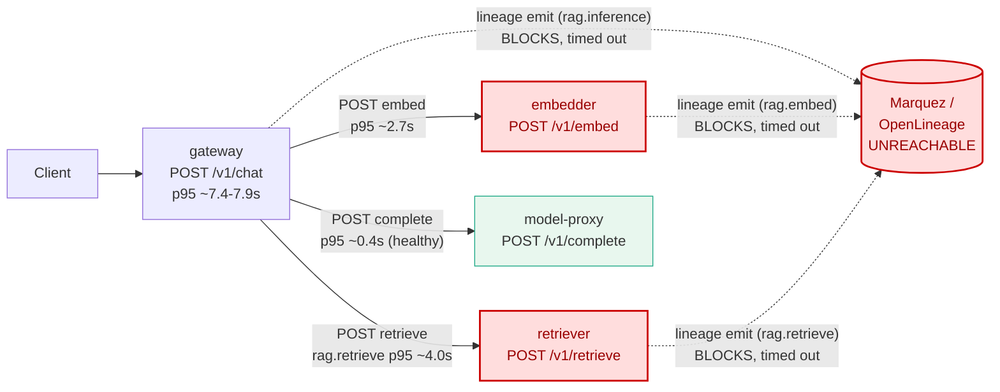

# Postmortem: gateway p95 latency above 2s

- **Status:** open
- **Severity:** sev1
- **Verified:** no
- **Opened:** 2026-08-14 17:15:41Z
- **Resolved:** (still open)

## Timeline (machine-generated)

All times UTC on 2026-08-14 unless a full date is shown.

| Time (UTC) | Source | Event |
| --- | --- | --- |
| 17:12:51Z | log-spike | log-spike onset: {"level":"warn","service":"retriever","message":"lineage emit failed","trace_id":"3862c913d6cc0e32084c81ec4a07f960","span_id":"af0d4859bf936f18","time":"2026-08-14T17:12:51.768Z","reason":"The operation timed out.","job":"… |
| 17:15:10Z | alert | alert firing: Gateway p95 latency > 2s |
| 17:17:29Z | k8s | ReplicaSet/retriever-6b7c75d794: SuccessfulCreate |
| 17:17:29Z | k8s | Pod/retriever-6599665c84-qzghv: Killing |
| 17:17:29Z | k8s | ReplicaSet/retriever-6599665c84: SuccessfulDelete |
| 17:17:29Z | k8s | Deployment/retriever: ScalingReplicaSet |
| 17:17:29Z | k8s | Pod/retriever-6b7c75d794-scx9w: FailedScheduling |
| 17:17:29Z | k8s | Pod/retriever-6b7c75d794-td2kh: FailedScheduling |
| 17:17:30Z | k8s | Pod/retriever-6b7c75d794-scx9w: Started |
| 17:17:30Z | k8s | Pod/retriever-6b7c75d794-scx9w: Pulled |
| 17:17:30Z | k8s | Pod/retriever-6b7c75d794-scx9w: Created |
| 17:17:30Z | k8s | Pod/retriever-6b7c75d794-td2kh: FailedScheduling |
| 17:17:30Z | k8s | Pod/retriever-6b7c75d794-scx9w: Scheduled |
| 17:17:37Z | k8s | ReplicaSet/retriever-6b7c75d794: SuccessfulCreate |
| 17:17:37Z | k8s | Pod/retriever-6599665c84-ppf7c: Killing |
| 17:17:37Z | k8s | ReplicaSet/retriever-6599665c84: SuccessfulDelete |
| 17:17:37Z | k8s | Deployment/retriever: ScalingReplicaSet |
| 17:17:37Z | k8s | Pod/retriever-6b7c75d794-kmr4t: FailedScheduling |
| 17:17:38Z | k8s | Pod/retriever-6b7c75d794-kmr4t: FailedScheduling |
| 17:17:38Z | k8s | Pod/retriever-6b7c75d794-td2kh: Scheduled |
| 17:17:39Z | k8s | Pod/retriever-6b7c75d794-td2kh: Started |
| 17:17:39Z | k8s | Pod/retriever-6b7c75d794-td2kh: Pulled |
| 17:17:39Z | k8s | Pod/retriever-6b7c75d794-td2kh: Created |
| 17:17:45Z | k8s | ReplicaSet/retriever-6b7c75d794: SuccessfulCreate |
| 17:17:45Z | k8s | Pod/retriever-6599665c84-sb764: Killing |
| 17:17:45Z | k8s | ReplicaSet/retriever-6599665c84: SuccessfulDelete |
| 17:17:45Z | k8s | Deployment/retriever: ScalingReplicaSet |
| 17:17:45Z | k8s | Pod/retriever-6b7c75d794-p4ggw: FailedScheduling |
| 17:17:46Z | k8s | Pod/retriever-6b7c75d794-p4ggw: FailedScheduling |
| 17:17:46Z | k8s | Pod/retriever-6b7c75d794-kmr4t: Scheduled |
| 17:17:47Z | k8s | Pod/retriever-6b7c75d794-kmr4t: Started |
| 17:17:47Z | k8s | Pod/retriever-6b7c75d794-kmr4t: Pulled |
| 17:17:47Z | k8s | Pod/retriever-6b7c75d794-kmr4t: Created |
| 17:17:53Z | k8s | Pod/retriever-6599665c84-cf972: Killing |
| 17:17:53Z | k8s | ReplicaSet/retriever-6599665c84: SuccessfulDelete |
| 17:17:53Z | k8s | Deployment/retriever: ScalingReplicaSet |
| 17:17:54Z | k8s | Pod/retriever-6b7c75d794-p4ggw: Scheduled |
| 17:17:55Z | k8s | Pod/retriever-6b7c75d794-p4ggw: Started |
| 17:17:55Z | k8s | Pod/retriever-6b7c75d794-p4ggw: Pulled |
| 17:17:55Z | k8s | Pod/retriever-6b7c75d794-p4ggw: Created |
| 17:22:35Z | k8s | ReplicaSet/embedder-fdff9df4: SuccessfulCreate |
| 17:22:35Z | k8s | Deployment/embedder: ScalingReplicaSet |
| 17:22:35Z | k8s | Pod/embedder-fdff9df4-xd55z: FailedScheduling |
| 17:22:35Z | k8s | Pod/embedder-fdff9df4-sqvm2: FailedScheduling |
| 17:24:37Z | remediation | rollout_undo retriever executed (run run_1a00145b84c3e) |
| 17:24:38Z | remediation | rollout_undo embedder executed (run run_1a00145b84c3e) |
| 17:24:39Z | k8s | Pod/retriever-6b7c75d794-kmr4t: Killing |
| 17:24:39Z | k8s | ReplicaSet/retriever-6b7c75d794: SuccessfulDelete |
| 17:24:39Z | k8s | ReplicaSet/retriever-6599665c84: SuccessfulCreate |
| 17:24:39Z | k8s | Deployment/retriever: ScalingReplicaSet |
| 17:24:39Z | k8s | Deployment/embedder: ScalingReplicaSet |
| 17:24:39Z | k8s | Pod/retriever-6599665c84-q6m75: FailedScheduling |
| 17:24:39Z | k8s | Pod/retriever-6599665c84-2jg4b: FailedScheduling |
| 17:24:39Z | k8s | Pod/embedder-fdff9df4-sqvm2: FailedScheduling |
| 17:24:40Z | k8s | ReplicaSet/embedder-fdff9df4: SuccessfulDelete |
| 17:24:40Z | k8s | ReplicaSet/embedder-596696c46d: SuccessfulCreate |
| 17:24:40Z | k8s | Deployment/embedder: ScalingReplicaSet |
| 17:24:40Z | k8s | Pod/embedder-fdff9df4-xd55z: Scheduled |
| 17:24:40Z | k8s | Pod/embedder-596696c46d-jgckp: FailedScheduling |
| 17:24:40Z | k8s | Pod/embedder-596696c46d-4stqg: FailedScheduling |
| 17:24:41Z | k8s | Pod/embedder-fdff9df4-xd55z: Started |
| 17:24:41Z | k8s | Pod/embedder-fdff9df4-xd55z: Pulled |
| 17:24:41Z | k8s | Pod/embedder-fdff9df4-xd55z: Created |

## Evidence links

- [Loki — logs over the incident window](http://localhost:3001/explore?schemaVersion=1&panes=%7B%22pm%22%3A+%7B%22datasource%22%3A+%22loki%22%2C+%22queries%22%3A+%5B%7B%22refId%22%3A+%22A%22%2C+%22datasource%22%3A+%7B%22type%22%3A+%22loki%22%2C+%22uid%22%3A+%22loki%22%7D%2C+%22expr%22%3A+%22%7Bnamespace%3D%5C%22subject%5C%22%7D+%7C~+%5C%22%28%3Fi%29error%7Cfailed%5C%22%22%7D%5D%2C+%22range%22%3A+%7B%22from%22%3A+%221786727741499%22%2C+%22to%22%3A+%221786728421363%22%7D%7D%7D&orgId=1)
- [Mimir — metrics over the incident window](http://localhost:3001/explore?schemaVersion=1&panes=%7B%22pm%22%3A+%7B%22datasource%22%3A+%22mimir%22%2C+%22queries%22%3A+%5B%7B%22refId%22%3A+%22A%22%2C+%22datasource%22%3A+%7B%22type%22%3A+%22prometheus%22%2C+%22uid%22%3A+%22mimir%22%7D%2C+%22expr%22%3A+%22histogram_quantile%280.95%2C+sum+by+%28le%2C+service%29+%28rate%28request_duration_seconds_bucket%5B5m%5D%29%29%29%22%7D%5D%2C+%22range%22%3A+%7B%22from%22%3A+%221786727741499%22%2C+%22to%22%3A+%221786728421363%22%7D%7D%7D&orgId=1)

## Investigation context

**Runbook match:** none — no tool narrowing applied for this alert. Available runbooks: README.md, canary-abort.md, ci-pipeline-red.md, dq-freshness-stall.md, gateway-high-error-rate.md, k8s-crashloop.md, k8s-node-failure.md, snapshot-agent-audit.md, stale-secret.md

Pre-check battery (as injected at run start)

## Pre-check leads

### recent_deploys — LEAD
3 deploy-window leads
- argo app embedder: sync=OutOfSync health=Healthy (revision c025382ba170)
- argo app platform: sync=OutOfSync health=Healthy (revision c025382ba170)
- argo app retriever: sync=OutOfSync health=Healthy (revision c025382ba170)

### log_spike — LEAD
error/failed log rate 200/10min vs baseline 0/10min (200x baseline) — onset: {"level":"warn","service":"retriever","message":"lineage emit failed","trace_id":"3862c913d6cc0e32084c81ec4a07f960","span_id":"af0d4859bf936f18","time":"2026-08-14T17:12:51.768Z","reason":"The operation timed out.","job":"rag.retrieve","eventType":"COMPLETE"} at 2026-08-14T17:12:51.770214+00:00
- error/failed log rate 200/10min vs baseline 0/10min (200x baseline) — onset: {"level":"warn","service":"retriever","message":"lineage emit failed","trace_id":"3862c913d6cc0e32084c81ec4a07… (truncated)

### attribution — LEAD
errors concentrate on gateway (26.5%); time concentrates in gateway's own handler (~4.8s of 7.0s) over the last 10m — which is not necessarily the workload named on the alert:
- gateway: 26.5% of its OWN responses are 5xx (10m)
- retriever: 22.1% of its OWN responses are 5xx (10m)
- model-proxy: 3.7% of its OWN responses are 5xx (10m)
- gateway → POST retriever: 24.9% of those outbound calls failed
- gateway → POST model-proxy: 15.7% of those outbound calls failed
- own-handler p95 (server p95 minus its slowest outbound call — a ranking, not a measurement): gateway ~4.8s of 7.0s end to end, embedder ~2.2s of 2.2s end to end, retriever ~2.0s of 2.0s end to end
- gateway → POST embedder: p95 2.2s outbound
- gateway → POST retriever: p95 2.0s outbound

### kube_scan — OK
all pods Ready, no notable cluster events

### rollout_state — OK
gateway and model-proxy rollouts stable, no failed analysis

### secret_age — OK
Secret subject-db-credentials last modified 20d 17h ago (created 20d 17h ago).

## Narrative

## Summary
Gateway p95 for `POST /v1/chat` breached the 2s SLO and stayed pinned around 7-7.9s. Root cause is a synchronous, per-request "lineage emit" call (OpenLineage → Marquez) embedded in the hot path of **all three** RAG-chain services (gateway, retriever, embedder), each hitting `The operation timed out.` on effectively every request and adding its full timeout duration to that request's response time before continuing.

## Impact
Every `/v1/chat` request paid the tax, not just a subset: gateway's own root span (`rag.chat`) p95 was ~7.4-7.9s, driven almost entirely by two sequential downstream hops that should be fast fitting for their normal traffic and are not: `embedder /v1/embed` own-server p95 ~2.7s and `retriever /v1/retrieve` own-server p95 ~2.3-4.0s (which itself further wraps the client call to retriever). `rag.generate`/model-proxy stayed healthy at ~0.43s p95 throughout, confirming the fault is scoped to the embed+retrieve legs, not the whole chain.

## Root cause
Evidence chain:
- `traces_spanmetrics_latency_bucket` (Mimir): `POST /v1/embed` and `POST /v1/retrieve` server-side p95s (2.3-2.7s) closely track a fixed timeout value, not normal compute — and this value repeats identically across independently-scaled pods.
- Loki, all three services (`gateway` job=`rag.inference`, `retriever` job=`rag.retrieve`, `embedder` job=`rag.embed`): dense, continuous `"lineage emit failed" ... "reason":"The operation timed out."` warnings, present on effectively every request cycle (START/COMPLETE pairs a fraction of a second apart), not an occasional blip.
- `rag.chat` root span (7.4-7.9s) reconciles almost exactly to `POST embedder` (~2.7s) + `rag.retrieve` (~4.0s, itself ≈ `POST retriever`'s 2.3s server time plus its own embedded lineage-emit wait) + `rag.generate` (~0.4s) run **sequentially** — i.e. this is additive queueing of blocking dependency calls on the critical path, not one slow hop.
- Ruled out: no CI run or Argo sync happened today (last merge/build was the prior day, `gitea_ci_runs`); the `embedder`/`retriever`/`platform` Argo apps are OutOfSync but their sync history shows that drift is over a week stale, not a fresh deploy — a decoy, not the cause. Pods show zero restarts from OOM, no k8s warning events, CPU/memory both well under limits (~100-190m CPU, ~90-110Mi of 384-512Mi), and no CPU-throttling series exists for these pods — this is not a resource-exhaustion incident. Image digests are identical across gateway/retriever/embedder by design (shared base build artifact), ruling out an image mix-up as the cause.
- retriever pods carried a very recent `restartedAt` bump (an involuntary/prior recycle) and continued emitting the identical timeout warnings immediately afterward — proof the fault is not local pod/process state, it's the destination dependency itself being unreachable/slow from inside the cluster.

**Category: downstream dependency (lineage/OpenLineage-to-Marquez emit call) invoked synchronously on the request hot path, timing out on effectively every call and stacking additively across gateway → embedder → retriever.**

## What fixed it
Rolled back `retriever` and `embedder` Deployments to their previous ReplicaSet revision (`kubectl rollout undo`, approved for both, action_ids `3cf7fccfb7532c13` / `620556928da42dd2`) on the theory that a recent spec/env patch (evidenced by the fresh `restartedAt` annotation and a new ReplicaSet with an unchanged image tag) introduced or re-enabled the blocking lineage call.

**This did not resolve the incident.** Post-rollback: `histogram_quantile(0.95, ...POST /v1/chat...)` measured 7.79s (no improvement, if anything slightly worse than the ~7.4s pre-remediation reading), `alert_status` still reports `active: true` (since 17:15:10Z), and `"lineage emit failed"` warnings continued on gateway, retriever, and embedder alike immediately after execution. Additionally, the new (rolled-back) retriever/embedder pods stuck in `Pending` — the small cluster couldn't schedule the rollout's surge pods, so the previously-running pods kept serving traffic essentially unchanged. Reporting this honestly rather than claiming a fix: **the metric has not recovered as of this session.**

## Lessons
- None of the available runtime remediation tools (restart, scale, memory-limit patch, rollout undo, db-secret sync) can address a dependency call baked into application code that blocks the response path — this needs either a code change (make lineage emission fire-and-forget with a short, non-blocking timeout / circuit breaker) or restoring real connectivity to the Marquez endpoint. That is out of scope for this on-call toolset and should be filed as a follow-up engineering fix, not chased further with infrastructure levers.
- The rollout also exposed a secondary, unrelated finding worth a ticket: this cluster doesn't have headroom to schedule surge pods during a rolling update (both the retriever and embedder rollbacks left extra pods stuck `Pending`), so rolling-update-based remediations are unreliable here until capacity is fixed.
- A new runbook is warranted for `Gateway p95 latency > 2s`: check `traces_spanmetrics_latency_bucket` per-span-name breakdown first (it cleanly separates "gateway itself is slow" from "gateway is relaying slow sequential downstream calls," which the blunt attribution heuristic conflates), and grep all three RAG-chain services for `"lineage emit failed"` early — it is the fastest signal to this failure mode.

