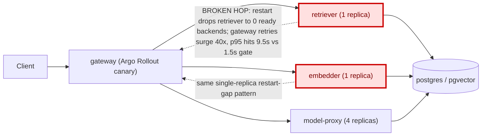

# Postmortem: gateway latency error budget burning slowly (10% of the 28d budget in 6h; 30m & 6h windows)

- **Status:** open
- **Severity:** sev2
- **Verified:** no
- **Opened:** 2026-08-14 00:13:47Z
- **Resolved:** (still open)

## Timeline (machine-generated)

All times UTC on 2026-08-14 unless a full date is shown.

| Time (UTC) | Source | Event |
| --- | --- | --- |
| 00:04:44Z | k8s | Pod/retriever-55dc5cc955-9vb6l: Started |
| 00:04:44Z | k8s | Pod/retriever-55dc5cc955-9vb6l: Created |
| 00:04:44Z | k8s | Pod/gateway-746788f5df-t6bqb: Killing |
| 00:04:44Z | k8s | AnalysisRun/gateway-746788f5df-28-1: MetricSuccessful |
| 00:04:44Z | k8s | AnalysisRun/gateway-746788f5df-28-1: AnalysisRunSuccessful |
| 00:04:44Z | k8s | ReplicaSet/gateway-746788f5df: SuccessfulDelete |
| 00:04:44Z | k8s | Rollout/gateway: ScalingReplicaSet |
| 00:04:44Z | log-spike | log-spike onset: name=gateway-746788f5df-28-1 kind=AnalysisRun objectAPIversion=argoproj.io/v1alpha1 objectRV=2663885 eventRV=2663886 reportingcontroller=rollouts-controller sourcecomponent=rollouts-controller reason=MetricSuccessful type=… |
| 00:04:45Z | k8s | ReplicaSet/gateway-569c859d85: SuccessfulCreate |
| 00:04:45Z | k8s | Rollout/gateway: ScalingReplicaSet |
| 00:04:45Z | k8s | Pod/gateway-569c859d85-mlpcq: Scheduled |
| 00:04:46Z | k8s | Pod/gateway-569c859d85-mlpcq: Started |
| 00:04:46Z | k8s | Pod/gateway-569c859d85-mlpcq: Pulled |
| 00:04:46Z | k8s | Pod/gateway-569c859d85-mlpcq: Created |
| 00:04:50Z | k8s | Pod/retriever-86699d9d9d-hnkl7: Killing |
| 00:04:50Z | k8s | ReplicaSet/retriever-86699d9d9d: SuccessfulDelete |
| 00:04:50Z | k8s | Deployment/retriever: ScalingReplicaSet |
| 00:04:53Z | k8s | Rollout/gateway: RolloutStepCompleted |
| 00:04:55Z | k8s | Rollout/gateway: AnalysisRunRunning |
| 00:08:24Z | k8s | AnalysisRun/gateway-569c859d85-29-1: MetricSuccessful |
| 00:08:24Z | k8s | AnalysisRun/gateway-569c859d85-29-1: AnalysisRunSuccessful |
| 00:08:24Z | k8s | Rollout/gateway: AnalysisRunSuccessful |
| 00:08:26Z | k8s | Pod/gateway-77cfb95667-c2tjm: Killing |
| 00:08:26Z | k8s | ReplicaSet/gateway-77cfb95667: SuccessfulDelete |
| 00:08:27Z | k8s | Pod/gateway-77cfb95667-c2tjm: Unhealthy |
| 00:08:28Z | k8s | Pod/gateway-569c859d85-59dfp: Started |
| 00:08:28Z | k8s | Pod/gateway-569c859d85-59dfp: Pulled |
| 00:08:28Z | k8s | Pod/gateway-569c859d85-59dfp: Created |
| 00:08:28Z | k8s | ReplicaSet/gateway-569c859d85: SuccessfulCreate |
| 00:08:28Z | k8s | Pod/gateway-569c859d85-59dfp: Scheduled |
| 00:09:56Z | k8s | Pod/gateway-569c859d85-59dfp: Killing |
| 00:09:56Z | k8s | AnalysisRun/gateway-569c859d85-29-3: MetricSuccessful |
| 00:09:56Z | k8s | AnalysisRun/gateway-569c859d85-29-3: AnalysisRunSuccessful |
| 00:09:56Z | k8s | ReplicaSet/gateway-569c859d85: SuccessfulDelete |
| 00:09:57Z | k8s | ReplicaSet/gateway-77cfb95667: SuccessfulCreate |
| 00:09:57Z | k8s | Pod/gateway-77cfb95667-jcmwg: Scheduled |
| 00:09:58Z | k8s | Pod/gateway-77cfb95667-jcmwg: Started |
| 00:09:58Z | k8s | Pod/gateway-77cfb95667-jcmwg: Pulled |
| 00:09:58Z | k8s | Pod/gateway-77cfb95667-jcmwg: Created |
| 00:10:05Z | k8s | Pod/gateway-569c859d85-mlpcq: Killing |
| 00:10:05Z | k8s | ReplicaSet/gateway-569c859d85: SuccessfulDelete |
| 00:10:06Z | k8s | ReplicaSet/gateway-74677864c: SuccessfulCreate |
| 00:10:06Z | k8s | Pod/gateway-74677864c-4v9fx: Scheduled |
| 00:10:07Z | k8s | Pod/gateway-74677864c-4v9fx: Started |
| 00:10:07Z | k8s | Pod/gateway-74677864c-4v9fx: Pulled |
| 00:10:07Z | k8s | Pod/gateway-74677864c-4v9fx: Created |
| 00:10:15Z | k8s | ReplicaSet/retriever-6599665c84: SuccessfulCreate |
| 00:10:15Z | k8s | Deployment/retriever: ScalingReplicaSet |
| 00:10:15Z | k8s | Pod/retriever-6599665c84-qzghv: Scheduled |
| 00:10:16Z | k8s | Pod/retriever-6599665c84-qzghv: Started |
| 00:10:16Z | k8s | Pod/retriever-6599665c84-qzghv: Pulled |
| 00:10:16Z | k8s | Pod/retriever-6599665c84-qzghv: Created |
| 00:10:23Z | k8s | Pod/retriever-55dc5cc955-9vb6l: Killing |
| 00:10:23Z | k8s | ReplicaSet/retriever-55dc5cc955: SuccessfulDelete |
| 00:10:23Z | k8s | Deployment/retriever: ScalingReplicaSet |
| 00:13:10Z | alert | alert firing: SLO gateway latency — slow burn |
| 00:13:45Z | k8s | AnalysisRun/gateway-74677864c-30-1: MetricSuccessful |
| 00:13:45Z | k8s | AnalysisRun/gateway-74677864c-30-1: AnalysisRunSuccessful |
| 00:13:45Z | k8s | Rollout/gateway: AnalysisRunSuccessful |
| 00:13:46Z | k8s | Pod/gateway-77cfb95667-jcmwg: Killing |
| 00:13:46Z | k8s | ReplicaSet/gateway-77cfb95667: SuccessfulDelete |
| 00:13:47Z | k8s | ReplicaSet/gateway-74677864c: SuccessfulCreate |
| 00:13:47Z | k8s | Pod/gateway-74677864c-fqwwb: Scheduled |
| 00:13:48Z | k8s | Pod/gateway-74677864c-fqwwb: Started |
| 00:13:48Z | k8s | Pod/gateway-74677864c-fqwwb: Pulled |
| 00:13:48Z | k8s | Pod/gateway-74677864c-fqwwb: Created |
| 00:17:26Z | k8s | AnalysisRun/gateway-74677864c-30-3: MetricSuccessful |
| 00:17:26Z | k8s | AnalysisRun/gateway-74677864c-30-3: AnalysisRunSuccessful |
| 00:17:27Z | k8s | Pod/gateway-77cfb95667-pxxjw: Killing |
| 00:17:27Z | k8s | ReplicaSet/gateway-77cfb95667: SuccessfulDelete |
| 00:17:29Z | k8s | Pod/gateway-74677864c-fzx42: Started |
| 00:17:29Z | k8s | Pod/gateway-74677864c-fzx42: Pulled |
| 00:17:29Z | k8s | Pod/gateway-74677864c-fzx42: Created |
| 00:17:29Z | k8s | ReplicaSet/gateway-74677864c: SuccessfulCreate |
| 00:17:29Z | k8s | Pod/gateway-74677864c-fzx42: Scheduled |
| 00:17:36Z | k8s | Pod/gateway-77cfb95667-8lsdc: Killing |
| 00:17:36Z | k8s | ReplicaSet/gateway-77cfb95667: SuccessfulDelete |
| 00:17:37Z | k8s | ReplicaSet/gateway-74677864c: SuccessfulCreate |
| 00:17:37Z | k8s | Pod/gateway-74677864c-7tjvp: Scheduled |
| 00:17:38Z | k8s | Pod/gateway-74677864c-7tjvp: Started |
| 00:17:38Z | k8s | Pod/gateway-74677864c-7tjvp: Pulled |
| 00:17:38Z | k8s | Pod/gateway-74677864c-7tjvp: Created |
| 00:18:11Z | k8s | Deployment/retriever: ScalingReplicaSet |
| 00:18:11Z | remediation | scale_deployment retriever executed (run run_19ffd9e2324445) |
| 00:18:11Z | remediation | scale_deployment embedder executed (run run_19ffd9e2324445) |
| 00:18:12Z | k8s | Pod/retriever-6599665c84-cf972: Started |
| 00:18:12Z | k8s | Pod/retriever-6599665c84-cf972: Pulled |
| 00:18:12Z | k8s | Pod/retriever-6599665c84-cf972: Created |
| 00:18:12Z | k8s | ReplicaSet/retriever-6599665c84: SuccessfulCreate |
| 00:18:12Z | k8s | Pod/embedder-fdff9df4-kg9h2: Pulling |
| 00:18:12Z | k8s | Pod/embedder-fdff9df4-kg9h2: Pulled |
| 00:18:12Z | k8s | ReplicaSet/embedder-fdff9df4: SuccessfulCreate |
| 00:18:12Z | k8s | Deployment/embedder: ScalingReplicaSet |
| 00:18:12Z | k8s | Pod/retriever-6599665c84-cf972: Scheduled |
| 00:18:12Z | k8s | Pod/embedder-fdff9df4-kg9h2: Scheduled |
| 00:18:13Z | deploy:argo | embedder synced to c025382ba170 |
| 00:18:13Z | k8s | Pod/embedder-fdff9df4-kg9h2: Started |
| 00:18:13Z | k8s | Pod/embedder-fdff9df4-kg9h2: Killing |
| 00:18:13Z | k8s | Pod/embedder-fdff9df4-kg9h2: Created |
| 00:18:13Z | k8s | ReplicaSet/embedder-fdff9df4: SuccessfulDelete |
| 00:18:13Z | k8s | Deployment/embedder: ScalingReplicaSet |
| 00:18:15Z | deploy:annotation | deploy embedder via gitops c025382 (argo sync) |

## Evidence links

- [Loki — logs over the incident window](http://localhost:3001/explore?schemaVersion=1&panes=%7B%22pm%22%3A+%7B%22datasource%22%3A+%22loki%22%2C+%22queries%22%3A+%5B%7B%22refId%22%3A+%22A%22%2C+%22datasource%22%3A+%7B%22type%22%3A+%22loki%22%2C+%22uid%22%3A+%22loki%22%7D%2C+%22expr%22%3A+%22%7Bnamespace%3D%5C%22subject%5C%22%7D+%7C~+%5C%22%28%3Fi%29error%7Cfailed%5C%22%22%7D%5D%2C+%22range%22%3A+%7B%22from%22%3A+%221786666427161%22%2C+%22to%22%3A+%221786666791514%22%7D%7D%7D&orgId=1)
- [Mimir — metrics over the incident window](http://localhost:3001/explore?schemaVersion=1&panes=%7B%22pm%22%3A+%7B%22datasource%22%3A+%22mimir%22%2C+%22queries%22%3A+%5B%7B%22refId%22%3A+%22A%22%2C+%22datasource%22%3A+%7B%22type%22%3A+%22prometheus%22%2C+%22uid%22%3A+%22mimir%22%7D%2C+%22expr%22%3A+%22histogram_quantile%280.95%2C+sum+by+%28le%2C+service%29+%28rate%28request_duration_seconds_bucket%5B5m%5D%29%29%29%22%7D%5D%2C+%22range%22%3A+%7B%22from%22%3A+%221786666427161%22%2C+%22to%22%3A+%221786666791514%22%7D%7D%7D&orgId=1)

## Investigation context

**Runbook match:** none — no tool narrowing applied for this alert. Available runbooks: README.md, canary-abort.md, ci-pipeline-red.md, dq-freshness-stall.md, gateway-high-error-rate.md, k8s-crashloop.md, k8s-node-failure.md, snapshot-agent-audit.md, stale-secret.md

Pre-check battery (as injected at run start)

## Pre-check leads

### recent_deploys — LEAD
2 deploy-window leads
- argo app gateway: sync=Synced health=Progressing (revision c025382ba170)
- argo app platform: sync=OutOfSync health=Healthy (revision c025382ba170)

### log_spike — LEAD
error/failed log rate 5/10min vs baseline 0/10min (5x baseline) — onset: name=gateway-746788f5df-28-1 kind=AnalysisRun objectAPIversion=argoproj.io/v1alpha1 objectRV=2663885 eventRV=2663886 reportingcontroller=rollouts-controller sourcecomponent=rollouts-controller reason=MetricSuccessful type=Normal count=1 msg="Metric 'canary-error-rate' Completed. Result: Successful"  at 2026-08-14T00:04:44+00:00
- error/failed log rate 5/10min vs baseline 0/10min (5x baseline) — onset: name=gateway-746788f5df-28-1 kind=AnalysisRun objectAPIversion=argoproj.io/v1alpha1 objectRV=2663885 eventRV=26638… (truncated)

### attribution — LEAD
 over the last 10m — which is not necessarily the workload named on the alert:
- embedder reported no server-side requests at all — a workload that is down or unscheduled emits nothing, and its CALLERS carry its errors
- retriever reported no server-side requests at all — a workload that is down or unscheduled emits nothing, and its CALLERS carry its errors

### rollout_state — LEAD
1 rollout-state lead
- rollout gateway: Progressing — more replicas need to be updated (step 2/4)

### kube_scan — OK
all pods Ready, no notable cluster events

### secret_age — OK
Secret subject-db-credentials last modified 20d 0h ago (created 20d 0h ago).

## Narrative

## Summary

Gateway breached its latency SLO ("slow burn", 10% of the 28d error budget burned in 6h) because of two short, severe p95 spikes (measured 6.5–9.5s against Argo Rollouts' 1.5s canary gate) that line up exactly with `retriever` and `embedder` pods being restarted. Root cause was a structural resilience gap, not a bad code deploy.

## Impact

Two transient windows (each roughly 10 minutes) of gateway p95 latency 1000x+ above steady state (4.75ms baseline → up to 9.5s), enough cumulative burn to trip the 30m/6h slow-burn SLO alert even though the service was otherwise healthy the rest of the 6h window. One of these windows coincided with an in-flight canary analysis and correctly triggered an automatic Argo Rollouts abort of revision 28 (pod-template-hash `746788f5df`).

## Root cause

`retriever` and `embedder` are plain Kubernetes Deployments running at a single replica each (confirmed via `kubectl get deployments`: `retriever 1/1`, `embedder 1/1`). Every restart of either pod (clean `kubectl.kubernetes.io/restartedAt` recreations, container `Restart Count: 0` — not crashes) necessarily passes through a window with zero Ready backends for that service before the replacement pod becomes ready, because there is no second replica to absorb traffic during the swap.

During both observed restart windows, `request_duration_seconds_count{job=~"retriever|embedder"}` jumped from its steady 0.3 req/s baseline to ~12–13 req/s (a ~40x surge) with no corresponding surge in gateway's own inbound traffic — consistent with gateway's calls queuing/retrying against an unavailable backend rather than organic load. Gateway's own p95 (`histogram_quantile(0.95, sum by (le) (rate(request_duration_seconds_bucket{job="gateway"}[5m])))`) spiked to 8.6s in the first window and 6.6–9.5s in the second, both far above the 1.5s canary-p95 gate defined in the `canary-analysis` AnalysisTemplate.

We ruled out a bad deploy as the cause: the aborted canary ReplicaSet (`gateway-746788f5df`, revision 28) ran the exact same image tag (`10f24bc`) and the exact same memory limit (384Mi) as the healthy stable ReplicaSet (`gateway-77cfb95667`) — the pod-template hash differed only due to routine restart churn, not a spec change. The most recent commit on `main` (PR #76, `b1f2623593`, merged well before the second spike) touched only the oncall agent's system-prompt string in `apps/agent-service`, entirely unrelated to gateway/retriever/embedder.

## What fixed it

Scaled `retriever` and `embedder` from 1 to 2 replicas each (dry-run reviewed — `spec.replicas: 1 -> 2` for both — approved, then executed). With 2 replicas, a rolling restart of either service now always leaves at least one Ready backend, closing the zero-availability window that was amplifying into a gateway-side retry storm.

Confirmed from the metric directly: `histogram_quantile(0.95, sum by (le) (rate(request_duration_seconds_bucket{job="gateway"}[5m])))` reads 4.75ms post-change (back to steady state), and `retriever`/`embedder` request rates are back at the 0.3 req/s baseline. The in-flight gateway canary (hash `74677864c`) finished its remaining analysis step cleanly during remediation and is now fully promoted and stable across all 4 replicas. `alert_status` was checked twice (pre- and post-remediation) and still reports active — expected, since this slow-burn alert evaluates 30m/6h windows and needs an evaluation cycle to clear; recovery is confirmed here from the underlying metric rather than by polling the alert.

## Lessons

- Single-replica Deployments sitting upstream of a latency-SLO'd service are a standing SLO risk: any voluntary disruption (restart, node drain, future chaos exercises) becomes a real availability gap, not just a blip — this is worth an audit across other single-replica services in `subject`.
- Argo Rollouts' `canary-p95` gate did exactly its job here, auto-aborting the canary that happened to land during a bad window before it reached full traffic. The alert we responded to was for the stable path's cumulative burn from these transient dips, not a rollout failure — don't conflate the two when triaging.
- No runbook currently matches "SLO gateway latency — slow burn" (`runbook_lookup` returned no match). Worth authoring one that starts by checking downstream (retriever/embedder) replica counts and recent restart timelines before assuming a bad gateway deploy.

