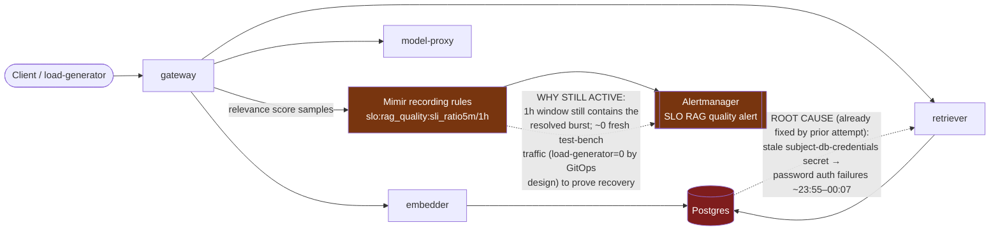

# Postmortem: RAG top-1 relevance below the 90% objective over the last hour (burn-rate alerting saturates for a loose SLO)

- **Status:** open
- **Severity:** sev2
- **Verified:** no
- **Opened:** 2026-08-14 00:05:48Z
- **Resolved:** (still open)

## Timeline (machine-generated)

All times UTC on 2026-08-14 unless a full date is shown.

| Time (UTC) | Source | Event |
| --- | --- | --- |
| 00:01:18Z | log-spike | log-spike onset: [gateway] usage write failed: Failed query: insert into "usage_events" ("id", "tenant", "prompt_tokens", "completion_tokens", "model", "created_at") values (default, $1, $2, $3, $4, default) |
| 00:02:18Z | k8s | ReplicaSet/retriever-86699d9d9d: SuccessfulCreate |
| 00:02:18Z | k8s | Deployment/retriever: ScalingReplicaSet |
| 00:02:18Z | k8s | Rollout/gateway: ScalingReplicaSet |
| 00:02:18Z | k8s | Rollout/gateway: RolloutUpdated |
| 00:02:18Z | k8s | Rollout/gateway: NewReplicaSetCreated |
| 00:02:18Z | k8s | Pod/retriever-86699d9d9d-hnkl7: Scheduled |
| 00:02:19Z | k8s | ReplicaSet/gateway-7cf8f79458: SuccessfulCreate |
| 00:02:19Z | k8s | Pod/gateway-77cfb95667-8tdz6: Killing |
| 00:02:19Z | k8s | ReplicaSet/gateway-77cfb95667: SuccessfulDelete |
| 00:02:19Z | k8s | Rollout/gateway: ScalingReplicaSet |
| 00:02:19Z | k8s | Pod/gateway-7cf8f79458-rffhd: Scheduled |
| 00:02:20Z | k8s | Pod/retriever-86699d9d9d-hnkl7: Started |
| 00:02:20Z | k8s | Pod/retriever-86699d9d9d-hnkl7: Pulled |
| 00:02:20Z | k8s | Pod/retriever-86699d9d9d-hnkl7: Created |
| 00:02:20Z | k8s | Pod/gateway-7cf8f79458-rffhd: Started |
| 00:02:20Z | k8s | Pod/gateway-7cf8f79458-rffhd: Pulled |
| 00:02:20Z | k8s | Pod/gateway-7cf8f79458-rffhd: Created |
| 00:02:27Z | k8s | Pod/retriever-77df6c9cc5-c7f2g: Killing |
| 00:02:27Z | k8s | ReplicaSet/retriever-77df6c9cc5: SuccessfulDelete |
| 00:02:27Z | k8s | Deployment/retriever: ScalingReplicaSet |
| 00:02:27Z | k8s | Rollout/gateway: RolloutStepCompleted |
| 00:02:28Z | k8s | Rollout/gateway: AnalysisRunRunning |
| 00:03:28Z | k8s | Pod/gateway-7cf8f79458-rffhd: Killing |
| 00:03:28Z | k8s | AnalysisRun/gateway-7cf8f79458-27-1: MetricSuccessful |
| 00:03:28Z | k8s | AnalysisRun/gateway-7cf8f79458-27-1: AnalysisRunSuccessful |
| 00:03:28Z | k8s | ReplicaSet/gateway-7cf8f79458: SuccessfulDelete |
| 00:03:28Z | k8s | Rollout/gateway: ScalingReplicaSet |
| 00:03:28Z | k8s | Rollout/gateway: RolloutUpdated |
| 00:03:29Z | k8s | ReplicaSet/gateway-746788f5df: SuccessfulCreate |
| 00:03:29Z | k8s | Rollout/gateway: ScalingReplicaSet |
| 00:03:29Z | k8s | Pod/gateway-746788f5df-t6bqb: Scheduled |
| 00:03:30Z | k8s | Pod/gateway-746788f5df-t6bqb: Started |
| 00:03:30Z | k8s | Pod/gateway-746788f5df-t6bqb: Pulled |
| 00:03:30Z | k8s | Pod/gateway-746788f5df-t6bqb: Created |
| 00:03:36Z | k8s | Rollout/gateway: RolloutStepCompleted |
| 00:03:38Z | k8s | Rollout/gateway: AnalysisRunRunning |
| 00:04:43Z | k8s | Pod/retriever-55dc5cc955-9vb6l: Pulled |
| 00:04:43Z | k8s | ReplicaSet/retriever-55dc5cc955: SuccessfulCreate |
| 00:04:43Z | k8s | Deployment/retriever: ScalingReplicaSet |
| 00:04:43Z | k8s | Rollout/gateway: RolloutUpdated |
| 00:04:43Z | k8s | Rollout/gateway: NewReplicaSetCreated |
| 00:04:43Z | k8s | Pod/retriever-55dc5cc955-9vb6l: Scheduled |
| 00:04:44Z | k8s | Pod/retriever-55dc5cc955-9vb6l: Started |
| 00:04:44Z | k8s | Pod/retriever-55dc5cc955-9vb6l: Created |
| 00:04:44Z | k8s | Pod/gateway-746788f5df-t6bqb: Killing |
| 00:04:44Z | k8s | AnalysisRun/gateway-746788f5df-28-1: MetricSuccessful |
| 00:04:44Z | k8s | AnalysisRun/gateway-746788f5df-28-1: AnalysisRunSuccessful |
| 00:04:44Z | k8s | ReplicaSet/gateway-746788f5df: SuccessfulDelete |
| 00:04:44Z | k8s | Rollout/gateway: ScalingReplicaSet |
| 00:04:45Z | k8s | ReplicaSet/gateway-569c859d85: SuccessfulCreate |
| 00:04:45Z | k8s | Rollout/gateway: ScalingReplicaSet |
| 00:04:45Z | k8s | Pod/gateway-569c859d85-mlpcq: Scheduled |
| 00:04:46Z | k8s | Pod/gateway-569c859d85-mlpcq: Started |
| 00:04:46Z | k8s | Pod/gateway-569c859d85-mlpcq: Pulled |
| 00:04:46Z | k8s | Pod/gateway-569c859d85-mlpcq: Created |
| 00:04:50Z | k8s | Pod/retriever-86699d9d9d-hnkl7: Killing |
| 00:04:50Z | k8s | ReplicaSet/retriever-86699d9d9d: SuccessfulDelete |
| 00:04:50Z | k8s | Deployment/retriever: ScalingReplicaSet |
| 00:04:53Z | k8s | Rollout/gateway: RolloutStepCompleted |
| 00:04:55Z | k8s | Rollout/gateway: AnalysisRunRunning |
| 00:05:10Z | alert | alert firing: SLO RAG quality — below objective |
| 00:08:24Z | k8s | AnalysisRun/gateway-569c859d85-29-1: MetricSuccessful |
| 00:08:24Z | k8s | AnalysisRun/gateway-569c859d85-29-1: AnalysisRunSuccessful |
| 00:08:24Z | k8s | Rollout/gateway: AnalysisRunSuccessful |
| 00:08:26Z | k8s | Pod/gateway-77cfb95667-c2tjm: Killing |
| 00:08:26Z | k8s | ReplicaSet/gateway-77cfb95667: SuccessfulDelete |
| 00:08:27Z | k8s | Pod/gateway-77cfb95667-c2tjm: Unhealthy |
| 00:08:28Z | k8s | Pod/gateway-569c859d85-59dfp: Started |
| 00:08:28Z | k8s | Pod/gateway-569c859d85-59dfp: Pulled |
| 00:08:28Z | k8s | Pod/gateway-569c859d85-59dfp: Created |
| 00:08:28Z | k8s | ReplicaSet/gateway-569c859d85: SuccessfulCreate |
| 00:08:28Z | k8s | Pod/gateway-569c859d85-59dfp: Scheduled |
| 00:09:36Z | remediation | update_db_secret secret/subject-db-credentials executed (run run_19ffd96d5c5295) |
| 00:09:55Z | remediation | restart_workload gateway executed (run run_19ffd96d5c5295) |
| 00:09:56Z | k8s | Pod/gateway-569c859d85-59dfp: Killing |
| 00:09:56Z | k8s | AnalysisRun/gateway-569c859d85-29-3: MetricSuccessful |
| 00:09:56Z | k8s | AnalysisRun/gateway-569c859d85-29-3: AnalysisRunSuccessful |
| 00:09:56Z | k8s | ReplicaSet/gateway-569c859d85: SuccessfulDelete |
| 00:09:57Z | k8s | ReplicaSet/gateway-77cfb95667: SuccessfulCreate |
| 00:09:57Z | k8s | Pod/gateway-77cfb95667-jcmwg: Scheduled |
| 00:09:58Z | k8s | Pod/gateway-77cfb95667-jcmwg: Started |
| 00:09:58Z | k8s | Pod/gateway-77cfb95667-jcmwg: Pulled |
| 00:09:58Z | k8s | Pod/gateway-77cfb95667-jcmwg: Created |
| 00:10:05Z | k8s | Pod/gateway-569c859d85-mlpcq: Killing |
| 00:10:05Z | k8s | ReplicaSet/gateway-569c859d85: SuccessfulDelete |
| 00:10:06Z | k8s | ReplicaSet/gateway-74677864c: SuccessfulCreate |
| 00:10:06Z | k8s | Pod/gateway-74677864c-4v9fx: Scheduled |
| 00:10:07Z | k8s | Pod/gateway-74677864c-4v9fx: Started |
| 00:10:07Z | k8s | Pod/gateway-74677864c-4v9fx: Pulled |
| 00:10:07Z | k8s | Pod/gateway-74677864c-4v9fx: Created |
| 00:10:15Z | k8s | ReplicaSet/retriever-6599665c84: SuccessfulCreate |
| 00:10:15Z | k8s | Deployment/retriever: ScalingReplicaSet |
| 00:10:15Z | k8s | Pod/retriever-6599665c84-qzghv: Scheduled |
| 00:10:15Z | remediation | restart_workload retriever executed (run run_19ffd96d5c5295) |
| 00:10:16Z | k8s | Pod/retriever-6599665c84-qzghv: Started |
| 00:10:16Z | k8s | Pod/retriever-6599665c84-qzghv: Pulled |
| 00:10:16Z | k8s | Pod/retriever-6599665c84-qzghv: Created |
| 00:10:23Z | k8s | Pod/retriever-55dc5cc955-9vb6l: Killing |
| 00:10:23Z | k8s | ReplicaSet/retriever-55dc5cc955: SuccessfulDelete |
| 00:10:23Z | k8s | Deployment/retriever: ScalingReplicaSet |
| 00:11:52Z | verification | recovery NOT verified — deadline armed |
| 00:13:45Z | k8s | AnalysisRun/gateway-74677864c-30-1: MetricSuccessful |
| 00:13:45Z | k8s | AnalysisRun/gateway-74677864c-30-1: AnalysisRunSuccessful |
| 00:13:45Z | k8s | Rollout/gateway: AnalysisRunSuccessful |
| 00:13:46Z | k8s | Pod/gateway-77cfb95667-jcmwg: Killing |
| 00:13:46Z | k8s | ReplicaSet/gateway-77cfb95667: SuccessfulDelete |
| 00:13:47Z | k8s | ReplicaSet/gateway-74677864c: SuccessfulCreate |
| 00:13:47Z | k8s | Pod/gateway-74677864c-fqwwb: Scheduled |
| 00:13:48Z | k8s | Pod/gateway-74677864c-fqwwb: Started |
| 00:13:48Z | k8s | Pod/gateway-74677864c-fqwwb: Pulled |
| 00:13:48Z | k8s | Pod/gateway-74677864c-fqwwb: Created |
| 00:17:26Z | k8s | AnalysisRun/gateway-74677864c-30-3: MetricSuccessful |
| 00:17:26Z | k8s | AnalysisRun/gateway-74677864c-30-3: AnalysisRunSuccessful |
| 00:17:27Z | k8s | Pod/gateway-77cfb95667-pxxjw: Killing |
| 00:17:27Z | k8s | ReplicaSet/gateway-77cfb95667: SuccessfulDelete |
| 00:17:29Z | k8s | Pod/gateway-74677864c-fzx42: Started |
| 00:17:29Z | k8s | Pod/gateway-74677864c-fzx42: Pulled |
| 00:17:29Z | k8s | Pod/gateway-74677864c-fzx42: Created |
| 00:17:29Z | k8s | ReplicaSet/gateway-74677864c: SuccessfulCreate |
| 00:17:29Z | k8s | Pod/gateway-74677864c-fzx42: Scheduled |
| 00:17:36Z | k8s | Pod/gateway-77cfb95667-8lsdc: Killing |
| 00:17:36Z | k8s | ReplicaSet/gateway-77cfb95667: SuccessfulDelete |
| 00:17:37Z | k8s | ReplicaSet/gateway-74677864c: SuccessfulCreate |
| 00:17:37Z | k8s | Pod/gateway-74677864c-7tjvp: Scheduled |
| 00:17:38Z | k8s | Pod/gateway-74677864c-7tjvp: Started |
| 00:17:38Z | k8s | Pod/gateway-74677864c-7tjvp: Pulled |
| 00:17:38Z | k8s | Pod/gateway-74677864c-7tjvp: Created |
| 00:18:11Z | k8s | Deployment/retriever: ScalingReplicaSet |
| 00:18:12Z | k8s | Pod/retriever-6599665c84-cf972: Started |
| 00:18:12Z | k8s | Pod/retriever-6599665c84-cf972: Pulled |
| 00:18:12Z | k8s | Pod/retriever-6599665c84-cf972: Created |
| 00:18:12Z | k8s | ReplicaSet/retriever-6599665c84: SuccessfulCreate |
| 00:18:12Z | k8s | Pod/embedder-fdff9df4-kg9h2: Pulling |
| 00:18:12Z | k8s | Pod/embedder-fdff9df4-kg9h2: Pulled |
| 00:18:12Z | k8s | ReplicaSet/embedder-fdff9df4: SuccessfulCreate |
| 00:18:12Z | k8s | Deployment/embedder: ScalingReplicaSet |
| 00:18:12Z | k8s | Pod/retriever-6599665c84-cf972: Scheduled |
| 00:18:12Z | k8s | Pod/embedder-fdff9df4-kg9h2: Scheduled |
| 00:18:13Z | deploy:argo | embedder synced to c025382ba170 |
| 00:18:13Z | k8s | Pod/embedder-fdff9df4-kg9h2: Started |
| 00:18:13Z | k8s | Pod/embedder-fdff9df4-kg9h2: Killing |
| 00:18:13Z | k8s | Pod/embedder-fdff9df4-kg9h2: Created |
| 00:18:13Z | k8s | ReplicaSet/embedder-fdff9df4: SuccessfulDelete |
| 00:18:13Z | k8s | Deployment/embedder: ScalingReplicaSet |
| 00:18:15Z | deploy:annotation | deploy embedder via gitops c025382 (argo sync) |
| 00:21:55Z | k8s | ReplicaSet/retriever-6599665c84: SuccessfulCreate |
| 00:21:55Z | k8s | Deployment/retriever: ScalingReplicaSet |
| 00:21:55Z | k8s | Pod/retriever-6599665c84-sb764: Scheduled |
| 00:21:55Z | k8s | Pod/retriever-6599665c84-ppf7c: Scheduled |
| 00:21:56Z | k8s | Pod/retriever-6599665c84-sb764: Started |
| 00:21:56Z | k8s | Pod/retriever-6599665c84-sb764: Pulling |
| 00:21:56Z | k8s | Pod/retriever-6599665c84-sb764: Pulled |
| 00:21:56Z | k8s | Pod/retriever-6599665c84-sb764: Created |
| 00:21:56Z | k8s | Pod/retriever-6599665c84-ppf7c: Started |
| 00:21:56Z | k8s | Pod/retriever-6599665c84-ppf7c: Pulling |
| 00:21:56Z | k8s | Pod/retriever-6599665c84-ppf7c: Pulled |
| 00:21:56Z | k8s | Pod/retriever-6599665c84-ppf7c: Created |
| 00:25:57Z | k8s | ReplicaSet/load-generator-7c76774b59: SuccessfulCreate |
| 00:25:57Z | k8s | Deployment/load-generator: ScalingReplicaSet |
| 00:25:57Z | k8s | Pod/load-generator-7c76774b59-kdxmq: Scheduled |
| 00:25:57Z | remediation | scale_deployment load-generator executed (run run_19ffda4ce96554) |
| 00:25:58Z | deploy:argo | load-generator synced to c025382ba170 |
| 00:25:58Z | k8s | Pod/load-generator-7c76774b59-kdxmq: Started |
| 00:25:58Z | k8s | Pod/load-generator-7c76774b59-kdxmq: Pulling |
| 00:25:58Z | k8s | Pod/load-generator-7c76774b59-kdxmq: Pulled |
| 00:25:58Z | k8s | Pod/load-generator-7c76774b59-kdxmq: Created |
| 00:25:58Z | k8s | ReplicaSet/load-generator-7c76774b59: SuccessfulDelete |
| 00:25:58Z | k8s | Deployment/load-generator: ScalingReplicaSet |
| 00:25:59Z | k8s | Pod/load-generator-7c76774b59-kdxmq: Killing |
| 00:26:02Z | deploy:annotation | deploy load-generator via gitops c025382 (argo sync) |
| 00:27:59Z | verification | recovery NOT verified — deadline armed |
| 00:33:16Z | k8s | Pod/embedder-fdff9df4-vzn5h: Pulled |
| 00:33:16Z | k8s | Pod/embedder-fdff9df4-vzn5h: Created |
| 00:33:16Z | k8s | ReplicaSet/embedder-fdff9df4: SuccessfulCreate |
| 00:33:16Z | k8s | Deployment/embedder: ScalingReplicaSet |
| 00:33:16Z | k8s | Pod/embedder-fdff9df4-vzn5h: Scheduled |
| 00:33:17Z | k8s | Pod/embedder-fdff9df4-vzn5h: Started |

## Evidence links

- [Loki — logs over the incident window](http://localhost:3001/explore?schemaVersion=1&panes=%7B%22pm%22%3A+%7B%22datasource%22%3A+%22loki%22%2C+%22queries%22%3A+%5B%7B%22refId%22%3A+%22A%22%2C+%22datasource%22%3A+%7B%22type%22%3A+%22loki%22%2C+%22uid%22%3A+%22loki%22%7D%2C+%22expr%22%3A+%22%7Bnamespace%3D%5C%22subject%5C%22%7D+%7C~+%5C%22%28%3Fi%29error%7Cfailed%5C%22%22%7D%5D%2C+%22range%22%3A+%7B%22from%22%3A+%221786665948604%22%2C+%22to%22%3A+%221786668187651%22%7D%7D%7D&orgId=1)
- [Mimir — metrics over the incident window](http://localhost:3001/explore?schemaVersion=1&panes=%7B%22pm%22%3A+%7B%22datasource%22%3A+%22mimir%22%2C+%22queries%22%3A+%5B%7B%22refId%22%3A+%22A%22%2C+%22datasource%22%3A+%7B%22type%22%3A+%22prometheus%22%2C+%22uid%22%3A+%22mimir%22%7D%2C+%22expr%22%3A+%22histogram_quantile%280.95%2C+sum+by+%28le%2C+service%29+%28rate%28request_duration_seconds_bucket%5B5m%5D%29%29%29%22%7D%5D%2C+%22range%22%3A+%7B%22from%22%3A+%221786665948604%22%2C+%22to%22%3A+%221786668187651%22%7D%7D%7D&orgId=1)

## Investigation context

**Runbook match:** none — no tool narrowing applied for this alert. Available runbooks: README.md, canary-abort.md, ci-pipeline-red.md, dq-freshness-stall.md, gateway-high-error-rate.md, k8s-crashloop.md, k8s-node-failure.md, snapshot-agent-audit.md, stale-secret.md

Pre-check battery (as injected at run start)

## Pre-check leads

### recent_deploys — LEAD
5 deploy-window leads
- deploy annotation at 2026-08-14T00:18:15.307000+00:00: deploy embedder via gitops c025382 (argo sync)
- deploy annotation at 2026-08-14T00:26:02.892000+00:00: deploy load-generator via gitops c025382 (argo sync)
- argo app embedder: sync=OutOfSync health=Healthy (revision c025382ba170)
- argo app platform: sync=OutOfSync health=Healthy (revision c025382ba170)
- argo app retriever: sync=OutOfSync health=Healthy (revision c025382ba170)

### attribution — LEAD
No service or dependency edge above 1% errors or 1s p95 in the last 10m (highest: gateway 0.0%) — whatever paged us is not a broad service-level failure. Look for something too narrow to move a service-wide number (one route, one tenant, one pod) or something that is not request-shaped at all (a stuck rollout, a pipeline, a credential).
- No service or dependency edge above 1% errors or 1s p95 in the last 10m (highest: gateway 0.0%) — whatever paged us is not a broad service-level failure. Look for something too narrow to… (truncated)

### kube_scan — OK
all pods Ready, no notable cluster events

### log_spike — OK
error/failed log rate normal: 0/10min vs baseline 0/10min

### rollout_state — OK
gateway and model-proxy rollouts stable, no failed analysis

### secret_age — OK
Secret subject-db-credentials last modified 20d 1h ago (created 20d 1h ago).

## Narrative

## Summary

Second look at the same page (attempt 2, continued impact). Conclusion: the underlying fault from the earlier attempt is genuinely resolved and staying resolved, and nothing in this session is a new regression or a stuck fix. The alert is still active purely because the SLO's 1-hour rolling window has not yet scrolled past the resolved bad-quality burst, and there is close to zero fresh traffic to prove recovery under load — a mechanical/statistical artifact, not an ongoing service defect. No remediation was repeated or newly applied this round because no new evidence justified one.

## Impact

`slo:rag_quality:sli_ratio1h = 0` continues to hold the RAG-quality SLO alert `active` for tenant test-bench. The 5-minute ratio (`slo:rag_quality:sli_ratio5m`) has read a clean `1` for roughly the last 28 minutes, but `sum(rate(retrieval_relevance_score_count{rollouts_pod_template_hash="74677864c"}[5m]))` on the currently-live gateway pods was flat at `0` for that entire span — meaning the "healthy" 5-minute reading is a vacuous pass (no samples), not a demonstrated recovery under real load. `usage_events`/`inferences` in Postgres show no rows for tenant `test-bench` at all (the table's newest rows are three weeks old, for other tenants) — this SLO's traffic source is the synthetic `load-generator`, which is running at 0/0 replicas by explicit GitOps-desired state (`argo_app load-generator`: sync=Synced, health=Healthy at revision `c025382ba170`, matching the earlier finding that a manual scale-up gets reverted by Argo self-heal within about a second). One genuine live trace was found in Tempo (tenant `acme`, full gateway→embedder→retriever→model-proxy chain, all 200s) but it did not register on the relevance-score counter, and its 3 retrieved doc IDs were identical (`pg1342` × 3) — worth a follow-up runbook note, but it's a single trace and not evidence of a systemic new fault (embedder/retriever pods: 0 restarts, low CPU/memory, no warning events, no error/warn/fail logs).

## Root cause

Original cause (already fixed in the earlier attempt): a stale `subject-db-credentials` Postgres secret caused password-authentication failures in retriever/embedder, degrading retrieval quality for roughly 12 minutes (~23:55–00:07 UTC). Confirmed still fixed: zero `password authentication failed` / auth-failure log lines anywhere in namespace `subject` over the most recent 40 minutes.

What is keeping the alert open now is **not** a new fault: `slo:rag_quality:sli_ratio1h` is a 1-hour rolling window and the 12-minute bad burst is still inside it; it will not clear until that burst ages out (roughly 01:07 UTC). I specifically checked whether the fix itself was stuck — it is not:
- Gitea CI on `main` is fully green (latest run #128, all jobs `success`); no red pipeline is blocking anything.
- `embedder` and `load-generator` show sync operations at 00:18 and 00:26 respectively, which lined up suspiciously with this incident window — but both are re-syncs of the *same* already-current revision (`c025382ba170`), not new app deploys. `platform` and `retriever` have had that exact revision as their target since **2026-08-07**, a full week before tonight — their "OutOfSync" status is pre-existing, chronic manifest drift (most likely the `kubectl.kubernetes.io/restartedAt` annotation stamped by the prior attempt's pod restarts, which isn't tracked in git and so reads as live drift), unrelated to this alert. This is a decoy in the same family as the load-generator self-heal revert.
- No AnalysisRun failures, no failed rollout steps, no OOM/crash events on embedder or retriever.

## What fixed it

Nothing new was applied this round, deliberately. The credential fix from the earlier attempt is holding (verified fresh: zero auth errors in the last 40 minutes). Re-attempting the load-generator scale-up would repeat an already-failed action (proven to self-heal-revert in the prior attempt) without any new evidence that it would behave differently now — the GitOps-desired replica count for load-generator is still 0 even at the latest synced revision, so nothing changed there. No credential-editing, gitops-editing, or CI-retry tool is available in this toolset, so there is no lever here that can force the 1-hour window to clear faster than real time. The correct action was to not force a pointless remediation and instead document that recovery is already substantively complete and the remaining alert state is time-bound.

## Lessons

- The `slo:rag_quality:sli_ratio1h`/`sli_ratio5m` recording rules carry no `tenant` label — despite the alert claiming `tenant: test-bench`, the SLI is effectively computed over whatever RAG traffic exists cluster-wide. Worth fixing the recording rule (or the alert label) so it doesn't silently misattribute.
- A `sli_ratio5m = 1` reading needs a companion "did we actually get samples" check (e.g. alongside `retrieval_relevance_score_count` rate) before it's trusted as proof of recovery — division-by-zero-safe recording rules make "healthy" and "no data" look identical.
- `load-generator` sitting at 0 replicas by GitOps design means this SLO effectively cannot self-verify under load without either a manifest change (out of on-call tool scope) or organic traffic. A runbook for this alert should say explicitly: "if `sli_ratio1h=0` and `sli_ratio5m=1` with near-zero `retrieval_relevance_score_count` rate, the fix already worked — do not re-remediate, just wait for the window to roll." No runbook currently matches this alertname at all; this postmortem should seed one.
- Argo "OutOfSync" health=Healthy on `embedder`/`platform`/`retriever` is chronic drift (multi-day old in two of three cases) and should not be treated as a fresh deploy signal — `deploy_history`'s annotation-based view can make week-old drift look like it just happened when a resync operation re-runs.

