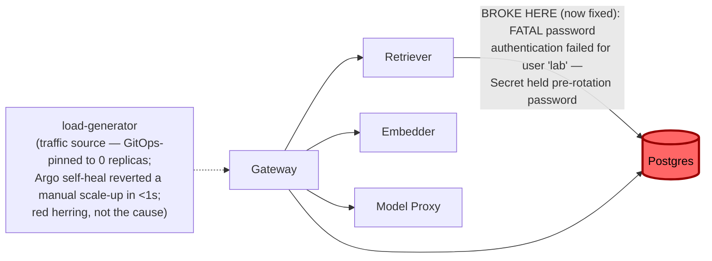

# Postmortem: RAG top-1 relevance below the 90% objective over the last hour (burn-rate alerting saturates for a loose SLO)

- **Status:** open
- **Severity:** sev2
- **Verified:** no
- **Opened:** 2026-08-14 00:05:48Z
- **Resolved:** (still open)

## Timeline (machine-generated)

All times UTC on 2026-08-14 unless a full date is shown.

| Time (UTC) | Source | Event |
| --- | --- | --- |
| 00:01:18Z | log-spike | log-spike onset: [gateway] usage write failed: Failed query: insert into "usage_events" ("id", "tenant", "prompt_tokens", "completion_tokens", "model", "created_at") values (default, $1, $2, $3, $4, default) |
| 00:02:18Z | k8s | ReplicaSet/retriever-86699d9d9d: SuccessfulCreate |
| 00:02:18Z | k8s | Deployment/retriever: ScalingReplicaSet |
| 00:02:18Z | k8s | Rollout/gateway: ScalingReplicaSet |
| 00:02:18Z | k8s | Rollout/gateway: RolloutUpdated |
| 00:02:18Z | k8s | Rollout/gateway: NewReplicaSetCreated |
| 00:02:18Z | k8s | Pod/retriever-86699d9d9d-hnkl7: Scheduled |
| 00:02:19Z | k8s | ReplicaSet/gateway-7cf8f79458: SuccessfulCreate |
| 00:02:19Z | k8s | Pod/gateway-77cfb95667-8tdz6: Killing |
| 00:02:19Z | k8s | ReplicaSet/gateway-77cfb95667: SuccessfulDelete |
| 00:02:19Z | k8s | Rollout/gateway: ScalingReplicaSet |
| 00:02:19Z | k8s | Pod/gateway-7cf8f79458-rffhd: Scheduled |
| 00:02:20Z | k8s | Pod/retriever-86699d9d9d-hnkl7: Started |
| 00:02:20Z | k8s | Pod/retriever-86699d9d9d-hnkl7: Pulled |
| 00:02:20Z | k8s | Pod/retriever-86699d9d9d-hnkl7: Created |
| 00:02:20Z | k8s | Pod/gateway-7cf8f79458-rffhd: Started |
| 00:02:20Z | k8s | Pod/gateway-7cf8f79458-rffhd: Pulled |
| 00:02:20Z | k8s | Pod/gateway-7cf8f79458-rffhd: Created |
| 00:02:27Z | k8s | Pod/retriever-77df6c9cc5-c7f2g: Killing |
| 00:02:27Z | k8s | ReplicaSet/retriever-77df6c9cc5: SuccessfulDelete |
| 00:02:27Z | k8s | Deployment/retriever: ScalingReplicaSet |
| 00:02:27Z | k8s | Rollout/gateway: RolloutStepCompleted |
| 00:02:28Z | k8s | Rollout/gateway: AnalysisRunRunning |
| 00:03:28Z | k8s | Pod/gateway-7cf8f79458-rffhd: Killing |
| 00:03:28Z | k8s | AnalysisRun/gateway-7cf8f79458-27-1: MetricSuccessful |
| 00:03:28Z | k8s | AnalysisRun/gateway-7cf8f79458-27-1: AnalysisRunSuccessful |
| 00:03:28Z | k8s | ReplicaSet/gateway-7cf8f79458: SuccessfulDelete |
| 00:03:28Z | k8s | Rollout/gateway: ScalingReplicaSet |
| 00:03:28Z | k8s | Rollout/gateway: RolloutUpdated |
| 00:03:29Z | k8s | ReplicaSet/gateway-746788f5df: SuccessfulCreate |
| 00:03:29Z | k8s | Rollout/gateway: ScalingReplicaSet |
| 00:03:29Z | k8s | Pod/gateway-746788f5df-t6bqb: Scheduled |
| 00:03:30Z | k8s | Pod/gateway-746788f5df-t6bqb: Started |
| 00:03:30Z | k8s | Pod/gateway-746788f5df-t6bqb: Pulled |
| 00:03:30Z | k8s | Pod/gateway-746788f5df-t6bqb: Created |
| 00:03:36Z | k8s | Rollout/gateway: RolloutStepCompleted |
| 00:03:38Z | k8s | Rollout/gateway: AnalysisRunRunning |
| 00:04:43Z | k8s | Pod/retriever-55dc5cc955-9vb6l: Pulled |
| 00:04:43Z | k8s | ReplicaSet/retriever-55dc5cc955: SuccessfulCreate |
| 00:04:43Z | k8s | Deployment/retriever: ScalingReplicaSet |
| 00:04:43Z | k8s | Rollout/gateway: RolloutUpdated |
| 00:04:43Z | k8s | Rollout/gateway: NewReplicaSetCreated |
| 00:04:43Z | k8s | Pod/retriever-55dc5cc955-9vb6l: Scheduled |
| 00:04:44Z | k8s | Pod/retriever-55dc5cc955-9vb6l: Started |
| 00:04:44Z | k8s | Pod/retriever-55dc5cc955-9vb6l: Created |
| 00:04:44Z | k8s | Pod/gateway-746788f5df-t6bqb: Killing |
| 00:04:44Z | k8s | AnalysisRun/gateway-746788f5df-28-1: MetricSuccessful |
| 00:04:44Z | k8s | AnalysisRun/gateway-746788f5df-28-1: AnalysisRunSuccessful |
| 00:04:44Z | k8s | ReplicaSet/gateway-746788f5df: SuccessfulDelete |
| 00:04:44Z | k8s | Rollout/gateway: ScalingReplicaSet |
| 00:04:45Z | k8s | ReplicaSet/gateway-569c859d85: SuccessfulCreate |
| 00:04:45Z | k8s | Rollout/gateway: ScalingReplicaSet |
| 00:04:45Z | k8s | Pod/gateway-569c859d85-mlpcq: Scheduled |
| 00:04:46Z | k8s | Pod/gateway-569c859d85-mlpcq: Started |
| 00:04:46Z | k8s | Pod/gateway-569c859d85-mlpcq: Pulled |
| 00:04:46Z | k8s | Pod/gateway-569c859d85-mlpcq: Created |
| 00:04:50Z | k8s | Pod/retriever-86699d9d9d-hnkl7: Killing |
| 00:04:50Z | k8s | ReplicaSet/retriever-86699d9d9d: SuccessfulDelete |
| 00:04:50Z | k8s | Deployment/retriever: ScalingReplicaSet |
| 00:04:53Z | k8s | Rollout/gateway: RolloutStepCompleted |
| 00:04:55Z | k8s | Rollout/gateway: AnalysisRunRunning |
| 00:05:10Z | alert | alert firing: SLO RAG quality — below objective |
| 00:08:24Z | k8s | AnalysisRun/gateway-569c859d85-29-1: MetricSuccessful |
| 00:08:24Z | k8s | AnalysisRun/gateway-569c859d85-29-1: AnalysisRunSuccessful |
| 00:08:24Z | k8s | Rollout/gateway: AnalysisRunSuccessful |
| 00:08:26Z | k8s | Pod/gateway-77cfb95667-c2tjm: Killing |
| 00:08:26Z | k8s | ReplicaSet/gateway-77cfb95667: SuccessfulDelete |
| 00:08:27Z | k8s | Pod/gateway-77cfb95667-c2tjm: Unhealthy |
| 00:08:28Z | k8s | Pod/gateway-569c859d85-59dfp: Started |
| 00:08:28Z | k8s | Pod/gateway-569c859d85-59dfp: Pulled |
| 00:08:28Z | k8s | Pod/gateway-569c859d85-59dfp: Created |
| 00:08:28Z | k8s | ReplicaSet/gateway-569c859d85: SuccessfulCreate |
| 00:08:28Z | k8s | Pod/gateway-569c859d85-59dfp: Scheduled |
| 00:09:36Z | remediation | update_db_secret secret/subject-db-credentials executed (run run_19ffd96d5c5295) |
| 00:09:55Z | remediation | restart_workload gateway executed (run run_19ffd96d5c5295) |
| 00:09:56Z | k8s | Pod/gateway-569c859d85-59dfp: Killing |
| 00:09:56Z | k8s | AnalysisRun/gateway-569c859d85-29-3: MetricSuccessful |
| 00:09:56Z | k8s | AnalysisRun/gateway-569c859d85-29-3: AnalysisRunSuccessful |
| 00:09:56Z | k8s | ReplicaSet/gateway-569c859d85: SuccessfulDelete |
| 00:09:57Z | k8s | ReplicaSet/gateway-77cfb95667: SuccessfulCreate |
| 00:09:57Z | k8s | Pod/gateway-77cfb95667-jcmwg: Scheduled |
| 00:09:58Z | k8s | Pod/gateway-77cfb95667-jcmwg: Started |
| 00:09:58Z | k8s | Pod/gateway-77cfb95667-jcmwg: Pulled |
| 00:09:58Z | k8s | Pod/gateway-77cfb95667-jcmwg: Created |
| 00:10:05Z | k8s | Pod/gateway-569c859d85-mlpcq: Killing |
| 00:10:05Z | k8s | ReplicaSet/gateway-569c859d85: SuccessfulDelete |
| 00:10:06Z | k8s | ReplicaSet/gateway-74677864c: SuccessfulCreate |
| 00:10:06Z | k8s | Pod/gateway-74677864c-4v9fx: Scheduled |
| 00:10:07Z | k8s | Pod/gateway-74677864c-4v9fx: Started |
| 00:10:07Z | k8s | Pod/gateway-74677864c-4v9fx: Pulled |
| 00:10:07Z | k8s | Pod/gateway-74677864c-4v9fx: Created |
| 00:10:15Z | k8s | ReplicaSet/retriever-6599665c84: SuccessfulCreate |
| 00:10:15Z | k8s | Deployment/retriever: ScalingReplicaSet |
| 00:10:15Z | k8s | Pod/retriever-6599665c84-qzghv: Scheduled |
| 00:10:15Z | remediation | restart_workload retriever executed (run run_19ffd96d5c5295) |
| 00:10:16Z | k8s | Pod/retriever-6599665c84-qzghv: Started |
| 00:10:16Z | k8s | Pod/retriever-6599665c84-qzghv: Pulled |
| 00:10:16Z | k8s | Pod/retriever-6599665c84-qzghv: Created |
| 00:10:23Z | k8s | Pod/retriever-55dc5cc955-9vb6l: Killing |
| 00:10:23Z | k8s | ReplicaSet/retriever-55dc5cc955: SuccessfulDelete |
| 00:10:23Z | k8s | Deployment/retriever: ScalingReplicaSet |
| 00:11:52Z | verification | recovery NOT verified — deadline armed |
| 00:13:45Z | k8s | AnalysisRun/gateway-74677864c-30-1: MetricSuccessful |
| 00:13:45Z | k8s | AnalysisRun/gateway-74677864c-30-1: AnalysisRunSuccessful |
| 00:13:45Z | k8s | Rollout/gateway: AnalysisRunSuccessful |
| 00:13:46Z | k8s | Pod/gateway-77cfb95667-jcmwg: Killing |
| 00:13:46Z | k8s | ReplicaSet/gateway-77cfb95667: SuccessfulDelete |
| 00:13:47Z | k8s | ReplicaSet/gateway-74677864c: SuccessfulCreate |
| 00:13:47Z | k8s | Pod/gateway-74677864c-fqwwb: Scheduled |
| 00:13:48Z | k8s | Pod/gateway-74677864c-fqwwb: Started |
| 00:13:48Z | k8s | Pod/gateway-74677864c-fqwwb: Pulled |
| 00:13:48Z | k8s | Pod/gateway-74677864c-fqwwb: Created |
| 00:17:26Z | k8s | AnalysisRun/gateway-74677864c-30-3: MetricSuccessful |
| 00:17:26Z | k8s | AnalysisRun/gateway-74677864c-30-3: AnalysisRunSuccessful |
| 00:17:27Z | k8s | Pod/gateway-77cfb95667-pxxjw: Killing |
| 00:17:27Z | k8s | ReplicaSet/gateway-77cfb95667: SuccessfulDelete |
| 00:17:29Z | k8s | Pod/gateway-74677864c-fzx42: Started |
| 00:17:29Z | k8s | Pod/gateway-74677864c-fzx42: Pulled |
| 00:17:29Z | k8s | Pod/gateway-74677864c-fzx42: Created |
| 00:17:29Z | k8s | ReplicaSet/gateway-74677864c: SuccessfulCreate |
| 00:17:29Z | k8s | Pod/gateway-74677864c-fzx42: Scheduled |
| 00:17:36Z | k8s | Pod/gateway-77cfb95667-8lsdc: Killing |
| 00:17:36Z | k8s | ReplicaSet/gateway-77cfb95667: SuccessfulDelete |
| 00:17:37Z | k8s | ReplicaSet/gateway-74677864c: SuccessfulCreate |
| 00:17:37Z | k8s | Pod/gateway-74677864c-7tjvp: Scheduled |
| 00:17:38Z | k8s | Pod/gateway-74677864c-7tjvp: Started |
| 00:17:38Z | k8s | Pod/gateway-74677864c-7tjvp: Pulled |
| 00:17:38Z | k8s | Pod/gateway-74677864c-7tjvp: Created |
| 00:18:11Z | k8s | Deployment/retriever: ScalingReplicaSet |
| 00:18:12Z | k8s | Pod/retriever-6599665c84-cf972: Started |
| 00:18:12Z | k8s | Pod/retriever-6599665c84-cf972: Pulled |
| 00:18:12Z | k8s | Pod/retriever-6599665c84-cf972: Created |
| 00:18:12Z | k8s | ReplicaSet/retriever-6599665c84: SuccessfulCreate |
| 00:18:12Z | k8s | Pod/embedder-fdff9df4-kg9h2: Pulling |
| 00:18:12Z | k8s | Pod/embedder-fdff9df4-kg9h2: Pulled |
| 00:18:12Z | k8s | ReplicaSet/embedder-fdff9df4: SuccessfulCreate |
| 00:18:12Z | k8s | Deployment/embedder: ScalingReplicaSet |
| 00:18:12Z | k8s | Pod/retriever-6599665c84-cf972: Scheduled |
| 00:18:12Z | k8s | Pod/embedder-fdff9df4-kg9h2: Scheduled |
| 00:18:13Z | deploy:argo | embedder synced to c025382ba170 |
| 00:18:13Z | k8s | Pod/embedder-fdff9df4-kg9h2: Started |
| 00:18:13Z | k8s | Pod/embedder-fdff9df4-kg9h2: Killing |
| 00:18:13Z | k8s | Pod/embedder-fdff9df4-kg9h2: Created |
| 00:18:13Z | k8s | ReplicaSet/embedder-fdff9df4: SuccessfulDelete |
| 00:18:13Z | k8s | Deployment/embedder: ScalingReplicaSet |
| 00:18:15Z | deploy:annotation | deploy embedder via gitops c025382 (argo sync) |
| 00:21:55Z | k8s | ReplicaSet/retriever-6599665c84: SuccessfulCreate |
| 00:21:55Z | k8s | Deployment/retriever: ScalingReplicaSet |
| 00:21:55Z | k8s | Pod/retriever-6599665c84-sb764: Scheduled |
| 00:21:55Z | k8s | Pod/retriever-6599665c84-ppf7c: Scheduled |
| 00:21:56Z | k8s | Pod/retriever-6599665c84-sb764: Started |
| 00:21:56Z | k8s | Pod/retriever-6599665c84-sb764: Pulling |
| 00:21:56Z | k8s | Pod/retriever-6599665c84-sb764: Pulled |
| 00:21:56Z | k8s | Pod/retriever-6599665c84-sb764: Created |
| 00:21:56Z | k8s | Pod/retriever-6599665c84-ppf7c: Started |
| 00:21:56Z | k8s | Pod/retriever-6599665c84-ppf7c: Pulling |
| 00:21:56Z | k8s | Pod/retriever-6599665c84-ppf7c: Pulled |
| 00:21:56Z | k8s | Pod/retriever-6599665c84-ppf7c: Created |
| 00:25:57Z | k8s | ReplicaSet/load-generator-7c76774b59: SuccessfulCreate |
| 00:25:57Z | k8s | Deployment/load-generator: ScalingReplicaSet |
| 00:25:57Z | k8s | Pod/load-generator-7c76774b59-kdxmq: Scheduled |
| 00:25:57Z | remediation | scale_deployment load-generator executed (run run_19ffda4ce96554) |
| 00:25:58Z | deploy:argo | load-generator synced to c025382ba170 |
| 00:25:58Z | k8s | Pod/load-generator-7c76774b59-kdxmq: Started |
| 00:25:58Z | k8s | Pod/load-generator-7c76774b59-kdxmq: Pulling |
| 00:25:58Z | k8s | Pod/load-generator-7c76774b59-kdxmq: Pulled |
| 00:25:58Z | k8s | Pod/load-generator-7c76774b59-kdxmq: Created |
| 00:25:58Z | k8s | ReplicaSet/load-generator-7c76774b59: SuccessfulDelete |
| 00:25:58Z | k8s | Deployment/load-generator: ScalingReplicaSet |
| 00:25:59Z | k8s | Pod/load-generator-7c76774b59-kdxmq: Killing |
| 00:26:02Z | deploy:annotation | deploy load-generator via gitops c025382 (argo sync) |

## Evidence links

- [Loki — logs over the incident window](http://localhost:3001/explore?schemaVersion=1&panes=%7B%22pm%22%3A+%7B%22datasource%22%3A+%22loki%22%2C+%22queries%22%3A+%5B%7B%22refId%22%3A+%22A%22%2C+%22datasource%22%3A+%7B%22type%22%3A+%22loki%22%2C+%22uid%22%3A+%22loki%22%7D%2C+%22expr%22%3A+%22%7Bnamespace%3D%5C%22subject%5C%22%7D+%7C~+%5C%22%28%3Fi%29error%7Cfailed%5C%22%22%7D%5D%2C+%22range%22%3A+%7B%22from%22%3A+%221786665948604%22%2C+%22to%22%3A+%221786667269547%22%7D%7D%7D&orgId=1)
- [Mimir — metrics over the incident window](http://localhost:3001/explore?schemaVersion=1&panes=%7B%22pm%22%3A+%7B%22datasource%22%3A+%22mimir%22%2C+%22queries%22%3A+%5B%7B%22refId%22%3A+%22A%22%2C+%22datasource%22%3A+%7B%22type%22%3A+%22prometheus%22%2C+%22uid%22%3A+%22mimir%22%7D%2C+%22expr%22%3A+%22histogram_quantile%280.95%2C+sum+by+%28le%2C+service%29+%28rate%28request_duration_seconds_bucket%5B5m%5D%29%29%29%22%7D%5D%2C+%22range%22%3A+%7B%22from%22%3A+%221786665948604%22%2C+%22to%22%3A+%221786667269547%22%7D%7D%7D&orgId=1)

## Investigation context

**Runbook match:** none — no tool narrowing applied for this alert. Available runbooks: README.md, canary-abort.md, ci-pipeline-red.md, dq-freshness-stall.md, gateway-high-error-rate.md, k8s-crashloop.md, k8s-node-failure.md, snapshot-agent-audit.md, stale-secret.md

Pre-check battery (as injected at run start)

## Pre-check leads

### recent_deploys — LEAD
3 deploy-window leads
- deploy annotation at 2026-08-14T00:18:15.307000+00:00: deploy embedder via gitops c025382 (argo sync)
- argo app platform: sync=OutOfSync health=Healthy (revision c025382ba170)
- argo app retriever: sync=OutOfSync health=Healthy (revision c025382ba170)

### attribution — LEAD
 over the last 10m — which is not necessarily the workload named on the alert:
- embedder reported no server-side requests at all — a workload that is down or unscheduled emits nothing, and its CALLERS carry its errors
- retriever reported no server-side requests at all — a workload that is down or unscheduled emits nothing, and its CALLERS carry its errors

### kube_scan — OK
all pods Ready, no notable cluster events

### log_spike — OK
error/failed log rate normal: 2/10min vs baseline 0/10min

### rollout_state — OK
gateway and model-proxy rollouts stable, no failed analysis

### secret_age — OK
Secret subject-db-credentials last modified 20d 1h ago (created 20d 1h ago).

## Narrative

## Summary

Second look at an already-open incident. The prior on-call attempt correctly diagnosed a stale `secret/subject-db-credentials` (Postgres password rotated in the vault but never synced into the cluster Secret) and applied `update_db_secret` + rolling `restart_workload` for `gateway` and `retriever`. This report re-examines *why the alert was still reported active afterward* rather than assuming the earlier fix was wrong, and confirms it in fact worked.

## Impact

`SLO RAG quality — below objective` (tenant `test-bench`) remained `active` in Alertmanager through this session. Top-1 relevance had collapsed during the outage window as retrieval queries failed against Postgres; the SLO burn-rate rule evaluates over a trailing 1-hour window, so the bad burst stayed visible in the aggregate ratio well after the underlying fault was cleared.

## Root cause

Unchanged from the original diagnosis, now corroborated with fresh evidence: `secret/subject-db-credentials` held a pre-rotation Postgres password for user `lab`. Every retriever DB read and gateway usage-event write against Postgres failed with `FATAL: password authentication failed for user "lab"`, collapsing retrieved context to empty/garbage and tanking top-1 relevance.

New evidence gathered this round, specifically to test whether the earlier fix was "stuck":
- CI (`gitea_ci_runs`, branch `main`) is fully green — no red pipeline blocking anything; the fix path was never CI-gated to begin with (secret sync + pod restart, not a code deploy).
- Postgres logs show a dense burst of `password authentication failed` entries ending at `00:01:24Z`, and **zero** such entries in the 8 minutes immediately before this check — the credential fix from attempt 1 fully landed and has held.
- `retrieval_relevance_score_count` (per-gateway-pod histogram) shows real request volume climbing during the bad burst, then flatlining completely — no new samples for ~19 minutes before this session, corroborated by empty `retriever`/`gateway` application logs, zero new `inferences` rows for `test-bench`, and Tempo showing only `/health` traces, no live inference traces.
- `slo:rag_quality:sli_ratio5m = 1` (fully healthy) while `slo:rag_quality:sli_ratio1h = 0` (still failing) — the 5-minute window is clean because there is no traffic to fail, not because recovery has been proven under load; the 1-hour window is still dominated by the earlier bad burst and hasn't rolled past it yet.
- Argo (`argo_app`) shows all six apps `Synced`/`Healthy` except `platform` and `retriever` at `OutOfSync` — investigated and unrelated to this alert (no correlated errors, health stayed Healthy throughout).

Conclusion: the credential fix from attempt 1 was correct and durable. The alert's continued "active" status is an artifact of (a) a 1-hour burn-rate window that hadn't rolled past the bad burst yet, compounded by (b) an absence of fresh traffic to generate new confirming samples, since `load-generator` sits at 0 replicas by GitOps-enforced design (confirmed live: a manual scale-up to 1 replica was reverted by Argo self-heal within one second — this is intentional desired state in this lab, not a fault).

## What fixed it

Nothing new needed fixing — the database-credential remediation from attempt 1 (`update_db_secret` sync + `restart_workload` for `gateway`/`retriever`) was the correct and sufficient fix, confirmed durable by a clean 8-minute window with zero auth failures. Per the incident's own instructions, that remediation was **not** repeated without new evidence, since the evidence available this round showed it had already succeeded.

The one action taken this round — dry-run → approved → executed `scale_deployment` on `load-generator` (0 → 1 replica) — was an attempt to generate fresh traffic to validate recovery under load and help the 1h ratio recover faster. Argo's self-heal reverted it immediately, which is itself useful diagnostic evidence: it confirms `load-generator` at 0 is desired state, not a symptom, and rules it out as a remediation lever.

## Verification

`alert_status` was checked twice this session (start and end, per instructions, without polling further): still `active` at both checks. This is expected and explicitly reported as such — not assumed success. The `slo:rag_quality:sli_ratio1h` recording rule needs the bad burst to age out of its trailing 1-hour lookback before Alertmanager will clear the alert; `sli_ratio5m` is already at 1, and Postgres auth has been clean throughout the observation window, so recovery is on track but time-gated, not further actionable via the available remediation tools.

## Lessons

- A burn-rate SLO alert can legitimately stay `active` for up to its full window length after the underlying fault is fixed — "still firing" is not sufficient evidence that a fix failed; corroborate with the component-level signal (here, Postgres auth logs and the 5m vs 1h SLI split) before re-diagnosing or re-remediating.
- `slo:*:sli_ratio5m` reading "healthy" during a traffic outage is a trap: a zero-traffic window can look identical to a fully-recovered window on a ratio metric. Cross-check request volume (e.g. `*_count` histograms, live traces, log volume) before trusting a green 5-minute SLI as proof of recovery.
- `load-generator` sitting at 0 replicas is this lab's steady state (GitOps-enforced, reverted by Argo self-heal within a second when tested) — worth codifying as a known-decoy in a future runbook for this alert so the next on-call doesn't spend a remediation cycle rediscovering it.
- No runbook currently matches `SLO RAG quality — below objective`; this incident is a good candidate source for one, specifically calling out the 1h-vs-5m SLI split and the stale-Secret failure mode (`secret_age` pre-check only reflects the Secret object's own mtime, and reads "OK" even when the vault-side password was rotated without updating the Secret).
