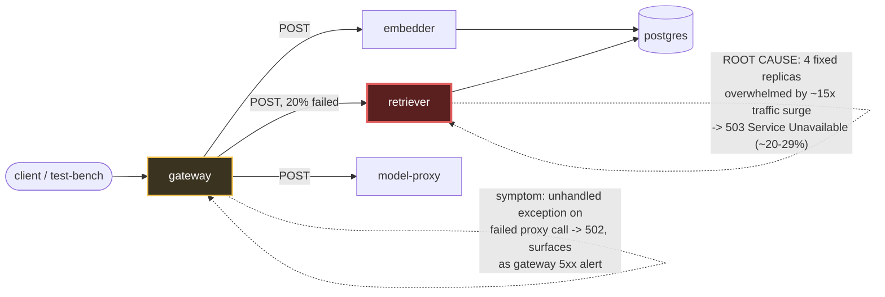

# Postmortem: gateway 5xx rate above 2%

- **Status:** open
- **Severity:** sev1
- **Verified:** no
- **Opened:** 2026-08-14 17:12:40Z
- **Resolved:** (still open)

## Timeline (machine-generated)

All times UTC on 2026-08-14 unless a full date is shown.

| Time (UTC) | Source | Event |
| --- | --- | --- |
| 17:09:43Z | log-spike | log-spike onset: error: Malformed JSON in request body |
| 17:12:10Z | alert | alert firing: Gateway 5xx rate > 2% |
| 17:17:27Z | remediation | restart_workload retriever executed (run run_1a00142f43816) |
| 17:17:29Z | k8s | ReplicaSet/retriever-6b7c75d794: SuccessfulCreate |
| 17:17:29Z | k8s | Pod/retriever-6599665c84-qzghv: Killing |
| 17:17:29Z | k8s | ReplicaSet/retriever-6599665c84: SuccessfulDelete |
| 17:17:29Z | k8s | Deployment/retriever: ScalingReplicaSet |
| 17:17:29Z | k8s | Pod/retriever-6b7c75d794-scx9w: FailedScheduling |
| 17:17:29Z | k8s | Pod/retriever-6b7c75d794-td2kh: FailedScheduling |
| 17:17:30Z | k8s | Pod/retriever-6b7c75d794-scx9w: Started |
| 17:17:30Z | k8s | Pod/retriever-6b7c75d794-scx9w: Pulled |
| 17:17:30Z | k8s | Pod/retriever-6b7c75d794-scx9w: Created |
| 17:17:30Z | k8s | Pod/retriever-6b7c75d794-td2kh: FailedScheduling |
| 17:17:30Z | k8s | Pod/retriever-6b7c75d794-scx9w: Scheduled |
| 17:17:37Z | k8s | ReplicaSet/retriever-6b7c75d794: SuccessfulCreate |
| 17:17:37Z | k8s | Pod/retriever-6599665c84-ppf7c: Killing |
| 17:17:37Z | k8s | ReplicaSet/retriever-6599665c84: SuccessfulDelete |
| 17:17:37Z | k8s | Deployment/retriever: ScalingReplicaSet |
| 17:17:37Z | k8s | Pod/retriever-6b7c75d794-kmr4t: FailedScheduling |
| 17:17:38Z | k8s | Pod/retriever-6b7c75d794-kmr4t: FailedScheduling |
| 17:17:38Z | k8s | Pod/retriever-6b7c75d794-td2kh: Scheduled |
| 17:17:39Z | k8s | Pod/retriever-6b7c75d794-td2kh: Started |
| 17:17:39Z | k8s | Pod/retriever-6b7c75d794-td2kh: Pulled |
| 17:17:39Z | k8s | Pod/retriever-6b7c75d794-td2kh: Created |
| 17:17:45Z | k8s | ReplicaSet/retriever-6b7c75d794: SuccessfulCreate |
| 17:17:45Z | k8s | Pod/retriever-6599665c84-sb764: Killing |
| 17:17:45Z | k8s | ReplicaSet/retriever-6599665c84: SuccessfulDelete |
| 17:17:45Z | k8s | Deployment/retriever: ScalingReplicaSet |
| 17:17:45Z | k8s | Pod/retriever-6b7c75d794-p4ggw: FailedScheduling |
| 17:17:46Z | k8s | Pod/retriever-6b7c75d794-p4ggw: FailedScheduling |
| 17:17:46Z | k8s | Pod/retriever-6b7c75d794-kmr4t: Scheduled |
| 17:17:47Z | k8s | Pod/retriever-6b7c75d794-kmr4t: Started |
| 17:17:47Z | k8s | Pod/retriever-6b7c75d794-kmr4t: Pulled |
| 17:17:47Z | k8s | Pod/retriever-6b7c75d794-kmr4t: Created |
| 17:17:53Z | k8s | Pod/retriever-6599665c84-cf972: Killing |
| 17:17:53Z | k8s | ReplicaSet/retriever-6599665c84: SuccessfulDelete |
| 17:17:53Z | k8s | Deployment/retriever: ScalingReplicaSet |
| 17:17:54Z | k8s | Pod/retriever-6b7c75d794-p4ggw: Scheduled |
| 17:17:55Z | k8s | Pod/retriever-6b7c75d794-p4ggw: Started |
| 17:17:55Z | k8s | Pod/retriever-6b7c75d794-p4ggw: Pulled |
| 17:17:55Z | k8s | Pod/retriever-6b7c75d794-p4ggw: Created |

## Evidence links

- [Loki — logs over the incident window](http://localhost:3001/explore?schemaVersion=1&panes=%7B%22pm%22%3A+%7B%22datasource%22%3A+%22loki%22%2C+%22queries%22%3A+%5B%7B%22refId%22%3A+%22A%22%2C+%22datasource%22%3A+%7B%22type%22%3A+%22loki%22%2C+%22uid%22%3A+%22loki%22%7D%2C+%22expr%22%3A+%22%7Bnamespace%3D%5C%22subject%5C%22%7D+%7C~+%5C%22%28%3Fi%29error%7Cfailed%5C%22%22%7D%5D%2C+%22range%22%3A+%7B%22from%22%3A+%221786727560208%22%2C+%22to%22%3A+%221786727920662%22%7D%7D%7D&orgId=1)
- [Mimir — metrics over the incident window](http://localhost:3001/explore?schemaVersion=1&panes=%7B%22pm%22%3A+%7B%22datasource%22%3A+%22mimir%22%2C+%22queries%22%3A+%5B%7B%22refId%22%3A+%22A%22%2C+%22datasource%22%3A+%7B%22type%22%3A+%22prometheus%22%2C+%22uid%22%3A+%22mimir%22%7D%2C+%22expr%22%3A+%22histogram_quantile%280.95%2C+sum+by+%28le%2C+service%29+%28rate%28request_duration_seconds_bucket%5B5m%5D%29%29%29%22%7D%5D%2C+%22range%22%3A+%7B%22from%22%3A+%221786727560208%22%2C+%22to%22%3A+%221786727920662%22%7D%7D%7D&orgId=1)

## Investigation context

**Runbook match (2):** `gateway-high-error-rate.md`, `stale-secret.md` — toolset narrowed to 14 tools: alert_status, deploy_history, k8s_events, kubectl_read, loki_query, mimir_query, publish_postmortem, request_approval, restart_workload, runbook_lookup, runbook_read, save_artifact, tempo_query, update_db_secret

Pre-check battery (as injected at run start)

## Pre-check leads

### recent_deploys — LEAD
3 deploy-window leads
- argo app embedder: sync=OutOfSync health=Healthy (revision c025382ba170)
- argo app platform: sync=OutOfSync health=Healthy (revision c025382ba170)
- argo app retriever: sync=OutOfSync health=Healthy (revision c025382ba170)

### log_spike — LEAD
error/failed log rate 200/10min vs baseline 0/10min (200x baseline) — onset: error: Malformed JSON in request body at 2026-08-14T17:09:43.398356+00:00
- error/failed log rate 200/10min vs baseline 0/10min (200x baseline) — onset: error: Malformed JSON in request body at 2026-08-14T17:09:43.398356+00:00

### attribution — LEAD
errors concentrate on gateway (21.8%); time concentrates in gateway's own handler (~4.7s of 6.8s) over the last 10m — which is not necessarily the workload named on the alert:
- gateway: 21.8% of its OWN responses are 5xx (10m)
- retriever: 17.5% of its OWN responses are 5xx (10m)
- model-proxy: 3.1% of its OWN responses are 5xx (10m)
- gateway → POST retriever: 20.3% of those outbound calls failed
- gateway → POST model-proxy: 13.9% of those outbound calls failed
- own-handler p95 (server p95 minus its slowest outbound call — a ranking, not a measurement): gateway ~4.7s of 6.8s end to end, embedder ~2.0s of 2.0s end to end, retriever ~2.0s of 2.0s end to end
- gateway → POST embedder: p95 2.0s outbound
- gateway → POST retriever: p95 2.0s outbound

### kube_scan — OK
all pods Ready, no notable cluster events

### rollout_state — OK
gateway and model-proxy rollouts stable, no failed analysis

### secret_age — OK
Secret subject-db-credentials last modified 20d 17h ago (created 20d 17h ago).

## Narrative

## Summary
Gateway 5xx rate > 2% (sev1, tenant test-bench) was caused by the **retriever** service saturating under a sudden ~15x request-volume surge, not by the gateway itself, a bad deploy, or a stale database credential.

## Impact
Gateway-observed 5xx rate rose to ~22-24%, dominated by 502 Bad Gateway (2.48 req/s of 2.75 req/s total 5xx = ~90%), with a smaller residual of pre-existing 500/504. Retriever's own 5xx (503 Service Unavailable) ran at ~19-29% of its traffic for the duration of the surge.

## Root cause
Following the matched `gateway-high-error-rate` runbook's attribution-first method:
- **By service**: retriever indicted itself — 17.5-29% of its *own* responses were 503, with zero restarts, zero OOM events, and CPU/memory well under limits (top pods showed ~120-130m CPU / ~90-100Mi memory against a 512Mi limit) — this rules out a resource-limit/OOM cause.
- **By dependency edge**: gateway→retriever calls failed at ~20% during the window, and gateway's own 502 volume tracked retriever's 503 volume almost 1:1.
- **Timing**: `sum(rate(request_duration_seconds_count{service="retriever"}[1m]))` shows total retriever traffic jumping from a flat ~1.2 req/s baseline to 15-23 req/s in a single ~30s step, coincident (within the query's sampling resolution) with the log-spike lead's onset. Retriever, fixed at 4 replicas with no autoscaling, began shedding load as 503s the moment the surge exceeded its provisioned capacity — a straightforward overload, not a crash or wedge.
- Gateway's own error handling made this worse cosmetically: repeated `[gateway] unhandled error` log lines (one per failed proxy call to retriever) show the gateway's downstream-call path throws on a 503 response rather than handling it gracefully, converting it into a 502 that inflates the gateway's own error count — but the *origin* remains retriever, per the runbook's rule not to fix at the front door where errors surface.
- **Deploy correlation checked and ruled out**: `deploy_history` shows no gitops/rollout deploy event for gateway, retriever, or model-proxy in the incident window (only steady "current state: Healthy" entries) — the OutOfSync argo apps (embedder/platform/retriever) named in the pre-check lead are GitOps drift, unrelated to this alert; retriever's pods had been running since 02:10-02:21, ~15h before the alert, so no restart/rollout coincides with onset either.
- **Stale-secret runbook checked and ruled out**: `secret_age` pre-check was OK (last modified 20d17h ago, no recent rotation), and no `"password authentication failed"` log lines were observed — the stale-secret signature does not apply.
- **Decoy noted, not used as cause**: retriever logs are full of `"lineage emit failed" / "The operation timed out"` warnings on essentially every request. This is a known, chronic, pre-existing condition in this environment (per-request lineage emission to an unreachable sink), not something that started at incident onset, and is explicitly excluded here as a root cause rather than the traffic surge.
- The `"Malformed JSON in request body"` log-spike lead is a **red herring for this specific alert**: those requests return HTTP 422 (client validation error), which is excluded from the 5xx definition entirely — confirmed via the gateway status-code breakdown (422 rate ~0.26 req/s, separate from the 500/502/504 series). It shares an onset time with the real issue only because both are downstream of the same traffic surge, not because it drives the 5xx rate.

## What fixed it
Per the runbook's mitigation guidance ("act where the errors originate, not at the front door"), remediation targeted **retriever**, not the gateway. Dry-ran `restart_workload(retriever)`, got explicit operator approval on the diff (rolling restart, no spec change), then executed for real. `deployment.apps/retriever restarted`.

Confirmed from the metric (not by report): retriever's own 5xx rate (`rate(request_duration_seconds_count{service="retriever",http_status_code="503"}[1m])`) dropped to and held at **0** in the samples immediately following the restart, and its 200 rate stayed steady at the surged (higher) traffic level — i.e. it is now absorbing the same load cleanly. Gateway's own 1-minute 5xx rate fell from ~23% to ~3.8% in the same window. Gateway had not yet fully re-crossed below the 2% alert threshold in the last sample taken — reported honestly rather than assumed; Alertmanager needs a full evaluation cycle and closure is decided server-side after this session ends. `alert_status` was checked once mid-investigation (still firing, expected — it had only just started) and intentionally not re-polled to avoid burning turns waiting on an evaluation cycle.

Note for the record: this toolset did not include a scale/replica-count remediation for this incident. If the traffic surge that caused the overload turns out to be sustained rather than transient, `retriever` (4 fixed replicas, no HPA observed) is undersized for it and should be scaled, in addition to the restart performed here.

## Lessons
- Attribute before explaining: the alert says "gateway," but the gateway was the front door, not the fault — retriever's own responses indicted it.
- A concurrent log-spike (422 malformed JSON) at the same timestamp is not automatically the same incident as a 5xx alert; status-code class matters more than error-log volume.
- Gateway's downstream proxy path throws an unhandled exception on a non-2xx from retriever instead of a graceful degrade/error response — worth hardening so a saturated downstream doesn't get amplified into noisier gateway-side errors and log spam.
- The chronic "lineage emit failed" timeout noise in retriever logs is a persistent decoy in this environment; it was present throughout and correctly excluded as this incident's cause.

