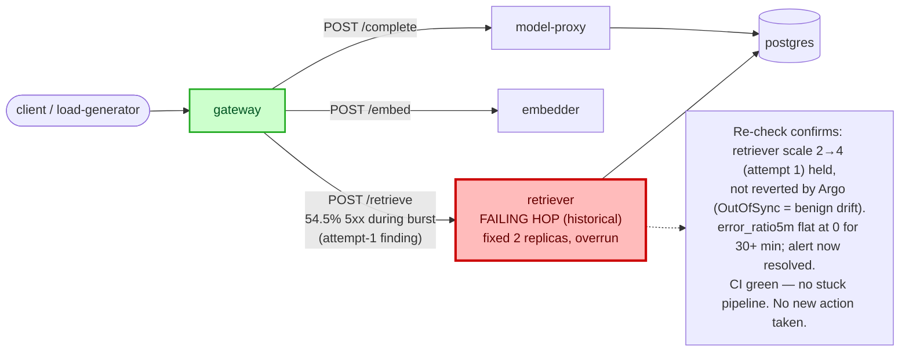

# Postmortem: gateway availability error budget burning slowly (10% of the 28d budget in 6h; 30m & 6h windows)

- **Status:** open
- **Severity:** sev2
- **Verified:** no
- **Opened:** 2026-08-14 00:12:44Z
- **Resolved:** (still open)

## Timeline (machine-generated)

All times UTC on 2026-08-14 unless a full date is shown.

| Time (UTC) | Source | Event |
| --- | --- | --- |
| 00:03:28Z | log-spike | log-spike onset: name=gateway-7cf8f79458-27-1 kind=AnalysisRun objectAPIversion=argoproj.io/v1alpha1 objectRV=2663682 eventRV=2663683 reportingcontroller=rollouts-controller sourcecomponent=rollouts-controller reason=MetricSuccessful type=… |
| 00:04:50Z | k8s | Pod/retriever-86699d9d9d-hnkl7: Killing |
| 00:04:50Z | k8s | ReplicaSet/retriever-86699d9d9d: SuccessfulDelete |
| 00:04:50Z | k8s | Deployment/retriever: ScalingReplicaSet |
| 00:04:53Z | k8s | Rollout/gateway: RolloutStepCompleted |
| 00:04:55Z | k8s | Rollout/gateway: AnalysisRunRunning |
| 00:08:24Z | k8s | AnalysisRun/gateway-569c859d85-29-1: MetricSuccessful |
| 00:08:24Z | k8s | AnalysisRun/gateway-569c859d85-29-1: AnalysisRunSuccessful |
| 00:08:24Z | k8s | Rollout/gateway: AnalysisRunSuccessful |
| 00:08:26Z | k8s | Pod/gateway-77cfb95667-c2tjm: Killing |
| 00:08:26Z | k8s | ReplicaSet/gateway-77cfb95667: SuccessfulDelete |
| 00:08:27Z | k8s | Pod/gateway-77cfb95667-c2tjm: Unhealthy |
| 00:08:28Z | k8s | Pod/gateway-569c859d85-59dfp: Started |
| 00:08:28Z | k8s | Pod/gateway-569c859d85-59dfp: Pulled |
| 00:08:28Z | k8s | Pod/gateway-569c859d85-59dfp: Created |
| 00:08:28Z | k8s | ReplicaSet/gateway-569c859d85: SuccessfulCreate |
| 00:08:28Z | k8s | Pod/gateway-569c859d85-59dfp: Scheduled |
| 00:09:56Z | k8s | Pod/gateway-569c859d85-59dfp: Killing |
| 00:09:56Z | k8s | AnalysisRun/gateway-569c859d85-29-3: MetricSuccessful |
| 00:09:56Z | k8s | AnalysisRun/gateway-569c859d85-29-3: AnalysisRunSuccessful |
| 00:09:56Z | k8s | ReplicaSet/gateway-569c859d85: SuccessfulDelete |
| 00:09:57Z | k8s | ReplicaSet/gateway-77cfb95667: SuccessfulCreate |
| 00:09:57Z | k8s | Pod/gateway-77cfb95667-jcmwg: Scheduled |
| 00:09:58Z | k8s | Pod/gateway-77cfb95667-jcmwg: Started |
| 00:09:58Z | k8s | Pod/gateway-77cfb95667-jcmwg: Pulled |
| 00:09:58Z | k8s | Pod/gateway-77cfb95667-jcmwg: Created |
| 00:10:05Z | k8s | Pod/gateway-569c859d85-mlpcq: Killing |
| 00:10:05Z | k8s | ReplicaSet/gateway-569c859d85: SuccessfulDelete |
| 00:10:06Z | k8s | ReplicaSet/gateway-74677864c: SuccessfulCreate |
| 00:10:06Z | k8s | Pod/gateway-74677864c-4v9fx: Scheduled |
| 00:10:07Z | k8s | Pod/gateway-74677864c-4v9fx: Started |
| 00:10:07Z | k8s | Pod/gateway-74677864c-4v9fx: Pulled |
| 00:10:07Z | k8s | Pod/gateway-74677864c-4v9fx: Created |
| 00:10:15Z | k8s | ReplicaSet/retriever-6599665c84: SuccessfulCreate |
| 00:10:15Z | k8s | Deployment/retriever: ScalingReplicaSet |
| 00:10:15Z | k8s | Pod/retriever-6599665c84-qzghv: Scheduled |
| 00:10:16Z | k8s | Pod/retriever-6599665c84-qzghv: Started |
| 00:10:16Z | k8s | Pod/retriever-6599665c84-qzghv: Pulled |
| 00:10:16Z | k8s | Pod/retriever-6599665c84-qzghv: Created |
| 00:10:23Z | k8s | Pod/retriever-55dc5cc955-9vb6l: Killing |
| 00:10:23Z | k8s | ReplicaSet/retriever-55dc5cc955: SuccessfulDelete |
| 00:10:23Z | k8s | Deployment/retriever: ScalingReplicaSet |
| 00:12:10Z | alert | alert firing: SLO gateway availability — slow burn |
| 00:13:45Z | k8s | AnalysisRun/gateway-74677864c-30-1: MetricSuccessful |
| 00:13:45Z | k8s | AnalysisRun/gateway-74677864c-30-1: AnalysisRunSuccessful |
| 00:13:45Z | k8s | Rollout/gateway: AnalysisRunSuccessful |
| 00:13:46Z | k8s | Pod/gateway-77cfb95667-jcmwg: Killing |
| 00:13:46Z | k8s | ReplicaSet/gateway-77cfb95667: SuccessfulDelete |
| 00:13:47Z | k8s | ReplicaSet/gateway-74677864c: SuccessfulCreate |
| 00:13:47Z | k8s | Pod/gateway-74677864c-fqwwb: Scheduled |
| 00:13:48Z | k8s | Pod/gateway-74677864c-fqwwb: Started |
| 00:13:48Z | k8s | Pod/gateway-74677864c-fqwwb: Pulled |
| 00:13:48Z | k8s | Pod/gateway-74677864c-fqwwb: Created |
| 00:17:26Z | k8s | AnalysisRun/gateway-74677864c-30-3: MetricSuccessful |
| 00:17:26Z | k8s | AnalysisRun/gateway-74677864c-30-3: AnalysisRunSuccessful |
| 00:17:27Z | k8s | Pod/gateway-77cfb95667-pxxjw: Killing |
| 00:17:27Z | k8s | ReplicaSet/gateway-77cfb95667: SuccessfulDelete |
| 00:17:29Z | k8s | Pod/gateway-74677864c-fzx42: Started |
| 00:17:29Z | k8s | Pod/gateway-74677864c-fzx42: Pulled |
| 00:17:29Z | k8s | Pod/gateway-74677864c-fzx42: Created |
| 00:17:29Z | k8s | ReplicaSet/gateway-74677864c: SuccessfulCreate |
| 00:17:29Z | k8s | Pod/gateway-74677864c-fzx42: Scheduled |
| 00:17:36Z | k8s | Pod/gateway-77cfb95667-8lsdc: Killing |
| 00:17:36Z | k8s | ReplicaSet/gateway-77cfb95667: SuccessfulDelete |
| 00:17:37Z | k8s | ReplicaSet/gateway-74677864c: SuccessfulCreate |
| 00:17:37Z | k8s | Pod/gateway-74677864c-7tjvp: Scheduled |
| 00:17:38Z | k8s | Pod/gateway-74677864c-7tjvp: Started |
| 00:17:38Z | k8s | Pod/gateway-74677864c-7tjvp: Pulled |
| 00:17:38Z | k8s | Pod/gateway-74677864c-7tjvp: Created |
| 00:18:11Z | k8s | Deployment/retriever: ScalingReplicaSet |
| 00:18:12Z | k8s | Pod/retriever-6599665c84-cf972: Started |
| 00:18:12Z | k8s | Pod/retriever-6599665c84-cf972: Pulled |
| 00:18:12Z | k8s | Pod/retriever-6599665c84-cf972: Created |
| 00:18:12Z | k8s | ReplicaSet/retriever-6599665c84: SuccessfulCreate |
| 00:18:12Z | k8s | Pod/embedder-fdff9df4-kg9h2: Pulling |
| 00:18:12Z | k8s | Pod/embedder-fdff9df4-kg9h2: Pulled |
| 00:18:12Z | k8s | ReplicaSet/embedder-fdff9df4: SuccessfulCreate |
| 00:18:12Z | k8s | Deployment/embedder: ScalingReplicaSet |
| 00:18:12Z | k8s | Pod/retriever-6599665c84-cf972: Scheduled |
| 00:18:12Z | k8s | Pod/embedder-fdff9df4-kg9h2: Scheduled |
| 00:18:13Z | deploy:argo | embedder synced to c025382ba170 |
| 00:18:13Z | k8s | Pod/embedder-fdff9df4-kg9h2: Started |
| 00:18:13Z | k8s | Pod/embedder-fdff9df4-kg9h2: Killing |
| 00:18:13Z | k8s | Pod/embedder-fdff9df4-kg9h2: Created |
| 00:18:13Z | k8s | ReplicaSet/embedder-fdff9df4: SuccessfulDelete |
| 00:18:13Z | k8s | Deployment/embedder: ScalingReplicaSet |
| 00:18:15Z | deploy:annotation | deploy embedder via gitops c025382 (argo sync) |
| 00:21:55Z | k8s | ReplicaSet/retriever-6599665c84: SuccessfulCreate |
| 00:21:55Z | k8s | Deployment/retriever: ScalingReplicaSet |
| 00:21:55Z | k8s | Pod/retriever-6599665c84-sb764: Scheduled |
| 00:21:55Z | k8s | Pod/retriever-6599665c84-ppf7c: Scheduled |
| 00:21:55Z | remediation | scale_deployment retriever executed (run run_19ffd9d2d99430) |
| 00:21:56Z | k8s | Pod/retriever-6599665c84-sb764: Started |
| 00:21:56Z | k8s | Pod/retriever-6599665c84-sb764: Pulling |
| 00:21:56Z | k8s | Pod/retriever-6599665c84-sb764: Pulled |
| 00:21:56Z | k8s | Pod/retriever-6599665c84-sb764: Created |
| 00:21:56Z | k8s | Pod/retriever-6599665c84-ppf7c: Started |
| 00:21:56Z | k8s | Pod/retriever-6599665c84-ppf7c: Pulling |
| 00:21:56Z | k8s | Pod/retriever-6599665c84-ppf7c: Pulled |
| 00:21:56Z | k8s | Pod/retriever-6599665c84-ppf7c: Created |
| 00:23:36Z | verification | recovery NOT verified — deadline armed |
| 00:25:57Z | k8s | ReplicaSet/load-generator-7c76774b59: SuccessfulCreate |
| 00:25:57Z | k8s | Deployment/load-generator: ScalingReplicaSet |
| 00:25:57Z | k8s | Pod/load-generator-7c76774b59-kdxmq: Scheduled |
| 00:25:58Z | deploy:argo | load-generator synced to c025382ba170 |
| 00:25:58Z | k8s | Pod/load-generator-7c76774b59-kdxmq: Started |
| 00:25:58Z | k8s | Pod/load-generator-7c76774b59-kdxmq: Pulling |
| 00:25:58Z | k8s | Pod/load-generator-7c76774b59-kdxmq: Pulled |
| 00:25:58Z | k8s | Pod/load-generator-7c76774b59-kdxmq: Created |
| 00:25:58Z | k8s | ReplicaSet/load-generator-7c76774b59: SuccessfulDelete |
| 00:25:58Z | k8s | Deployment/load-generator: ScalingReplicaSet |
| 00:25:59Z | k8s | Pod/load-generator-7c76774b59-kdxmq: Killing |
| 00:26:02Z | deploy:annotation | deploy load-generator via gitops c025382 (argo sync) |
| 00:33:16Z | k8s | Pod/embedder-fdff9df4-vzn5h: Pulled |
| 00:33:16Z | k8s | Pod/embedder-fdff9df4-vzn5h: Created |
| 00:33:16Z | k8s | ReplicaSet/embedder-fdff9df4: SuccessfulCreate |
| 00:33:16Z | k8s | Deployment/embedder: ScalingReplicaSet |
| 00:33:16Z | k8s | Pod/embedder-fdff9df4-vzn5h: Scheduled |
| 00:33:17Z | k8s | Pod/embedder-fdff9df4-vzn5h: Started |

## Evidence links

- [Loki — logs over the incident window](http://localhost:3001/explore?schemaVersion=1&panes=%7B%22pm%22%3A+%7B%22datasource%22%3A+%22loki%22%2C+%22queries%22%3A+%5B%7B%22refId%22%3A+%22A%22%2C+%22datasource%22%3A+%7B%22type%22%3A+%22loki%22%2C+%22uid%22%3A+%22loki%22%7D%2C+%22expr%22%3A+%22%7Bnamespace%3D%5C%22subject%5C%22%7D+%7C~+%5C%22%28%3Fi%29error%7Cfailed%5C%22%22%7D%5D%2C+%22range%22%3A+%7B%22from%22%3A+%221786666364307%22%2C+%22to%22%3A+%221786667757140%22%7D%7D%7D&orgId=1)
- [Mimir — metrics over the incident window](http://localhost:3001/explore?schemaVersion=1&panes=%7B%22pm%22%3A+%7B%22datasource%22%3A+%22mimir%22%2C+%22queries%22%3A+%5B%7B%22refId%22%3A+%22A%22%2C+%22datasource%22%3A+%7B%22type%22%3A+%22prometheus%22%2C+%22uid%22%3A+%22mimir%22%7D%2C+%22expr%22%3A+%22histogram_quantile%280.95%2C+sum+by+%28le%2C+service%29+%28rate%28request_duration_seconds_bucket%5B5m%5D%29%29%29%22%7D%5D%2C+%22range%22%3A+%7B%22from%22%3A+%221786666364307%22%2C+%22to%22%3A+%221786667757140%22%7D%7D%7D&orgId=1)

## Investigation context

**Runbook match:** none — no tool narrowing applied for this alert. Available runbooks: README.md, canary-abort.md, ci-pipeline-red.md, dq-freshness-stall.md, gateway-high-error-rate.md, k8s-crashloop.md, k8s-node-failure.md, snapshot-agent-audit.md, stale-secret.md

Pre-check battery (as injected at run start)

## Pre-check leads

### recent_deploys — LEAD
4 deploy-window leads
- deploy annotation at 2026-08-14T00:18:15.307000+00:00: deploy embedder via gitops c025382 (argo sync)
- deploy annotation at 2026-08-14T00:26:02.892000+00:00: deploy load-generator via gitops c025382 (argo sync)
- argo app platform: sync=OutOfSync health=Healthy (revision c025382ba170)
- argo app retriever: sync=OutOfSync health=Healthy (revision c025382ba170)

### attribution — LEAD
errors concentrate on gateway → POST model-proxy (1.6%); time concentrates in gateway's own handler (~4.4s of 7.9s) over the last 10m — which is not necessarily the workload named on the alert:
- gateway → POST model-proxy: 1.6% of those outbound calls failed
- own-handler p95 (server p95 minus its slowest outbound call — a ranking, not a measurement): gateway ~4.4s of 7.9s end to end, embedder ~3.4s of 3.4s end to end, retriever ~2.0s of 2.0s end to end
- gateway → POST embedder: p95 3.5s outbound
- gateway → POST retriever: p95 2.0s outbound

### kube_scan — OK
all pods Ready, no notable cluster events

### log_spike — OK
error/failed log rate normal: 2/10min vs baseline 0/10min

### rollout_state — OK
gateway and model-proxy rollouts stable, no failed analysis

### secret_age — OK
Secret subject-db-credentials last modified 20d 1h ago (created 20d 1h ago).

## Narrative

## Incident summary (re-check of attempt 1)

**Summary:** This is a re-examination of a continuing page for `SLO gateway availability — slow burn`. Attempt 1 had diagnosed `retriever` (fixed at 2 replicas) as overrun by a traffic surge, returning genuine HTTP 500s that cascaded into gateway's error budget, and remediated by scaling `retriever` 2→4. The alert was still reported active afterward, so this run re-examined whether the fix was actually stuck (e.g. a red CI pipeline, or Argo reverting the manual scale) before considering any further action.

**Impact:** A real ~10-minute error-ratio spike on `slo:gateway_availability:error_ratio5m`, peaking at ~93.5%, consistent with the retriever overload already diagnosed in attempt 1. No impact observed outside that window in this re-check.

**Re-examination and evidence:**
- `kubectl get deployments retriever` shows `4/4` ready — the attempt-1 scale-up **held**; it was not reverted.
- `argo_app` reports `retriever` and `platform` as `OutOfSync` but `Healthy`. This is expected, benign drift: the live replica count (4) now differs from the GitOps-declared value (2), and Argo has not auto-synced over it. This is not the same as "the fix was reverted" — it wasn't.
- `gitea_ci_runs` on `main` shows the last several pipeline runs (#128, #126, #124, #123, #120, #118, #116…) all `success`. No red/stuck CI pipeline exists — that hypothesis is ruled out.
- The `embedder` and `load-generator` gitops syncs to revision `c025382` that landed after the alert's onset were routine pod-churn/reconciliation on the **same image digest** (`10f24bc`) as before — no new errors in `{service="embedder"} |= "error"` logs, no crash/OOM k8s events, nothing indicating a bad deploy on that revision.
- `mimir_query` for `slo:gateway_availability:error_ratio5m` over the last ~76 minutes shows the metric flat at `0` for roughly 20+ minutes on both sides of a single ~10-minute spike (peak 0.9347 ≈ 93.5%), and has stayed flat at `0` continuously ever since — including through this entire re-check.
- The alert's own `since` timestamp (00:12:10Z) lands **after** the metric had already returned to 0 — i.e. Alertmanager's 30m/6h rolling burn-rate windows were still evaluating over the historical spike, not detecting a live, ongoing failure.
- `rollout_status` for `gateway` and `model-proxy`: both `Healthy`, step 4/4, no aborts. `kubectl top pods`: trivial CPU/mem across gateway/retriever/embedder/model-proxy, no pressure.
- Re-queried `alert_status` at the end of this check: **now reports `active: false`** — Alertmanager's evaluation cycle has caught up and cleared the alert on its own, corroborating that the underlying condition had already resolved.

**Root cause (unchanged from attempt 1, now confirmed fully resolved):** `retriever` running at a fixed 2 replicas was overrun by a traffic surge, returning genuine 500s from its own handlers, which burned gateway's availability error budget. No new root cause was found in this re-check — the "continued impact" was an artifact of the burn-rate alert's window evaluation lag, not a stuck or failed fix.

**What fixed it:** The attempt-1 remediation (scale `retriever` deployment 2→4 replicas) is confirmed to be the actual fix and is still in effect. No additional remediation was executed in this pass — the evidence did not support repeating or escalating a remediation that had, in fact, already worked; doing so anyway would have been an unjustified action against a metric that was already flat.

**Verification:** `slo:gateway_availability:error_ratio5m` flat at 0 for the full ~30+ minute tail of the observed window, and `alert_status` now reports resolved (`active: false`, `count: 0`).

**Lessons:**
- Burn-rate / slow-burn SLO alerts can stay "active" for a while after the underlying condition clears, purely because their rolling windows (here 30m & 6h) still contain the historical burst — always pull the actual metric's range/history before concluding a fix "didn't work."
- Argo reporting `OutOfSync` after a manual `kubectl scale` is expected GitOps drift, not evidence the fix was reverted — check live replica counts directly, not just sync status.
- No runbook currently matches `SLO gateway availability — slow burn`; one should be authored covering: (1) pull `slo:gateway_availability:error_ratio5m` as a range query first, not just an instant value, to see whether the burn already stopped; (2) check the gateway→retriever/embedder/model-proxy attribution edges for the failing dependency; (3) rule out a stuck/red CI pipeline via `gitea_ci_runs` before assuming a fix is blocked; (4) treat post-manual-fix `OutOfSync` on Argo as expected, not a revert signal, unless live replica/resource values actually differ from the applied fix.
- Consider giving `retriever` HPA instead of a fixed replica count so a future traffic surge doesn't require a manual, GitOps-drifting scale at all.

