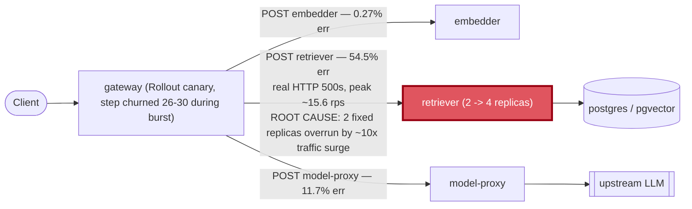

# Postmortem: gateway availability error budget burning slowly (10% of the 28d budget in 6h; 30m & 6h windows)

- **Status:** open
- **Severity:** sev2
- **Verified:** no
- **Opened:** 2026-08-14 00:12:44Z
- **Resolved:** (still open)

## Timeline (machine-generated)

All times UTC on 2026-08-14 unless a full date is shown.

| Time (UTC) | Source | Event |
| --- | --- | --- |
| 00:03:28Z | log-spike | log-spike onset: name=gateway-7cf8f79458-27-1 kind=AnalysisRun objectAPIversion=argoproj.io/v1alpha1 objectRV=2663682 eventRV=2663683 reportingcontroller=rollouts-controller sourcecomponent=rollouts-controller reason=MetricSuccessful type=… |
| 00:04:50Z | k8s | Pod/retriever-86699d9d9d-hnkl7: Killing |
| 00:04:50Z | k8s | ReplicaSet/retriever-86699d9d9d: SuccessfulDelete |
| 00:04:50Z | k8s | Deployment/retriever: ScalingReplicaSet |
| 00:04:53Z | k8s | Rollout/gateway: RolloutStepCompleted |
| 00:04:55Z | k8s | Rollout/gateway: AnalysisRunRunning |
| 00:08:24Z | k8s | AnalysisRun/gateway-569c859d85-29-1: MetricSuccessful |
| 00:08:24Z | k8s | AnalysisRun/gateway-569c859d85-29-1: AnalysisRunSuccessful |
| 00:08:24Z | k8s | Rollout/gateway: AnalysisRunSuccessful |
| 00:08:26Z | k8s | Pod/gateway-77cfb95667-c2tjm: Killing |
| 00:08:26Z | k8s | ReplicaSet/gateway-77cfb95667: SuccessfulDelete |
| 00:08:27Z | k8s | Pod/gateway-77cfb95667-c2tjm: Unhealthy |
| 00:08:28Z | k8s | Pod/gateway-569c859d85-59dfp: Started |
| 00:08:28Z | k8s | Pod/gateway-569c859d85-59dfp: Pulled |
| 00:08:28Z | k8s | Pod/gateway-569c859d85-59dfp: Created |
| 00:08:28Z | k8s | ReplicaSet/gateway-569c859d85: SuccessfulCreate |
| 00:08:28Z | k8s | Pod/gateway-569c859d85-59dfp: Scheduled |
| 00:09:56Z | k8s | Pod/gateway-569c859d85-59dfp: Killing |
| 00:09:56Z | k8s | AnalysisRun/gateway-569c859d85-29-3: MetricSuccessful |
| 00:09:56Z | k8s | AnalysisRun/gateway-569c859d85-29-3: AnalysisRunSuccessful |
| 00:09:56Z | k8s | ReplicaSet/gateway-569c859d85: SuccessfulDelete |
| 00:09:57Z | k8s | ReplicaSet/gateway-77cfb95667: SuccessfulCreate |
| 00:09:57Z | k8s | Pod/gateway-77cfb95667-jcmwg: Scheduled |
| 00:09:58Z | k8s | Pod/gateway-77cfb95667-jcmwg: Started |
| 00:09:58Z | k8s | Pod/gateway-77cfb95667-jcmwg: Pulled |
| 00:09:58Z | k8s | Pod/gateway-77cfb95667-jcmwg: Created |
| 00:10:05Z | k8s | Pod/gateway-569c859d85-mlpcq: Killing |
| 00:10:05Z | k8s | ReplicaSet/gateway-569c859d85: SuccessfulDelete |
| 00:10:06Z | k8s | ReplicaSet/gateway-74677864c: SuccessfulCreate |
| 00:10:06Z | k8s | Pod/gateway-74677864c-4v9fx: Scheduled |
| 00:10:07Z | k8s | Pod/gateway-74677864c-4v9fx: Started |
| 00:10:07Z | k8s | Pod/gateway-74677864c-4v9fx: Pulled |
| 00:10:07Z | k8s | Pod/gateway-74677864c-4v9fx: Created |
| 00:10:15Z | k8s | ReplicaSet/retriever-6599665c84: SuccessfulCreate |
| 00:10:15Z | k8s | Deployment/retriever: ScalingReplicaSet |
| 00:10:15Z | k8s | Pod/retriever-6599665c84-qzghv: Scheduled |
| 00:10:16Z | k8s | Pod/retriever-6599665c84-qzghv: Started |
| 00:10:16Z | k8s | Pod/retriever-6599665c84-qzghv: Pulled |
| 00:10:16Z | k8s | Pod/retriever-6599665c84-qzghv: Created |
| 00:10:23Z | k8s | Pod/retriever-55dc5cc955-9vb6l: Killing |
| 00:10:23Z | k8s | ReplicaSet/retriever-55dc5cc955: SuccessfulDelete |
| 00:10:23Z | k8s | Deployment/retriever: ScalingReplicaSet |
| 00:12:10Z | alert | alert firing: SLO gateway availability — slow burn |
| 00:13:45Z | k8s | AnalysisRun/gateway-74677864c-30-1: MetricSuccessful |
| 00:13:45Z | k8s | AnalysisRun/gateway-74677864c-30-1: AnalysisRunSuccessful |
| 00:13:45Z | k8s | Rollout/gateway: AnalysisRunSuccessful |
| 00:13:46Z | k8s | Pod/gateway-77cfb95667-jcmwg: Killing |
| 00:13:46Z | k8s | ReplicaSet/gateway-77cfb95667: SuccessfulDelete |
| 00:13:47Z | k8s | ReplicaSet/gateway-74677864c: SuccessfulCreate |
| 00:13:47Z | k8s | Pod/gateway-74677864c-fqwwb: Scheduled |
| 00:13:48Z | k8s | Pod/gateway-74677864c-fqwwb: Started |
| 00:13:48Z | k8s | Pod/gateway-74677864c-fqwwb: Pulled |
| 00:13:48Z | k8s | Pod/gateway-74677864c-fqwwb: Created |
| 00:17:26Z | k8s | AnalysisRun/gateway-74677864c-30-3: MetricSuccessful |
| 00:17:26Z | k8s | AnalysisRun/gateway-74677864c-30-3: AnalysisRunSuccessful |
| 00:17:27Z | k8s | Pod/gateway-77cfb95667-pxxjw: Killing |
| 00:17:27Z | k8s | ReplicaSet/gateway-77cfb95667: SuccessfulDelete |
| 00:17:29Z | k8s | Pod/gateway-74677864c-fzx42: Started |
| 00:17:29Z | k8s | Pod/gateway-74677864c-fzx42: Pulled |
| 00:17:29Z | k8s | Pod/gateway-74677864c-fzx42: Created |
| 00:17:29Z | k8s | ReplicaSet/gateway-74677864c: SuccessfulCreate |
| 00:17:29Z | k8s | Pod/gateway-74677864c-fzx42: Scheduled |
| 00:17:36Z | k8s | Pod/gateway-77cfb95667-8lsdc: Killing |
| 00:17:36Z | k8s | ReplicaSet/gateway-77cfb95667: SuccessfulDelete |
| 00:17:37Z | k8s | ReplicaSet/gateway-74677864c: SuccessfulCreate |
| 00:17:37Z | k8s | Pod/gateway-74677864c-7tjvp: Scheduled |
| 00:17:38Z | k8s | Pod/gateway-74677864c-7tjvp: Started |
| 00:17:38Z | k8s | Pod/gateway-74677864c-7tjvp: Pulled |
| 00:17:38Z | k8s | Pod/gateway-74677864c-7tjvp: Created |
| 00:18:11Z | k8s | Deployment/retriever: ScalingReplicaSet |
| 00:18:12Z | k8s | Pod/retriever-6599665c84-cf972: Started |
| 00:18:12Z | k8s | Pod/retriever-6599665c84-cf972: Pulled |
| 00:18:12Z | k8s | Pod/retriever-6599665c84-cf972: Created |
| 00:18:12Z | k8s | ReplicaSet/retriever-6599665c84: SuccessfulCreate |
| 00:18:12Z | k8s | Pod/embedder-fdff9df4-kg9h2: Pulling |
| 00:18:12Z | k8s | Pod/embedder-fdff9df4-kg9h2: Pulled |
| 00:18:12Z | k8s | ReplicaSet/embedder-fdff9df4: SuccessfulCreate |
| 00:18:12Z | k8s | Deployment/embedder: ScalingReplicaSet |
| 00:18:12Z | k8s | Pod/retriever-6599665c84-cf972: Scheduled |
| 00:18:12Z | k8s | Pod/embedder-fdff9df4-kg9h2: Scheduled |
| 00:18:13Z | deploy:argo | embedder synced to c025382ba170 |
| 00:18:13Z | k8s | Pod/embedder-fdff9df4-kg9h2: Started |
| 00:18:13Z | k8s | Pod/embedder-fdff9df4-kg9h2: Killing |
| 00:18:13Z | k8s | Pod/embedder-fdff9df4-kg9h2: Created |
| 00:18:13Z | k8s | ReplicaSet/embedder-fdff9df4: SuccessfulDelete |
| 00:18:13Z | k8s | Deployment/embedder: ScalingReplicaSet |
| 00:18:15Z | deploy:annotation | deploy embedder via gitops c025382 (argo sync) |
| 00:21:55Z | k8s | ReplicaSet/retriever-6599665c84: SuccessfulCreate |
| 00:21:55Z | k8s | Deployment/retriever: ScalingReplicaSet |
| 00:21:55Z | k8s | Pod/retriever-6599665c84-sb764: Scheduled |
| 00:21:55Z | k8s | Pod/retriever-6599665c84-ppf7c: Scheduled |
| 00:21:55Z | remediation | scale_deployment retriever executed (run run_19ffd9d2d99430) |
| 00:21:56Z | k8s | Pod/retriever-6599665c84-sb764: Started |
| 00:21:56Z | k8s | Pod/retriever-6599665c84-sb764: Pulling |
| 00:21:56Z | k8s | Pod/retriever-6599665c84-sb764: Pulled |
| 00:21:56Z | k8s | Pod/retriever-6599665c84-sb764: Created |
| 00:21:56Z | k8s | Pod/retriever-6599665c84-ppf7c: Started |
| 00:21:56Z | k8s | Pod/retriever-6599665c84-ppf7c: Pulling |
| 00:21:56Z | k8s | Pod/retriever-6599665c84-ppf7c: Pulled |
| 00:21:56Z | k8s | Pod/retriever-6599665c84-ppf7c: Created |

## Evidence links

- [Loki — logs over the incident window](http://localhost:3001/explore?schemaVersion=1&panes=%7B%22pm%22%3A+%7B%22datasource%22%3A+%22loki%22%2C+%22queries%22%3A+%5B%7B%22refId%22%3A+%22A%22%2C+%22datasource%22%3A+%7B%22type%22%3A+%22loki%22%2C+%22uid%22%3A+%22loki%22%7D%2C+%22expr%22%3A+%22%7Bnamespace%3D%5C%22subject%5C%22%7D+%7C~+%5C%22%28%3Fi%29error%7Cfailed%5C%22%22%7D%5D%2C+%22range%22%3A+%7B%22from%22%3A+%221786666364307%22%2C+%22to%22%3A+%221786667006897%22%7D%7D%7D&orgId=1)
- [Mimir — metrics over the incident window](http://localhost:3001/explore?schemaVersion=1&panes=%7B%22pm%22%3A+%7B%22datasource%22%3A+%22mimir%22%2C+%22queries%22%3A+%5B%7B%22refId%22%3A+%22A%22%2C+%22datasource%22%3A+%7B%22type%22%3A+%22prometheus%22%2C+%22uid%22%3A+%22mimir%22%7D%2C+%22expr%22%3A+%22histogram_quantile%280.95%2C+sum+by+%28le%2C+service%29+%28rate%28request_duration_seconds_bucket%5B5m%5D%29%29%29%22%7D%5D%2C+%22range%22%3A+%7B%22from%22%3A+%221786666364307%22%2C+%22to%22%3A+%221786667006897%22%7D%7D%7D&orgId=1)

## Investigation context

**Runbook match:** none — no tool narrowing applied for this alert. Available runbooks: README.md, canary-abort.md, ci-pipeline-red.md, dq-freshness-stall.md, gateway-high-error-rate.md, k8s-crashloop.md, k8s-node-failure.md, snapshot-agent-audit.md, stale-secret.md

Pre-check battery (as injected at run start)

## Pre-check leads

### recent_deploys — LEAD
2 deploy-window leads
- argo app gateway: sync=Synced health=Progressing (revision c025382ba170)
- argo app platform: sync=OutOfSync health=Healthy (revision c025382ba170)

### log_spike — LEAD
error/failed log rate 5/10min vs baseline 0/10min (5x baseline) — onset: name=gateway-7cf8f79458-27-1 kind=AnalysisRun objectAPIversion=argoproj.io/v1alpha1 objectRV=2663682 eventRV=2663683 reportingcontroller=rollouts-controller sourcecomponent=rollouts-controller reason=MetricSuccessful type=Normal count=1 msg="Metric 'canary-error-rate' Completed. Result: Successful"  at 2026-08-14T00:03:28+00:00
- error/failed log rate 5/10min vs baseline 0/10min (5x baseline) — onset: name=gateway-7cf8f79458-27-1 kind=AnalysisRun objectAPIversion=argoproj.io/v1alpha1 objectRV=2663682 eventRV=26636… (truncated)

### attribution — LEAD
 over the last 10m — which is not necessarily the workload named on the alert:
- embedder reported no server-side requests at all — a workload that is down or unscheduled emits nothing, and its CALLERS carry its errors
- retriever reported no server-side requests at all — a workload that is down or unscheduled emits nothing, and its CALLERS carry its errors

### rollout_state — LEAD
1 rollout-state lead
- rollout gateway: Progressing — more replicas need to be updated (step 1/4)

### kube_scan — OK
all pods Ready, no notable cluster events

### secret_age — OK
Secret subject-db-credentials last modified 20d 0h ago (created 20d 0h ago).

## Narrative

## Summary

A ~10x traffic surge (visible as a request-rate spike across embedder, gateway, and model-proxy) overran retriever's fixed 2-replica fleet. Retriever returned genuine HTTP 500s from its own handlers (peaking ~15.6 req/s), which is the dependency edge `gateway -> POST retriever` lighting up at 54.5% client error rate — the single hottest edge of any downstream call, well above `POST model-proxy` (11.7%) and `POST embedder` (0.27%). That real failure rate is what the `slo:gateway_availability` 30m/1h/6h burn-rate recording rules picked up and paged on.

## Impact

For roughly 12-14 minutes, gateway itself returned a mix of 422s and 429s alongside the retriever-caused 500s, and its canary Rollout's `canary-p95` analysis metric failed outright on one revision (Rollout aborted, then re-attempted several more canary cycles at the same image with no code change — each cycle briefly cycling capacity while retriever and embedder pods were also being recreated repeatedly in the same window). The gateway availability SLO burned roughly 55-56% of its 30m/1h error-ratio budget at the peak, per `slo:gateway_availability:error_ratio30m`/`error_ratio1h`; the 6h ratio was climbing toward it before the burst subsided.

## Root cause

**Component:** `retriever` (with `gateway` as the paged/reporting service — it only carries retriever's failure as a caller). **Category:** capacity overload, not a bad deploy and not a resource limit. Two hypotheses were investigated and ruled out with evidence before landing on this:

- *Bad deploy at commit 10f24bc:* ruled out. `gateway`, `retriever`, and `embedder` pods all report the identical image digest (`gateway@sha256:d95bd7f9...`) under their respective tags — this is the lab's shared monorepo runtime image dispatched by `*_PORT` env vars (`RETRIEVER_PORT`, `GATEWAY_PORT`, `EMBEDDER_PORT`), confirmed by checking a control service (embedder) that was healthy throughout. Not a mis-tag.
- *Resource exhaustion (OOM/CPU throttling):* ruled out. `kubectl top` on retriever shows 16-18m CPU and <100Mi memory against a 512Mi limit — trivial headroom, zero restarts, no OOM events in `k8s_events`.

What actually happened: retriever's own `request_duration_seconds_count{http_status_code="500"}` series shows a real burst (peaked ~15.6 req/s, matching the exact window of the wider traffic surge on embedder/gateway/model-proxy). With only 2 fixed replicas and no autoscaling, retriever's request handling itself failed under the surge — not a resource ceiling, a concurrency/headroom ceiling. That cascaded into gateway's own error/latency profile and tripped the canary's p95 analysis, which then repeatedly re-entered and aborted canary steps (revisions 26 through 30, same image throughout) while retriever/embedder pods were also cycling through several ReplicaSets in the same window — compounding the capacity loss right when it was needed most.

## What fixed it

The traffic surge subsided on its own (load-generator scaled back to 0 replicas) before intervention, and the gateway Rollout reached `Healthy`/step 4-4 on its own — so `rollout_promote` would have been a no-op and was not executed. The actionable, approved remediation was scaling `retriever` from 2 to 4 replicas (dry-run diff `spec.replicas: 2 -> 4`, approved by the operator, executed) to give the fleet real headroom against a repeat surge, since the constraint was replica count/concurrency and not per-pod resources. Post-change, `slo:gateway_availability:error_ratio5m` reads `0` and retriever shows zero 4xx/5xx in the current 5m window. `alert_status` was still reporting active at last check — expected, since the 30m/6h rolling windows still contain the burst and Alertmanager needs another evaluation cycle to clear; this was not re-polled further per guidance against sitting and polling.

## Lessons

- The dependency-edge query (`by service, span_name` client error rate) was decisive: it named `retriever` as the failing hop in one query, ahead of chasing the deploy-churn red herring.
- Identical image digests across services in this repo are normal (shared monorepo runtime image) — worth a note in a future runbook so the next responder doesn't burn time on it as we initially did.
- The gateway canary's `canary-p95` analysis is doing its job (it aborted a bad revision correctly), but something re-triggered fresh canary attempts every few minutes at an unchanged image during the surge; that repeated restart churn on gateway/retriever/embedder likely amplified the burn beyond what the traffic surge alone would have caused, and is worth its own follow-up (why did revisions 27-30 fire with no spec/image change?).
- No runbook currently matches `SLO gateway availability — slow burn` by name; `gateway-high-error-rate.md`'s attribution steps (by-service, then by-edge) applied cleanly and should be the basis for a dedicated slow-burn runbook that also covers "check replica count vs traffic before assuming a bad deploy."

